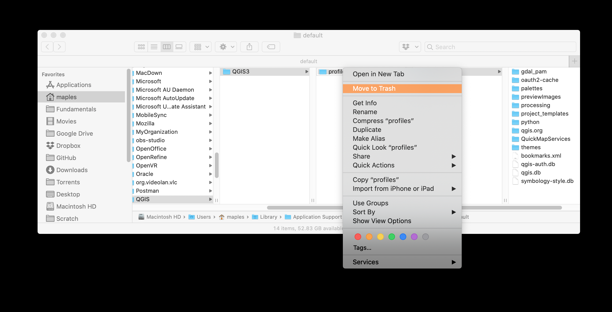

# Doing a Clean QGIS Installation on Mac

It often useful to just clean everything out and install QGIS, fresh and clean, especially on a Mac. Here's my workflow:

This workflow will guide you through:
* Creating a clean QGIS environment to prevent conflicts from leftover user Profiles
* Installing SAGANP to improve SAGA tools integration with the latest version of qgis
* Installing WhiteboxTools Plugin, to support WHiteboxTOols for raster, through the QGIS interface.
* Install QuickMapServices and populate the Additonal services menus.

## Warning
This process will delete all of you Favorites, Spatial Bookmarks, Plugins, etc...  

## Cleaning up
1. **Open** **QGIS**, and go to **Settings>User Profiles>Open Active Profile Folder**
2. Close QGIS
3. Return to the Finder window that opened to your Active Profile folder and change the view to columns, as shown below
   
4. **Right-click** the **profiles** folder and **Move to Trash**
5. In Finder, go to your **Applications** folder and right-click your **QGIS.app** and **Move to Trash**. If you have more than one version of QGIS installed, rename or delete them all.

## Install QGIS PR

1. Get the latest PR from: https://qgis.org/downloads/macos/qgis-macos-pr.dmg
2. Install it, as usual.

## Install Plugins

### Getting ready

1. Open your new installation of QGIS and go to Plugins>Manage and Install
2. Go to **Settings** and check the option to **Show also Experimental plugins**
3. **Scroll down** and click on the **Add...** button and add "**Alex's QGIS Python Plugins**" using the URL: `https://plugins.bruy.me/plugins/plugins.xml`

### SAGANP plugin
Saga tools are useful, but as a project separate from QGIS they often introduce breaking changes to the GUI in QGIS by changing the names of tool parameters, etc... SAGANP is an experimental plugin, which attempts to keep up with these changes, outside the less regular releases of QGIS, and will reduce the number of issues you have using the SAGA tools.

1. Return to the **All** tab and search for **SAGA** to find the "Processing SAGA NextGen Provider" plugin, and install it.
2. This should add a new SAGA Next Gen toolset, which duplicates the SAGA provider.
3. If you want to clean up the interface, you can disable the default SAGA provider in the Processing Tools Settings:

### WhiteboxTools plugin

**Whiteboxtools** is an excellent, performant and stable set of tools, particularly useful for hydrological modeling, terrain analysis, and map algebra. You can integrate the WBT tools in QGIS through the use of another plugin.
This assumes you have downloaded **Whiteboxtools** from https://jblindsay.github.io/ghrg/WhiteboxTools/index.html and have upzipped the resulting archive to somewhere stable on your hard drive.

1. **Return** to the **Plugins Manager** and search for https://jblindsay.github.io/ghrg/WhiteboxTools/index.html to find the "WhiteboxTools for Processing" plugin, and install it. (_Note: this plugin is from Alex's QGIS Python Plugins repo, which is why you added it,above_).
2. **Return** to the **Processing Toolbox Settings** and expand  Providers>WhiteboxTools, then double-click in the box next to WhiteboxTools executable to use the ... buton to browse to the folder where your WhiteboxTools executable is, as shown below:  

### QuickMapServices

QuickMapServices Plugin provides a convenient catalog of tiled map servcies for use as basemaps and reference layers, in QGIS.

1. **Return** to the **Plugin Manager** and search for **QuickMapServices** and install the plugin.
2. **Close** the **Plugin Manager** and go to **Web>QuickMapServices>Settings**
3. **Click** on the **More Services** tab, then **Get Contributed Pack**
4. Close the Settings DIalog after teh new servcies are loaded and return to **Web>QuickMapServices** to see all the new services available.
