# Collector for ArcGIS 101:

## Collecting Field Data with ArcGIS Collector

**ArcGIS Online** is becoming the fully functional online GIS that it has always promised. This exercise is designed as an introduction to **ArcGIS.com** and **Collector for ArcGIS**, and assumes some familiarity with spatial data and basic GIS terminology.  You will explore a  workflow for creating and managing multi-user spatial field data collection projects using nothing but a browser and consumer-grade mobile phone (iOS or Android).

You will learn to:  

* Create empty "feature classes" to hold spatial data
* Customize the data schema to the field data need
* Create "Lists" to drive in-app dropdown menus for controlled vocabularies and standardization
* Customize field survey forms for usability
* Enable attachments (such as audio, video or images)
* Enable offline, "disconnected" editing, for remote, off-network, data collection
* Deploy a field data collection app from ArcGIS.com to iOS or Android devices with the Collector app installed
* Share the app and editing role to a controlled group of users
* Download the field data collection app and basemap for offline use
* Collect data and sync to the ArcGIS.com database
* Create a simple read-only view of the live data, for monitoring data collection
* Export the data to multiple formats

By the end of the exercise, you should be familiar enough to create your own field data collection applications, customized to your research needs.

## Part 1: Create a Feature Layer  

### Login to arcgis.com  

1. Go to [https://stanford.maps.arcgis.com/home/signin.html](https://stanford.maps.arcgis.com/home/signin.html) and **Login** using your **SUNetID & Password** using the Stanford University option.  

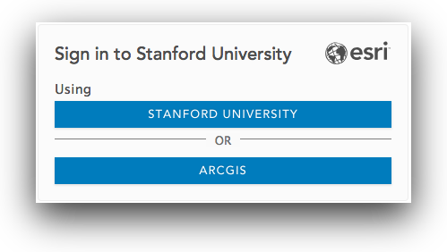  

### Create an empty feature layer

2. Go to **Content**, and in **My Content** click **Create** and choose **Feature Layer** to open the **Create a feature layer** dialog.  

3. Select the **Build a layer** category, select **Points, lines, and polygons**, and click **Create**.  

4. **Rename** the individual **point, line and polygon layers**  

  shape|name
  ----:|:----
  point|Place
  line|Path
  polygon|Area of Interest  

5. Set the **extent** for your layer and click **Next**.  

6. Provide a **title**, like "**Walking Tour (SDM)**".  *Since this must be a unique name in your organization, include your SUNetID in the name of this item, and any others in this exercise*. Click **Done**.  

  

Your **Walking Tour layer** is created and its item details page should open. In the following steps you’ll create the fields that define the form for the Places layer.  

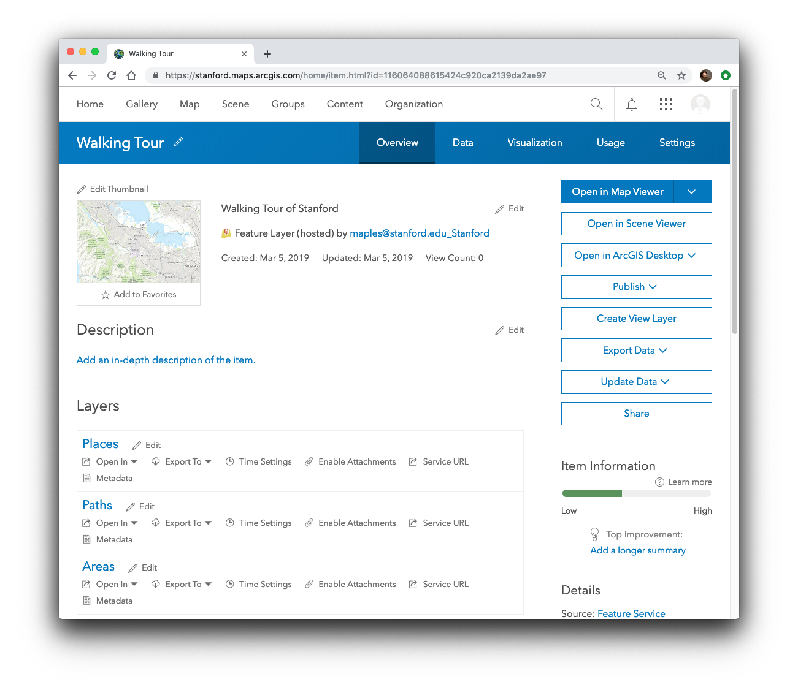   

### Add fields to the feature class

7. Go to the **Data tab** of the item page and go to **Fields**. If you created layers for points, lines, and polygons, verify that ***Place*** is chosen in the list of layers.  

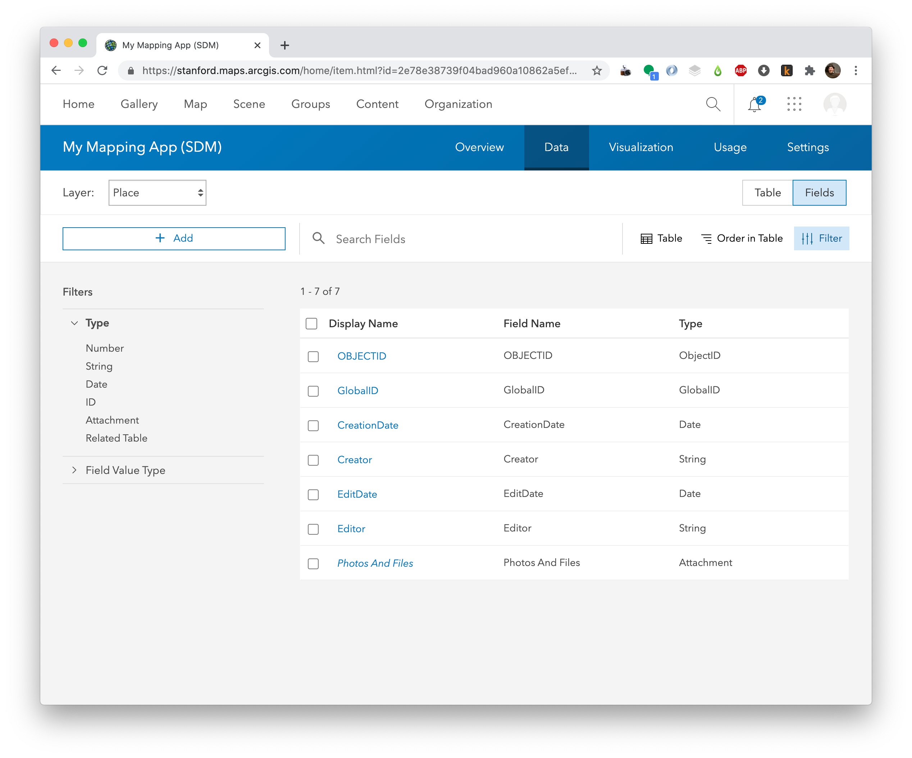  

8. Click **Add**. Give a name ***PlaceType*** and an alias ***Point of Interest Type***. Choose type: **String**. Accept the other defaults and click **Add New Field**.  

   

### Create a Domain (values list) for the places layer

9. Click ***Point of Interest*** in the Display Name list and click **Create List** to create a list of choices for the **POI Types**.
Type a label of **Art** with a code of **0**.  

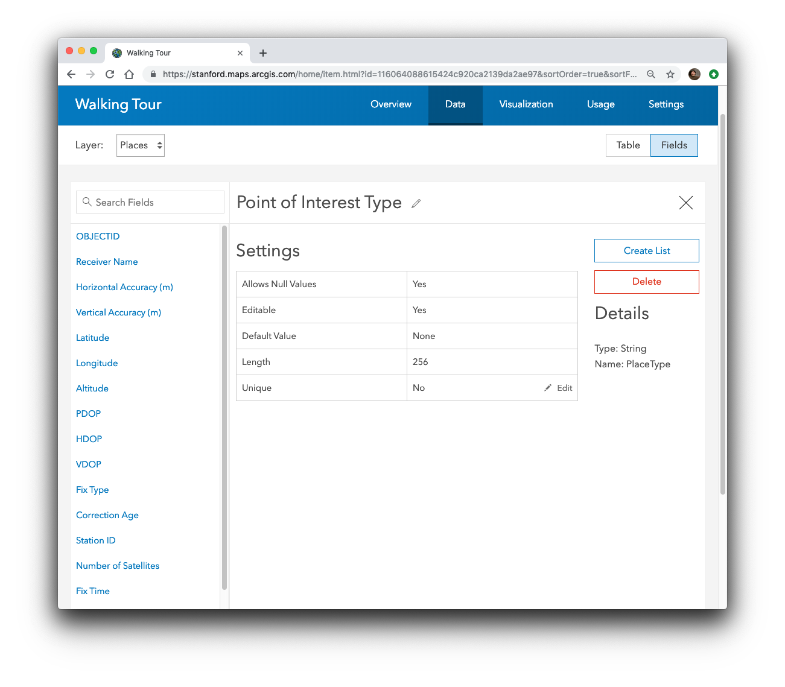  

10. Add entries for the following:  

  label|code
----:|:---
Art| 0
Architecture| 1
Gadgetry| 2
History| 3
Other| 4  

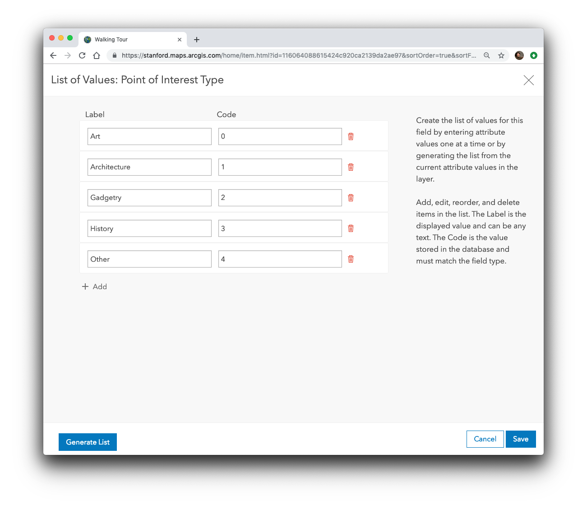  

11. Click **Save**.   
12. Create another field named ***Label*** that is a **String**.   
12. Create another field named ***Notes*** that is a **String**.  

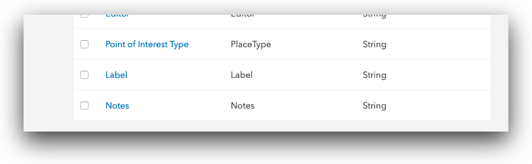   

### Enable offline editing for Collector  
This is a step that MUST be done before adding your feature layers to an ArcGIS Online map for creating your editing app.

1. Click on the Settings tab at the top of the Feature Layer's Details page.

2. Make sure that settings under the Editing section at the top are all enabled, in particular that "Enable Sync" is checked.

3. Note the other settings for controlling who and how data can be edited.

 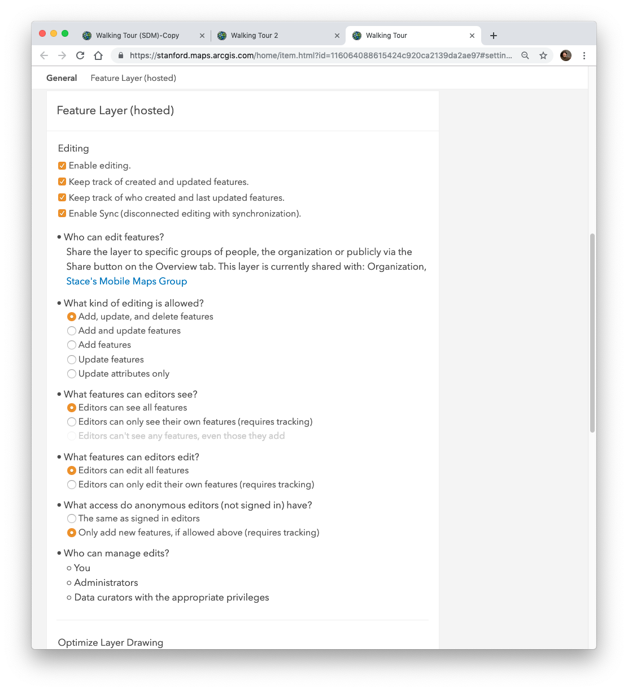  

4. Click Save to save these settings.

## Part 2: Make a map  

Now you will add the feature layers you created to an ArcGIS.com map. This map will drive the functionality in teh Collector for ArcGIS application, so everything we do from this point will be to improve the simplicity of use for our data collectors in the field.

1. Return to the Overview tab the **item page** of your layer, in the drop-down list for **Open in Map Viewer with Full Editing Control** pick **Add to new map** to start making your map.   

  

2. **Save** your map, giving it a title "**Walking Tour [*SUNetID*]**" and a **tag**.  

  

Shortening the names of our layers in the Map will simplify the appearance of those items in the resulting Collector application.

3. In the **Contents pane**, hover over the layer of places, click **More Options**, choose **Rename**, and rename the layer of places to Places.
4. Repeat for the Paths & Areas layers.

  

4. Click **Change Style** for the **Places layer**, Choose to show the **Type of place** attribute.  

  

5. Click **Options** for the **Types (Unique symbols)** drawing style.
6. Click the **symbol** next to the **Art** POI Type, click **Shape**, choose an appropriate symbol and set it to a size of **20**, then click **OK**.  

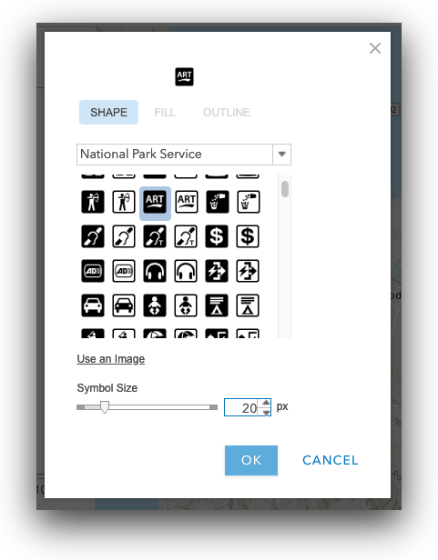  

7. Configure the symbols for the each of your other POI Types. Explore the various symbology categories available.  

  

8. Click **OK** and click **Done**.  

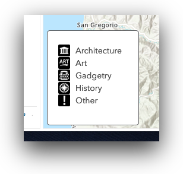  

8. Click **Edit**, click **Manage**, and click **Save Changes**.  

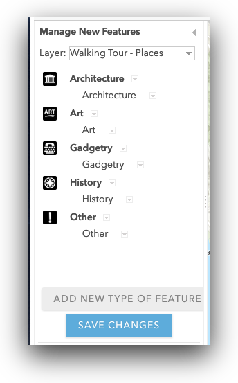  

*This creates feature templates that Collector will use as the POI types available in the app*.

9. Click on the ellipsis (...) at the end of the Places layer item and go to "Configure Pop-up"

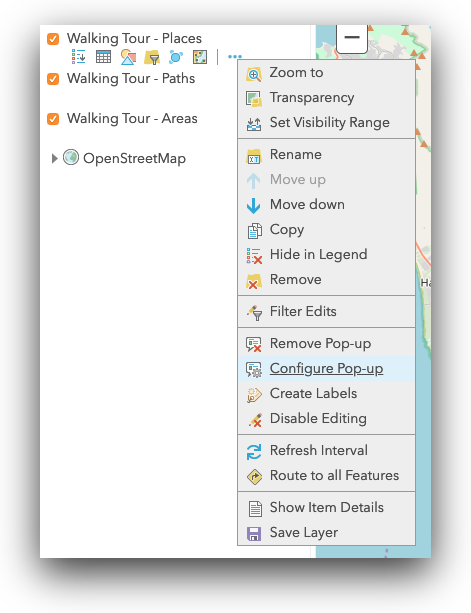

10.  Click on the "Configure Attributes" link, about half way down the "Configure Pop-up Panel."  

11. **Check**, then uncheck, the Display checkbox, to turn off the display of all attributes in the Pop-up.

12. **Scroll** down until you see the attributes you created **[{Label},{notes},{PlaceType}]** and check the **Edit** checkboxes (which will also check the Display checkbox)

  

13. **Click OK**, twice, to commit your changes and close the **Configure Pop-ups** panel.

9. **Change** the **basemap** to **OpenStreetMap**  

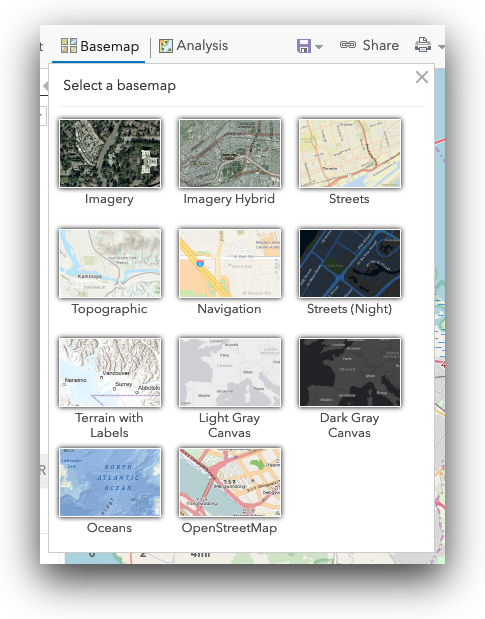  

9. **Save** the **map**.  

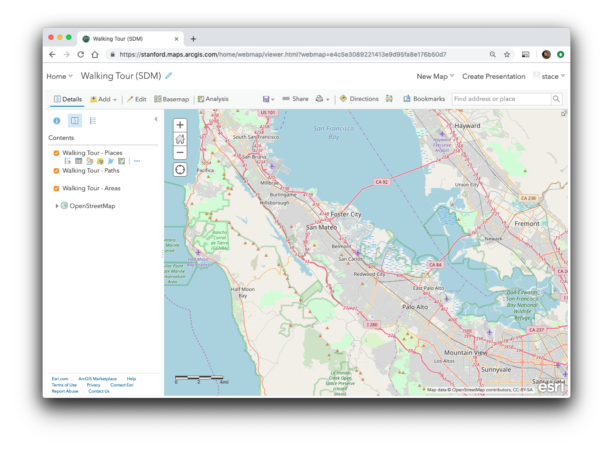  

### Enable Offline Editing

10. At the top of the Table of Contents in your map, **click** on the **Details**  button and then on the **More Details...** link to go to the Details page of your webmap.

11. **Click** on the **Settings tab** at the top of the page and scroll down to the section labeled "**Offline**."

12. Make sure that "**Enable offline mode**" is active.

13. **Save** your **map settings**, if necessary.

## Part 3: Record Points of Interest with Collector   
Open Collector, using "**stanford**" as your organization, and your SUNetID and password.  
1. Choose the map you just made.  
2. To add a feature, touch the + sign and follow the prompts.

Note: Either sign in with the same account you used to make the map, or share the map with a group and sign in as a user that is a member of that group.
Walk around campus, adding public art, historically significant locations, various technology around campus, and "other" locations (picnic tables, restrooms, water fountains, etc...).

## Part 4: Multi-user editing

Management of multiple field workers can be easily implemented through the use of **Groups**, in ArcGIS.com. You can creaate a Group with appropriate permissions (Public, Org, Members), so that anyone in that Group can access and use the deployed Map for data collection. For the reset of this exercise, I provide instructions for submitting your COllector app Map, for credit, by sharing it and the data layers in it, through an ArcGIS.com group.

### Join the Earthsys144 Mapping App Group

1. From **The Map**, on ArcGIS.com, click on the **Home** button and go to **Groups**
2. Click on the **My Organization's Groups** tab at the top, left
3. Search for **earthsys144** and click on the resulting **Earthsys144 Mapping App Group** link

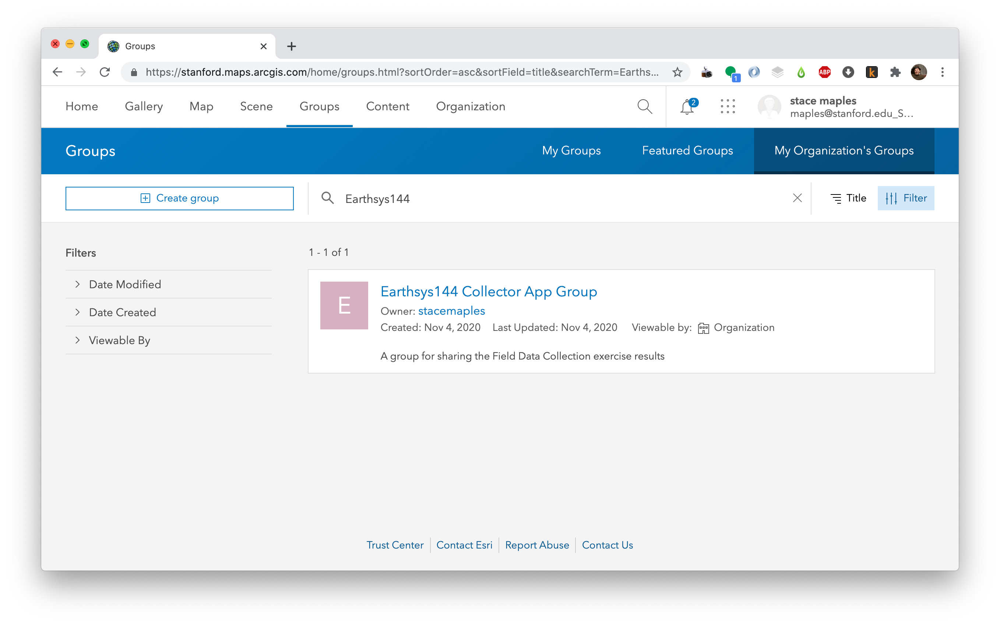

4. Click on the **Join This Group** button

### Share the map and feature layer with the group
Now that you are a member of the Earthsys144 Mapping App Group, you can share content with it. Note that that content will be shared with ANYONE who is a member of that group, and that anyone in the Group will be able to use you app for data collection. When implementing for yourself, you would obviously limit your group only those people YOU add, to control access to the Collector app.

1. Click on the Content Tab a the top of the page, to go to the **My Content** page
2. Find your **Mapping App** (it's Item Type will be **Web Map**) and check it's **checkbox**, then click on the **Share icon** that appears

3. **Click** the option to **Set sharing level** to **organization**
4. **Click** on the **Edit group sharing** button, select the **Earthsys144 Mapping App Group** and click OK

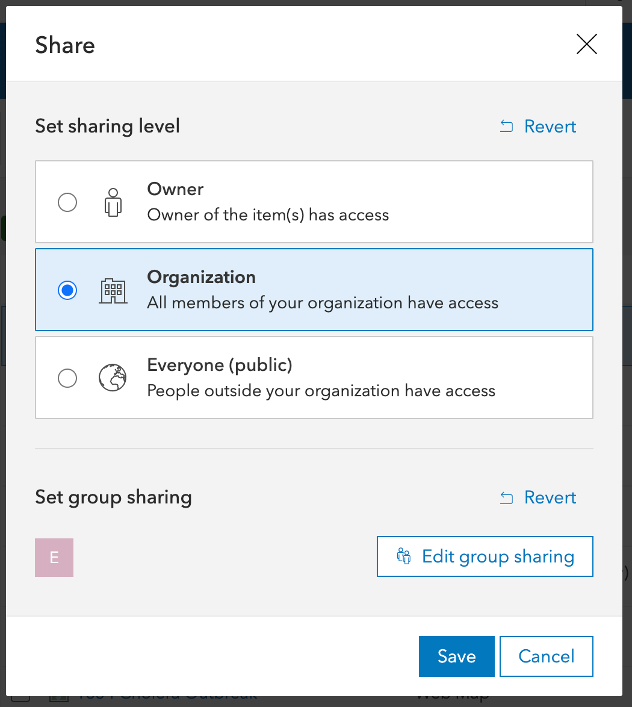

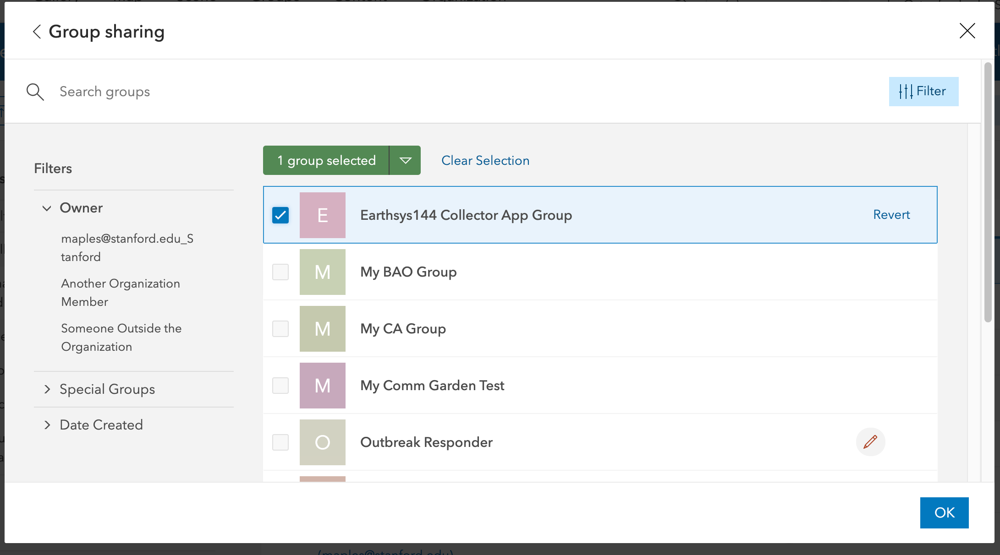

5. Click Save, then click Update to also change the Sharing options for the Feature Layer in your Map (this is necessary).

6. You Mapping app, and Feature Layer should now be visible to the members of the **Earthsys144 Mapping App Group**

## Working with the data

#### Creating a "View Layer"
You may want to share the collected data through a visualization, though obviously you won't want to share your "Full Editing Control" Map, with everyone. Creating a View Layer is a way to safely share visualizations of the data being collected, with anyone you want, without exposing the data to editing.

1. Return to your **Content page**, and find your **Walking Tour feature layer** item and click on it to go to the **Details** page.
2. Click on the **Create View Layer** button
3. Give it an appropriate name like **My Mapping App Data Public View (_SUNetID_)** and click OK

The resulting Feature Layer is a read-only view of the data being collected in your Mapping App that can be added to a New Map, filtered, symbolized, pushed to a web application and shared publicly, within the Stanford Org, or with a controlled Group, but without editing permissions.

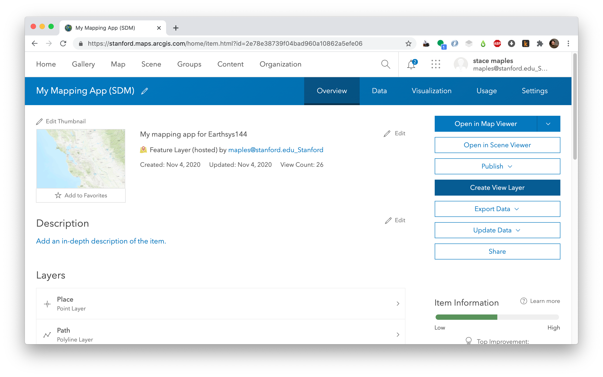

# To Turn In:

1. Join the "**Earthsys144 Collector App Group**" and Share your data collection map app with the **Earthsys144 Collector App Group**. (see above)

*This tutorial was adapted from the excellent "[Make your first Collector map](https://www.esri.com/arcgis-blog/products/collector/field-mobility/make-your-first-collector-map/)" tutorial by Kylie Donia, of Esri*.
