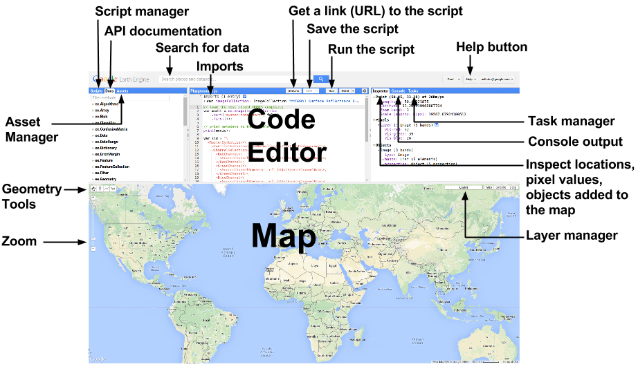

# Introduction to Remote Sensing with Google Earth Engine

## Sign into Google Earth Engine
We'll be completing these exercises using the Earth Engine code editor: [https://code.earthengine.google.com/](https://code.earthengine.google.com/)

1. Using your _mysunetid@stanford.edu_ email, login to the Code Editor: We'll be completing these exercises using the Earth Engine code editor: [https://code.earthengine.google.com/](https://code.earthengine.google.com/).
2. Once logged in, click on this link to load the sample scripts:

https://code.earthengine.google.com/?accept_repo=users/stacemaples/GEE_Intro_RS  

## An Introduction to the Code Editor Interface

It is worth noting that the Code Editor uses the javascript client API to make requests to the server.  The key point is that the Code Editor runs in the browser and all the hard processing is done on Google Servers.  Also, there are [Code Editor docs](https://developers.google.com/earth-engine/playground).

1. Editor Panel
    1. The Editor Panel is where you write and edit your Javascript code.
    2. Note that the Run button executes the code.
2. Right Panel
    3. Console tab for printing output.
    4. Inspector tab for querying map results.
        1. Click on the map and note that _there is a scale in meters associated with the zoom level_.
    5. Tasks tab for managing long-running tasks.
3. Left Panel
    6. Scripts tab for managing your programming scripts.  These are git repos hosted at Google.
    7. Docs tab for accessing documentation of Earth Engine objects and methods, as well as a few specific to the Code Editor application.  This is the definitive API reference and is populated by the server.
    8. Assets tab for managing assets that you upload.  You get 250 GB free.
4. Interactive Map
    9. For visualizing map layer output.
    10. Note layer controls.
    11. Note the geometry tools.
5. Search Bar
    12. For finding datasets and places of interest.
6. Get Link button
    13. A static snapshot of the Code Editor at the time the button is clicked.  If you change the code, get a new link.  You can email these around for easy collaboration.
7. Help Menu
    14. User guide - reference documentation
    15. Help forum - Google group for discussing Earth Engine
    16. Shortcuts - Keyboard shortcuts for the Code Editor
    17. Feature Tour - overview of the Code Editor
    18. Feedback - for sending feedback on the Code Editor
    19. Suggest a dataset - Our intention is to continue to collect datasets in our public archive and make them more accessible, so we appreciate suggestions on which new datasets we should ingest into the Earth Engine public archive.

## Script 00 - Javascript Syntax

Beginning users (especially if new to programming) often confuse commas, periods, semi-colons, parentheses, square and curly brackets.  An understanding of these syntactic elements is key to making Earth Engine work.  Carefully read and run this script for an introduction to basic JavaScript, including Hello World!, strings, numbers, comments, lists, objects (dictionaries), functions, etc.

These are client objects in browser JavaScript.  We'll see more about what this means in the next section.

**Extra Steps:**
1. **Click** on the **Get Link button** to see how you can copy a link to your script and share it.

2. Copy the link and paste it into a **New Browser Tab** to see how scripts are shared.

## Script 01 - Client vs. Server objects

Everything in the previous section was a client-side object that lives in the browser.  Client-side code is useful for a great many things, and is often necessary, for example when programming [user interfaces for Earth Engine](https://developers.google.com/earth-engine/apps).  However, client-side objects are NOT to be confused with server-side objects as demonstrated by the code in this script.  

**Important points:**

*   Printing something asynchronously requests the value of the object from the server.  To get the value in code, use `evaluate()`.  Do NOT use `getInfo()`, which is synchronous and can cause the browser to lock.
*   Read the [Client vs. Server docs](https://developers.google.com/earth-engine/client_server).  See also [the debugging doc](https://developers.google.com/earth-engine/debugging#avoid-mixing-client-functions-and-objects-with-server-functions-and-objects).

## Script 02 - Hello, Images

Here, we are finally displaying images. This script calls  two data collections:
- SRTM 30m Elevation data
- The Global Forest Change dataset - by Hansen, which is a global 12-year dataset on deforestation/reforestation dynamics, at 30m resolution.

**Important points:**

*   Note the equivalence of import and the image constructor by clicking the list icon next to the imports.
*   Inspect image bands in the console or 'Object' section of the Inspector.  Look at the dataset description to understand the bands.
*   Fiddle with the visualization parameters for your area of interest.
*   Read the [image visualization docs](https://developers.google.com/earth-engine/image_visualization).

## Script 3 - Computations on images {#section-3-computations-on-images}

Start from the previous (section 2) script or at least the same import (ALOS DSM named `dsm`).  Demonstrate several frequently-used operations.  You may need to fiddle with the thresholds for your area of interest.

**Important points:**

*   Demonstrate search for a specific locations.
*   Look at the documentation tab (e.g. `ee.Terrain.products()`)
*   Deferred execution and parallelization: pan around and watch tiles getting computed on-demand.  ([Doc](https://developers.google.com/earth-engine/deferred_execution))
*   Scale: zoom the map and note that different computations take place at different scales.  ([Doc](https://developers.google.com/earth-engine/scale))

## Script 4 - Spatial reductions {#section-4-spatial-reductions}

A _reducer_ is an Earth Engine object that represents a way of aggregating data or computing a statistic.  Demonstrate spatial reductions.  Start from the section 3 script which should have terrain and a mask already in it.  The mask is the `elevGt500` threshold image.  Select the polygon geometry tool and draw a triangle (or more complex polygon) on the map over a place where `elevGt500` is true (1).  Somewhere after the section 2 code,  add this:

Important points:

*   Demonstrate autocomplete for `reduceRegion()` signature.  Discuss named parameters.
*   Fixing `brokenDict`:
    *   It's ridiculous to do this in the first place.  But you can do it because Earth Engine will resample the input (nearest neighbor by default) to whatever scale you specify.  So we're getting 900 little pixels in each native 30 meter pixel.
    *   Fix 1: change scale back to 30.
    *   Fix 2: add `maxPixels: 1e9` to the `reduceRegion()` arguments.
    *   Fix 3: add `bestEffort: true` to the `reduceRegion()` arguments.
    *   Note: setting `bestEffort` will recompute scale such that `maxPixels` is not exceeded.  This is useful for quick and dirty statistics, but not much else, since you won't know the scale at which your computation occured.
*   The scale of the computation is set from the output.  Inputs are resampled as necessary to the scale set in the output.  **Always specify scale!**
*   The scale parameter is always in meters.
*   The output of `reduceRegion()` is a dictionary, keyed by band name, with the values the output of the reducer in each band.  That's why the threshold image is renamed.
*   Read [the reduceRegion() docs](https://developers.google.com/earth-engine/reducers_reduce_region).
*   The plural of `reduceRegion()` is `reduceRegions()` which takes a `FeatureCollection` as input. ([Doc](https://developers.google.com/earth-engine/reducers_reduce_regions))

## Script 5 - Image Collections {#section-5-image-collections}

Start over on a new tab.  Search for 'landsat 8 surface reflectance' and import the Tier 1 dataset.  Then filter and sort in various ways.

**Important points:**

*   Note that you can add an `ImageCollection` to the map.  Explore it with the inspector.
*   You can print image collections and inspect the image objects inside there (you can print a collection as long as it's fewer than 5000 elements).
*   You can programatically isolate images (if that's your thing) by time, location and/or metadata.

## Script 6 - `map()`ing {#section-6-map-ing}

Mapping a function over a collection is key to making Earth Engine work.  Start from the previous section or at least the same imports.  Map a simple function over a list.  Use the list for something useful (making annual composites).  Break things.

**Important points:**

*   Use `map()` instead of for-loops for applying an operation to every element of a collection.  (You still need for-loops for some client-side things, such as user interfaces.)
*   Fixing the broken `map()`s.
    *   Mapped functions don't necessarily know what's in the collection over which they're being mapped.  The solution is to cast the argument to the function, i.e. `ee.Number(y).add(1)`;
    *   You can't call a client function (e.g. `print(), Map.anything(), ui.Chart.anything()` ) in a mapped function.

## Script 7 - Functions (and computing NDVI) {#section-7-functions-and-computing-ndvi}

Start from the previous script.  Make a function to compute NDVI.  Test the function on the first thing in a collection.  Map the function over an image collection.

**Important points:**

*   Debug mapped functions on the first thing from a collection.  ([Doc](https://developers.google.com/earth-engine/debugging#running-a-function-on-first))

## Script 8 - Reducing Image Collections {#section-8-reducing-image-collections}

Previously, spatial reductions were demonstrated in which the inputs to the reducer are pixels in a spatial region (Script 4).  If images in a collection represent observations over time, reducing an `ImageCollection` is a temporal reduction.  In this case, a stack of pixels over time is input to the reducer.  Demonstrate several ways to `reduce()` the collection of images with NDVI.

**Important points:**

*   `image.median()` is a shortcut for `image.reduce(ee.Reducer.median())`.  The latter annoyingly appends the reducer name to the output bands (and is also more typing).
*   The reducer is applied separately to each band and each pixel.  As a consequence, output pixels may not have ever been measured by the sensor.  Different bands may come from different times and bands in adjacent pixels may also come from different times.  This can be biased by seasonality, cloudiness, missing data, etc.  You've been warned!
*   `qualityMosaic` is also called a greenest pixel composite.  The pixels in this composite were measured by the sensor.  They are whatever pixels in the stack have the highest NDVI.  That might be useful for ensuring real pixels, or controlling for phenology, but also result in unsatisfactory results over water.  The moral is that there's no perfect solution to compositing.
*   See the Docs tab for a list of all the reducers available.

## Script 9 - Compositing (more reducing) {#section-9-compositing-more-reducing}

Now that mapping a function over a collection and reducing the result has been demonstrated, it's possible to understand the Code Editor Cloud Masking examples.  Go through all those.  These are just mapping a function over the collection to mask clouds, then reducing.  Here is `ee.Algorithms.Landsat.simpleComposite()` compared to a pared down surface reflectance example (it's safe to copy-paste the Landsat 8 Surface Reflectance example instead).

## Script 10 - Classification {#section-10-classification}

Start over.  Go to the Scripts tab > Examples > Cloud Masking > Landsat8 Surface Reflectance.  (You can use any of these examples or one of the composites you already made; you may need to adjust the bands used.)  Label data are in the form of a `FeatureCollection` in which each `Feature` has a property storing its label (e.g. vegetation, bare, water).  When predictors are added to the label, it's training data for a classifier.  Use bands of the composite as predictors.  Add this to the end of the cloud masking example:

*Note that there's also charting and ensemble prediction in the EE101 repository.

**Important points:**

*   The input imagery can be anything, but you need to specify the right bands to use.
*   The label data can be anything, but you need to specify the right property to use in the label features.
*   You can get label data manually using the geometry tools, but you need to configure how they're imported ([script](https://code.earthengine.google.com/3bd5409116b3990c438032213d75c510)).
*   There are constraints in terms of number of features, number of bands, size of the classifier (e.g. number of trees in a random forest or number of depth of a CART).
*   You can only do `explain()` on a CART.

## Script 11 - Charting {#section-11-charting}

You can do this for any image collection with NDVI in it.  See also the charting example in the classification section.

**Important points:**

*   [Charting docs](https://developers.google.com/earth-engine/charts).

## Script 12 - Exporting {#section-12-exporting}

This can be demonstrated on any `Image` and/or `FeatureCollection`.  It's useful to have some visualization parameters lying around with which to demonstrate `visualize()`.  Draw a polygon (not too big) over some area of interest, name it `geometry`.  Start the tasks, click run, and discuss as you wait for the results to materialize in Drive.

**Important points**:

*   This is not the only destination for exports.  See the <code>[Export docs](https://developers.google.com/earth-engine/exporting)</code>.

## Script 13 - User interfaces {#section-13-user-interfaces}

Here is a very simple example from  [https://code.earthengine.google.com/?accept_repo=users/nclinton/ui-api-101](https://code.earthengine.google.com/?accept_repo=users/nclinton/ui-api-101)

**Important points**:

*   You need to use client-side functions and objects to program a UI.
*   Use `evaluate()` to get the value of things from the server without locking your app.
*   See the [UI docs](https://developers.google.com/earth-engine/ui) and the [App docs](https://developers.google.com/earth-engine/apps).

## Script 14 - Object based methods {#section-14-object-based-methods}

See demo repo script.

## Where to go next… {#where-to-go-next…}

1. Read through the [Earth Engine docs](https://developers.google.com/earth-engine/). Read through the [Introduction](https://developers.google.com/earth-engine/) and [Get Started](https://developers.google.com/earth-engine/getstarted) sections,  work your way through the [API tutorials](https://developers.google.com/earth-engine/tutorials), and then dive deeper into any concepts that you are interested in. From the Javascript Playground, the docs can be accessed via the menu **Help -> User guide**.
2. Join and participate in the [Google Earth Engine Developers](https://groups.google.com/forum/#!forum/google-earth-engine-developers) forum, where Earth Engine users post and answer questions about the platform.
