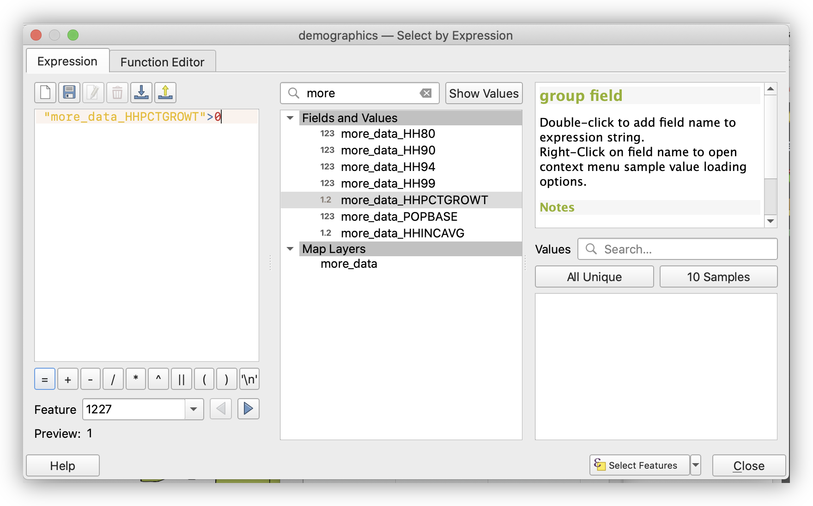
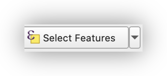

**Week 06 Lab 1: Tables Operations in QGIS**

**_What You’ll Learn:_** This Lab provides practice with tabular data management in QGIS.  In this Lab, we will view, select, re-order, and update tabular data.

You should read chapter 8 in the GIS Fundamentals textbook before performing this Lab.

**_Data_**: are in the** L7.zip**, with census data **_demographics.shp_** in decimal degree coordinates, a table **more_data.dbf**, and **_soils.shp_** in UTM Zone 17, NAD83 coordinates, and the units are meters.

**_What You’ll Produce:_** **Three maps, two of selections based on census data**, and one of a soils data set.

**Background:** Most spatial data in a GIS consist of at least two types of data, those data depicting the location and shape of objects, and text or numerical data describing the characteristics of the  objects.  These text and numerical data are most often contained in tables, and most GIS packages have some way of creating and editing these data tables.  

QGIS provides a rich set of tools for viewing and displaying attribute data.  However, you don’t have as many options for manipulating and saving new data, as with a full-featured database manager, so we’ll do some rather simple operations in this lab.  

## Examining Tables, Fields and their Properties**


1. Start **QGIS**, and use the Browser Panel to browse to your **L7 folder**, then **right-click** the layer **_demographics.shp,_** and **Add Layer to Project**. This layer contains boundaries and population data on a set of urban polygons.
2. **Add** a **basemap**, if you like, using the **QuickMapServices** plugin.
3. **Open** the **Attribute Table **(**right-click** in **TOC**, then **Open Attribute Table**).  _Note the **fields**, especially one called_ **Blkgrp**.
4. **Add** the data table named **_more_data.dbf_,** using the same method you used with the **Browser panel**.
5. **Open** the **_more_data.dbf_ ** (**right-click** in the **TOC**, then **Open Attribute Table**) _Notice that **more_data.dbf** also has a field named_ **Blkgrp**._

6. **Open the Properties** of the **demographics.shp** **layer** in the **Layers** **panel**, then click on the** Fields tab**. This should display the **name, type, and length** of each column:  


* Are the variables ordinal, nominal, or interval/ratio?
* Which variables are found in both tables?
* Which variables might serve as keys for the table, and which would be inappropriate as keys?  
_(See Chapter 8 in the textbook, if you’re unsure on these concepts) _

**Close** this window, and **Open the Attribute Table for demographics.shp**

Each record (row) in each table corresponds to each polygon in this US Census Bureau demographic data, displayed in **_demographics.shp_**.  These files were produced from U.S. Census data, which uses a variable named **Blkgrp** as a unique identifier.  Each record in our tables corresponds to a **US Census block group**.

**Inspect the Field properties**, as you did above, for the **_more_data.dbf _table**. _Note that the **BLKGRP** variable is defined in the same way as the **BLKGRP** variable in the **demographics.shp** table_. We should be able to use this as our joining variable.

The file **_more_data.dbf_** includes populations at various dates for each block group polygon, e.g., **Hh80=population in 1980**,** Hh90=population in 1990**, **etc**...  


### Table Joins

**Table Joining** is a common operation in GIS analyses.  We often want to combine data from different sources. For example, is US Census practice to distribute the Census’ cartographic boundary files separately from the demographic variables data, since users are typically interested in only a few variables, not all of  the hundreds of variables and cross tabulations that the census makes available.


1. **Open** the **Properties** for the **_demographics.shp_** **layer (_shortcut: try double-clicking on the layer name!_)** and click on the **Joins** tab. 

2. Click on the add button near the bottom left 
3. Specify the **Join layer**: **more_data**, the **Join field** (from **more_data**) as **BLKGRP**, and the **Target field** (in the **_demographics_** layer table) as **BLKGRP**.


_Note that the field names don’t have to be the same, they just happen to be in this example_

4. Now click **Apply** and **OK**
5. **Open the Attribute Table** for the **_demographics_** layer, again.


_Notice the demographics.shp table has the **more_data** fields append to the end of each record._

You’ve just successfully connected the two tables, matching the records in one table to the records in another table that have the same value for **BLKGRP**.

The field names, at the top of the column, for the fields from **_demographic.shp_** file are unchanged. The fields names from the more_data table have that **table’s name pre-pendeded**, e.g., more_data_HHINCAVG (see arrows in the figure above).

It’s important to note a few things about this Join:

* **This is a temporary join**; the original files/data have not been modified.  
* **QGIS keeps track of joins within a project**, and how to display the various joined files. If you were to display these data sets in another project, they would not appear joined.
* The **data are not copied to a new, combined, file**. Rather, this join tells QGIS to **_display_** these two data sets within this particular view, matching each row by the join variable.

### Selecting on a (Joined) Table & Calculating a Field

_IMPORTANT NOTE: It appears that there is a slight difference in the way some versions of QGIS (LTR vs Nightly Build, etc…) prepend the name of source tables to fields in a join. In the Nightly build, which I am editing this workshop with, an underscore ‘_’ is used, and in the LTR version, it appears that a decimal ‘.’ is used. Please keep these types of differences in mind when building queries. It is for this reason that using the Search in the Expression Editor is a good idea, then you are using YOUR field names, as your version of QGIS has built them._

Now, let’s select items based on the joined tables.  


1. Open the Attributes Table of demographics.  It should display both the original data plus the data from _more_data.dbf_.
2. Left click on the Select by Expression tool  on the upper frame of the table window

From the popup window (see below), we will now build the following selection equation:


`"more_data_HHPCTGROWT">0"`





3. Begin typing “**more_data_HHPCTGROWT**” in the search box at the top of the Select by Expression window, but only until you see the variable you are interested in, then **double-click** on  it to place it in the **Expression window**

4. Type the rest of the query:  `>0`
5. When you’ve created your expression, <strong>click</strong> on the <strong>Select Features</strong> button displayed along the bottom.



This should select most of the rows in the table, probably displaying them in yellow.

**Examine your selected block groups on the map and in the table, making sure that you have only selected the block groups with positive population growth.  **


1. With the **demographics layer attribute table **open, click on the button at the bottom left that currently should read “**Show All Features**” and change it to “**Show Selected Features**” and note the effect on the **attribute table**.

2. **Click** on the **more_data_HHPCTGROWT Field Header** to sort the column, by value, **ascending**. **Click**, again, to sort, **descending**.

3. Return the attribute table to **Show All Features view.
**
4. **Clear** your selection by clicking on the **Deselect All FeaturesFrom the Layer** icon above the table.

Create a Compound Selection

**Select** **blockgroups** that have:


    **BOTH**


    * population growth greater than 0
* **AND**
    * income less than $30,000

In the **Select by Expression **window, this **Expression **will be (for my version of QGIS):


```
( "more_data_HHPCTGROWT" >0) AND ( "more_data_HHINCAVG" <30000)  
```


Use the Search in the **Expression Editor **to build the expression for **your specific dataset** and **examine** your selection.  

Activate the **Move Selected to Top** button, at the top of the attribute table, to only focus on your selected features.


* Were 17 of 167 records selected?

You can verify the number at the left edge of the table. If not, re-check your selection expression_._


1. **Toggle editing**, with the **Edit Pencil tool**, and **open** the **Field calculator**. _Note its similarity to the **Expression Editor?**_
2. **Only update 17 selected features**, **Create a new field**: **Grow_Low**  

3. Assign the value of ‘1’ to these **17 selected records**, by simply typing the number **1** in the **Expression panel** and click **OK**  

4. **Check** that **1** was written to a new Column called **Grow_Low **in the **attribute table**.
5. **Invert** the **selection** with the **Invert Selection button** (at right)
6. Return to the **Field calculator**, and use the “**Update Existing Field**” to assign the value of **0** to the **Grow_Low** field for the **remaining 150 records**.  

7. Be sure to** toggle off Editing**, and **save your edits**.

8. You can clear the selection now, using the


## To turn in:

Produce a map (PDF), using the Grow_Low Field to Categorize the symbology, highlighting the blockgroups that met the criteria of our Selection.   

Be creative, and remember to include a basemap for context,  title, descriptive legend, name, scale bar, north arrow, and CRS.

_Hint: You can control the display of the Legend, when you apply the symbology by editing the values in the Legend column of the Layer Styling Panel, and sorting on Value. **all other values** can be deleted by Highlighting and clicking on the Delete Button, at the bottom._


<p id="gdcalert3" ><span style="color: red; font-weight: bold">>>>>>  gd2md-html alert: inline image link here (to images/image3.png). Store image on your image server and adjust path/filename/extension if necessary. </span><br>(<a href="#">Back to top</a>)(<a href="#gdcalert4">Next alert</a>)<br><span style="color: red; font-weight: bold">>>>>> </span></p>


**Saving a Copy of a Joined Layer and Table**

**Many operations will default to acting <span style="text-decoration:underline;">only on</span> the selected records**, if there is a **selected subset**. Failure to clear an active selection will often produce partial results.


* **Select** the **demographics.shp layer** in the **Layers panel**, and open the attribute table.
* **Unselect** all features in the table, using the methods used before above.
* Then right click on the demographics.shp in the **Layers panel**, and **Export>Save Features As...** a new shapefile named something like **tablejoin.shp**.  

This step copies the data in your temporary join to permanent storage, as a shapefile.  All items from the joined tables are saved to a new, usually larger table, with associated polygons (or points or lines).

Note that often the **column names are not copied**, e.g., each of the joined table columns is named something like “**more_data, more_data1, more_data2**….”  Easy, if tedious, to fix by renaming.   If your installation doesn’t transfer column names, you can use the steps below to fix this:


* Open a new QGIS project, and add only the tablejoin.shp that you just exported.
* **Open the attribute table** for your **tablejoin** **layer**
* **Add** and **open** the **more_data.dbf** table, and sort in ascending order on the column named **BLKGRP** (remember, click on the name until you have an upward pointing triangle)
* Also **sort** the **tablejoin.shp** attribute table by the **BLKGRP** attribute.
* Look at the set of rows, and notice how the columns match those in demojoin shapefile, that is, there is both a row and column correspondence.

We’ll want to change the **Field Names** in the exported **tablejoin.shp shapefile** to reflect those originally in the source **more_data.dbf **file.

We will use the **Refactor tool,** described on the next page, to **assign the name HH80 to the more_data_ variable,  assign HH90 to more_data_1, and so on** until the end.  Note that we do not assign BLKGRP to any of the new columns. As you might have noticed in the original join, and the columns of the exported file, **BLKGRP** is not copied, but rather the value comes from the original demographics shapefile.  


* Find or display the Processing Toolbox (if not shown, remember View>Panels or Processing>Toolbox

* **Type ‘Refactor’ **into the **Search** at the top of the **toolbox**
* Double-click on the **Refactor fields tool **

This should open the Refactor table, shown in the figure below:

The target layer (“Input layer”) is listed near the top. Once the target layer is specified (here **tablejoin.shp**), the tool lists the source expression, Field name, type, and other characteristics of the existing fields.

We can modify the Field name directly.


1. Double click on the field name cell (<span style="text-decoration:underline;">not</span> the source expression cell), and manually type the new name.
2. Do this for each of the Field names you wish to change. After specifying the output file and editing all the Field names, your table should look something like the above screenshot.
3. **Browse** and **name** the **Refactored (Output) file**. Note that you can also overwrite the existing layer, but this isn’t recommended.  

4. **Click run**, and examine the attribute table of the resulting layer (which should be added to your project, by default).

**More Calculating into New Columns**

Let’s practice adding items (columns), and modifying the values.  

We would like to know total per capita income.  We calculate this by multiplying the average household income by the number of households, and then dividing the result by population.  


1. Toggle the editing on

<p id="gdcalert4" ><span style="color: red; font-weight: bold">>>>>>  gd2md-html alert: inline image link here (to images/image4.png). Store image on your image server and adjust path/filename/extension if necessary. </span><br>(<a href="#">Back to top</a>)(<a href="#gdcalert5">Next alert</a>)<br><span style="color: red; font-weight: bold">>>>>> </span></p>


, then add a new column

<p id="gdcalert5" ><span style="color: red; font-weight: bold">>>>>>  gd2md-html alert: inline image link here (to images/image5.png). Store image on your image server and adjust path/filename/extension if necessary. </span><br>(<a href="#">Back to top</a>)(<a href="#gdcalert6">Next alert</a>)<br><span style="color: red; font-weight: bold">>>>>> </span></p>


.
2. Name the field something like  TotIncome, no spaces, no more than 10 characters,
3. Make the Type “Decimal number”, length 12, Precision 2, then left click on OK
4. Add a second field, name it per_cap_in, with the same specifications as Tot_Income.
5. Open the Field Calculator tool

<p id="gdcalert6" ><span style="color: red; font-weight: bold">>>>>>  gd2md-html alert: inline image link here (to images/image6.png). Store image on your image server and adjust path/filename/extension if necessary. </span><br>(<a href="#">Back to top</a>)(<a href="#gdcalert7">Next alert</a>)<br><span style="color: red; font-weight: bold">>>>>> </span></p>


, and calculate the total income as

     **<code>HH90 * HHINCAVG</code></strong>  


6. Click OK.


<p id="gdcalert7" ><span style="color: red; font-weight: bold">>>>>>  gd2md-html alert: inline image link here (to images/image7.png). Store image on your image server and adjust path/filename/extension if necessary. </span><br>(<a href="#">Back to top</a>)(<a href="#gdcalert8">Next alert</a>)<br><span style="color: red; font-weight: bold">>>>>> </span></p>


    After the calculation, inspect the **TOTINCOME** column you just calculated.


7. Use the **Field Calculator** to **Create a new field** called **PERCAPINC** and **calculate** the per capita income as:

    **<code>TOTINCOME / POPBASE</code></strong>


Again, check the results.


<p id="gdcalert8" ><span style="color: red; font-weight: bold">>>>>>  gd2md-html alert: inline image link here (to images/image8.png). Store image on your image server and adjust path/filename/extension if necessary. </span><br>(<a href="#">Back to top</a>)(<a href="#gdcalert9">Next alert</a>)<br><span style="color: red; font-weight: bold">>>>>> </span></p>


8. Save your edits, and toggle editing off.


## To turn in:

Compose a map (PDF), with** 5 Categories **using **PERCAPINC**.  Remember to include all the usual required map components, and note the classification method you used for the choropleth map you are making.

Refer to [John Nelson’s blog post](http://uxblog.idvsolutions.com/2011/10/telling-truth.html) on Classification in choropleth mapping for advice on determining the appropriate classification method for this data.

Note that you can view the **Histogram tab** for your Field Values in the Layer Styling Panel, when your layer is selected to explore your options. To activate the Layer Styling Panel, on the **Main Menu:** **View>Panels>Layer Styling**


<p id="gdcalert9" ><span style="color: red; font-weight: bold">>>>>>  gd2md-html alert: inline image link here (to images/image9.png). Store image on your image server and adjust path/filename/extension if necessary. </span><br>(<a href="#">Back to top</a>)(<a href="#gdcalert10">Next alert</a>)<br><span style="color: red; font-weight: bold">>>>>> </span></p>


**Creating New Tables & Joining Tables**

Creating a table and joining it to existing tables is a common operation.  Often, this join involves a one-to-many relationship between tables. Each record in one table matches many records in the second table. **For example, a typical county may have approximately 80 different soil types, but over 100,000 different soil polygons of these types.** Therefore, we may have properties for each of the 80 different types, e.g., crop productivity, engineering properties, moisture characteristics.  We may format these in a table, and join this table to our existing county data layer. The repeated properties aren’t copied, just displayed for the appropriate polygon. This saves space, because we don’t have redundant copies of the soil properties information saved for each instance of a soil polygon in our data layer.

This exercise will give you practice in creating and joining tables, and the other techniques you learned in the first section of this lab

**Table Joins**


1. Open a new blank project, and add the **_soils.shp_ data layer**

2. Right-click on the **soils layer** and go to **Layer CRS>Set Project CRS from Layer**

3. Set a **Categorical symbology** based on the variable **SOIL_TYPE (**Don’t forget to click “Classify” to see your symbols**)**


You should have a layer displayed something similar to that on the right:

The **SOIL_TYPE** attribute contains a code corresponding to the soil type of each individual polygon.  Notice there are 15 different soil types designated by numbers between 18 and 69.  There are 122 different soil polygons.  

In this exercise you will use the **SOIL_TYPE** variable in the soils shapefile as the **join item**, or **join column**. **_This is the “key” variable that will be used in a join_**.  This join matches the table rows for layer soils.shp to a new soil properties table you will import.

Let’s examine **SOIL_TYPE**, or proposed “key” or join column in the target table, via the **Properties>Fields panel**.

This should display the window at the right:  

Note the **properties** of the **SOIL_TYPE** item, **especially the Type**, but **also the length and precision**. It is generally best for join keys to have the same type in both tables, e.g., we wouldn’t want to try to join an int to a double, or to text variables.

Now we need to download a new data table with information not included in the current table. We’ll then join this new table to **soils.shp**.

Download the  **[SoilProperties.csv](https://docs.google.com/spreadsheets/d/1iD5DjOD3nREz_jGUGGMMLikyvq23z9LrmB6zJWiJBjM/edit?usp=sharing), or comma separated value file**.  This is a text file with commas between each column entry, with a line in the file corresponding to each row.  **Excel, OpenOffice, Google Sheets or LibreOffice** are all spreadsheet software that allow you to easily enter the data in cells, then **[export it as a CSV](https://docs.google.com/spreadsheets/d/1iD5DjOD3nREz_jGUGGMMLikyvq23z9LrmB6zJWiJBjM/edit?usp=sharing) **formatted file, so if you ever need to create a table of this sort, its quite easy.

**Here is the link for the table you will download:**

[https://docs.google.com/spreadsheets/d/1iD5DjOD3nREz_jGUGGMMLikyvq23z9LrmB6zJWiJBjM/edit?usp=sharing](https://docs.google.com/spreadsheets/d/1iD5DjOD3nREz_jGUGGMMLikyvq23z9LrmB6zJWiJBjM/edit?usp=sharing)


1. Once you have the **[Soil Properties Google Sheet](https://docs.google.com/spreadsheets/d/1iD5DjOD3nREz_jGUGGMMLikyvq23z9LrmB6zJWiJBjM/edit?usp=sharing)** open, use **FIle>Download>Comma-separated values **to download to your  computer**.**

2. Browse to the location that you downloaded the **SoilProperties.csv** to and **right-click** it to **Add Layer to Project...  
**
3. This should add the table to your** QGIS Layers panel**.  Left-click and open the new table, verifying the values for rows and columns.

4. Examine the **attributes** of the _SoilProperties.csv_ table

5. **Join** the **soils layer attribute table** and the **SoilProperties.csv** table you just added, using the **Join tab**, from the  **soils layer Properties**. Remember to use the common field **SOIL_TYPE** to join the files. If you are unclear on how to join, refer to the instructions on joining earlier in this lab.

6. Open the **Attribute Table **of your newly joined **soils layer**  to confirm the new data  has been properly joined.


<p id="gdcalert10" ><span style="color: red; font-weight: bold">>>>>>  gd2md-html alert: inline image link here (to images/image10.png). Store image on your image server and adjust path/filename/extension if necessary. </span><br>(<a href="#">Back to top</a>)(<a href="#gdcalert11">Next alert</a>)<br><span style="color: red; font-weight: bold">>>>>> </span></p>


7. Note that, although you have many more records in your original **soils layer** (122) than your SoilProperties.csv (15)


## To turn in:

After you’ve completed the join, create a map (PDF) using the new soils data.  


* Display soils in a categorical map using the **NAME** field, added from the **SoilProperties.csv**  
* Use the Add Attribute Table tool

<p id="gdcalert11" ><span style="color: red; font-weight: bold">>>>>>  gd2md-html alert: inline image link here (to images/image11.png). Store image on your image server and adjust path/filename/extension if necessary. </span><br>(<a href="#">Back to top</a>)(<a href="#gdcalert12">Next alert</a>)<br><span style="color: red; font-weight: bold">>>>>> </span></p>


 to add your **SoilProperties.csv** table to your layout. Experiment with the **Item Properties **(particularly the **Attributes Button** to clean up the header labels), for formatting the table.
* Remember that **unchecking Auto update** for your **legend** allows you to click (_AND right-click, or ** **button**, **hint hint_)  on individual items in the legend and remove or edit (Edit item button:

<p id="gdcalert12" ><span style="color: red; font-weight: bold">>>>>>  gd2md-html alert: inline image link here (to images/image12.png). Store image on your image server and adjust path/filename/extension if necessary. </span><br>(<a href="#">Back to top</a>)(<a href="#gdcalert13">Next alert</a>)<br><span style="color: red; font-weight: bold">>>>>> </span></p>


**)** their appearance in the layout.

* Add the usual map elements (title, name, CRS, scale, basemap, orientation, etc…), and export a **PDF** of your map.


<p id="gdcalert13" ><span style="color: red; font-weight: bold">>>>>>  gd2md-html alert: inline image link here (to images/image13.png). Store image on your image server and adjust path/filename/extension if necessary. </span><br>(<a href="#">Back to top</a>)(<a href="#gdcalert14">Next alert</a>)<br><span style="color: red; font-weight: bold">>>>>> </span></p>


I’d like to stress the utility of what you’ve just done.  You will often want information grouped and displayed in different ways, and joins are then used to add information to and produce maps, often from pre-existing boundary datasets.  Geographic data may be joined to many different sets of tabular data that aggregate characteristics we are interested in. These joined sets may be selected based on many combinations of attributes, greatly increasing the flexibility and utility of data in a GIS.
