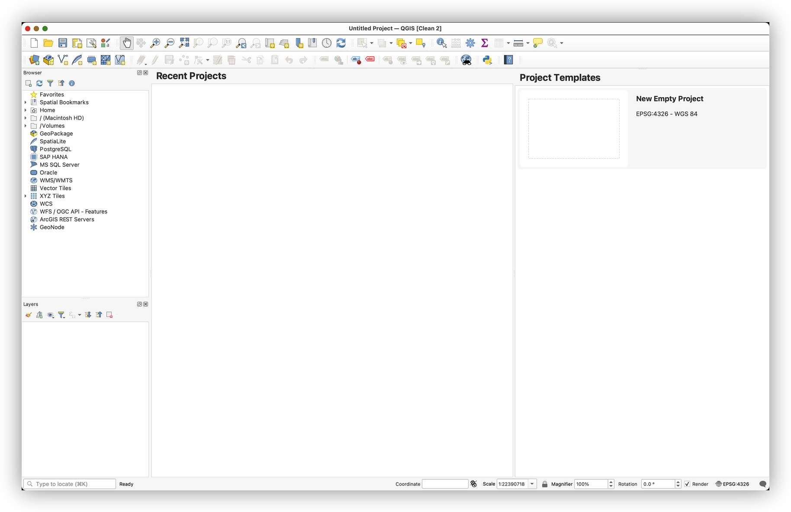

# Week 01 Lab 01a - Doing a Clean QGIS Installation (on Mac)

Here, I describe the installation of QGIS on a Mac, in particular, because of some of the security settings obstacles that the MacOS present. The QGIS installer for WIndows is straightforward, and fairly self-explanatory.

## For Windows Users
Here is the main download link for QGIS, where you can find the Mac, Windows and Linux versions, in one place:  
https://www.qgis.org/en/site/forusers/download.html

Here's a recent walkthrough of the Windows installation process:  
https://www.geeksforgeeks.org/how-to-install-qgis-on-windows/

Note that once you have QGIS installed, adding the plugins, etc... will progress in nearly identical steps.

This workflow will guide you through:

* Installing QGIS PR (Pre-release) on a Mac
* Installing SAGANP to improve SAGA tools integration with the latest Pre-Release version of QGIS
* Installing WhiteboxTools Plugin, to support WhiteboxTools for raster, through the QGIS interface.
* Install QuickMapServices and Import basemap Services.

## Cleaning Up (if you already have a previous version of QGIS)

We will be using the latest Pre-Release version of QGIS, which should have all the latest tools and functionality we want. If you have previously installed QGIS PR, you will need to delete the QGIS.app from your Applications Folder, before installing with the directions, below.

`Note: QGIS PR and QGIS LTR (Long-Term Release) are released with different *.app names, so that you can run the LTR and PR versions of the software on the same machine. If the *.app in your Applications Folder is named QGIS-LTR.app, you will not need to delete it, since the PR version installs as QGIS.app`

1. Browse to your Application folder, in Finder
2. Right-click on the QGIS.app app, and 'Move to Trash'

## Install QGIS PR

1. **Download** the latest **PR** from: https://www.qgis.org/en/site/forusers/download.html
2. **Right-click** the **DMG** File and select **Open**
3. It will take a few minutes to decompress and validate the DMG file.
4. Once the Installation Package opens, **Drag-and-drop the QGIS app icon, into the Applications Folder icon**, to install the app.

5.

## Launching QGIS, the 1st Time.

QGIS is not yet notarized as required by macOS Catalina+ (10.15) security rules.
1. On first launch, please **right-click on the QGIS app icon, hold down the Option key, then choose Open**. This should result in a warning pop-up:

2.** Click OK**, to dismiss the error.
3. Open your **Mac System Preferences**, and go to the **Security & Privacy settings**.
4. Click on the **General tab** at the top, and you should see something like this:

5. Click **Open Anyway**, then click **Open** at the next warning:

6. QGIS should launch, at this point, but if not, return to your Applications folder and try opening QGIS.app, again. This time, it should work.

## Getting QGIS ready to use

### Create a New User Profile

This step will create a new User Profile, which is  useful when troubleshooting weird errors, or after an upgrade. This process will create a new, clean User Profile, and reset to the installation default settings for QGIS. Plugins and customizations will need to be reinstalled. It will not delete your old profile, and you can move back and forth between profiles, from the **Settings>User Profiles>** menu.

1. In the QGIS App, go to **Settings>User Profiles>New Profile**...
2. Name the profile something to identify it,  and click OK.

## Install Plugins

### QuickMapServices

QuickMapServices Plugin provides a convenient catalog of tiled map services for use as basemaps and reference layers, in QGIS.

1. go to **Plugins>Manage and Install** and search for **QuickMapServices** and install the plugin.
2. **Close** the **Plugin Manager** and go to **Web>QuickMapServices>Settings**
3. **Click** on the **More Services** tab, then **Get Contributed Pack**

4. Close the Settings Dialog after the new services are loaded and return to **Web>QuickMapServices** to see all the new services available.

### SAGANP plugin

Saga tools are useful, but as a project separate from QGIS they often introduce breaking changes to the GUI in QGIS by changing the names of tool parameters, etc... SAGANP is an experimental plugin, which attempts to keep up with these changes, outside the less regular releases of QGIS, and will reduce the number of issues you have using the SAGA tools.

1. Return to the **All** tab in the **Plugins Dialog** and search for **SAGA** to find the "**Processing SAGA NextGen Provider**" plugin, and **install** it.
2. This should add a new **SAGA Next Gen toolset**, which duplicates the SAGA provider. When using any tools from the SAGA toolkit, you should always prefer the SAGANP version of the tool.

### WhiteboxTools plugin (If you are feeling adventurous!)

**Whiteboxtools** is an excellent, performant and stable set of tools, particularly useful for hydrological modeling, terrain analysis, and map algebra. You can integrate the WBT tools in QGIS through the use of another plugin.

This assumes you have **downloaded** **Whiteboxtools** from https://www.whiteboxgeo.com/download-redirect/ and have **upzipped** the resulting archive to somewhere stable on your hard drive (I put mine at `/Users/maples/WBT`).

1. **Return** to the **Plugins Manager** and search for "`whitebox`" to find the "WhiteboxTools for Processing" plugin, and install it.
2. **Return** to the **Processing Toolbox Settings** and expand  Providers>WhiteboxTools, then double-click in the box next to **WhiteboxTools** executable to use the ... button to browse to the folder where your WhiteboxTools executable is, as shown below:  

You'll get another warning about unsigned software, as when you first install QGIS. The Procedure is essentially the same:

1. Go to **Mac>System Preferences>Security & Privacy>General**, and click on **Open Anyway**.

Note that **WhiteboxTools** has some plugins that you can find under the `WBT/plugins/` directory, wherever you saved it. **These programs will likely not work properly, until you use the above method on each individual plugin executable**, which are the files with the blackbox icons, in the image, below. We will be making use of these tools, later in the quarter, so it is good to know how to troubleshoot them, if they don't initially work properly.

# To Turn In

4. Return to **Web>QuickMapServices** to see all the new services available.
5. Select the **Google>Hybrid** basemap
6. **Create a Screenshot** image of your desktop, showing QGIS, with the Google Hybrid basemap loaded, and upload it to Canvas.
