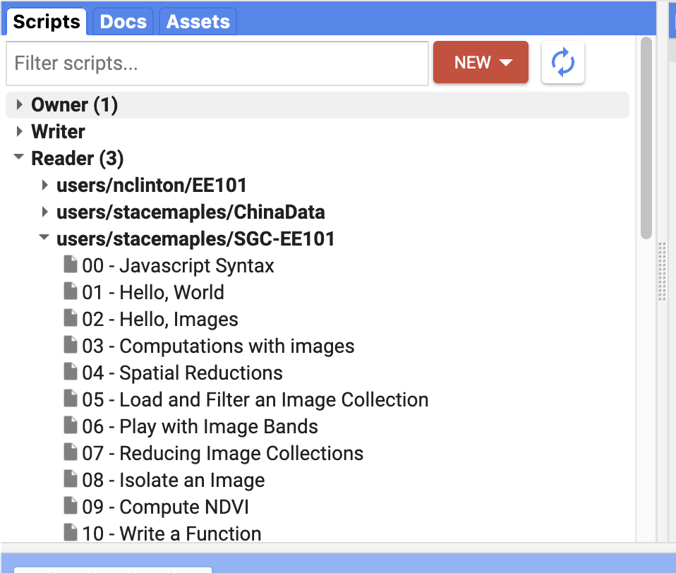

# Testing your access to Google Earth Engine

Most of you should currently be enrolled in our Google Earth Engine enterprise account. the following steps will confirm you have access, and give you some material to explore with, if want to work with the platform before we get to remote sensing, let in the Quarter.

1. Open [this link](https://goo.gl/9f9NgB) `https://goo.gl/9f9NgB` and login with your `SUNETID@stanford.edu` credentials
2. In the resulting Google Earth Engine Code Editor window, you should see a set of sample scripts, under **Scripts>Reader>users/stacemaples/SGC-EE101**

# To Turn In:
1. Load one of the scripts into the Code Editor Window, by clicking on it.
2. Run it, see what it does,...
3. Pick another, and do it again...
4. Find a favorite script, and add your `SUNETID@stanford.edu` in a comment, on a new line at the bottom, using two forward slashes at the beginning of the comment, like this:

   `//maples@stanford.edu`
5. Click the Dropdown arrow on the **Save** button and **Save as...**

6. Click OK to Save a Copy of the script

7. You can use the default File Name and Path, with a Commit Message: "`my first script edit`"
8. Click OK, to save to your repo

_Note that you may see other messages at some point, about creating a repo, etc,... if you have never logged in before. Accept the defaults for these messages._

9. Finally, click on the Get Link button, and Copy the Shareable Link, to **turn in on Canvas**.

----

### In case you want more...

At this point, that's all you need to do. If you are feeling adventurous, you can start clicking on the sample scripts to load them into the Code Window, then click Run, to see what they do.

We'll go through these scripts, together, later in the Quarter, but if you are curious, here's an early peek at what we will be doing:

[Google Earth Engine 101: An Introduction for Complete Beginners](https://arcg.is/0DmS590)
