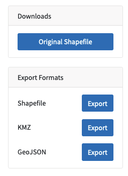
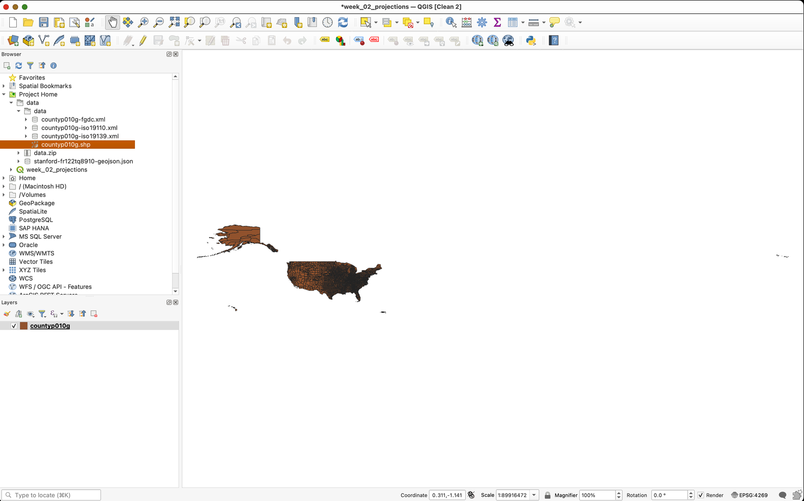
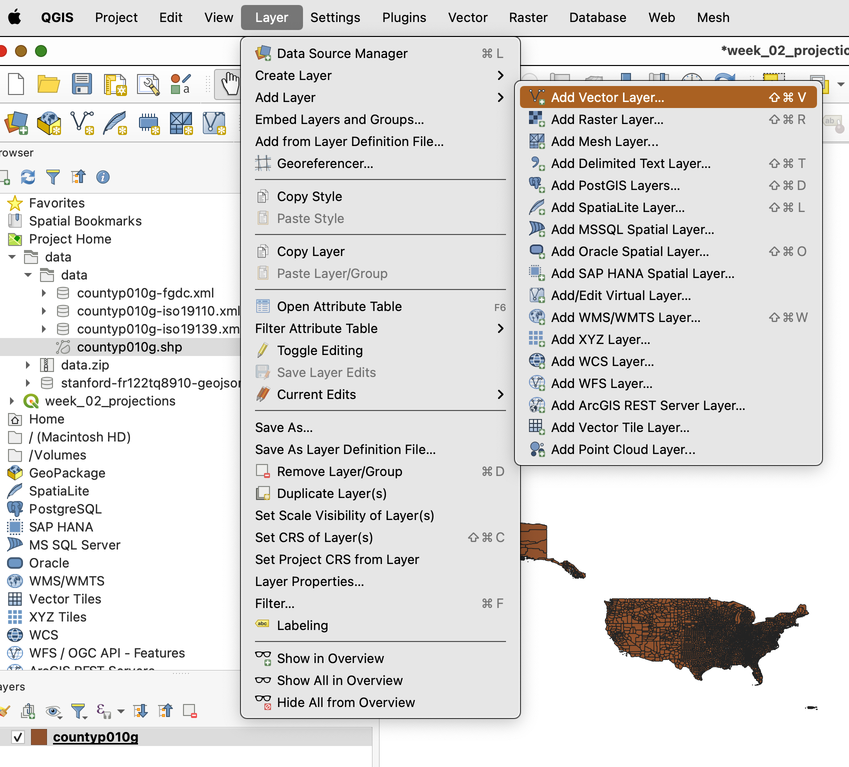
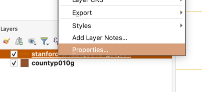
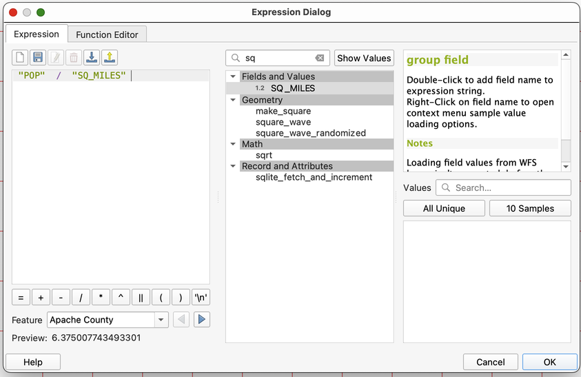
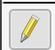
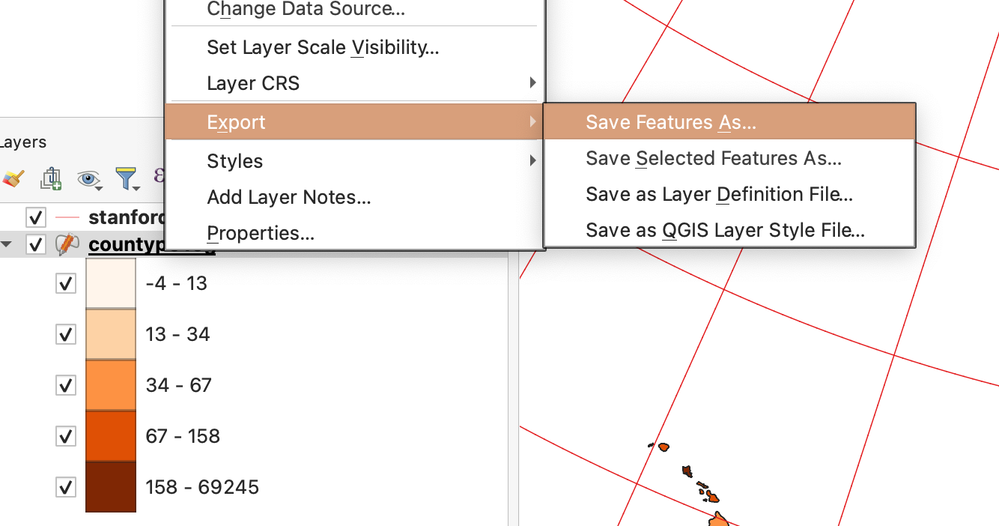
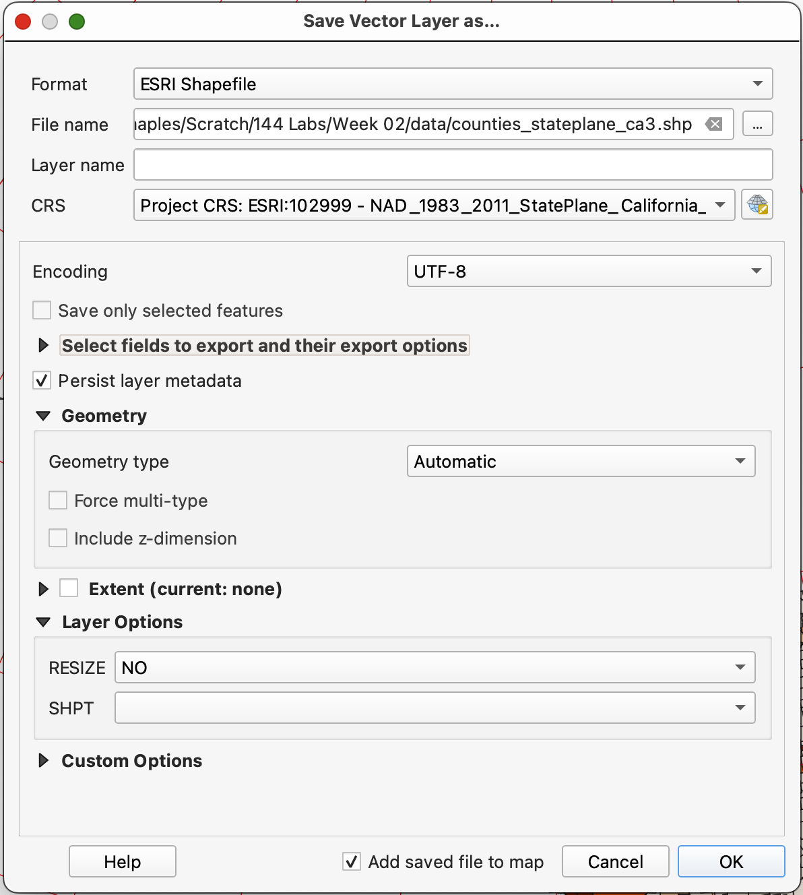

# Coordinate Systems, Projections, Geodesy, and Measurements
## Objectives  

Upon completion of this lab, you should be able to:
* Articulate the relationship between the coordinate reference systems of the Project and Layers it contains.
* Examine and change the CRS (coordinate reference system) of the Project.
* Calculate new fields using expressions in the Field Calculator
* 'Project' data layers to new CRS.
* Create a custom CRS, centered on a location of your choice.
* Identify and manipulate the True Lines of Scale for a projection.
* Understand the difference between Ellipsoid Height and Orthometric (GEOID) Height, and calculate the difference, for any location.

## Projections & Measurement Error

In this Lab Assignment, we will be exploring Projections & Geographic Coordinate Systems and the effect they have upon spatial measurements. We'll calculate the area of our

### Data

The datasets for this exercise include the County Boundaries as polygons and a 10-degree "Graticule" as lines. These datasets will be downloaded from Stanford's https://earthworks.stanford.edu spatial data catalog. In order to explore the difference between basic data formats, we will download one layer in shapefile format and one layer in GeoJSON.

1. **Create a Project Folder** (something like _/Week02Labs_), on your hard drive, to save the data and QGIS Project files, within, and keep all of the content from the project in one place for portability (we'll discuss this idea, more, later).

#### Download the data from:

2. Download the following datasets from Earthworks, into your **Project Folder**.

  * Please **Download** the **original shapefile**, using the **Original Shapefile** button, for the _1:1,000,000-Scale County Boundaries of the United States, 2014_ - https://earthworks.stanford.edu/catalog/stanford-wg010mf7692
  * Please **Download** the **GeoJSON** version, using the **Export Formats>GeoJSON** button for the _10-Degree Graticule Grid, World, 1:10 million, 2012_ - https://earthworks.stanford.edu/catalog/stanford-fr122tq8910

3. **Browse** to where you saved these **files**, and **unzip them**, if necessary.

### Create a New Project

Now, we will create a new project file to add our data and make our calculations, within.

#### A word about the relationship between your data and your project files.

_Be aware that a Project File DOES NOT CONTAIN THE DATA THAT YOU ADD TO IT, BUT ONLY LINKS TO THE DATASETS! This idiosyncrasy of GIS Projects, in general, means that if you want to move your project, best practice is to put your datasets and project files into the same folder. It's fine to put data into a_ `/data/` _folder, if you like to be tidy, but that_ `/data/` _folder should be nested under a project folder, that also contains your project file. If you want to move the project, or share it with others, you want to move, or .zip compress, the whole project folder, with everything underneath it._

1. **Open QGIS**, if not already open.
2. **Click** on the **New Project** button 
2. **Click** on the **Save** button 
3. **Browse** to your **Project Folder** and name the project  something like `week_02_projections.qgz`  and **click Save**.

## Add the Data

We'll explore adding data to this new project using two common methods.

#### Drag & Drop Method

1. In the **Browser Window**, which should be on the right side of the QGIS window above the Layers panel, **browse to the Project Folder** you created and saved your data and project file to and expand the folder that your data is saved in.

_HINT: If you saved your Project File to the same folder as you `/data/` folder, or you data, you should be able to simply Expand the Home folder that shows up near the top of the Browser panel. The Home folder is always the folder that the currently open project file is in._

2. **Select**, **Drag-and-Drop** the `countyp010g.shp` file, into the Map Canvas to add it to the project.

3. **Click** the **Save Button** to save the change you have made to the **Project file**.

#### Add Data Dialog Method
 Now we'll use an alternative method for adding data to QGIS, from the **Data Source Manager**. As you are adding the dataset, be sure to take a little time to examine all of the spatial data types that QGIS can ingest. Don't worry too much about what each source type is, as we'll cover most of these through the course of the Quarter, for now just note that QGIS supports many different data types, natively...   

 1. From the **Main Menu**, go to **Layer>Add Layer>Add Vector Layer**  

 2. Use the **Browse button**  to **browse** to the location that your **GeoJSON** version of the Graticules was downloaded.  

 3.  **Select** the **GeoJSON** file and **click Open**, then **Add**, to add the layer to the Map Canvas.

 4. You will see the above Select Transformation dialog, immediately.

_Selecting a transformation is necessary when you have layers with different Geographic Coordinate Systems, in your project. In this case, we will accept the default_ `EPSG:4326 - WGS84 to EPSG:4269 - NAD83` _transformation, which will cause the GeoJSON layer we have just added to "**Project-on-the-Fly**" to the Geographic Coordinate System of the Project. We'll dig into this more in the next section of the lab_

 5. **Click OK** to accept the suggested **Transformation**, then **click Close** to close the **Data Source Manager**.

 6. **Save** your **Project**.    

### Explore the Data

Let's quickly take a look at the data we have added to our Project. Here, note that once vector datasets are in QGIS, they essentially behave the same. Yay

1. First, use the **Zoom Button**  to **draw a box** around Alaska and the Continental US, which should Zoom to the extent shown, below (colors are assigned randomly, so you may not see the same colors in your map canvas).

#### Open the Attribute Table

1. Right-click on the `countyp010g` Layer in the Layer panel, and select **Open Attribute Table**.
  

**Note the attributes** we have available to us, and that for every "county polygon" in the dataset, there is a corresponding record, or row, in the attribute table, containing the properties of the county it refers to, such as `ADMIN_NAME, ADMIN_FIPS, STATE, POP[ulation]`, etc...

In the next section, we will create Symbologies for each of the layers in our project.

## Symbolize the Data
Here, we will assign new sets of symbols to our spatial data layers. In particular, we will use a single symbol to represent the `Graticule lines`, in the case of our GeoJSON layer, and we'll calculate a value, on-the-fly, to symbolize the `counties layer`, using Population Density. We'll also use two methods to assign our Symbologies. One, from the **Layer Properties dialog**, and a second method (more preferable), using the **Layer Styling Panel**.

## Using a Single Symbol & the Properties - Symbology dialog

1. Right-click on the stanford-fr122tq8910-GeoJSON layer, in the Layers Panel, and go to Properties.

2. **Click** on **Symbology**, in the **Tabs**, on the left, to bring the **Layer Properties - Symbology ta**b, forward.
3. **Click** on the **Color Drop-down arrow** to **select** a **different color** (I chose red) for the graticule lines.
4. **Change** the **Width** of the line to **.4 Millimeters**

5. **Click OK to apply** the changes in the **Map Canvas**. Adjust to your taste.

## Using a quantity to apply Symbology, with the Layer Styling Panel.

Here we will use the preferred Layer Styling Panel to apply symbology to the counties layer, using a calculation (`"POP"  /  "SQ_MILES"`) we will have QGIS make, on-the-fly.
1. Go to **Main Menu>View>Panels>Layer Styling** to enable the Layer Styling Panel, which should appear at the right side of the software window.
2. Click on the `countyp010g` layer in the Layers Panel, to activate it as the Symbology Layer being edited.
3. **Change** the **Method dropdown**  from **Single Symbol** to **Graduated**. _Note that the layer will temporarily disappear because there are no values assigned, yet, to base the symbology on._
4. **Click** on the **Equation button** , which is to the right of the **Value dropdown**, to open the **Expression Dialog**.
5. In the resulting window, search for `pop` and double-click what should be the only item returned to the search, `POP`.
6. Click on the Division Operator button  to add the Division symbol.
7. Replace your current search term with `sq` to highlight the `SQ_MILES` field, and **double-click** it to add it to your **Expression**.

8. **Click OK** to apply the calculation (your layer still won't be visible yet).
9. Confirm that the **Classes Mode** is **Equal Counts (Quantile)**, and that the number of **Classes** is set to **5**.
10. Click the **Classify** button to apply the symbology.
11. Select a different **Color ramp**, if you like.
12. Save your Project.

### CRS

Understanding how GIS applications typically handle Coordinate Reference Systems (CRS), is critical to ensuring that you are getting the most accurate measurements possible, from your data. In this section, we will examine the CRS of our Project and Layers, as well as the relationship between them. We will also explore how to alter the CRS of the Project, as well as the individual layers.

### Check Project Properties & Set Ellipse & Linear Units

First, let's check some settings that will be critical to our accurate measurements, here, and in every project you work in. THe ellipsoid is the model of the shape of the Earth, that will be used for calculating distances and areas, in QGIS. Here we will set our Ellipdoid to WGS84, and our units of measurement to Meters.

1. Go to **Main Menu>Project>properties**
2. Click on the General tab, to activate it, and look for the Measurements section. Expand it, if needed.
3. For you Ellipsoid, use the dropdown to find and select WGS 84 (EPSG:7030)
4. Confirm that the **Units for distance measurements** are set to `Meters` & **Units for area measurements** are set to `Square Meters`.

5. **Click OK** to apply the changes to the Project. Now all _**measurements on the ellipsoid**_ will use `WGS84, meters`.

### Project CRS
One aspect of dealing with **CRS** that causes people a great deal of confusion is the interaction between the **Project CRS**, and the **CRS' of the individual layers**, in the project. Most GIS Desktop applications, including **QGIS** and **ArcGIS**, are able to "**Project-on-the-Fly**" when the layers in a project DO NOT have the same CRS. For instance, you may have a layer of points defined by **Latitude and Longitude** coordinates, in **WGS84**, while you have another layer of data that is in a local **State Plane Coordinate System**, like the one shown below. The **State Plane Coordinate System** divides the US into 'zones', within which the distortion of measurement (area, distance, direction and shape) is minimized. Note in the image, below, that the zones are limited in size. As long as you are working WITHIN one of these zones, and have set the CRS to it, properly, you can ignore the effect of distortions in measurements, as they will be minimal. However, if you need to work across a larger region or more than one zone, you will have to select a CRS that preserves the geographic properties that you are interested in measuring.

### Examine Project CRS
First, we will want to examine the current CRS of the project, and explain how it was set.

1. Look at the **bottom right of the QGIS software window** and find the **Current CRS display**: 
2. Note that the **Project CRS** is currently EPSG:4269, which is NAD83, and a Geographic Coordinate System, rather than projected. QGIS uses the CRS of the first data layer added to a project to determine it's CRS. Therefore, when we added the `countyp010g` shapefile (which is EPSG:4269 NAD83), the **Project CRS** became the same as that layer.

### Examine the CRS of Layers

It is useful to know how to quickly examine the CRS of each of the layers in our project. There is an easy way to quickly get the EPSG code for a layer's CRS.  

1. Hover your cursor over the Layer Name of the layer you want to know the EPSG code for, in the Layers panel. This will display three bits of information:  
* The filename of the layer (the layer name and filename aren't necessarily always the same!)  
* The CRS of the Layer (In this case, `EPSG:4326`)   
* The path that the source file can be found at (whether local, or network!)

The important bit, for us right now, is that EPSG code. **EPSG** codes are 4-5 digit numbers that represent **CRS** definitions. The acronym **EPSG** comes from the, now defunct, **European Petroleum Survey Group**. Each code is a four-five digit number which represents a particular CRS definition. Often, you will also see ESRI: codes for CRS definitions. You can search for EPSG and ESRI CRS codes, and get some basic human-readable information, as well as the relevant mathematical information, for a particular CRS, here: https://spatialreference.org/ref/epsg/

### Set Project CRS from Layer
Often, it is desirable to have the Project CRS be the same as at least one of the data layers in the project, though as in this case, it may not be. It's pretty straightforward to change the CRS of the Project, using one of the layers as a _template_.

1. Right-click on the `stanford-fr122tq8910-geojson` layer in the **Layer Panel**, and go to **Layer CRS>Set Project CRS from Layer.**

It will hardly look as if anything has changed, since **WGS84** and **NAD83** are virtually identical, except for their extents (NAD83, _or North American Datum of 1983, is intended for use within the Continental US_).

2. Look at the Current CRS indicator at the bottom right of the QGIS window, and confirm that the Project CRS is now EPSG:4326 

### Change Project CRS in Properties

Now we'll make a little more complex change to our Project CRS. This time, we will change the CRS something other than the current, or the CRS of either of our data layers.

1. Go to **Project>Properties**
2. **Click** on the **CRS Tab** to bring the **Project Properties - CRS** options forward
3. In the **Filter box** at the top of the panel, use `state plane california` as your search term, and examine the results returned.
4. **Begin clicking** on the **different CRS** in the list, and **note that the basic parameters of the selected CRS are displayed** in the left panel, under the Predefined CRS List, and that the valid extent of each of the CRS is displayed in the bottom right panel.

5. Click on `NAD_1983_2011_StatePlane_California_III_FIPS_0403_Ft_US ESRI:103005` and note it's parameters (particularly the **Units**), and extent.
6. Now, click on `NAD_1983_2011_StatePlane_California_III_FIPS_0403 ESRI:102999` and note it's parameters (again, the **Units**), and extent.

While the extent of the first CRS is the same as the second, note that one version is in Feet and one is in Meters. In general, CRS definitions are assumed to be in meters, while those that are in Feet are labeled in their title, as such.  

7. Finally, select `NAD_1983_2011_StatePlane_California_III_FIPS_0403 ESRI:102999` (meters), and **click OK to apply** it as the **Project CRS**.
8. Save your work.

#### Questions
What happened to the display of the Map Canvas?

What class of projection (developable surface) do you think you are using, now?

Where is the CRS "centered," and why?

### Adding Measurements to the Attribute Table
Now we will begin making some calculations, using our data. In this example, we will be calculating Area of each of the counties in our dataset, using two methods, alternatively.

#### Calculate `$AREA`
First, we will use the $AREA function to calculate the area of our counties, based upon the ellipsoid we selected, earlier, in the Project Properties. This is actually one of the most useful "tricks" to know in QGIS; that it is possible to make calculations on the Ellipsoid, which are far more accurate than those that make calculations using the data "projected onto a plane." This calculation will return the area of each feature in the layer, using the model of the curvature of the Earth that is the Ellipsoid.

1. **Right-click** on the `countyp010g` layer, in the **Layer Panel**, and **Open Attribute Table**.
2. Click on the **Field Calculator** button .
3. In the middle Search Box in the Field Calculator, search for the word `area` which will return any items (functions, variables, etc...) that contain the word `area`
4. Double-click on the `$area` function, which should be the first function under the `Geometry` heading, to push it to the Expression Panel. Read the `function $area description`, that should now be visible on the right side of the panel.
5. Finish the Expression you started, by adding `/1000000` so that your final expression is `$area/1000000` which will result in a value equal to the SQKM Area of each polygon.
6. Use the following additional options for the Expression:
* Check **Create New Field**
* **Output Field Name**: `ORIG_SQKM`
* **Output Field Type**: `Decimal number (real)`
* **Precision**: `2`
7. Click OK to calculate the field.

8. **Click** on the **Toggle Editing button**  to **close** the **edit session** that was automatically opened in order to add and write to your attribute table.

We've just created a Static Variable in the attribute table that gives us the Ellipse Area of each feature in our dataset.

9. Click on the ORIG_SQKM field header, until the column sorts descending, and you can compare you measurements to those pictured, above. You can close the Attribute Table, and return to the Main QGIS Window, once you confirm you have calculated the values, properly.

#### Change CRS of a Layer
Up to this point, we've been working with our data layer, using it's native **CRS**, and using the **Project CRS** to control the display of our data. Now we will export a new copy of our `countyp010g` layer, "projecting" it as we do, to a new planar projection (the same one we are using for our Project, currently). Then we will measure the area of our polygons using planar (projected) calculations, based upon the State Plane Coordinate System.

Projecting your data layers into the the same projection, and one that preserves the geographic properties we are interested in measuring (Area, Direction, Distance or Shape) is actually a best practice in beginning a new project. Using a single appropriate CRS for the Project and layers not only ensures that overlay operations using the **Processing Tools** will work properly (sometimes tools that work across more than one layer, require that those layers are in the same CRS, sometimes, not), it can vastly improve the rendering performance of all GIS applications, particularly when working with datasets with many features.

1. Right-click on the `countyp010g` layer, in the **Layers Panel**, and go to **Export>Save Features As...**

2. **IMPORTANT** When providing the File Name the Save Vector Layer as... Dialog, it is critical to click on the Browse button  and select a location to save the export, as well as providing a name. THis is not apparent in QGIS, and not providing a full path for the export will result in an error.   
3. Use the following options for your export:
* Format: `Esri Shapefile`
* File name: (see above)
* Layer name: Disabled for shapefiles
* CRS: `Project CRS: ESRI:102999 - NAD_1983_2011_StatePlane_California_III_FIPS_0403` (The Project `CRS` will always, conveniently, show up in the dropdown)
* Leave the defaults for the remaining settings

4.

Export using CRS: `ESRI:102999 [NAD_1983_2011_StatePlane_California_III_FIPS_0403]`

### Attribute Table
#### Calculate `Area`

Projected Area = `area( $geometry )/1000000`

#### Calculate `$AREA`

Static Variable

ELLIP_AREA = `$AREA/1000000`

### Calculate Error Introduced by Projection

AREA_ERROR =  `"ELLIP_AREA"  -  "PROJ_AREA" `

ERRO_PCT = AREA_ERROR/ELLIP_AREA

# Creating a Custom a CRS for a Specific Region

Change CRS and map with two layouts

## Ellipsoid vs Orthometric Height

### Sample Scripts
* https://code.earthengine.google.com/?accept_repo=users/stacemaples/Earthsys144
*
