# Coordinate Systems, Projections & Geodesy

## Projections & Measurement Error

In this Lab Assignment, we will be exploring Projections & Geographic Coordinate Systems and the effect they have upon spatial measurements. We'll calculate the area of our

### Data

The datasets for this exercise include the County Boundaries as polygons and a 10-degree "Graticule" as lines. These datasets will be downloaded from Stanford's https://earthworks.stanford.edu spatial data catalog. In order to explore the difference between basic data formats, we will download one layer in shapefile format and one layer in GeoJSON.

1. **Create a Project Folder** (something like _/Week02Labs_), on your hard drive, to save the data and QGIS Project files, within, and keep all of the content from the project in one place for portability (we'll discuss this idea, more, later).

#### Download the data from:Â

2. Download the following datasets from Earthworks, into your **Project Folder**.

  * Please **Download** the **original shapefile**, using the **Original Shapefile** button, for the _1:1,000,000-Scale County Boundaries of the United States, 2014_ - https://earthworks.stanford.edu/catalog/stanford-wg010mf7692
  * Please **Download** the **GeoJSON** version, using the **Export Formats>GeoJSON** button for the _10-Degree Graticule Grid, World, 1:10 million, 2012_ - https://earthworks.stanford.edu/catalog/stanford-fr122tq8910

3. **Browse** to where you saved these **files**, and **unzip them**, if necessary.

### Create a New Project

Now, we will create a new project file to add our data and make our calculations, within.

#### A word about the relationship between your data and your project files.

_Be aware that a Project File DOES NOT CONTAIN THE DATA THAT YOU ADD TO IT, BUT ONLY LINKS TO THE DATASETS! This idiosyncrasy of GIS Projects, in general, means that if you want to move your project, best practice is to put your datasets and project files into the same folder. It's fine to put data into a_ `/data/` _folder, if you like to be tidy, but that_ `/data/` _folder should be nested under a project folder, that also contains your project file. If you want to move the project, or share it with others, you want to move, or .zip compress, the whole project folder, with everything underneath it._

1. **Open QGIS**, if not already open.
2. **Click** on the **New Project** button 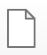
2. **Click** on the **Save** button 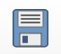
3. **Browse** to your **Project Folder** and name the project  something like `week_02_projections.qgz`  and **click Save**.

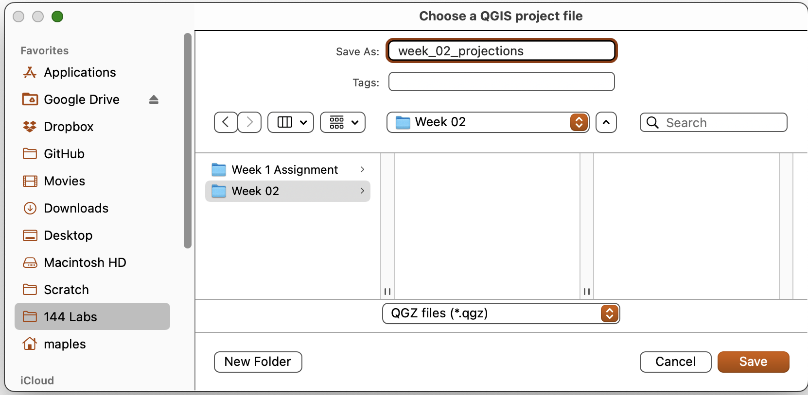

## Add the Data

We'll explore adding data to this new project using two common methods.

#### Drag & Drop Method

1. In the **Browser Window**, which should be on the right side of the QGIS window above the Layers panel, **browse to the Project Folder** you created and saved your data and project file to and expand the folder that your data is saved in.

_HINT: If you saved your Project File to the same folder as you `/data/` folder, or you data, you should be able to simply Expand the Home folder that shows up near the top of the Browser panel. The Home folder is always the folder that the currently open project file is in._

2. **Select**, **Drag-and-Drop** the `countyp010g.shp` file, into the Map Canvas to add it to the project.

3. **Click** the **Save Button** to save the change you have made to the **Project file**.

#### Add Data Dialog Method
 Now we'll use an alternative method for adding data to QGIS, from the **Data Source Manager**. As you are adding the dataset, be sure to take a little time to examine all of the spatial data types that QGIS can ingest. Don't worry too much about what each source type is, as we'll cover most of these through the course of the Quarter, for now just note that QGIS supports many different data types, natively...   

 1. From the **Main Menu**, go to **Layer>Add Layer>Add Vector Layer**  

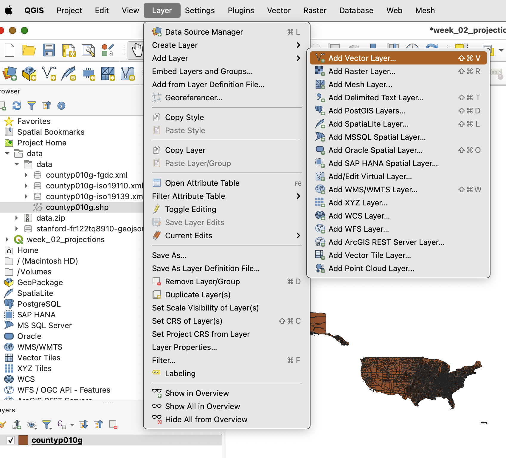

 2. Use the **Browse button** 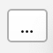 to **browse** to the location that your **GeoJSON** version of the Graticules was downloaded.  

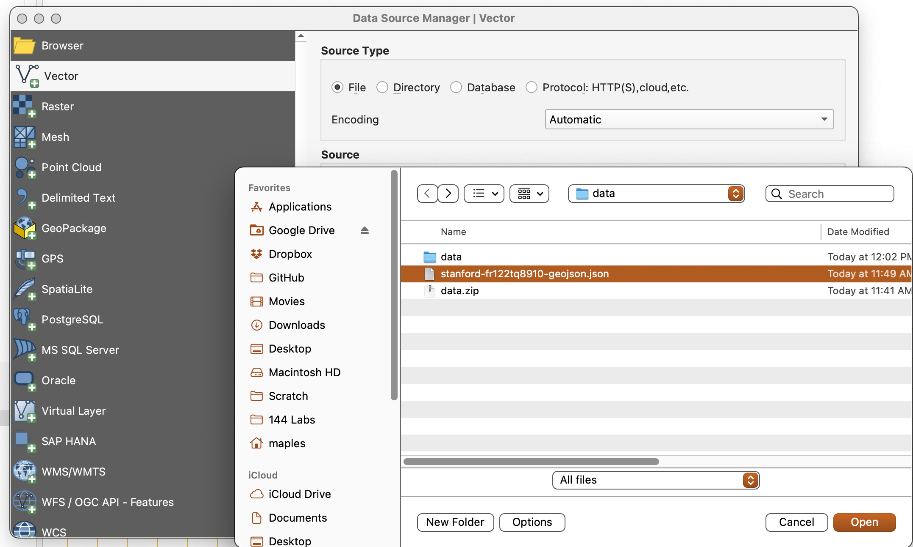

 3.  **Select** the **GeoJSON** file and **click Open**, then **Add**, to add the layer to the Map Canvas.

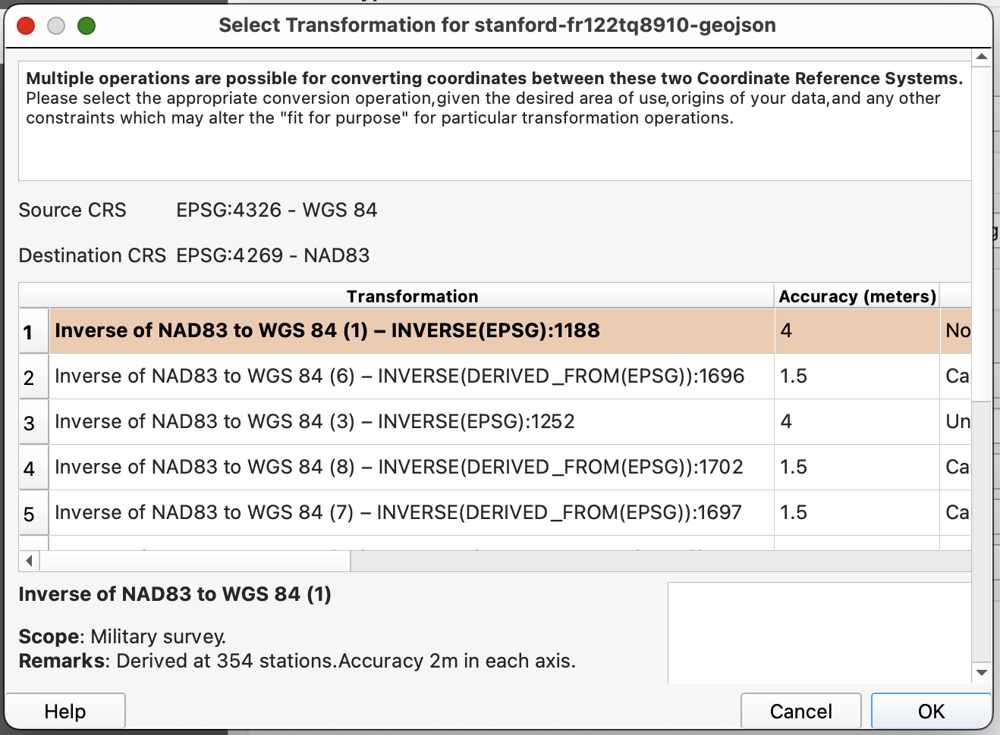
 4. You will see the above Select Transformation dialog, immediately.

_Selecting a transformation is necessary when you have layers with different Geographic Coordinate Systems, in your project. In this case, we will accept the default_ `EPSG:4326 - WGS84 to EPSG:4269 - NAD83` _transformation, which will cause the GeoJSON layer we have just added to "**Project-on-the-Fly**" to the Geographic Coordinate System of the Project. We'll dig into this more in the next section of the lab_

 5. **Click OK** to accept the suggested **Transformation**, then **click Close** to close the **Data Source Manager**.

 6. **Save** your **Project**.    

### Explore the Data

Let's quickly take a look at the data we have added to our Project. Here, note that once vector datasets are in QGIS, they essentially behave the same. Yay

1. First, use the **Zoom Button** 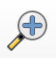 to **draw a box** around Alaska and the Continental US, which should Zoom to the extent shown, below (colors are assigned randomly, so you may not see the same colors in your map canvas).

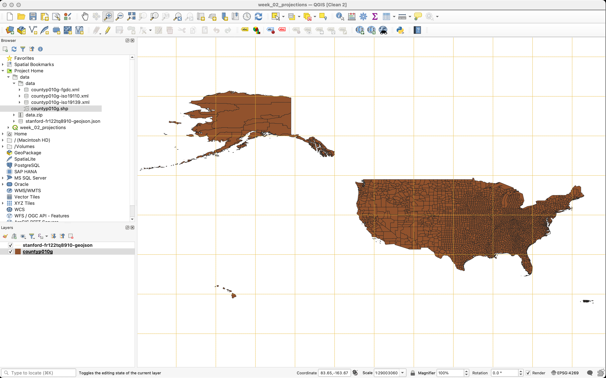

#### Open the Attribute Table

1. Right-click on the `countyp010g` Layer in the Layer panel, and select **Open Attribute Table**.
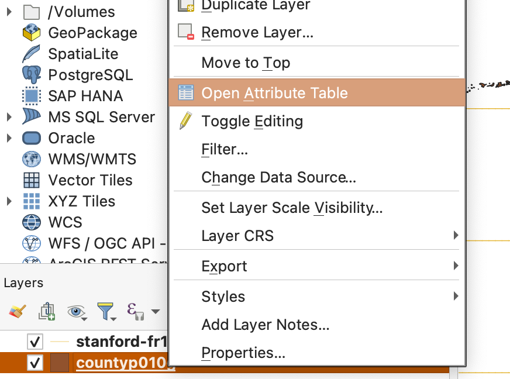  

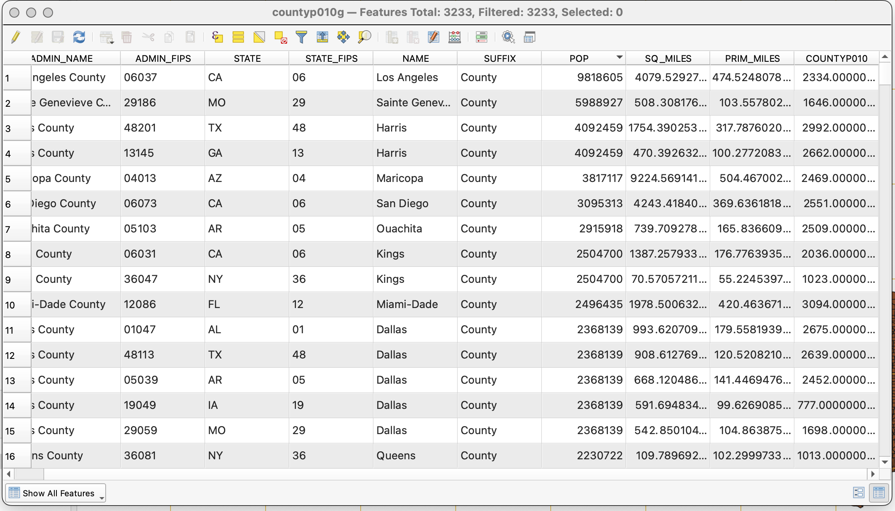

**Note the attributes** we have available to us, and that for every "county polygon" in the dataset, there is a corresponding record, or row, in the attribute table, containing the properties of the county it refers to, such as `ADMIN_NAME, ADMIN_FIPS, STATE, POP[ulation]`, etc...

In the next section, we will create Symbologies for each of the layers in our project.

## Symbolize the Data
Here, we will assign new sets of symbols to our spatial data layers. In particular, we will use a single symbol to represent the `Graticule lines`, in the case of our GeoJSON layer, and we'll calculate a value, on-the-fly, to symbolize the `counties layer`, using Population Density. We'll also use two methods to assign our Symbologies. One, from the **Layer Properties dialog**, and a second method (more preferable), using the **Layer Styling Panel**.

## Using a Single Symbol & the Properties - Symbology dialog

1. Right-click on the stanford-fr122tq8910-GeoJSON layer, in the Layers Panel, and go to Properties.

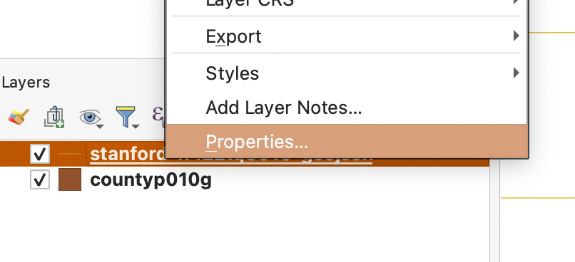

2. **Click** on **Symbology**, in the **Tabs**, on the left, to bring the **Layer Properties - Symbology ta**b, forward.
3. **Click** on the **Color Drop-down arrow** to **select** a **different color** (I chose red) for the graticule lines.
4. **Change** the **Width** of the line to **.4 Millimeters**

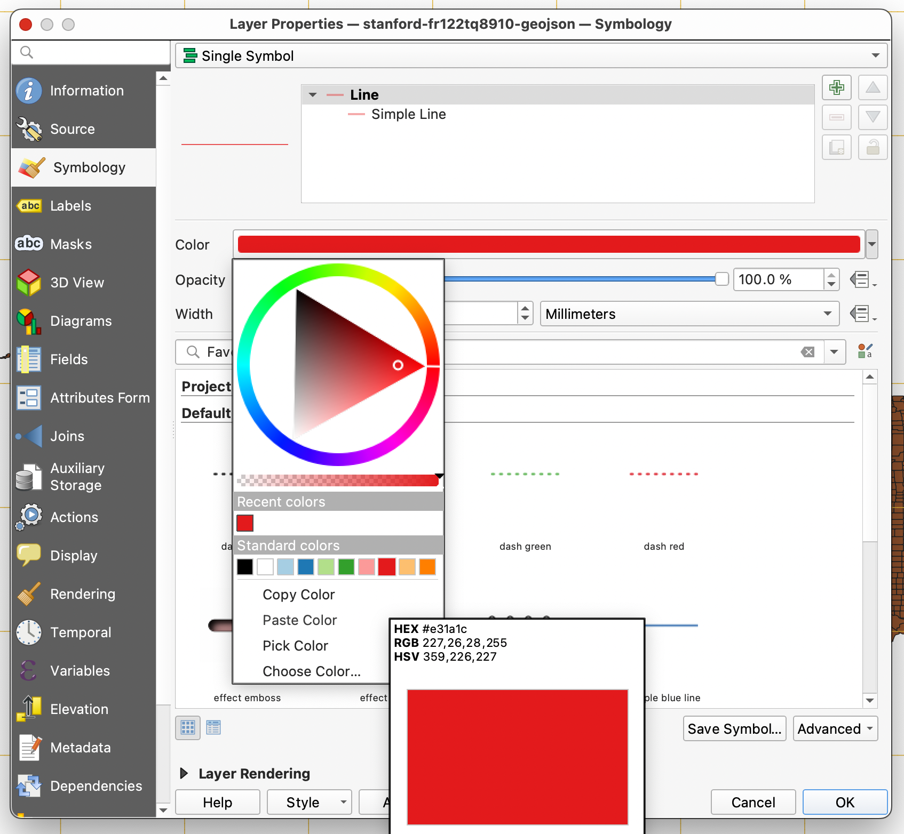

5. Click OK to apply the changes in the Map Canvas. Adjust to your taste.

## Using a quantity to apply Symbology, with the Layer Styling Panel.

Here we will use the preferred Layer Styling Panel to apply symbology to the counties layer, using a calculation (`"POP"  /  "SQ_MILES"`) we will have QGIS make, on-the-fly.
1. Go to **Main Menu>View>Panels>Layer Styling** to enable the Layer Styling Panel, which should appear at the right side of the software window.
2. Click on the `countyp010g` layer in the Layers Panel, to activate it as the Symbology Layer being edited.
3. **Change** the **Method dropdown** 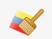 from **Single Symbol** to **Graduated**. _Note that the layer will temporarily disappear because there are no values assigned, yet, to base the symbology on._
4. **Click** on the **Equation button** 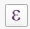, which is to the right of the **Value dropdown**, to open the **Expression Dialog**.
5. In the resulting window, search for `pop` and double-click what should be the only item returned to the search, `POP`.
6. Click on the Division Operator button 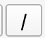 to add the Division symbol.
7. Replace your current search term with `sq` to highlight the `SQ_MILES` field, and **double-click** it to add it to your **Expression**.

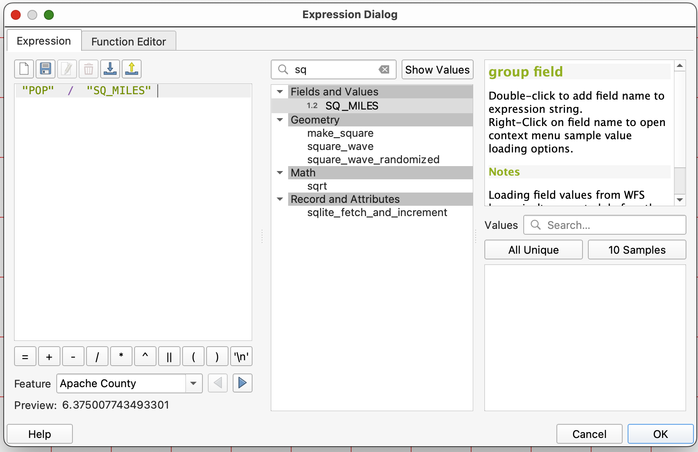

8. **Click OK** to apply the calculation (your layer still won't be visible yet).
9. Confirm that the **Classes Mode** is **Equal Counts (Quantile)**, and that the number of **Classes** is set to **5**.
10. Click the **Classify** button to apply the symbology.
11. Select a different **Color ramp**, if you like.
12. Save your Project.

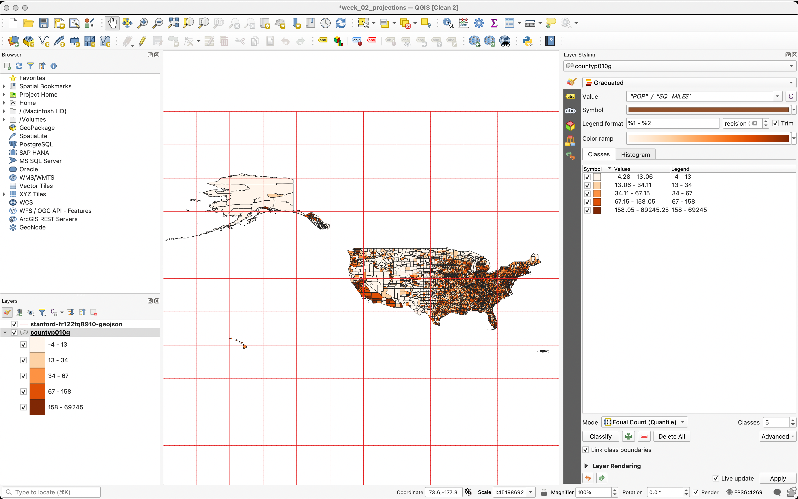

### CRS

Understanding how GIS applications typically handle Coordinate Reference Systems (CRS), is critical to ensuring that you are getting the most accurate measurements possible, from your data. In this section, we will examine the CRS of our Project and Layers, as well as the relationship between them. We will also explore how to alter the CRS of the Project, as well as the individual layers.

### Check Project Properties & Set Ellipse & Linear Units

First, let's check some settings that will be critical to our accurate measurements, here, and in every project you work in. THe ellipsoid is the model of the shape of the Earth, that will be used for calculating distances and areas, in QGIS. Here we will set our Ellipdoid to WGS84, and our units of measurement to Meters.

1. Go to **Main Menu>Project>properties**
2. Click on the General tab, to activate it, and look for the Measurements section. Expand it, if needed.
3. For you Ellipsoid, use the dropdown to find and select WGS 84 (EPSG:7030)
4. Confirm that the **Units for distance measurements** are set to `Meters` & **Units for area measurements** are set to `Square Meters`.

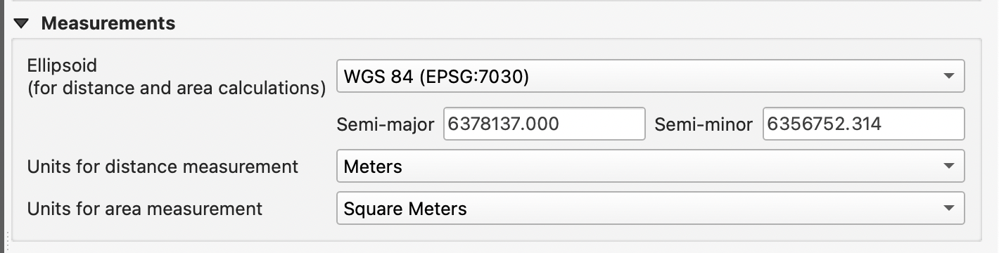

5. **Click OK** to apply the changes to the Project. Now all measurements on the ellipsoid will use `WGS84, meters`.

### Project CRS

* Examine Project CRS
* Set Project CRS from Layer

* Change Project CRS to `ESRI:102999 [NAD_1983_2011_StatePlane_California_III_FIPS_0403]`

#### Questions
What happened to the data?

What class of projection (developable surface) do you think you are using, now?

### Attribute Table
#### Calculate `$AREA`

Static Variable

ORIG_SQKM = `$AREA/1000000`

#### Change CRS of a Layer

Export using CRS: `ESRI:102999 [NAD_1983_2011_StatePlane_California_III_FIPS_0403]`

### Attribute Table
#### Calculate `Area`

Projected Area = `area( $geometry )/1000000`

#### Calculate `$AREA`

Static Variable

ELLIP_AREA = `$AREA/1000000`

### Calculate Error

AREA_ERROR =  `"ELLIP_AREA"  -  "PROJ_AREA" `

ERRO_PCT = AREA_ERROR/ELLIP_AREA

# Altering a CRS for a Specific Region

Change CRS and map with two layouts

## Ellipsoid vs Orthometric Height

### Sample Scripts
* https://code.earthengine.google.com/?accept_repo=users/stacemaples/Earthsys144
*
