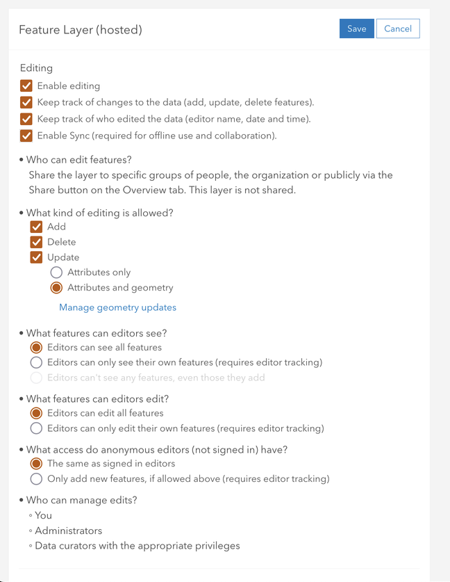
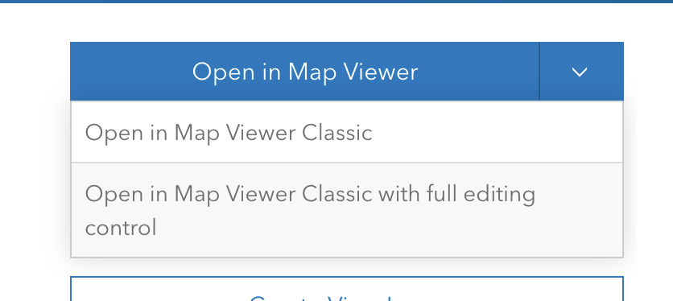
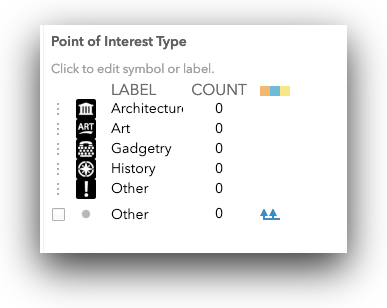
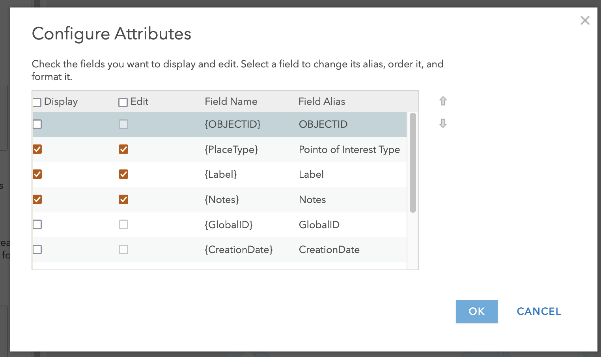
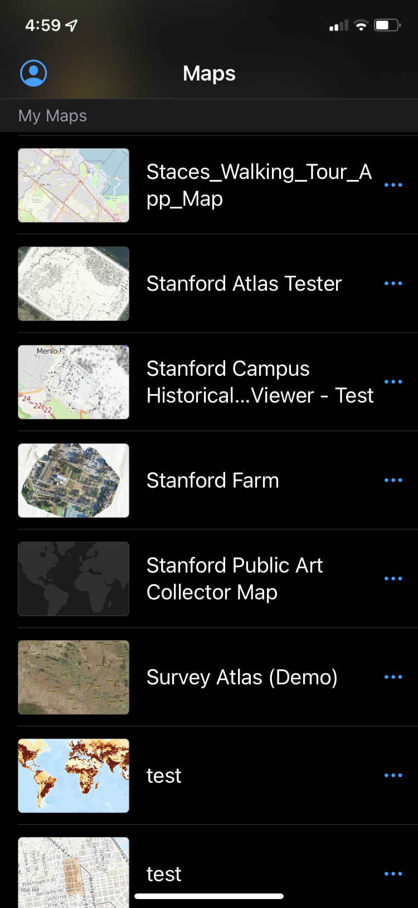
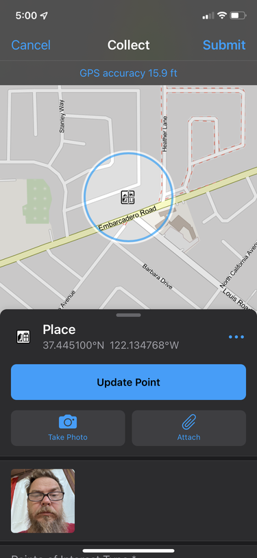

# FieldMaps for ArcGIS 101:

## Collecting Field Data with ArcGIS Online & Fieldmaps

ArcGIS Online is becoming the fully functional online GIS that it has always promised. This exercise is designed as an introduction to ArcGIS.com and Collector/FieldMaps  for ArcGIS, and assumes some familiarity with spatial data and basic GIS terminology. You will explore a workflow for creating and managing multi-user spatial field data collection projects using nothing but a browser and consumer-grade mobile phone (iOS or Android).

You will learn to:

* Create empty "feature classes" to hold spatial data
* Customize the data schema to the field data need
* Create "Lists" to drive in-app dropdown menus for controlled vocabularies and standardization
* Customize field survey forms for usability
* Enable attachments (such as audio, video or images)
* Enable offline, "disconnected" editing, for remote, off-network, data collection
* Deploy a field data collection app from ArcGIS.com to iOS or Android devices with the Collector/FieldMaps  app installed
* Share the app and editing role to a controlled group of users
* Download the field data collection app and basemap for offline use
* Collect data and sync to the ArcGIS.com database
* Create a simple read-only view of the live data, for monitoring data collection
* Export the data to multiple formats

By the end of the exercise, you should be familiar enough to create your own field data collection applications, customized to your research needs.

**_Note that the examples and many of the features you will need for your Data Collection app require the use of the Classic Map Viewer/Editor in ArcGIS Online. Anytime you are asked to open or create a map, be sure that you are using the Classic Map Viewer. If you find yourself in the new Map Viewer (Beta), you should be able to switch at the top of the page_**

## Part 1: Create a Feature Layer

### Login to arcgis.com

1. Go to [https://stanford.maps.arcgis.com/home/signin.html](https://stanford.maps.arcgis.com/home/signin.html) and Login using your SUNetID & Password using the Stanford University option.

### Create an empty feature layer

1. Go to Content, and in My Content click Create (New Item) and choose Feature Layer to open the Create a feature layer dialog.

2. Select the Feature Layer item.

3. Select **Define your own layer**, and click Next.

3. Use the + Add to create individual point, line and polygon layers and name them, as shown in the table, below:

<table>
  <tr>
   <td>
<strong>shape</strong>
   </td>
   <td><strong>name</strong>
   </td>
  </tr>
  <tr>
   <td>point
   </td>
   <td>Place
   </td>
  </tr>
  <tr>
   <td>line
   </td>
   <td>Path
   </td>
  </tr>
  <tr>
   <td>polygon
   </td>
   <td>Area of Interest
   </td>
  </tr>
</table>

4. Provide a title, like "Walking Tour (SDM)". _Since this must be a unique name in your organization, include your SUNetID in the name of this item, and any others in this exercise_. Click Save.

Your Walking Tour layer is created and its item details page should open. In the following steps you’ll create the fields that define the form for the Places layer.

### Add fields to the feature class

1. Go to the Data tab of the item page and go to Fields. If you created layers for points, lines, and polygons, verify that _Place_ is chosen in the list of layers.

1. Click Add. Give a name _PlaceType_ and an alias _Point of Interest Type_. Choose type: String. Accept the other defaults and click Add New Field.

### Create a Domain (values list) for the places layer

1. Click _Point of Interest_ in the Display Name list and click Create List to create a list of choices for the POI Types. Type a label of Art with a code of 0.

1. Add entries for the following:

<table>
  <tr>
   <td>
<strong>label</strong>
   </td>
   <td><strong>code</strong>
   </td>
  </tr>
  <tr>
   <td>Art
   </td>
   <td>0
   </td>
  </tr>
  <tr>
   <td>Architecture
   </td>
   <td>1
   </td>
  </tr>
  <tr>
   <td>Gadgetry
   </td>
   <td>2
   </td>
  </tr>
  <tr>
   <td>History
   </td>
   <td>3
   </td>
  </tr>
  <tr>
   <td>Other
   </td>
   <td>4
   </td>
  </tr>
</table>

1. Click Save.
2. Create another field named _Label_ that is a String.
3. Create another field named _Notes_ that is a String.

### Enable offline editing for Collector/FieldMaps

This is a step that MUST be done before adding your feature layers to an ArcGIS Online map for creating your editing app.

1. Click on the Settings tab at the top of the Feature Layer's Details page.
2. Make sure that settings under the Editing section at the top are all enabled, in particular that "Enable Sync" is checked.
3. Note the other settings for controlling who and how data can be edited.

1. Click Save to save these settings.

## Part 2: Make a map

Now you will add the feature layers you created to an ArcGIS.com map. This map will drive the functionality in the Collector/FieldMaps  for ArcGIS application, so everything we do from this point will be to improve the simplicity of use for our data collectors in the field.

1. Return to the Overview tab the item page of your layer, in the drop-down list for **Open in Map Viewer** use the **Open in Classic Map Viewer with Full Editing Control** to start making your map.

_You may see a pop-up prompting you to update the symbology for one of your layers. You can click cancel to dismiss the symbology panel_

1. Save your map, giving it a title "Walking Tour [_SUNetID_]" and a tag.

Shortening the names of our layers in the Map will simplify the appearance of those items in the resulting Collector/FieldMaps  application.

1. In the Contents pane, hover over the layer of places, click More Options (ellipsis), choose Rename, and rename the layer of places to Places.
2. Repeat for the Paths & Areas layers.

1. Click **Change Style** button  for the Places layer.

1. Change the "Attribute to Show" option to `Point of Interest Type`

2. Click Options for the **Types (Unique symbols)** drawing style.

2. Click the symbol next to the Art POI Type, click Shape, choose an appropriate symbol and set it to a size of 20, then click OK.

1. Configure the symbols for the each of your other POI Types. Explore the various symbology categories available. I've used the National Park Service Symbols, here, but you should feel free to explore and experiment.

1. Click OK and click Done.

1. Click Edit, click Manage, and click Save Changes.

_This creates feature templates that Collector/FieldMaps  will use as the POI types available in the app_.

1. Click on the ellipsis (...) at the end of the Places layer item and go to "Configure Pop-up"

1. Click on the "Configure Attributes" link, about half way down the "Configure Pop-up Panel."
2. Check, then uncheck, the Display checkbox, to turn off the display of all attributes in the Pop-up.
3. Scroll down until you see the attributes you created [{Label},{notes},{PlaceType}] and check the Edit checkboxes (which will also check the Display checkbox)

1. Click OK, twice, to commit your changes and close the Configure Pop-ups panel.
2. Change the basemap to OpenStreetMap

1. Save the map.

### Enable Offline Editing  

1. At the top of the Table of Contents in your map, click on the Details

 button and then on the More Details... link to go to the Details page of your webmap.
2. Click on the Settings tab at the top of the page and scroll down to the section labeled "Offline."
3. Make sure that "Enable offline mode" is active.  

1. Save your map settings, if necessary.

## Part 3: Record Points of Interest with Collector/FieldMaps

For this part of the exercise, you will need to download "ArcGIS FIeld Maps" for iPhone of Android, from the respective app stores.

Open ArcGIS Field Maps , using "stanford" as your organization, and your SUNetID and password.

1. Choose the map you just made.

  

2. To add a feature, touch the + sign and follow the prompts.

Note: Either sign in with the same account you used to make the map, or share the map with a group and sign in as a user that is a member of that group.

3. Walk around campus, adding public art, historically significant locations, various technology around campus, and "other" locations (picnic tables, restrooms, water fountains, etc...). **Collect at least 12+ points, with Photo or Video attachments.**

## Part 4: Multi-user editing

Management of multiple field workers can be easily implemented through the use of Groups, in ArcGIS.com. You can create a Group with appropriate permissions (Public, Org, Members), so that anyone in that Group can access and use the deployed Map for data collection. For the reset of this exercise, I provide instructions for submitting your Collector/FieldMaps  app Map, for credit, by sharing it and the data layers in it, through an ArcGIS.com group.

### Join the Earthsys144 FieldMaps app Group 2022

1. From The Map, on ArcGIS.com, click on the Home button and go to Groups
2. Click on the My Organization's Groups tab at the top, left
3. Search for `earthsys144` and click on the resulting **Earthsys144 FieldMaps app Group 2022** link

1. Click on the Join This Group button

### Share the map and feature layer with the group

Now that you are a member of the **Earthsys144 FieldMaps app Group 2022**, you can share content with it. Note that that content will be shared with ANYONE who is a member of that group, and that anyone in the Group will be able to use your app for data collection. When implementing for yourself, you would obviously limit your group to only those people YOU add, to control access to the Collector/FieldMaps  app.

1. Click on the Content Tab a the top of the page, to go to the My Content page
2. Find your Mapping App (it's Item Type will be Web Map) and check it's checkbox, then click on the Share icon that appears

1. Click the option to Set sharing level to organization
2. **Click on the Edit group sharing button, select the Earthsys144 FieldMaps app Group 2022 and click OK**

1. Click OK, then go to the Details Page for your Feature Layer and share it with the **Earthsys144 FieldMaps app Group 2022**, as well (this is necessary).

1. Your Mapping app, and Feature Layer should now be visible to the members of the Earthsys144 FieldMaps app Group 2022

## Working with the data

#### Creating a "View Layer"

You may want to share the collected data through a visualization, though obviously you won't want to share your "Full Editing Control" Map, with everyone. Creating a View Layer is a way to safely share visualizations of the data being collected, with anyone you want, without exposing the data to editing.

1. Return to your Content page, and find your Walking Tour feature layer item and click on it to go to the Details page.
2. Click on the Create View Layer button
3. Give it an appropriate name like My Mapping App Data Public View (_SUNetID_) and click OK
4. Click on the Share Button in the resulting Details Page, and change the Sharing to Public.

The resulting Feature Layer is a read-only view of the data being collected in your Mapping App that can be added to a New Map, filtered, symbolized, pushed to a web application and shared publicly, within the Stanford Org, or with a controlled Group, but without editing permissions.

# To Turn In:

1. Join the "**Earthsys144 FieldMaps app Group 2022**" and **Share your data collection map app** (the one you are using in Collector/FieldMaps) with the **Earthsys144 FieldMaps app Group 2022**. (you should have already done this, see above). Return to the Details Page of your **MAP**  and copy the URL that is in the Browser URL Bar, and paste it into the Homework URL submission text box, in canvas.
2. Go to the Details Page for the View Layer you created and scroll to the bottom of the page to find the URL. Copy the URL and paste it into the Homework URL submission text box, in Canvas.
