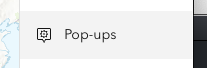

# ArcGIS FieldMaps & ArcGIS Online for Data Collection:

## Collecting Field Data with ArcGIS Online & Fieldmaps

### Overview

This exercise is designed as an introduction to ArcGIS.com and ArcGIS FieldMaps, and assumes some familiarity with spatial data and basic GIS terminology. You will explore a workflow for creating and managing multi-user spatial field data collection projects using nothing but a browser and consumer-grade mobile phone (iOS or Android).

Combining FieldMaps & ArcGIS Online provides a powerful and intuitive way to manage multi-user data collection projects. FieldMaps provides a free app download for distributing you field data collection maps with your field workers, manages their data collection and aggregates and updates multi-user edits, in real-time.

### Objective

The objective of this lab is to provide hands-on experience with ArcGIS Online and FieldMaps, enabling students to design and deploy a field data collection application. By the end of the lab, students will have created feature layers, customized data schemas, configured offline editing, and shared their applications for multi-user collaboration, gaining practical skills in managing spatial data collection projects.

You will learn to:

* Create empty "feature classes" to hold spatial data
* Customize the data schema to the field data need
* Create "Lists" to drive in-app dropdown menus for controlled vocabularies and standardization
* Customize field survey forms for usability
* Enable attachments (such as audio, video or images)
* Enable offline, "disconnected" editing, for remote, off-network, data collection
* Deploy a field data collection app from ArcGIS.com to iOS or Android devices with the Collector/FieldMaps  app installed
* Share the app and editing role to a controlled group of users
* Download the field data collection app and basemap for offline use
* Collect data and sync to the ArcGIS.com database
* Create a simple read-only view of the live data, for monitoring data collection
* Export the data to multiple formats

By the end of the exercise, you should be familiar enough to create your own field data collection applications, customized to your research needs.

## Part 1: Create a Feature Layer

### Login to arcgis.com

1. Go to [https://stanford.maps.arcgis.com/home/signin.html](https://stanford.maps.arcgis.com/home/signin.html) and Login using your SUNetID & Password using the Stanford University option.

At this point, you should see our Stanford Geospatial Center landing page, on ArcGIS Online. Take a moment to look at the resources, there, as they include information on using our lab, resources, and the software and data we support.

### Create an empty feature layer

1. Find the **Content** link at the top of the page and clik it to go to **Content**
2. In **My Content** click **Create (New Item)** and choose **Feature Layer** to open the **Create a feature layer** dialog.

2. Select the **Feature Layer** item.

3. Select **Define your own layer**, and click **Next**.

3. Use the **+ Add** to create individual **point, line and polygon layers** and name them, as shown in the table, below:

<table>
  <tr>
   <td>
<strong>shape</strong>
   </td>
   <td><strong>name</strong>
   </td>
  </tr>
  <tr>
   <td>point
   </td>
   <td>Place
   </td>
  </tr>
  <tr>
   <td>line
   </td>
   <td>Path
   </td>
  </tr>
  <tr>
   <td>polygon
   </td>
   <td>Area of Interest
   </td>
  </tr>
</table>

4. Provide a title, like `"Walking Tour (SDM)"`. _Since this must be a unique name in your organization, include your SUNetID in the name of this item, and any others in this exercise_. Click **Save**.

Your **Walking Tour layer** is created and its item details page should open. In the following steps you’ll create the fields that define the form for the Places layer.

### Add fields to the feature class

1. Go to the **Data tab** of the item page and go to **Fields**. If you created layers for **points, lines, and polygons**, verify that _Place_ is chosen in the **Layer** list.

1. Click Add. Give a name _PlaceType_ and an alias _Point of Interest Type_. Choose type: String. Accept the other defaults and click Add New Field.

### Create a Domain (values list) for the places layer

1. Click _`Point of Interest`_ in the **Display Name** list to open the details page for the field.
2. Click **Create List** to create a list of choices for the **POI Types**. Type a label of `Art` with a code of 0.

1. Add entries for the following:

<table>
  <tr>
   <td>
<strong>label</strong>
   </td>
   <td><strong>code</strong>
   </td>
  </tr>
  <tr>
   <td>Art
   </td>
   <td>0
   </td>
  </tr>
  <tr>
   <td>Architecture
   </td>
   <td>1
   </td>
  </tr>
  <tr>
   <td>Gadgetry
   </td>
   <td>2
   </td>
  </tr>
  <tr>
   <td>History
   </td>
   <td>3
   </td>
  </tr>
  <tr>
   <td>Other
   </td>
   <td>4
   </td>
  </tr>
</table>

1. Click Save.
2. Create another field named _Label_ that is a String.
3. Create another field named _Notes_ that is a String.

### Enable offline editing for Collector/FieldMaps

**This is a step that MUST be done before adding your feature layers to an ArcGIS Online map** for creating your editing app.

1. Click on the **Settings tab** at the top of the **Feature Layer's Details page**.
2. Make sure that settings under the **Editing** section at the top are **all enabled**, in particular that "**Enable Sync**" is checked.
3. Note the other settings for controlling who and how data can be edited.

| **Setting Category**                 | **Option**                                  | **Selected / Notes**       |
| -------------------------------------- | --------------------------------------------- | ---------------------------- |
| **Editing**                          | Enable editing                              | ✅ Enabled                 |
|                                      | Track changes to data (add, update, delete) | ✅ Enabled                 |
|                                      | Track editor name and time                  | ✅ Enabled                 |
|                                      | Enable Sync                                 | ✅ Enabled                 |
| **Who can edit features?**           | Share layer to specific users/groups/org    | Not shared yet (info only) |
| **What kind of editing is allowed?** | Add                                         | ✅ Allowed                 |
|                                      | Delete                                      | ✅ Allowed                 |
|                                      | Update                                      | ✅ Allowed                 |
|                                      | Update type                                 | Attributes and geometry    |
| **True curves**                      | Allow update of true curves                 | ✅ Enabled                 |
|                                      | Only allow updates by true curve clients    | ⬜ Not selected            |
| **Feature visibility for editors**   | Editors can see all features                | ✅ Selected (default)      |
|                                      | Editors can only see their own features     | ⬜ Not selected            |
| **Feature editability for editors**  | Editors can edit all features               | ⬜ Not selected            |
|                                      | Editors can only edit their own features    | ✅ Selected                |
| **Anonymous editor access**          | Same as signed-in editors                   | ⬜ Not selected            |
|                                      | Only add new features (if allowed)          | ✅ Selected                |
|                                      |                                             |                            |

1. Click Save to save these settings.

## Part 2: Make a map

Now you will add the feature layers you created to an ArcGIS.com map. This map will drive the functionality in the Collector/FieldMaps  for ArcGIS application, so everything we do from this point will be to improve the simplicity of use for our data collectors in the field.

1. Return to the **Overview tab** the **Item Details** of your layer and click on **Open in Map Viewer**.

1. Use the `>>` and `<<` arrows at the bottom left and right of the **Map Viewer** to expand the toolbars to include their text descriptions, for your convenience.

   
2. Click on Save and open, to save your map...

3. Use the Arrow next to your Walking Tour Layer to expand the layer, so you can see the indiviual feature layers

1. Click on the Places feature layer in the Layers panel to select it, and update teh Properties Panel on the right.
2. Click on **Edit layer Style** link for the Places layer, in the Symbology box of the Properties panel.

3. Click on the **+ Field** button to select the `Point of Interest Type` as the **field** to base symbology on.

4. Click Add.
5. In the resulting `Pick a style` box, click on Style options to open the layer style editing options.

1. Configure the symbols for the each of your other POI Types. Explore the various symbology categories available. I've used the default simple symbols here, but you should feel free to explore and experiment.

1. Click Done and done to apply the symbology to your feature layer.

## Customize visibility of fields

We don't need to change any of the settings in this section, but it is useful to know where it is, in case you want to customize the visibility of certain fields in your feature layer.

1. With the Places layer still selected, click on the "Pop-ups" button on the right side of the page.

1. Click on the "Configure Attributes" icon in the Fields list box, to expand it and note that the fileds you added to your Places feautre layer, are already added to the Fields list.

1. Click on **Select fields** in the **Fields list**.
2. Scroll down and note the fields that are unchecked. These are automated fields, that will contain the Editor Tracking data that you checked the options for, in your Feature Layer Edit settings.

1. Click **Done** to close the **Select fields** panel, and click the **X** at the top of the Properties Panel, to close it.
2. In the map, Zoom and Pan until you can see the entire Stanford Campus

1. Click on the Basemap button on the left side of the page, and change the basemap to OpenStreetMap.

1. Save the map.

### Enable Offline Editing

1. Click on the **Map Properties** button  on the left side of the page, then click on the **item details**.

   

   button and then on the More Details... link to go to the Details page of your webmap.
2. Click on the **Settings tab** at the top of the page and scroll down to the section labeled "Offline."
3. Make sure that "**Offline enabled**" is at the top right corner of teh panel.

4. Click on **Manage Offline Areas**.

5. Click on the **+ Create offline area** button.
6. Use the **Sketch rectangular map area** tool in the map toolbar, and draw a box around the main Stanford Campus.

7. Leave the remaining setting as their default values and click Save.
8. Click the **X** at the top right corner to dismiss the **Manage Offline Areas** page.

### Using FieldMaps Designer to finish up your Editing Form!

1. Click on the 3x3 icon at the top right of the page, next to your User Name, and look for the FieldMaps Designer (NOT the Beta version, if you see it), and launch it.

2. The resulting list should be sorted by "**Last Modified**" so your **Walking Tour map** should be the first item in the resulting gallery list. Click to open it in **FieldMaps Designer**.

3. On the resulting page, make sure Place is selected, and click on the Convert pop-up button to import the pop-up fields to your editing form.

4. This should result in a basic form design, with your custom fields, like this:

   
5. Drag and drop the Date and time Form Element into the form designer, underneath all other fields.

6. Add a Display name and Field name for the Date and time form element.

8. Note that certain field names are reserved, including the default one that is created when you drop the Date and time form element into the Form Designer. You will need to append '_collect' to the end of the Field name* in the FOrmatting panel:

9. Once you have added the `Date/Time` field to the form designer, click on the **Save button** at the top right corner of the Form panel.

10. Click on the **App settings** button   on the left side of the page, and expand each section to familiarize yourself with the options. We won't change any, but pay particular attention to you options in the **Collection** section for controlling how the app interacts with the GPS in the device.

12. If you do make changes, be sure to Save your form.
13. You can now close the form designer.

## Part 3: Record Points of Interest with Collector/FieldMaps

For this part of the exercise, you will need to download "ArcGIS Field Maps" for iPhone of Android, from the respective app stores.

Open ArcGIS Field Maps , using "stanford" as your organization, and your SUNetID and password.

1. Choose the map you just made.

2. You should see the Online Map (for use when connected to thenetwork) and the "Map Areas" you created for offline use (when there is no consistent network connectivity).

3. Click on the **+** icon in Online Map to begin adding a point.

5. To add a feature, touch the + Icon, select **New Feature** and follow the prompts.
6. You can fill out the form, or click the 'Add Point' button, first. Sometimes it's useful to wait and **Add Point** after the form, to allow your **GPS accuracy** to improve.
7. Walk around campus, adding public art, historically significant locations, various technology around campus, and "other" locations (picnic tables, restrooms, water fountains, etc...). **Collect at least 12+ points, with Photo or Video attachments.**

## Part 4: Multi-user editing

Management of multiple field workers can be easily implemented through the use of Groups, in ArcGIS.com. You can create a Group with appropriate permissions (Public, Org, Members), so that anyone in that Group can access and use the deployed Map for data collection. For the reset of this exercise, I provide instructions for submitting your Collector/FieldMaps  app Map, for credit, by sharing it and the data layers in it, through an ArcGIS.com group.

### Join the Earthsys144 - Spring 2025

1. From The Map, on ArcGIS.com, click on the Home button and go to Groups
2. Click on the My Organization's Groups tab at the top, left
3. Search for `earthsys144` and click on the resulting **Earthsys144 - Spring 2025** link

1. Click on the Join This Group button

### Share the map and feature layer with the group

Now that you are a member of the **Earthsys144 - Spring 2025**, you can share content with it. Note that that content will be shared with ANYONE who is a member of that group, and that anyone in the Group will be able to use your app for data collection. When implementing for yourself, you would obviously limit your group to only those people YOU add, to control access to the Collector/FieldMaps  app.

1. Click on the Content Tab a the top of the page, to go to the My Content page
2. Find your Mapping App (it's Item Type will be Web Map) and check it's checkbox, then click on the Share icon that appears

1. Click the option to Set sharing level to organization
2. **Click on the Edit group sharing button, select the Earthsys144 - Fundamentals of GISci - Spring 2024 and click OK**

1. Click OK, then go to the Details Page for your Feature Layer and share it with the **Earthsys144 FieldMaps app Group 2022**, as well (this is necessary).
2. Your Mapping app, and Feature Layer should now be visible to the members of the Earthsys144 - Fundamentals of GISci - Spring 2024

## Working with the data

#### Creating a "View Layer"

You may want to share the collected data through a visualization, though obviously you won't want to share your "Full Editing Control" Map, with everyone. Creating a View Layer is a way to safely share visualizations of the data being collected, with anyone you want, without exposing the data to editing.

1. Return to your Content page, and find your Walking Tour feature layer item and click on it to go to the Details page.
2. Click on the Create View Layer button
3. Give it an appropriate name like My Mapping App Data Public View (_SUNetID_) and click OK
4. Click on the Share Button in the resulting Details Page, and change the Sharing to Public.

The resulting Feature Layer is a read-only view of the data being collected in your Mapping App that can be added to a New Map, filtered, symbolized, pushed to a web application and shared publicly, within the Stanford Org, or with a controlled Group, but without editing permissions.

# To Turn In:

1. Join the "**Earthsys144 - Spring 2025** Group" and **Share your data collection map app** (the one you are using in Collector/FieldMaps) with the **Earthsys144 - Spring 2025**. (you should have already done this, see above). Return to the Details Page of your **MAP**  and copy the URL that is in the Browser URL Bar, and paste it into the Homework URL submission text box, in canvas.
2. Go to the Details Page for the View Layer you created and scroll to the bottom of the page to find the URL. Copy the URL and paste it into the Homework URL submission text box, in Canvas.
