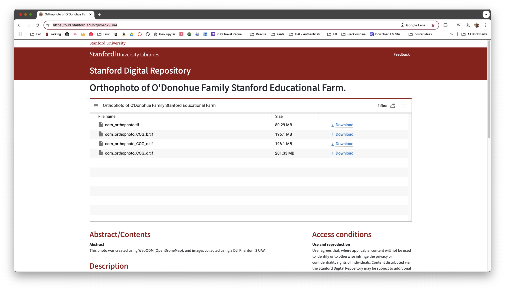
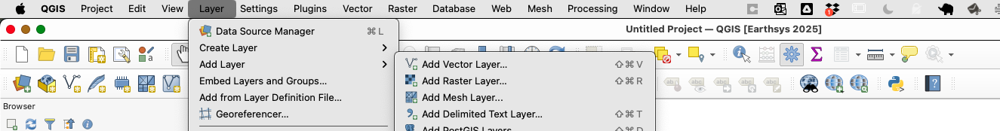
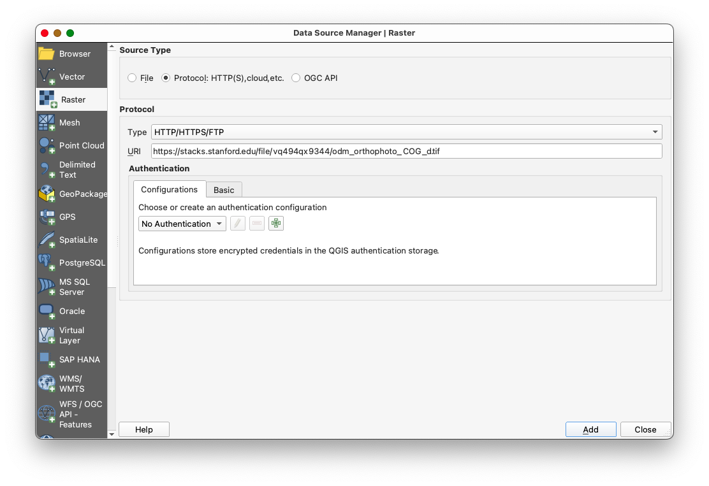
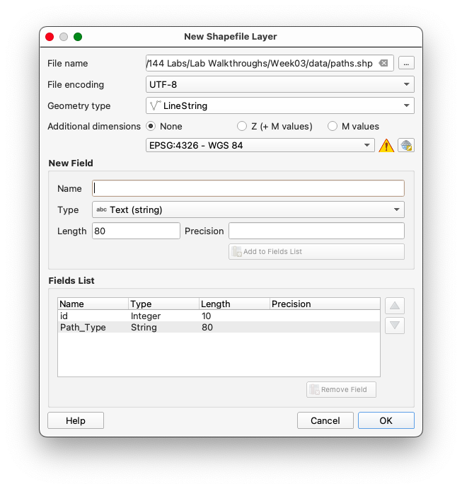
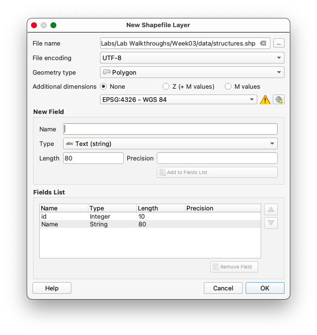

# Week 3 Lab: Digitizing in QGIS

**_What You’ll Learn_:** In this Lab, you’ll be introduced to basic digitizing techniques in QGIS, including creating vector datasets from a reference image, working with Cloud Optimized GeoTIFFs (COGs), and using snapping for topological accuracy.

**You should read** Chapter 4 in the GIS Fundamentals textbook before starting this lab, as the chapter covers the basics of data entry and digitizing mechanics. You will digitize and edit features based on a digital aerial photo.

---

## Getting Ready for the Lab

We will be using an image of the Stanford Teaching Farm for this exercise. That image is stored as a [Cloud-Optimized GeoTIFF (COG)](https://cogeo.org/) on the [Stanford Digital Repository (SDR)](https://sdr.stanford.edu/). A COG is a specialized type of TIFF image designed for efficient access and streaming over the web, enabling users to retrieve only the portions of the image they need without downloading the entire file.

You can find the Persistent URL Page for the dataset here: [https://purl.stanford.edu/vq494qx9344](https://purl.stanford.edu/vq494qx9344)

We will use the file `odm_orthophoto_COG_d.tif` for this lab. The direct URL is:
`https://stacks.stanford.edu/file/vq494qx9344/odm_orthophoto_COG_d.tif`.

---

## Step 1: Adding the COG to QGIS

1. Open QGIS and go to **Layer > Add Layer > Add Raster Layer**.

1. In the dialog, click **Source Type** and select **Protocol**.
2. Paste the URL:
   `https://stacks.stanford.edu/file/vq494qx9344/odm_orthophoto_COG_d.tif`

1. Click **Add** to load the COG into your project.

### Notes on COG Performance

- Initially, the COG may load slowly as QGIS fetches data from the server.
- As you pan and zoom around the image, QGIS will cache the views, improving performance over time.
- To cache views, pan around the area of interest (the Farm property) before starting digitization.

---

## Step 2: Adding Google Hybrid Imagery

1. [Install the **Quick Map Services** plugin](https://github.com/mapninja/Earthsys144/blob/master/Labs/Week_01/CleanQGISInstallationforMac.md) if not already installed.
2. Add Google Hybrid imagery:
   - Go to **Web > Quick Map Services > Google > Google Hybrid**.

---

## Step 3: Creating New Empty Layers

The first step in creating a new spatial dataset using “heads up digitizing” is to create a new empty layer for your features to go into. In this case, we will create three empty shapefiles: one for points, one for lines, and one for polygons.

1. Go to **Layer > Create Layer > New Shapefile Layer**.
2. A window will open with entries for a **file name, geometry type (e.g., point, line, polygon), coordinate system, and field characteristics for a table**.

### Create Three Layers:

#### First Layer: Trees (Points)

1. Browse to your **Lab folder**, create a new subfolder called `data`, and save the shapefile as file: `trees.shp`
2. Set the **Geometry Type** to "**Point**".
3. Set the coordinate system to **EPSG:4326 - WGS84** (use the drop-down list to select the Project CRS).
4. Add an attribute field named `Tree_ID` (type: Integer 32-bit).

5. Leave the remainder of the options blank and click **OK**.

#### Second Layer: Rows and Paths (Lines)

1. Browse to your Lab Data folder and name the file: **paths**.
2. Set the **Geometry Type** to "**LineString**".
3. Set the coordinate system to **EPSG:4326 - WGS84**.
4. Add an attribute field named `Path_Type` (type: Text).

5. Leave the remainder of the options blank and click **OK**.

#### Third Layer: Structures (Polygons)

1. Browse to your Lab Data folder and name the file: **structures**.
2. Set the **Geometry Type** to "**Polygon**".
3. Set the coordinate system to **EPSG:4326 - WGS84**.
4. Add an attribute field named `Name` (type: Text).

1. Leave the remainder of the options blank and click **OK**.

---

### Why Use WGS84 as the Coordinate System?

WGS84 (World Geodetic System 1984) is a widely used geodetic coordinate system that serves as the standard for global mapping and navigation. Here’s why it is the preferred choice for archival purposes:

1. **Unprojected System**: WGS84 is a geographic coordinate system that uses latitude and longitude to represent locations on the Earth's surface. Unlike projected systems, it does not distort shapes, areas, or distances, making it ideal for storing raw spatial data.
2. **Universal Adoption**: WGS84 is the default coordinate system for GPS and is universally recognized across GIS platforms, ensuring compatibility and ease of data sharing.
3. **Global Coverage**: It provides a consistent framework for mapping and analysis worldwide, making it suitable for datasets that span large geographic areas.
4. **Archival Stability**: As a standard system, WGS84 ensures that spatial data remains interpretable and usable over time, regardless of changes in software or technology.

By using WGS84, you ensure that your spatial data is stored in a universally accepted format, making it easier to share, analyze, and integrate with other datasets.

---

## Step 4: Digitizing Features

### Points: Digitizing Trees

1. Load the **trees** shapefile into the project and toggle editing mode.
2. Use the **Add Point Feature** tool to place a point on each tree within the Farm property:
   - Toggle between the COG and Google Hybrid imagery for better identification.
   - Assign a unique `Tree_ID` to each tree.

### Lines: Digitizing Paths and Sidewalks

1. Load the **paths** shapefile into the project and toggle editing mode.
2. Enable snapping for topological accuracy:
   - Go to **Project > Snapping Options**.
   - Enable snapping for the line layer and set the tolerance to 10 pixels.
   - Check **Avoid Overlaps** and **Enable Topological Editing**.
3. Use the **Add Line Feature** tool to trace paths and sidewalks:
   - Place vertices at intersections to ensure proper snapping for network integration.

#### Sidenote: What is Snapping?

Snapping ensures that vertices and edges of features align precisely, preventing gaps or overlaps. This is crucial for creating topologically correct data, especially for networks like paths and sidewalks.

### Polygons: Digitizing Structures

1. Load the **structures** shapefile into the project and toggle editing mode.
2. Enable snapping for polygons:
   - Use the same snapping settings as for lines.
3. Use the **Add Polygon Feature** tool to trace the outlines of buildings and other structures.

---

5. Use the **Add Point Feature** tool to place a point on each tree within the Farm property:

   - Toggle between the COG and Google Hybrid imagery for better identification.
   - Assign a unique `Tree_ID` to each tree.

---

### Lines: Digitizing Paths and Sidewalks

1. Create a new line shapefile:
   - Go to **Layer > Create Layer > New Shapefile Layer**.
   - Set **Geometry Type** to "Line".
   - Add an attribute field named `Path_Type` (type: Text).
2. Enable snapping for topological accuracy:
   - Go to **Project > Snapping Options**.
   - Enable snapping for the line layer and set the tolerance to 10 pixels.
   - Check **Avoid Overlaps** and **Enable Topological Editing**.
3. Digitize paths and sidewalks:
   - Use the **Add Line Feature** tool to trace paths and sidewalks.
   - Place vertices at intersections to ensure proper snapping for network integration.

#### Sidenote: What is Snapping?

Snapping ensures that vertices and edges of features align precisely, preventing gaps or overlaps. This is crucial for creating topologically correct data, especially for networks like paths and sidewalks.

---

### Polygons: Digitizing Structures

1. Create a new polygon shapefile:
   - Go to **Layer > Create Layer > New Shapefile Layer**.
   - Set **Geometry Type** to "Polygon".
   - Add an attribute field named `Structure_Name` (type: Text).
2. Enable snapping for polygons:
   - Use the same snapping settings as for lines.
3. Digitize all structures on the property:
   - Use the **Add Polygon Feature** tool to trace the outlines of buildings and other structures.

---

## Step 4: Saving and Exporting Data

1. Save your edits for each shapefile by toggling off editing mode.
2. Export the shapefiles if needed:
   - Right-click the layer in the **Layers Panel** and select **Export > Save Features As**.

---

## Finishing Up

**Digitize all the features in the image and save them into their respective layers.**

- For trees, include all visible trees within the Farm property.
- For paths and sidewalks, ensure vertices are placed at intersections for snapping.
- For structures, include all buildings and permanent structures.

---

## Conclusion

By completing this lab, you have learned how to:

- Add and work with a COG in QGIS.
- Digitize points, lines, and polygons with topological accuracy.
- Use snapping and caching to improve performance and data quality.

These skills are foundational for creating high-quality geospatial datasets and will be valuable in various GIS applications.
