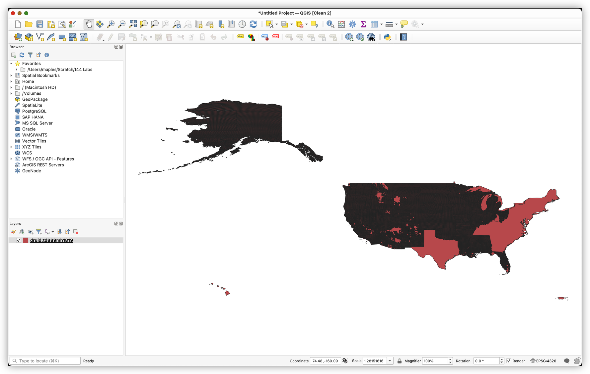
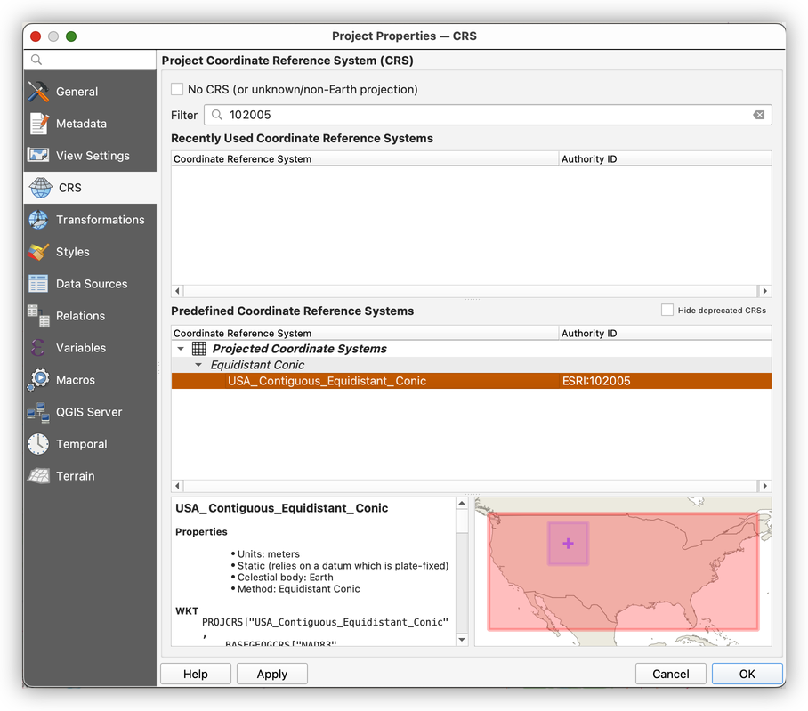

# Georeferencing and Altering Projections

## Data
* Department Of The Interior General Land Office Hon. Binger Hermann, Commissioner. Map Of The State Of Wyoming. Compiled from the official Records of the General Land Office and other sources under the direction of Harry King, C.E., Chief of Drafting Division G.L.O. 1900. Compiled, Drawn and Lettered by I.P. Berthrong [cartographic material] - https://searchworks.stanford.edu/view/10453474
* Public Land Survey System of the United States, 2010 - https://earthworks.stanford.edu/catalog/stanford-td889mh1819

## Downloading the Scanned Map Image

1. In a browser, go to the following link (described above):

### Adding Data from a Web Feature Service (WFS)

1. Open a new QGIS Project and go to Layer>Add Layer>AddWFS Layer... to open the Data Source Manager
2. In the Server Connections panel, lick on the **New** Button
3. Use "Earthworks" as the Name for the connection, and `https://geowebservices.stanford.edu/geoserver/wfs` as the URL. Click OK to add the connection.

4. Back in the Data Source Manager, Click on the Connect Button to create a live connection to the Earthworks server.
5. In the search box, search for `Public Land Survey System of the United States` (You may not need the entire string to return the target layer).
6. Confirm that the layer returned has the following unique identifier: `druid:td889mh1819`

7. Click on the layer in the Search Return window, and then click the Add button, to add the Feature Layer Service to your QGIS Map.
8. Close the Data Source Manager window.

### Using Filters to subset a layer's view

1. Examine the Attributes

2. Build the QUery

### Apply Symbology for Georeferencing Reference

1. Use Transparent Fill  

2. Set the Stroke color to something bright  

### Add a basemap

## Altering a CRS for a specific application

### Examine the scanned map image

You can do this using the PURL Page Viewer, here: https://searchworks.stanford.edu/view/10453474

Compare the top and bottom graticule

1. What is the difference between the Longitude coordinates at the top, and the Longitude coordinates at the bottom of the map?

2. What do we call the line(s) of reference that the top and bottom of the map refer to?

3. Now take a look at the Wyoming/Montana State Line. What do you notice about it? Is it straight?

4. What is the approximate Center Longitude of Wyoming/Montana State Line?

5. What is the approximate Center Latitude?

Use your curser in QGIS to hover over the approximate center of Wyoming and see if the Coordinates match what you have answered, above.

### Altering the CRS of the Project

* Change Project CRS to USA_Contiguous_Equidistant_Conic `ESRI:102005` and observer the results

What has happened to the PLSS Grid Layer?

* Return to Project CRS Properties and Copy the Proj4 Text:

`+proj=eqdc +lat_0=39 +lon_0=-96 +lat_1=33 +lat_2=45 +x_0=0 +y_0=0 +ellps=GRS80 +towgs84=0,0,0,0,0,0,0 +units=m +no_defs`

1. Go to Settings>Custom Projections
2. Add a CRS 
3.
Note the following changes in bold:

+proj=eqdc +lat_0=**43** +lon_0=-**107.5** +lat_1=**37** +lat_2=**49** +x_0=0 +y_0=0 +ellps=GRS80 +towgs84=0,0,0,0,0,0,0 +units=m +no_defs

You can cut & Paste the following:

`+proj=eqdc +lat_0=43 +lon_0=-107.5 +lat_1=37 +lat_2=49 +x_0=0 +y_0=0 +ellps=GRS80 +towgs84=0,0,0,0,0,0,0 +units=m +no_defs`

Once you've created the Custom Projection, apply it:

Save your Project File

## Georeferencer Plugin

* Download **Original Source File** of Wyoming Map
* Launch Layers>Georeferencer Plugin

* Load jp2 image 

* Set Transformation Settings: 

 * 	Transformation Type: Poly2
 *  Resample: Cubic
 *  Target CRS: Your Custom Projection
 *  Save GCP Points
 *  Load in QGIS when done

* Place points at corners and center, then work around for even coverage across the image 

Link Georeferencer to QGIS or Vice Versa 

Press the Start Georeferencing Button when enough points are placed. 

Drag the newly added image below the PLSS Layer

Check the accuracy of your georeferencing against the PLSS grid layer

