## Using SQL to create complex queries in QGIS

### Understanding Relations in SQL and QGIS

Relations in SQL and QGIS allow you to create connections between tables with different numbers of records, enabling more efficient data management and querying. For example, consider a scenario where you are managing a rolling inventory of street trees in your city.

Instead of creating a new point for each tree every time you revisit it for a survey, you can normalize your data by separating it into two tables:

1. A `locations` table containing spatial data (e.g., coordinates, address, property ID) for each tree site.
2. A `survey_records` table storing the survey details (e.g., tree condition, survey date, status like Tree, Dead Tree, Stump, etc.) for each revisit.

By using a `unique_identifier` or _key field_ (e.g., a randomly generated code or coordinate pair) shared between the two tables, you can establish a **one-to-many** relationship. This means each row in the `locations` table corresponds to one or more rows in the `survey_records` table, depending on how many times the location has been surveyed.

This approach eliminates redundancy, as the spatial and static attributes of a location are stored only once in the `locations` table, while dynamic survey data is stored in the `survey_records` table. Using SQL in QGIS, you can leverage this relationship to perform advanced queries, such as:

- Retrieving all survey records for a specific location.
- Identifying locations with specific conditions (e.g., all dead trees or planting sites).
- Summarizing the conditions of all trees in a particular area using spatial queries like **ST_Within** or **ST_Intersects**.

### Applying Relations to Analyze Chemical Releases Near Schools

In this lab, you will use SQL in QGIS to create and explore relationships between datasets to answer the following question:

1. What are the chemicals being released within 1km of any particular school in our study area, and their total Air and Water Release amounts?

By combining attribute and spatial queries, you will:

- Use SQL to join the `toxic_sites_stateplane` and `chemicals` tables based on a shared key (`TRIFID`).
- Perform spatial queries to identify toxic sites within 1km of schools using functions like `ST_Distance`.
- Summarize chemical release data for these sites using aggregate functions like `SUM`.
- Load and visualize the results as new layers in QGIS for further analysis and map creation.

This exercise demonstrates how SQL and relational database concepts can be applied in QGIS to manage and analyze complex spatial and attribute data efficiently.

## Getting Ready

### Download the Data

1. [Download the Data from Github](https://github.com/mapninja/Earthsys144/raw/master/data/Tox2SchoolsLab.zip)
2. **Unzip the data** on your hard drive, preferably somewhere that iCloud or other cloud storage services won't delete you local copies.

### Open the Project

1. **Browse** to and **Open** the `relates.qgz` QGIS Project file.


1. Right-click on the `toxic_sites_stateplane` layer and **>Zoom to Layer...**


### Examine the data

1. Open the **properties** of the layers in the project to **examine their CRS**, and where they are coming from.

Note that the data for this lab is contained in a File Geodatabase. This is proprietary data format, created by Esri and mostly supported in their ArcGIS Desktop and ArcGIS Pro software. QGIS, however, has the ability to read data from a geodatabase, and we are using it here to show that it is possible to interact with data in this format, in QGIS. However, if you want to be able to write to the data (alter geometries, calculate fields, etc...), you will need to export each layer you want to alter, to a QGIS Friendly format.

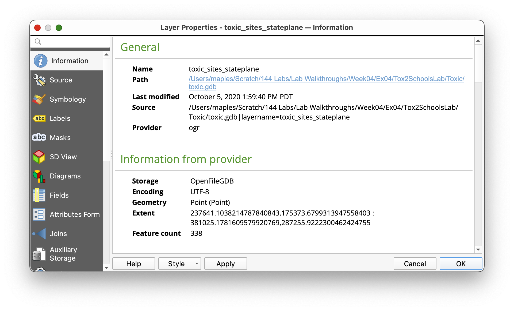

### Opening the DB Manager, to interact with your data, using SQL.

This exercise demonstrates the use of QGIS' DB Manager and the concept of **Virtual Layers**.
QGIS' DB Manager provides a powerful interface for managing spatial databases and executing SQL queries.
Virtual Layers in QGIS allow users to treat layers in their project as if they were part of a database, enabling
the use of SQL to query and manipulate spatial data without requiring an external database.

Key benefits of using Virtual Layers:

- Perform complex spatial queries and joins across multiple layers directly within QGIS.
- Leverage the power of SQL to filter, aggregate, and analyze spatial data.
- Avoid the need for duplicating or exporting data to external databases for advanced querying.
- Dynamically update query results as the underlying data changes.

This approach is particularly useful for GIS analysts and developers who need to perform advanced data analysis or integrate data from multiple sources in a seamless and efficient manner.

### Opening the DB Manager and Accessing the SQL Query Window

1. Go to the **Main Menu** and click on **Database > DB Manager** to open the **DB Manager** interface.

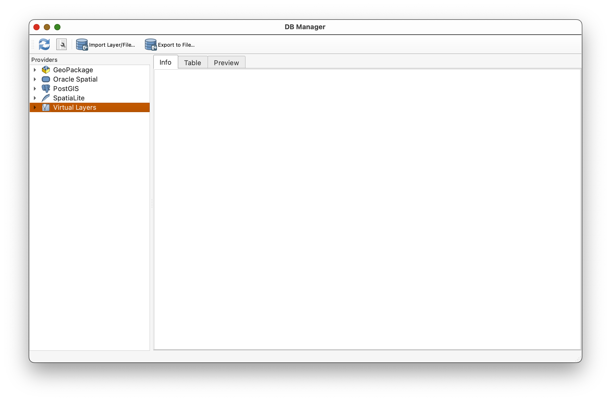

1. In the **DB Manager** window, expand the **Virtual Layers** section in the left-hand panel.

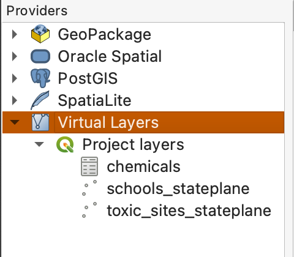

1. Locate and select your project layers listed under the **Virtual Layers** menu.
2. Click on the **SQL Window** button 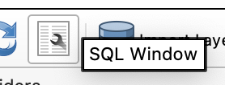 in the toolbar (or press `Ctrl+Q`) to open the SQL query window.
3. You can now write and execute SQL queries directly on your project layers.

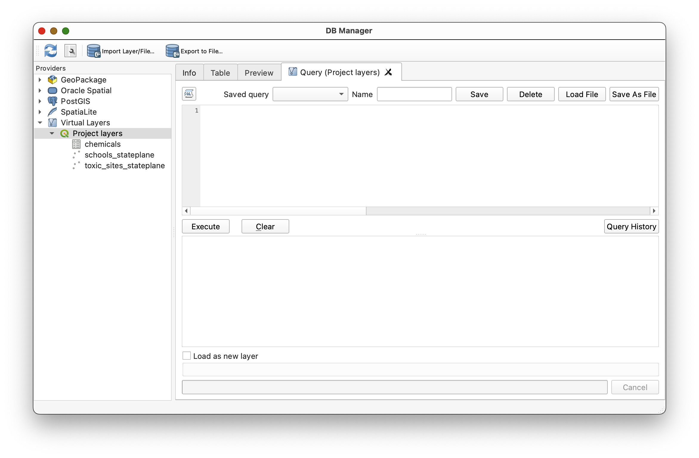

### Loading the "pre-baked" SQL Queries for the lab

QGIS conveniently allows you to save your queries in the DB Manager. Here, we will use SQL queries that I have previously created and tested for you. Your task will be to review and run these scripts, observe the results, and in some cases, alter the scripts to see new behaviors. You will also alter a few of these scripts for your final assignent, to turn in. ***Be sure to give your versions UNIQUE NAMES when you SAVE them in DB Manager, or you will overwrite the scripts I have provided you.***

1. In the SQL query window, review the loaded queries using the **Saved query** dropdown.
2. ***NOTE THAT THE QUERIES ARE NOT NECESSARILY IN NUMERIC ORDER. THIS IS BECAUSE QGIS DOESN'T ALWAYS SORT THE LIST AUTOMATICALLY SO IT IS UP TO YOU TO ENSURE YOU ARE USING THE RIGHT QUERY SCRIPT!!***

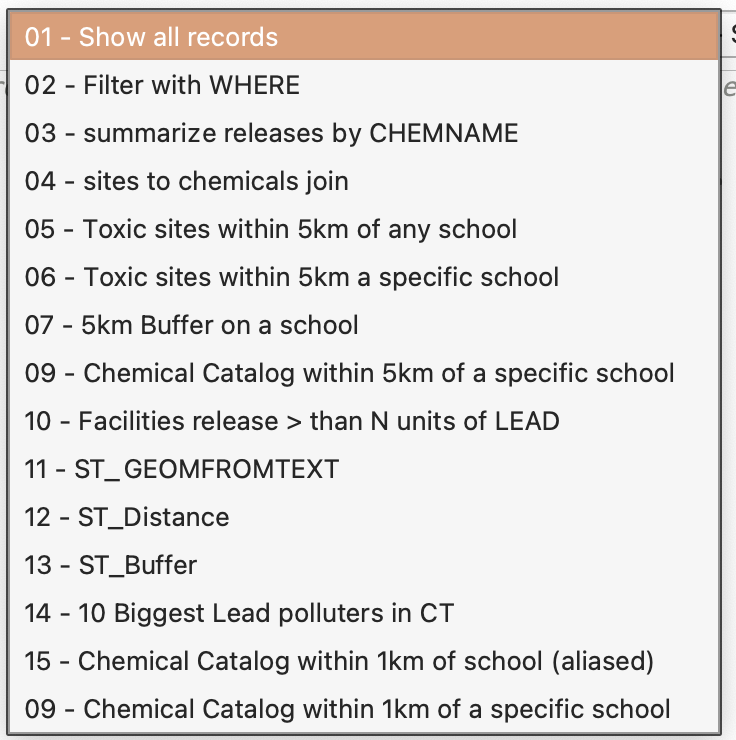

5. Load the first SQL QUery `01 - Show all records` by selecting it from the dropdown.

### The first SELECT statement

### The SELECT Statement in SQL

The `SELECT` statement is a cornerstone of SQL, enabling users to query and retrieve data from databases. It provides the flexibility to specify particular columns or use the `*` wildcard to fetch all columns from a table. For instance, the loaded query demonstrates how to retrieve all data from the `chemicals` table:

```sql
-- This query retrieves all records from the 'chemicals' table.

SELECT *  			-- The asterisk (*) is used to select all columns from the table. This means every piece of data in every column will be returned for each row in the table.
FROM chemicals;  	-- Specifies the table 'chemicals' as the source of the data. This table contains information about various chemicals, possibly including their names, properties, usage, and environmental impact data.
```

This query is particularly useful for gaining a comprehensive view of the dataset, especially during the initial stages of data exploration or when preparing for more specific analyses.

6. Press the **Execute** button to run the query.
7. Review the results displayed in the output panel to confirm that all records are shown as expected.

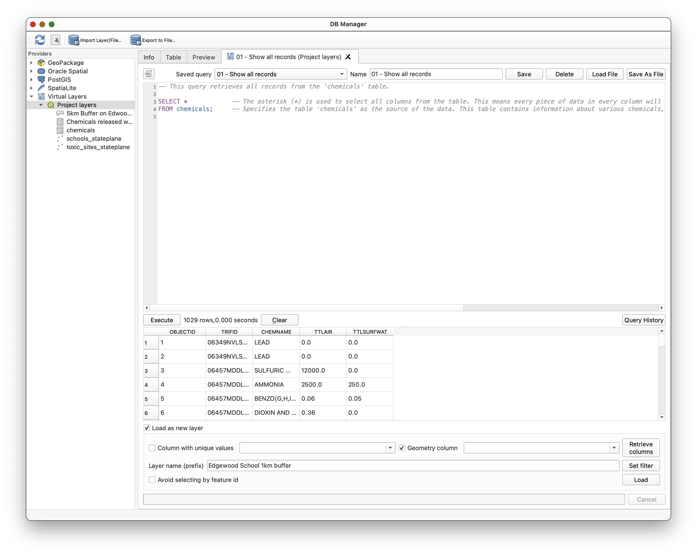

### Using WHERE to limit what SELECT returns

The `WHERE` clause in SQL is a powerful tool for filtering data based on specific conditions. It allows you to narrow down the results of a query to only those rows that meet the criteria you define. For example, in the following query, the `WHERE` clause is currently commented out, but if you delete the `--` infront of the line, it will be used to retrieve only the records from the `toxic_sites_stateplane` table where the facility is located in the city of "New Haven." This approach is particularly useful when working with large datasets, as it helps focus on the most relevant information for your analysis.

```sql
-- This query retrieves all records from the 'toxic_sites_stateplane' table
-- where the facility is located in the city of New Haven.

SELECT *  -- The asterisk (*) means "select all columns." 
FROM toxic_sites_stateplane  	-- Specifies the table from which to retrieve data
WHERE FCITY = 'NEW HAVEN';  	-- The WHERE clause filters the results to include only those rows where the value of the FCITY column is 'NEW HAVEN'.
```

1. Load the `02 - Filter with WHERE` script from the Saved Query dropdown
2. Execute the query by clicking the **Execute** button.
3. Observe the updated results, which should now display only the facilities located in New Haven, CT, or 11 rows.

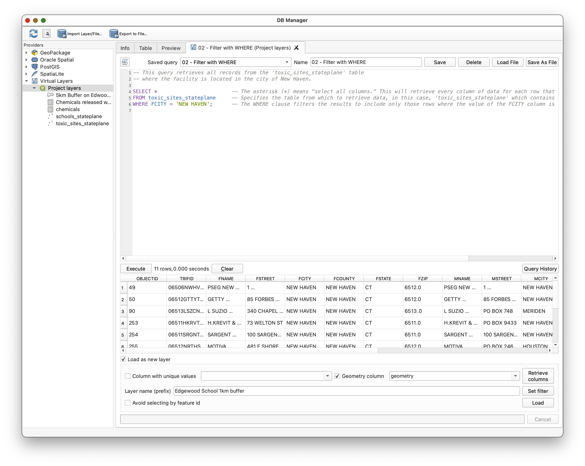

### Using an Aggregate function to summarize Chemical releases

### Understanding the GROUP BY Clause in SQL

The `GROUP BY` clause in SQL is a powerful tool used to organize data into groups based on one or more columns. It is often used in conjunction with aggregate functions like `SUM`, `COUNT`, `AVG`, `MAX`, and `MIN` to perform calculations on each group of data. For example, the following query groups the data by `CHEMNAME` and calculates the total air and water releases for each chemical:

```sql
-- This query calculates the total releases of chemicals into the air and water, grouped by each chemical name.

SELECT 
    CHEMNAME,  									-- Selects the name of the chemical from the 'chemicals' table.
    SUM(TTLAIR) AS TotalAirRelease,  			-- Sums up all air release amounts for each chemical and labels this sum as 'TotalAirRelease'.
    SUM(TTLSURFWAT) AS TotalSurfaceWaterRelease -- Sums up all surface water release amounts for each chemical and labels this sum as 'TotalSurfaceWaterRelease'.
FROM 
    chemicals  									-- Specifies the 'chemicals' table as the source of the data, which contains detailed records on various chemicals including their release amounts.
GROUP BY 
    CHEMNAME;  									-- Groups the results by the chemical name. This means the SUM operations for air and water releases are calculated for each unique chemical name in the table.
```

This query is particularly useful for summarizing data and identifying patterns or trends within specific groups.

### Steps to Load and Execute the Saved Query "01 - summarize releases by CHEMNAME"

1. Click on the **Saved query** dropdown and select the query titled `03 - summarize releases by CHEMNAME`
2. Review the query to understand its structure and purpose.
3. Press the **Execute** button to run the query.
4. Observe the results in the output panel, which should display the total air and water releases grouped by each chemical name, in 128 rows.

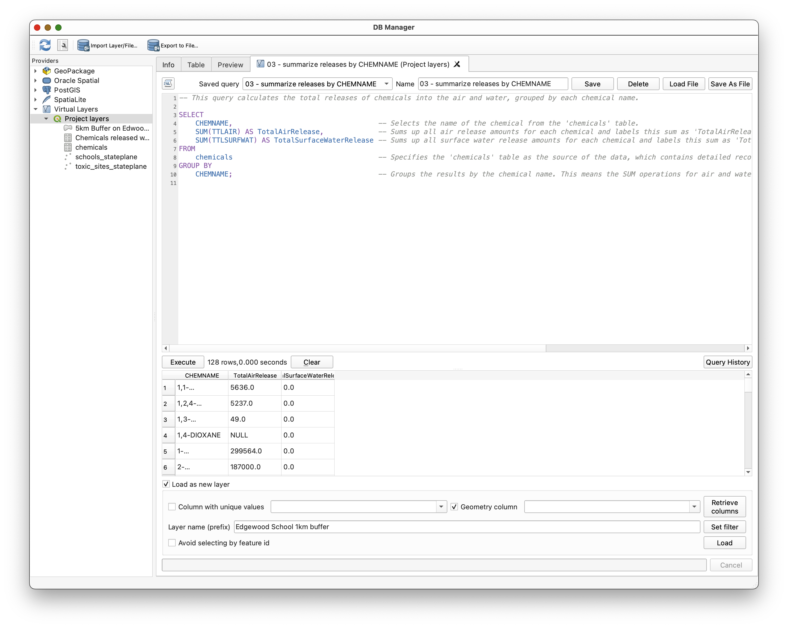

### Joining Tables

### Joining Tables in SQL

Joins in SQL allow you to combine data from multiple tables based on a related column. This is particularly useful when working with normalized datasets, where related information is stored across different tables. Below is an example of a query that joins two tables, `toxic_sites_stateplane` and `chemicals`, to retrieve detailed information about toxic sites and their associated chemical releases.

```sql
-- This query retrieves detailed information from two tables: toxic_sites_stateplane and chemicals.
-- It includes all columns from toxic_sites_stateplane and specific chemical release data for each site.

SELECT 
    toxic_sites_stateplane.FNAME,  					-- Selects the FNAME column from the 'toxic_sites_stateplane' table. 
    chemicals.CHEMNAME,  				-- Selects the 'CHEMNAME' column from the 'chemicals' table, which contains the names of the chemicals.
    chemicals.TTLAIR,  					-- Selects the 'TTLAIR' column from the 'chemicals' table, indicating the total air releases of chemicals.
    chemicals.TTLSURFWAT  				-- Selects the 'TTLSURFWAT' column from the 'chemicals' table, indicating the total releases into surface water.
FROM 
    toxic_sites_stateplane -- Specifies the 'toxic_sites_stateplane' table as the primary source of data.
JOIN 
    chemicals  			-- Performs a JOIN operation with the 'chemicals' table.
ON 
    toxic_sites_stateplane.TRIFID = chemicals.TRIFID;  		-- Uses 'TRIFID' as the joining condition. This means the join occurs where the 'TRIFID' values in both tables match.
```

This query performs an **INNER JOIN**, meaning it only includes rows where there is a match in both tables based on the `TRIFID` column.

1. Click on the **Saved query** dropdown and select the query titled `04 - sites to chemicals join`.
2. Review the query to understand its purpose and structure.
3. Press the **Execute** button to run the query.
4. Observe the results in the output panel, which should display 1029 rows. These rows represent the joined data from `toxic_sites_stateplane` and `chemicals`.

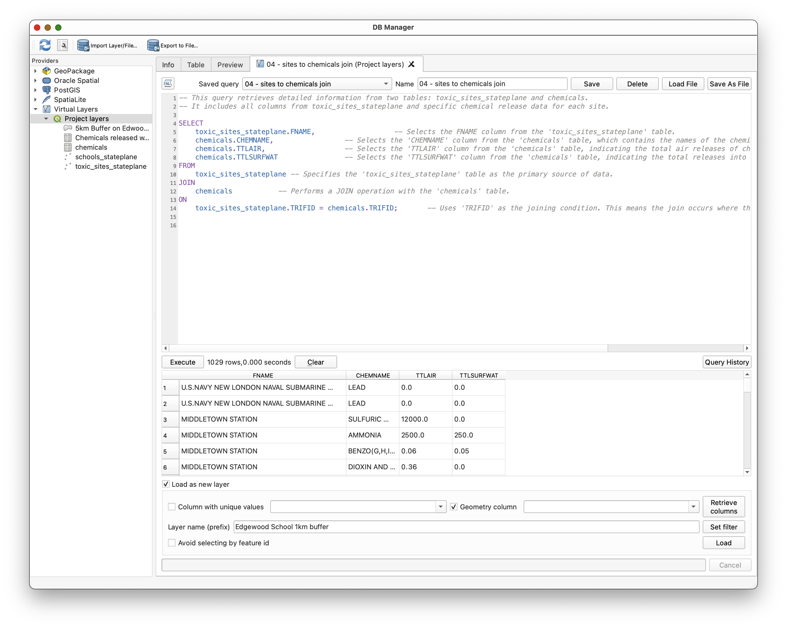

Again, this query performs an **INNER JOIN**, meaning it only includes rows where there is a match in both tables based on the `TRIFID` column.

When performing a join, rows from the `toxic_sites_stateplane` table may appear multiple times in the results if there are multiple matching rows in the `chemicals` table for the same `TRIFID` value. This happens because the join creates a combination of every matching pair of rows from the two tables. For example, if a single toxic site is associated with multiple chemicals, that site's data will be repeated for each associated chemical in the result set.

### Using ST_Distance() to Analyze Proximity

The `ST_Distance()` function in SQL is a spatial function used to calculate the distance between two geometries. It is particularly useful in GIS for proximity analysis, such as identifying features within a certain distance of other features. In this example, we use `ST_Distance()` to find all toxic sites located within 5 kilometers of any school.

The following query demonstrates how to use `ST_Distance()` to perform this analysis:

```sql
-- Return all toxic sites within 5 km of any school
SELECT DISTINCT
    toxic_sites_stateplane.* -- Selects all columns from the 'toxic_sites_stateplane' table, ensuring no duplicate rows in the result.
FROM 
    toxic_sites_stateplane, -- Specifies the 'toxic_sites_stateplane' table
    schools_stateplane -- Specifies the 'schools_stateplane' table
WHERE 
    ST_Distance(toxic_sites_stateplane.Geometry, schools_stateplane.Geometry) <= 5000; -- Filters the results to include only rows where the distance between the geometries of toxic sites and schools is 5 km (5000 meters) or less.
```

This query retrieves all unique toxic sites that are within 5 kilometers (5000 meters) of any school by comparing their geometries.

1. In the **Saved query** dropdown, select the query titled `05 - Toxic sites within 5km of a school`.
2. Review the query to understand its purpose and structure.
3. Press the **Execute** button to run the query.
4. Observe the results in the output panel, which should display all toxic sites within 5 kilometers of any school.

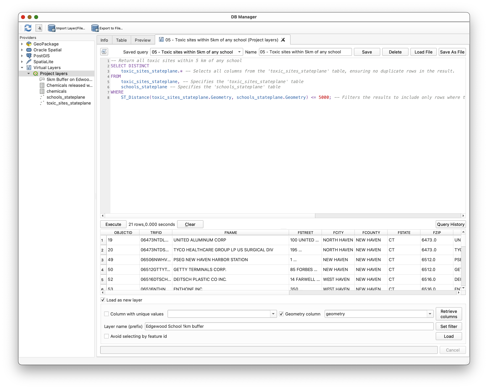

### Using ST_Buffer() to create a visual representation of our 5km query and loading it as a layer

In QGIS, SQL queries that generate geometries can be loaded directly as layers, allowing you to visualize the results on the map. This is particularly useful for spatial analyses, such as creating buffers, calculating intersections, or performing proximity analyses. The following example demonstrates how to create a 5km buffer around a schools and load the resulting geometry as a layer in QGIS.

```sql
-- This SQL query creates a 5km buffer around a specified school
SELECT
    schools_stateplane.NAME, 		-- Select the name of the school
    ST_Buffer(schools_stateplane.geometry, 5000) AS geometry 	-- Create a new geometry representing a 5km buffer around the school's location
FROM 
    schools_stateplane 		-- From the schools_stateplane table
WHERE 
schools_stateplane.NAME = "Edgewood Magnet School (K-8) "; 	-- Filter to include only the school with the specified name
```

1. From the **Saved query** dropdown, select the query titled `07 - 5km Buffer on a school`.
2. Review the query to understand its purpose and structure.
3. Check the **Load as new layer** checkbox at the bottom of the SQL Query Window.
4. Provide a meaningful name for the new layer, such as `5km Buffer on Edgewood Magnet school`.
5. Click the **Load** button to execute the query and load the buffer as a new layer in your QGIS project.

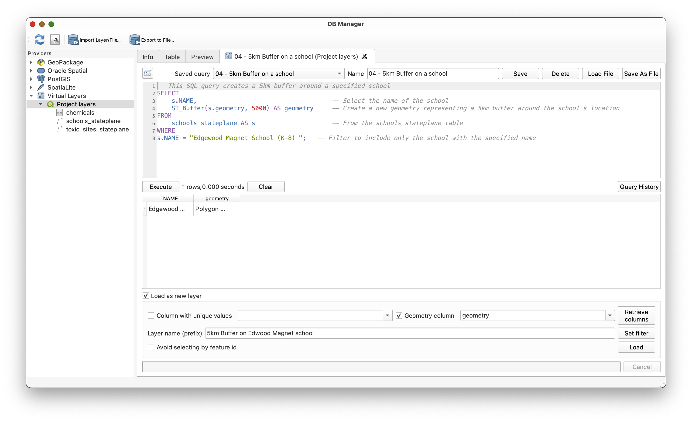

#### Styling the Buffer Layer

1. Return to the main QGIS window.
2. Locate the newly added buffer layer (`Edgewood_5km_Buffer`) in the **Layers Panel**.
3. Select the `5km Buffer on Edwood Magnet school` layer and click on the Styling Panel button  .
4. In the **Layer Styling** panel:

   - Set the **Fill color** to a transparent red (e.g., adjust the opacity slider to make it semi-transparent).
   - Ensure the **Outline color** is distinct and visible.
5. Drag the buffer layer below the `schools_stateplane` layer in the **Layers Panel** to ensure the school points remain visible above the buffer.

This process allows you to visualize the spatial relationship between the school and its surrounding area within a 5km radius.


## Using an OUTER JOIN to catalog all chemical released within 5km of a school and loading it as a table.

### Understanding OUTER Joins in SQL

An **OUTER JOIN** in SQL is used to combine rows from two or more tables, ensuring that all rows from one table are included in the result, even if there is no matching row in the other table. This is particularly useful when you want to include all records from one table and only the matching records from another, filling in `NULL` values where no match exists.

In the provided query, we are not explicitly using an OUTER JOIN, but the concept of ensuring all relevant data is included is achieved through the use of a subquery and filtering. The query identifies all toxic sites within 5 kilometers of a specific school and summarizes the chemical releases associated with those sites. This ensures that only the relevant data is included in the final result.

The query is structured to:

1. Identify toxic sites within 1 kilometers of a specific school using a subquery.
2. Join the toxic sites with the chemicals table to retrieve chemical release data.
3. Summarize the total air and water releases for each chemical.
4. Optionally sort the results by the highest release amounts.

```sql
SELECT 
    chemicals.CHEMNAME,  -- Select the name of the chemical.
    SUM(chemicals.TTLAIR) AS TotalAirRelease,  -- Calculate the total air release for each chemical.
    SUM(chemicals.TTLSURFWAT) AS TotalSurfaceWaterRelease  -- Calculate the total surface water release for each chemical.
FROM 
    toxic_sites_stateplane  -- Use the toxic sites table as the primary data source.
JOIN 
    chemicals  -- Join with the chemicals table to get release data.
ON 
    toxic_sites_stateplane.TRIFID = chemicals.TRIFID  -- Match rows where the TRIFID values are the same in both tables.
WHERE 
    toxic_sites_stateplane.TRIFID IN (  -- Filter to include only toxic sites within 5km of the specified school.
        SELECT DISTINCT
            toxic_sites_stateplane_inner.TRIFID  -- Get unique identifiers of toxic sites.
        FROM 
            toxic_sites_stateplane AS toxic_sites_stateplane_inner,  -- Use the toxic sites table.
            schools_stateplane  -- Use the schools table.
        WHERE 
            schools_stateplane.NAME = 'Jepson Magnet School (PreK-8) '  -- Specify the school of interest.
            AND ST_Distance(schools_stateplane.geometry, toxic_sites_stateplane_inner.geometry) <= 1000  -- Include toxic sites within 5km of the school.
    )
GROUP BY 
    chemicals.CHEMNAME  -- Group the results by chemical name to summarize release amounts.
-- ORDER BY TotalAirRelease DESC;  -- Uncomment to sort by the highest total air release.
-- ORDER BY TotalSurfaceWaterRelease DESC;  -- Uncomment to sort by the highest total surface water release.
```

### Steps to Run and Explore the Query

1. Open the **Saved query** dropdown and select the query titled `"09 - Chemical Catalog within 1km of school"`.
2. Review the query structure and purpose.
3. Execute teh query to see the initial results.
4. Uncomment the line `-- ORDER BY TotalAirRelease DESC;` to sort the results by the highest total air release.
5. Execute the query, again, by pressing the **Execute** button.
6. Observe the results in the output panel, noting the chemicals with the highest air release amounts.
7. Comment out the `ORDER BY TotalAirRelease DESC;` line and uncomment the line `-- ORDER BY TotalSurfaceWaterRelease DESC;` to sort the results by the highest total surface water release.
8. Rerun the query and observe the updated results, focusing on the chemicals with the highest water release amounts.
9. Use the "Load as new layer" option in DB Manager to add the table to your QGIS PRoject.

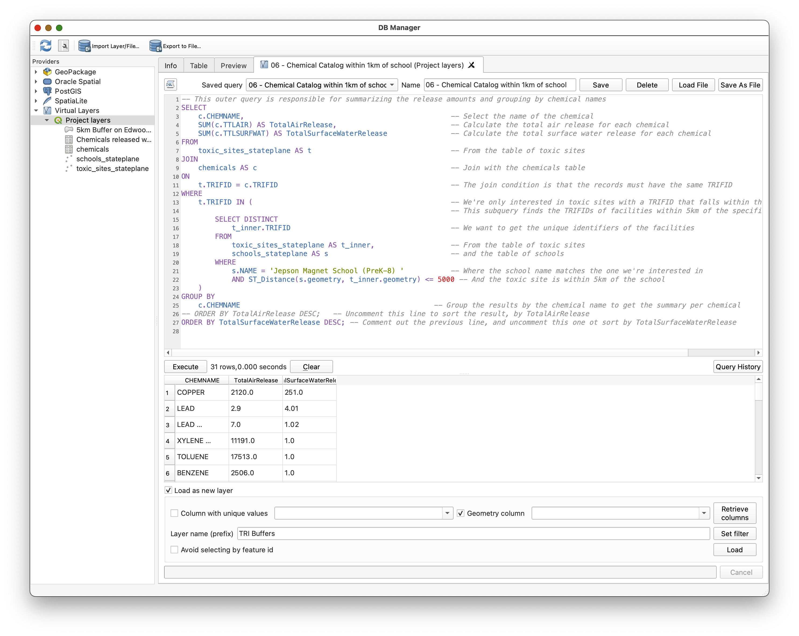

Create a Map Layout:

1. With *only the school you ran the Chemical Report on* `'Jepson Magnet School (PreK-8) '` visible in the map (Hint: Use script `02 - Filter with WHERE` as a model to create a simple SELECT statement on `schools_stateplane` with a WHERE clause that asks for only `'Jepson Magnet School (PreK-8) '`, the school you queried). Use the "*Load as new layer*" feature in **DB Manager** to add the layer to your QGIS project and apply appropriate symbology.
2. Create a 1km buffer, underneath that school, with appropriate symbology. (Hint: Use the `07 - 5km Buffer on a school` query you used earlier, and simply change the query value to the 'Jepson Magnet School (PreK-8) ')
3. All TRI Sites from `toxic_sites_stateplane`  within the buffer visible. (You don't need to make a new layer, just "Zoom to layer" on your Buffer Layer from above, and
4. A basemap of your choice (but a choice that makes sense for your operational layers, above)
5. Insert the Chemical Catalog Table you created in the last step of the exercise, using the **Add Attribute Table tool** in the QGIS Layout Editor.
6. Add appropriate cartographic elements, including title, scale, CRS, your name, and the date.
7. Export to PDF for your submission.
