## Creating New Tables & Joining Tables

Creating a table and joining it to existing tables is a common operation.  Often, this join involves a one-to-many relationship between tables. Each record in one table matches many records in the second table. **For example, a typical county may have approximately 80 different soil types, but over 100,000 different soil polygons of these types.**

In tabular form, we may have properties for each of the 80 different types, e.g., crop productivity, engineering properties, moisture characteristics.  If we have the appropriate 'keyfields' in our data, we can join this table to our existing county data layer. Joins create "Virtual relationships" between datasets, which saves space, because we don’t have redundant copies of the soil properties information saved for each instance of a soil polygon in our data layer.

This exercise provides an end-to-end workflow in QGIS for enriching spatial data through table creation and joins, then composing a final PDF map. You will:

- Import a soils shapefile and a soil properties CSV into a new project
- Inspect and match the keyfield (`SOIL_TYPE`) for a one-to-many table join
- Apply categorical symbology to visualize soil types
- Perform and verify the attribute join between the shapefile and CSV
- Design a map layout with the joined attribute table and export it as a PDF

Learning objectives:

- Preparation of tabular data for joining to existin spatial data
- Practice creating and joining tables in QGIS
- Understand the importance of matching field types and keys
- Apply symbology and layout tools to produce a professional map with integrated tables
- Recognize how joins enhance GIS analysis by linking spatial and tabular data

### Table Joins

1. Open a new blank project, and save it to a new project file, preferably in the same folder as the **L7** data, you have been working with previously.
2. Add the `soils.shp` data layer from the **L7** data you downloaded for the previous exercises.
3. Right-click on the **soils layer** and go to **Layer CRS>Set Project CRS from Layer**

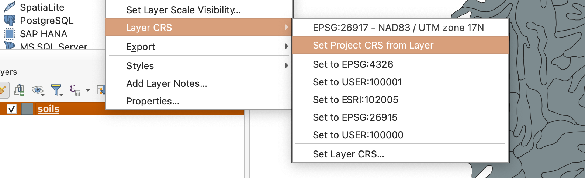

3. Set a **Categorical symbology** based on the variable `SOIL_TYPE` (Don’t forget to click “**Classify**” to see your symbols)

You should have a layer displayed something similar to this, though color assignment is random so there will be slight variations from user to user:

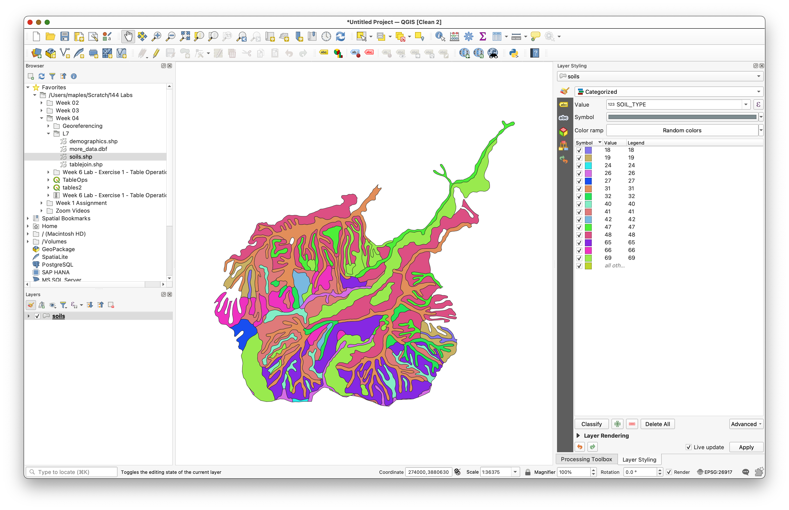

The `SOIL_TYPE` attribute contains a code corresponding to the soil type of each individual polygon.  Notice there are 15 different soil types designated by numbers between 18 and 69.  There are 122 different soil polygons.

In this exercise you will use the `SOIL_TYPE` variable in the soils shapefile as the **join item**, or **join column**. **_This is the “keyfield” that will be used in a join_**.  This join matches the table rows for layer `soils.shp` to a new soil properties table you will import.

1. Examine `SOIL_TYPE`, or proposed “keyfield” or "join column" in the target table, via the **Properties>Fields tab**.

This should display:

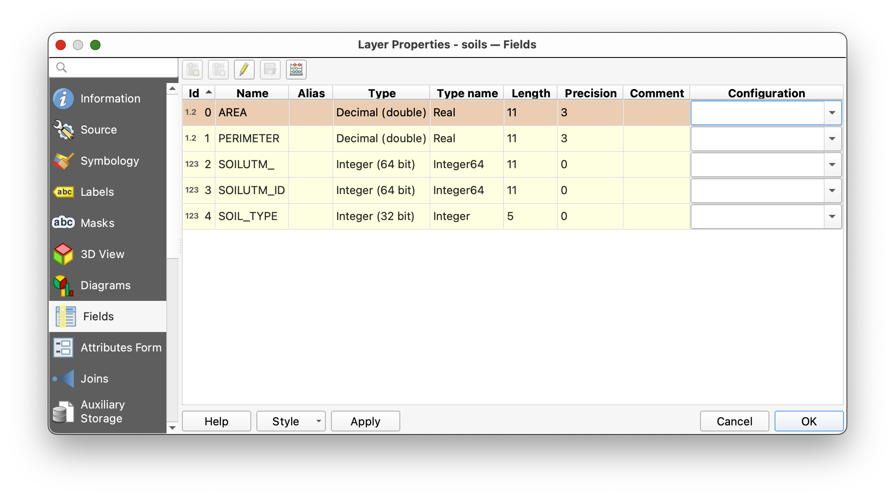

Note the **properties** of the `SOIL_TYPE` item, **especially the _Type_**, but **also the _length and precision_**. It is generally best for join keys to have the same type in both tables, e.g., we wouldn’t want to try to join an **Integer** to a Decimal, or to text variables.

Now we need to download a new data table with information not included in the current table. We’ll then join this new table to **soils.shp**.

### Download the  **[`SoilProperties.csv`](https://docs.google.com/spreadsheets/d/1iD5DjOD3nREz_jGUGGMMLikyvq23z9LrmB6zJWiJBjM/edit?usp=sharing), or comma separated value file**.

This is a text file with commas between each column entry, with a line in the file corresponding to each row.  **Excel, OpenOffice, Google Sheets or LibreOffice** are all spreadsheet software that allow you to easily enter the data in cells, then export it as a CSV formatted file, so if you ever need to create a table of this sort, its quite easy.

**Here is the link for the table you will download:**

[https://docs.google.com/spreadsheets/d/1iD5DjOD3nREz_jGUGGMMLikyvq23z9LrmB6zJWiJBjM/edit?usp=sharing](https://docs.google.com/spreadsheets/d/1iD5DjOD3nREz_jGUGGMMLikyvq23z9LrmB6zJWiJBjM/edit?usp=sharing)

1. Once you have the [Soil Properties Google Sheet](https://docs.google.com/spreadsheets/d/1iD5DjOD3nREz_jGUGGMMLikyvq23z9LrmB6zJWiJBjM/edit?usp=sharing) open, use **File>Download>Comma-separated values (.csv)** to download to your computer.


2. Move the `Soil Properties - Sheet1.csv` to the same folder as your soils.shp dataset.
3. Use the **Browser panel** to browse to the location that you placed the `Soil Properties - Sheet1.csv` in and **right-click** it to **Add Layer to Project...**
4. This should add the table to your QGIS **Layers panel**.  Left-click and open the new table, verifying the values for rows and columns.

### Changing the data type of a column using the Field Calculator

1. Examine the **attributes** of the `Soil Properties - Sheet1.csv` table. Note that ALL OF THE ATTRIBUTE VALUES ARE "JUSTIFIED LEFT" which is an indication that they are all being stored as STRING values, in the csv...

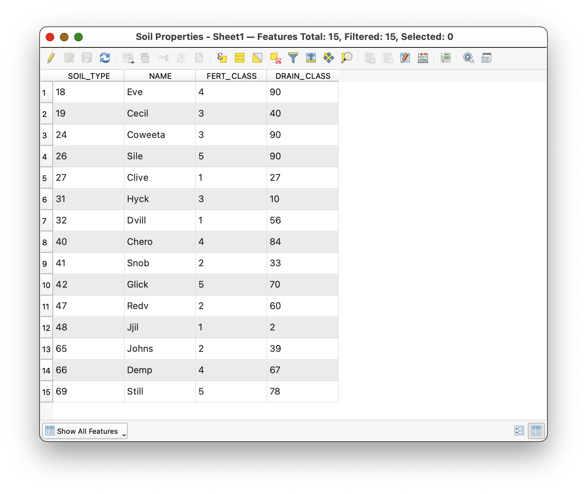

### Why CSV Files Often Require Data Type Adjustment

CSV (Comma‑Separated Values) is a plain‑text format and does not store metadata about the type of each column (integer, float, date, etc.). When QGIS (or other GIS/software) imports a CSV, it defaults to treating all fields as text—hence the left‑justified values you see. This can lead to:

- Inability to perform numeric or date calculations directly
- Join or relate failures if the join field types don’t match exactly (e.g., string vs. integer)
- Hidden characters, extra whitespace, or inconsistent formatting that break attribute matching

To ensure successful JOINs and Relates, you often need to:

* Clean and normalize text fields (trim whitespace, remove quotes or special chars)
* Convert strings to the correct data type using the Field Calculator or export to a format that preserves types (e.g., GeoPackage)
* Verify that both layers use the exact same data type and formatting for the join field

2. Close the `Soil Properties - Sheet1.csv` attribute table, open the properties of the `Soil Properties - Sheet1.csv`and select the **Fields** tab

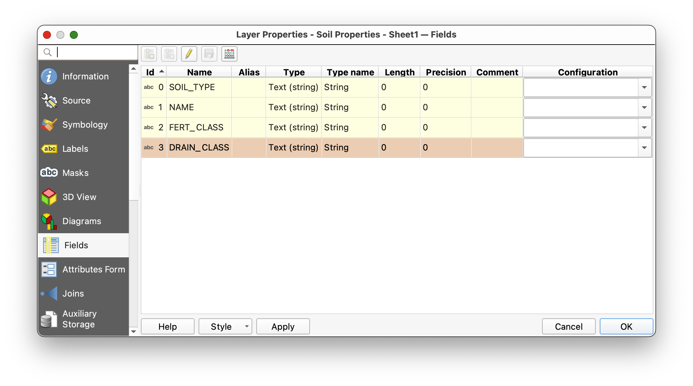

3. Note the **Type/Type name** of the fields, and in particular that the `SOIL_TYPE` in this table does not currently have the same Type as `SOIL_TYPE` attribute in the `soils.shp` layer.
4. Close the properties dialog, and Open the `Soil Properties - Sheet1.csv` attribute table, again.
5. Open the **Field Calculator**, where you will **Create a new field**, called `SOIL_TYPE_INT`
6. **Search** for "int" in the **Search box** and select the `to_int` function from the **Conversions** functions subset, and read it's description, on the right.
7. Build an expression around your `SOIL_TYPE` variable, using the `to_int` function:

   ```
   to_int( SOIL_TYPE)
   ```

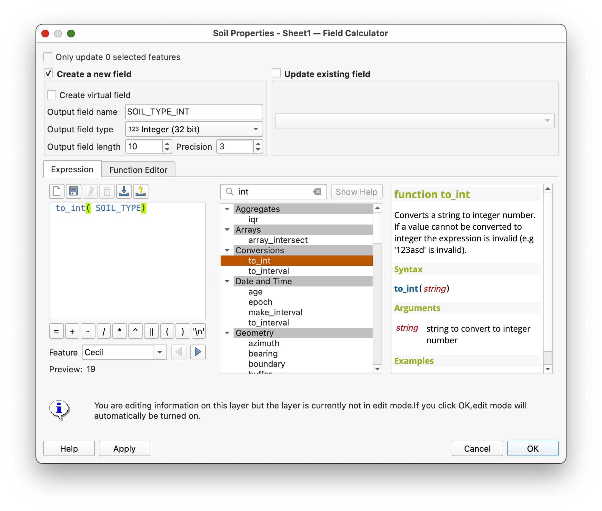

12. Once you have the expression written, and the **Preview** is successful, click **OK** to create the new field called `SOIL_TYPE_INT`
13. **Toggle Editing** off, and **save** your edits.

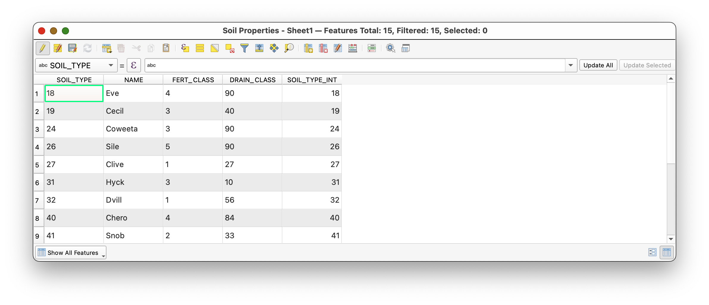

13. Note that the values in the new `SOIL_TYPE_INT` field are "JUSTIFIED RIGHT" indicating, generically, that they are stored as a *numeric value*.
14. Close the attribute table, open the Properties of the `Soil Properties - Sheet1.csv` layer, click on the **Fields** tab and note the **Type/Type name** of the new `SOIL_TYPE_INT` field.

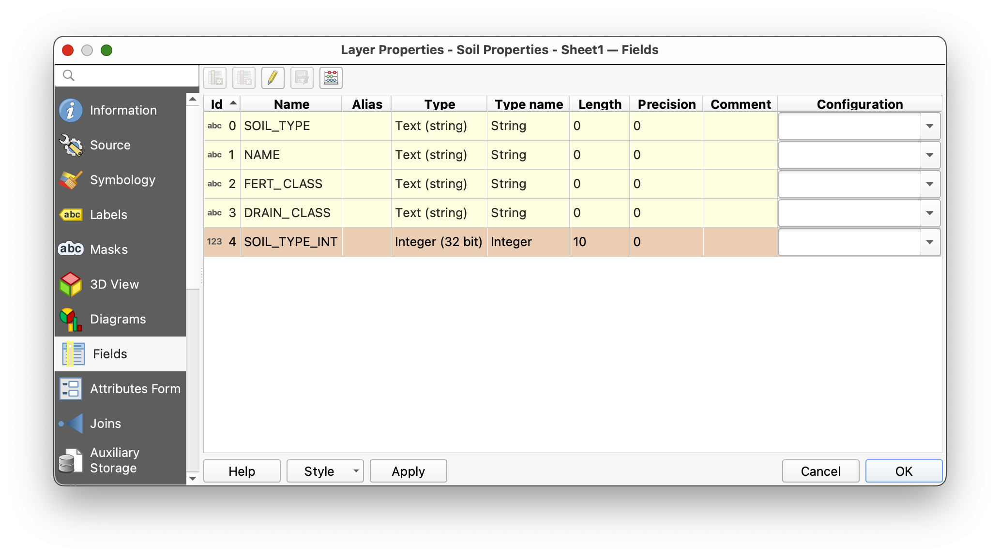

#### NOTE:

The "data Carpentry" steps described here—such as ensuring key fields match exactly before joining tables—are not always strictly necessary in QGIS. QGIS is generally more permissive than other GIS platforms when it comes to mismatched key fields during joins. However, understanding and practicing these data preparation steps is critical. Even though QGIS may allow joins with minor discrepancies, such idiosyncrasies can sometimes lead to subtle errors or unexpected results in your data analysis and mapping. Developing good habits around data cleaning and key field consistency will help prevent issues down the line, especially when working with more restrictive software or sharing your data with others.

### Joining the table to you spatial data

9. **Join** the `soils` layer **attribute rtable** and the `Soil Properties - Sheet1.csv` table you just added, using the **Join tab**, from the  soils layer **Properties**. Remember to use the common field `SOIL_TYPE` to join the files. If you are unclear on how to join, refer to the instructions on joining earlier in this lab.

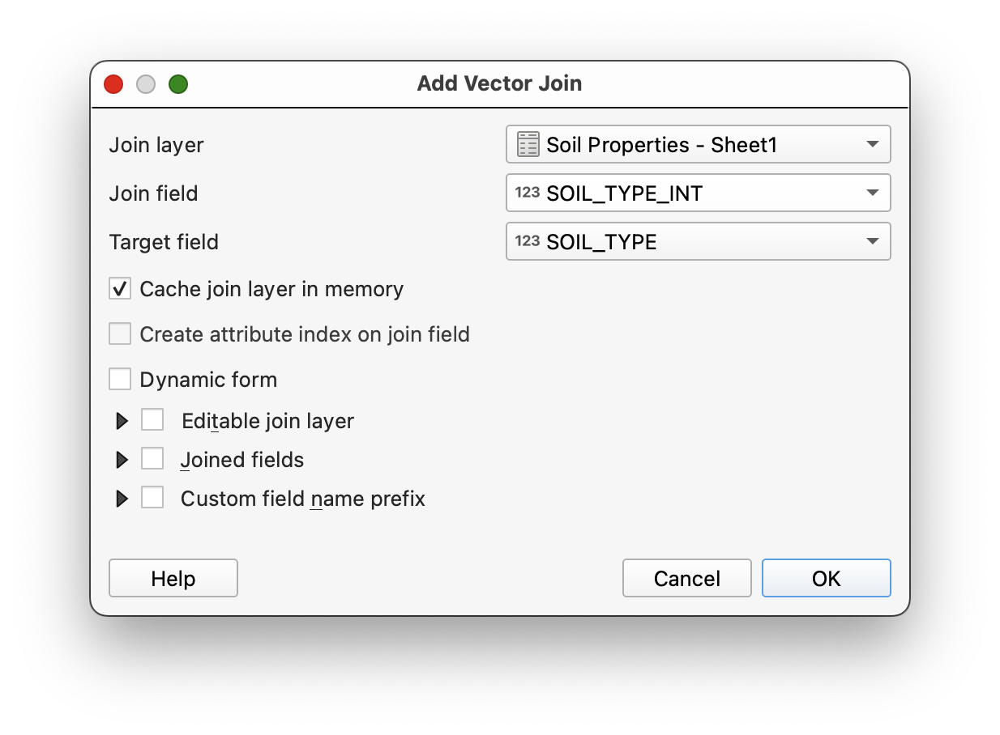

6. Open the **Attribute Table** of your newly joined **soils layer**  to confirm the new data  has been properly joined.

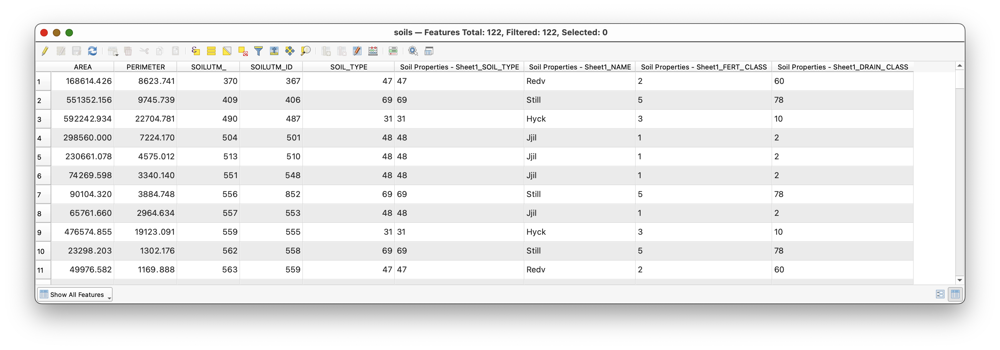

Note that, although you have many more records in your original `soils layer` (122) than your `SoilProperties.csv` (15), your Join has connected the correct record, to each individual soil polygon record. While this DOES represent redundancy, the relationship is being defined, virutally, so this redundancy doesn't actually cost anything significantly, in terms of storage, though for very large datasets, performance can be affected. 

## To turn in:

After you’ve completed the join, create a map (PDF) using the new soils data.

* Display soils in a categorical map using the `NAME` field, added from the `SoilProperties.csv`
* Use the Add Attribute Table toolto add your **SoilProperties.csv** table to your layout. Experiment with the **Item Properties** (particularly the **Attributes Button** to clean up the header labels), for formatting the table.
* Remember that **unchecking Auto update** for your **legend** allows you to click on individual items in the legend and remove or edit (Edit item button:) their appearance in the layout.
* Add the usual map elements (title, name, CRS, scale, basemap, etc…), and export a **PDF** of your map.

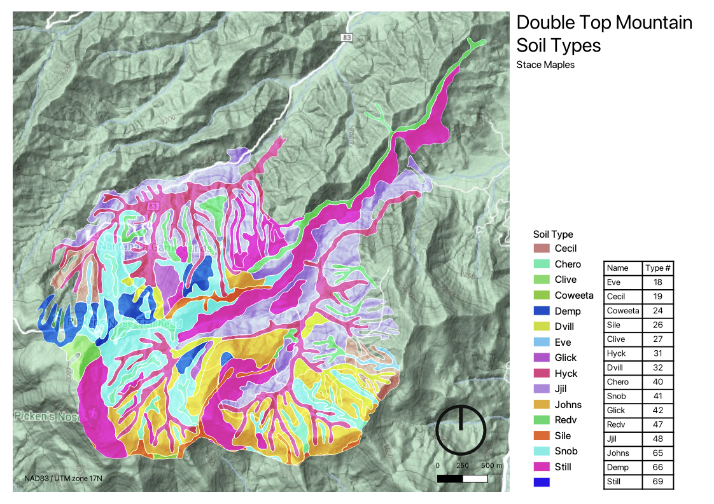

I’d like to stress the utility of what you’ve just done.  You will often want information grouped and displayed in different ways, and joins are then used to add information to and produce maps, often from pre-existing boundary datasets.  Geographic data may be joined to many different sets of tabular data that aggregate characteristics we are interested in. These joined sets may be selected based on many combinations of attributes, greatly increasing the flexibility and utility of data in a GIS.
