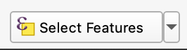
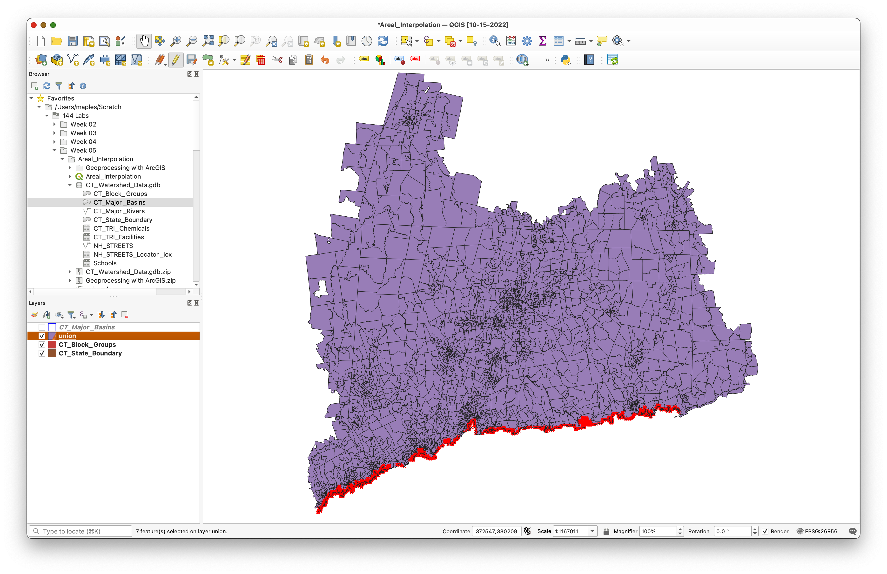
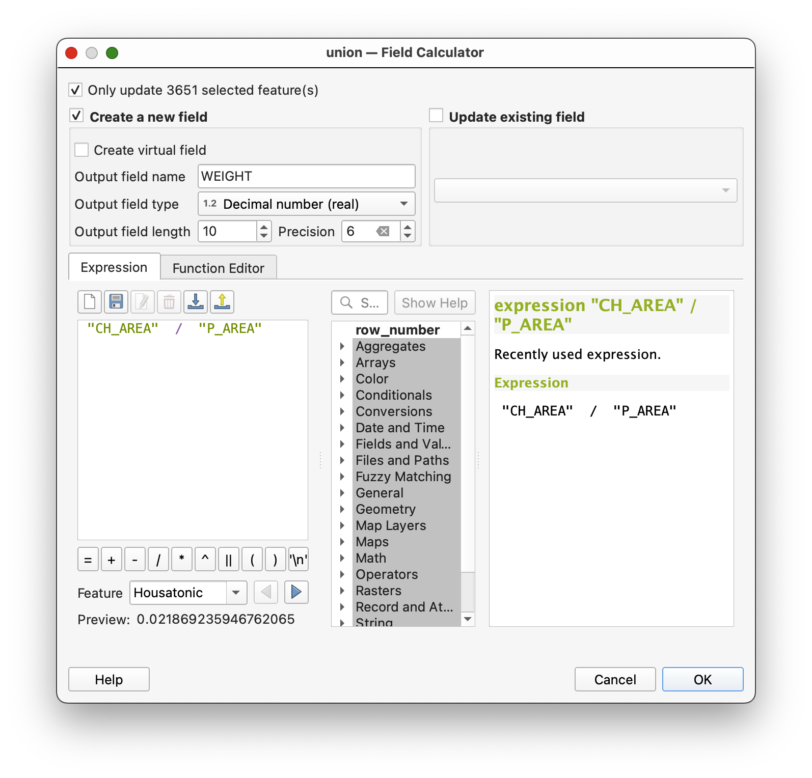
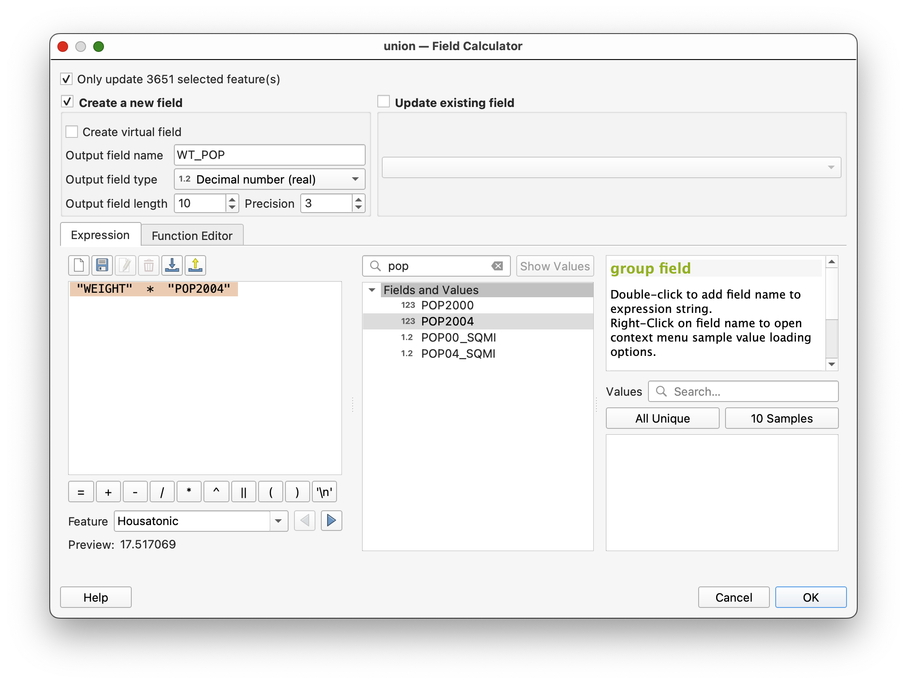

## Areal Interpolation of Attributes

In this exercise, we will be performing what is referred to as “Areal Interpolation” of Census Attributes.  We have a set of boundaries (in this case the Major Watershed Basins of Connecticut, our CT_Major_Basins Layer) for which we would like to summarize the population.  Our problem is that these watershed boundaries do not correspond with the geographic units that the U.S. Census uses to collect and tabulate demographic data.  Some of the Census Block Groups in our CT_Block_Groups layer overlaps more than one Watershed basin unit.  What we will do in the following steps is  to calculate the proportion of overlap for each Census Block Group, relative to the Watershed Boundaries, and use these proportions to assign an appropriate estimate of the population to each watershed.

## Getting Started

The data for this exercise can be downloaded from:

https://github.com/mapninja/Earthsys144/raw/master/data/CT_Watershed_Data.gdb.zip

1. Download the data and put it somewhere stable on your hard drive.
2. Unzip the `CT_Watershed_Data.gdb` dataset to your har drive.
1. Start a new **Project** Save it to the folder where you upzipped the data for the workshop, as `Areal_Interpolation`
2. In the Browser Panel, expand the Project Home folder, which should have your `CT_Watershed_Data.gdb` Geodatabase file, in it.  
3. Expand the `CT_Watershed_Data.gdb` and **drag and drop** the following layers (**in order**) to the **Map Canvas**:
      1. CT_State_Boundary
      2. CT_Block_Groups
      3. CT_Major_Basins
4. Using the **Layer Styling Panel**, make the **Fill**: `Transparent` and the **Stroke**: `1 millimeters` so that you have something like below:

### Calculating Area `P_AREA` for the CT_Block_Groups Data Layer

First, we need to determine the initial, or "Parent" area of each of our “intact” `CT_Block_Groups` features.  Because we are using data from a geodatabase, we need to calculate our values to "Virtual Fields" for the moment, since the ability to write to a Geodatabase (GDB) is not part of QGIS' capabilities.

1. **Open** the **Attribute Table** for the `CT_Block_Group Layer`

Take a few seconds to **examine the data** available in this dataset.  This data describes the demographic characteristics of every Census Block Group in our area of interest.

3. Use the **Field Calculator** button  to open **Field Calculator**
4. **Create a _virtual_ field** with **Name** = `P_AREA`, and **Type** = `Decimal (Double)`
5. Use `$area` as the expression to calculate the value of `P_AREA`

### Geoprocessing: Using the Union Tool

Now, we need to **merge the Block Group and Watershed boundary files**, so that those Block Groups that span more than one watershed will be split into their sub-units of overlap, or “**child**” features.  To do this, we will use a technique generically referred to as “Geoprocessing.”  Geoprocessing is the act of applying any number of spatially transforming tools to a dataset.  In this case, we will use the **Union Tool** to create a new dataset.

1. **Search** the **Processing Tools** for and open the **Union Tool**
2. **Select**  `CT_Major_Basins` as the **Input layer**
3. **Select**  `CT_Block_Groups` as the **Overlay layer**  

4. **Save** the **Union file** to your project folder as `Union.shp`
6. **Click Run**

_NOTE: This tool will likely take a minute or more to process, given the complexity of the `CTBlockGroups` features._

This should result in a new union `layer`. This new layer should contain all of the attributes of the input layers, where their features overlap with one another.

The `P_AREA` attribute should be at the far right end of the `union` layer's attribute table.

If you look carefully, you should be able to see that the new `union` layer contains the combined boundaries of the input layers, as well.

### Calculating the New Area `CH_AREA` of the Union Results

Now we need to calculate the NEW AREA of those “Child” Block Groups that were split by the Union Process and then the proportion of their original AREA. Use the same method you used previously to calculate the Parent Area of the Census Block Groups.

1. **Open** the **Attribute Table** for the `union` layer
3. Use the **Field Calculator** button  to open **Field Calculator**
4. **Create a _NEW_ field** with **Name** = `CH_AREA`, and **Type** = `Decimal number (Real)`
5. Use `$area` as the expression to calculate the value of `CH_AREA`

### Selecting "out" `NULL` values

Now we will calculate the proportion of the `CH_AREA` to `P_AREA`, as `WEIGHT`, which will be used as a weight to apply to the population counts we are interested in.  

**First, we must exclude those polygons that have an ` "P_AREA" IS NULL` (these are coastal “slivers” and are not important to the results of our analysis).**  As in real life, dividing by `0` or `NULL` can be problematic.

1. **Click** on the **Select features using an expression** button  in the `union` layer **Attribute table**
2. In the **Field Calculator**, enter the query:  
 `" "P_AREA" IS NULL`

This will select only those child polygons that do not have an `P_AREA` calculated, because they do not overlap with the original `CT_Block_Groups` layer.

5. Click **Select Features** 
6. **Click Close**.

7. Back in the `union` Attribute table, click on the Invert selection tool  to switch to selecting all records that ARE NOT `NULL`

### Calculating the `Weight` value

1. Return to the **Field Calculator…** for the `union` layer
8. Use the **Field Calculator** to build the following argument:   

` "CH_AREA"  /  "P_AREA" `

9. Use the option to **Only update `xxxxxx` selected feature(s)**
10. Use **Output field type:** `Decimal number (real)`
11. Set the **Precision**: `6`

Note: Many of the values will be `1`, where there were no changes to the `CT_Block_Groups`, while many will be `< 1.0`, where they had boundary intersections.

### Calculating the Weighted Population `WT_POP` value

11. Use the **Field Calculator** to **Create a new field**, named `WT_POP`
12. Use **Output field type**: `Decimal number (Real)`  
12. Use the **Expression**:  

    `"WEIGHT"  *  "POP2004"`

13. **Click OK** to apply and return to the **Attribute table**

13. **Toggle** off **Editing** (Field calculator automatically starts an editing session) 

14. **Save** your changes.
15. **Save** your Project.

### Dissolve with Summary Statistics

Now that we have a set of Census Boundary files that correspond to the watersheds, and estimates of the population of those new boundary units, we need to summarize those population estimates for each of our watershed units. We will do this by running the Summary Stats tool on our Union Dataset, using the **Major field** (which identifies the Major Basin or watershed each polygon is in) as the **Case Field**.

1. **Open** the **Group Stats** plugin from **Main Menu>Vector>Group Stats**
2. Use the following configuration:
   1. **Columns**: `sum`
   2. **Rows**: `MAJOR`
   3. **Value**: `WT_POP`
3. Click `Calculate`
4. **Select** the resulting Table, and go to **Data>Save Selected to CSV**

# To Turn In:

Take a Screen Shot of your **Group Stats** window, showing your results, and upload it to Canvas:

