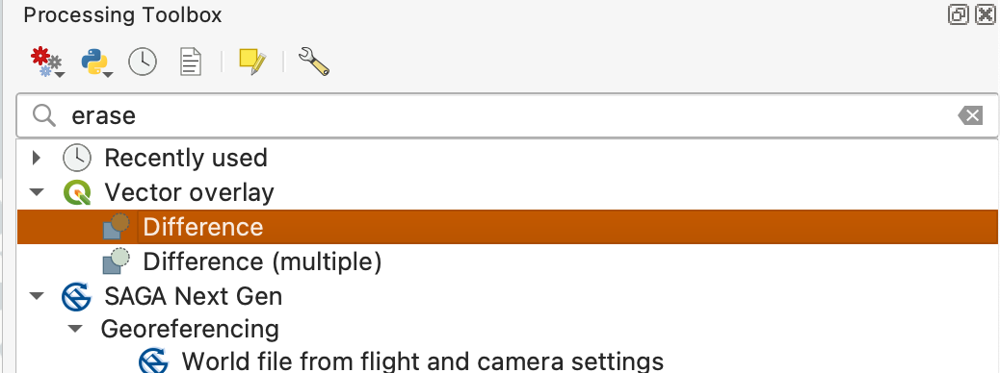

# Ex01: Buffering and Overlay in QGIS

## **Overview:**

In this lab, you will learn the foundational techniques of buffering and overlay analysis in QGIS, with a focus on their application in suitability analysis. Buffering is a core GIS operation that generates zones at specified distances around features such as roads and lakes, allowing you to assess spatial proximity and relationships. Overlay analysis enables you to combine multiple spatial criteria—such as proximity to both roads and lakes, or exclusion of public lands—to identify areas that meet specific requirements.

Through hands-on exercises, you will apply both fixed and variable distance buffering to vector layers, and use overlay tools to intersect, combine, and refine these buffered zones. The ultimate goal is to perform a suitability analysis: determining which areas are most appropriate for a given purpose (e.g., locating potential recreation sites) based on spatial criteria. By the end of this lab, you will have practical experience preparing, analyzing, and visualizing spatial data to support informed decision-making in GIS.

## **Objectives:**

By the end of this lab, you will be able to:

- Understand and apply fixed and variable distance buffering to vector layers in QGIS.
- Use attribute data to create buffers of different sizes for different feature classes.
- Perform overlay analysis to combine multiple spatial criteria.
- Prepare and clean attribute tables for effective spatial analysis.
- Identify and extract areas that meet multiple spatial criteria (e.g., proximity to both roads and lakes).
- Exclude public lands to determine suitable private land areas for recreation.

## **Workflow Summary:**

You will:

1. Add and visualize vector data layers (lakes, roads, public lands) in QGIS.
2. Create fixed-distance buffers around roads and variable-distance buffers around lakes based on their size classes.
3. Clean and prepare buffer layers for overlay analysis by converting multipart features to single parts and managing attribute fields.
4. Use overlay tools (Difference and Union) to combine buffer layers and identify areas that meet both road and lake proximity requirements.
5. Exclude public lands from the candidate areas to focus on suitable private land for recreation.
6. Produce two final maps: one showing the buffer zones, and another highlighting suitable recreation areas on private land, complete with map elements such as legends, scale bars, north arrows, and descriptive labels.

**Data:**

All required data are provided in the [L9.zip file](https://github.com/mapninja/Earthsys144/raw/master/data/L9.zip), including:

* `lakes.shp`
* `roads.shp`
* `public_Hugo.shp`

**Deliverables:**

- Map 1: Lake and road buffers.
- Map 2: Suitable recreation areas on private land.

### Exercise 1: Buffering in QGIS

In this section, you will explore two approaches to creating buffer zones in QGIS: fixed-distance buffering and variable-distance buffering. Fixed-distance buffers use a single, uniform value to create zones around all features in a layer—such as generating a 300-meter buffer around every road segment. In contrast, variable-distance buffers leverage attribute data within the target dataset to assign different buffer distances to individual features. For example, lakes of different size classes can each receive a custom buffer distance based on their attributes. By working through both methods, you will gain practical experience in applying both simple and dynamic buffering techniques to support spatial analysis tasks.

### Suitability Criteria

The suitability analysis in this lab is based on the following criteria:

1. **Proximity to Lakes:** Areas must be `within a specified distance of a lake`, with buffer distances determined by lake size:

   - `50 meters` for lakes with size `class 1`
   - `150 meters` for lakes with size `class 2`
   - `500 meters` for lakes with size `class 3`
2. **Proximity to Roads:** Areas must be `within 300 meters of a road`.
3. **Exclusion of Public Lands:** `Only areas on private land` are considered suitable; public lands are excluded from the final selection.

To be considered suitable, a location must meet all three criteria above.

## Getting Started

1. Create a new QGIS project, save it in a directory named something like `week05/ex01`
2. Download the [L9.zip file](https://github.com/mapninja/Earthsys144/raw/master/data/L9.zip), unzip it into a directory named `week05/ex01/data`, and add the `roads.shp` data layer to your project.

1. Open the **Processing Toolbox**, at **Main Menu>Processing>Toolbox**
2. Search for "Buffer" and note all of the various processing tools that incorporate the concept of buffering. We are interested in the first one in the list, **Vector geometry>Buffer**
3. Double-click to open the **Buffer tool**.

There are options to specify the input feature layer, the buffer distance and units, and the output.

3. Specify “**Dissolve results**” because otherwise the tool generates multiple, overlapping polygons.
4. Use the parameters shown below and add the result to your project when finished.

The `roadsBuffer300m` layer should look something like that below, here re-arranged (drage the `roadsBuffer300` layer below your `roads` layer) to show the `roads` on top, and the buffer below.

5. Redo this buffer, but this time; leave the default **Dissolve buffer results** UNCHECKED and leave the **Buffered** layer option blank, in order to use the **[Create temporary layer]** option.

* Temporary layers in QGIS are in-memory layers that allow users to quickly create and manipulate spatial data without saving it to disk.
* These layers are useful for intermediate analysis or testing purposes.
* **WARNING**: Temporary layers are not saved with your project and will be lost when you close the project or QGIS itself.
* To ensure data persistence, you must explicitly **save** or export **these** layers to a permanent format before closing your project.

Make sure to open and view the attribute table associated with each buffer layer.

* How do the results differ?
* When would this be important?

6. After inspecting, remove the undissolved layer.

## Creating a Variable Distance Buffer

The second exercise will buffer the `Lakes.shp` layer using a variable distance buffer (Video: [Variable Distance Buffer](https://youtu.be/ttrryGSjENA)).

The buffer distances are:

* A buffer distance of `50 meters` for lakes with size `class 1`
* A buffer distance of `150 meters` for lakes with size `class 2`
* A buffer distance of `500 meters` for lakes with size `class 3`

There are three main steps:

- Open the **lakes** attribute table and **insert a field** to hold the variable buffer distance.
- **Select by Attributes** and use the **Field Calculator** to assign distance values for the variable buffer distance to groups of features, by size class `SIZE_CLS`.
- Apply the buffer operation.

### Create and calculate the `buffdist` field

1. Add the `Lakes.shp` to your project, and **open its attribute table**.
2. Use **select features by expression**  to select the lakes with `SIZE_CLS = 1`.

2. **Use the Field Calculator** to create a new whole number (integer) field named something like `buffdist`, with a **value** of `50`.
3. Make sure that you have the option checked for only updating selected features, near the upper left of the tool.  Apply the calculation.

4. Now, **Select** those features with `Size_CLS = 2`, and use the **Field Calculator** to **Update an Existing Field**, assigning `150` to the `buffdist` variable.

5. **Repeat** the select/assign process **for lakes with Size_CLS 3**, assigning a `buffdist` of `500`.

## Creating a Variable Distance Buffer

6. **Unselect any selected polygons** or the buffer will only be applied to those selected using the **Unselect all features** button 
7. Toggle off editing mode  and Save your edits.

Check that your table is correct, e.g., similar to the example figure, below.  Note that the last two columns, SIZE_CLS and buffdist, should change in concert, with a larger buffer distance appearing for larger size classes.

1. Open the same **Buffer tool** as we introduced previously.
2. Specify `Lakes.shp`, and also make sure to check the option to **Dissolve the result**
3. Specify a variable distance buffer through an option box, accessed by clicking on a **small box at the far right of the distance/units option** (see arrow below).

This allows us to open a sequence of dropdowns:

4. Choose **Field type**: `int, double, string...` , and then `buffdist` as the variable that contains the buffer distance (see figure below).
5. Check the option to Dissolve result.
6. Specify a name for the **Buffered** output layer, something like `VarBuffLakes`, and run the tool.

This should create a layer similar to that below.  Note the buffers are larger for the larger lakes, as per our specified buffer distance variable.

6. Arrange the roads, dissolved fixed distance road buffer, lakes, and variable distance lake buffer layers so that you can see all three, as in the figure below.

7. Save here and proceed to the next part (scroll down). Remember to save often.

### To Turn In:

Create and export a layout with the roads, lakes, and their buffers, as in the view shown below.

Make sure the order is as shown here, so you may see most of each layer. The order is, from the top:

1. `roads`
2. `lakes`
3. `lake buffer`
4. `road buffer`

Rename each layer with a descriptive name in the **Layers** panel by right-clicking and selecting **Rename**.  Create a layout and be sure to include a scale bar, title and your name.

## Part Two: Overlay Analysis in QGIS

Our goal in this exercise is to find potential campgrounds for a State Park.  A campground needs to be close to lakes, but these will be drive-in sites that must also be close to roads. The final map will show locations that are both within 50, 150 or 500 meters of a lake (depending on the size of the lake) and within 300 meters of a road.

You have already created your starting layers.  These are the variable distance lakes buffer and the fixed distance roads buffer from the previous exercises.

We need to modify input layers prior to overlay so that we may easily interpret the results after overlay.

## Save a new copy of your project file

1. Return to the project you used in the previous exercise, if you don't already have it open.
2. Save the project to a new folder (named something like `EX02`) and rename it `Overlay_Analysis`

You've just made a copy of your project file, which is very small. No other changes have been made, which is important, because it means that the project file from your previous exercise remains untouched, and you can return to it, if needed

### Creating single-part features from multi-part features.

First, we must turn the buffer output to *single part features*.  Buffer returns multipart features, which means there may be multiple polygons for a single row.

1. Open the attribute table for `VarBuffLake`, you should see just one row, while the layer obviously has many polygons.

2. To convert this multipart layer to single parts, open the Processing Toolbox, and search for "multipart", and open the Multipart to singleparts tool,

3. Selec the `VarBuffLakes` layer as the **Input layer** and save the **Single parts output** as `SingleLakeBuffers.shp`

3. After running the tool, **open the attribute table** for the output.  Note that there are now multiple entries, one for each polygon.

Also note that the `buffdist` is now wrong, it has a value of `50` for all the polygons (or perhaps one of the other values, `150` or `500` is repeated, the one it saves appears somewhat random), even though the medium and large sized lakes had different buffer distances. Since the columns we have in this layer aren’t useful, it’s helpful to delete them:

4. Open the attribute table of the `SingleLakeBuffers` layer, **toggle ON editing** and click on the **delete field**  tool.
5. **Select all of the fields** and **click OK** to delete them (it’s OK, don't be nervous! They aren’t useful!).

6. Now, create a new column called `inlakebuff` in the `SingleLakeBuffers` table, with a **value** of `1` for all the lake buffer polygons, using the **Field Calculator**.

7. Repeat the same steps for the `road buffer layer`, which you will note is also **multiple polygons, with a single table entry**, or "**multipart**" features:

   
8. Use **Convert to SingleParts** to convert the features to singlepart, as `singlepartroadsBuffer300m.shp`

   

   1. Clean the attribute table, **deleting all the current fields**
   2. **Add a new attribute** named something like `inroadbuff`, and assign it a **value** of `1` to indicate it is inside the road buffer.

8. Remember to **toggle off editing and save** for each layer when complete.

Before we overlay the two layers with the “**Union**” command, we need one more preparation step.

### Erasing the Lakes from their buffers

The `SingleLakeBuffers` layer we created has buffered areas that include the lake as well as the land near shore. Campsites will be on dry ground, so we will use the **Difference** tool to remove the lake from the lake buffer layer.

9. Open the **Processing Tools** and search for "Erase". Note that the equivalent tool in QGIS is referred to as "**Difference**"

   
10. Specify Input Vector Layer as the `SingleLakeBuffers`
11. Specify the Difference Layer as the `lakes` layer
12. Set the output destination to something like `LakeBuffersOnly.shp`
13. Click Run

Display the output and verify that the results are the lakes buffer layer with the lakes area removed:

## Using Union to combine layers

14. Open the **Processing Tools** and search for "Union". Open the **Union** tool

    
15. Specify the input layers – `LakesBuffersOnly` (as the input layer) and `singlepartRoadsBuffer300m` (as the overlay layer)
16. Specify the output layer something like `BufferUnion`, and **Run**.

17. Open the **attribute table** and examine the new `BufferUnion` layer.
18. Scroll down the table and find a record for which `inlakebuff` and `inroadbuff` are both = `1`.
19. Click on the Numbered Square to the left of the record to Select it,

20. Use the Zoom to Selected tool
21. Move or close the attribute table to view the selected polygon.

The selected polygon meets both the road proximity and lake proximity criteria.

Note that there also appear to be multiple, distinct polygons linked to this row.

QGIS groups polygons in the data files when performing analysis.  When we are finished with our analysis we will “ungroup” polygons in the file, creating a table row for each polygon.

21. Return to the attribute table of `BufferUnion`
22. Use the **Select features using an expression  tool**

to create an expression  that selects the features that have  a value of 1 for both the inlakebuff and inroadbuff columns:

`"inlakebuff"  = 1 AND "inroadbuff" = 1`

This should yield the selection, below. (HINT: right-click and Zoom to Layer to see the whole layer selection)

Upon visual inspection, these are the polygons within both the road and lake buffers.

23. With the selection still active, right click on the `BufferUnion`, then
24. **Export>Save Selected features as…** as something appropriate, like `Candidates.shp`, and verifying that the option to **Save only selected features** is checked.

Display the data and verify that you have something like the following:

25. Use the manual selection tool, and verify that some of these are still multipart, by clicking on a few polygons.

26. Be sure to clear your selection.

We have one final criteria to meet, that these campgrounds be on private land.

1. Add the `Public.shp layer` to your project.
2. Use the Difference tool, as above, to create a new layer called FinalCandidates that excludes all **Public.shp **features.

The westernmost lakes should look like the figure here, with the public bits carved out of the lower lake:

### To Turn In:

Create a Layout that includes:

* roads,
* lakes, and
* lands suitable for campgrounds on private land

Label each layer with descriptive text in the legend, and include a scale bar, north arrow, title and name.

(HINT: I played with the “**Layer Rendering** for the `FinalCandidate` layer, using **Difference** and then an **Inner Glow** from the **Draw Effects** option, at the bottom of the layer styling panel.
