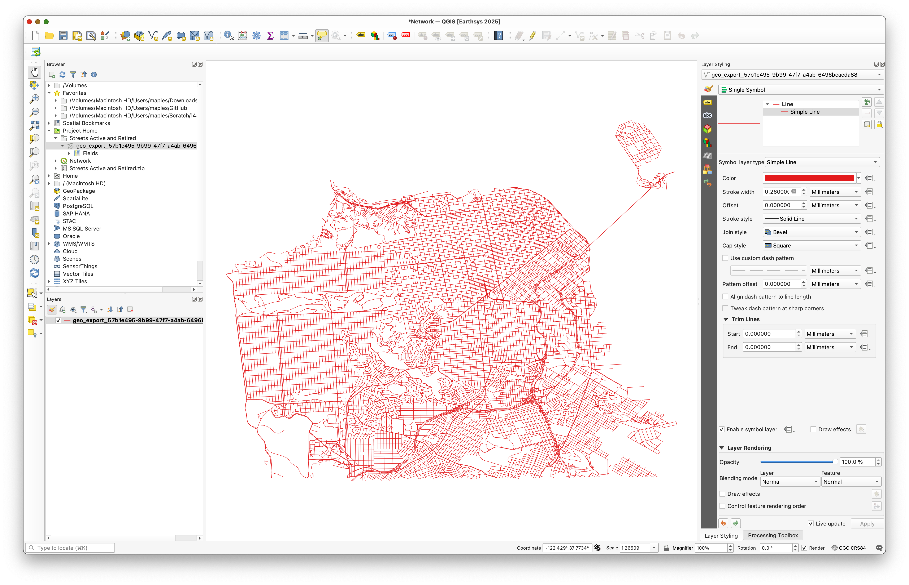
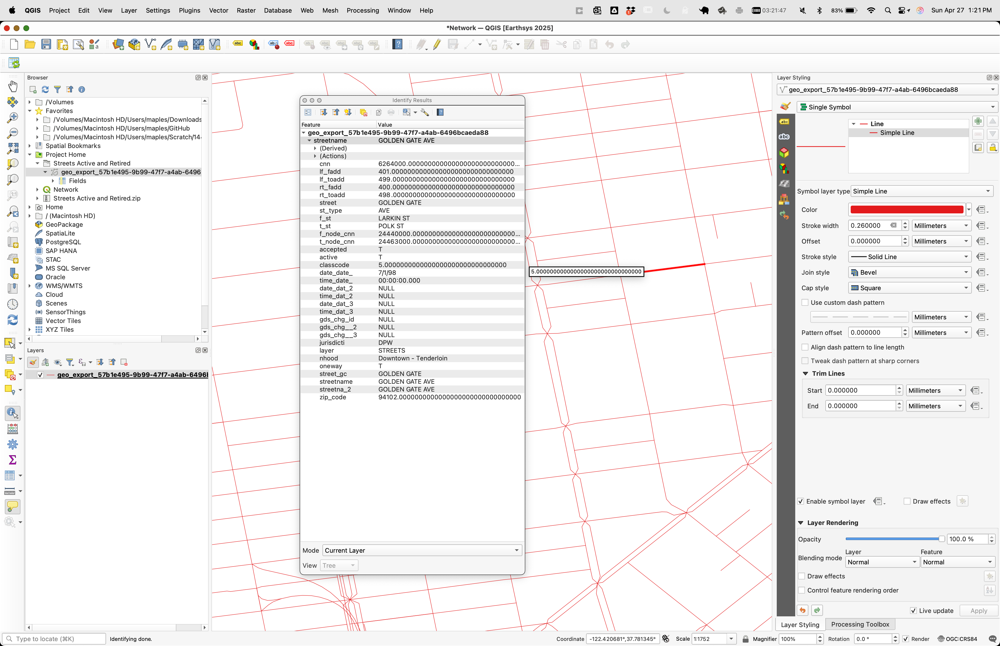
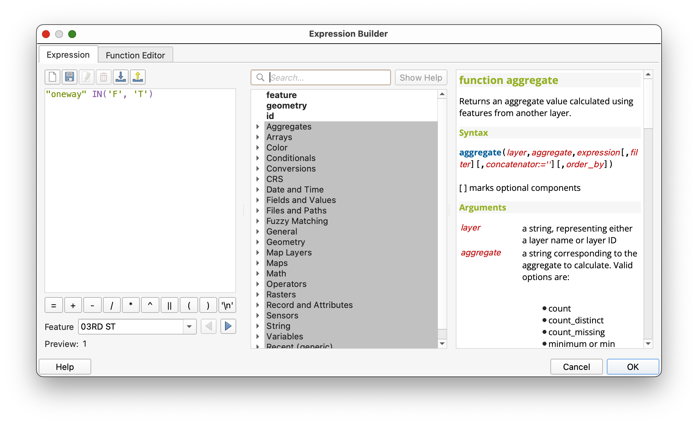
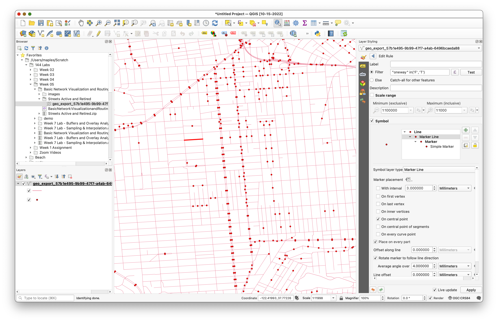
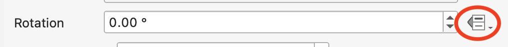
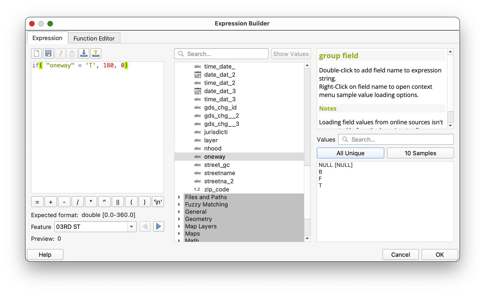
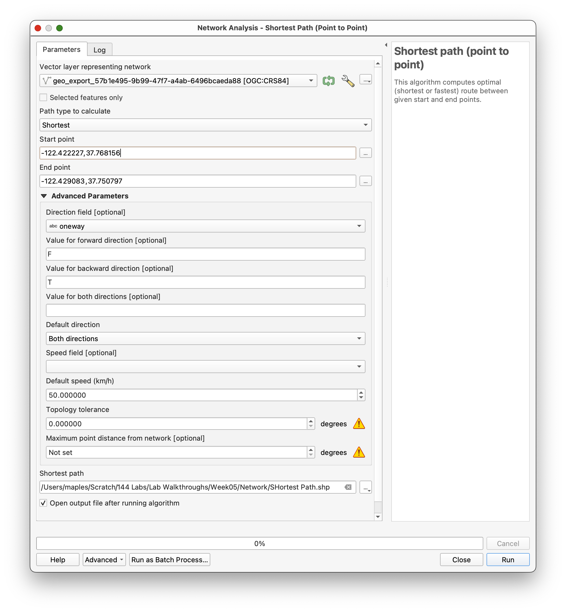
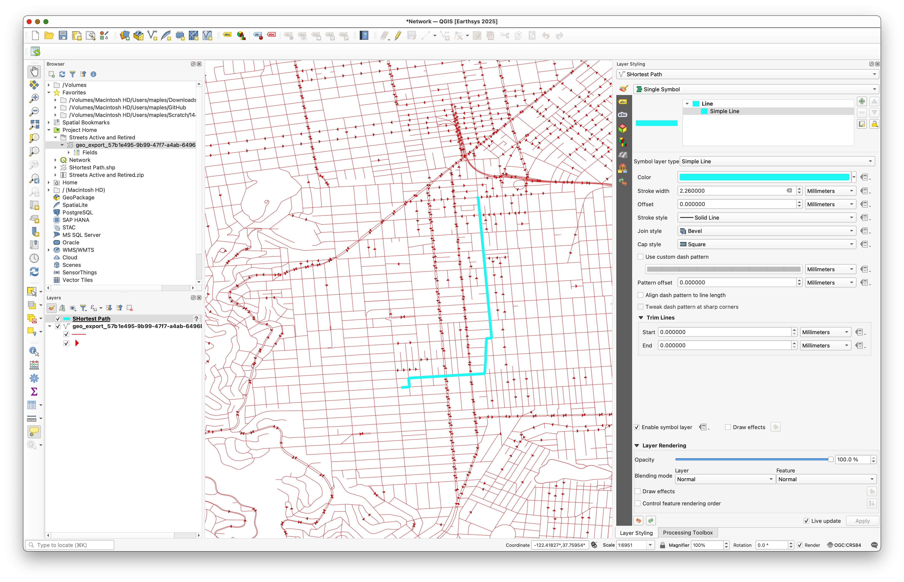

This exercise is adapted from Ujaval Gandhi's excellent [Basic Network Visualization and Routing (QGIS3)](https://www.qgistutorials.com/en/docs/3/basic_network_analysis.html)

## Basic Network Visualization and Routing (QGIS3)

Creating, visualizing, and managing networks is an important part of GIS. Many types of physical infrastructure such as roads, railways, utilities can be modeled as networks with lines and nodes - with properties attached to them. In this tutorial, we will learn how road networks are commonly modeled and apply some styling techniques to visualize the routing properties. We will also use QGIS3’s built-in tools for network analysis that to find the shortest path between 2 points along with the network.

### **Overview of the task**

We will take a layer of roadway block for San Francisco, visualize the connectivity and build a network to find shortest path between any 2 points in the city.

#### **Other skills you will learn**

* How to use data defined overrides to align an arrow symbol based on line direction.

### Get the data

DataSF shares hundeds of datasets at [https://datasf.org/opendata/](https://datasf.org/opendata/)

Direct Download for the SF Streets data (Archived on GitHub for this lab) at:

[SF Streets – Active and Retired](https://github.com/mapninja/Earthsys144/raw/master/data/Streets%20Active%20and%20Retired.zip)

### Displaying Network Data

1. Browse to the `/Streets Active and Retired/` folder you unzipped the data to in the Browser panel. Expand it and drag the `geo_export_57b1e495-9b99-47f7-a4ab-6496bcaeda88.shp` file to the map canvas.

1. You will see a new line layer called `geo_export_57b1e495-9b99-47f7-a4ab-6496bcaeda88` added to the Layers panel. This layer represents each road in San Francisco.
2. Select the Identify tool in the Attributes Toolbar. Click on any road segment to see what attributes are attached to it.

There is an attribute called `oneway`. This is an important attribute for routing as it specifies whether the segment is _two-way or one-way_. It contains 3 different values. possible values are

* `F` (the segment is one way beginning at the "from" street) ,
* `T` (the segment is one way beginning at the "to" street), or
* `B` (traffic is legal in "both" directions).
* There are also **_NULL_** values where we will assume are two-way traffic.

We will use the information in that attribute to display an arrow on one-way streets.

1. Click the Open the layer Styling Panel button in the Layers panel. Select the **Rule-based renderer** from the drop-down menu.

1. We will create a new style with a filter for only the one-way roads. Click the **Add rule**  button.
2. In the Edit rule dialog, click the Expression button .
3. In the **Expression string builder** dialog, expand the **Fields and Values** section in the middle-panel.
4. Select the `oneway` attribute and click All Unique in the right-hand panel.
5. The 3 values that we discussed earlier will appear.

   Having these values here as a reference helps when building the expression. Also, you can double-click on any value to add them to the expression.
6. The goal is to create an expression that _selects all one-way streets_. Enter the following expression and **click OK**.

`"oneway" IN('F', 'T')`

This query selects all road segments where the `oneway` attribute is either 'F' or 'T', meaning the segment is one-way in either direction. This allows you to filter and style only the one-way streets on your map, so you can visually distinguish them from two-way streets.

1. Next, change the Symbol layer type to Marker line.

1. **Uncheck** "**With interval**" and Select **On central point** under **Marker placement**.

1. Click on the Simple marker symbol.
2. Scroll down and pick the `filled_arrowhead marker`.

   You will see that the arrow-like symbol now appears on the one-way streets. But all of them are pointing in a single direction, whereas we know that our filter contains roads in multiple directions. We can further refine the symbols with a _data-defined override_ for the Rotation value.

1. Click the Data defined override button next to Rotation, go to **>Edit...**

We can put a conditional expression that returns different rotation values depending on the one-way direction. A 180° degree rotation for the road with opposite direction will make the direction perfect, In this, we will make the Roads with `T` values for the `oneway` attribute rotate 180° hence all roads will have the correct traffic flow direction.

1. Enter the following expression and click OK.

`if( "oneway" = 'T', 180, 0)`

This expression checks if the value "`oneway`" is equal to '`T`'. If it is, it returns `180` as the rotation angle; otherwise, it returns 0.

In plain English:
“If ‘oneway’ is ‘T’, rotate 180; otherwise, rotate 0.”

## Shortest Path on a Network

Now you will see the arrow-heads aligned to the correct road direction. To keep the style uncluttered, we are choosing to display arrows only on one-way streets. Unlabeled streets are assumed to be two-way.

Now that we have the network styled correctly, we can do some analysis.

1. Go to **Processing>Toolbox**.
2. Search for and locate the **Network analysis>Shortest path (point to point)** tool. **Double-click** to launch it.
3. Select `geo_export_57b1e495-9b99-47f7-a4ab-6496bcaeda88` as the Vector layer representing network.
4. **Path type**: `Shortest`.

Next, we need to pick a start and endpoint. You can click the … button  and click on any point on the network in the canvas.

If you want to replicate the results in this exercise, you can enter

**Start point**: `-122.422227,37.768156`

**End point**: `-122.429083,37.750797`

2. Expand the Advanced parameter section.

3. Choose `oneway` as the **Direction field**. You must be familiar with the one-way direction values for the forward and backward traffic flow.
4. Enter `F` as the Value for the **forward direction** and `T` as the Value for the **backward direction**.
5. Browse and Save your **Shortest Path output** as `ShortestPath.shp`
6. Keep **other options to their default** values and click **Run**.

The algorithm will use the geometry of the layer and provided parameters to build a network graph. This graph is then used to find the shortest path between the start and endpoints. Once the algorithm finishes, you will see a new layer Shortest path added to the Layers panel that shows the shortest path between start and endpoints.

1. If needed, change the styling of the `ShortestPath` layer to highlight it in the **Map Canvas**.

You will see that there are many possible paths between start and endpoints. But given the constraints of the network - such as one-ways, the result is the shortest possible path.

## To Turn In

1. Create a Map Layout, centered on your chosen **Origin & Destination point pair**.

2. Be sure to use a basemap the stays out of the way enough (graphically) to highlight your least cost path.

3. Add the usual cartographic elements, including your name and the date, and export to PDF or PNG, then upload to Canvas.
