## Week 6 Lab - Sampling and Interpolation

**_What You’ll Learn_**:

- Systematic and random sampling
- Stratified sampling
- Majority filtering
- Basic interpolation methods

You will also begin working more with Raster data in this exercise. In previous exercises you have USED raster data, but here, you will begin CREATING raster data, specifically from vector data, using _interpolation methods._

[**Data** for the exercise are in the L12.zip file](https://github.com/mapninja/Earthsys144/raw/master/data/L12.zip).

https://github.com/mapninja/Earthsys144/raw/master/data/L12.zip

**Background:** The ideas behind the exercises are covered in Chapter 12 (Spatial Estimation) and 10 (Raster Analysis) of the GIS Fundamentals textbook.

**Sampling and Interpolation in QGIS**

We’ll practice the mechanics of creating sample points in QGIS, and use them to extract data from a DEM, and practice interpolation.  We’ll then compare the interpolated surface to the original DEM to calculate an error surface, and extract error statistics from a different set of sample points from the same DEM.

We’ll apply both systematic and random sampling. We’ll also develop and apply a stratification layer, because sometimes you want to stratify your sample, which means you wish to increase sample density in some portion of your area, using a map of zones, or strata.

1. Start QGIS, add the DEM from southeast Arizona, _ChirDEM_, and...
2. **Apply a color scheme** to highlight topography in the DEM. Note the variation in topography, where there is a significant amount of change, where there is little change.
3. Open the **Processing>Toolbox**
4. Search for ‘**Hillshade**’
5. Use the **Raster** **Terrain Analysis**>**Hillshade tool** to **create a hillshade:**

1. Use a **solar altitude (vertical angle)** of `25 degrees`, and **Azimuth** of `315`.
2. Browse and Name the **Output** `Hillshade` .

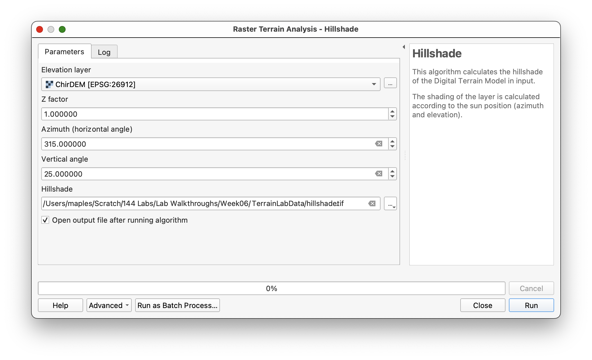

3. When finished, put the `Hillshade` underneath the `ChirDEM` and set the `ChirDEM` **Rendering** to **Multiply**, in the Layer Styling Panel.

### Keeping Organized

To keep your work organized, group your data layers within the Layers panel.  There will be four (4) parts of the lab.  Each will involve a related set of data layers. You can group layers within the Layers Panel to improve organization.

6. **_Select both the DEM and hillshade in the TOC_** (shift-click (PC) or cmd-click (Mac), **_then right click_**, and finally **_click on “Group Selected” in the dropdown_**.
7. **Rename** this **Group: Original**

We have now Grouped the original data. As you create layers for each of the three different interpolation methods, select appropriate layers and Group them, then right click to assign a logical group name.  I suggest names of:

1. Original
2. Inverse Distance
3. Nearest Neighbor
4. Spline Stratified

If you create a layer and it belongs to a group you don’t want it to belong to, right click and select “**Move Out of Group**”.

Maps will be done in Landscape view and arrange the layers as below for your final output.  You’ll need to set your print canvas to landscape orientation and make sure the map images don’t  overlap.

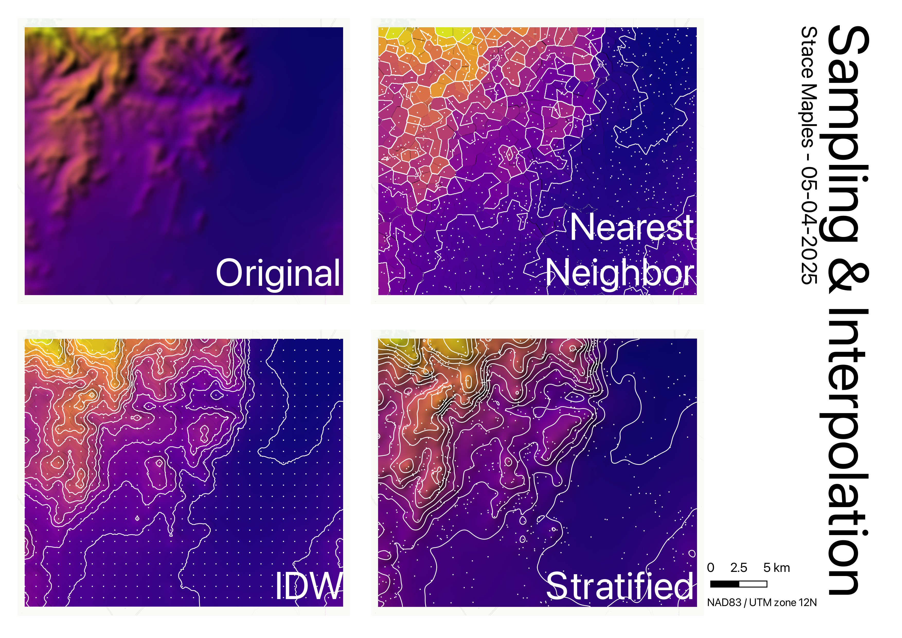

## **Systematic Sampling and IDW Interpolation**

We’ll first perform a systematic (grid) sampling, and then an Inverse Distance interpolation.

1. Open **Vector Tools>Research Tools>Regular Points**. (Or look up **Regular Points** in the processing toolbox.)
2. Set the **input extent** by clicking on the options button (arrow 1), and select **Calculate from layer**, using the `ChirDEM` layer.
3. Set the **point spacing/count** to `1000`,
4. **check** use point spacing, to specify you want points 1000m apart (see at right).
5. Specify an output coordinate system if it is not already set to `EPSG:26912` (that of `ChirDEM`)
6. Browse to save the the output as **SystematicGrid1000m.shp**

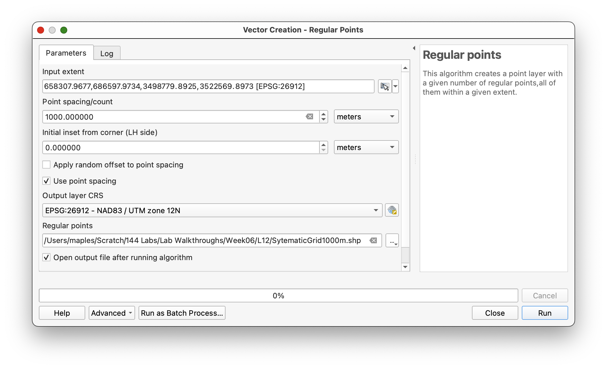

A regular grid of points should be displayed on your screen, if not, navigate to the file you created and display it.

It should look something like the figure below.

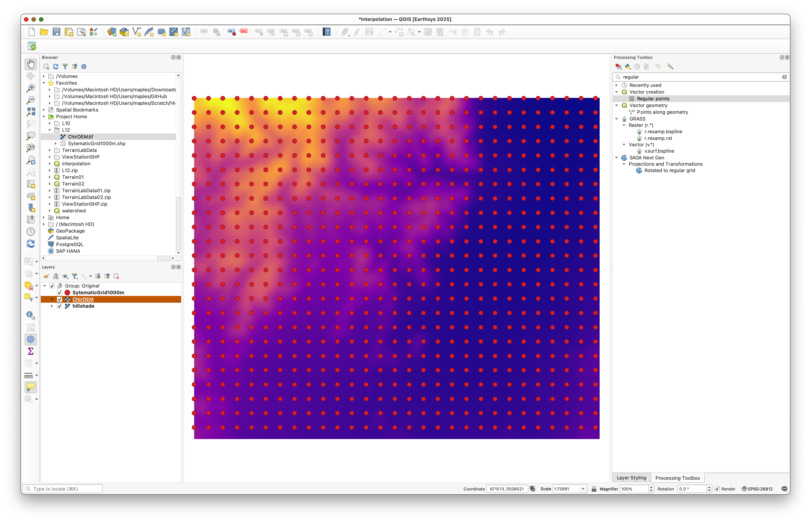

Next we will extract the elevation values at these points.

13. Return to the **Processing Toolbox** and use the **Raster Analysis**>**Sample raster values** tool, from the QGIS tools.
14. Specify:
    4. Input layer: `SystematicGrid1000m`
    5. Raster Layer to Sample:`ChirDEM`
    6. Output point features:`Elevation1000mGrid`
    7. Output column prefix: **SAMPLE_**

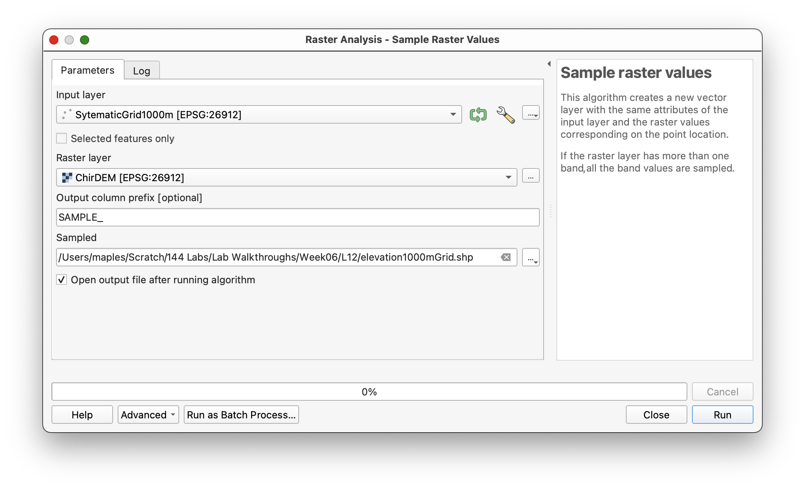

This should generate a point layer similar the original, but with an added table column that contains the sampled elevation below each point:

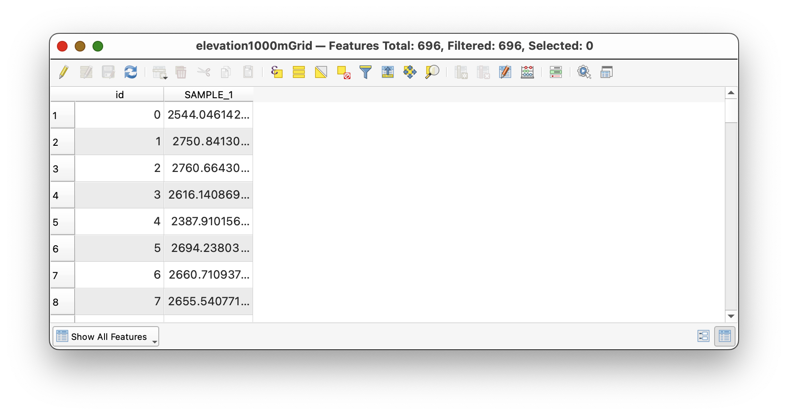

Inspect the table for `Elevation1000mGrid` noting the attributes and their values.

Note the column with our specified prefix, `SAMPLE_1` here, is filled with **elevation values**.

### Interpolation of Sample Points (Vector to Raster Conversion)

Now, perform an **Inverse Distance Weighted** interpolation:

1. Return to the Processing Toolbox Panel and use the search box to find the **GRID:Inverse distance to a Power**

2. Specify:
   1. **Point Layer**:`Elevation1000m` as your
   2. **Weighting Power**: `2`
   3. **Smoothing**: `1`
   4. **Radii of search ellipse**: `1000` for both search ellipses
   5. **Max number of data points** to use: `12`
   6. **Min number of data points** to use: `1`
   7. Open up **Advanced Parameters**.
      : `SAMPLE_1` (_This is the elevations values field_)
   8. We want to create  ~30m raster cells, but this is actually quite clunky to control using the GRID tools from GDAL, as we are. Paste the following code into the **Additional  command-line parameters [optional]:**

`-tye 3498779.8925000000745058  3522569.8972999998368323 -txe 658307.9677000000374392  686597.9734000000171363 -outsize 943 793`

This is the XY Extents, in UTM, as well as the dimensions, in pixels, that we want our output file to have, and if you open the properties of the `ChirDEM` layer, you will see that it has the same dimensions. We are simply using it’s values as a template. You can take a look at docs for GDAL_GRID tools, here: [https://gdal.org/programs/gdal_grid.html](https://gdal.org/programs/gdal_grid.html)

9. **Interpolated (IDW) Output**: Browse to save to your project folder and name: `IDWsysP2_12`
10. Leave the rest of the settings at `default` and **run** the tool

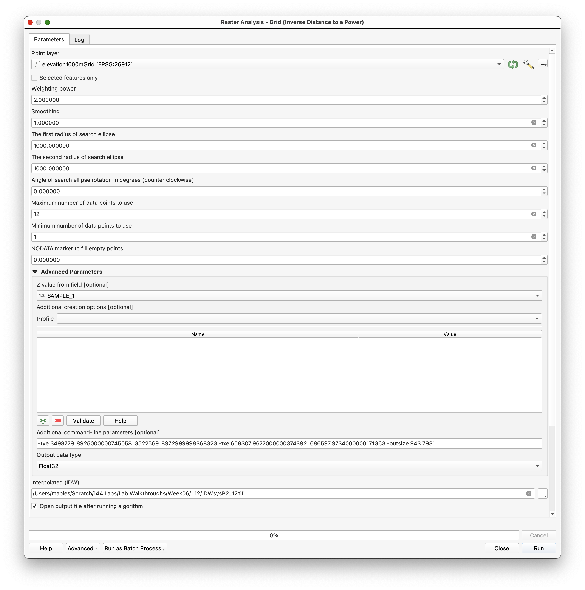

You can see the “pattern” created by the interaction between search ellipses, and the sample points.

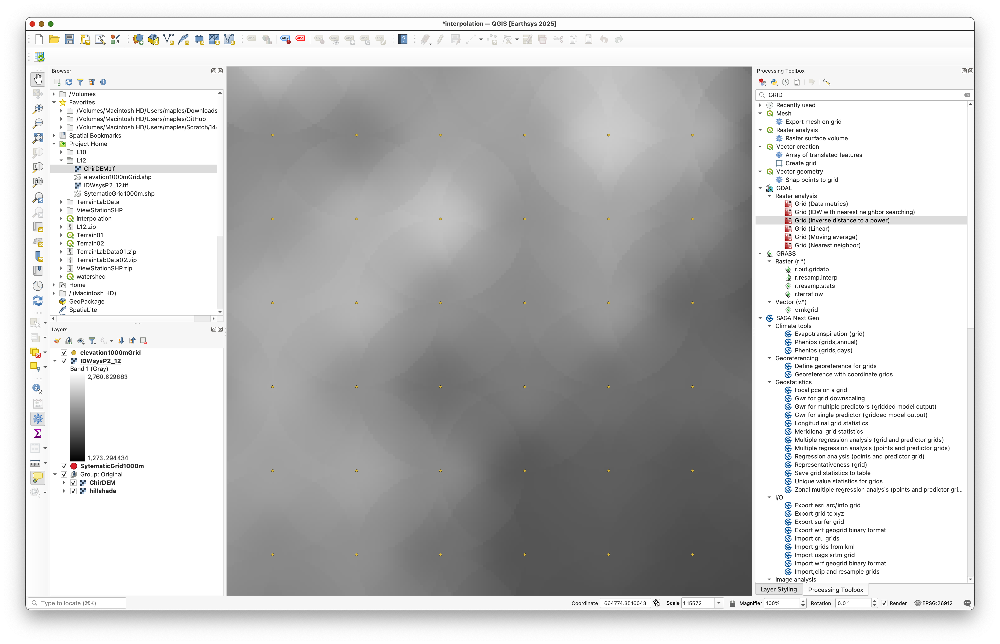

4. Return to your **Original Group** and right-click on the `ChirDEM` **>Styles>Copy Style**
5. Now, right-click on your `IDWsysP2_12`**>Styles>Paste Style** to copy the color ramp and classification you used in your Original `ChirDEM` layer.

### Creating Contours (Raster to Vector Conversions)

1. **_Generate contours_** for the interpolated surface with the  **_Main Menu>Raster>Extraction_**>**_Contour_** tool.

   1. **Input Layer**: `IDWsysP2_12`
   2. **Interval**: `100` (meters, since this is the CRS unit)
   3. **Contours Output**: Browse and save as `IDW100mContours.shp`

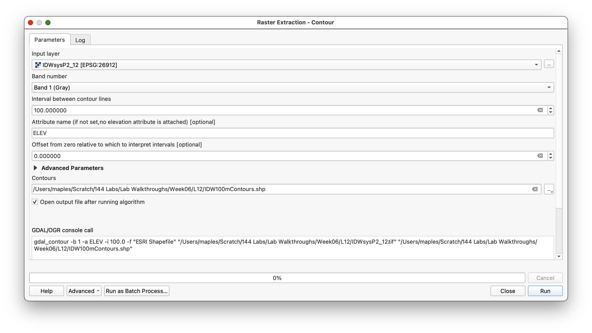

2. As you did with the original `ChirDEM`, use the **Raster terrain analysis>Hillshade** to create an `IDWHillshade` layer with your `IDWsysP2_12`, using an **Azimuth of 315 and Elevation of 25**
3. **Group** the `IDW`, `IDWHillshade`, and `contours`, pulling them into an IDW Group.
4. Arrange the layers so that your Hillshade is between your `IDWsysP2_12` and **IDW100mContours** layer, similar to the image, below (not necessarily the same colors, etc...):

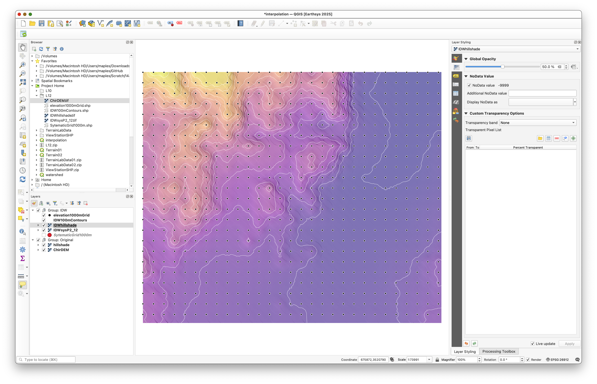

### Random Sampling and Nearest Neighbor Interpolation

Now we will make use of a new sampling strategy and generate a set of random sampling points:

1. Open the **Vector Tools>Research Tools>Random Points in Extent** tool
2. Input Extent **>...>Calculate from Layer>**`ChirDEM`
3. Number of Points: `1000`
4. Minimum Distance: `60 meters`
5. Maximum number of search attempts…: `200`
6. Browse and save the Output  Random Points as: `Random1000Points`

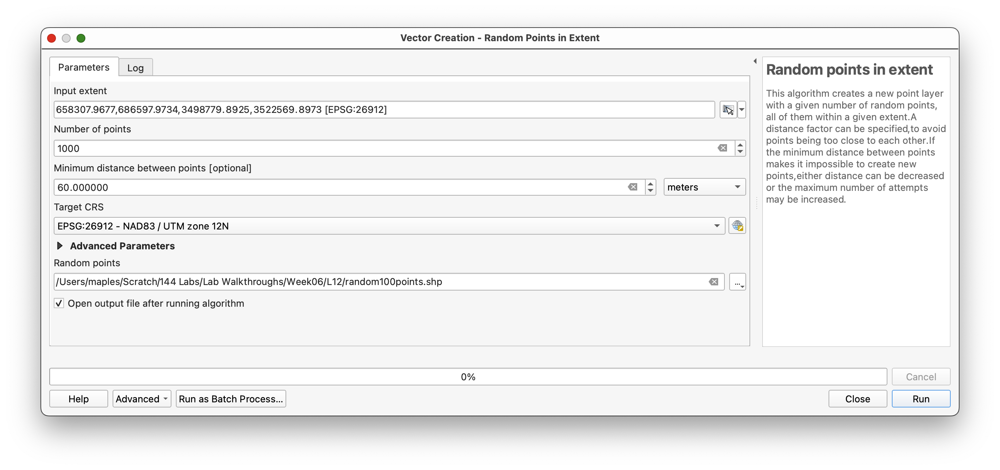

7. Now sample the elevation values from `ChirDEM` as you did with the systematic layer, using the **Processing Toolbox>Raster> Analysis>Sample raster values**

8. Name the output something like **Random1000Elevation**

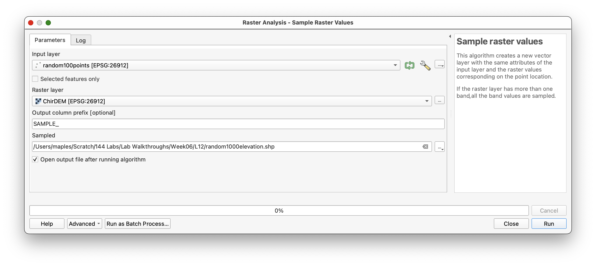

### Nearest Neighbor Interpolation

Nearest Neighbor interpolation uses the single nearest value to calculate the value of each raster cell. This  results in  something a ‘stepped’ set of data values, where raster cells nearest a particular sample value, all  take that value. This produced something  similar to the pattern we saw with the Voronoi tool.

9. Calculate and interpolation surface, this time using: **Processing toolbox>GDAL>Raster Analysis>Grid (Nearest Neighbor)**
10. Specify:
11. **Point Layer**: `Random1000Elevation`
12. **First & Second search ellipses**: `1000`
13. **Z value**: `SAMPLE_1`
14. Use the **Additional command-line parameters [optional]** again to control the Cell Size and dimensions of output:

`-tye 3498779.8925000000745058  3522569.8972999998368323 -txe 658307.9677000000374392  686597.9734000000171363 -outsize 943 793`

11. Browse and name the **Output Interpolated (Nearest Neighbor)** layer: `NNfromRandom1000.tif`
12. Run the interpolation.

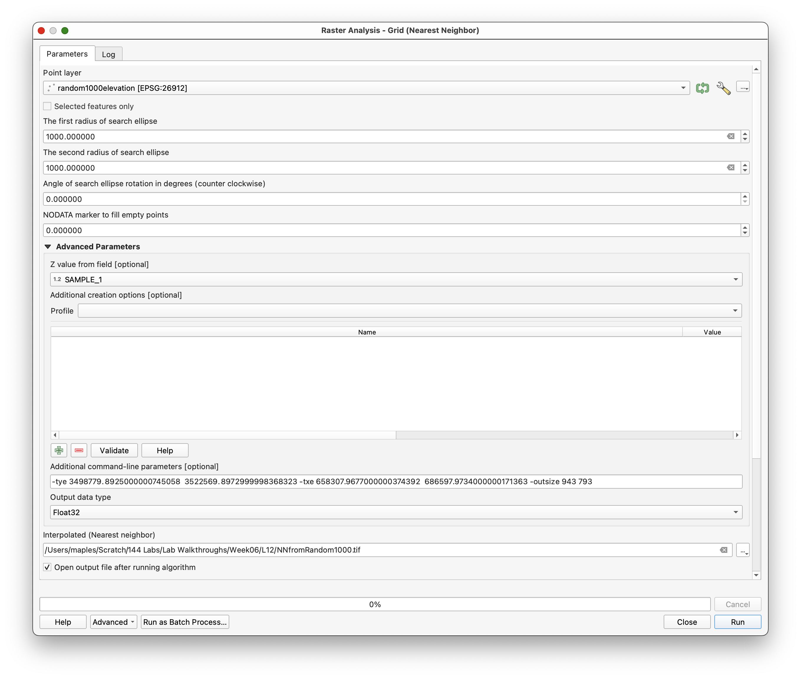

12. **Cut & Paste** the **Style** from your original `ChirDEM` layer to the new `NNfromRandom1000.tif`
13. Create and add contour lines, _as you did for the_ `IDW interpolation`.

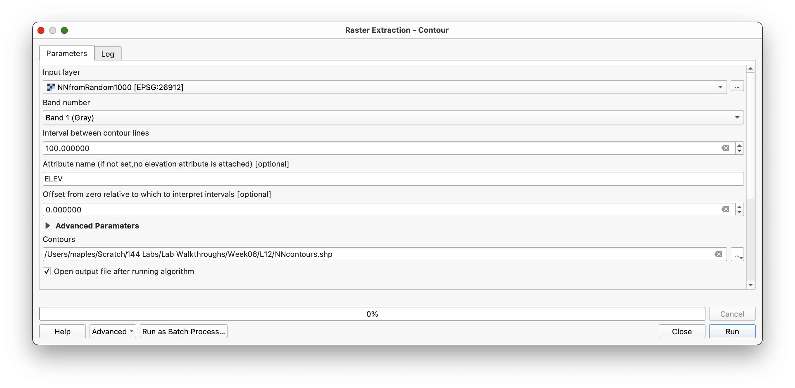

15. Create a `NNHillshade` layer, using an **Azimuth of 315 and a solar angle (elevation) of 25.**

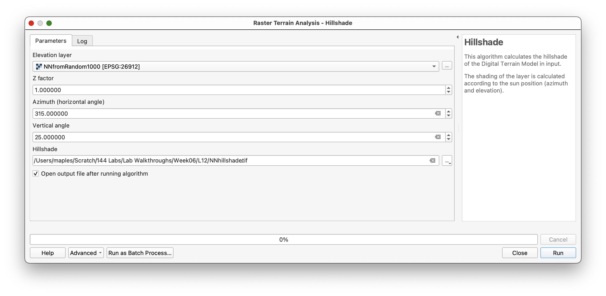

15. **Create a Nearest Neighbor Group** containing the sample point, contours, interpolated raster layers within the Layers panel, naming it something like Nearest Group.
    Your results should look something like the figure here. However, since we are sampling randomly, each map will look slightly different.

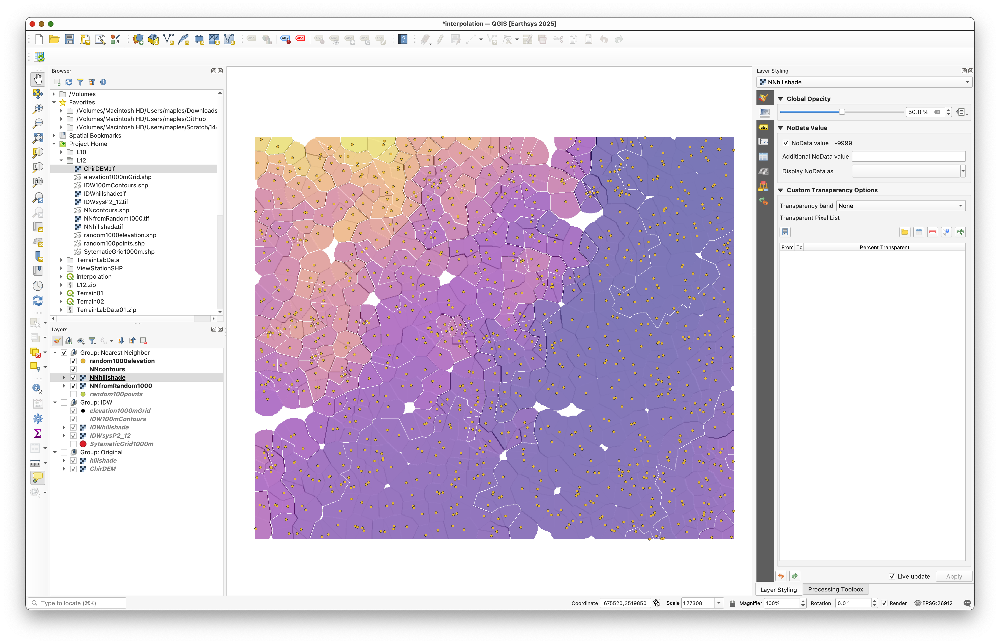

### Stratified Random Sampling of a Raster Layer

Sometimes we want to vary the sampling frequency across a map. Here, we’ll place **_more samples in steeper areas_**, and use individual polygon areas by slope class to control sampling density.

First we’ll create three zones, or strata, and then we’ll assign samples based on these strata. Here, we are using an elevation dataset, but this could, as easily, be used with a dataset like [Landscan](https://earthworks.stanford.edu/catalog/stanford-rg696cc8418) to stratify by population.

Our strata boundaries will be based on calculated slope, filtered to create larger, more generalized areas.

1. Calculate the slope for `ChirDEM`, using **Raster>Analysis>Slope**, using the default settings, and Browsing and saving as `SlopeDegrees`

### Reclassifying Raster Values

2. Reclassify **SlopeDegrees** using **Processing toolbox>Raster Analysis>Reclassify by table**
3. Click on the **…** next to the **Reclassification table** to create your classes.
4. Use Add Row to add `3` rows, then fill in the rows.
5. Use three classes, of:
6. `up to 1.5`
7. `1.5-18`
8. `18 and up`

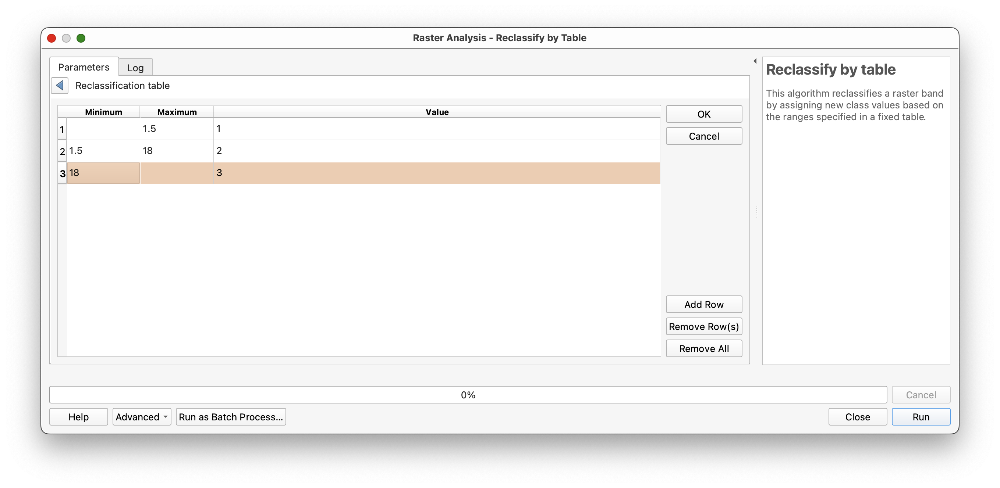

These values are chosen to yield acceptably balanced classes.  Usually you stratify for some threshold of an attribute, e.g., _slopes above which you can’t build_, or _elevations where you’re unlikely to find a resource of interest_.

5. Name the output something like `ReclassSlope`

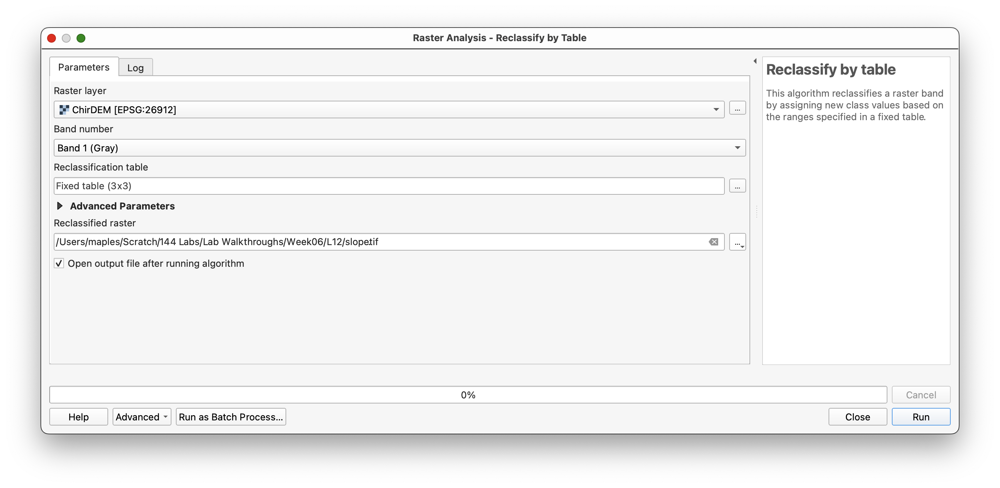

Your layer should look something like this:

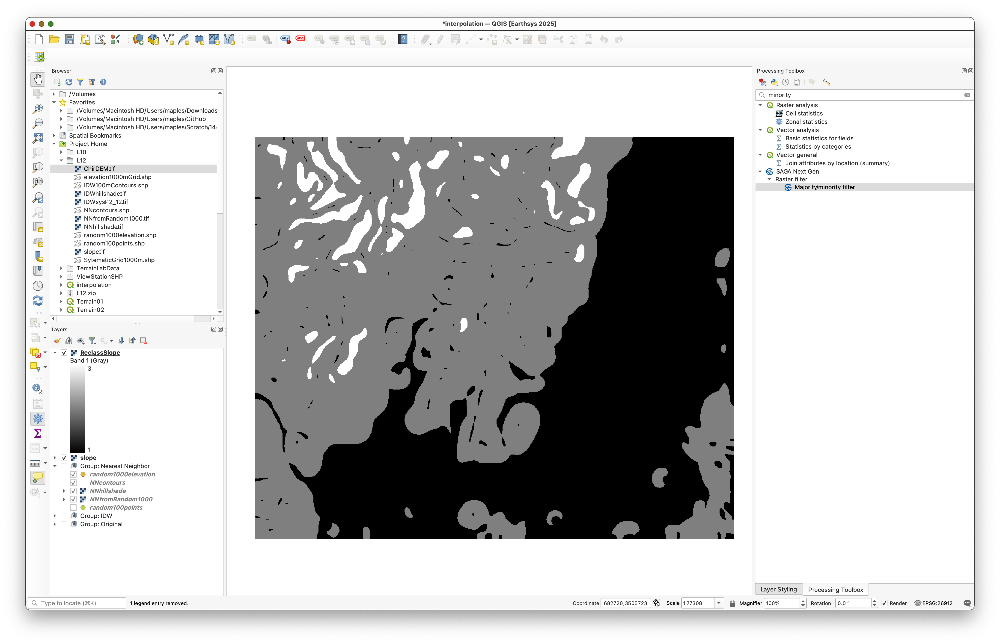

### Removing Small Zones

Now we want to generalize the strata polygons, removing those from single cells or long, thin areas.  Keeping them would complicate sampling needlessly. We’ll use something called a “Majority” filter, which creates a roving “neighborhood” window.

1. Use **Processing Toolbox>SAGA>Raster Filter>Majority/Minority filter**
2. Specify:

   1. **Type**: `Majority`
   2. **Search Mode**: `Circle`
   3. **Radius**: `10`
   4. **Threshold**: `50%`
3. Name `ReclassSlopeMajority` (Note that the only available output type is `*.sdat`)

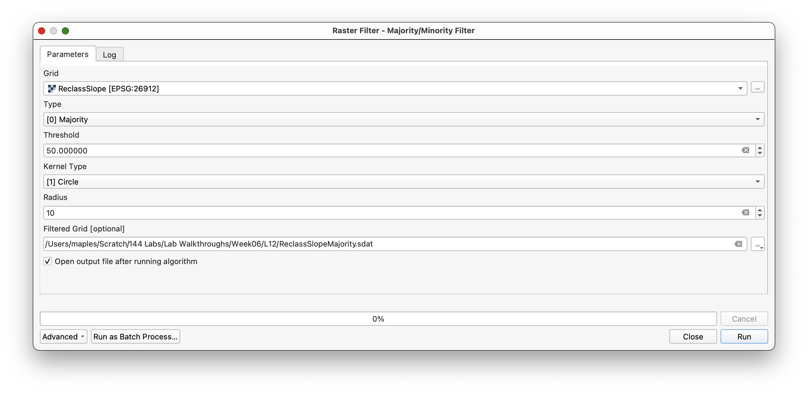

3. Toggle the two layers to see that small zones have been removed.

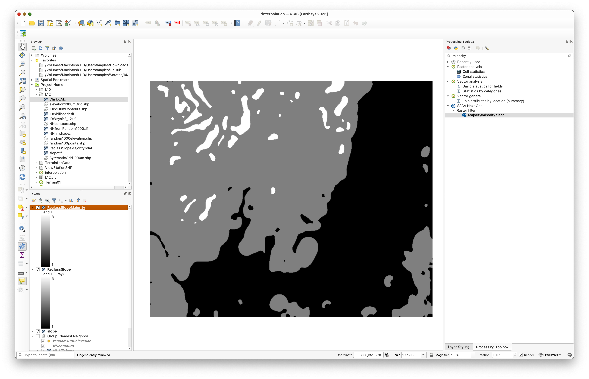

### Raster to Vector Conversions

Convert the final smoothed raster to a vector layer:

1. Use **Raster Conversion>Polygonize**
2. Use the `defaults` on your `ReclassSlopeMajority` layer
3. Name the **output Vector polygons**: `STRATA.shp`

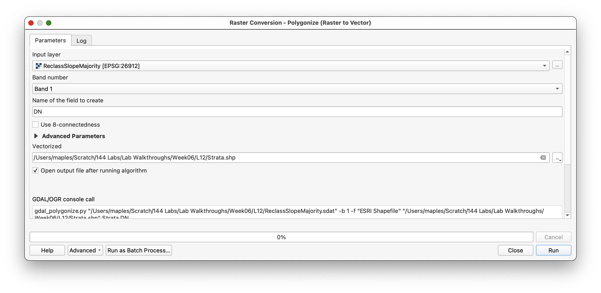

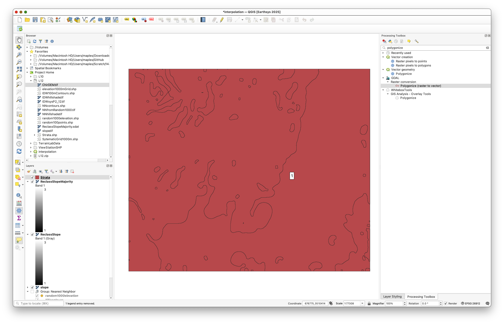

### Calculating a Stratified Sampling Model

We would like to have a total of approximately `1000` **sample points**, with `25%` of the sample points in the **steepest areas** (`class 3`)` 65%` of the samples in the **intermediate slope** areas (`class 2`), and `10%` of the samples in the **flat** (`class 1`).

This means `250` sample points in `class 3`, `650` in `class 2`, and `100` in the `class 1` strata.

We can achieve this by distributing these samples over the polygons, **_based on the polygon area relative to the total area for the strata_**.  For example, assume the largest steep polygon has an area of 116.3 square kilometers, and the total steep area is 192.5 square kilometers.  So, this largest steep polygon should get `250 * 116.3/192.5`, or `151` **sample points**.

We multiply the number of points for the strata by the polygon area, and divide it by the total area of the strata.

How do we get the polygon, class, and total strata area?

Remember from previous labs, we can calculate the area for each individual polygon by using the **Field Calculator** to edit the layer table.

You might recall that the steps are to:

1. Open the data table for editing (i.e., the **attribute table** from the `STRATA` layer),
2. **Calculate** the area into a _new_ Decimal number (real)  column named: SqKm using:

   `$area/ 1000000`x

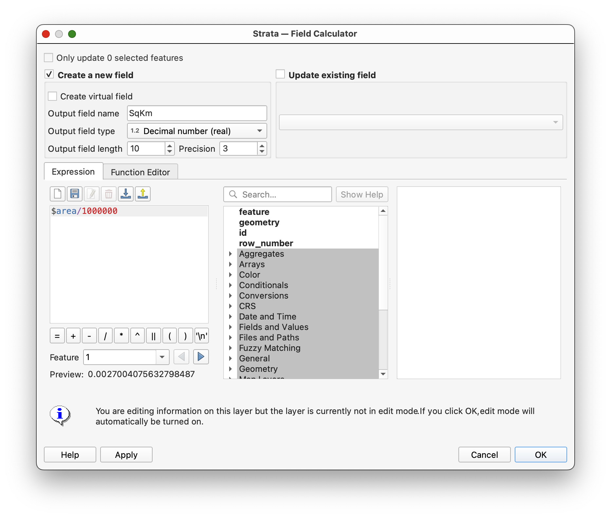

4. save edits and toggle off editing.

### Basic Statistics on a Field

We can then summarize the resulting column `SqKm` to get total square kilometers in the SqKm Field, or to get a total for a specific class/strata.  Previously we’ve had you use the Basic Statistics tool to calculate summary statistics for all records in a column, including the sum.

1. Use the **Select features using an expression** tool in the **attribute table to select a class**, e.g., `class 1 (DN = 1)`

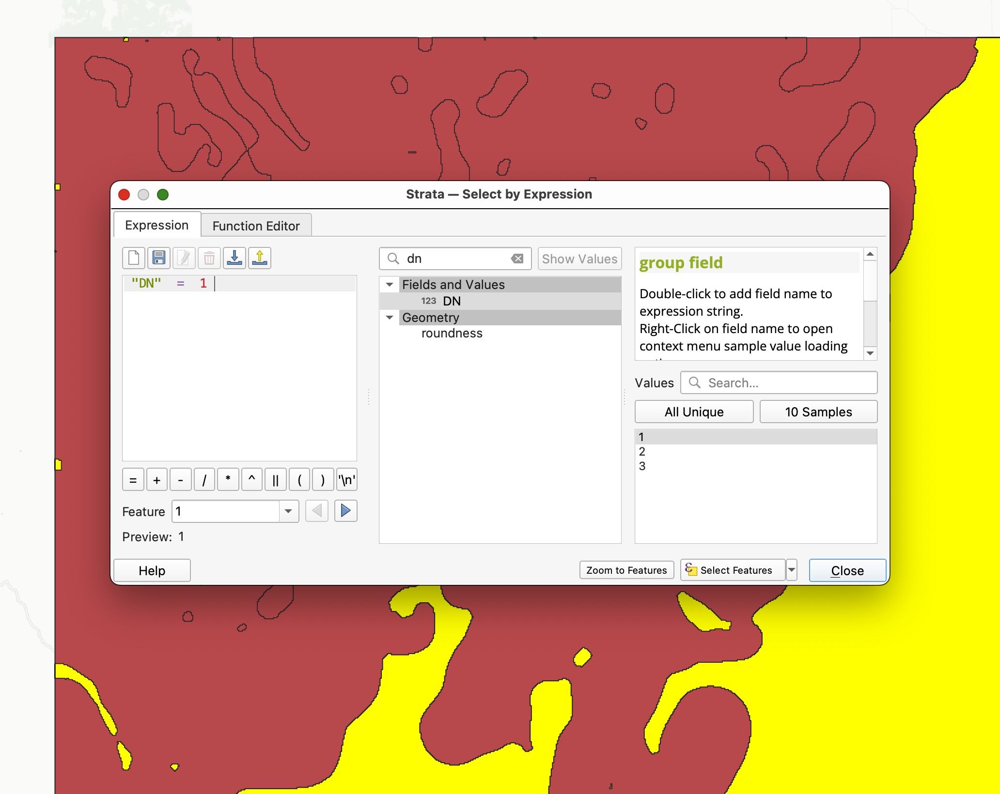

1. Use the **Vector>Analysis>Basic Statistics for Fields** tool, checking the box for **Selected features only** (figure below), for a **sum** of that class area.

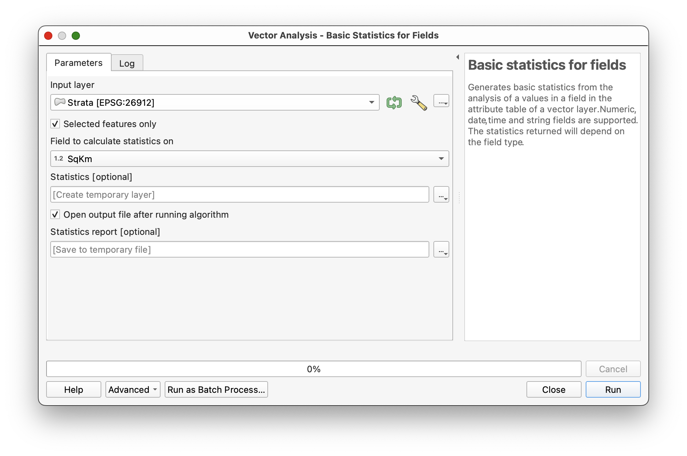

3. Record the **Total area** (SUM) for your selected subset of features.

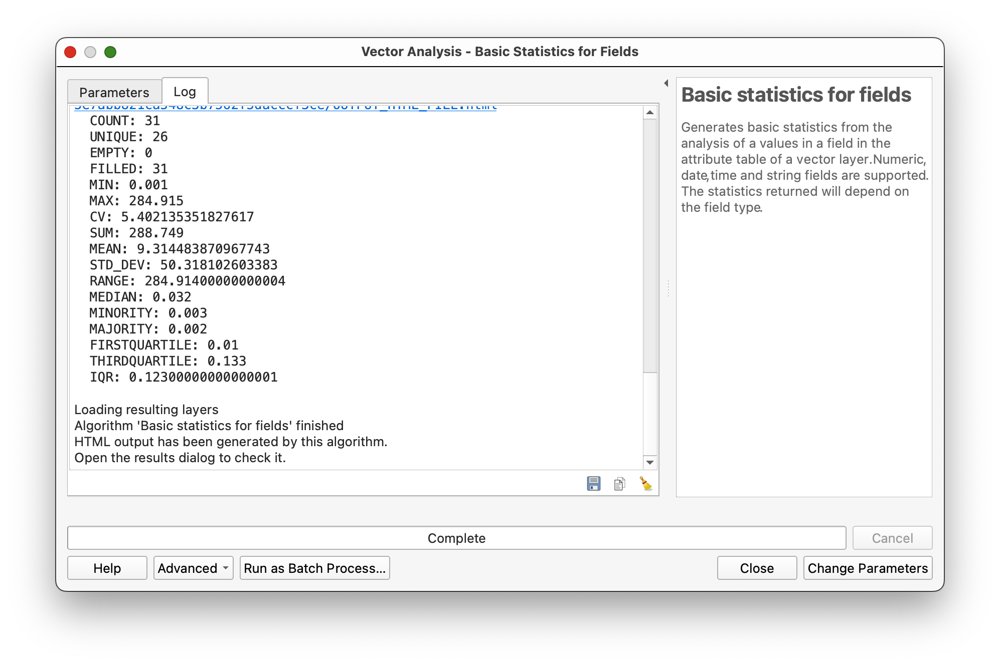

You can then use these with the individual polygon table entries for `SqKm` to calculate the number of sample points to apply per polygon.

You should arrive at calculated areas close to:

* `288.749` square kilometers for the `flat (DN = 1)` strata
* `359.184`  square kilometers for the `intermediate (DN = 2)` strata
* `25.134` square kilometers for the `steep (DN = 3)` strata

Your numbers may be slightly different, but should be within a few percent of these areas if you used the methods we described above.

### Calculating Samples per Polygon

4. Open the `strata` layer **attribute table** and add a new **long integer field** named `samp_num`
5. **Select** all the polygons for a given strata (e.g., first DN=1)
6. **Multiply** the **total number of points** for each stratum (e.g., 100 for the flat strata, DN = 1) by the area of the polygon, divided by the total area of the strata (in this case 286.7), so:

* DN=1:  `100 *  "SqKm"  / 287.408`
* DN=2:  `650 *  "SqKm"  / 357.3539`
* DN=3:  `250 *  "SqKm"  / 25.1439`

7. Repeat for all three strata, selecting each DN, substituting the appropriate areas and number of samples for the strata, and calculating the number of points per strata.

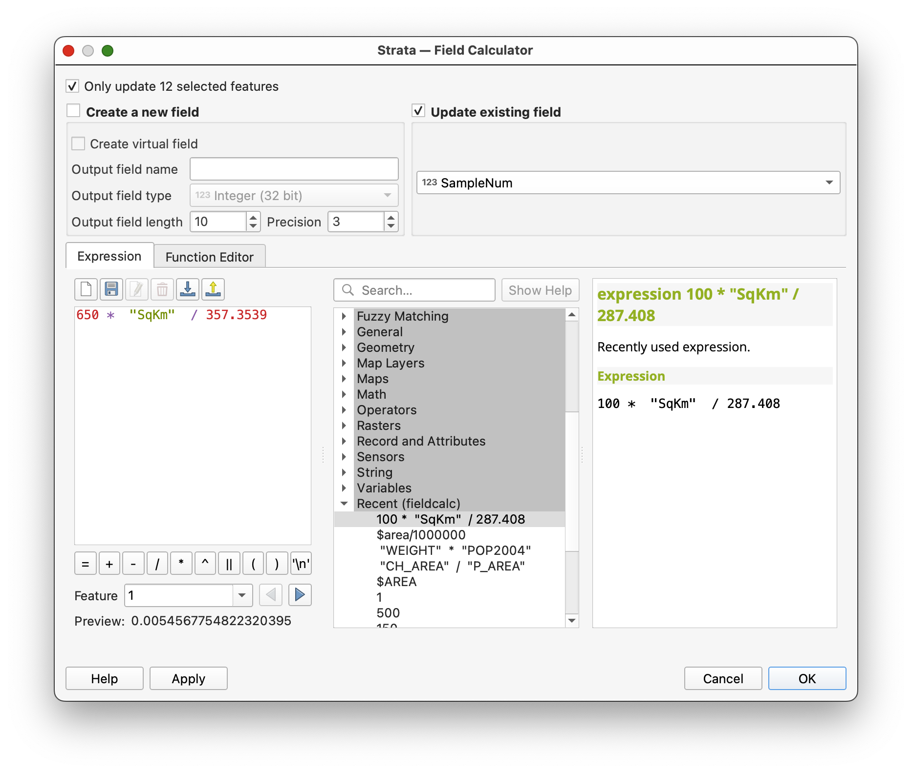

8. Save your edits and toggle editing

Note that your numbers for the strata area and relative number of samples may be different than those shown if you applied a somewhat different set of generalization parameters in the previous work. Substitute your specific summary numbers.

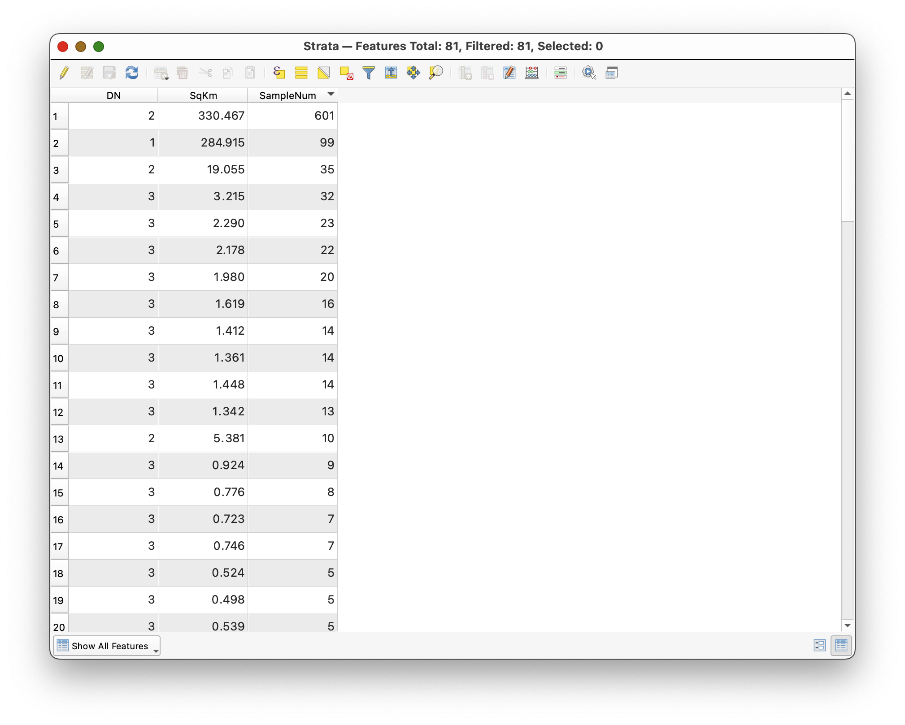

Now, to create the random points.  We use the same tool as before, but this time specifying our new `SampleNum` column to determine the number of points, per feature

1. Open the **Vector>Research tools>Random Points in Polygons**.
2. Specify `Strata` as the **Input Polygon Layer**
3. Click the button on the right end of the **Number of points for each feature option**, then a click on **Field type>SampleNum** in the drop-down to specify the field that holds the number of points for each feature.

4. Browse and save the Output **Random points in polygons** layer as `StrataRandom1000.shp`

This should generate a sample set that looks something like that below, with a higher sampling density in the steeper areas of interest:

To add colors to your STRATA map, change symbology to “Categorized” and use “DN” for value.

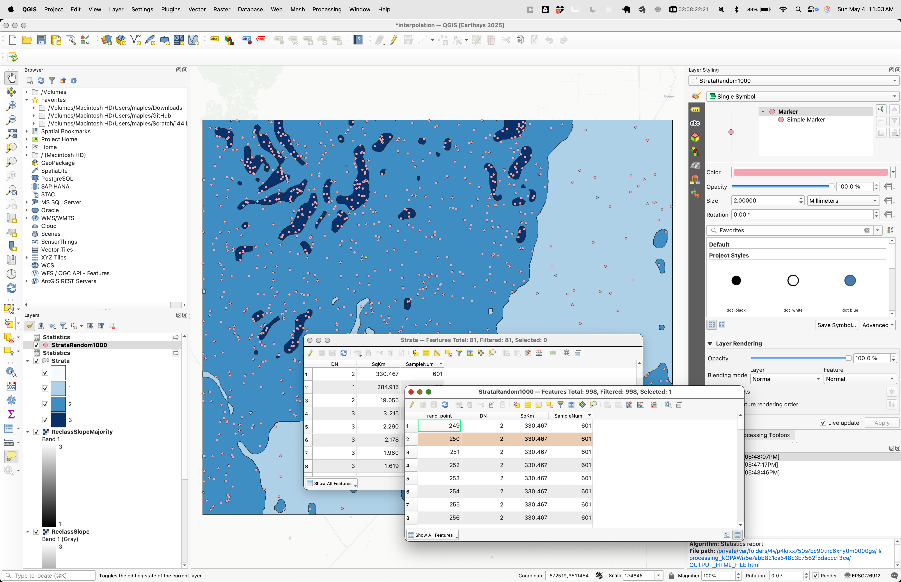

### Spline Interpolation

Now you will use this stratified random sample to produce one last interpolation method.

1. First, use the methods previously described (**Processing> Toolbox>Raster Analysis>Sample raster values**) to once again sample/assign the `ChirDEM` **elevations** found at each sample point, and saving the Output as `StratRandElevationSamples.shp`

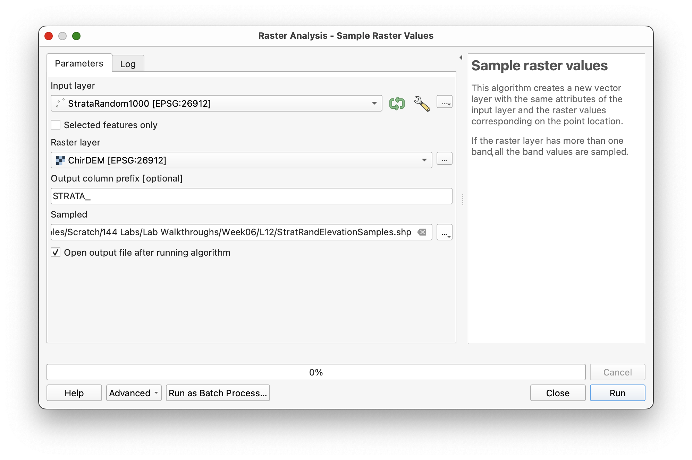

1. Now, estimate a surface using a spline interpolation routine, found in the **Processing Toolbox**>**SAGA**>**Raster Creation Tools**>**Multi-level b-spline**.
2. Specify `StratRandElevationSamples` as the Input points, and your sampled elevation (`STRATA_1`)
3. **Output Extent**: **Calculate from Layer>**`ChirDEM`

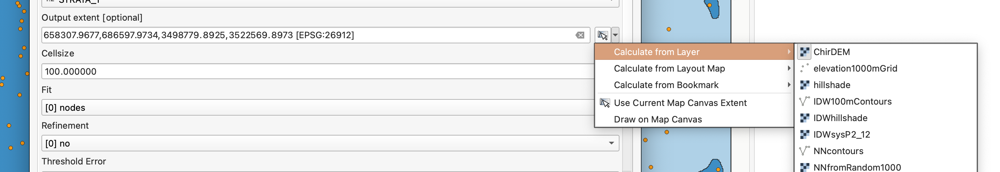

1. **Cellsize**: `30`
2. **Refinement**: `[1]yes`
3. **Threshold Error**: `default`
4. **Maximum Level**: `11`
5. **Output Grid**: Browse and name `SplineStratRand`

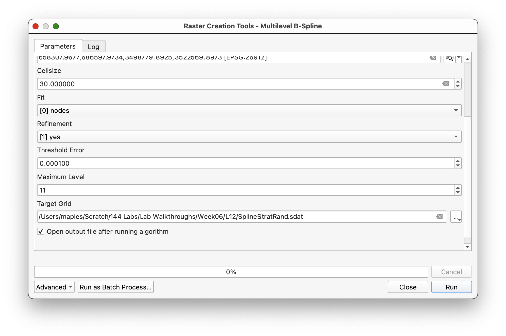

9. After running the tool, **calculate contours**, Create a **hillshade** and _apply the same style_ as the other Interpolation Layers, including applying transparency to the hillshade, etc...
10. “**Group**” the Spline layers in the **Layers panel**.

### To Turn In:

Display these “Groups” and the sample points on your layout.  Arrange the layout so it looks approximately like that in the figure below, although your surfaces and contours may not be exactly the same, and you may use a different base color scheme.  However, you should use the same set of symbology throughout, especially for the elevation surface, so that you may compare the results from the different methods more easily.  Include appropriate title, labels, scale bar, name, and north arrow and submit as a PDF.

#### Hint:

As you create each Map in your layout, Lock each Item in the **Item Properties** list:

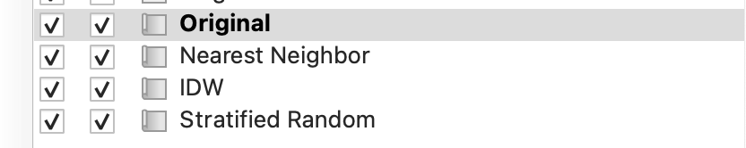

and check the option to **Lock the Layers** for each of the four **Map Frames**:

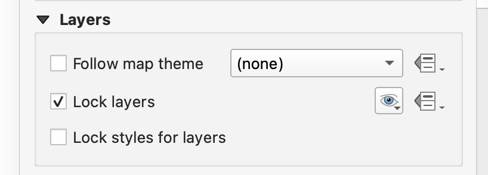

, so that you can work on the next, without effecting the previous.

#### HINT:

For the image, below, I used the following layer order and settings:

1. Sample Points
   1. Size: .4 points
2. Countours
   1. Stroke: 1 point
3. DEM (Original or Interpolated)
   1. Rendering: Multiply
4. Hillshade

#### Hint:

You can easilty COPY your styles from one layer to another (so that your layers match exactly, across groups), by right-clicking on the layer you want to copy the style from, and going to **>Styles>Copy Style>All Style Categories**, then using **>Styles>Paste Style>All Style Categories** on the layer you want to duplicate the styling too.

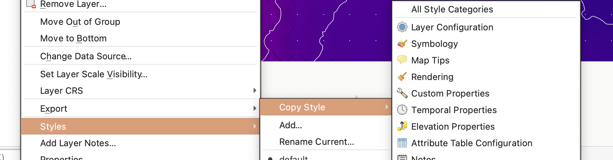

