# Geocoding with OpenRefine & locator.stanford.edu

#### How to use Web APIs and OpenRefine for geocoding and augmenting data with geographic and other attributes.

## Getting Ready

### Data:

**Download** the data for this exercise, here (you may need to **File>Save As...** if your browser opens the `csv`, rather than downloading it ).

https://raw.githubusercontent.com/mapninja/Earthsys144/master/data/SantaClara_TattooParlors.csv

### Download and Install [OpenRefine](https://openrefine.org/)

[https://openrefine.org/download](https://openrefine.org/download)


This exercise will demonstrate how to use **OpenRefine** to submit **URLs** to web-based **Geocoding APIs** in order to augment an existing dataset with things like `latitude` & `longitude` coordinates, `elevation` values, drive times, etc…

**OpenRefine** is a piece of **open-source software** that allows you to manipulate data in many different ways. It’s not just great for geocoding and augmenting datasets, but is also really great for cleaning up ‘dirty’ data.

For the needs of this exercise, **[OpenRefine](https://openrefine.org/)** allows us to build and **submit URLs** to a **web service** (like a geocoding API) over and over tens, hundreds, even thousands or more times, saving us the trouble of typing a URL into a browser and copy & pasting values, one at a time. **OpenRefine** runs in your browser, but does so locally by installing itself as a sort of server running on your own machine. **OpenRefine** used to be called **GoogleRefine**, but has recently been re-branded, so much of the support materials you will find on-line will still refer to **GoogleRefine**.

You will need to download OpenRefine in order to complete this exercise. You can get the appropriate version for your operating system from [OpenRefine.org](http://openrefine.org/). In the meantime, there are 3 videos on the OpenRefine front page. You should take a look at all three, because they give a great, concise overview of many of the capabilities of OpenRefine.

For the purposes of this exercise, it wouldn’t hurt to watch the 3rd video, linked here:

[http://www.youtube.com/watch?feature=player_embedded&v=5tsyz3ibYzk](http://www.youtube.com/watch?feature=player_embedded&v=5tsyz3ibYzk)

You might also want to take a look at this page on **_Expressions_** in OpenRefine:

https://docs.openrefine.org/manual/expressions

And, here’s the full **User Manual**:

https://docs.openrefine.org/

## What is an [Geocoding] API?

An **API** (**Application Programming Interface**) is, essentially, a set of instructions that allows computer programs to pass data back and forth. In the following exercise, we will be using a REST API, hosted by Stanford Libraries, at https://locator.stanford.edu.

Web APIs allow you to submit a URL just like when you type a URL into your browser address bar. The important difference is that the URL we are submitting has a bit of data (an add`ress or `coordinate pair`) that we want to know something about. Rather than giving us back an `HTML`file that instructs our browser to retrieve images, text and other objects and arrange them into a webpage, the Web API we will use gives us back information about the`address` data we submit.

## Connecting to locator.stanford.edu Services

[locator.stanford.edu](https://locator.stanford.edu) is **IP restricted to Stanford Network IP addresses**, **including VPN**. If you find that you are unable to connect to the services, try using **AnyConnect VPN** to connect to the **Stanford Network**. If you are currently on the Stanford WiFi, or using a Stanford computer, on campus, you should be able to connect without issue.

## Building your template Query

The easiest way for beginners to use APIs is to start by building a single URL query to quickly test that you have typed all of the parameters correctly and that [https://locator.stanford.edu](https://locator.stanford.edu) is returning valid data.

We'll be using the USA Street Address geocoding service. The service **endpoint** is a URL that you can submit your queries to. In this case, the USA Geocoder endpoint is at:

[https://locator.stanford.edu/arcgis/rest/services/geocode/USA/GeocodeServer](https://locator.stanford.edu/arcgis/rest/services/geocode/USA/GeocodeServer)

This page will look rather terrifying to someone not yet familiar with these types of services, but fortunately, there is an easy way to get locator.stanford.edu to give us a `endpoint URL` we can begin altering to do what we want.

1. Scroll to the bottom of the [https://locator.stanford.edu/arcgis/rest/services/geocode/USA/GeocodeServer](https://locator.stanford.edu/arcgis/rest/services/geocode/USA/GeocodeServer) page and look for the [Find Address Candidates](https://locator.stanford.edu/arcgis/rest/services/geocode/USA/GeocodeServer/findAddressCandidates) link and click on it.


The **Find Address Candidates: (geocode/USA)** page provides a convenient way to build a template `endpoint URL`, by filling out the information in the form that duplicates the data we want to feed to the service.

2. Now, examine the data we will feed into the APIs, at [https://github.com/mapninja/Earthsys144/blob/master/data/SantaClara_TattooParlors.csv](https://github.com/mapninja/Earthsys144/blob/master/data/SantaClara_TattooParlors.csv)


Note that we have several columns with _Implicit Location Data_ in them, including:

* `Street Address`
* `City`
* `State Abbreviation`
* `Zip Code`

3. Use the values for these columns, from the first record in the table, to fill out the **Find Address Candidates: (geocode/USA)** form.
4. For **Max Locations**: `1`
5. Change the **Format** dropdown to `JSON`
6. Click **Find Address Candidates (GET)**


You should get TWO very important results.

First, you should get a plain text result, in JSON (JavaScript Object Notation) format:

```
{
 "spatialReference": {
  "wkid": 4326,
  "latestWkid": 4326
 },
 "candidates": [
  {
   "address": "801 N 13th St, San Jose, California, 95112",
   "location": {
    "x": -121.8895229109295,
    "y": 37.357328337757636
   },
   "score": 100,
   "attributes": {

   },
   "extent": {
    "xmin": -121.890754,
    "ymin": 37.356155000000008,
    "xmax": -121.88875399999999,
    "ymax": 37.358155000000004
   }
  }
 ]
}
```

And second, you should get a `endpoint URL` in your browser's **URL Bar**:

`https://locator.stanford.edu/arcgis/rest/services/geocode/USA/GeocodeServer/findAddressCandidates?Address=801+N+13TH+ST&Address2=&Address3=&Neighborhood=&City=SAN+JOSE&Subregion=&Region=CA&Postal=951121527&PostalExt=&CountryCode=&SingleLine=&outFields=&maxLocations=1&matchOutOfRange=true&langCode=&locationType=&sourceCountry=&category=&location=&distance=&searchExtent=&outSR=&magicKey=&f=pjson`

### Reading the ``endpoint URL``

That's probably alot to take in, all at once, so let's break it down:

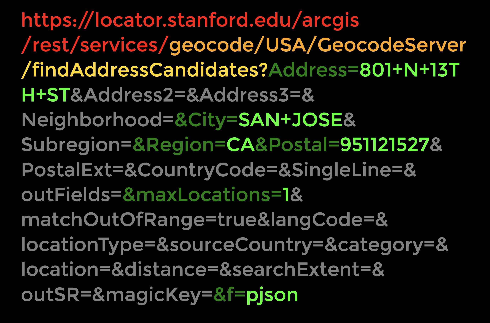

In the image, above, you can see the `endpoint URL`, broken down, as follows:

- **Red** - This is the `base URL` of the locator.stanford.edu server
- **Orange** - This is the `resource path` of the specific _USA Geocode Service_
- **Yellow** - This is `resource path` of the specific **Operation** we want to run: "_Find Address Candidates_"
- **Green** - These are the `query parameters`, and their `values`, commonly referred to as a "`key-value`" `pair`. They structure the data that we want to process, so that the locator service understands what it is being given to work with.
- **Gray** - These are `query parameters`, but they are `keys` with no `values`. In most cases, it isn't necessary to include these in the URL

## Creating the API `endpoint URL`

2. Open up a **Plain Text Editor** of your choice (I like: [Atom](https://atom.io/) for MacOS, [Notepad++](https://notepad-plus-plus.org/downloads/) is a good one for Windows) and **Cut&Paste** the `endpoint URL` into the editor and delete the `key-pairs` with no `values`. You should end up with this:

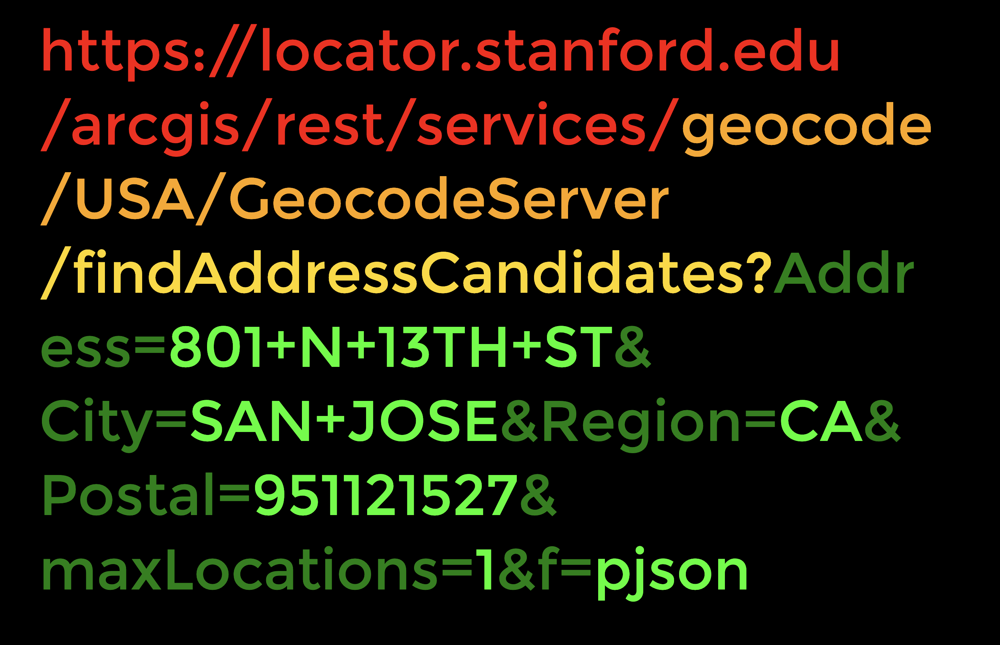

or:

`https://locator.stanford.edu/arcgis/rest/services/geocode/USA/GeocodeServer/findAddressCandidates?Address=801+N+13TH+ST&City=SAN+JOSE&Region=CA&Postal=951121527&maxLocations=1&f=pjson`

## Testing your API `endpoint URL`

1. Paste the new `endpoint URL` into your browser.

This should result in the same result as before.

```
{
 "spatialReference": {
  "wkid": 4326,
  "latestWkid": 4326
 },
 "candidates": [
  {
   "address": "801 N 13th St, San Jose, California, 95112",
   "location": {
    "x": -121.8895229109295,
    "y": 37.357328337757636
   },
   "score": 100,
   "attributes": {

   },
   "extent": {
    "xmin": -121.890754,
    "ymin": 37.356155000000008,
    "xmax": -121.88875399999999,
    "ymax": 37.358155000000004
   }
  }
 ]
}
```

See them!? There are `X/Y` or `longitude/latitude` coordinates in there! That’s what we are after!

## Making Sense of our Returned JSON Data

### What is JSON?

For our purposes, we don’t really need to go deeply into what **JSON (JavaScript Object Notation)** is. It is enough for you to know that it is a format for storing and exchanging data in human readable text format and that it is an output format for many web-based data APIs.

The **JSON** we got back might be a little intimidating if you aren’t used to looking at code, but if you look closely, you will see that there is actually some useful information in there! In fact, since what we are doing is geocoding addresses, you can see that the data we need is buried in there!

## Use jsonviewer.stack.hu to make JSON more readable

You can make the JSON data even more readable with [http://jsonviewer.stack.hu/](http://jsonviewer.stack.hu/).

1. Copy & Paste your JSON from the browser window into the [http://jsonviewer.stack.hu/](http://jsonviewer.stack.hu/) text tab
2. **Click** on the **Format Button** in the Main Menu.
3. **Switch** to the **Viewer Tab**…
4. Expand all of the elements in the hierarchy so that you have something that looks like this:

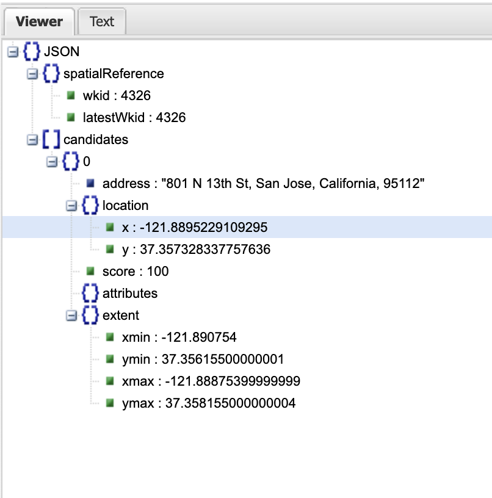

### The Structure of JSON data

The structure of a JSON object is as follows:

- The **data** are in `key-value` pairs.
- **Commas** **,** separate Data `objects`.
- **Curly braces** **{ }** hold `objects`.
- **Square brackets** **[ ]** hold arrays of multiple `objects` (this provides the ability to represent one-to-many relationships between the `objects`).
- Each data `value` is enclosed with **quotes** **""** if it is a `string value`, or **without quotes** if it is a `numeric value`.

### Reading Our Returned JSON Data

If you track forward through the hierarchy of our returned **JSON data**, you will find that it contains:

* An `object` called `spatialReference`
* And an `array` called `candidates` which contains:
  - numbered `candidate` `objects` (there is only one `candidate` `object`, whose index is `0` ( because we limited the number of results with `&maxLocations=1`, in the `endpoint URL`), which contains:
    - three `objects`, one of which is named `location`, which contains:
      - two `properties` called `x` & `y`, which contain the latitude & longitude coordinates we are interested in, in `key-value` pairs.

To refer to the `x`, or longitude, propertiy we would use the following:

`candidates[0].location.x`

**or:**

"the property named `x`, of the object named `location`, which is the first object named `[0]` in the array called `candidates`" reading backwards from the property we are interested in.

We'll make use of this, later in **OpenRefine**, to extract the **longitude** & **latitude** **coordinates** from the JSON formatted data we get back from **locator.stanford.edu**

# Bulk Geocoding with OpenRefine

Now it’s time to start up OpenRefine and use the URL we’ve just created to submit a Geocoding Request for each of our addresses.

## Create a New OpenRefine Project

1. Start **OpenRefine** by double-clicking the **OpenRefine** app

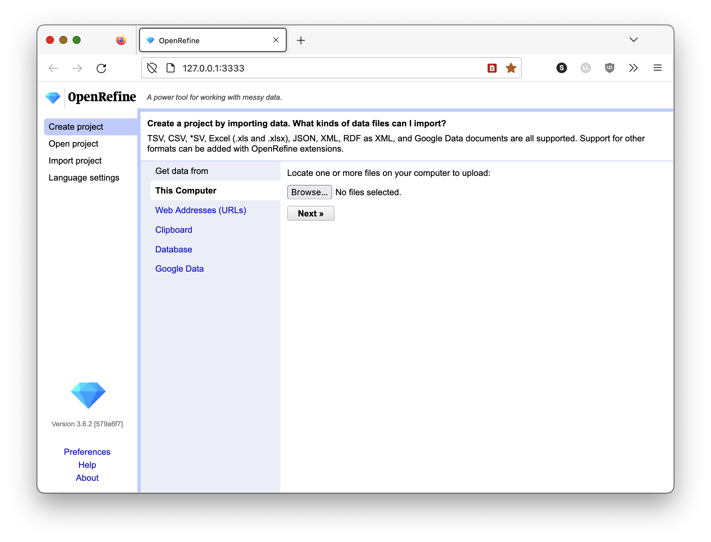

2. Click on the **Create Project** link.
3. Select the option to **Get data from this computer** and Click on the **Choose Files** button.
4. **Browse** to the `SantaClara_TattooParlors.csv` and Select it. Click **Next**
5. Make sure the data is properly formatted in the Preview, change the **Parse data as...** parameters until the data is properly formatted.

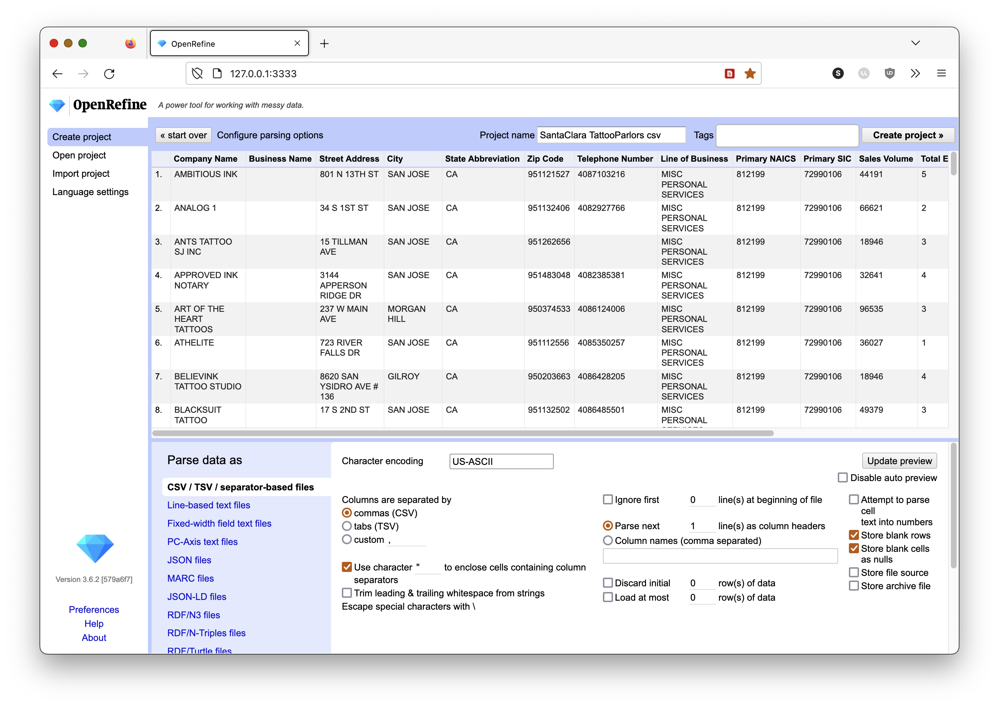

6. Click **Create Project** in the upper right corner of the page.

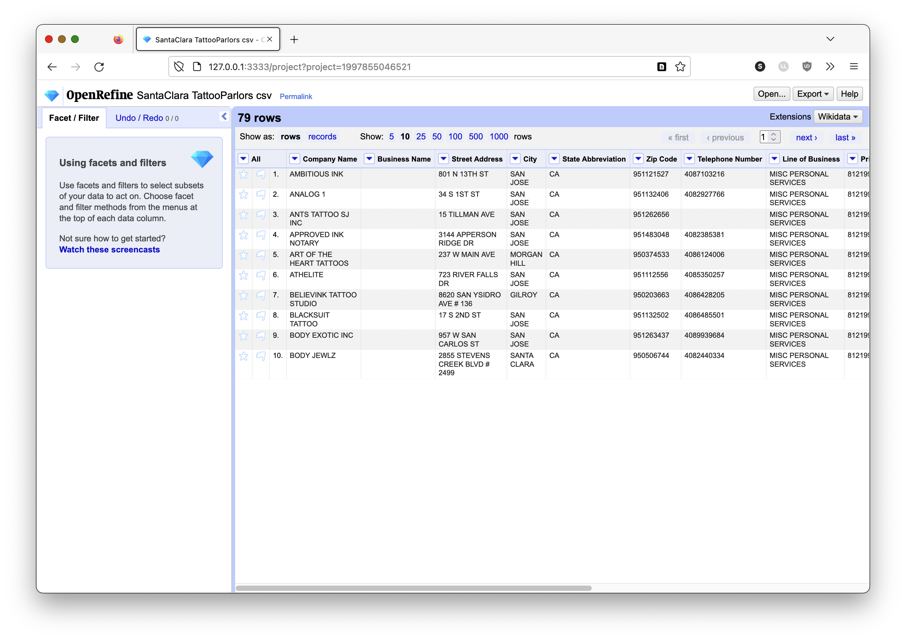

Note that the default for **OpenRefine** is to only show the first 10 records in your table. You can click on the **Show:** option, to show the number of records you want to see.

Spend some time exploring the interface. It's beyond the scope of this exercise to explore all of the functionality in OpenRefine, but it's worth you time to learn. A great resource for more exploration of OpenRefine and it's capabilities, is [datacarpentry.org](https://datacarpentry.org/)'s [OpenRefine for Social Science Data](https://datacarpentry.org/openrefine-socialsci/)

## Using Our URL as a Template

If you haven’t already, now is a good time to take a look at the basics of the **GREL (General Refine Expression Language)** [https://docs.openrefine.org/manual/expressions](https://docs.openrefine.org/manual/expressions).

1. Return to your URL you created, and Copy it from the Browser Address Bar, or your Text Editor. Again, it should be this:

`https://locator.stanford.edu/arcgis/rest/services/geocode/USA/GeocodeServer/findAddressCandidates?Address=801+N+13TH+ST&City=SAN+JOSE&Region=CA&Postal=951121527&maxLocations=1&f=pjson`

2. Now Click on the **Drop-down Arrow** next to the `Street Address` field and go to **Edit Column>Add Column by Fetching URLs**


3. Name the new column something like `locatorJSON`
4. Paste your `endpoint URL` into the **Expression Window** (this will result in a error messages, which is fine)


### Replacing the Query Parameter Values with Data from the table

Because we started this Expression from the `Street Address` column, we only need to refer to the column values as `value`, and convert them to **URL Encoded text**.

5. Now, **Copy** the following text:

`"+ escape(value,'url')+"`

6. **Carefully** **_SELECT_** the following text from your `endpoint URL` template in the **Expression window** and replace it by pasting the text you just copied from above:

`801+N+13TH+ST`


#### Calling Values from Other columns

To call the values from other columns into our expression, we need to tell OpenRefine, specifically, what columns we want to call. In **GREL** the `cells` object is used to call values from columns other than the one the Expression Editor was launched from. We'll use it do tell our `endpoint URL` template which columns to replace our query parameters with.

First, replace the `&City=` parameter value with the values in the `City` column:

1. **Copy** the following text:

`"+escape(cells["City"].value,'url')+"`

6. **Carefully** **_SELECT_** the following text from your `endpoint URL` template in the **Expression window** and replace it by **pasting the text you just copied** from above:

`SAN+JOSE`

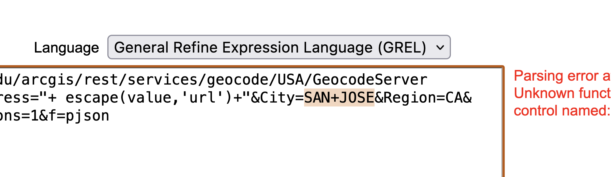

---

Next, replace the `&Region=` parameter value with the values in the `State Abbreviation` column:

1. **Copy** the following text:

`"+escape(cells["State Abbreviation"].value,'url')+"`

6. **Carefully** **_SELECT_** the following text from your `endpoint URL` template in the **Expression window** and replace it by **pasting the text you just copied** from above:

`CA`


---

Finally, replace the `&Postal=` parameter value with the values in the `Zip Code` column:

1. **Copy** the following text:

`"+escape(cells["Zip Code"].value,'url')+"`

6. **Carefully** **_SELECT_** the following text from your `endpoint URL` template in the **Expression window** and replace it by **pasting the text you just copied** from above:

`951121527`


---

It's not necessary to replace the value for the `&maxLocations=` or `&f=` parameters, since they are the same for every query we run.

6. Now, add **double quotes (")** to the beginning and end of the **Expression** and you should see any syntax errors dismissed.

Using the same highlighting conventions as above, you should have this:


In the Preview Window, you should see the auto-generated `endpoint URL` with the contents of the **columns** called `Street Address`, `City`, `State Abbreviation`, and `Zip Code` inserted for each column.

Your first record should be identical to the original `endpoint URL` we started with, while the `endpoint URL` for the second record should have the values from it's own columns:


7. Set the **Throttle Delay** value to `200` milliseconds (this will tell OpenRefine to submit 5 Geocode Requests per second).
8. **Uncheck:** `Cache Responses`

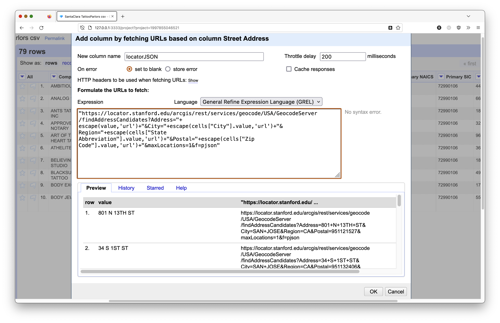

9. **Click OK** to submit a custom `endpoint URL` for every record in your `SantaClara_TattooParlors.csv` table, once every 0.2 seconds.

Wait for the geocoding to finish (a few seconds, HOORAY FOR PROGRESS MESSAGES!) and you should have something like this:


## Parsing the Returned JSON Data for what you need

Note that the JSON response returned for the first record in the table should be identical to the JSON response we got in the browser, originally. Now we would like to use what we learned about the structure of JSON, earlier, to extract the Longitude & Latitude values we are interested in, into a new column.

Recall that:

"the property named `x`, of the object named `location`, which is the first object named `[0]` in the array called `candidates`"

**or:**

`candidates[0].location.x`

OpenRefine’s expression language has a function called **parseJson()**, that allows us to address `objects` and `properties` within JSON. We’ll use this to extract the exact value we are interested in and put them in new columns we can use to make a map!

1. Click on the **Drop-down Arrow** next to the `locatorJSON` field and go to **Edit Column>Add column based on this column...**

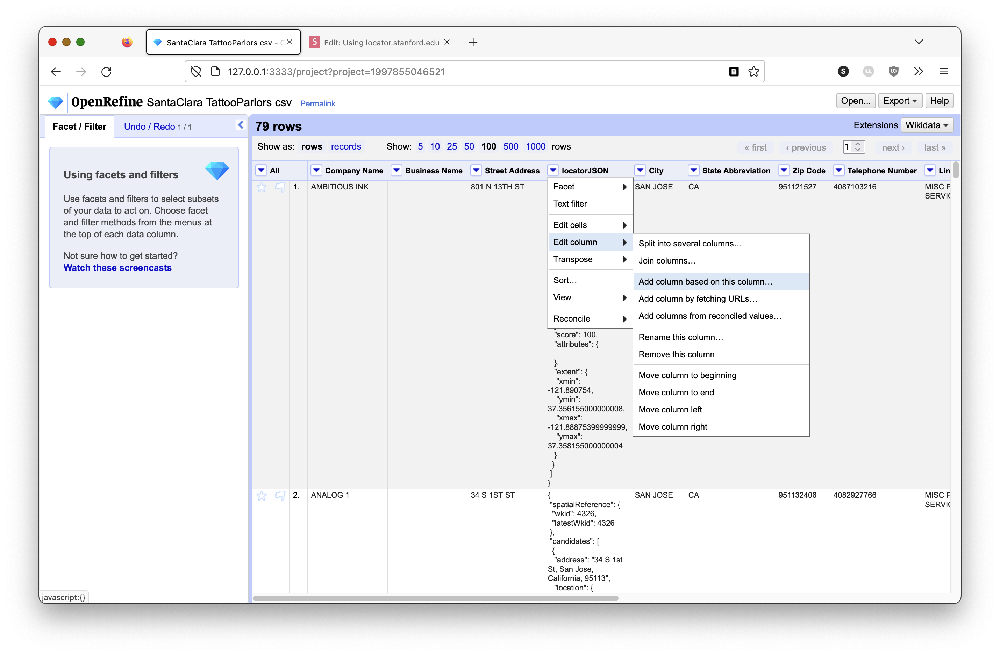

The function we want to use is `parseJson()`

**and,**

The Longitude coordinate is at: `candidates[0].location.x`

So, we want to:

"take the `locatorJSON` column's `value`, _parse_ it as **JSON**, and access the `candidate` object's first, or `[0]`, object, calling `location`'s property `x`'s' `value`"

**or,**

`value.parseJson().candidates[0].location.x`

1. **Cut&Paste** the above **GREL** code, into the **Expression Window**

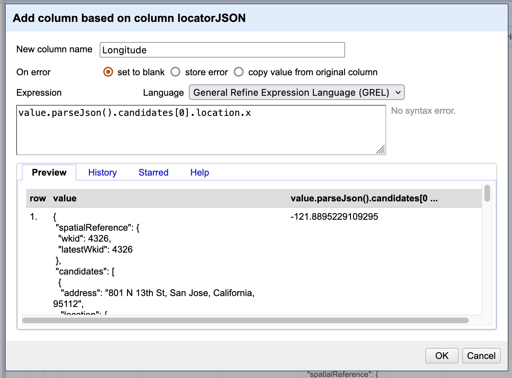

2. Confirm that the value in the **Preview Window** is a **valid longitude coordinate**
3. Name the new column `Longitude` and **click OK** to write the longitude coordinates to the new column.

( _Note that in the image, below, I have used the **>View>Collapse this column** option to hide the rather large `locateJSON` column, to better display the new `Longitude` column._)


4. Repeat the above to extract the `y` values to a new column, named `Latitude` using the following **GREL** expression:

`value.parseJson().candidates[0].location.y`

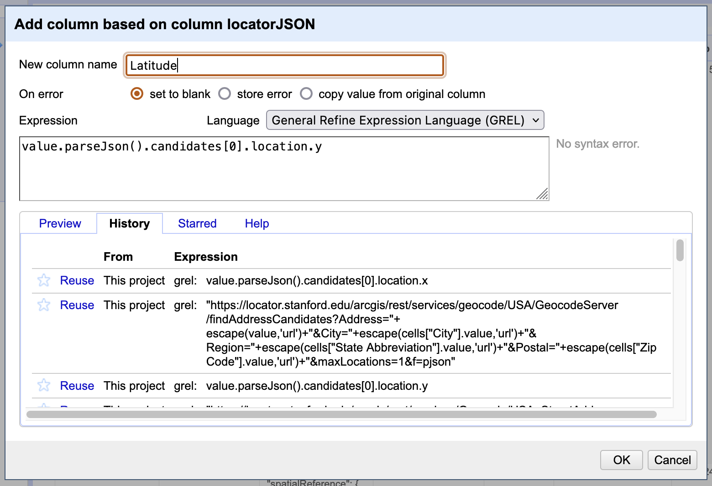

_Note that there is an **History tab** in the **OpenRefine Expression Window** that you can find your previous expressions in and **Reuse** them as the basis for new queries_


## Cleaning up

You always want to make sure you received valid `values` for every `record` in your dataset. **OpenRefine** makes this easy with a built in **facet** function.

1. Click on the **drop-down arrow**, next to your `Longitude` or `Latitude` column, and go to **>Facet>Text Facet**
2. Scroll up and down through the resulting **Facet/Filter** panel that appears on the left side of OpenRefine, to confirm that all of the values in the column are valid coordinates.

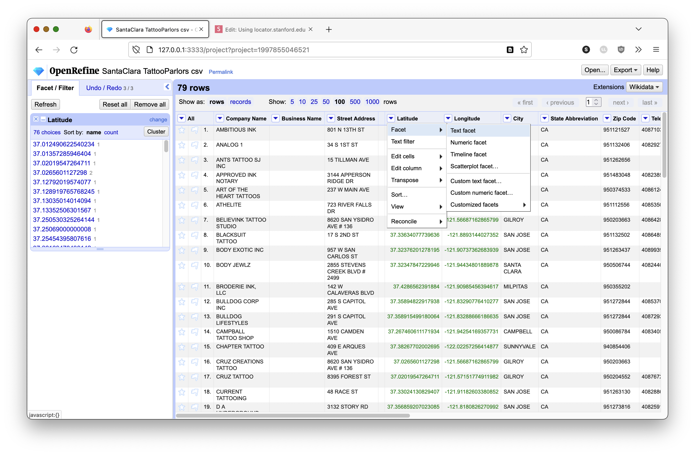

# To Turn In:

1. **Export** the resulting dataset as a **Comma-separated value (CSV) table**, naming it `YOURNAME_SantaClaraTattooShops.csv` using the **Export** button at the top of **OpenRefine**.
2. Create a new **QGIS Project** and use the **Layer>Add Layer>Add Delimited Text Layer** to add your geocoded data to the project, using the `Latitude` and `Longitude` columns as the **Geometry Definition**, and `EPSG:4326 - WGS 84` as the **CRS**.
3. Create a Map, showing the distribution of **Tattoo Shops, in Santa Clara County**, and displaying their `Company Name` as a **label** for each feature.
4. Use your creativity to create a Map Layout, being sure to add the appropriate cartographic elements and **Upload** your **Map** as an **image or PDF** _**AND**_ your **CSV** of geocoded data.

# More Learning and API Links:

## Learning Links

**How to Read API Documentation**: https://www.departmentofproduct.com/blog/how-to-read-api-documentation/

[datacarpentry.org](https://datacarpentry.org/)'s **OpenRefine for Social Science Data**: https://datacarpentry.org/openrefine-socialsci/

## Additional APIs

**OpenRefine.org**: [http://openrefine.org/](http://openrefine.org/)

**Geonames.org Geocoding API**: [http://www.geonames.org/export/geonames-search.html](http://www.geonames.org/export/geonames-search.html) - An excellent, and free, global geocoding API, as well as other APIs.

**Geolocate JSON Wrapper API Documentation**: [http://www.geo-locate.org/files/glcJSON.pdf](http://www.geo-locate.org/files/glcJSON.pdf) - Maintained by Tulane University, this geocoding API can accept esoteric text-based localities, like those found in biological specimen collections (i.e.: when the collection location for a specimen is "5 miles north of Stanford, CA")

**Google Geocoding API**: [https://developers.google.com/maps/documentation/geocoding/](https://developers.google.com/maps/documentation/geocoding/)

**Google Directions API**: [https://developers.google.com/maps/documentation/directions/](https://developers.google.com/maps/documentation/directions/)

**Google Elevation API**: [https://developers.google.com/maps/documentation/elevation/](https://developers.google.com/maps/documentation/elevation/)

**Online JSON Viewer**: [http://jsonviewer.stack.hu/](http://jsonviewer.stack.hu/)

**U.S. Census Data API**: [https://www.census.gov/data/developers/guidance/api-user-guide.html](https://www.census.gov/data/developers/guidance/api-user-guide.html)
