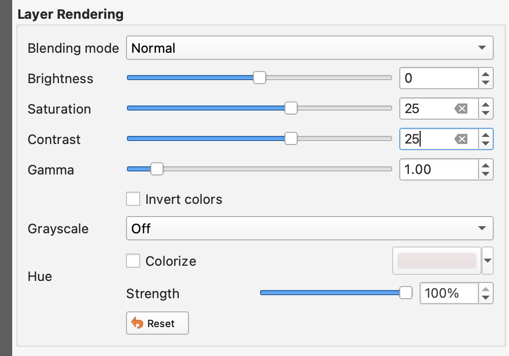
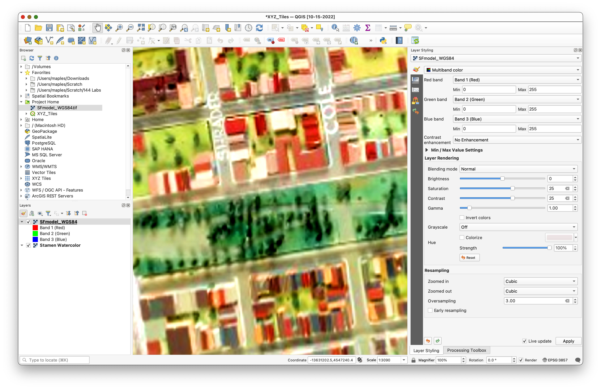
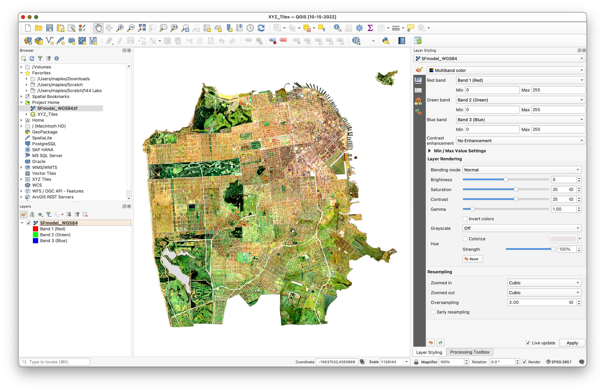
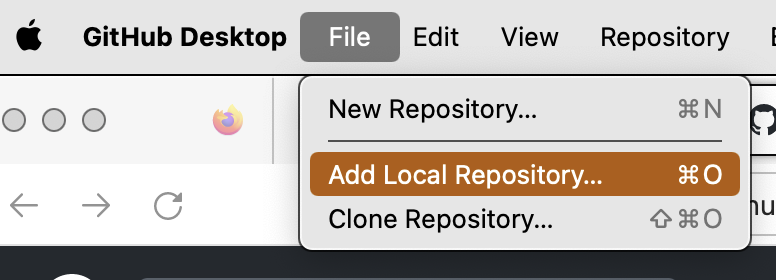
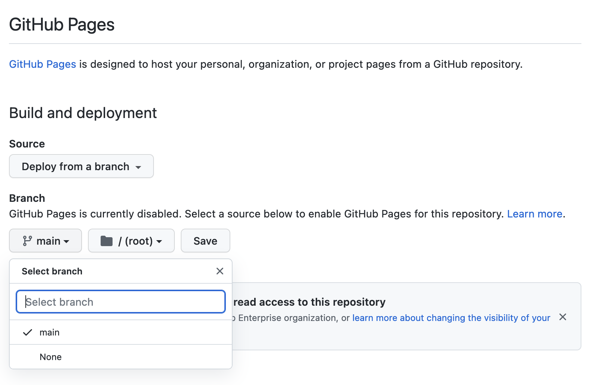
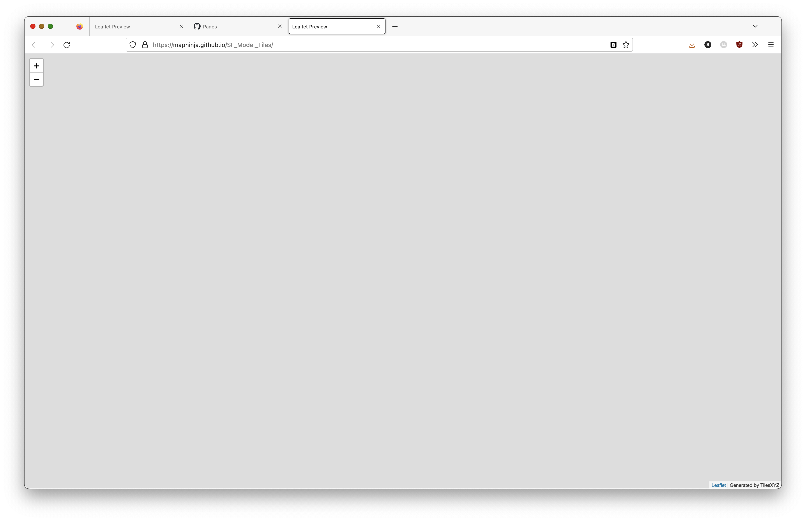
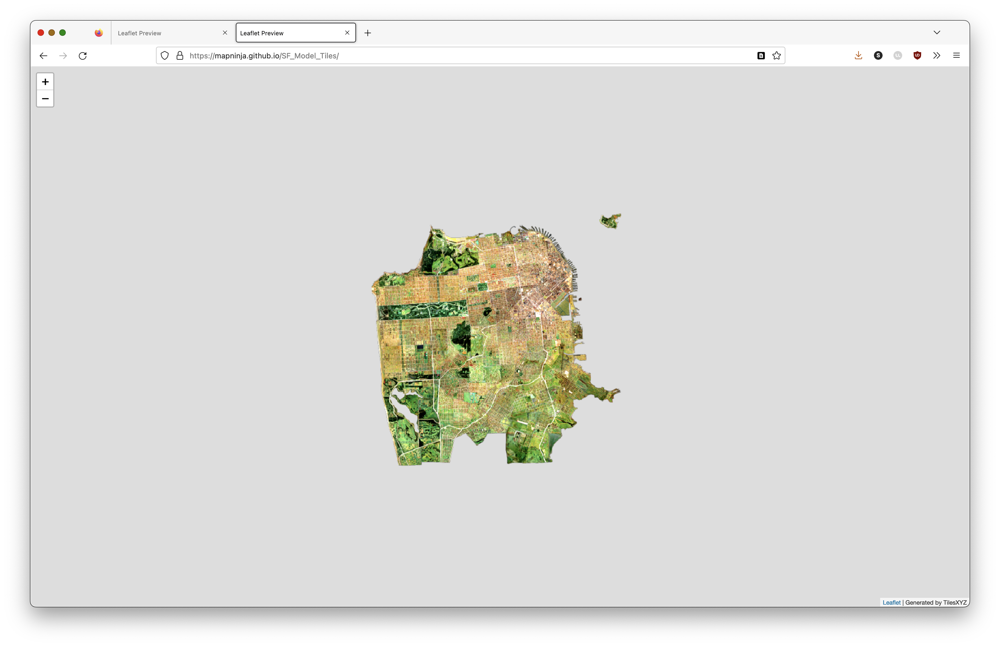

# Creating an XYZ Tile Service, with QGIS and Github
In this exercise, you will create your own XYZ tiles service, using QGIS, and Gihub.com (optional).

## Getting Ready

### Data

We'll be using an image created, and georeferenced, by David Rumsey, and made available through [The David Rumsey Map Center](http://drmc.stanford.edu):   

`"San Francisco Scale Model, Scale 1 inch 100 ft. Constructed by Federal Works Agency, Work Projects Administration. Sponsored by City Planning Commission. 1940 (Raster Image)"`

Described as:

```This layer is a georeferenced composite image of all pieces of the San Francisco Model. This model is a 42 by 38 foot detailed wooden replica of the city of San Francisco as it was in 1940 in 158 pieces at a scale of 1 inch to 100 feet. The pieces contain about 6,000 removable city blocks. The model was built by The Works Progress Administration in the late 1930s, under the New Deal. It was first displayed in sections in the Golden Gate International Exposition on Treasure Island in San Francisco Bay in 1939. In 1940-1942 it was displayed in San Francisco City Hall. The model was used as an urban planning tool by San Francisco city agencies and departments through the 1960's. In 1968, the downtown portion of the model became a research and planning tool in the Environmental Simulation Laboratory in the College of Environmental Design at UC Berkeley. The model has not been on public view, in its entirety, since 1942. UC Berkeley is the current owner of the model. The intent of the makers of the model was to have it updated as the city changed over time. The condition of the model is generally good except for the downtown and south of market portion which needs restoration - many blocks have been removed and lost, probably from the time it was used and updated as a planning tool. In 2018 and 2019 the model was cleaned and made available for public viewing both physically and digitally as part of the joint program of SFMOMA and the San Francisco Public Library called Public Knowledge: Take Part, with these participants: Artist Team: Bik Van der Pol; Project Manager: Stella Lochman; Project Director: Tomoko Kanamitsu; Curatorial Lead: Deena Chalabi. The model pieces were individually photographed by Beth LaBerge. David Rumsey created the large Composite image of the 158 pieces, as well as the image and metadata database of all the images, which he hosts.```

1. **Download** the data from: https://searchworks.stanford.edu/view/dv566pd4199, using the **Download** `data_EPSG_4326.zip` option, from the **download widget**.


2. Create a Project folder to **Save** and **unzip** the `data_EPSG_4326.zip` file to.  

### Github Account (optional)

For the optional portion of the lab, you will need, both a Github.com account, and to install Github Desktop, for your Operating System.

If you do not already have a Github account, go to https://github.com/signup and create a free one.

To download and install Github Desktop, see: https://desktop.github.com/

## Preparing the Imagery Layer
Here, you will set the CRS to one appropriate for XYZ tile services, `EPSG:3857`. adjust the Rendering and Resampling options, using the Layer Styling panel, in order to increase the legibility of the imagery being used.

### Add Layers

1. Create a new QGIS Project, and save it to the same folder you unzipped the `data_EPSG_4326.zip` image to.  
2. Add the `data_EPSG_4326' image from the **Project Home** folder, in the **Browser** Panel.


### Adjust the Project CRS

1. Use the **Quick Map Services plugin** to add a basemap to the project.
2. Right-click on the **Basemap Layer** you added and go to **>Layer CRS>Set Project CRS from Layer**
3. Save your changes.


### Adjust the Layer Styling
#### Rendering

1. Select the `data_EPSG_4326` layer and open the **Layer Styling** panel
2. Zoom in to a detail area at a scale of about 1:2500 and observe the "before" rendering detail and color.

_The image below, show a detail area, where Golden Gate Park meets the Panhandle Park._


3. Under **Layer Rendering**, adjust the **Saturation** to `25` and the **Contrast** to `25`



#### Resampling Method

4. Under **Resampling**, set:
   - **Zoomed in**: `Cubic`
   - **Zoomed out**: `Cubic`
   - **Oversampling**: `3.00`


5. Note the results, and that the **street labels** should now be a bit more legible.



6. Remove the **Basemap Layer**
7. Right-click on the `data_EPSG_4326` layer and **Zoom to layer(s)**



8. Save your project.

### Create the Directory of Tiles

1. Search the Processing Toolbox for "**XYZ**" and open the **Generate XYZ tiles (Directory) tool**.
2. Set the **Extent** as **Use Current Map **
3. Change the following options:
   - **Minimum zoom**: `7`
   - **Maximum zoom**: `15`
   - **Output Directory**: Make a new directory in your **project folder** called `SF_Model_Tiles`
   - **Output html (Leaflet)**: Save to the `Output directory` you created, above, as `index.html`


4. Click **Run** to create the XYZ tiles, directories and `index.html`.


5. Close the **Generate XYZ Tiles (Directory)** tool.
6. Click on the **File path:** URL in the **Results Viewer** window that appears when the **Generate XYZ Tiles (Directory)** tool has finished, to open the Leaflet map and verify that the tiles have been created.


7. Save your **QGIS Project** and **Close QGIS**


# To Turn In:

1. Take **two** Screenshots of your working Leaflet Map:
   1. Zoomed out so the entire layer can be seen,
   2. Zoomed in to show detail
2. Upload the two screenshot images to **Canvas**

**OR**

3. Continue through the following, optional, section of the exercise, and submit your live, Github-hosted `Leaflet Map URL`, on **Canvas**.

## Upload the tiles to GitHub (Optional)

### Upload to Github and Edit the index.html

1. Using your Text Editor, Browse to `index.html` and open it.

```html

<!DOCTYPE html>
<html>
<head>
  <title>Leaflet Preview</title>
  <meta charset="utf-8" />
  <meta name="viewport" content="width=device-width, initial-scale=1.0">

  <link rel="stylesheet" href="https://unpkg.com/leaflet@1.5.1/dist/leaflet.css"
   integrity="sha512-xwE/Az9zrjBIphAcBb3F6JVqxf46+CDLwfLMHloNu6KEQCAWi6HcDUbeOfBIptF7tcCzusKFjFw2yuvEpDL9wQ=="
   crossorigin=""/>
  <script src="https://unpkg.com/leaflet@1.5.1/dist/leaflet.js"
   integrity="sha512-GffPMF3RvMeYyc1LWMHtK8EbPv0iNZ8/oTtHPx9/cc2ILxQ+u905qIwdpULaqDkyBKgOaB57QTMg7ztg8Jm2Og=="
   crossorigin=""></script>
  <style type="text/css">
    body {
       margin: 0;
       padding: 0;
    }
    html, body, #map{
       width: 100%;
       height: 100%;
    }
  </style>
</head>
<body>
  <div id="map"></div>
  <script>
      var map = L.map('map').setView([37.752990353923, -122.43432528011124], 11.0);
      L.tileLayer('file:////Users/maples/Scratch/144%20Labs/Week%2007/data_EPSG_4326/SF_Model_Tiles/{z}/{x}/{y}.png', {
        minZoom: 7,
        maxZoom: 15,
        tms: false,
        attribution: 'Generated by TilesXYZ'
      }).addTo(map);
  </script>
</body>
</html>
```

Find the `L.tileLayer()` function in the code, above, and note that it is calling the `{z}/{x}/{y}.png` tiles using a `file:////` path on your local hard drive.

In order for this function to find the tiles once we have them on Github, the path value in this function will need to be updated to the path on Github.  We'll do that, after we upload the tiles, so we can copy the tiles URL directly from Github.

For this (optional) part of the exercise, you need to install the **Github Desktop application**, from https://desktop.github.com/

1. Start the Github Desktop application
2. Login to your **Github Account** as directed
2. Go to **File>Add Local Repository...**



3. Click the link to "create a repository here, instead"


4. Check the **Initialize this repository with a README** option...


5. **Uncheck** the option to **Keep this code private**, then Click **Create Repository**

6. In the **Main Github Desktop Window**, click **Publish repository**, then click it, again, to _**publish the repo to Github.com**_.


7. Wait for the upload of the file in the folder (there are MANY!).

8. Click on the **View on Github** Button to open the Repository in your browser.


9. Examine the resulting repository to see that it looks similar to the following:


### Turn on Github Pages for the Repo

1. From the `SF_Model_Tiles` **Repository page**, go to the Settings>Pages section.
2. Select `Main` as the **branch** to use for Github Pages, and click Save.



3. Refresh the Settings>Pages page, every few minutes, until the repository pages are published, and the URL appears at the top of the page.


4. Click on the **Visit Site** button, to see that the **Leaflet Map** is currently disabled.



This is because the path in the `L.tileLayer()` function is still pointing to the files on your local hard drive, which is not accessible to Github. In the next section, you will edit the `index.html` file to point to the new location of the tiles, on Github.  


### Edit the `index.html` file to Use the Github Hosted Tiles

1. Return to the main `SF_Model_Tiles` repository page, on Github.
2. Click into one of the numbered Repository folders, such as `11`, then continue to click into folders, until you find a `*.png` file.


3. Click "into" the `*.png` file, then right-click on the Download button and select **Copy Link** to copy the `download URL` for the `*.png` image.


4. Paste the `download URL` into a **New text document**, in your plain text editor.

Your `download URL` should be similar to the one, below, but with your username, and the subpath to the specific `*.png` image you browsed to.

`https://github.com/mapninja/SF_Model_Tiles/raw/main/11/326/791.png`

5. Select and Delete the part of the `download URL` after `/main/`, so that you have something like the following, left:

`https://github.com/mapninja/SF_Model_Tiles/raw/main/`

6. Now you need to paste the ``{z}/{x}/{y}.png` template for the service, to the end of the URL, like so:

`https://github.com/mapninja/SF_Model_Tiles/raw/main/{z}/{x}/{y}.png`

7. Select and copy this **XYZ tile template URL**
8. Return to the Main Repository Page and click on the index.html file to view it.
9. Click on the Edit button  to open the Github Text editor.
10. Locate the following line in the `index.html` file:

`      L.tileLayer('file:////Users/maples/Scratch/144%20Labs/Week%2007/data_EPSG_4326/SF_Model_Tiles/{z}/{x}/{y}.png', {`

11. Select the entire `file:////...` path between the **single quotes (' ')** and paste the copied path into it's place, like so:

`      L.tileLayer('file:////Users/maples/Scratch/144%20Labs/Week%2007/data_EPSG_4326/SF_Model_Tiles/{z}/{x}/{y}.png', {`

11. Create a Commit comment and click the **Commit changes** button.


## Test your live Leaflet Map

1. Give it a few minutes for the changes to be published to Github Pages, then return to **Settings>Pages**, for the repo, and click on the **Visit Site** button to open the Leaflet Map:




You can see the live Leaflet Map for the example, here:

[`https://mapninja.github.io/SF_Model_Tiles/`](https://mapninja.github.io/SF_Model_Tiles/)
