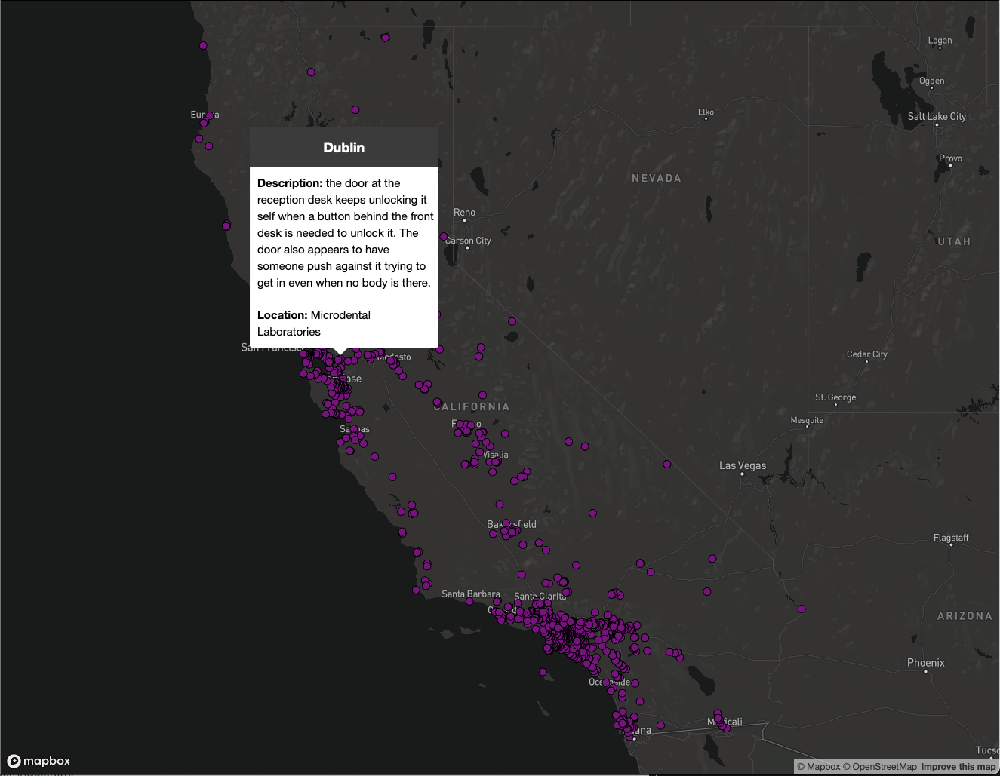
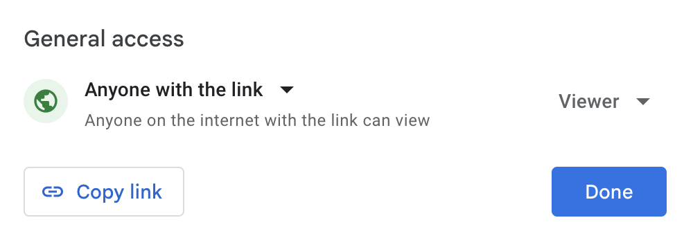
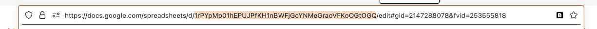
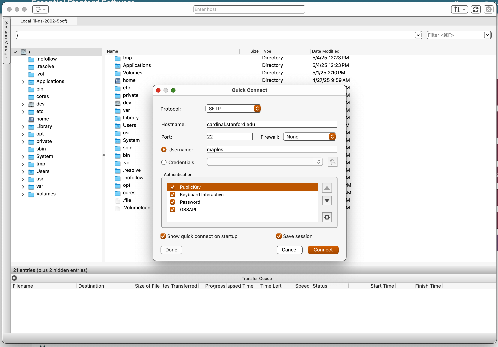
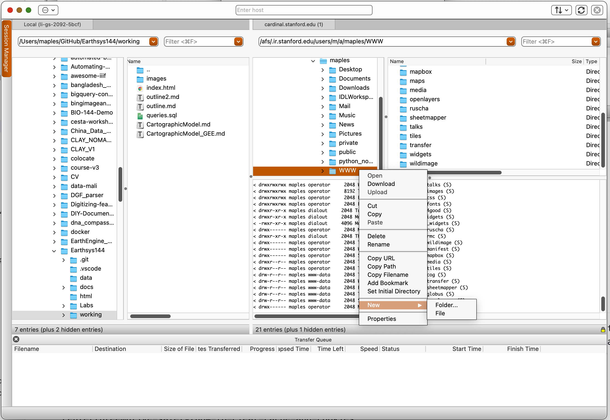
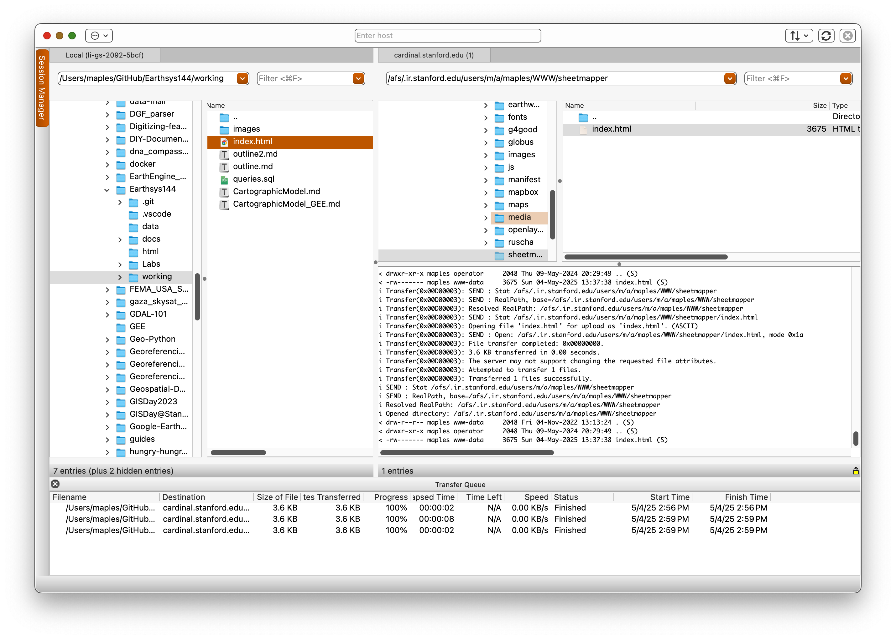
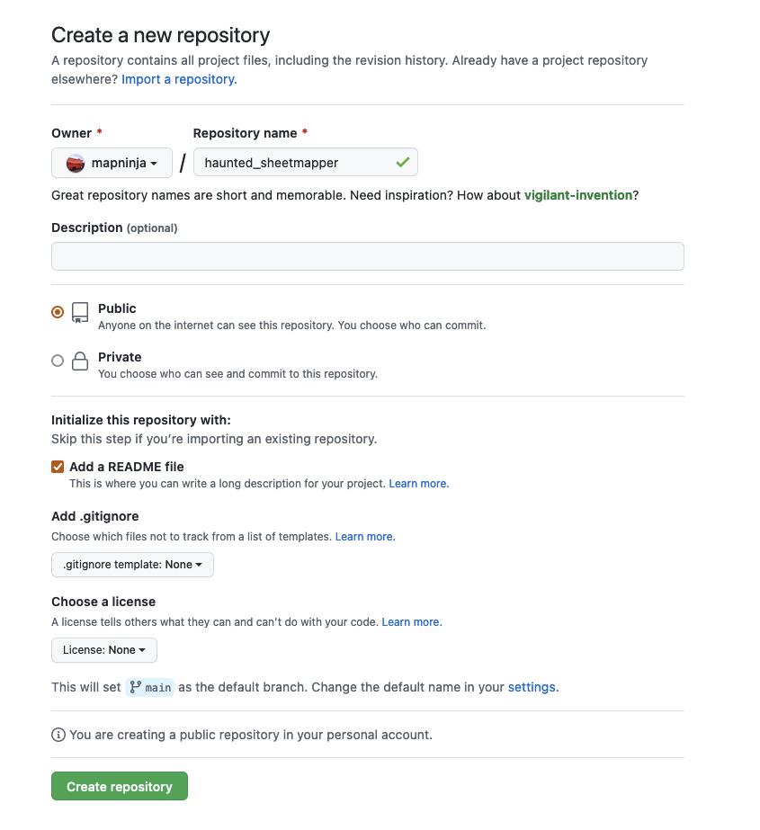

Adapted from: [https://labs.mapbox.com/education/impact-tools/sheet-mapper/](https://labs.mapbox.com/education/impact-tools/sheet-mapper/)

## Haunted SheetMapper

In this exercise, you will create a live-updating map that displays the locations of all your POIs or events, powered by a spreadsheet.



Everyone uses spreadsheets to collaborate and collect data, so we are often asked how to create a map from data in this format.

This blueprint is appropriate for any set of locations from a CSV or Google Sheet — to display offices, emergency shelters, distributed events, or _**HAUNTED PLACES IN CALIFORNIA**_!!!!

Once you have completed this exercise, you should be able to link this basic code to ANY spreadsheet of data, and publish it to the web, for free, and with the most basic server infrastructure, with the added bonus of being able to update the data in the SpreadSheet, and have the map update, automagically!

### Getting started

There are a few resources you'll need to get started:

## READ THIS PART CAREFULLY!!!

You will need to use a **Plain-text** Text Editor to write and edit your code.‍ **THIS IS IMPORTANT! DO NOT USE A DOCUMENT EDITOR, LIKE WORD OR TextEdit OR Notepad, etc... it will destroy your code by putting invisible formatting characters everywhere!**

## Plain-text Editors, I like:

All of these editors feature things like Code Highlighting (color coding of parts of your code), directory browsing and preview capabilities.

* [Sublime](https://www.sublimetext.com/) is very popular with Mac users, and has versions for Windows & Linux, as well. It's very simple, and a great first "code" editor.
* [Visual Studio Code](https://code.visualstudio.com/) for MacOS or Windows, is the new "Developer's Choice" with a million integrations, including ChatGPT Assisted coding, etc.... It can be a little intimidating for new users, but it is worth the learning curve.
* [Notepad++](https://notepad-plus-plus.org/downloads/) is also a good one I used when I was a Windows user.

## Did you READ ^^ THIS ^^ carefully?

***99.9% of any problems you have with this lab will be because you used a document editor, instead of plain text editor, designed for writing code.***

The other 0.1% will, no doubt, be my fault for not being clear. I'm working on it.

**Templates and Data:**

* [Sample index.html code](https://raw.githubusercontent.com/mapninja/Earthsys144/master/data/index.html)
* [Sample data spreadsheet `haunted_places`](https://docs.google.com/spreadsheets/d/1rPYpMp01hEPUJPfKH1nBWFjGcYNMeGraoVFKoOGtOGQ/edit?usp=sharing)
* [Live map demo](https://web.stanford.edu/~maples/mapbox/)

**Tools we'll use:**

* [Google Sheets](https://docs.google.com/spreadsheets/u/0/) to create and store your event data.
* A **PLAIN TEXT EDITOR** (See above)
* [MapLibre GL JS](https://maplibre.org) to add interactivity to your map and publish it on the web.
* [Csv2geojson](https://github.com/mapbox/csv2geojson) JavaScript Library to convert CSV and TSV files to GeoJSON data suitable for maps‍
* [Stanford’s AFS web server](https://afs.stanford.edu/) to publish your MapLibre GL JS map (If you want to see more about simple web services at Stanford, check out: [https://uit.stanford.edu/service/afs/intro](https://uit.stanford.edu/service/afs/intro)
* A [Github Account](https://github.com/) to publish your map, should AFS not work.

_Note: This tutorial demonstrates how to access data from a Google Sheet using csv2geojson.js, but this solution is also appropriate for users storing data as a [CSV](https://en.wikipedia.org/wiki/Comma-separated_values) or [TSV](https://en.wikipedia.org/wiki/Tab-separated_values). For more information read the [csv2geojson README.](https://github.com/mapbox/csv2geojson)_

## Getting started

### Create data in Google sheet

1. For this exercise, you can [duplicate your sheet from this template](https://docs.google.com/spreadsheets/d/1rPYpMp01hEPUJPfKH1nBWFjGcYNMeGraoVFKoOGtOGQ/edit?usp=sharing)


2. Make the table
3. ...or make your own sheet from scratch, with any data you want. You will need the following columns:
   1. longitude
   2. latitude
   3. Any additional fields you want to be displayed in the popups

## Make your table PUBLIC!

5. Once you have made your table, you will need to use the **Share Button** to make the table accessible so that "**_Anyone on the internet with the link can view_**":




4. To create an export link, copy the following link to your text editor for use, later:

`https://docs.google.com/spreadsheets/d/{key}/gviz/tq?tqx=out:csv&sheet={sheetname}`

## Creating a Google Sheet link:

Now that you have your dataset in Google Sheets, we need to 'craft' a custom URL that Mapbox csv2json can use as a source for the map.

1. To find the **Google Sheets ID** for your Table, look in the **URL Bar** of your browser:



2. To Find the **Sheet Name**, look at the bottom of the Sheet Page, for your **current tab**:


In the case of My `Sheet ID` and `Name` (In the images), they are the following (use your own):

**Google Sheet ID:** `1rPYpMp01hEPUJPfKH1nBWFjGcYNMeGraoVFKoOGtOGQ`

**Sheet name:** `cal_haunted_places`

3. Using the following template URL, craft your own **CSV Direct Download URL**

`https://docs.google.com/spreadsheets/d/{key}/gviz/tq?tqx=out:csv&sheet={sheetname}`

4. Replace:
   * `{key}` with your `Google Sheet ID`
     and
   * `{sheet_name}` with the `name of your sheet`

The newly constructed URL for my example would be:

[`https://docs.google.com/spreadsheets/d/1rPYpMp01hEPUJPfKH1nBWFjGcYNMeGraoVFKoOGtOGQ/gviz/tq?tqx=out:csv&sheet=cal_haunted_places`](https://docs.google.com/spreadsheets/d/1rPYpMp01hEPUJPfKH1nBWFjGcYNMeGraoVFKoOGtOGQ/gviz/tq?tqx=out:csv&sheet=cal_haunted_places)

If you click on the above link, it should start a download of the table, as `data.csv`.

5. You can test _**your own**_ **CSV Direct Download URL** by pasting it in your browser URL bar and hitting ENTER to be sure that it initiates a `data.csv` download

## Start Coding!

In this part, you will do what all programmers do: Steal someone else's code, and make it do what YOU want it to do!

1. Open you chosen **plain text editor** and create a file called `index.html`.

   In _**Atom**_, you can go to **File>New File** to create a new file.
2. Set up the document by copying and pasting [this template code](https://raw.githubusercontent.com/mapninja/Earthsys144/master/data/index.html) into your new HTML file

   (or, you can just save that webpage of html, as `index.html`), but make sure you add the `.html` extension, if necessary, when you **save as...**

The next sections walk you through altering the above code to customize with your data and other parameters. Feel free to experiment, knowing that you can always come back to the above code and start again, fresh.

## Importing a Javascript library

The following code uses the `<head>` tag to provide text in the HTML file that will not be rendered as text, but will import Javascript functions from another source, in this case:

* The [MapLibre GL JS](https://maplibre.org) library, to add interactivity to your map and publish it on the web.
* The [Csv2geojson](https://github.com/mapbox/csv2geojson) JavaScript Library to convert CSV and TSV files to GeoJSON data suitable for maps‍
* The jQuery library for asynchronous updating within the browser.

```html
<head></head>
    <meta charset="utf-8">
    <title>CSV to Map Example</title>
    <!-- Load MapLibre GL JS for the map -->
    <script src="https://unpkg.com/maplibre-gl@2.4.0/dist/maplibre-gl.js"></script>
    <link href="https://unpkg.com/maplibre-gl@2.4.0/dist/maplibre-gl.css" rel="stylesheet" />
    <!-- Load jQuery for easy AJAX requests -->
    <script src="https://cdnjs.cloudflare.com/ajax/libs/jquery/3.5.0/jquery.min.js"></script>
    <!-- Load csv2geojson to convert CSV to GeoJSON -->
    <script src="https://npmcdn.com/csv2geojson@latest/csv2geojson.js"></script>
    <style>
        body, html { margin: 0; padding: 0; height: 100%; }
        #map { position: absolute; top: 0; bottom: 0; width: 100%; }
    </style>
</head>
```

## Change the Basemap Style

MapLibre GL JS supports basemaps from various providers. For this exercise, the HTML file defaults to a free basemap from OpenStreetMap. You can update the style by simply replacing the link to the basemap JSON file:

```javascript
        // Create the map and set its starting position and zoom
        var map = new maplibregl.Map({
            container: 'map',
            style: 'https://basemaps.cartocdn.com/gl/voyager-gl-style/style.json', // OpenStreetMap style. This can be replaced with any MapLibre style URL, see the exercise for more
            center: [-122.411, 37.785], // [longitude, latitude]
            zoom: 8
        });
```

Here's a few basemaps you can try:

# CartoCDN Basemaps

Sources:

* [Dark Matter](https://basemaps.cartocdn.com/gl/dark-matter-gl-style/style.json) `https://basemaps.cartocdn.com/gl/dark-matter-gl-style/style.json`
* [Dark Matter No Labels](https://basemaps.cartocdn.com/gl/dark-matter-nolabels-gl-style/style.json) `https://basemaps.cartocdn.com/gl/dark-matter-nolabels-gl-style/style.json`
* [Positron](https://basemaps.cartocdn.com/gl/positron-gl-style/style.json) `https://basemaps.cartocdn.com/gl/positron-gl-style/style.json`
* [Positron No Labels](https://basemaps.cartocdn.com/gl/positron-nolabels-gl-style/style.json) `https://basemaps.cartocdn.com/gl/positron-nolabels-gl-style/style.json`
* [Voyager](https://basemaps.cartocdn.com/gl/voyager-gl-style/style.json) `https://basemaps.cartocdn.com/gl/voyager-gl-style/style.json`
* [Voyager No Labels](https://basemaps.cartocdn.com/gl/voyager-nolabels-gl-style/style.json) `https://basemaps.cartocdn.com/gl/voyager-nolabels-gl-style/style.json`

# [Institut Cartogràfic i Geològic de Catalunya (ICGC) Basemaps](https://openicgc.github.io/)

Sources:

* [ICGC Main](https://geoserveis.icgc.cat/contextmaps/icgc.json) `https://geoserveis.icgc.cat/contextmaps/icgc.json`
* [ICGC Dark Base Map](https://geoserveis.icgc.cat/contextmaps/icgc_mapa_base_fosc.json) `https://geoserveis.icgc.cat/contextmaps/icgc_mapa_base_fosc.json`
* [ICGC Shadow Hypsometry Contours](https://geoserveis.icgc.cat/contextmaps/icgc_ombra_hipsometria_corbes.json) `https://geoserveis.icgc.cat/contextmaps/icgc_ombra_hipsometria_corbes.json`
* [ICGC Dark Shadow](https://geoserveis.icgc.cat/contextmaps/icgc_ombra_fosca.json) `https://geoserveis.icgc.cat/contextmaps/icgc_ombra_fosca.json`
* [ICGC Standard Orthophoto](https://geoserveis.icgc.cat/contextmaps/icgc_orto_estandard.json) `https://geoserveis.icgc.cat/contextmaps/icgc_orto_estandard.json`
* [ICGC Standard Orthophoto Gray](https://geoserveis.icgc.cat/contextmaps/icgc_orto_estandard_gris.json) `https://geoserveis.icgc.cat/contextmaps/icgc_orto_estandard_gris.json`
* [ICGC Hybrid Orthophoto](https://geoserveis.icgc.cat/contextmaps/icgc_orto_hibrida.json) `https://geoserveis.icgc.cat/contextmaps/icgc_orto_hibrida.json`
* [ICGC Geological Risks](https://geoserveis.icgc.cat/contextmaps/icgc_geologic_riscos.json) `https://geoserveis.icgc.cat/contextmaps/icgc_geologic_riscos.json`
* [ICGC Standard Orthophoto](https://geoserveis.icgc.cat/contextmaps/icgc_orto_estandard_gris.json) `https://geoserveis.icgc.cat/contextmaps/icgc_orto_estandard_gris.json`
* [ICGC Hybrid Orthophoto](https://geoserveis.icgc.cat/contextmaps/icgc_orto_hibrida.json) `https://geoserveis.icgc.cat/contextmaps/icgc_orto_hibrida.json`
* [ICGC Geological Risks](https://geoserveis.icgc.cat/contextmaps/icgc_geologic_riscos.json) `https://geoserveis.icgc.cat/contextmaps/icgc_geologic_riscos.json`

## Connect your Google Sheet

The code in this html calls a Javascript Library called [csv2geojson](https://github.com/mapbox/csv2geojson) to retrieve data from the Google Sheet CSV export that you created and convert into the GeoJSON format that  make use of. You can see how an HTML page calls JavaScript libraries into your browser to run as code that drive interactivity in your HTML page.

1. Find the following section in your `index.html` file (it's immediately after the section you just edited):

```javascript
        // When the page is ready, get the CSV data
        $(document).ready(function () {
            $.ajax({
                type: "GET",
                //YOUR TURN: Replace with csv export link
                url: 'replace this text with the link to your CSV file within the single quotes',
                dataType: "text",
                success: function (csvData) { makeGeoJSON(csvData); }
            });
```

2. To connect your Google Sheet, replace the following text with the Google Sheet export link that you crafted, previously in the exercise, so that:
   `'replace this text with the link to your CSV file within the single quotes'`
   becomes something like:
   `'https://docs.google.com/spreadsheets/d/1rPYpMp01hEPUJPfKH1nBWFjGcYNMeGraoVFKoOGtOGQ/gviz/tq?tqx=out:csv&sheet=cal_haunted_places'`

That’s really the last of the coding you have to do. The remainder of the section about the code in your `index.html` is primarily for explanation, or if you are feeling adventurous and want to experiment with altering the look of your map.

## Changing Your Symbology

The next part of the code in your index.html file adds the layer to the map and specifies how it will be styled. In this example, the layer is added as a `circle`  with a `6 px` **radius** and the **color** is set to `purple`.

Feel free to alter the following section of code in order to change the (try:  **size** (`circle-radius`) or **color** (`circle-color`) of your symbols.

```javascript
                        // Add the GeoJSON data as a layer on the map
                        map.on('load', function () {
                            map.addLayer({
                                id: 'points',
                                type: 'circle',
                                source: { type: 'geojson', data: geojson },
                                paint: {
                                    'circle-radius': 6,
                                    'circle-color': 'purple'
                                }
                            });
```

For more on customizing your circle markers see: [https://maplibre.org/maplibre-style-spec/layers/#circle](https://maplibre.org/maplibre-style-spec/layers/#circle)

### Popups

This section of code creates teh on-click pop-ups for the data in the csv. Note how the column names in the csv are referred to as `props.location` and `props.description`:

```javascript
                            // When a point is clicked, show a popup
                            map.on('click', 'points', function (e) {
                                var props = e.features[0].properties;
                                // Create popup HTML: location as heading, description as text
                                var html = `<h3>${props.location}</h3><p>${props.description}</p>`;
                                new maplibregl.Popup()
                                    .setLngLat(e.lngLat)
                                    .setHTML(html)
                                    .addTo(map);
                            });

```

If you want to add different fields, change the text in the following line to match the column names in your own CSV:

```javascript 
var html = `<h3>${props.location}</h3><p>${props.description}</p>`;
```

# Publish and Test Your Haunted Sheetmapper! 

Note that because of something called **Cross-Origin Resource Sharing (CORS)** you won’t see the content from your Spreadsheet, until you publish your `index.html`. This ALSO means _**any changes you want to make will have to be uploaded each time**_ to check the results.

So you’ve made a web map! But it isn’t a web page yet… and, in fact, you probably can’t see the full functionality until the page is published to the web, and accessible, publicly (again, the cross origin resource sharing thing is the culprit, here). To do that we need some way to host a webpage. There are many different ways to host a webpage. GitHub Pages is one good solution, but Stanford students have access to a service called `afs.stanford.edu`, which allows them to publish simple webpages.

## Publish your map with your AFS Web Space Pages:

**Note that AFS Web Interface has been discontinued and it is now necessary to use a SecureFTP Client to login to your AFS Web Server Space**

I am in the process of rewriting this section of the Lab Instructions. Here are the University IT Instructions, which are not great, and need to have their screenshots updated, but are sufficient if you are brave and resourceful (you are):

### Download the SecureFX Client:

[https://uit.stanford.edu/software/scrt_sfx](https://uit.stanford.edu/software/scrt_sfx)

### Instructions for Installing and Licensing SecureFX Client, for Mac:

[https://uit.stanford.edu/service/ess/scrt_sfx/securefx/mac/install](https://uit.stanford.edu/software/scrt_sfx)

### Instructions for Installing and Licensing SecureFX Client, for Windows (Bundled with SecureCRT):

[https://uit.stanford.edu/service/ess/scrt_sfx/install](https://uit.stanford.edu/software/scrt_sfx)


## Using SecureFX to move files to your AFS space

Below is a screenshot of the Mac version of SecureFX. You can see on the left side of teh sofrtware, (behind the login screen) that you can browse files on your local machine, and on the right, you can browse folders and files on your remote AFS space. You can also drag and drop files from one place to another. THis is how we will use SecureFX.



1. Connect to `cardinal.stanford.edu` and login with your SUNetID and password.
2. Browse into your `WWW` folder and right-click **New>Folder** to make a new folder called `sheetmapper`.



1. Find your `index.html` file in the view of your local drive, and **drag-and-drop** it into the `sheetmapper` folder.



1. Test your sheetmapper page replacing `SUNETID` with your own `SUNetID` in the following URL: `http://web.stanford.edu/~SUNETID/sheetmapper/index.html`

Here’s the finished version of the example map:

[https://web.stanford.edu/~maples/sheetmapper/index.html](https://web.stanford.edu/~maples/sheetmapper/index.html)

## A Note About Browsers and Security

If you are a Safari or Chrome user, you shouldn't have any trouble viewing your sheetmapper index.html, but if you are a Firefox user, things may not work, at first, or sometimes at all. This is because Firefox is a bit alarmist about the **Cross-Origin Resource Sharing (CORS)** thing. If you are not able to see your map, or data, try the following:

1. Hold the Shift Key and refresh the browser Page
2. Clear your cache and cookies using the methods described, here: [https://www.kaspersky.com/resource-center/preemptive-safety/how-to-clear-cache-and-cookies](https://www.kaspersky.com/resource-center/preemptive-safety/how-to-clear-cache-and-cookies)
3. Try a different browser

# If AFS doesn’t seem to work for you:

You don’t need to do this for the homework unless AFS doesn’t work for you (it seems finicky for some students for some reason), but it’s nice to know that the following is an option for web publishing this type of application. This option also means that your access to the material won't end when your time at Stanford does.:

## Publish your map with GitHub Pages:

1. Create a Github account if you don’t have one. I suggest taking advantage of the GitHub Student Developer Pack: https://education.github.com/pack
2. Create a new [GitHub repository](https://help.github.com/articles/create-a-repo/):


1. Name it for your map (this will be visible in the URL).
2. Make it Public
3. Click the box to ‘Initialize this repository with a README’



3. Either:
4. Upload your `index.html` file to your new repository, or...
5. Create a new file called `index.html`
6. In the blank `index.html` file, paste in the entire edited code that you built in your text editor and **commit** it.


4. **Enable GitHub Pages** by going to **Settings>Pages** for your repo and changing the **Branch** from **None** to **main**, and save
5. After a minute or two, your **GitHub Page URL** will be published online. It will look something like `HTTPS://[YOUR GITHUB NAME].github.io/[YOUR REPO NAME]/` - **you can find your URL navigating back to the GitHub Pages section in your repository settings.**


Here’s the **GitHub URL** for the example:

[https://mapninja.github.io/haunted_sheetmapper/index.html](https://mapninja.github.io/haunted_sheetmapper/index.html)

# To Turn In

Post the `URL` for the **Stanford AFS** _**or**_ **Github Pages** version of your `index.html` page to **Canvas** for your submission.
