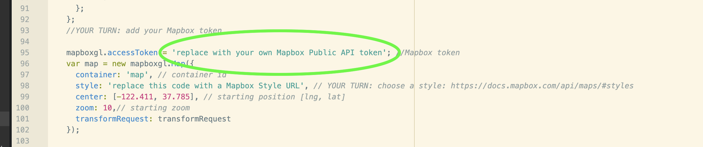
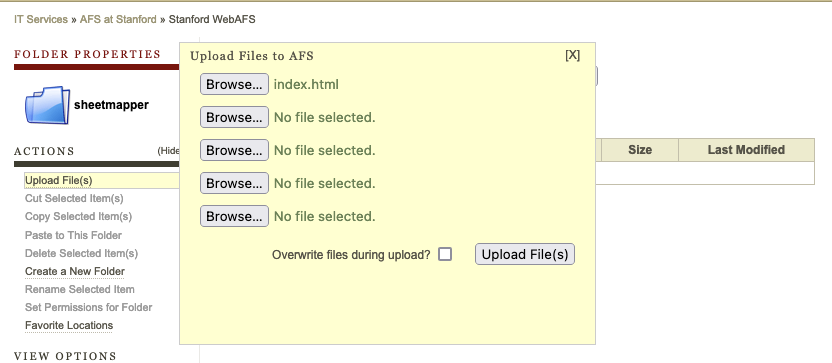

Adapted from: [https://labs.mapbox.com/education/impact-tools/sheet-mapper/](https://labs.mapbox.com/education/impact-tools/sheet-mapper/)


## Haunted SheetMapper

In this exercise, you will create a live-updating map that displays the locations of all your POIs or events, powered by a spreadsheet.


Everyone uses spreadsheets to collaborate and collect data, so we are often asked how to create a map from data in this format.

This blueprint is appropriate for any set of locations from a CSV or Google Sheet — to display offices, emergency shelters, distributed events, or _**HAUNTED PLACES IN CALIFORNIA**_!!!!

Once you have completed this exercise, you should be able to link this basic code to ANY spreadsheet of data, and publish it to the web, for free, and with the most basic server infrastructure, with the added bonus of being able to update the data in the SpreadSheet, and have the map update, automagically!


### Getting started

There are a few resources you'll need to get started:
## READ THIS PART CAREFULLY!!!

You will need to use a **Plain-text** Text Editor to write and edit your code.‍ **THIS IS IMPORTANT! DO NOT USE A DOCUMENT EDITOR, LIKE WORD OR TextEdit OR Notepad, etc... it will destroy your code by putting invisible formatting characters everywhere!**

Plain-text Editors, I like:
* [Atom](https://atom.io/) for MacOS or Windows,
* [Sublime](https://www.sublimetext.com/) is also very popular with Mac users,
* [Notepad++](https://notepad-plus-plus.org/downloads/) is also a good one I used to use for Windows

## Did you READ ^^ THIS ^^ carefully?

99.9% of any problems you have with this lab will be because you used a document editor, instead of plain text editor, designed for writing code.

The other 0.1% will, no doubt, be my fault.

**Templates and Data:**

* [Sample index.html code](https://raw.githubusercontent.com/StanfordGeospatialCenter/Earthsys144/master/data/index.html)
* [Sample data spreadsheet `haunted_places`](https://docs.google.com/spreadsheets/d/1rPYpMp01hEPUJPfKH1nBWFjGcYNMeGraoVFKoOGtOGQ/edit?usp=sharing)
* [Live map demo](https://web.stanford.edu/~maples/mapbox/)

**Tools we'll use:**

* [Google Sheets](https://docs.google.com/spreadsheets/u/0/) to create and store your event data.
* A **PLAIN TEXT EDITOR** like [Atom](https://atom.io/), [Sublime](https://www.sublimetext.com/) or [Notepad++](https://notepad-plus-plus.org/)
* [Mapbox account](https://www.mapbox.com/signup/) to access: ‍‍‍   
 * [Mapbox Studio](https://www.mapbox.com/mapbox-studio/) to create your map style.  
 * [Mapbox GL JS](https://docs.mapbox.com/mapbox-gl-js/api/) to add interactivity to your map and publish it on the web‍‍.
* [Csv2geojson](https://github.com/mapbox/csv2geojson) JavaScript Library to convert CSV and TSV files to GeoJSON data suitable for maps‍
* [Stanford’s AFS web server](https://afs.stanford.edu/) to publish your Mapbox GL JS map
* Possibly a [Github Account](https://github.com/) to publish your map, in case AFS doesn’t work.

_Note: This tutorial demonstrates how to access data from a Google Sheet using csv2geojson.js, but this solution is also appropriate for users storing data as a [CSV](https://en.wikipedia.org/wiki/Comma-separated_values) or [TSV](https://en.wikipedia.org/wiki/Tab-separated_values). For more information read the [csv2geojson README.](https://github.com/mapbox/csv2geojson)_


## Getting started

### Create data in Google sheet


1. For this exercise, you can [duplicate your sheet from this template](https://docs.google.com/spreadsheets/d/1rPYpMp01hEPUJPfKH1nBWFjGcYNMeGraoVFKoOGtOGQ/edit?usp=sharing)


2. Make the table
2. ...or make your own sheet from scratch, with any data you want. You will need the following columns:

    1. longitude
    2. latitude
    3. Any additional fields you want to be displayed in the popups

3. Once you have made your table, you will need to use the **Share Button**  to make the table accessible to Anyone with the link:


4. To create an export link, copy the following link to your text editor for use, later:


`https://docs.google.com/spreadsheets/d/{key}/gviz/tq?tqx=out:csv&sheet={sheetname}`

## Creating a Google Sheet link:

Now that you have your dataset in Google Sheets, we need to 'craft' a custom URL that Mapbox csv2json can use as a source for the map.

1. To find the **Google Sheets ID** for your Table, look in the **URL Bar** of your browser:


2. To Find the **Sheet Name**, look at the bottom of the Sheet Page, for your **current tab**:


In the case of My `Sheet ID` and `Name` (In the images), they are the following (use your own):

**Google Sheet ID:** `1rPYpMp01hEPUJPfKH1nBWFjGcYNMeGraoVFKoOGtOGQ`

**Sheet name:** `cal_haunted_places`

3. Using the following template URL, craft your own **CSV Direct Download URL**

`https://docs.google.com/spreadsheets/d/{key}/gviz/tq?tqx=out:csv&sheet={sheetname}`

4. Replace:
   * `{key}` with your `Google Sheet ID`   
   and
   * `{sheet_name}` with the `name of your sheet`

The newly constructed URL for my example would be:

[`https://docs.google.com/spreadsheets/d/1rPYpMp01hEPUJPfKH1nBWFjGcYNMeGraoVFKoOGtOGQ/gviz/tq?tqx=out:csv&sheet=cal_haunted_places`](https://docs.google.com/spreadsheets/d/1rPYpMp01hEPUJPfKH1nBWFjGcYNMeGraoVFKoOGtOGQ/gviz/tq?tqx=out:csv&sheet=cal_haunted_places)

If you click on the above link, it should start a download of the table, as `data.csv`.

5. You can test _**your own**_ **CSV Direct Download URL** by pasting it in your browser URL bar and hitting ENTER to be sure that it initiates a `data.csv` download

## Start Coding!

In this part, you will do what all programmers do: Steal someone else's code, and make it do what YOU want it to do!

1. Open you chosen **plain text editor** and create a file called `index.html`.    

     In _**Atom**_, you can go to **File>New File** to create a new file.

9. Set up the document by copying and pasting [this template code](https://raw.githubusercontent.com/StanfordGeospatialCenter/Earthsys144/master/data/index.html) into your new HTML file

   (or, you can just save that webpage of html, as `index.html`), but make sure you add the `.html` extension, if necessary, when you **save as...**

The next sections walk you through altering the above code to customize with your data and other parameters. Feel free to experiment, knowing that you can always come back to the above code and start again, fresh.

## Add your Mapbox access token

An `Access Token`, or `API key` is the credential that tells the Mapbox APIs that you are authorized to use them.  Without an access token, the rest of the code will not work.‍

1. [Login](http://account.mapbox.com/) or [create a free Mapbox account](https://www.mapbox.com/signup/).
2. Find your **Default public token** on your [Access tokens page](https://www.mapbox.com/account/access-tokens/) and copy it.
3. From the Account Page, click **Tokens** at the top of the page, and you will see your **Default Public Token**.

Note: Mapbox recommends using the URL restriction feature on the token to avoid token misuse and want to emphasize that only public tokens should be posted to public repositories. You can find out more information about how to securely manage your access tokens [here](https://docs.mapbox.com/help/troubleshooting/how-to-use-mapbox-securely/).




4. Find the above section of code in your **index.html** and replace the highlighted text with your own **Default public token**, copied from the **Mapbox** tokens page (see below).


## Add a Basemap Style

There are several [Mapbox-designed map styles](https://docs.mapbox.com/api/maps/#styles) that you can choose "out of the box" or you can design your own using the [Mapbox Studio style editor](https://www.mapbox.com/mapbox-studio).

1. Go to the [Mapbox API Documentation page for Styles](https://docs.mapbox.com/api/maps/styles/)
2. Select one of the **Mapbox-owned styles**, and copy it's **Style URL**.

For the example, we will use the **Mapbox Dark style**, whose **Style URL** is `mapbox://styles/mapbox/dark-v10`
3. Return to the section of code that you pasted your Mapbox Token into, in your `index.html` file:


4. Look for the `'replace this code with a Mapbox Style URL'` piece of code, and replace it with your chosen **Mapbox Style URL**:


## Connect your Google Sheet

The code in this html calls a Javascript Library called [csv2geojson](https://github.com/mapbox/csv2geojson) to retrieve data from the Google Sheet CSV export that you created and convert into the GeoJSON format that  make use of. You can see how an HTML page calls JavaScript libraries into your browser to run as code that drive interactivity in your HTML page.

1. Find the following section in your `index.html` file (it's immediately after the section you just edited):


2. To connect your Google Sheet, replace the `url:` value with your Google Sheet export link that you crafted, previously in the exercise, so that:  
 `url: 'paste the CSV download link you made, here',`  
 becomes something like:  
 `url: 'https://docs.google.com/spreadsheets/d/1rPYpMp01hEPUJPfKH1nBWFjGcYNMeGraoVFKoOGtOGQ/gviz/tq?tqx=out:csv&sheet=cal_haunted_places',`


That’s really the last of the coding you have to do. The remainder of the section about the code in your `index.html` is primarily for explanation, or if you are feeling adventurous and want to experiment with altering the look of your map.


## Changing Your Symbology

The next part of the code in your index.html file adds the layer to the map and specifies how it will be styled. In this example, the layer is added as a `circle`  with a `5 px` **radius** and the **color** is set to `purple`.

Feel free to alter the following section of code in order to change the **size** or **color** of your symbols.  

You can read more about layer types and available paint and layout properties in the [Mapbox Style Specification](https://docs.mapbox.com/mapbox-gl-js/style-spec/#layers).


```
//Add the the layer to the map
 map.addLayer({
     'id': 'csvData',
     'type': 'circle',
    'source': {
        'type': 'geojson',
        'data': data
    },
    'paint': {
        'circle-radius': 5,
        'circle-color': "purple"
    }
});
```


### Adding Popups

When a user clicks a symbol we want to show a Popup containing more information about the locations stored in our spreadsheet. The text for each popup is assigned to the fields `city`, `description` and `location`.


```JavaScript
// When a click event occurs on a feature in the csvData layer, open a popup at the
// location of the feature, with description HTML from its properties.
map.on('click', 'csvData', function (e) {
  var coordinates = e.features[0].geometry.coordinates.slice();

  //set popup text
  //You can adjust the values of the popup to match the headers of your CSV.
  // For example: e.features[0].properties.Name is retrieving information from the field Name in the original CSV.
  var description = `<h3>` + e.features[0].properties.city + `</h3>` + `<h4>` + `<b>` + `Description: ` + `</b>` + e.features[0].properties.description + `</h4>` + `<h4>` + `<b>` + `Location: ` + `</b>` + e.features[0].properties.location + `</h4>`;

  // Ensure that if the map is zoomed out such that multiple
  // copies of the feature are visible, the popup appears
  // over the copy being pointed to.
  while (Math.abs(e.lngLat.lng - coordinates[0]) > 180) {
    coordinates[0] += e.lngLat.lng > coordinates[0] ? 360 : -360;
  }

  //add Popup to map

  new mapboxgl.Popup()
    .setLngLat(coordinates)
    .setHTML(description)
    .addTo(map);
});

// Change the cursor to a pointer when the mouse is over the places layer.
map.on('mouseenter', 'csvData', function () {
  map.getCanvas().style.cursor = 'pointer';
});

// Change it back to a pointer when it leaves.
map.on('mouseleave', 'places', function () {
  map.getCanvas().style.cursor = '';
});

var bbox = turf.bbox(data);
map.fitBounds(bbox, { padding: 50 });
```
In particular, this line of code crafts a bit of HTML that will be rendered as the popup content, using the `city`, `description` and `location` fields, in our data. :


If you want to add different fields, change the display text to match the column names in your own CSV.

# Publish and Test Your Haunted Sheetmapper!

Note that because of something called **Cross-Origin Resource Sharing (CORS)** you won’t see the content from your Spreadsheet, until you publish your `index.html`. This ALSO means _**any changes you want to make will have to be uploaded each time**_ to check the results.

So you’ve made a web map! But it isn’t a web page yet… and, in fact, you probably can’t see the full functionality until the page is published to the web, and accessible, publicly (again, the cross origin resource sharing thing is the culprit, here). To do that we need some way to host a webpage. There are many different ways to host a webpage. GitHub Pages is one good solution, but Stanford students have access to a service called `afs.stanford.edu`, which allows them to publish simple webpages.

## Publish your map with your AFS Web Space Pages:

1. Go to [https://afs.stanford.edu](https://afs.stanford.edu) and login with your **SUNetID** and **password**.


2. Browse into your `WWW` folder and use “**Create a New Folder**” in the sidebar under “**Actions**” to make a new folder called `sheetmapper`.


4. Browse into your `sheetmapper` folder and use **"Upload File(s)"**, again in the **"Actions"** sidebar to upload your `index.html` page into the `sheetmapper` folder.




5. Test your sheetmapper page replacing `SUNETID` with your own `SUNetID` in the following URL: `http://web.stanford.edu/~SUNETID/sheetmapper/index.html`

Here’s the finished version of the example map:

[https://web.stanford.edu/~maples/sheetmapper/index.html](https://web.stanford.edu/~maples/sheetmapper/index.html)

## A Note About Browsers and Security

If you are a Safari or Chrome user, you shouldn't have any trouble viewing your sheetmapper index.html, but if you are a Firefox user, things may not work, at first, or sometimes at all. This is because Firefox is a bit alarmist about the **Cross-Origin Resource Sharing (CORS)** thing. If you are not able to see your map, or data, try the following:

1. Hold the Shift Key and refresh the browser Page
2. Clear your cache and cookies using the methods described, here: https://www.kaspersky.com/resource-center/preemptive-safety/how-to-clear-cache-and-cookies
3. Try a different browser


# BONUS (or if AFS doesn’t seem to work for you):

You don’t need to do this for the homework unless AFS doesn’t work for you (it seems finicky for some students for some reason), but it’s nice to know that the following is an option for web publishing this type of application:

## Publish your map with GitHub Pages:

1. Create an account at [GitHub.com](https://github.com/) if you don’t have one.
2. Create a new [GitHub repository](https://help.github.com/articles/create-a-repo/):  


 1. Name it for your map (this will be visible in the URL).    
 2. Make it Public    
 3. Click the box to ‘Initialize this repository with a README’


3. Either:
 1. Upload your `index.html` file to your new repository, or...
 2. Create a new file called `index.html`
 3. In the blank `index.html` file, paste in the entire edited code that you built in your text editor and **commit** it.


4. **Enable GitHub Pages** by going to **Settings>Pages** for your repo and changing the **Branch** from **None** to **main**, and save
5. After a minute or two, your **GitHub Page URL** will be published online. It will look something like `HTTPS://[YOUR GITHUB NAME].github.io/[YOUR REPO NAME]/` - **you can find your URL navigating back to the GitHub Pages section in your repository settings.**


Here’s the **GitHub URL** for the example:

[https://mapninja.github.io/haunted_sheetmapper/index.html](https://mapninja.github.io/haunted_sheetmapper/index.html)

# To Turn In

Post the `URL` for the **Stanford AFS** _**or**_ **Github Pages** version of your `index.html` page to **Canvas** for your submission.
