This Lesson has been adapted from Ujaval Gandhi's excellent: http://www.qgistutorials.com/en/docs/3/multi_criteria_overlay.html

## Multi Criteria Overlay Analysis (QGIS3)

Multi-criteria weighted-overlay analysis is the process of the allocating areas on the basis of a variety of attributes that the selected areas should possess. Although this is a common GIS operation, it is best performed in the raster space using a grid-based approach.

---

_Note:_
_**Vector vs Raster Overlays**_

_You can do the overlay analysis on vector layers using geoprocessing tools such as buffer, dissolve, difference and intersection. This method is ideal if you wanted to find a binary **suitable/non-suitable** answer and you are working with a handful of layers._

_Working in the raster space gives you a **ranking** of the suitability - not just the best suited site. It also allows you to combine any number of input layers easily and assign different weights to each criteria. In general, this is the preferred approach for site suitability._

---

This tutorial goes through the typical workflow for performing a site-suitability analysis - converting source vector data to appropriate rasters, re-classify them and perform mathematical operations.

### Overview of the task

In this lesson, we will identify the suitable areas for development, that are

* Close to roads, and
* Away from water bodies, and
* Not in a protected region.

### Get the data

We will use vector data layers from[ OpenStreetMap (OSM)](http://www.openstreetmap.org/). OSM is a global database of freely available base map data.[ Geofabrik](http://download.geofabrik.de/) provides daily updated shapefiles of OpenStreetMap datasets.

We will be using the OSM data layers for the state of Assam in India. Geofabrik[ India shapefiles](http://download.geofabrik.de/asia/india.html) were downloaded, clipped to the state boundary and packaged in a single GeoPackage file. You can download a copy of the geopackage from the link below:

[assam.gpkg](https://www.qgistutorials.com/downloads/assam.gpkg)

Data Source:[ [GEOFABRIK]](https://www.qgistutorials.com/en/docs/credits.html#geofabrik)

### Procedure

1. Browse to the downloaded `assam.gpkg` file in **QGIS Browser**. **Expand** it and *drag each of the 5 individual data layers* to the **map canvas**. You will see `boundary`, roads`,` `protected_regions`, `water_polygons` and `water_polylines` layers loaded in the **Layers panel**.

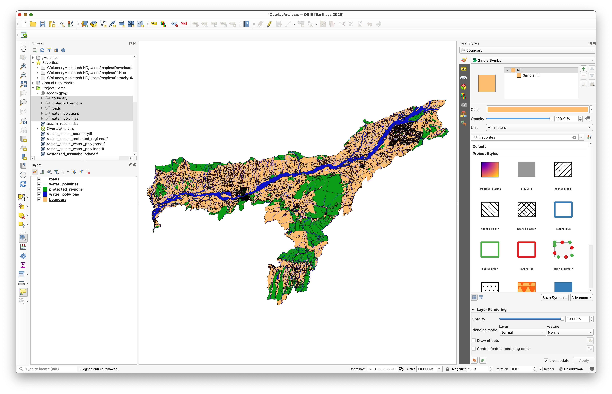

First step in the overlay analysis, is to convert each data layer to raster. An important consideration is that all rasters must be of the same extent. We will use the boundary layer as the extent for all the rasters.

3. Go to **Processing ‣ Toolbox**. Search for and locate the **GDAL ‣ Vector conversion ‣ Rasterize (vector to raster)** algorithm. **Double-click** to launch it.
4. In the **Rasterize (vector to raster)** dialog, select roads `as` the **Input layer**. We want to create an output raster where *pixel values are `1` where there is a road and `0` where there are no roads*. Enter `1` as the  **fixed value to burn**.
5. Select Geoferenced units as the Output raster size units. The input layers are in a projected CRS with meters are the unit.
6. Set the resolution of the output raster to be `100 meters`. Select `100` as both **Width/Horizontal resolution** and **Height/Vertical resolution**.
7. Next, click the **Option dropdown** next to **Output extent** and select **Calculate from Layer>**`boundary`. We'll use the same extent for the other layers, for consistency.

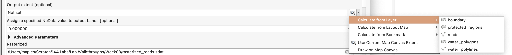

4. Scroll down further and **click the arrow button** in the **Assign a specific nodata value to output bands** dialog. That field should now be set to `Not set`. This is important because when raster calculator (which we will use later) encounters a pixel with nodata value in any layer, it sets the output to nodata as well. We want to avoid this.
5. Open the **Advanced Parameters** and set the **Output data type** to `Int16` and the **Pre-initialized the output image with value** to `0`
6. Set the **Rasterized** output raster as `rasterized_roads.sdat` and click Run**.**

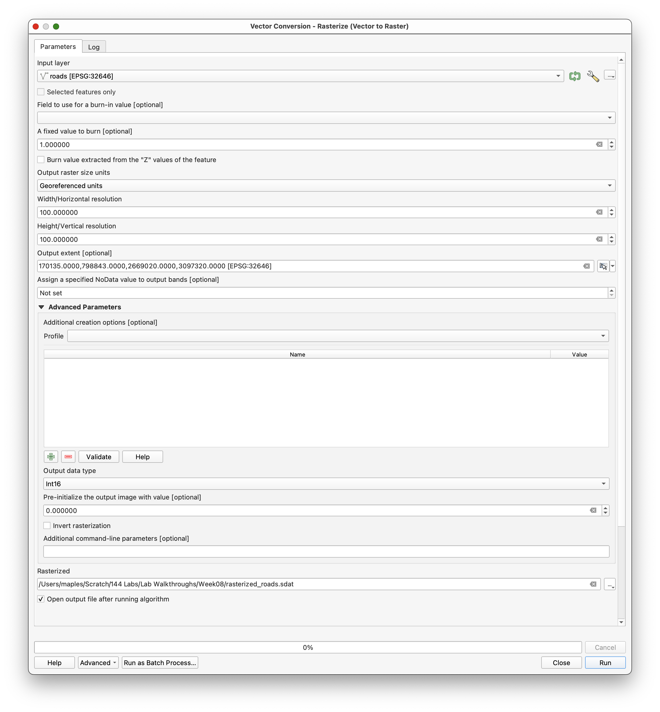

Once the processing finishes, you will see a new layer raster_roads loaded in the Layers panel. The default styling will show pixels with roads as white and others as black.

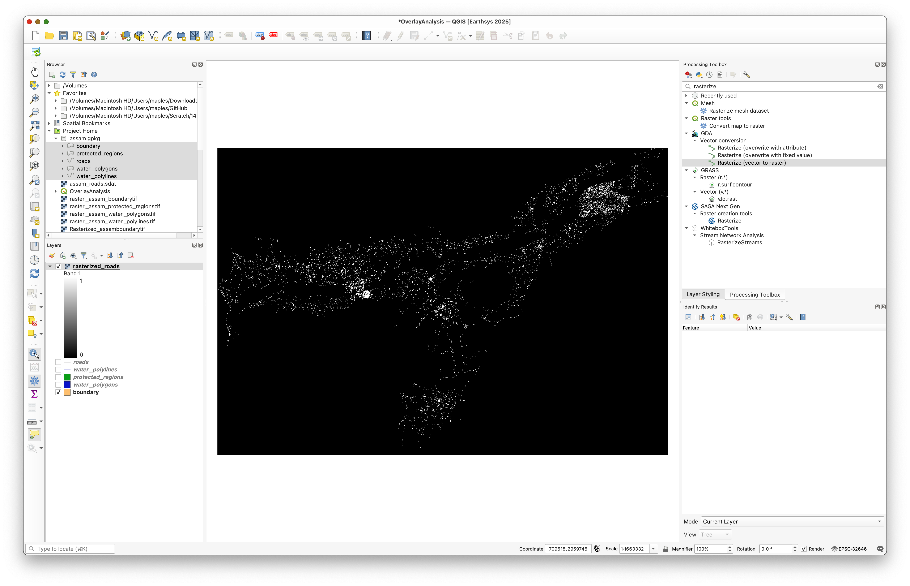

## Batch processing in QGIS

We want to convert other 4 vector layers to rasters as well. Rather than running the rasterize algorithm one-by-one, we can use the built-in batch-processing functionality to convert them all at once. See[ Batch Processing using Processing Framework (QGIS3)](https://www.qgistutorials.com/en/docs/3/batch_processing.html) tutorial to learn more about batch processing.

1. **Right-click** the **Rasterize (vector to raster)** algorithm and select **Execute as Batch Process**.

   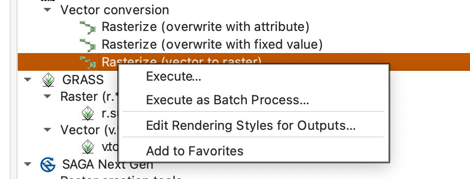
2. Click on the Setting Wheel at the top left to toggle Advanced Mode

   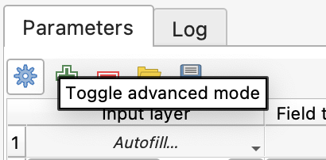
3. In the Batch Processing dialog, click the **Autofill…** button in the first row of the **Input layer** column and **Select from Open Layers...**
4. Select `boundary`, `protected_regions`, `water_polygons` and `water_polylines` layers and **click OK**.

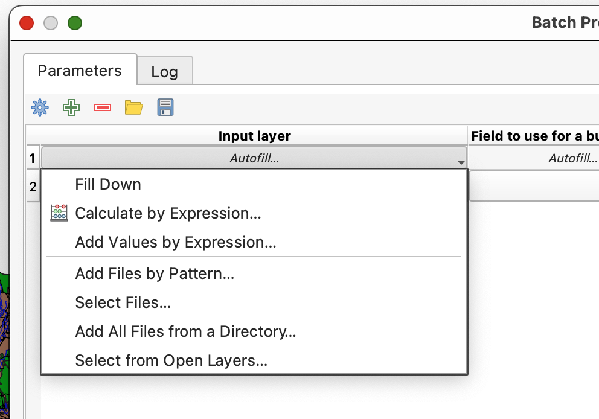

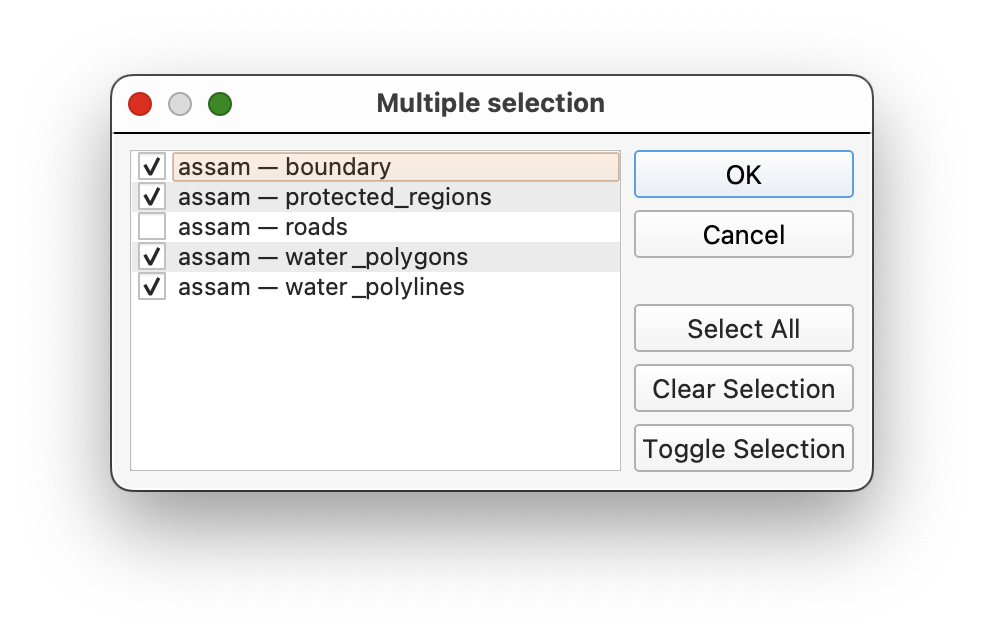

7. Fill in the parameters with the same values we used in the roads layer. *After filling the first-row* of the parameter, use the **Autofill ‣ Fill Down** button to add the same value for all layers.

8. Set the **Output Extent** using the **Calculate from Layer** menu option, using the `assam - boundary`.

   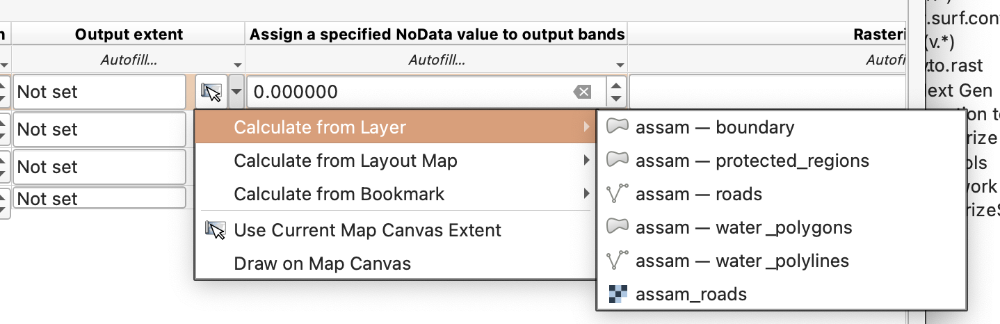
9. Fill in the Advanced Parameters, as will the `digitized_roads` layer, Making sure you set the **Output data type** to `Int16` and the **Pre-initialized the output image with value** to `0`

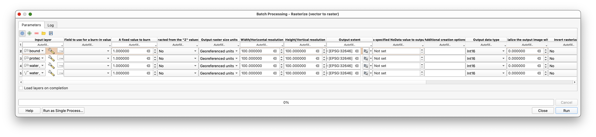

11. In the last column **Rasterized**, click the **…** button in the first row.
12. Create a **prefix** for the filenames. Use `raster_`

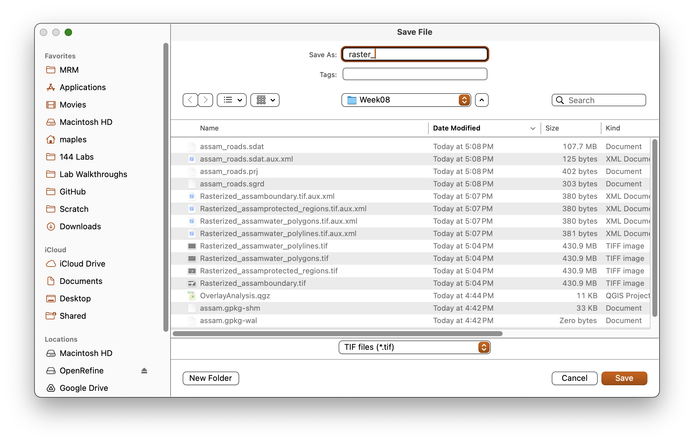

12. Select Fill with parameter values as the Autofill mode and Input layer as the Parameter to use. Click OK.

9. The batch processing interface will autocomplete the name with the layer name and fill in all rows.
10. Make sure the **Load layers on completion** box is checked and click **Run**.

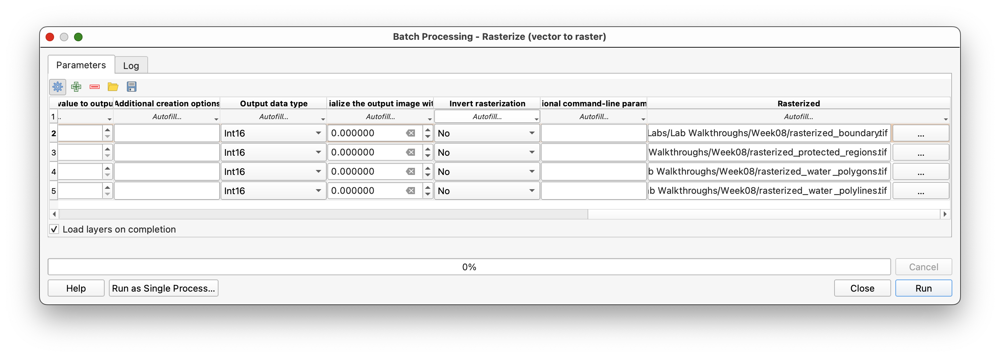

Once the processing finishes, you will have 4 new raster layers loaded in the Layers panel. You may want to toggle off the resulting `raster_assam_boundary` layer so that all other layers are visible.

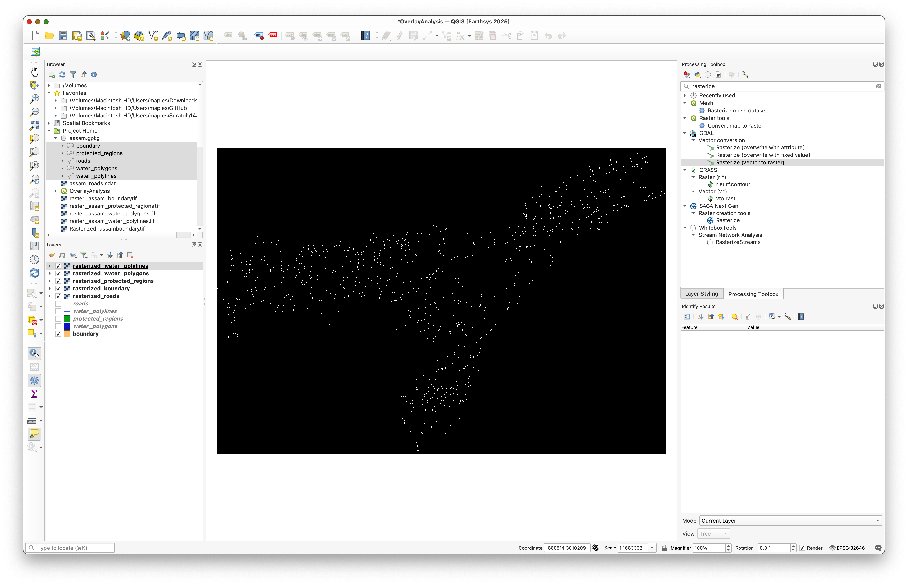

## Using the Raster Calculator

You will notice that we have 2 water related layers - both representing water. We can merge them to have a single layer representing water areas in the region.

1. Search for and locate **Raster analysis ‣ Raster calculator** algorithm in the **Processing Toolbox**. Double-click to launch it.

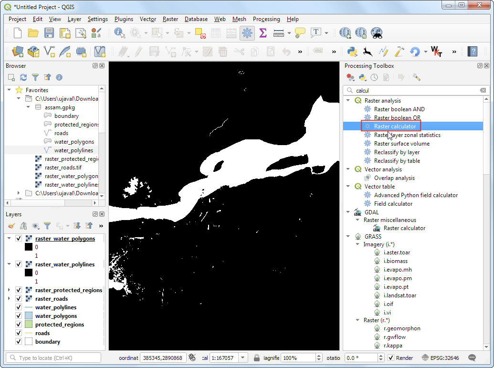

11. Enter the following expression in the Expression box. You can click on the appropriate layer in the Layers box to auto insert the layer names. This expression means that we want to sum the pixel values in the first band of both the water rasters. Click the … button next to Reference layer(s) and select ``raster_water_polygons` as the reference layer. Name the output raster_water_merged.tif and click Run.

`"raster_water_polygons@1" + "raster_water_polylines@1"`

12. The resulting merged raster will have pixels with value 1 for all areas with water. But you will notice that there are some regions where there was both a water polygon and a water polyline. Those areas will have pixels with value 2 - which is not correct. We can fix it with a simple expression. Open Raster analysis ‣ Raster calculator algorithm again.

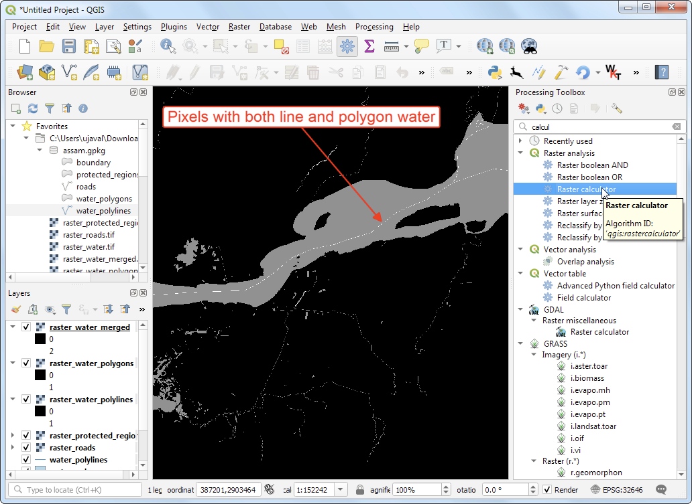

13. Enter the following expression which will assign the value 1 that match the expression and 0 where it doesn’t. Click the … button next to Reference layer(s) and select ``raster_water_merged` layer. Name the output raster_water.tif and click Run.

`"raster_water_merged@1" > 0`

14. The resulting layer raster_water now has pixels with only 0 and 1 values.

15. Now that we have layers representing road and water pixels, we can generate proximity rasters. These are also known as Euclidean distances - where each pixel in the output raster represents the distance to the nearest pixel in the input raster. This resulting raster can be then used to determine suitable areas which are within certain distance from the input. Search for and locate the GDAL ‣ Raster analysis ‣ Proximity (raster distance) algorithm. Double-click to launch it.

16. In the Proximity (Raster Distance) dialog, select raster_roads as the Input layer. Choose Georeferenced coordinates as the Distance units. As the input layers are in a projected CRS with meters as the units, enter 5000 (5 kilometers) as the Maximum distance to be generated. Make sure the NoData value to use for the destination proximity raster value is Not set. Name the output file as roads_proximity.tif and click Run.

_Note_:_It make take up to 15 minutes for this process to run. It is a computationally intensive algorithm that needs to compute distance for each pixel of the input raster and our input contains over 1 billion pixels._

17. Once the processing is over, a new layer roads_proximity will be added to the Layers panel. To visualize it better, let’s change the default styling. Click the Open the Layer Styling panel button in the Layers panel. Change the Max value to 5000 under Color gradient.

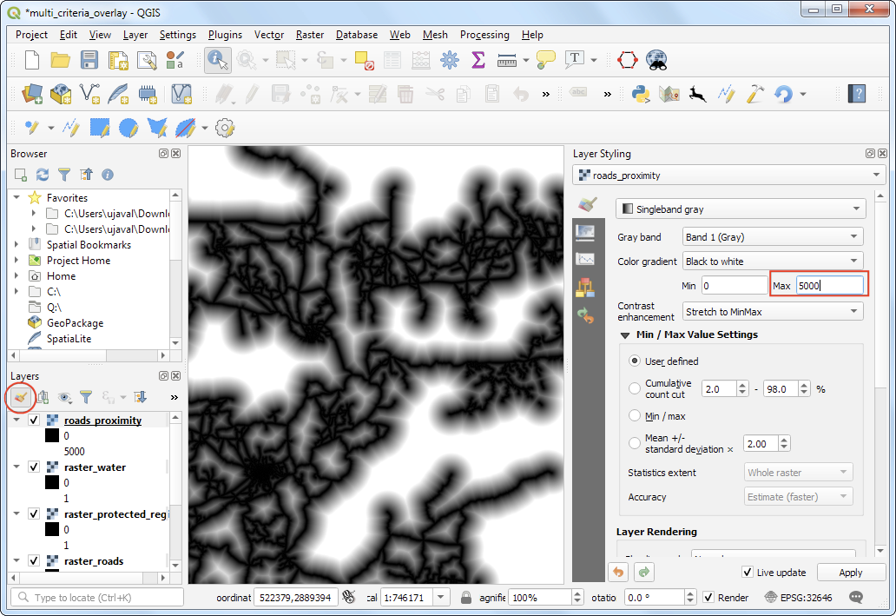

18. Repeat the Proximity (Raster Distance) algorithm for the raster_water layer with same parameters and name the output water_proximity.tif.

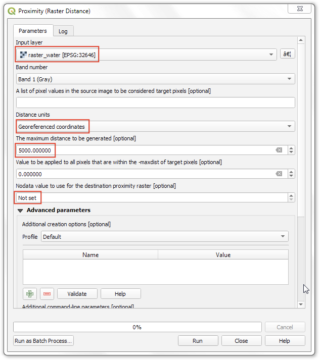

19. Once the processing finishes, you can apply the similar styling as before to visualize the results better. If you click around the resulting raster, you will see that it is a continuum of values from 0 to 5000. To use this raster in overlay analysis ,we must first re-classify it to create discrete values. Open Raster analysis ‣ Raster calculator algorithm again.

20. We want to give higher score to pixels that are near to roads. So let’s use the following scheme.

* `0-1000m –> 100 `
* `1000-5000m –> 50`
* `>5000m –> 10`

Enter the following expression that applies the above criteria on the input. Click the … button next to Reference layer(s) and select ``roads_proximity` layer. Name the output roads_reclass.tif and click Run.

`100*("roads_proximity@1"<=1000) + 50*("roads_proximity@1">1000)*("roads_proximity@1"<=5000) + 10*("roads_proximity@1">5000)`

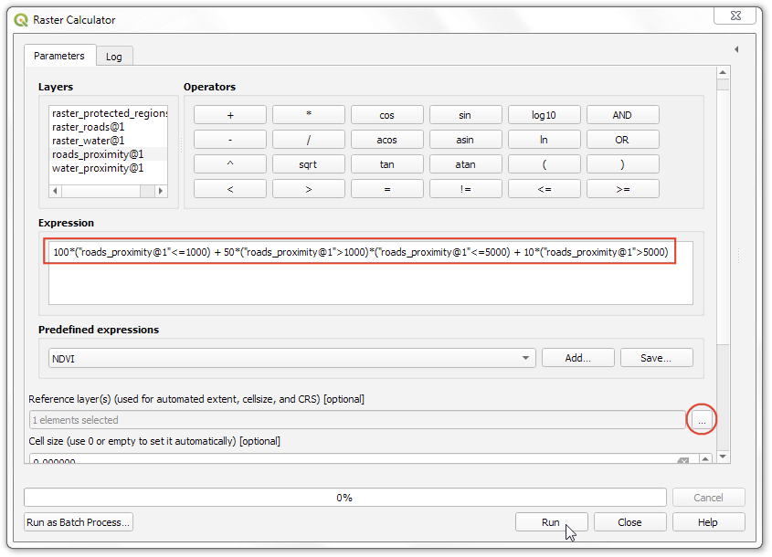

21. Once the re-classification process finishes, a new layer roads_reclass will be added to the Layers panel. This layer has only 3 different values, 10, 50 and 100 indicating relative suitability of the pixels with regards to distance from roads. Open Raster analysis ‣ Raster calculator algorithm again.

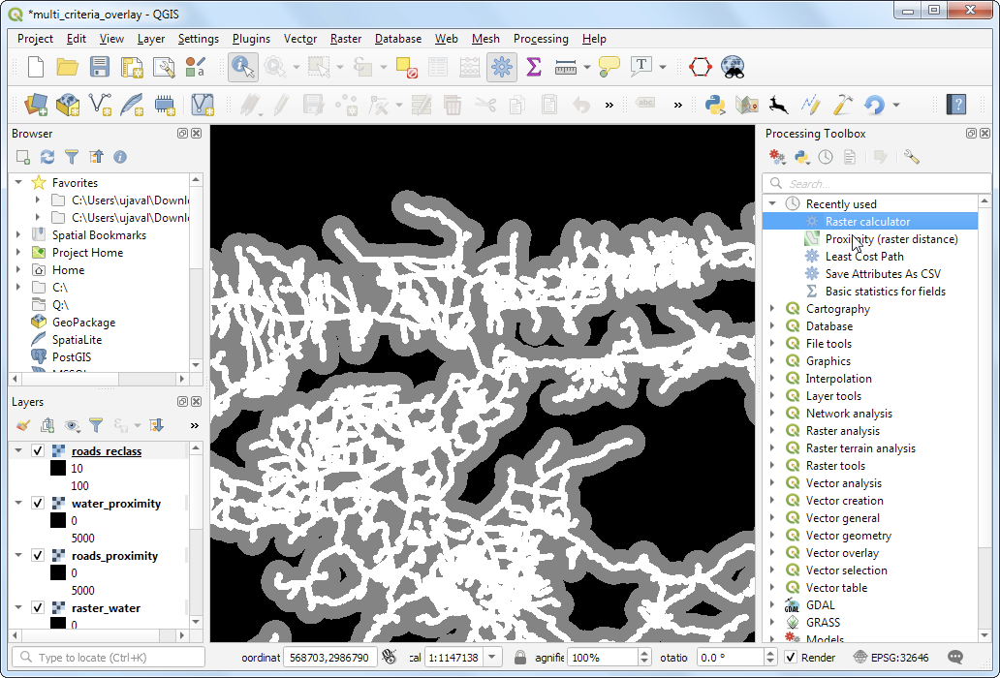

22. Repeat the re-classification process for the water_proximity layer. Here the scheme will be reverse, where pixels that are further away from water shall have higher score.

* `0-1000m –> 10`
* `1000 -5000m —> 50`
* `>5000m –> 100`

Enter the following expression that applies the above criteria on the input. Click the … button next to Reference layer(s) and select ``water_proximity` layer. Name the output water_reclass.tif and click Run.

`100*("water_proximity@1">5000) + 50*("water_proximity@1">1000)*("water_proximity@1"<=5000) + 10*("water_proximity@1"<1000)`

23. Now we are ready to do the final overlay analysis. Recall that our criteria for determining suitability is as follows - close to roads, away from water and not in a protected region. Open Raster analysis ‣ Raster calculator. Enter the following expression that applies these criteria. Note that we are multiplying the result with raster_boundary@1 at the end to discard pixel values outside of the state boundary. Click the … button next to Reference layer(s) and select raster_boundary layer. Name the output overlay.tif and click Run.

`("roads_reclass@1" + "water_reclass@1")*("raster_protected_regions@1"  !=  1 )*"raster_boundary@1"`

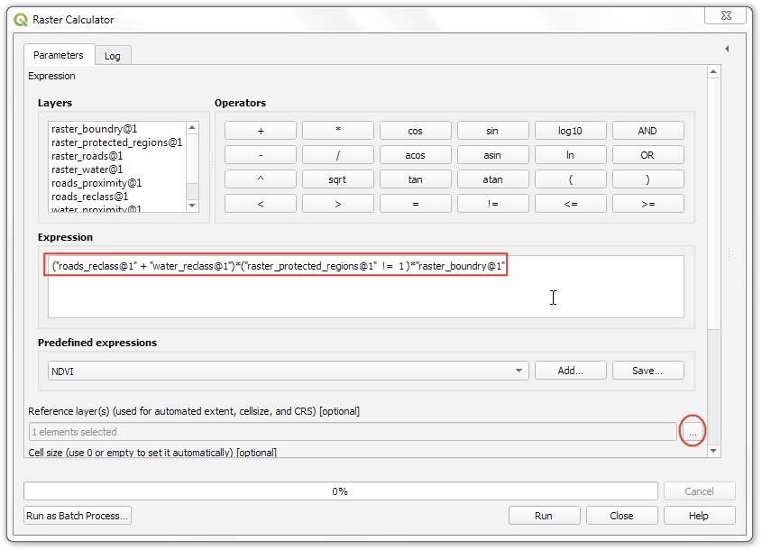

_Note:_

_In this example, we are giving equal weight to both road and water proximity. In real-life scenario, you may have multiple criteria with different importance. You can simulate that by multiplying the rasters with appropriate weights in the above expression. For example, if proximity to roads is twice as importance as proximity away from water, you can multiply the roads_reclass raster with 2 in the expression above._

24. Once the processing finishes, the resulting raster overlay will be added to the Layers panel. The pixel values in this raster range from 0 to 200 - where 0 is the least suitable and 200 is the most suitable area for development. Click the Open the Layer Styling panel button in the Layers panel.

25. Select singleband_pseudocolor renderer and the Spectral color ramp. Click Classify to apply the color ramp to the raster.

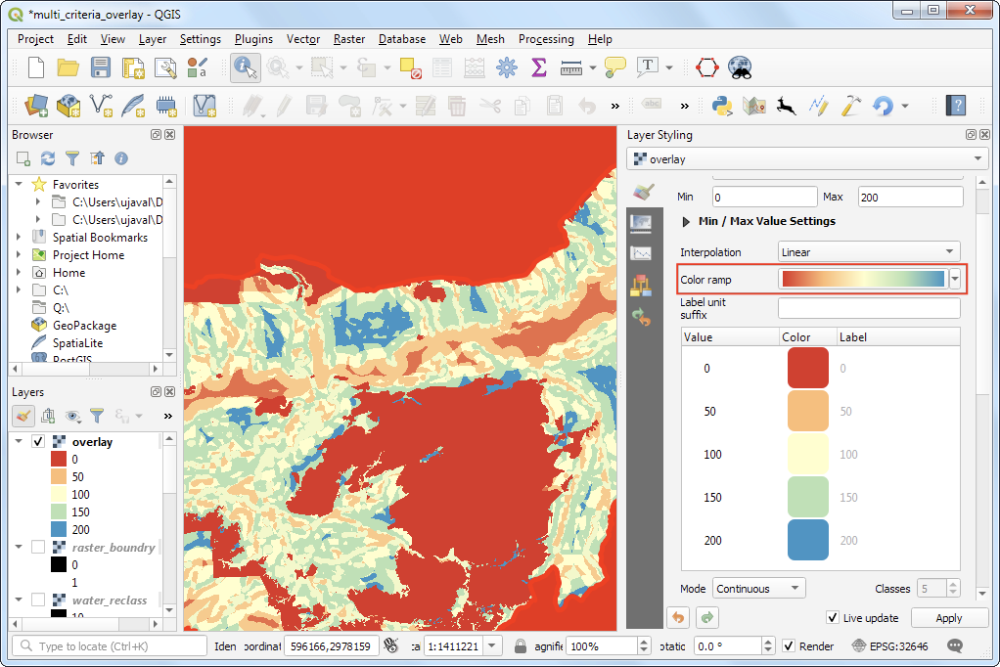

26. Click on the default label values next to each color and enter appropriate labels. The labels will also appear as the legend under the overlay layer.

27. Raster layers are rectangular grids. We want to hide pixels outside the state boundary. An easy way to achieve this is applying an Inverted Polygons rendered to the vector boundary layer. Scroll down in the Layers panel and locate the boundary layer. Select Inverted Polygons as the renderer and leave other options to default.

28. For the effect of the renderer to show, it needs to be at the top of the Table of Contents. Right-click the boundary layer and select Move to Top.

29. Check the layer and the map canvas would update to show the overlay raster clipped to the boundary layer. This is the final output that shows areas within the state that are suitable for development.

# To Turn In:

1. Create a **QGIS** Layout of your **Suitability Analysis**
2. Add the _**appropriate Map Elements**_, including:
   1. Title
   2. Date
   3. Your name
   4. Map CRS
   5. Legend
   6. Scalebar
3. **Export** your **Map Layout** to `PDF` or `PNG` Image, and upload to **Canvas**
