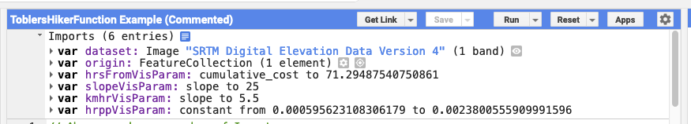

# Modeling Geographic Space, with Google Earth Engine
## How you will complete this lab
In this Lab, you will use existing code, which represents an implementation of Waldo Tobler's Hiking Function, as a Model for examining the effect of topography (here, modeled as `slope`) on human movement across a bare landscape.

**You will take the code from this lesson, and paste it into your own Code Editor, altering the code in order to focus this model on another part of the world, perhaps somewhere you are interested in.**

**In doing so, you will, hopefully, accomplish two things:**

**First**: You will hopefully familiarize yourself with the process of "Modeling Geographic Space" through the successive geoprocessing of layer(s) of spatial data, with the goal of representing some phenomenon, and it's relationship to geographic space.

**Second**: You will hopefully gain some confidence in the process of "piecing together" code from another source, and altering it to meet your specific purpose. This is most of what using code, in research, is: Grabbing pieces of code from other sources, and working to integrate them into something that performs a specific task, you are interested in.

### Getting Started

Below, you will find a **Google Earth Engine Code Editor GetLink** which you can use to load the initial imports for the script you are about to create.

Once the `Imports` are loaded into your **Google Earth Engine Code Editor** window, you should **save** the script to your own **Earth Engine Scripts repository** by clicking on the **Save button** and **Save a Copy** to your `default` repository.

## The Imports

Use this link to **import** the initial code for this exercise:
https://code.earthengine.google.com/9654653086300ce58540b7af99ef3ab3?accept_repo=users%2Fstacemaples%2FModelingSpace




At the top of the **Script window**, you will see a number of prepared **Imports**:
- '`dataset`' is holding the `SRTM Digital Elevation Model`, which is an image with one band called 'elevation'
- '`origin`' is a `featureCollection` with a single feature, right now. You will alter the feature(s) for your lab
- '`hrsFromVisParam`' is a `dictionary` containing the visualization parameters for our `hrsFrom` layer
- '`slopevis`' is a `dictionary` containing the visualization parameters for our `slope` layer
- '`kmhrVisParam`' is a `dictionary` containing the visualization parameters for our `speedDEM` layer
- '`hrppVisParam`' is a `dictionary` containing the visualization parameters for our `toblerTime` layer

## How to complete the rest of this assignment

From this point, you will be presented with an explanation of the step we are about to undertake, perhaps some explanation of how the particular function we are using, works, and then a `Code Block`, that executes what has been described, in `JavaScript`.

Your task, for the next section of the lab is to **read the descriptions**, and **explore any links to documentation**, then **Cut & Paste the** `Code Block` provided, into your **Google Earth Engine Code Editor** window. The `Code Block`s in this lesson are **sequential**, so you should **_take care to paste each in the sequence it is presented in_**.

You will note that the `Code Block`s are commented, heavily in some cases. Comments on the code come, in general, before the active code. In some of the `Code Block`s you will see additional code "commented out" with the single-line double slash-style "//" convention. In most cases this code is meant to add an analytic layer to the Map. You can uncomment this code by deleting the first set of forward slashes "//", at the beginning of the line, then run the script, for testing purposes. Re-comment the line, before you progress further. At the end of the script, all of the layers will be added to the map, in the same section.

As you progress, you should remember to **Save** your script, **often**.
## Set the Map Options

First, set the basemap for the model. Here it is set to '`TERRAIN`'. It can be one of "`ROADMAP`", "`SATELLITE`", "`HYBRID`" or "`TERRAIN`" to select one of the [standard Google Maps API map types](https://developers.google.com/maps/documentation/javascript/maptypes).
```JavaScript
// First, set the basemap for the model. Here it is set to 'TERRAIN'. Can be one of
// "ROADMAP", "SATELLITE", "HYBRID" or "TERRAIN" to select one of the standard
// Google Maps API map types, or one of the keys specified in the opt_styles dictionary.
// If left as null and only 1 style is specified in opt_styles, that style will be used.
Map.setOptions('TERRAIN');
```
Center on the `origin` FeatureCollection, which currently has a single Feature.  You can edit the zoom level: `world=0` up to `house=22`. It's set to a pretty good scale for this location, adjust as necessary after you change the origin location(s) later in the lesson.
```JavaScript
// Center on the `origin` FeatureCollection, which currently has a single Feature.
// You can edit the zoom level: world=0 > house=22. It's set to a pretty good spot for this location,
// adjust as necessary after you change the origin location(s) later in the lesson
Map.centerObject(origin, 9);
```
## Calculate Slope from the SRTM Data
First, declare a variable called `elevation` give it the `elevation` band
selected from the `dataset` that contains the **SRTM Collection**. You can see the selectable bands of a collection by looking at it's [data catalog entry](https://developers.google.com/earth-engine/datasets/catalog/CGIAR_SRTM90_V4).

Note that the following code has a commented out line, at the end, which can be used to test the layer.

```Javascript
/// First, declare a variable called 'elevation' give it the 'elevation' band
// selected from the 'dataset' that contains the SRTM Collection. You can see the
// selectable bands of a collection by looking at it's data catalog entry
// Select the elevation band from the image collection
var elevation = dataset.select('elevation');
//Map.addLayer(elevation, {min:0,max:3000},'elevation');//Delete the first "//" on this line to test the layer
```

Calculate the slope of your `elevation`, in degrees. This is the first step of the model

```Javascript
// Calculate the slope of your DEM, in degrees. This is the first step of the model
var slope = ee.Terrain.slope(elevation);
// Map.addLayer(slope, slopeVisParam, 'slope');//Delete the first "//" on this line to test the layer
```

Create a **flat slope image**. We will use this to compare what the model tells us about movement on the DEM, to movement on a flat surface, without any 'slope friction'
```Javascript
// Create a flat slope image. We will use this to compare what the model tells us about movement on
// the DEM, to movement on a flat surface, without any 'slope friction'
var flatSlope = ee.Image.constant(0);
```

## Implementing Tobler's Hiker Function, as a Javascript Function

**Tobler's Hiker Function** is an exponential calculation of a theoretical **hiking speed**, based upon **terrain slope**, used as a friction surface.

You can read more about The Hiker Function, here:
- https://en.wikipedia.org/wiki/Tobler%27s_hiking_function
- https://www.osti.gov/servlets/purl/1311302

Use **Tobler's Hiker Function** to calculate km/hr a pixel can be traversed, where:  

`Walking Velocity(km/h) = (6 * Exp(-3.5 * Abs(Tan(("slope_radians" * 3.14159)/180) + .05)))`  

Here, we create a function called `toblerSpeed()` that we can pass any `slope` image, to.

```Javascript
// Here, we create a Tobler function that we can pass any Slope image, to.
var toblerSpeed = function(image){
  var radians = image
.multiply(3.14159)
.divide(180.0);
  var toblerSpeed = radians
.tan()
.add(0.05)
.abs()
.multiply(-3.5)
.exp()
.multiply(6.0);
  return toblerSpeed;
};
```
## Pass your slope images to the new `toblerSpeed()` Function
Now, we will pass both of our slope layers, `slope` and `flatSlope`, to the `toblerSpeed()` function, to calculate the layers that describe walking speeds, on our two `slope` surfaces.


```Javascript
// Send the slope layers to the Tobler Function
var speedDEM = toblerSpeed(slope);
var speedFlat = toblerSpeed(flatSlope);
//Map.addLayer(speedDEM, kmhrVisParam, 'speedDEM');//Delete the first "//" on this line to test the layer
```  

## Converting to "Cost"
Next, we want to convert the `km/hr` to `hrs/px` values, which tell us how many hours each pixel "costs" to cross. We will use this "cost" layer to accumulate cost from a feature in our `origin` `featureCollection`.
```Javascript
// Covert the km/hr to time to traverse pixel
var toblerTime = ee.Image.constant(0.003)
.divide(speedDEM);
// Map.addLayer(toblerTime, hrppVisParam, 'toblerTime');//Delete the first "//" on this line to test the layer
```

Covert the `km/hr` to `hrs/px` values for the flat image, as well.
```Javascript
// Convert the km/hr to hrs/px values for the flat image
var flatTime = ee.Image.constant(0.003)
.divide(speedFlat);
```
## Prepare the `origin`(s)
It is necessary to _rasterize_ the `origin` **point(s)**, since the `cumulativeCost()` function requires an image, as it's input.

Here, we will use the [`reduceToImage()`](https://developers.google.com/earth-engine/apidocs/ee-imagecollection-reducetoimage) function to cast our featureCollection to an image of `1`'s and `0`'s, where `1` is a feature in our `featureCollection`, called `origins`

```Javascript
// Rasterize the origin point, since the cumulativeCost() function requires images, as inputs.
var originImage = origin.reduceToImage({
    properties: ['DUM'],
    reducer: ee.Reducer.first()
});
```

Note that you can edit the location of geometry, and it will update the model, dynamically. You will do this, later, once you have the model working.


Here, we are using the [`cumulativeCost()`](https://developers.google.com/earth-engine/guides/image_cumulative_cost) function, to accumulate the cost,
in hrs to walking away from the `originImage`, which is a raster version
of the 'origin' featureCollection

```Javascript
// Here, we are using the cumulativeCost() function, to accumulate the cost,
// in hrs, incurred while walking away from the originImage, which is a raster version
// of the 'origin' featureCollection
var hrsFrom = toblerTime.cumulativeCost(originImage,60000);
var hrsFlat = flatTime.cumulativeCost(originImage,60000);
// Map.addLayer(hrsFrom,hrsFromVisParam, 'Hours from Origin');//Delete the first "//" on this line to test the layer
// Map.addLayer(flatTime,hrsFromVisParam, 'Hours from Origin');//Delete the first "//" on this line to test the layer
```

Now, we select only the pixels within **8, 16, & 24 hrs**, which we are using as a 'day' of walking. You can adjust these values to adjust the model, depending on how much walking time you think a day should be. These are the layers you will want to export, later, to create a map layout in QGIS:  
```Javascript
// The first value we will declare in this section is the # of hrs per day walking we want to model
var daysWalk = 8; // You can change this value to increase or reduce the # hrs per day, walking

// Here we are using lt() to select all of the pixels in hrsFrom layer, that are Less Than
// the # of hours we want for each layer.
var onedayWalk = hrsFrom.lt(daysWalk);
var twodayWalk = hrsFrom.lt(daysWalk*2);
var threedayWalk = hrsFrom.lt(daysWalk*3);
var threedayFlat = hrsFlat.lt(daysWalk*3);
// You'll add these layers to the map, in the next step
```

Add all the analytic layers, flagged shown:0, which turns them off in the Layers widget. To see these layers, go to the Layers Widget, and toggle the layer you want to see, on.

```Javascript
// Add all the analytic layers, most flagged shown:0, using the VisParam Imports
// at the top of the script. Try changing the last parameter from 0 to 1, to make the layers
// visible by default
Map.addLayer(slope, slopeVisParam, 'slope',0);
Map.addLayer(speedDEM, kmhrVisParam, 'km/hr',0);
Map.addLayer(toblerTime, hrppVisParam, 'Hours per Pixel',0);
Map.addLayer(hrsFrom,hrsFromVisParam, 'Hours from Origin',0);
```


Add the walking time areas, with opacity. note that the order in code, is the order rendered

```Javascript
Map.addLayer(threedayFlat.updateMask(threedayFlat), { min:0,max: 1, palette:'green'}, '3 days on Flat',1,0.5);
Map.addLayer(threedayWalk.updateMask(threedayWalk), { min:0,max: 1, palette:'red'}, '3 days from Origin',1,0.5);
Map.addLayer(twodayWalk.updateMask(twodayWalk), { min:0,max: 1, palette:'orange'}, '2 days from Origin',1,0.5);
Map.addLayer(onedayWalk.updateMask(onedayWalk), { min:0,max: 1, palette:'yellow'}, '1 day from Origin',1,0.5);
```

## Test the script
Now, Save your Script, and Run it to test to see how things are working, so far.
When Troubleshooting, look for little icons in the left margin of the Code Window. If you see them, they will often have messages about what the interpreter behind the Code Editor thinks is wrong.

**In General, when troubleshooting, make sure to:**
* Double-check that each section of code (mostly, each line, but this isn't the case sometimes with Functions and other code bites that span more than one line), ends with a semi-colon `;`.
* Double-check your comments to make you haven't accidentally left a comment un-commented.
* Double-check that you've preserved the order of operations, in this lesson.

# To Turn In: Preparations:
Time for you to edit code!  In the following section

## Change the `origin`(s) to Model Movement, somewhere else in the World
Now you will alter the model to point the model to another part of the world. Currently, the model is pointing to Yosemite Valley, CA. Find yourself _somewhere_ else to point the model, by altering the featureCollection called `origin`, like so:

To change the origin point, _**after running the model successfully**_:  
1. **Click** on the **Reset** button to keep the model from running as you move to a new location
2. Click on the **current point**, and **DELETE** it.
3. **Zoom and Pan** to a new location. Change the **Basemap Widget** to **Map>Terrain** to find topographically interesting locations
4. **Hover** over the **Geometry Imports widget**, and click on the '`origin`' layer until the **crosshair** icon activates
5. **Click** with the **crosshair** in a **new location**, and click **Exit** on the **Geometry Imports widget**, to save the new location
6. **Run** the **Script** to see the new results.  

Adding more than one point is possible, but reduces performance, dramatically.

## Exporting Your Modeled Layers as a Dataset
Here, you will add some code to the end of your script to prepare and export your resulting layers as a single GeoTIFF image.

### Flatten your layers into a single layer, using Band Math
First, use the following code to "flatten" the four `n`-Day Walking Layers into a single image with 5 values

```JavaScript
// Create a single dataset from the three Walking Times layers
var collapseIsohyets = ee.Image.constant(5).subtract(threedayFlat.add(threedayWalk).add(twodayWalk).add(onedayWalk)).abs();
```
### Remap the Values
This next step uses [`remap()`](https://developers.google.com/earth-engine/apidocs/ee-image-remap) to change two of the values for the resulting layer.

Here, we are changing the value of the 3-Day Walking Time on Flat feature to `0`, and replacing the background value `5` with `NULL`, by leaving it out of the following lists.
```JavaScript
//The next step remaps the value 4 to 0, and 5 to NULL, before we export the layer.
// A list of pixel values to replace.
var fromList = [1,2,3,4];
// list of replacement value, so that all remain the same,
// except 4 is set to 0, and 5 is set to NULL, by it's omission
// since it is in neither list.
var toList =   [1,2,3,0];
```

Here we use the `remap()` function with the above lists to remap/refactor the values of our features in the resulting dataset.
```JavaScript
// Replace, or remap(), pixel values in the collapseIsohyets image.
var walkingTimesDataset = collapseIsohyets.remap({
  from: fromList,
  to: toList,
  bandName: 'constant'
});
```
### Test the `walkingTimesDataset`
Now, test your resulting dataset by adding the code below, and running it. Once the layer has rendered in the map, use the **Inspector Tab & Tool** to click on the layer and see if the resulting zones have the appropriate values:

`1:OneDayWalk, 2:TwoDayWalk, 3:ThreeDayWalk, 0:ThreeDayOnFlat, NULL:background values`

```Javascript
// Add the walkingTimesDataset, toggled off, so you can verify it's values, by toggling on
// once you have the model working properly
Map.addLayer(walkingTimesDataset,{min:0,max:5},'Export Dataset',0);
```
## Export the `walkingTimesDataset` to Google Drive
The next section of code will export the `walkingTimesDataset` layer to a GeoTIFF file, in the top level folder of the **Google Drive** associated with the account you are logged into **Google Earth Engine** with.

### Get the bounds of the current Map view
First, get the bounds of the current Map view, in order to use them as the export area. If you cannot currently see your entire `walkingTimesDataset` layer, adjust the `Map.centerObject()` code from the very beginning of the lesson to change the zoom level until you can see your entire `walkingTimesDataset`
```Javascript
// Get the bounds of the map for exports:
var mapBounds = Map.getBounds({asGeoJSON: true});
print(mapBounds);
```

### Sending the `walkingTimesDataset` to the Tasks Panel

The code below packages up your **Export** job, and provides some of the necessary extra information Google Earth Engine needs to get the resulting image into your Google Drive.
```JavaScript
Export.image.toDrive({
  image: walkingTimesDataset, // This is the image you want to Export
  description: 'YosemiteCAwalkingTimeZones', // A despription of the dataset
  fileNamePrefix: 'Yosemite_CA_ToblerWalkingTimeZones', // This is the name of the resulting GeoTIFF file
  region: mapBounds, // Using the map dimensions, from above. Adjust if needed.
  scale: 150 // Always specify scale! This means the resulting pixels will be 150m
});
```
Once you have run the script with the above **Export** code, you should see the **Tasks Tab** of your **Code Editor window, flashing**. **Click** on it, and **Start** the **Export Task** that is waiting. You can return to the **Tasks Tab** to check the progress of your Export Task.

## Exporting other layers with the Export Code
If you want to export more than one layer (say, your `slope` layer, too), you can **Cut & Paste** the above code, at the bottom of your script, and alter the `image`: parameter to point to a different layer, and update the `fileNamePrefix` and `description` settings. This will cause more than one Task to appear, in your **Tasks Tab**.

# To Turn In: Finishing Up:
Once the above code has been successfully run, and you have your exported data in **Google Drive**:

1. Download your `walkingTimesDataset` from Google Drive, to your hard drive.
2. Create a new **QGIS Project** and add `walkingTimesDataset` to it.
3. **Add** an appropriate **basemap** and **Style** the `walkingTimesDataset` layer appropriately.
4. Create a QGIS Layout of your "**Tobler's Hiker Model, for:** `wherever you aimed it`"
5. Add the _**appropriate Map Elements**_, including:
   1. Title
   2. Date
   3. Your name
   4. Map CRS
   5. Legend
   6. Scalebar
6. **Export** your **Map Layout** to `PDF` or `PNG` Image, and upload to **Canvas**.
