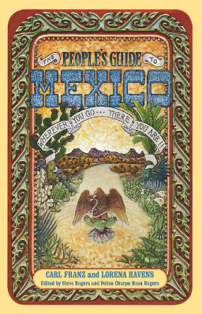

# Lab Section Guide for EarthSys144: Fundamentals of GIScience

## *(a.k.a. Everything Is Somewhere, and That Somewhere Matters)*

This GitHub repository is the Lab Section Guide for **EarthSys144: Fundamentals of GIScience**, updated for **Spring 2026**.

You can read it as a GitHub Book here: [https://mapninja.github.io/Earthsys144/](https://mapninja.github.io/Earthsys144/)

The course Canvas site is accessible with SUNetID here: [https://canvas.stanford.edu/courses/224871](https://canvas.stanford.edu/courses/224871)

Hi there, my name is Stace, and I do _Spatial Ed_. I teach **EarthSys144: Fundamentals of GIScience** because I believe something simple but powerful:

### **Everything is somewhere, and that somewhere matters.**

That’s **Stace’s First Law of Geography**—my own humble remix of Waldo Tobler’s First Law of Geography:

### *“Everything is related to everything else, but near things are more related than distant things.”*

Together, these two ideas are the foundation of everything in this course. They’re why I think **spatial data is for everyone**, not just city planners, government agencies, or PhD cartographers.

Because once you understand that *everything happens somewhere* — your favorite band’s tour stops, your city’s housing crisis, your cousin’s avocado farm in Michoacán — you start to see that geography isn’t just maps and coordinates. It’s *how the world works*. And it’s why learning how to *work with spatial data* gives you a new kind of superpower: the ability to understand and influence the “where” in everything.

---

### Who This Course Is For

You don’t need to be trying to map cholera outbreaks in Haiti (though you might be). Maybe you're trying to show the economic impact of Taylor Swift's next tour—how cities benefit, who gets left out, or where ticket prices spike. Maybe you're working on mutual aid distribution in your neighborhood, or tracking deforestation, or analyzing delivery routes for your small business.

No matter what, if your question involves the words **who, what, and when**, it probably also involves **where**. That’s where spatial data comes in. And this class is your friendly, slightly irreverent, guide to getting started.

This is a DIY course inspired by books like *The People’s Guide to Mexico* and *How to Keep Your Volkswagen Alive for the Complete Idiot*. It’s fun, practical, and focused on **getting things done with spatial data** using tools that are ***mostly* free, open source, and accessible**.

  

Because in the context of capacity building—whether you're part of a grassroots collective, a student with a tight budget, or just someone who wants to understand their world better—**free and open source tools aren’t just “good enough.” They’re *better*.**

They’re transparent. Hackable. Shareable. Built by communities and for communities.

---

### What You’ll Learn

By the end of this course, you’ll know how to:

* Understand and work with spatial data formats like GeoJSON, shapefiles, and raster imagery like TIFFs
* Use open source tools like **QGIS**, **PostGIS**, **MapLibre**, and **GeoPandas** to analyze and visualize spatial data
* Build web maps and interactive dashboards that don’t require an expensive hosting account
* Automate spatial workflows with Python and command-line tools like **GDAL**
* Find and use free, high-quality data sources
* Ask better questions about the world—because now you’ll know how to map the answers

All with real-world examples, plain-language explanations, and a few jokes to keep you awake.

---

So whether you’re mapping the spread of disease, the location of food banks, or the economic wake of Taylor's Eras Tour, this guide is for you.

Because **everything is somewhere**, and once you can *see* that somewhere — on a map, in code, in data — you can start to ask smarter questions, tell more compelling stories, and maybe even change your little corner of the world.

Let’s get to it.
