# Week 7: Raster Analyses

**_What You'll Learn_:**

**Spatial analysis** and modeling with raster data. There is a mix of old and new functions used in this lab. We'll explain the new, but you are expected to reference old labs as needed. You should read chapter 10 in the **GIS Fundamentals,** textbook before performing this lab.

## Install WhiteBoxGAT  

**You will use QGIS to produce the final maps (PDFs) but will use Whitebox GAT for the analysis.   This is because Whitebox GAT is currently much better than QGIS for terrain and watershed analysis functions**. **_There is a broader range of functions, clearer documentation, and the functions more often return the intended result_**.

Whitebox is free and open source, and although many of the functions are available in QGIS, as we have seen in QGIS many are works in progress, and somewhat problematic in application.  

You will need to update your Java to version as required when you first attempt to install Whitbox GAT. They provide a link, or you may search for Java updates in your browser, and then pick the appropriate operating system for the latest version on the Java site, https://java.com/en/download/. Whitebox GAT software is available from:  [http://www.uoguelph.ca/~hydrogeo/Whitebox/download.shtml](http://www.uoguelph.ca/~hydrogeo/Whitebox/download.shtml)

**_Data_** are located in the L10.zip file, including:

1. **Valley3** and ****Valley9****, which are three and 9 meter DEMS of a portion of southeastern Minnesota;
2. **mar_rd83.shp,** a vector road layer, and
3. **mardem**, a 30 meter resolution raster elevation grid; and
4. **Shasta**, a 30m DEM in northern California.

All data are in **NAD83 UTM coordinates, Z units in meters**, the **Minnesota files in zone 15, and the California files in zone 11**.

**_What You'll Do_**: You'll learn basic raster map algebra, while merging the multi-resolution **Minnesota DEM**s, removing high-frequency noise from the Shasta DEM, and calculating a cost surface with a threshold.

### WhiteboxGAT provides two way to access the standard Map Algebra tools:

## Project 1: Resampling & Merging
1. If you haven't, open the WhiteboxGAT application by browsing to the folder you unzipped the app to, and right-click Open.

2. **Click** on the load layers button 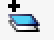 and browse to load the two raster layers **valley3.tif** and **valley9**.tif into a new project. You will be prompted about importing to the WhiteBoxGAT format, which is fine.


Your data should appear similar to the above, with the **higher resolution valley3** raster in the valley across the bottom center, and the coarser resolution **valley9** data set over the entire area.

3. Switch to the **Layers** view by clicking on the word layers at teh top of the tools panel on the left, and Toggle the two data sets on and off to view their extent.

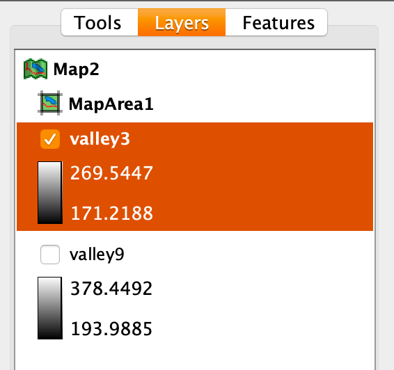  

4. Toggle off the **valley9** data so that it does not display, you should see a form something like a snake's head facing **towards** the left.


5. Move your cursor over the elevation data, and note that at the bottom of the software, there is a bar that displays the location and value of the pixel you are hovering over.


6. Notice that if you hover off the snake's head, in the background, the reported value is **NoData**.

7. Return to the **Tools Panel**, and **Create an hillshade** for both data sets using the **Hillshade** tool. You can find it under **Terrain Analysis>Surface Derivatives>Hillshade**, or you can searcch for it using the Search box at the bottom of the Tools Panel


8. Return to the Layers Panel, and note that you can highlight a layer, and use the Raise & Lower Layer buttons  to change teh order of Layers in your map.  

Finer detail in the stream bank is seen in the higher resolution valley3 hillshade.

We can use WhiteBoxGAT tools to merge these two data sets, but first we must do some pre-processing. Note that we want to use the detailed **valley3** data where we have it, and the coarser ****valley9**** data everywhere else.

## Converting NoData/NULL valaues to zeros

First, we'll substitute 0 values for No Data values in the Valley3 data set. Recall that most raster operations return **NoData** as cell output when any input cell is **NoData**. **Valley3** has **NoData** values over most of its area, so combining it with **Valley9** requires we change **No Data** to **something else.**

1. Return to the Tools panel and search for 'nodata'
2. Use the C**onvert NoData to zero tool** to create a new version ov valley3, without NoData values.


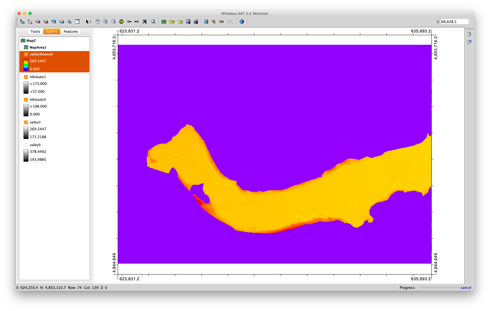

You should end up with something similar to the above, though your colors may differ. The important thing to note is that the background (here purple) that use to be NoData values, is now **Zeros**, and so is no longer transparent.

## Resampling

1. Use the New Raster From Base tool to create an empty raster dataset with the same dimensions as **valley3**
2. Change the constant value to 1
3. Save  as  **valley9_3m**

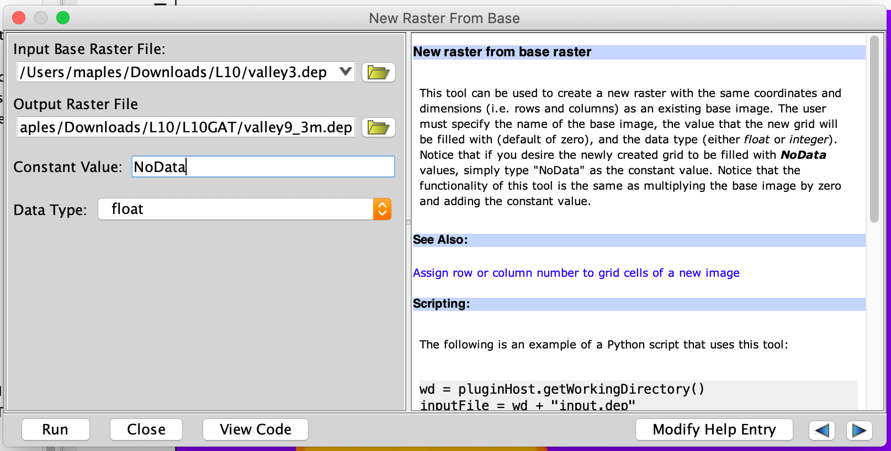

Note that the result is not added to the map, automatically.

4. Use the Resample tool to resample the elevation values from your valley9 DEM into  the **valley9_3m raster**, you just created.
5. Browse to select your  **valley9.dep** **file** as the **Input Raster file**
6. Browse and select your **valley9_3m.dep**, produced in the previous step, as the **Destination Raster File**.

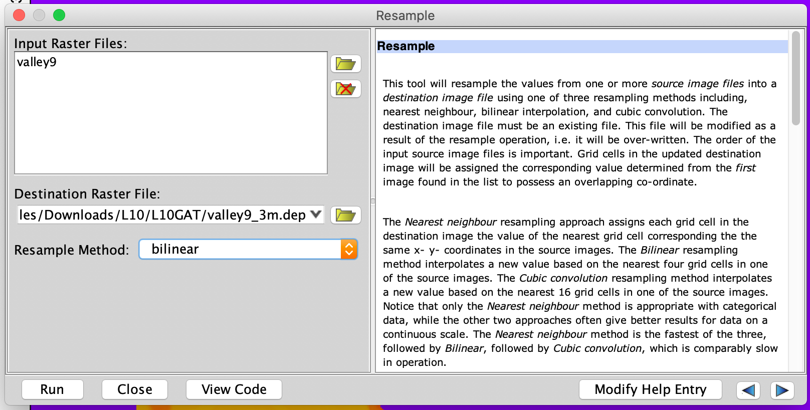

This tool takes the values of the **valley9** raster cell centers and resamples them using the **Cubic Convolution method**, replacing the values in our **Destination** raster.


7. right-click on the new valley9_3m layer in the Layers panel and select **Layer Display Properties**


8. Now, click on the **File** button at the top, to inspect the metadata for the layer, and insure that  the **Cell Size X & Y** are **both** **= 3.0**


##  Merging Rasters

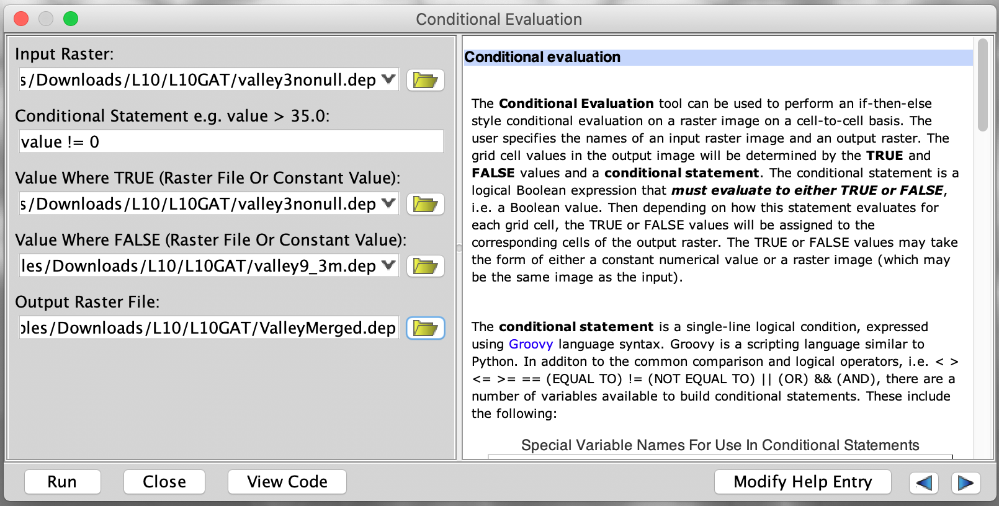

1. Search for the **Conditional Evaluation tool** and set the Input Raster as valley3nonull
2. Use the following as your Condtional Statement:

     ```value != 0```
3. Value where TRUE: **valley3nonull**
4. Value where FALSE: **valley9_3m**

   This tool will choose between the  two datasets, for the output, using the following logic:

   "If the value of **valley3nonull** is _**not equal to zero**_, keep the value of **valley3nonull**, but if it **_IS zero_**, use the value of **valley9_3m** "

1. **Calculate a hillshade** of the output DEM, and verifying the better detail in the valley bottom.
2. Go into the Layer Display Panel fo the **ValleyMerged** layer (the merged elevation model) and set the **ValleyMergeHill** that you just created as the **Hillshade Source** and experiment with the following settings until you have something you like:


You should have something that looks like the image here, with the higher detail in the valley bottom, and the lower detail in the uplands. You may see a "seam" where the two data sets met.


## To Turn In:

1. Create a Layout, using the **Map Properties panel**, which can be found under **View>Map Properties**, to add cartographic elements to the layout.
2. **To add cartographic elements**, **select** them in the **Map Elements** panel, on the left, and **click Add**. Experiment with the available elements, but at the very least add a **Title, Your Name, North Arrow & Scale Bar.**
3. Note that when you add a Map Element, you can select it in the **Current Map Elements** panel on the right, and alter various settings, such as font colors, etc...
4. You can use the Slect Elements tool  to select, resize, etc... your cartographic elements.


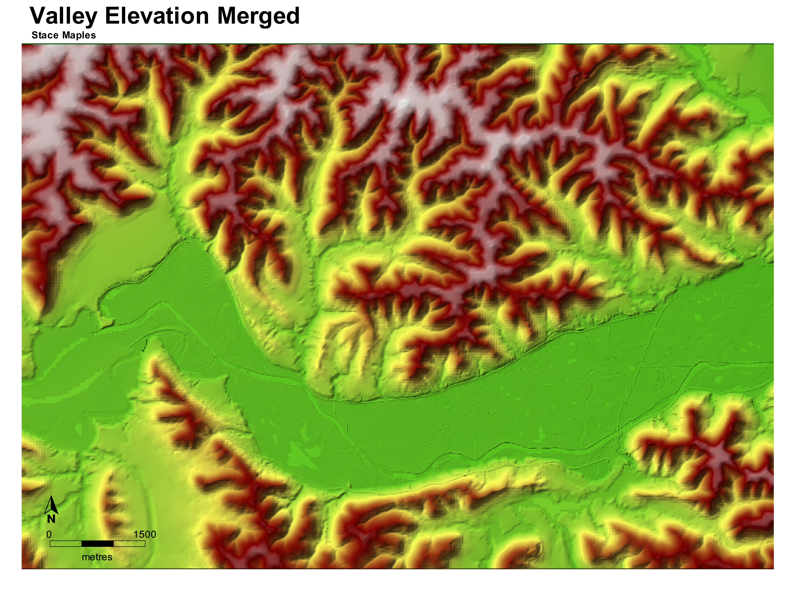


# Week 7: Terrain Analysis

**_What You’ll Learn_:** Basic terrain analysis functions, including watershed, viewshed, and profile processing.

You should read chapter 11 in the GIS Fundamentals textbook before performing this lab.

**Data** are located in the **L11.zip**

all in NAD83 UTM zone 15 coordinates, meters, including
1. Qdrift, a GeoTiff elevation, 3m cell size, Z units in meters, and
2. Qdrift30, a GeoTiff elevation grid, 30m cell size, Z units in meters
3. viewspot.shp
4. targetspot.shp
5. sight.shp
6. There are also Whitebox GAT versions of both **_Qdrif_t and _Qdrift30_** in the L11.zip  

**Background**

Elevation data, also known as terrain data, are important for many kinds of analysis, and are available in many forms and resolutions.  In the U.S. there have long been available nearly nationwide data at 30 m resolution.  Since the early 2000’s these have largely been replaced by 10 m resolution DEMs, and now many parts of the country are developing higher resolution DEMs, and 1 to 3 meters, based on LiDAR data collections.

Although the most common use of DEMs is as a shaded relief background for maps, we often are interested in working with terrain data for calculating slopes, aspects, steepness or slope along profiles, viewsheds, as well as watershed and other hydrologic functions.

## Viewshed and Profile View  

1. Start a New Map, using the New Map button 
2. Add the Qdrift.dep, viewspot.shp and the sight.shp shapefiles datasets.

This displays your view location, a single point in the bottom left portion of the **Qdrift** DEM.  This also identifies a “line of sight”, defined from the **sight.shp** **file**.  

3. Select the TOC Layers tab, right click on the sight.shp file, then click on Layer Display Properties to display a point properties menu, and alter the point size, shape, and color as you wish to make the point visible.


## Creating a terrain profile plot

4. Select the **Tools Tab**, then Search for the **Terrain Analysis>Profile tool**


5. Use **Qdrift** as the **Input DEM** and **sight.shp** as the **Input Vector**

This gives you a Profile of the elevation change along _the line of sight_.

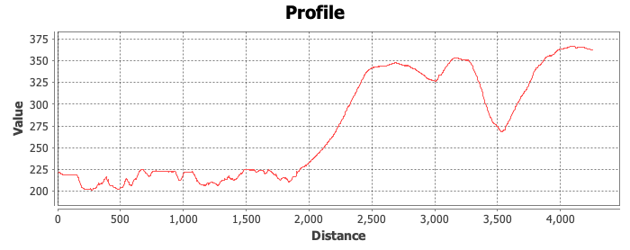

6. Right click in the Profile box and Save As _Sight_Profile.PNG_

7. Close the Profile box

## Create a Viewshed

1. **Click** on the **Tools tab** of the TOC, and **Search** for the **Viewshed tool**, which is also under **Terrain Analysis>Viewshed**

2. Specify **Qdrift** as the **Input DEM**, **viewspot** as the **Input Viewing Station File** and name the output **Visible**.  Set the **Station Height** to **1.8** (this is the height of the viewer in meters, about 5’10”).

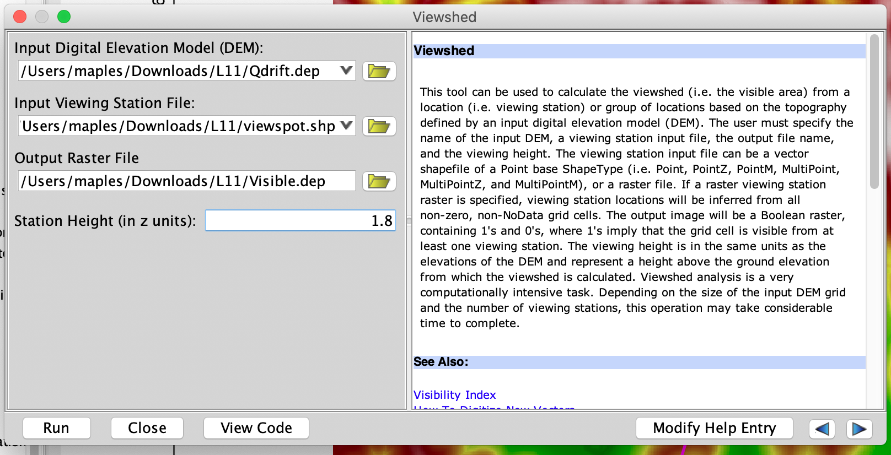

This will display something like the figure below.  We want to alter this, so that the visible areas from the point (red in the image) display on top of the elevation layer, but the areas that aren’t visible from the viewing point are shown without an overlay.  We need to turn the purple colored areas transparent, and perhaps change the color of the red areas to a something darker


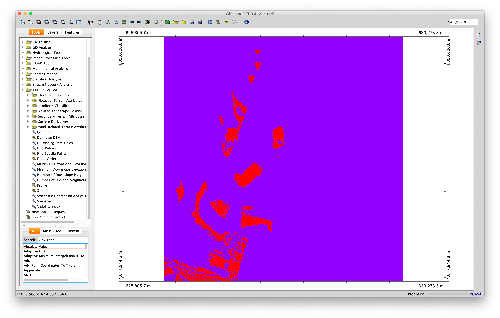


1. Click on Layers at the top of the ToC,

2. Right-click  on the **Visible** **layer** name and select **Export Layer**

3. **Change** the **Export data type** to: **SAGA Grid Files** (*.sdat)

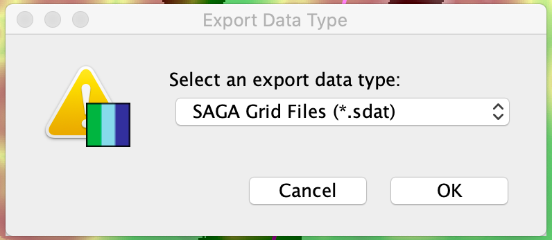

4. Click OK and the file will be saved to your current workig directory.


# Project 2: Watershed Functions
Again we’ll be using Whitebox GAT for this new project, to calculate watershed boundaries based on elevation data

1. Save and close your map above, if you haven’t done so already.  

2. Then, open a new map and add the _Qdrift.dep_ DEM.


3. Open **Tools**>**Hydrological Tools**>**DEM Pre-processing**. This should display the tools shown at the right. The yellow highlights below mark the tools we will use.


We’ll be applying them in the following order:

*   Fill Depressions
*   D8 Flow Pointer
*   D8 and Rho8 Flow Accumulation (also extracts streams)
*   Snap Pour Points (on a point feature we’ll create)
*   Watershed

## Fill

We use the fill command to fill and pits in the DEM, ass described in chapter 11 of GIS Fundamentals.  The simplest of watershed processing routines begins by simply filling the pits. More sophisticated ones may fill the pits, and “burn in” a stream line, along which the DEM is lowered after filling to maintain a downstream flow.


1. Open the **Fill Depressions tool** from the Tools panel.  Specify the **Qdrift DEM** as input, and something like **Filled** for the output name.  
2. Leave the Flat Increment Value as is and click on Run.


3. The **Filled** layer should be automatically added to your view, if not, find and load it.  

4. **Open** the **raster calculator** by clicking on the 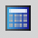 along the top of the main Whitebox Application

This should open the raster calculator tool.  You build an expression by selecting and typing into the Expression window, adding layers, numbers, and operators.

5. Subtract the Qdrift DEM from your filled_dem (see figure), using the following expression:

`[Difference]=[Qdrift]−[Filled]`

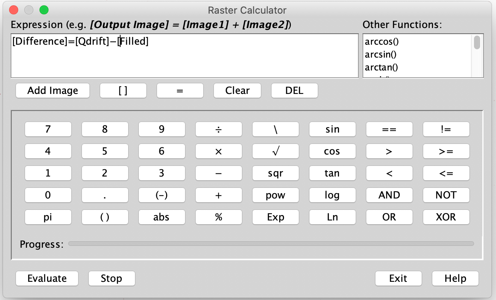

6. Exit the Raster Calculator after clicking **Evaluate**

Notice the location and range of the fills; it should look something like shown below


7. Remove the difference layer to reduce clutter.

## Flow Direction

As noted in the textbook, this flow direction layer will contain a set of numbers that define the cardinal and sub-cardinal direction.  

1. Apply the D8 flow Pointer, found in the TOC Tools tab, under **Hydrologic Tools>Flow Pointers**.
2. Use the **Filled** DEM as your input, and specifying a flow direction output data layer; name the output something like **FlowDir**.  

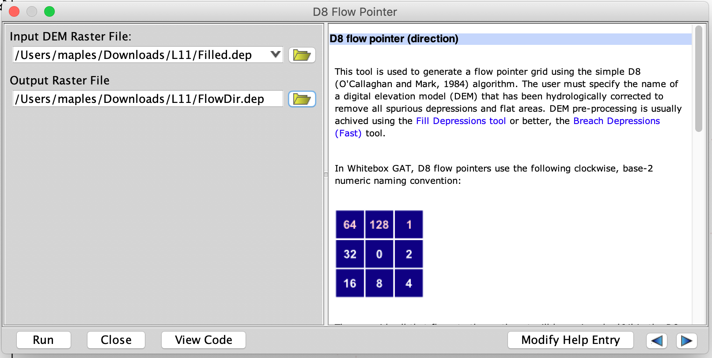

Your output from the flow direction tool should look something like the figure below, and the **symbols should show 8 values from 1 to 128**, corresponding to flow direction.

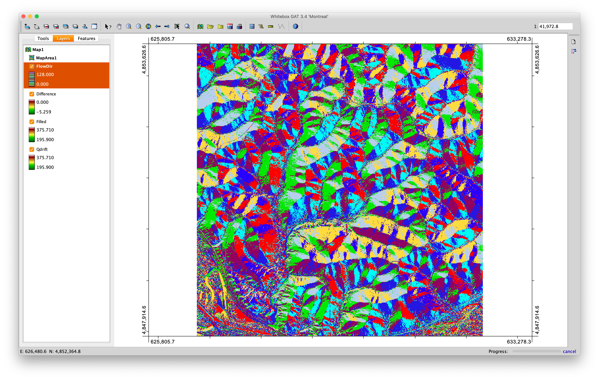

## Flow Accumulation  

Flow accumulation finds the highest points, and accumulates the area (or number of cells) downhill, according to the flow direction. We may use this flow accumulation grid to approximate where streams will be found on the surface, and to determine outlet points for watersheds.  

3. Now apply the **D8 and Rho8** **Flow Accumulation**, found in the **Hydrological Tools>Flow Accumulation** folder.  

4. Specify the **input** as **FlowDir**, name the output raster as FlowAccum and select “number of upslope grid cells” as the Output Type.

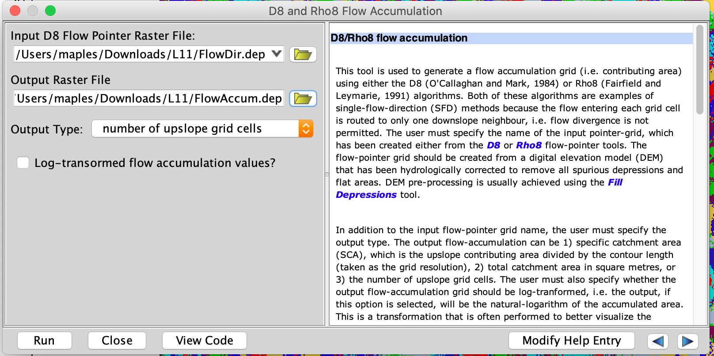

This should generate a display similar to the graphic below. If you look closely, you will see some narrow, perhaps intermittent white lines in a dark background.


## Reclassification

Notice the maximum and minimum value for the data layer, they will be something like 1.63 * 10^6 and 1. These numbers are the number of cells that drain to any given cell.  Since these cells are 3 m by 3 m, each cell counts for 9 square meters, and there are about 111,000 cells per square kilometer.

In any given small region and geology, there is usually a rough correspondence between drainage area, here measured with flow accumulation, and stream occurrence.  For example, in this region, once a drainage area of 0.45 square kilometers is reached, a stream is usually found.  This would be about 50,000 cells.  

So if we symbolize the flow accumulation layer so all cells above 50,000 are blue, and all equal or below this count are no data or no color, we will get an approximate idea of where the streams will be found (this threshold is made up for this exercise, but is probably not too far off). You may apply the symbolization by reclassifying the flow accumulation layer into two classes, setting the middle threshold to 50,000 and the upper threshold to the maximum value.  

1.   Use TOC Tools, **GIS Analysis>Reclass Tools>Reclass**, to reclass your flow accumulation layer into cells likely in streams, and those not.

2.   Select the **FlowAccum** as the input and **Streams** as the output file.

3.   Enter the table values as shown below:


_If you get “out of memory” errors, save work, reboot computer, only start Whitebox GAT and try again. If you still have problems use Tools>Stream Network Analysis>Extract Streams._  

4. Toggle off the visibility of all  other  layers and your **Streams** should appear as shown below.  Dark cells have drainage of more than 50,000 cells, and likely show streams.

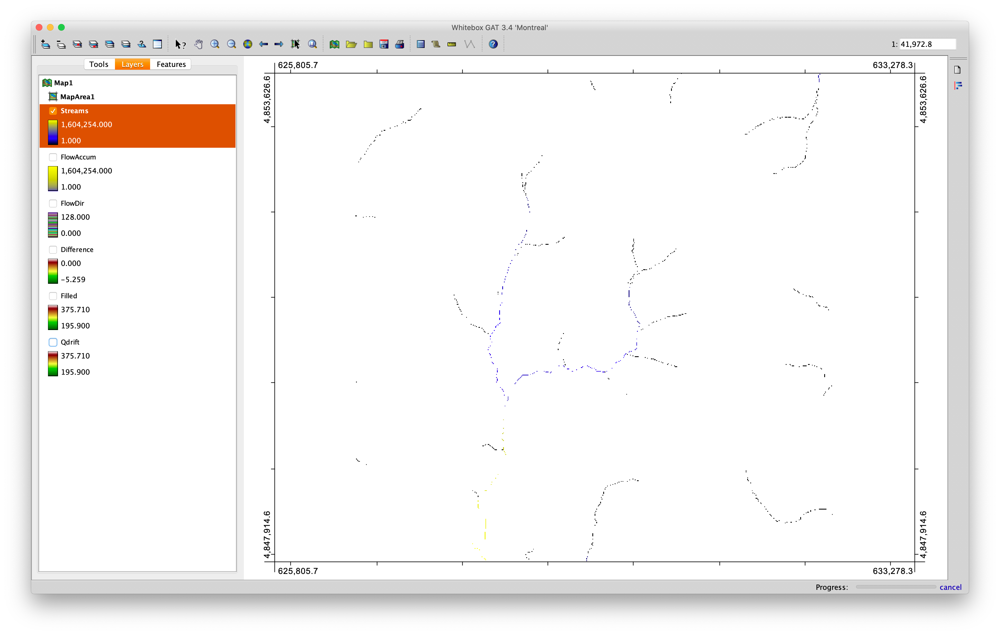

## Identifying Outlet point for the Watershed

We do this reclassification to assist in locating the outlet point.  We need to ensure that the outlet point is directly on a stream cell. We must create a pourpoint, the location on a stream at the base of a watershed.  

Start by creating an empty point shapefile:

1. Use the TOC Tools tab, then File Utilities>Create New Shapefile to make a new, empty shapefile.   Name the file outlet.shp, and add it to your Map if it isn't added automatically.


2. Use the Arrange the **Streams** layer in the TOC until it is visible and just below the **Outlet.shp**, using the **Raise/Lower Layer** tools 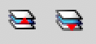

3. Zoom to the lower southwest quadrant of the screen and find the area shown in the image at right (there will be no green dot, navigate by the stream shapes).

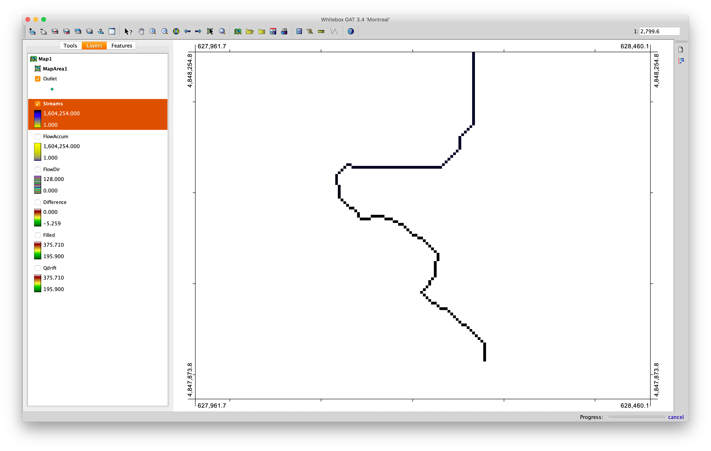

You must digitize a watershed outlet point (near the green point shown).

4. Make the outlet.shp active (select it in the Layers TOC) and

5. Click Digitize New Feature tool  on the main Whitebox toolbar. If you don't see it, click on the Edit Vectors button  to toggle editing for the selected layer

6. CLick OK in the resulting FID Popup, then click on the stream, where shown, belo to digitize your outlet.  You may find it necessary to zoom in to the desired location for an outlet on the DEM/thresholded flow accumulation layer, close enough so you can identify individual cells, and add an outlet point at the location described above.

7. Toggle editing off with the Edit Vectors button , then right-click on outlets.shp in the TOC, left click on View Attribute Table, and verify the outlet point has been added.

# Snap the Pour Point

1. Open the Tools tab in the TOC, and then select **Hydrological Tools>Watershed Tools->Snap Pour Points**.  
1. Specify **Outlet.shp** as your Input Outlets File,
2. Use **FlowAccum** as the **Flow Accumulation Raster**
3. A new **output shp** to contain your  pour point, name it **PourPoint**.
4.Use a Snap distance of 9 (about 3 cells).
5. Select Run

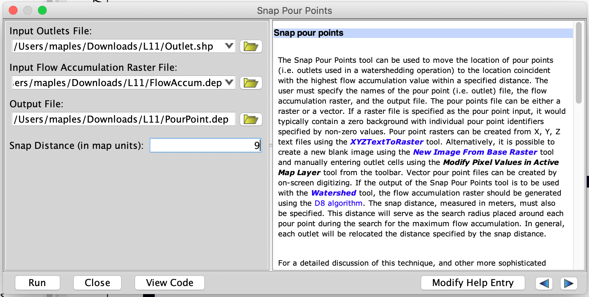Â

This should create a shapefile with a single point, near your digitized outlet.

1. Open **Hydrological Tools>Watershed Tools>Watershed**, with the appropriate D8 flow Pointer Raster (**FlowDir**), the  pour point layer you just created, (**PourPoint.shp**), and picking an appropriate name for your output watershed.

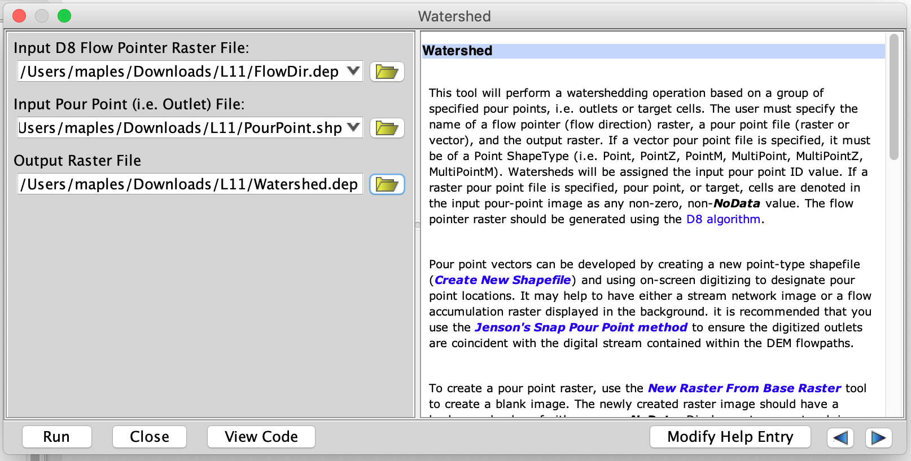

This should create a watershed layer something like that below.  


1. Change the color, and made the watershed raster 50% transparent.

## Raster to Vector

1. Open the TOC Tools, **Conversion Tools>Raster/Vector Conversions>Raster Streams to Vector**.

2. Name the output something like **StreamNet**


Since the Watershed layer is in WhiteBoxGAT's data format, *.dep, it is necessary to export to a format that QGIS can use.

1. Right-click on the Watershed Layer, in the ToC and select Export Layer.
2. Export the image as a **Saga Grid File (*.sdat)**


# To Turn In

Now, move to **QGIS**, and create a layout displaying:

- Qdrift DEM & Hillshade (remember the 50% transparency, trick)
- Watershed,
- Outlet.shp
- Streamnet.shp
- Viewspot.shp
- Sight.shp
- Visible (From the visibility exercise, using Paletted/Unique values using the remove tool to get rid of  0 values)
- Elevation Profile added as an image to the layout

Use all the usual expected cartographic elements, and creativity.  
Print as a .pdf.

If you have trouble with your shapfiles not having valid projections, you can simply Define the projection in the Layer Properties, in QGIS, when you import them. Use EPSG:26915, which is the CRS of the original Qdrift DEM file.


