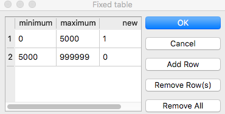

# Week 6 Lab: Buffering and Overlay in QGIS

**What You'll Learn:** to apply the concepts of buffering and overlay, two common cartographic operations. You should read the sections on buffering and overlay in Chapter 9 in the GIS Fundamentals textbook. You can find Bolstad's videos for the labs, here:

[Chapter 9 QGIS Lab playlist](https://www.youtube.com/playlist?list=PL1JFwtT2Vr4Y14I1-kTiBTl_RcfcDlKOw)

**_It is HIGHLY RECOMMENDED, particularly if you are using a Mac, that you download and install the latest Nightly Build of QGIS, which is at 3.16, now. Many of the Raster Tools, particularly those that leverage GRASS, GDAL and SAGA toolsets, are not working properly in the current PR and LTR versions, available on the main page. You can download the currently Nightly Build, for Mac, here:_**

**_<https://qgis.org/downloads/macos/qgis-macos-nightly.dmg>_**

**Data**: All data are in L9.zip file, including:

- lakes.shp
- roads.shp
- public_Hugo.shp

**What You'll Produce:**

Two maps, of

1. lake and Road buffers
2. suitable recreation areas on private land.

## Exercise 1: Buffering in QGIS

1. Create a new QGIS project and add the roads.shp data layer.
2. Left click Vector on the top toolbar and then Geoprocessing Tools -> Buffer**.** (Video: Buffer)

There are options to specify the input feature layer, the buffer distance and units, and the output.

1. Specify "Dissolve results" because otherwise the tool generates multiple, overlapping polygons.
2. Use the parameters shown at left and add the result to your project when finished.

The buffer layer should look something like that on the right, here re-arranged to show the roads on top, and the buffer in purple below.

1. Redo this buffer, but this time; _leave the default **Dissolve buffer results** UNCHECKED_. Make sure to open and view the attribute table associated with each buffer layer.

How do the results differ?

When would this be important?

After inspecting, remove the undissolved layer.

## Creating a Variable Distance Buffer

The second exercise will buffer the _Lakes.shp_ layer using a variable distance buffer (Video: [Variable Distance Buffer](https://youtu.be/ttrryGSjENA)).

The buffer distances are:

- A buffer distance of 50 meters for lakes with size class 1
- A buffer distance of 150 meters for lakes with size class 2
- A buffer distance of 500 meters for lakes with size class 3

There are three main steps:

1. Open the **lakes** attribute table and **insert a field** to hold the variable buffer distance.
2. **Select by Attributes** and use the Field Calculator to assign distance values for the variable buffer distance to groups of features, by size class.
3. Apply the buffer operation.

For this exercise, specifically you should:

1. Make sure the **_Lakes.shp_** is in your project, and **open its attribute table**. You may manually select by sorting/shift clicking, or by using a selection by attributes to select the lakes with **size class 1**.
2. **Toggle Edit, and use the Field Calculator** to create a new whole number (integer) field named something like **buffdist**, with a **value** of **50**. \ Make sure that you have the option checked for only updating selected features, near the upper left of the tool. Apply the calculation.
3. **Select** those features with **Size_CLS of 2**, and use the **Field Calculator** to **_Update an Existing Field_**, assigning 150 to the buffdist variable.
4. **Repeat** the select/assign process **for lakes with Size_CLS 3**, assigning a **buffdist of 500.**
5. --------------------------------------------------------------------------------

  Unselect any selected polygons

  or the buffer will only be applied to those selected_** (e.g., before switching out of the table, click on the Unselect all to clear the selected features. If you forget here, you can unselect from the main QGIS menu).

6. Save your edits and toggle off editing mode.

Check that your table is correct, e.g., similar to the example figure at right. Note that the last two columns, SIZE_CLS and buffdist, should change in concert, with a larger buffer distance appearing for larger size classes.

Now you should be ready to create the variable distance buffer

1. Use the same buffer tool as we introduced previously (Vector->Geoprocessing->Buffer).
2. Specify the same input data layer as before, **Lakes.shp**, and also make sure to **click the check box to Dissolve the result** (figure below).
3. We specify a variable distance buffer through an option box, accessed by clicking on a **small box at the far right of the distance/units option** (see arrow below).

This allows us to open a sequence of dropdowns:

1. Choose **Field type: int, double, string...** , and then buffdist as the variable that contains the buffer distance (see figure below).
2. specify an output, something like **VarBuffLakes**, and run the tool.

This should create a layer similar to that at right. Note the buffers are larger for the larger lakes, as per our specified buffer distance variable.

Arrange the roads, dissolved fixed distance road buffer, lakes, and variable distance lake buffer layers so that you can see all three, as in the figure below.

## To Turn In:

Create and export a layout with the roads, lakes, and their buffers, as in the view shown here.

Make sure the order is as shown here, so you may see most of each layer. The order is, from the top: 1) roads, 2) road buffer, 3) lakes, 4) lake buffer.

label each layer with descriptive text in the TOC/legend, and be sure to include a scale bar, north arrow, title and your name.

&gt;&gt;&gt;&gt;&gt;  gd2md-html alert: inline image link here (to images/image1.png). Store image on your image server and adjust path/filename/extension if necessary. 

 
([Back to top](#))([Next alert](#gdcalert2)) 

&gt;&gt;&gt;&gt;&gt; 

# #

## Part Two: Overlay Analysis in QGIS

Our goal in this exercise is to find potential campgrounds for a State Park. A campground needs to be close to lakes, but these will be drive-in sites that must also be close roads. The final map will show locations that are both within 50, 150 or 500 meters of a lake (depending on the size of the lake) and within 300 meters of a road.

You have already created your starting layers. These are the variable distance lakes buffer and the fixed distance roads buffer from the previous exercises.

We need to modify input layers prior to overlay so that we may easily interpret the results after overlay.

First, we must turn the buffer output to single part features. Buffer returns multipart features, which means there may be multiple polygons for a single row.

1. Open the attribute table for **VarBuffLake**, you should see just one row, while the layer obviously has many polygons.
2. To convert this multipart layer to single parts, use **Vector->Geometry Tools-> Multipart to Singleparts**, naming the output something useful, like: **SingleLakeBuffers**
3. After running the tool, **open the attribute table** for the output. Note that there are now multiple entries, one for each polygon.

Also note that the buffdist is now wrong, it has a value of 50 for all the polygons (or perhaps one of the other values, 150 or 500 is repeated, the one it saves appears somewhat random), even though the medium and large sized lakes had different buffer distances. Since the columns we have in this layer aren't useful, it's helpful to delete them:

1. Open the attribute table of the SingleLakeBuffers layer, toggle editing and click on the delete field

&gt;&gt;&gt;&gt;&gt;  gd2md-html alert: inline image link here (to images/image2.png). Store image on your image server and adjust path/filename/extension if necessary. 

 
([Back to top](#))([Next alert](#gdcalert3)) 

&gt;&gt;&gt;&gt;&gt; 

 tool. \ \

1. Select all of the fields and click OK to delete them (it's OK, don't be nervous! They aren't useful!). \ \ \

2. Now, create a new column called **inlakebuff** in the **SingleLakeBuffers** table, with a **value of 1** for all the lake buffer polygons, using the **Field Calculator**. \ \

3. Repeat the same steps for the **road buffer layer**:

  1. Convert to SinglePart features,
  2. Clean the attribute table, deleting all the current fields
  3. Add a new attribute named something like **inroadbuff**, and assign it a value of 1 to indicate it is inside the road buffer.

4. Remember to **save and toggle off editing** for each layer when complete.

Before we overlay the two layers with the "**Union**" command, we need one more preparation step.

The lake buffers layer we created has buffered areas that include the lake as well as the land near shore. Campsites will be on dry ground, so we will use the **_Difference_** tool to remove the lake from the lake buffer layer.

1. Open the **Vector>Geoprocessing Tools> Difference \**
2. Specify Input Vector Layer as the **SingleLakeBuffers** \

3. Specify the Difference Layer as the **lakes** layer \

4. Set the output destination to something like **LakeBuffersOnly.shp** \

5. Run

Display the output and verify that the results are the lakes buffer layer with the lakes area removed:

&gt;&gt;&gt;&gt;&gt;  gd2md-html alert: inline image link here (to images/image3.png). Store image on your image server and adjust path/filename/extension if necessary. 

 
([Back to top](#))([Next alert](#gdcalert4)) 

&gt;&gt;&gt;&gt;&gt; 

Now to overlay the two buffer layers, using the Union command (Video: Union).

Â

1. Select **Vector>GeoprocessingTools>Union \**
2. Specify the input layers – **LakesBuffersOnly** and **SingleRoadBuffers** \

3. Specify the output layer something like **BufferUnion**, and **Run**.

4. Open the attribute table and examine the new "**unioned**" layer. \

5. Scroll down the table and find a record for which **inlakebuff** and **inroadbuff** are **both =1**. \

6. Click on the Numbered Square to the left of the record to Select it, \

7. Use the Zoom to Selected tool

&gt;&gt;&gt;&gt;&gt;  gd2md-html alert: inline image link here (to images/image4.png). Store image on your image server and adjust path/filename/extension if necessary. 

 
([Back to top](#))([Next alert](#gdcalert5)) 

&gt;&gt;&gt;&gt;&gt; 

 to highlight that polygon. \ \ Move or close the attribute table to view the selected polygon.

The selected polygon meets both the road proximity and lake proximity criteria.

Note that there also appear to be multiple, distinct polygons linked to this row.

QGIS groups polygons in the data files when performing analysis. When we are finished with our analysis we will "ungroup" polygons in the file, creating a table row for each polygon.

1. Return to the attribute table of **BufferUnion** \

2. Use the **Select features using an expression tool**

&gt;&gt;&gt;&gt;&gt;  gd2md-html alert: inline image link here (to images/image5.png). Store image on your image server and adjust path/filename/extension if necessary. 

 
([Back to top](#))([Next alert](#gdcalert6)) 

&gt;&gt;&gt;&gt;&gt; 

 to create an expression that selects the features that have a value of 1 for both the inlakebuff and inroadbuff columns: \ \ `"inlakebuff" = 1 AND "inroadbuff" = 1`

This should yield the selection on the right. (HINT: right-click and Zoom to Layer to see the whole layer selection)

Upon visual inspection, these are the polygons within both the road and lake buffers.

&gt;&gt;&gt;&gt;&gt;  gd2md-html alert: inline image link here (to images/image6.png). Store image on your image server and adjust path/filename/extension if necessary. 

 
([Back to top](#))([Next alert](#gdcalert7)) 

&gt;&gt;&gt;&gt;&gt; 

\

1. With the selection still active, right click on the **BufferUnion**, then \

2. **Export>Save Selected features...** as something appropriate, like **Candidates.shp,** and verifying that the option to **Save only selected features** is checked.

  \ \

\ \ \ Display the data and verify that you have something like the following:

&gt;&gt;&gt;&gt;&gt;  gd2md-html alert: inline image link here (to images/image7.png). Store image on your image server and adjust path/filename/extension if necessary. 

 
([Back to top](#))([Next alert](#gdcalert8)) 

&gt;&gt;&gt;&gt;&gt; 

1. Use the manual selection tool ,

&gt;&gt;&gt;&gt;&gt;  gd2md-html alert: inline image link here (to images/image8.png). Store image on your image server and adjust path/filename/extension if necessary. 

 
([Back to top](#))([Next alert](#gdcalert9)) 

&gt;&gt;&gt;&gt;&gt; 

 and verify that some of these are still multipart, by clicking on a few polygons. Be sure to clear your selection.

We have one final criteria to meet, that these campgrounds be on private land.

1. Add the **Public.shp layer** to your project. \

2. Use the Difference tool, as above, to create a new layer called FinalCandidates that excludes all **Public.shp** features.

The westernmost lakes should look like the figure here, with the public bits carved out of the lower lake:

## To Turn In:

Create a Layout that includes:

- roads,
- lakes, and
- lands suitable for campgrounds on private land

Label each layer with descriptive text in the legend, and include a scale bar, north arrow, title and name.

&gt;&gt;&gt;&gt;&gt;  gd2md-html alert: inline image link here (to images/image9.png). Store image on your image server and adjust path/filename/extension if necessary. 

 
([Back to top](#))([Next alert](#gdcalert10)) 

&gt;&gt;&gt;&gt;&gt; 

(HINT: I played with the "**Layer Rendering** for the Final Candidate layer, using **Difference** and then an **Inner Glow** from the **Draw Effects** option, at the bottom of the layer styling panel.
