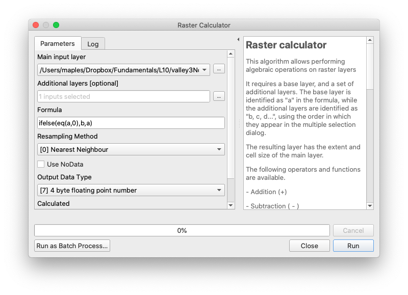
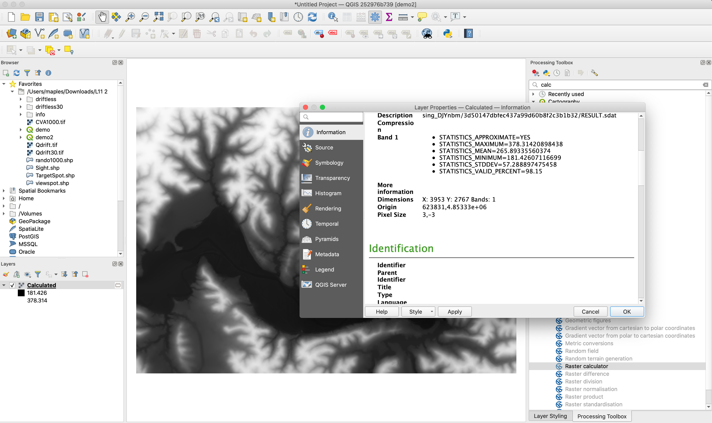
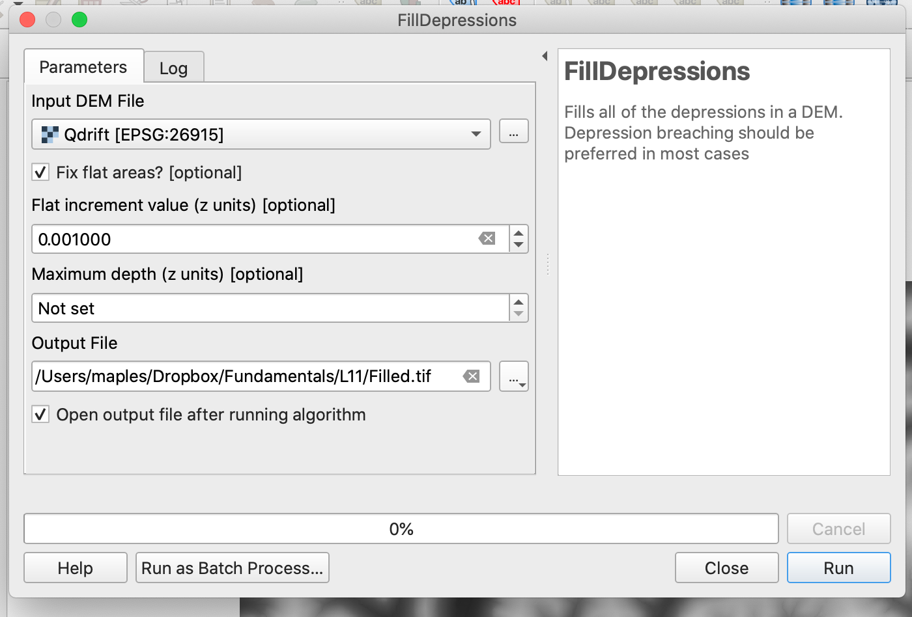
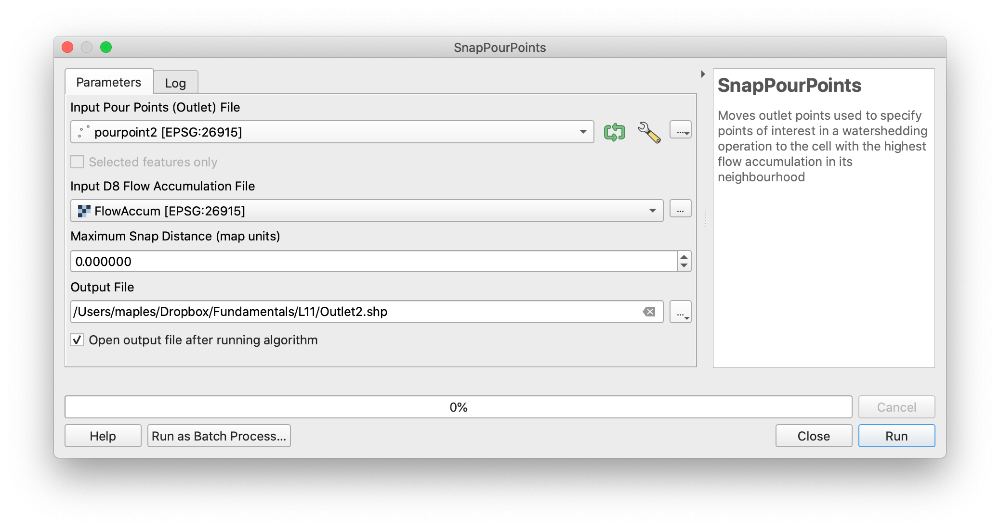
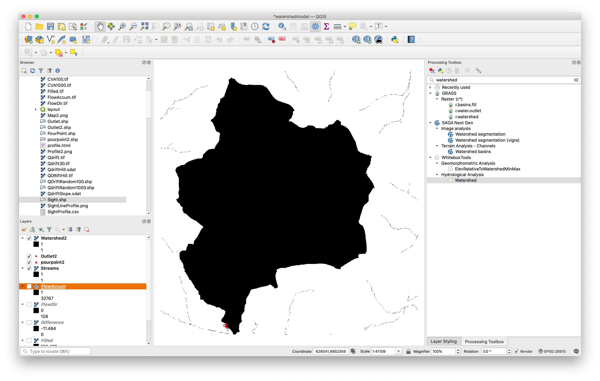
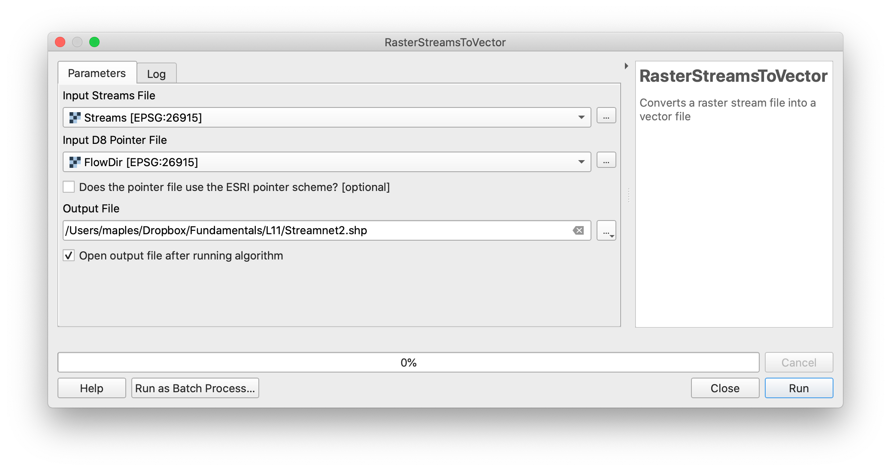

# Week 7 Lab Alternative Workflows with WBT in QGIS

First, see if you can get WhiteboxGAT to work using the instructions, here:
https://github.com/mapninja/Earthsys144/blob/master/TroubleshootingWBG.md

### If you can't get WhiteboxGAT to run on your computer

All of this is done with QGIS PR 3.16, using WhiteboxTools, through the plugin, as noted, here:

https://github.com/mapninja/Earthsys144/blob/master/CleanQGISInstallationforMac.md

## Resampling

1. Convert NoData to Zero > valley3nonull
2. Resample Tool input = valley9, Base raster = valley3nonull, Output =   valley9_3m
3. For the Conditional Use the **Processing Toolbox>SAGA>Raster Calculus>Raster calculator**

1. The main input layer is **valley3nonull**. This is the higher resolution data layer, with zeros substituted for the nulls in the missing area you created. It is associated with the value a in the formula.
2. The Additional layers option is opened by clicking the right side button (arrow 2), which opens a Multiple selection window.
3. Click the checkbox for the layer **valley9_3m** in this window (arrow 3).  This **Valley9_3m** layer is **_the resampled 9m to 3m data set_**, and since it is specified second, it is associated with b in our formula.
4. Our formula:

`ifelse(eq(a,0),b,a)`

uses a comparison/assignment, which read as:

`“If layer a is equal to 0, use layer b, else use layer a”`

Here we have only two files, so we can only enter a and/or b for files in our formula. **ifelse** is the SAGA version of the **CON** function, described in the chapter 10 of the GIS Fundamentals textbook. Refer to that book for an explanation of the conditional function.

The resulting layer should have 3m  cellsize, and  values from both datasets. This is easier to see, once you have created an Hillshade.

## Profile

The Profile tool outputs an HTML file, which will open in your browser. Take a screenshot to use for your final layout.

## Viewshed

This should be essentially the same. For some reason WBT doesn't like the shp file provided in the original datasets. use this one https://canvas.stanford.edu/files/6807609/download?download_frd=1, instead of the included viewspot.shp

##  Watershed modeling

1. FillDepressions tool > Filled

### Difference
2. Use the Raster>Raster calculator to find the difference between Filled and QDrift

### Flow Direction

3. Use D8Pointer

### Flow Accumulation

4. Use D8FlowAccumulation

### Reclass

1. Use Reclassify by Table from QGIS tools
2. Note the different value ranges for this version, in the image, below.

### Create Pour Point

1. Use Layer>Create Layer>New Shapefile to create a new point file EPSG:26915
2. Toggle editing, place the point as shown, and toggle editing off

3. Use SnapPourPoints

### Delineate Watershed

1. Use Watershed

### Convert Streams to Vector

1. Use RasterStreamsToVector

## The rest should be essentially the same.
