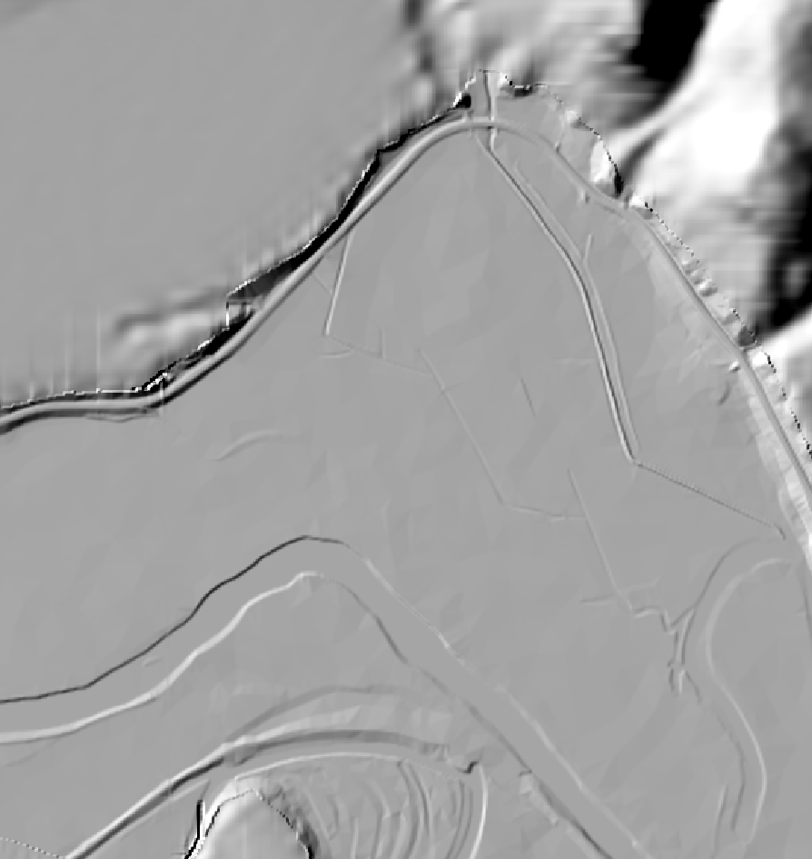

# Week 6 Lab - Sampling and Interpolation

**_What You'll Learn_**:

-Systematic and random sampling -Stratified sampling

-Majority filtering -Basic interpolation methods

You will also begin working more with Raster data in this exercise. In previous exercises you have USED raster data, but here, you will begin CREATING raster data, specifically from vector data, using _interpolation methods._

**_It is HIGHLY RECOMMENDED, particularly if you are using a Mac, that you download and install the latest Nightly Build of QGIS, which is at 3.16, now. Many of the Raster Tools, particularly those that leverage GRASS, GDAL and SAGA toolsets, are not working properly in the current PR and LTR versions, available on the main page. You can download the currently Nightly Build, for Mac, here:_**

**_<https://qgis.org/downloads/macos/qgis-macos-nightly.dmg>_**

**Data** for the exercise are in the L12.zip file.

**Background:** The ideas behind covered in Chapter12 (Spatial Estimation) and 10 (Raster Analysis) of the GIS Fundamentals textbook.

**Sampling and Interpolation in QGIS**

We'll practice the mechanics of creating sample points in QGIS, and use them to extract data from a DEM, and practice interpolation. We'll then compare the interpolated surface to the original DEM to calculate an error surface, and extract error statistics from a different set of sample points from the same DEM.

We'll apply both systematic and random sampling. We'll also develop and apply a stratification layer, because sometimes you want to stratify your sample, which means you wish to increase sample density in some portion of your area, using a map of zones, or strata.

1. Start QGIS, add the DEM from southeast Arizona, _ChirDEM_, and \

2. Apply a color scheme to highlight topography in the DEM. Note the variation in topography, where there is a significant amount of change, where there is little change. \

3. Open the **Processing>Toolbox** \

4. Search for 'Hillshade' \

5. Use the **Raster** **Terrain Analysis**>**Hillshade tool** to **create a hillshade:**

  1. Use a solar altitude of 25 degrees. \

  2. Browse and Name the Output **Hillshade \**

  3. When finished, make the hillshade 50% transparent, 

    <span style="text-decoration:underline;">on top</span>

     of the DEM.

## Keeping Organized

To keep your work organized, group your data layers within the Layers panel. There will be four (4) parts of the lab. Each will involve a related set of data layers. You can group layers within the Layers Panel to improve organization.

1. **_Select both the DEM and hillshade in the TOC_** (shift-click (PC) or cmd-click (Mac), **_then right click_**, and finally **_click on "Group Selected" in the dropdown_**. \

2. **Rename** this **Group: Original**

Group the original data, and as you create layers for each of the three different interpolation methods, select appropriate layers and Group them, then right click to assign a logical group name. We suggest names of 1) Original, 2) Inverse Distance, 3) Nearest Neighbor and 4) Spline Stratified respectively.

Maps will be done in Landscape view and arrange the layers as below for your final output. You'll need to set your print canvas to landscape orientation and make sure the map images don't overlap.

--------------------------------------------------------------------------------

--------------------------------------------------------------------------------

**Systematic Sampling and IDW Interpolation**

We'll first perform a systematic (grid) sampling, and then an Inverse Distance interpolation (Video: systematic sampling and IDW).

1. Open **Vector Tools>Research Tools>Regular Points**. 9.
2. Set the **input extent** by clicking on the options button (arrow 1), and select **Calculate from layer**, using the **ChirDEM** layer. 11.
3. Set the **point spacing/count** to **1000**, and uncheck use point spacing, to specify you want point count (see at right). 13.
4. Specify an output coordinate system if it is not already set to EPSG:26912 (that of ChirDEM) \

5. Browse to save the the output as **SystematicGrid1000m.shp**

A regular grid of points should be displayed on your screen, if not, navigate to the file you created and display it.

It should look something like the figure on the right.

Next we will extract the elevation values at these points.

1. Return to the **Processing Toolbox** and use the **Raster Analysis**>**Sample raster values** tool, from the Q tools.

1. Specify:

  1. Input point feature**:SystematicGrid1000m**
  2. _Raster Layer to Sample:**ChirDEM**_
  3. Output point features:**Elevation1000mGrid**
  4. Output column prefix: **SAMPLE_**

This should generate a point layer similar the original, but with an added table column that contains the sampled elevation below each point:

Inspect the table for **_Elevation1000mGrid_** noting the attributes and their values.

Note the column with our specified prefix, **SAMPLE_1** here, is filled with **elevation values**.

## Interpolation of Sample Points (Vector to Raster Conversion)

Now, perform an Inverse Distance Weighted interpolation:

1. Return to the Processing Toolbox Panel and use the search box to find the **_Inverse distance to a Power_** tool \

2. Specify:

  1. **Point Layer:Elevation1000m** as your
  2. **Weighting Power: 2** \

  3. **Radii of search ellipse**: **1000** in both directions \

  4. **Max number of data points** to use: **12** \

  5. **Min number of data points** to use: **1 \**

  6. z value: **SAMPLE_1**
  7. We want to create ~30m raster cells, but this is actually quite clunky to control using the GRID tools from GDAL, as we are. Use the following code in the **Additional command-line parameters [optional]:**

** `\ -tye 3498779.8925000000745058 3522569.8972999998368323 -txe 658307.9677000000374392 686597.9734000000171363 -outsize 943 793` \ \ This is the XY Extents, in UTM, as well as the dimensions, in pixels, that we want our output file to have, and if you **open** the properties of the **ChirDEM** layer, you will see that it has the same dimensions. We are simply using it's values as a template. You can take a look at docs for GDAL_GRID tools, here: <https://gdal.org/programs/gdal_grid.html> \

1. Interpolated (IDW) Output: Browse to save to your project folder and name: **IDWsysP2_12** \

1. Leave the rest of the settings at default and **run** the tool

You can see the "pattern" created by the interaction between search ellipses, and the sample points.

4. Return to your **Original Group** and right-click on the **ChirDEM >Styles>Copy Style**

5. Now, right-click on your **IDWsysP2_12>Styles>Paste Style** to copy the color ramp and classification you used in your Original **ChirDEM** layer.

## Creating Contours (Raster to Vector Conversions)

1. **_Generate contours_** for the interpolated surface with the main menu bar QGIS tool **_Raster>Extraction_**>**_Contours_**. \

1. Input Layer: **IDWsysP2_12 \** 
2. **Interval: 100 (meters, since this is the CRS unit)** \

3. Contours Output: Browse and save as **IDW100mContous.shp**

2. As you did with the original **ChirDEM**, use the **Raster terrain analysis> Hillshade** to create an **IDWHillshade layer** with your **IDWsysP2_12,** using an **Azimuth of 25 \**

3. **Group** the idw, hillshade, and contours, pulling them into an IDW Group. \

4. Arrange the layers so that your Hillshade is between your **IDWsysP2_12** and **IDW100mContours layer,** similar to the image, at right: \

## Random Sampling and Nearest Neighbor Interpolation

Now we will make use of a new sampling strategy and generate a set of random sampling points:

1. _Open the **Vector Tools>Research Tools>Random Points in Extent** tool_

2. Input Extent**>...>Calculate from Layer>ChirDEM**

3. Number of Points: 1000

4. Minimum DIstance: 60 meters \

5. Maximum number of search attempts...: 200 \

6. Browse and save the Output Random Points as: **Random1000Points** \

7. Now sample the elevation values from **ChirDEM** as you did with the systematic layer, using the **_Processing Toolbox_**>**_Raster> Analysis_**>**_Sample raster values_**

8. Name the output something like **Random1000Elevation**

# #

## Nearest Neighbor Interpolation

Nearest Neighbor interpolation uses the single nearest value to calculate the value of each raster cell. This results in something a 'stepped' set of data values, where raster cells nearest a particular sample valur, all take that value. This produced something similar to the pattern we saw with the Voronoi tool.

9. Calculate and interpolation surface, this time using: **Processing toolbox>GDAL>Raster Analysis>Grid (Nearest Neighbor)**

10. Specify:

1. Point Layer: Random1000Elevation \

2. First & Second search ellipses: 1000 \

3. Z value: SAMPLE_1 \

4. Use the **Additional command-line parameters [optional]** again to control the Cell Size and dimensions of output**:**

```

-tye 3498779.8925000000745058  3522569.8972999998368323 -txe 658307.9677000000374392  686597.9734000000171363 -outsize 943 793
```

1. Browse and name the Output Interpolated (Nearest Neighbor) layer: **NNfromRandow1000.tif**

11. Run the interpolation, and then load the output interpolated surface into your data view. \

12. **Cut & Paste** the **Style** from your original **ChirDEM** **layer** to the new **NNfromRandom1000.tif**

13. _Create****and **add contour lines**_, as you did for the **IDW interpolation. \**

14. Create a **NNHillshade layer,** using an **Azimuth of 25\. \**

15. **_Create a Nearest Neighbor Group_** the sample point, contours, interpolated raster layers within the Layers panel, naming it something like Nearest Group. Your results should look something like the figure here.

<span style="color: red; font-weight: bold">&gt;&gt;&gt;&gt;&gt;  gd2md-html alert: inline image link here (to images/image1.png). Store image on your image server and adjust path/filename/extension if necessary. </span>

<br>
([Back to top](#))([Next alert](#gdcalert2))<br>

<span style="color: red; font-weight: bold">&gt;&gt;&gt;&gt;&gt; </span>



## Stratified Random Sampling of a Raster Layer

Sometimes we want to vary the sampling frequency across a map. Here, we'll place **_more samples in steeper areas_**, and use individual polygon areas by slope class to control sampling density. First we'll create three zones, or strata, and then we'll assign samples based on these strata. Here, we are using an elevation dataset, but this could, as easily, be used with a dataset like [Landscan](https://earthworks.stanford.edu/catalog/stanford-rg696cc8418) to stratify by population.

Our strata boundaries will be based on calculated slope, filtered to create larger, more generalized areas.

1. Calculate the slope for **ChirDEM, using _Raster_**>**_Analysis_**>**_Slope_**, using the default settings, and Browsing and saving as **SlopeDegrees**

<span style="color: red; font-weight: bold">&gt;&gt;&gt;&gt;&gt;  gd2md-html alert: inline image link here (to images/image2.png). Store image on your image server and adjust path/filename/extension if necessary. </span>

<br>
([Back to top](#))([Next alert](#gdcalert3))<br>

<span style="color: red; font-weight: bold">&gt;&gt;&gt;&gt;&gt; </span>


## Reclassifying Raster Values

2. Reclassify **SlopeDegrees** using **_Processing toolbox_**>**_Raster Analysis_**>**_Reclassify by table_**

3. Click on the ... next to the Reclassification table to create your classes. \

1. Use three classes, of:

  1. 0-1.5,
  2. 1.5-18
  3. 18 and up \

These values are chosen to yield acceptably balanced classes. Usually you stratify for some threshold of an attribute, e.g., slopes above which you can't build, or elevations where you're unlikely to find a resource of interest. \

4. Name the output something like **_ReclassSlope_** Your layer should look something like this:

Now we want to generalize the strata polygons, removing those from single cells or long, thin areas. Keeping them would complicate sampling needlessly. We'll use something called a "Majority" filter, which creates a roving "neighborhood" window

1. Use **_Processing Toolbox_**>**_SAGA_**>**_Raster Filter_**>**_Majority filter._** Specify: \

  1. Search Mode: Circle
  2. Radius: 10
  3. Threshold: 50%

2. Toggle the two layers to see that small zones have been removed.

## Raster to Vector Conversions

Convert the final smoothed raster to a vector layer: \

1. Use **_Raster>Conversion>Polygonize_**

1. Name the output Vector polygons: STRATA.shp

<span style="color: red; font-weight: bold">&gt;&gt;&gt;&gt;&gt;  gd2md-html alert: inline image link here (to images/image3.png). Store image on your image server and adjust path/filename/extension if necessary. </span>

<br>
([Back to top](#))([Next alert](#gdcalert4))<br>

<span style="color: red; font-weight: bold">&gt;&gt;&gt;&gt;&gt; </span>


## Calculating a Stratified Sampling Model

We would like to have a total of approximately 1000 sample points, with 25% of the sample points in the steepest areas (class 3) 65% of the samples in the intermediate slope areas (class 2), and 10% of the samples in the flat (class 1).

This means 250 sample points in class 3, 650 in class 2, and 100 in the class 1 strata.

We can achieve this by distributing these samples over the polygons, based on the polygon area relative to the total area for the strata. For example, assume the largest steep polygon has an area of 116.3 square kilometers, and the total steep area is 192.5 square kilometers. So, this largest steep polygon should get 250 * 116.3/192.5, or 151 sample points.

We multiply the number of points for the strata by the polygon area, and divide it by the total area of the strata.

How do we get the polygon, class, and total strata area?

Remember from previous labs, we can calculate the area for each individual polygon by editing the layer table and using the Field Calculator.

You might recall that the steps are to:

1. Open the data table for editing,
2. add a field called "SqKm" that is****Decimal (Real).
3. Calculate the area into a new Real Number (Decimal) column named: SqKm using: \ `$area/ 1000000****`
4. save edits and toggle off editing.

## Basic Statistics on a Field

We can then summarize the resulting column****to get total square kilometers in the SqKm Field, or to get a total for a specific class/strata. Previously we've had you use the Basic Statistics tool to calculate summary statistics for all records in a column, including the sum.

1. Use the **Select features using an expression** tool in the **attribute table to select a class**, e.g., class 1 \

2. Use the **Vector**>**Analysis**>**Basic Statistics for Fields** tool, checking the box for Selected features only (figure at right), for a **sum** of that class area. \

3. Record the **Total area** for your selected subset of features. You can then use these with the individual polygon table entries for SqKm to calculate the number of sample points to apply per polygon.

You should arrive at calculated areas close to:

- **287.408** square kilometers for the flat (DN = 1) strata
- **357.3539** square kilometers for the intermediate (DN = 2) strata
- **25.1439** square kilometers for the steep (DN = 3) strata

Your numbers may be slightly different, but should be within a few percent of these areas if you used the methods we described above.

## Calculating Samples per Polygon

4. Open the strata layer attribute table and add a new long integer field named samp_num \

5. Select all the polygons for a given strata (e.g., first DN=1)

6. Multiply the total number of points for this stratum (e.g., 100 for the flat strata, DN = 1) by the area of the polygon, divided by the total area of the strata (in this case 286.7), so: \ DN=1: `100 * "SqKm" / 287.408 \` DN=2: `650 * "SqKm" / 357.3539 \` DN=3: `250 * "SqKm" / 25.1439` \ \

7. Repeat for all three strata, substituting the appropriate areas and number of samples for the strata. \

8. Save your edits and toggle editing Note that your numbers for the strata area and relative number of samples may be different than those shown if you applied a somewhat different set of generalization parameters in the previous work. Substitute your specific summary numbers.

Now, to create the random points. We use the same tool as before, but this time specifying our new **SampleNum** column to determine the number of points, per feature \

1. Open the **_Vector_**>**_Research tools_**>**_Random Points in Polygons_**.

2. Specify **Strata** as the **Input Polygon Layer \**

3. Click the button on the right end of the **Number of points for each feature option**, then a click on **Field type>SampleNum** in the drop-down to specify the field that holds the number of points for each feature. \

4. Browse and save the Output **Random points in polygons** layer as **StrataRandom1000.shp** This should generate a sample set that looks something like that below, with a higher sampling density in the steeper areas of interest:

Now you will use this stratified random sample to produce one last interpolation method.

1. First, use the methods previously described (**_Processing> Toolbox_**>**_Raster Analysis_**>**_Sample raster values_**) to once again sample/assign the **ChirDEM** **elevations** found at each sample point, and saving the Output as **StratRandElevationSamples**

## Spline Interpolation

_It may be the case that some of the SAGA tools in the Nightly Build of QGIS are not working. If you are not successful creating a Spline Layer, do the following: GO to **Settings>User Profile>New User Profile,** then **close both QGIS Nightly windows and open QGIS LTR or PR (3.10 or 3.14).** This prevents settings from your Nightly Build from interfering with the other versions. \_ \ \ \

1. Now, estimate a surface using a spline interpolation routine, found in the **Processing Toolbox**>**SAGA**>**Raster Creation Tools**>**Multi-level b-spline interpolation**.

2. Specify **StratRandElevationSamples** as the Input points, and your sampled elevation (SAMPLE_1)

3. Method: **with B-spline refinement**

4. Maximum Level: 11

5. Output Extent: **Calculate from Layer>ChirDEM**

6. Cellsize: 30

7. Fit: Cells \

8. Output Grid: Browse and name **SplineStratRand \**

9. After running the tool, **calculate contours**, Create a **hillshade** and apply the same style as the other Interpolation Layers, including app;lying transparency to the hillshade, etc... \

10. "**Group**" the Spline layers in the Layer panel.

## To Turn In:

Display these "Groups" and the sample points on your layout. Arrange the layout so it looks approximately like that in the figure below, although your surfaces and contours will not be the same, and you may use a different base color scheme. However, you should use the same set of symbology throughout, especially for the elevation surface, so that you may compare the results from the different methods more easily. Include appropriate title, labels, scale bar, name, and north arrow and submit as a PDF
