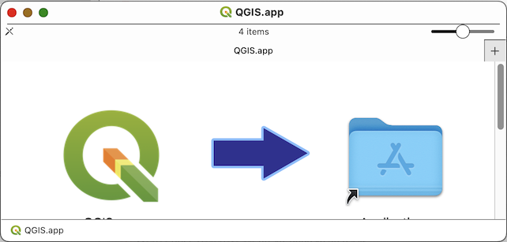

# Doing a Clean QGIS Installation on Mac

It often useful to just clean everything out and install QGIS, fresh and clean, especially on a Mac. Here's my workflow:

This workflow will guide you through:

* Installing QGIS PR (Pre-release) on a Mac
* Installing SAGANP to improve SAGA tools integration with the latest Pre-Release version of QGIS
* Installing WhiteboxTools Plugin, to support WhiteboxTools for raster, through the QGIS interface.
* Install QuickMapServices and Import basemap Services.

## Cleaning Up (if you already have a previous version of QGIS)

We will be using the latest Pre-Release version of QGIS, which should have all the latest tools and functionality we want. If you have previously installed QGIS PR, you will need to delete the QGIS.app from your Applications Folder, before installing with the directions, below.

`Note: QGIS PR and QGIS LTR (Long-Term Release) are released with different *.app names, so that you can run the LTR and PR versions of the software on the same machine. If the *.app in your Applications Folder is named QGIS-LTR.app, you will not need to delete it, since the PR version installs as QGIS.app`

1. Browse to your Application folder, in Finder
2. Right-click on the QGIS.app app, and 'Move to Trash'

## Install QGIS PR

1. Download the latest PR from: https://qgis.org/downloads/macos/qgis-macos-pr.dmg
2. Right-click the DMG File and select Open
3. It will take a few minutes to decompress and validate the DMG file.
4. Once the Installation Package opens, Drag-and-drop the QGIS app icon, into the Applications Folder icon, to install the app.

5.

## Launching QGIS, the 1st Time.

QGIS is not yet notarized as required by macOS Catalina+ (10.15) security rules.
1. On first launch, please right-click on the QGIS app icon, hold down the Option key, then choose Open. This should result in a warning pop-up,

## Create a New User Profiles

This step will create a new

## Install Plugins

### Getting QGIS ready to use

1. Open your new installation of **QGIS** and go to **Plugins>Manage and Install**
2. Go to **Settings** and check the option to **Show also Experimental plugins**
3. **Scroll down** and click on the **Add...** button and add "**Alex's QGIS Python Plugins**" using the URL: `https://plugins.bruy.me/plugins/plugins.xml`

### SAGANP plugin
Saga tools are useful, but as a project separate from QGIS they often introduce breaking changes to the GUI in QGIS by changing the names of tool parameters, etc... SAGANP is an experimental plugin, which attempts to keep up with these changes, outside the less regular releases of QGIS, and will reduce the number of issues you have using the SAGA tools.

1. Return to the **All** tab in the Plugins Dialog and search for **SAGA** to find the "Processing SAGA NextGen Provider" plugin, and install it.
2. This should add a new SAGA Next Gen toolset, which duplicates the SAGA provider.
3. If you want to clean up the interface, you can disable the default SAGA provider in the **Processing>Toolbox>Options>Providers**:

### WhiteboxTools plugin

**Whiteboxtools** is an excellent, performant and stable set of tools, particularly useful for hydrological modeling, terrain analysis, and map algebra. You can integrate the WBT tools in QGIS through the use of another plugin.
This assumes you have downloaded **Whiteboxtools** from https://jblindsay.github.io/ghrg/WhiteboxTools/index.html and have upzipped the resulting archive to somewhere stable on your hard drive.

1. **Return** to the **Plugins Manager** and search for https://jblindsay.github.io/ghrg/WhiteboxTools/index.html to find the "WhiteboxTools for Processing" plugin, and install it. (_Note: this plugin is from Alex's QGIS Python Plugins repo, which is why you added it,above_).
2. **Return** to the **Processing Toolbox Settings** and expand  Providers>WhiteboxTools, then double-click in the box next to WhiteboxTools executable to use the ... buton to browse to the folder where your WhiteboxTools executable is, as shown below:  

### QuickMapServices

QuickMapServices Plugin provides a convenient catalog of tiled map servcies for use as basemaps and reference layers, in QGIS.

1. **Return** to the **Plugin Manager** and search for **QuickMapServices** and install the plugin.
2. **Close** the **Plugin Manager** and go to **Web>QuickMapServices>Settings**
3. **Click** on the **More Services** tab, then **Get Contributed Pack**
4. Close the Settings Dialog after the new services are loaded and return to **Web>QuickMapServices** to see all the new services available.
