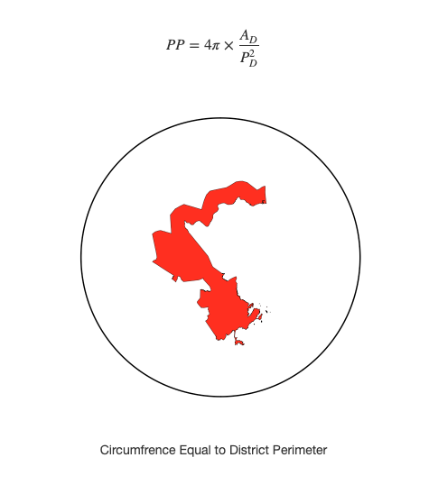

# Gerrymandering

## Accurate Measurements

### Get the Data

1. Go to Census.gov and download the 116th Congressional Districts national file : https://www.census.gov/cgi-bin/geo/shapefiles/index.php?year=2020&layergroup=Congressional+Districts+%28116%29
2. Unzip the data and add to a new QGIS Project

Polsby-Popper
The Polsby-Popper (PP) measure (Polsby & Popper, 1991) is the ratio of the area of the district (AD) to the area of a circle whose circumference is equal to the perimeter of the district (PD). A district’s Polsby-Popper score falls with the range of [0,1] and a score closer to 1 indicates a more compact district.

### Calculate Geometries

1. `area($geometry)` yields measurements in the units of the layer.
2. `$AREA` results in measurements in linear units (meters)

### Examine Project CRS

1. Change Ellipsoid to WGS84 and Recalculate `$AREA`
2. -89.125,32.967
