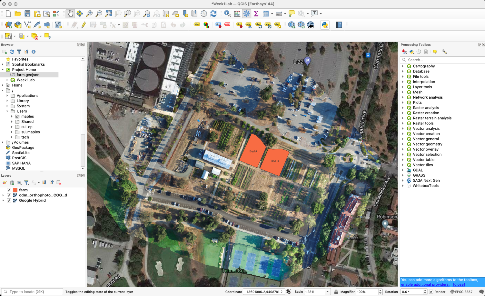
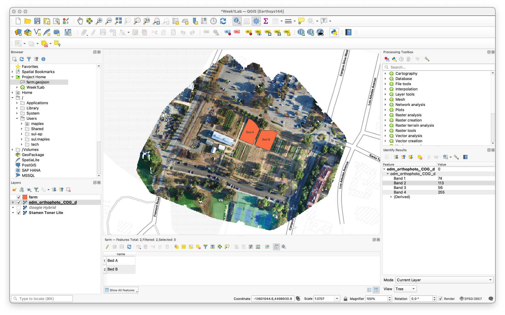
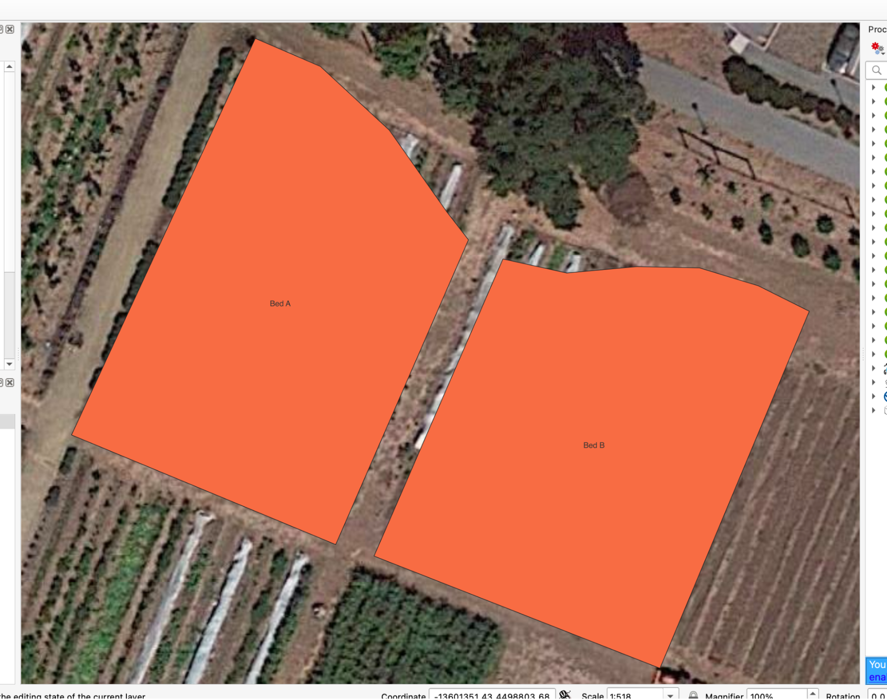
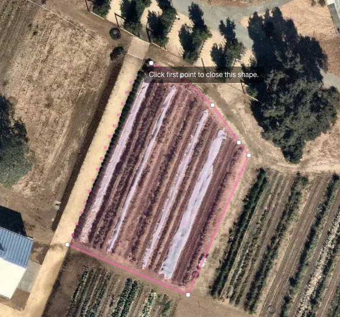
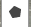
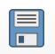
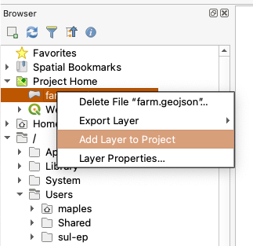

## Introduction to Data Models and testing your QGIS Installation

This first lab will introduce you to the 2 basic data models, Vector & Raster, and help you test your new QGIS Installation.

### Creating a “Vector” Dataset

This first task will introduce you to the basics of vector data. For this exercise you will use a web application called, and at: [geojson.io](https://geojson.io) to “digitize” a feature from satellite imagery. We’ll use existing imagery services built into the application to digitize a feature, then compare it with more current imagery.

As you create your “features” note that the coordinates that define the “vertices” of your “polygons” are displayed at the right, in a format called [GeoJSON](https://geojson.org/). Don’t worry about the “code” in this window, mostly, just pay attention to the coordinates and how they change as you add new vertices, in different directions, as well as the way features are separated, when you have more than one.

1. First, note the coordinates at the following URL:
<code>[https://geojson.io/#map=18/37.42652/-122.18319](https://geojson.io/#map=18/37.42652/-122.18319)</code>
2. Now click on the URL to open the application, centered on those coordinates
3. At the bottom left of the map, click on the <strong>Satellite</strong> basemap button to change the view
4. Use the tools at the top right, or your scroll wheel and mouse, to navigate to the area shown, below:

5. Use the <strong>Draw a Polygon </strong>tool

to create a polygon around the bed at the top left, as shown:

6. Click on the first vertex to close the polygon and stop editing
7. Digitize any other bed on The Farm, using the same method as before, noting how a new “Feature” is created within the larger “Feature Collection.” Again, don’t worry too much about understanding the code.

#### Add some “attributes”

Now, you’ll add a couple of simple **attributes**, at least that is what they are usually called in **Geographic Information Systems**, or **GIS** applications, though you will see that in “code” they are referred to as “**properties**.” We won’t worry too much about the truth of these attributes, right now, we just want to use them to “see how things work.”

1. On the right side of the geojson.io app, click on the Table tab to activate the more familiar “**tabular**” or “spreadsheet” view of the data you created.  

Note the absence of anything. This is because you don’t really have any information about the “locations” you just entered. They are just coordinate pairs, defining the geometry of the features you created. Now you will add information that is of interest about the locations.  

2. Click **Add New Column** and call it **name**
3. Click on the first row, under your new column and see that the app zooms to the appropriate feature. Nice, right? It used the coordinates to do that.
4. Name the first row, **Bed A**, and the second, **Bed B**. It doesn’t matter which order, at this point.  

5. Return to the &lt;/> JSON Tab, to see what you’ve done in the body of the GeoJSON file.  

Note that what you’ve created in the JSON are called “properties,” with pairs of values that provide the name and value of the property.

#### Export your GeoJSON File

That’s it, you’ve just created your first spatial dataset, with vertices, and features, and attributes, and coordinates, and all of the other keywords you’ve been wondering about! Now we want to Save the dataset to an actual file you can import into QGIS.

1. Click on the Save link at the top left of the application and note all of the options.
2. Select GeoJSON as your format, and save it to a folder somewhere stable on your computer (a good idea would be to call the folder something like “Week 1 Lab Assignment”), as **farm.geojson
**

### Open QGIS

Now we will shift to QGIS to create a first small map “project.” We will use the farm.geojson file you just created as the basis for our project. Of course, we could have created our file, using tools in QGIS, as well as the Google Satellite Basemap, but often the projects we work on will make use of many different tools, along the way. This is one of the first things I hope to get across is that there are MANY different tools you can use to work with spatial data, some very good at very limited things, some fairly good at many things. The key is to always work with open data formats, as we will do for much of this class, to increase the “**interoperability**” of your data, in different software.

#### Basemaps - Test QuickWebMaps

First, you will test your installation of Quick Web Maps, which you should have completed in the first exercise. If you find that things aren’t quite the way they should be, return to the **Installing QGIS **exercise to make sure you haven’t missed a step. As always, you can reach out on Slack (preferred), email, etc… with roadblocks you can’t resolve.

**QuickMapServices** provides a convenient way to add one of hundreds of “**Basemaps**” to your project. Basemaps are pre-rendered maps that can be used to provide the geographic context of your own **operational layers** of data, in a project. In this case, we will add satellite imagery, but we could also add something like [Stamen’s Toner Lite basemap](http://maps.stamen.com/toner-lite/#12/37.7706/-122.3782), which is a nice greyscale map that provides a somewhat neutral palette for your own data.  

1. Go to Main Menu>Web>QuickMapServices>Google>Google Hybrid to add the Google Satellite imagery basemap, with labels.
2. Go ahead and explore the basic navigation tools.

3. Pan, Zoom in (I like to use Shift+_drag a box_ for zooming into a specific area), Zoom out, Zoom Full, Zoom Last, Zoom Next.
4. If things get weird, you can always two-finger/control click the **Google Hybrid ** layer in the **Layers Panel,** at the bottom left of QGIS, and select **Zoom to Layer (s)** to get back to the whole world**.**
5. From the Main Menu>Project>Save As… and save the project to the same folder you saved your **farm.geojson** to, and name it something like** Week1Lab.qgz**

#### Vector Data - Import your GeoJSON File

Now we will begin to home in on our **Area of Interest, **or **AOI**, using the farm.geojson file you created before.

1. Use the file browser at the top left side of the QGIS app to browse to the folder you have saved your **farm.geojson** and your project file to.  

(Note that if you properly saved your project, there should be a Project Home folder (mine is green) you can open up and find your data. The Project Folder is usually whatever folder you saved the project file to, in most applications.  

2. 2-finger click on the farm.geojson file you should find there, and select **Add Layer to Project**
3. 2-finger-click on the **farm **layer in your Layer Panel and **Zoom to Layer**
4. 2-finger-click on the **farm** layer, again, and select **Show Labels**

Note that this should correctly display the only attributes available in our dataset. We’ll dive more into labeling and cartography later, but for now, know that the **labels** are **data-driven**, that is, they are displaying attribute values in the data itself, rather than being simple graphics.

5. Save your current project work by clicking on the Save button

, and note that most GIS Desktop Software packages DO NOT have autosave features. Avoid data and effort loss by saving often!

### Raster Data - Open a Geotiff from “the cloud”

I’ve placed an image in the **[Stanford Digital Repository (SDR)](https://sdr.stanford.edu/)**, for your use in this section. This is an image, created from several hundred smaller photos, processed through an application called **[OpenDroneMap, or ODM](https://www.opendronemap.org/webodm/)**. These photos were captured using a typical drone, and ODM used the GPS information that the drone automatically writes to each file to roughly “**georeference**” the photos, then an algorithm designed to find the matching **pixels** in overlapping photos is used to assemble the photos into a single “**orthomosaic**” which has also been corrected for **elevation**, though there aren’t really any elevation differences in the photo, to speak of. All of this is done using a process called “**photogrammetry**” which we will explore more, later in the course.

The **image** is in a format referred to as  **[Cloud Optimized Geotiff, or COG](https://www.cogeo.org/)**. This format allows software to call portions of the image, rather than downloading it entirely, directly from a web server, with no service unnecessary at the server end. QGIS is able to open this file, directly from the web.

This image is a type of **raster** data. In this case, the image has 3 raster bands, each containing information about the **_relative_** (rather than actual reflectance values, each of the pixel values in these bands have been normalized to between 0-255) amount of Red, Green or Blue light being reflected from the surface. This is referred to as a True Color RGB image.

1. Take a look at the URL, below:

**<code>https://stacks.stanford.edu/file/druid:vq494qx9344/odm_orthophoto_COG_d.tif </code></strong>
2. Note that the above URL ends directly at a file called <strong>odm_orthophoto_COG_d.tif</strong> (it’s 200mb, so don’t open the url in a browser, unless you WANT to save it locally)
3. Main Menu>Layer>Add Layer>Add Raster Layer… to open the <strong>Data Source Manager</strong>
4. Change the following settings:
    1. Source Type: Protocol:HTTP(S),cloud,etc…
    2. Protocol Type: HTTP/HTTPS/FTP
    3. URI: <code>[https://stacks.stanford.edu/file/druid:vq494qx9344/odm_orthophoto_COG_d.tif](https://stacks.stanford.edu/file/druid:vq494qx9344/odm_orthophoto_COG_d.tif)</code>
    4. Leave the remaining settings
5. Click <strong>Add</strong>, then <strong>Close</strong> the <strong>Data Source Manager</strong>

6. 2-finger-click on the **odm_orthophoto_COG_d **layer in the **Layer Panel** and **Zoom to Layer**

You should see something like below, with the new **odm_orthophoto_COG_d **layer brought in on top of everything else.
7. In the Layer Panel, drag the **odm_orthophoto_COG_d** layer between the farm** **layer and the **Google Hybrid **layer.

Note that the order of display is determined by the order of layers in the** Layers Panel. **You should now have something like this:
8. Save your project.

### To Turn In

We’re not going to dive into QGIS Layouts and cartographic elements, just yet, so this will just be a simple screen capture of your current QGIS WIndow. First, you need to prepare the QGIS window to demonstrate you’ve worked all the way through the lab, though.

1. Pick a different **Basemap (_some work, some don’t, try until you find one you like_)** from the **QuickMapServices** plugin and add it to your project:
    1. Toggle off the old Google Hybrid basemap layer in the Layers Panel, by unchecking it’s checkbox
    2. Adjust the order of your data layers, again, if necessary to make your farm layer appear on top of your new basemap
2. 2-finger-click the **farm** layer in your ** Layer Panel** and select **Open Attribute Table

**Remember that one of the great advantages of modeling features and phenomena as vector data is the ability to associate an almost infinite number of attributes with each feature. We only have a single variable/attribute, called ‘name’ which contains the label for the features we digitized.
3. Click on the Dock Attribute Table

 button to do just that.
4. Activate the **Identify Features** tool on the top row of the QGIS platform, which should open an ** Identify Results** window.
5. Select the **odm_orthophoto_COG_d** layer in the Layers Panel and then **Click anywhere** on the **odm_orthophoto_COG_d **image, in your map window.  

Note that the results are the values for the **pixel** location that you clicked on, across **4 Bands** of data, and represent the relative amount of **RGB** light reflected from the surface. Band 4 is a special band, called an **Alpha Channel, **which tells software which pixels in the rectangular raster dataset you are looking at (Yes, IT’S RECTANGULAR!!), should be see-through, or **NODATA**.

6. Click around the image to see how different RGB values interact with one another to create different colors.
7. For now, a simple screenshot will suffice. We’ll learn about layouts and exports next week.
    3. On a Mac, use Finder to go to your Applications>Utilities folder, and run the screenshot.app tool
    4. Use the second button to Capture Selected Window, then click anywhere in the QGIS window to take a screenshot.
    5. Alternatively, hold down

>>>>>  gd2md-html alert: inline image link here (to images/image9.png). Store image on your image server and adjust path/filename/extension if necessary.  (<a href="#">Back to top</a>)(<a href="#gdcalert10">Next alert</a>) >>>>> 

 and click anywhere on the screen within the QGIS window to take a screenshot. You can also hold down command + shift + 4 and manually choose your screenshot area.
    6. Put the image into a document, with your name and the assignment name, and date, at the top.
    7. Export the document to PDF and submit the assignment through Canvas. See the example on the next page.

## Week 1 Lab Assignment - Intro to Data Models & QGIS

Earthsys 144

Sept. 27, 2021

Stace Maples
