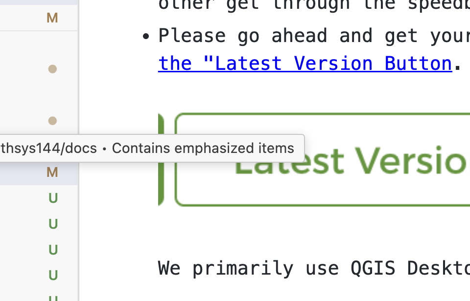

## Welcome to Earthsys144 - Fundamentals of Geographic Information Sciences!!!

Some Important things to do before March 31st!

Welcome, everyone! In the interest of "hitting the ground running," I've got a couple of things that you can do to get prepared for the course, now. We've got 70+ in this course, so much of my communications with the class will come through announcements, and and you may get a few per week, or even at a time, when I think certain topics deserve specific attention. Please be sure to set up your class alerts for **Earthsys144** because if it's important enough for me to write one of these, it's going to be useful for you in the course, and beyond. I link out to resources heavily, and if I have something linked it's because I think it's important that you see it. Please be a clicker, and bookmark things. I'm looking forward to meeting y'all in person!

StacelPlease give the following (some of them fun!) items your attention:

* If you have not yet registered for a Lab section, please do so. Don't worry about which, too much, as we will try to accommodate people changing sections if they turn out to work better for them.
* You've all been added to the [Stanford Geospatial Center's GIS Lab](http://gis.stanford.edu/) Group, which gives you:

  * Access to the SGC Lab Machines, at [Branner Earth Sciences Library](https://www.openstreetmap.org/search?query=stanford+geospatial+center#map=19/37.426467/-122.172572)
  * a flexible "R: Drive" to store data,...
  * You can find out more about [using the SGC Lab, here](https://arcg.is/LmnT9).
* You've all been given access to the Stanford account for [Google Earth Engine](https://earthengine.google.com/) Javascript Sandbox & CodeEditor.  [Use this link to load the GEE101 Sample Scripts](https://code.earthengine.google.com/?accept_repo=users/stacemaples/SGC-EE101), and test your access. If you have trouble getting into the platform, please [email me. ](mailto:maples@stanford.edu)
* You all have **instant access** to ArcGIS Online, through Stanford SSO (Single Sign-on), at[https://stanford.maps.arcgis.com](https://stanford.maps.arcgis.com).  Feel free to explore ArcGIS Online, at your leisure. We'll make use of the[StoryMaps Platform](https://learn.arcgis.com/en/gallery/#?p=storymaps), which is part of the ArcGIS Online ecosystem of cloud GIS applications, as well as the field data collection system,[FieldMaps](https://learn.arcgis.com/en/gallery/#?p=fieldmaps). You should feel free to explore the many other parts of ArcGIS Online, at your leisure. For some great "Getting started" and task-based tutorials, check out[https://learn.arcgis.com
* You're all going to be invited to the Stanford/Planet.com E&R account, which gives you access to [Planetscope imagery products](https://www.planet.com/products/monitoring/), as well as grant access to [SkySat Archive](https://forms.gle/18YC2yYcjtVQDtoF9), and [SkySat Tasking](https://forms.gle/NPUuwwUDrHc2mSfLA), for small student research projects. You will need to look for your invite from planet.com, and complete the registration process. Once that is done, take a look at [this search in the Planet Imagery Explorer](https://www.planet.com/explorer/?s=l1qNAXtFSIOtHVq0c3yl5Q) (start at the bottom of the search results, and click on the images to enable them, working your way up through the global shipping drama!). Later in the quarter, we will search, access and analyze Planet.com imagery, using a [Python Notebook](https://github.com/StanfordGeospatialCenter/Planet_API_101) and the [Planet.com APIs](https://developers.planet.com/docs/apis/) (Don't Panic! All of the programming we will use in this class is designed for non-programmers!).
* I've invited all of you to the [#earthsys144_fundamentals_of_gisci channel](https://stanford.enterprise.slack.com/archives/C043G4HSP5E) on the Stanford Slack space. This is the single best place to get help, outside of class, labs and office hours. Drop screenshots of problems, cut&paste error messages, link out to your Google Earth Engine code, etc... If you are having problems, chances are good others are, too, so this is where we can help each other get through the speedbumps!
* Please go ahead and get yourself set up with [QGIS PR (Preview Release, look for the "Latest Version Button](http://qgis.org/).

  

  We primarily use QGIS Desktop in this course for these reasons:

  1. QGIS is Free & Open Source Software for Geospatial ( [FOSS4G](https://www.osgeo.org/)).
  2. QGIS is comparable in analysis capabilities to ArcGIS Desktop, or Pro.
  3. QGIS is performant on a wide range of hardware.
  4. It is possible to install it on Windows, Mac, Linux and there are even some experimental Android versions.

QGIS' flexibility and accessibility make it a great choice for us, for most of our desktop spatial data carpentry. We will also work with ArcGIS Online, ArcGIS Pro, Leaflet, CARTO, Google Earth Engine, and other platforms, exploring their strengths and identifying appropriate tools for the tasks at hand.

The QGIS Windows installation is pretty straightforward. I've [documented the Mac setup, here](https://github.com/mapninja/Earthsys144/blob/master/Labs/Week_01/CleanQGISInstallationforMac.md), since there are some security settings that have to be updated for QGIS to run. The [setup document](https://github.com/mapninja/Earthsys144/blob/master/Labs/Week_01/CleanQGISInstallationforMac.md) also has instructions for setting up QGIS plugins that we will use in our labs.

