# Ellipsoid vs Orthometric Height with Google Earth Engine
### Introduction
In this lab, we will explore the differences between **Ellipsoid** and **Geoid** height measurements using **Google Earth Engine (GEE)**. You will run a script that imports and visualizes two **Digital Elevation Models (DEM)**: the `NASADEM` product, which contains **orthometric** (Geoid-based) heights, and the `Shuttle Radar Topography Mission (SRTM)`, which contains heights based on the **Ellipsoid, WGS84**.

### Sample Scripts

1. [Use this link to open Google Earth Engine](https://code.earthengine.google.com/7ea9a5f87188944551aa038ae8260921?accept_repo=users%2Fstacemaples%2FEarthsys144), load the sample script, and run the script:

    `https://code.earthengine.google.com/7ea9a5f87188944551aa038ae8260921?accept_repo=users%2Fstacemaples%2FEarthsys144`

2. At the top of the **Code Editor Panel**, click on the hyperlinked text for `NASADEM: NASA NASADEM Digital Elevation 30m` to open the Data Catalog information for the dataset. This is referred to as the metadata, or "data about the data."

    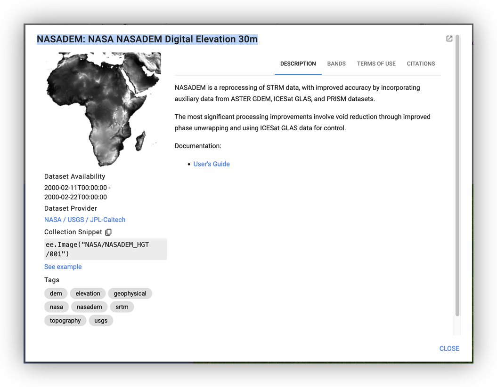

    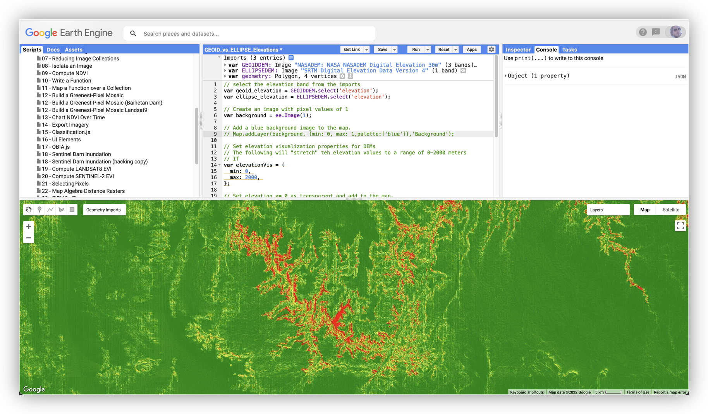

3. Review the metadata available in this view of the Data Catalog item page. Click on the [User Guide link](https://lpdaac.usgs.gov/documents/592/NASADEM_User_Guide_V1.pdf) in the Data Catalog Panel.
   
4. Look for the section called ***5.1.1 Ellipsoid to Geoid Conversion*** and read the brief technical item, noting the purpose of converting Ellipsoidal heights to Geoidal heights is to normalize "Mean Sea Level" to a value of zero.   

4. Use the **Layers Widget** to toggle the layers on and off to see the underlying **Digital Elevation Models (DEM)** and observe their differences (they are subtle but visible).

    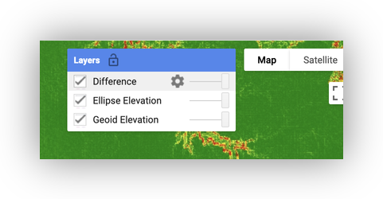

5. Use the **Geometry Imports widget** to toggle on the visibility of the geometry variable that is controlling the extent of the map.

    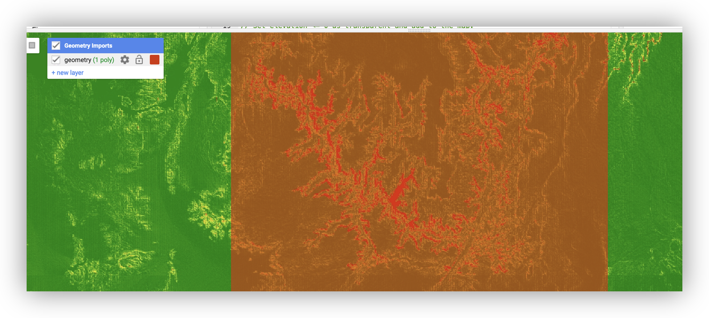

6. Click on the **Center Map on Record** icon to see the geometry as a whole.

    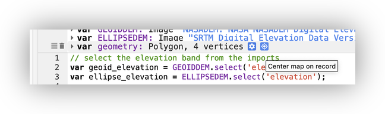

7. In the **Console Tab**, at the top right of the **Code Editor**, expand the object item to see the average error in elevation between the **Ellipsoid** and **Orthometric (Geoid)** heights for the geometry currently being used.

8. Now **click** on the **Delete** icon next to the `var: geometry` imports to delete it.

    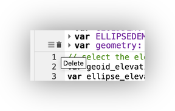

9.  **Pan and zoom** the maps to another area (you will need to use the same zoom level as the original script, or higher, for the average difference in elevation) of your choice.

10. **Click** on the **Draw a Rectangle tool** to **activate** it.

     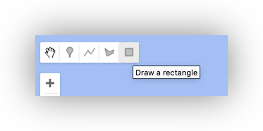

11. **Draw** a new **geometry** for the script to use in your chosen **Area of Interest**.

12. The **Code Editor** should import the new geometry as `var: geometry` by default.

     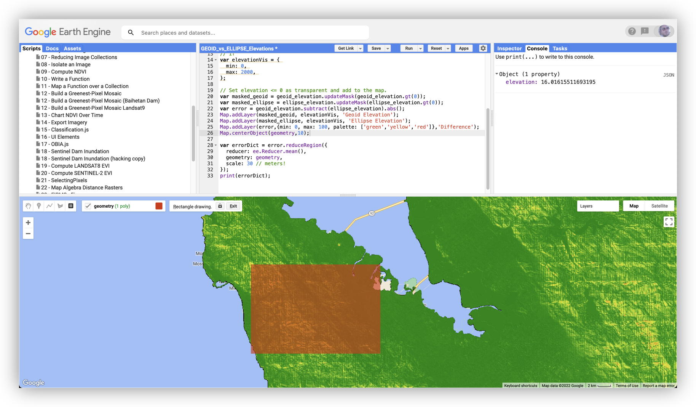

13. **Run the script** again. *If it throws an error*, **delete** your current geometry and **try a smaller one** until you are successful.

     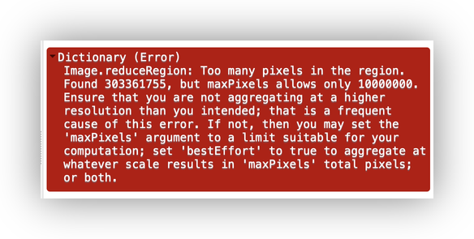

14. **Observe** the change to the resulting value of error in the **Console**.

     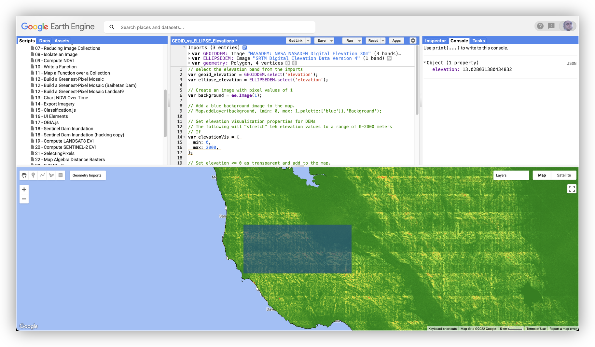

### To Turn In

1. Once you have successfully created a new extent for the script and run it to get the new `Average Error value`, save your script to your scripts repository.

2. Use the **Get Link** button to create a shareable link.

3. Submit your **Get Link URL** to Canvas, as a note.

     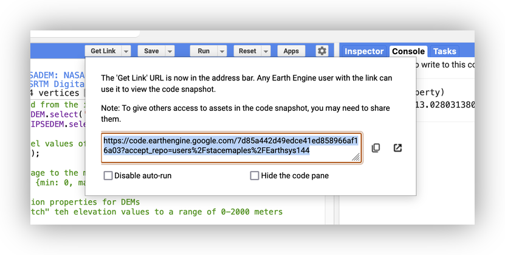
