# Week 3 Lab: Digitizing in QGIS

**_What You’ll Learn_:** In this Lab, you’ll be introduced to basic digitizing techniques in QGIS, including creating vector datasets from a (geo)referenced image, working with Cloud Optimized GeoTIFFs (COGs), and using snapping for topological accuracy.

**You should read** Chapter 4 in the GIS Fundamentals textbook before starting this lab, as the chapter covers the basics of data entry and digitizing mechanics. You will digitize and edit features based on a digital aerial photo of the [O'Donohue Family Stanford Educational Farm](https://farm.stanford.edu/).

---

## Getting Ready for the Lab

We will be using an image of the Stanford Teaching Farm for this exercise. That image is stored as a [Cloud-Optimized GeoTIFF (COG)](https://cogeo.org/) on the [Stanford Digital Repository (SDR)](https://sdr.stanford.edu/). A COG is a specialized type of TIFF image designed for efficient access and streaming over the web, enabling users to retrieve only the portions of the image they need without downloading the entire file.

You can find the Persistent URL Page for the dataset here: [https://purl.stanford.edu/vq494qx9344](https://purl.stanford.edu/vq494qx9344)

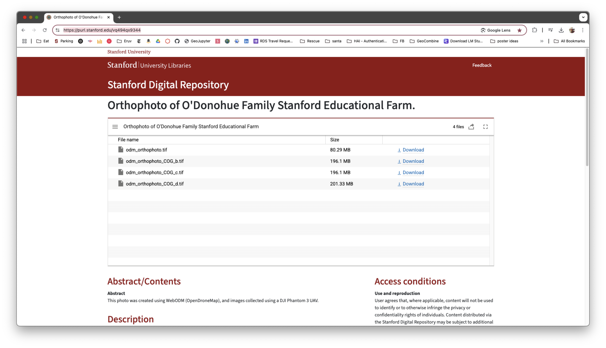

We will use the file `odm_orthophoto_COG_d.tif` for this lab. The direct URL is:
`https://stacks.stanford.edu/file/vq494qx9344/odm_orthophoto_COG_d.tif`.

---

## Step 1: Adding the COG to QGIS

1. Open QGIS and go to **Layer > Add Layer > Add Raster Layer**.

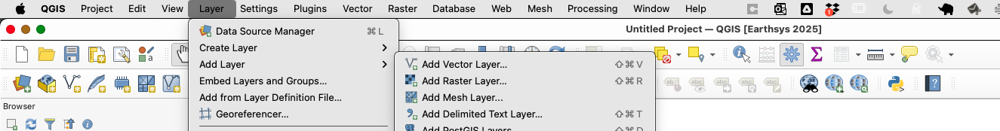

1. In the dialog, click **Source Type** and select **Protocol**.
2. Paste the URL:
   `https://stacks.stanford.edu/file/vq494qx9344/odm_orthophoto_COG_d.tif`

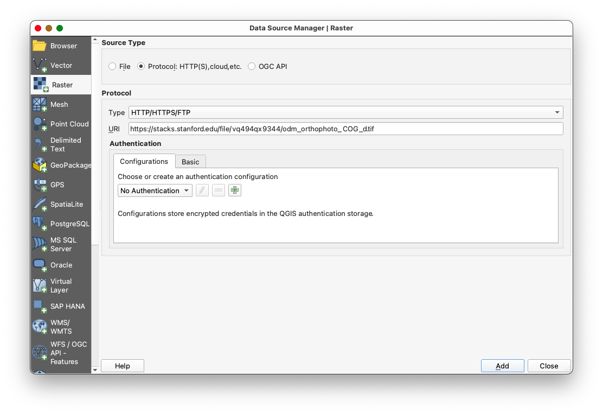

1. Click **Add** to load the COG into your project.

### Notes on COG Performance

- Initially, the COG may load slowly as QGIS fetches data from the server.
- As you pan and zoom around the image, QGIS will cache the views, improving performance over time.
- To cache views, pan around the area of interest (the Farm property) before starting digitization.

---

## Step 2: Adding Google Hybrid Imagery

1. [Install the **Quick Map Services** plugin](https://github.com/mapninja/Earthsys144/blob/master/Labs/Week_01/CleanQGISInstallationforMac.md) if not already installed.
2. Add Google Hybrid imagery:
   - Go to **Web > Quick Map Services > Google > Google Hybrid**.

---

## Step 3: Creating New Empty Layers

The first step in creating a new spatial dataset using “heads up digitizing” is to create a new empty layer for your features to go into. In this case, we will create three empty shapefiles: one for points, one for lines, and one for polygons.

1. Go to **Layer > Create Layer > New Shapefile Layer**.
2. A window will open with entries for a **file name, geometry type (e.g., point, line, polygon), coordinate system, and field characteristics for a table**.

### Create Three Layers:

#### First Layer: Trees (Points)

1. Browse to your **Lab folder**, create a new subfolder called `data`, and save the shapefile as file: `trees.shp`
2. Set the **Geometry Type** to "**Point**".
3. Set the coordinate system to **EPSG:4326 - WGS84** (use the drop-down list to select the Project CRS).
4. Add an attribute field named `Tree_ID` (type: Integer 32-bit).

5. Leave the remainder of the options blank and click **OK**.

#### Second Layer: Rows and Paths (Lines)

1. Browse to your Lab Data folder and name the file: **paths**.
2. Set the **Geometry Type** to "**LineString**".
3. Set the coordinate system to **EPSG:4326 - WGS84**.
4. Add an attribute field named `Path_Type` (type: Text).

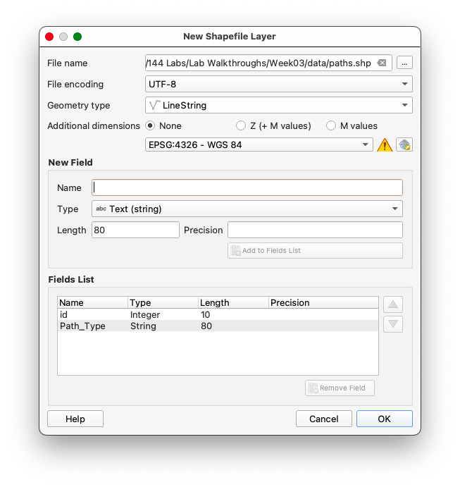

5. Leave the remainder of the options blank and click **OK**.

#### Third Layer: Structures (Polygons)

1. Browse to your Lab Data folder and name the file: **structures**.
2. Set the **Geometry Type** to "**Polygon**".
3. Set the coordinate system to **EPSG:4326 - WGS84**.
4. Add an attribute field named `Name` (type: Text).

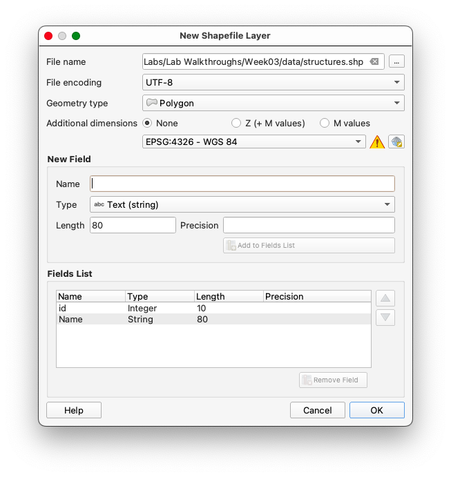

5. Leave the remainder of the options blank and click **OK**.
6. You should now see 3 new layers in you Layers panel

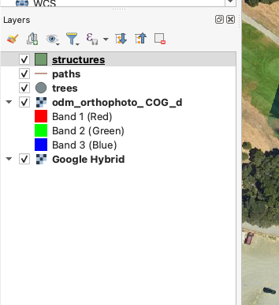

---

### Why Use WGS84 as the Coordinate System?

WGS84 (World Geodetic System 1984) is a widely used geodetic coordinate system that serves as the standard for global mapping and navigation. Here’s why it is the preferred choice for archival purposes:

1. **Unprojected System**: WGS84 is a geographic coordinate system that uses latitude and longitude to represent locations on the Earth's surface. Unlike projected systems, it does not distort shapes, areas, or distances, making it ideal for storing raw spatial data.
2. **Universal Adoption**: WGS84 is the default coordinate system for GPS and is universally recognized across GIS platforms, ensuring compatibility and ease of data sharing.
3. **Global Coverage**: It provides a consistent framework for mapping and analysis worldwide, making it suitable for datasets that span large geographic areas.
4. **Archival Stability**: As a standard system, WGS84 ensures that spatial data remains interpretable and usable over time, regardless of changes in software or technology.

By using WGS84, you ensure that your spatial data is stored in a universally accepted format, making it easier to share, analyze, and integrate with other datasets.

---

## Step 4: Digitizing Features

### Understanding Heads-Up Digitizing

Heads-up digitizing is the process of defining the coordinate pairs of the vertices that outline spatial features by visually interpreting a reference image or basemap. This technique involves manually tracing features such as points, lines, or polygons directly on a digital map using GIS software. It is a fundamental method for creating spatial datasets from aerial imagery, satellite data, or scanned maps.

Heads-up digitization is not only a valuable skill for individual projects but also a cornerstone of collaborative mapping efforts like those undertaken by the [Humanitarian OpenStreetMap Team (HOT)](https://tasks.hotosm.org/learn/map). In these projects, remote digitizers trace features such as roads, buildings, and land use from satellite imagery, much like you are doing in this lab. However, the process is enriched by contributions from local informants who provide critical on-the-ground information—such as names, addresses, building types, or post-disaster conditions—that cannot be discerned from imagery alone. This collaboration between (thousands of) remote mappers and local communities ensures that the resulting datasets are both spatially accurate and contextually meaningful, demonstrating the power of combining global technology with local knowledge.

### Points: Digitizing Trees

1. Right-click the **trees** layer in the Layers panel, and toggle editing mode.

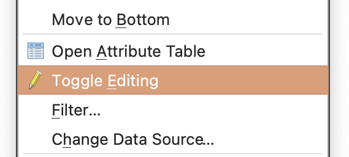

1. Use the **Add Point Feature** tool 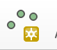 to place a point on each tree within the Farm property:
   - Toggle between the COG and Google Hybrid imagery for better identification.
   - Assign a unique `Tree_ID` to each tree (keeping in mind you set the field type to `Integer`).
   - Remember to **save your edits** by toggling off editing mode and confirming the changes when prompted.

## Tips & Tricks

### Adjusting symbology

Often it is useful to adjust the symbology of your layers to better contrast with the basemap, so that your progress is immediately apparent.

To adjust the symbology of the features:

1. Click on the **Styling Button** (represented by a paintbrush) 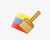 to open the **Styling Panel**.
2. Adjust the basic symbology:
   - In the Layer Styling Panel, select the layer you want to modify.
   - Select the Yellow circle.

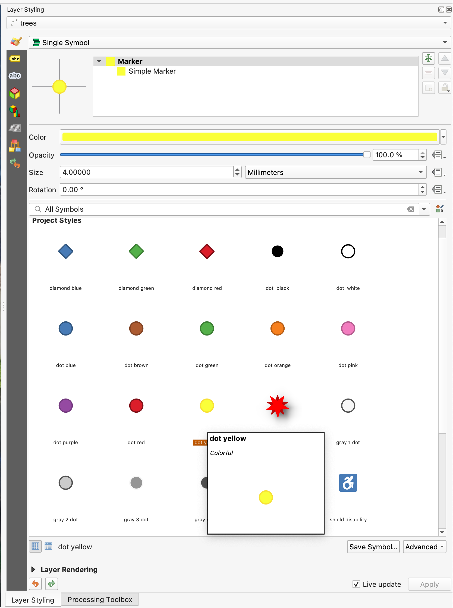

These adjustments improve the visibility of features, making them easier to analyze and interpret in the context of the basemap.

### Dismissing the attribute editor pop-up

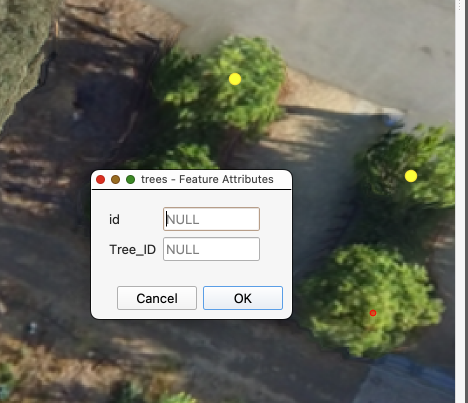

You've noted by now that the **Feature Attributes Editing pop-up** appears after every point is placed. If you aren't adding variables, this can slow the workflow, considerably.

Remember to save your edits by toggling off editing mode and confirming the changes when prompted.

To suppress the Feature Attribute Editing pop-up:

1. Go to **Settings > Options** in the QGIS menu.

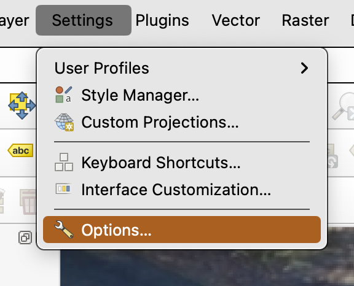

1. Navigate to the **Digitizing** tab.
2. Under the **Feature creation** section, uncheck the box labeled **Open feature form after adding a new feature**.

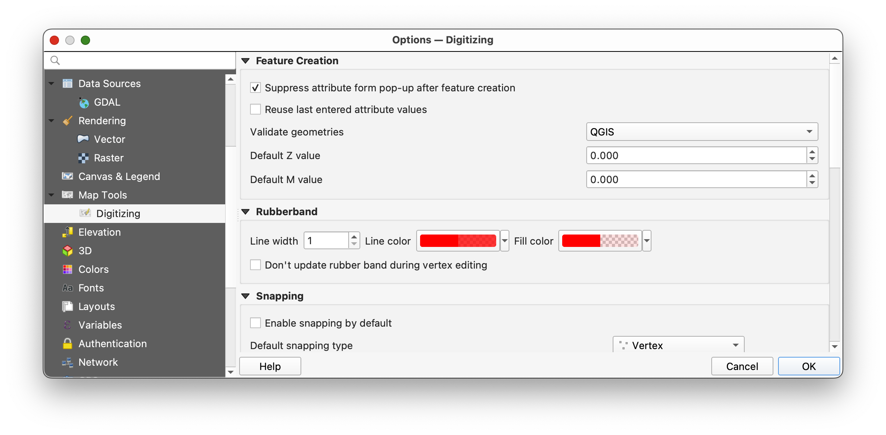

1. Click **OK** to save the changes.

This will prevent the attribute editor from appearing after each point is placed, streamlining your digitizing workflow.

### Editing features after you've placed them

### Using the Vertex Tool for Editing Features

The **Vertex Tool** in QGIS allows you to modify features by interacting with their vertices. This tool is particularly useful if you have placed a feature incorrectly during an edit session.

#### A) Deleting a Feature

1. Ensure you are in an active edit session for the layer you are working on.
2. Activate the **Select Features by Area or Single Click** tool 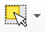 from the toolbar.
3. Click on the feature you want to delete to select it.
4. Press the **Delete** key on your keyboard.
5. Dismiss the warning pop-up
   y
   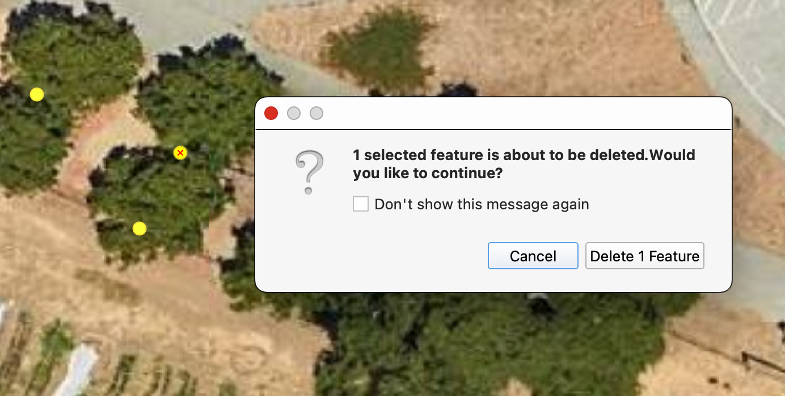

#### B) Moving a Feature

1. Ensure you are in an active edit session for the layer you are working on.
2. Activate the **Vertex Tool** from the toolbar.

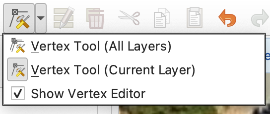

1. Click on the feature you want to move. The vertices of the feature will become visible.
2. Drag the feature to the correct location by clicking and holding anywhere within the feature's boundary.
3. Release the mouse button to place the feature in its new position.

Remember to save your edits by toggling off editing mode and confirming the changes when prompted.

### Setting up keyboard shortcuts for navigating the map while editing

Keyboard shortcuts can significantly streamline workflows like digitizing by reducing the need to switch between tools using the mouse. Efficient navigation shortcuts allow you to pan and zoom quickly, enabling seamless transitions between editing and navigating the map. This can save time and improve focus, especially when working on large or detailed datasets.

To set up custom keyboard shortcuts for navigation in QGIS:

1. Go to **Settings > Keyboard Shortcuts** in the QGIS menu.

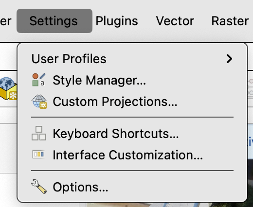

1. Search for the following actions and assign the corresponding keys by clicking on the **Change button** and then the key combination you want to assign to the action.

   - **Pan**: Assign the key `C`.

     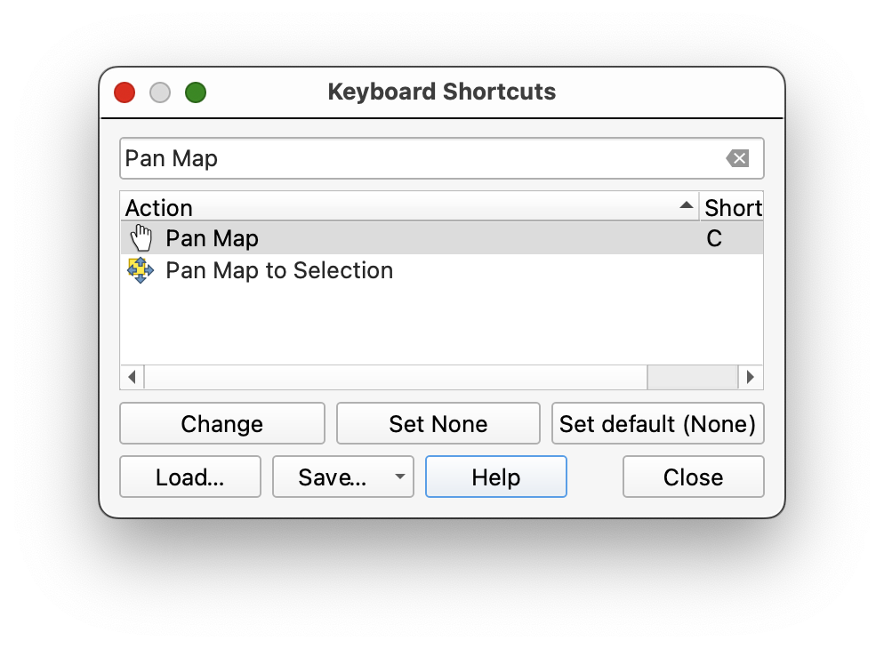
   - **Zoom In**: Assign the key `Z`.

     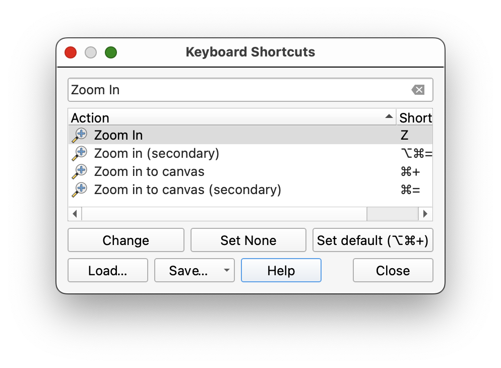
   - **Zoom Out**: Assign the key `X`.

     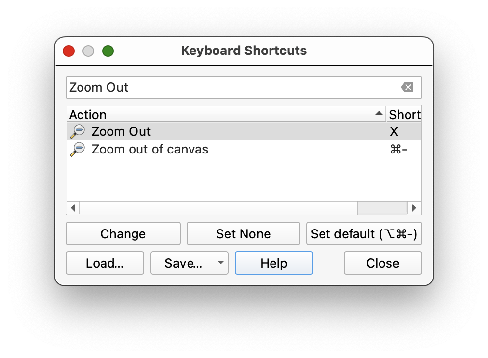
   - **Add Point**: Assign the key `v`.

     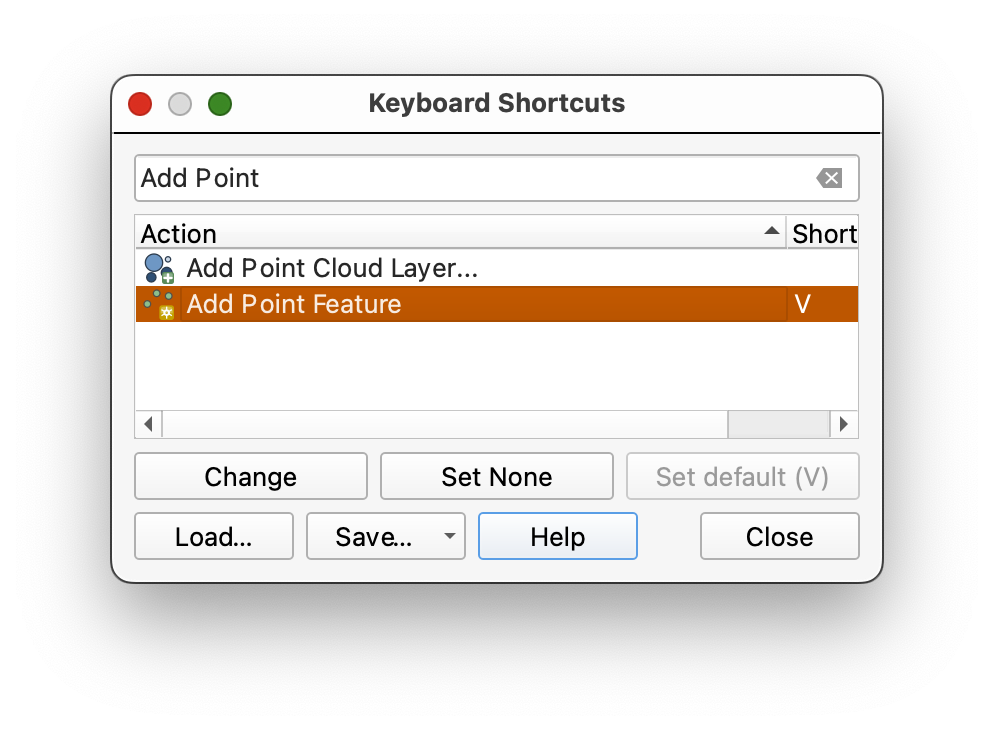
2. Click **Close** to save your changes.
3. **Save** your Project and restart **QGIS**.

Once configured, you can use these shortcuts to quickly pan and zoom while digitizing. For example, press `C` to pan the map, then switch back to your editing tool using the `V` key without needing to click on the toolbar. This allows for a smoother workflow and minimizes interruptions during the digitizing process.

## Digitizing continued...

### Understanding Lines in GIS

Lines in GIS are essentially a series of points connected in sequence, forming a continuous path. Each point, or vertex, represents a coordinate pair that defines the shape and direction of the line. When digitizing lines, it is important to place vertices at key locations, such as intersections, curves, or changes in direction, to accurately represent the feature being mapped. Careful placement of vertices ensures that the line follows the intended path and aligns with other features, especially when snapping is enabled. Digitizing lines requires attention to detail and a balance between precision and efficiency, as overly dense vertices can complicate data management, while too few may result in a loss of accuracy.

### Lines: Digitizing Paths and Sidewalks

1. With the **paths** layer selected in the Layers Panel, toggle editing on. into the project and toggle editing mode.
2. Enable snapping for topological accuracy:
   - Go to **Project > Snapping Options**.
   - Enable snapping for the line layer and set the tolerance to 10 pixels.
   - Check **Avoid Overlaps** and **Enable Topological Editing, snapping on intersection and self-snapping**.

     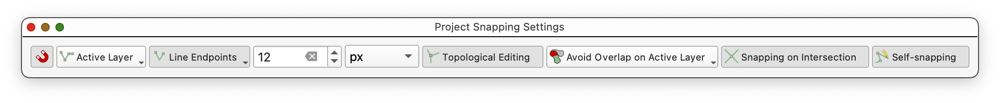

     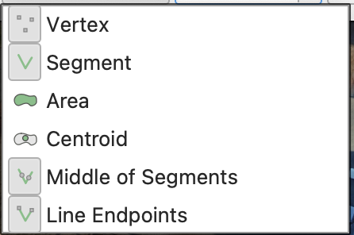
3. You can dismiss the Project Snapping Settings dialog, once you have made the change to settings.

#### Sidenote: What is Snapping?

Snapping ensures that vertices and edges of features align precisely, preventing gaps or overlaps. This is crucial for creating topologically correct data, especially for networks like paths and sidewalks.

4. Use the **Add Line Feature** tool  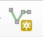 to trace paths and sidewalks:

- Place vertices at intersections to ensure proper snapping for network integration.
- To **FINISH DRAWING A LINE**, right-click (two-finger click on Mac) **AFTER** you place the final vertex (coordinate pair).
- Don't forget to save your edits using the **Save Edits button** 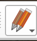, periodically.
- Once you have digitized the paths, try digitizing one block of the planting rows. Harder than it seems, at first? There are many judgement calls involved in digitizing data from satellite and aerial imagery, since we are usually limited to the one instantatneous snapshot, without other data to refer to.

### Polygons: Digitizing Structures

### Generalization and Digitizing Complex Shapes

When digitizing complex shapes and curves, the level of detail captured can significantly affect the accuracy of measurements such as area and length. This concept is closely related to the idea of generalization in GIS, where the complexity of a feature is simplified to make it more manageable or to fit the scale of the map. However, over-generalization can lead to a loss of critical detail, while under-generalization can result in overly complex datasets that are difficult to work with.

A classic example of this phenomenon is illustrated in Benoit Mandelbrot's "How Long Is the Coast of Britain?" paper. Mandelbrot demonstrated that the measured length of a coastline depends on the scale of measurement and the level of detail captured. When using a finer scale (smaller measurement units), more intricate details of the coastline are included, resulting in a longer measured length. Conversely, using a coarser scale (larger measurement units) smooths out smaller features, leading to a shorter measured length. This paradox highlights the fractal nature of natural features and the challenges of accurately representing them in a digital format.

In the context of digitizing, this means that the placement of vertices and the resolution of the reference imagery can greatly influence the resulting dataset. For example:

- **High Detail**: Capturing every curve and nuance of a feature may produce a highly accurate representation but can lead to large file sizes and increased processing time.
- **Low Detail**: Simplifying the shape by reducing the number of vertices can make the dataset more manageable but may omit important features or distort the true shape.

When digitizing complex shapes such as curved paths, irregular boundaries, or natural features like rivers and coastlines, it is essential to strike a balance between accuracy and efficiency. Consider the purpose of the dataset and the scale at which it will be used. For large-scale maps, finer details may be necessary, while for small-scale maps, generalization may be more appropriate.

By understanding the trade-offs involved in digitizing complex shapes, you can make informed decisions about the level of detail to capture, ensuring that your datasets are both accurate and fit for purpose.

#### Steps for Digitizing Polygons

1. With the **structures** layer selected in the Layers Panel, toggle editing mode.
2. Enable snapping for polygons:

   - Go to **Project > Snapping Options**.
   - Enable snapping for the polygon layer and set the tolerance to 10 pixels.
   - Check **Avoid Overlaps** and **Enable Topological Editing**.

   
3. Use the **Add Polygon Feature** tool  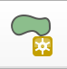 to trace the outlines of buildings and other structures:

   - Place vertices at key points along the boundary of the structure, such as corners or changes in direction.
   - Note that the polygon appears closed as you add vertices, with a straight line connecting your first point, and the cursor, as soon as you place your 3rd point. To finish each feature, right-click (or two-finger click) anywhere in the map, after you place the last vertex. QGIS will automatically place a final vertex at the same location at the first, closing the polygon, for you.
4. Once you have digitized all of the features on the farm, save your edits using the **Save Edits button** .

#### Tips for Accurate Polygon Digitization

- **Snapping**: Use snapping to align polygon edges with adjacent features, ensuring there are no gaps or overlaps.
- **Zooming**: Zoom in to capture fine details and ensure precise placement of vertices.
- **Symbology**: Adjust the symbology of the polygon layer to make it easier to distinguish from the basemap.

---

## Step 4: Saving and Exporting Data

1. Save your edits for each shapefile by toggling off editing mode.
2. Export the shapefiles if needed:
   - Right-click the layer in the **Layers Panel** and select **Export > Save Features As**.
   -

---

## To turn in:

1. Using your skills as a cartographer, and your creativity, create a reference map that displays the features you have digitize, with appropriate symbologies, cartographic elements, descriptive text (Title, Date, CRS, Your Name, and any additional explanatory text necessary, etc...).
2. Export your map as a PDF and submit it in Canvas.
