# Georeferencing and Altering Projections

## Data

* Department Of The Interior General Land Office Hon. Binger Hermann, Commissioner. Map Of The State Of Wyoming. Compiled from the official Records of the General Land Office and other sources under the direction of Harry King, C.E., Chief of Drafting Division G.L.O. 1900. Compiled, Drawn and Lettered by I.P. Berthrong [cartographic material] - [https://searchworks.stanford.edu/view/10453474](https://searchworks.stanford.edu/view/10453474)
* Public Land Survey System of the United States, 2010 - [https://earthworks.stanford.edu/catalog/stanford-td889mh1819](https://earthworks.stanford.edu/catalog/stanford-td889mh1819)

## Downloading the Scanned Map Image

1. In a browser, go to the following link (described above): [https://searchworks.stanford.edu/view/10453474](https://searchworks.stanford.edu/view/10453474)
2. Click on the **Share Icon** , then **Download**.

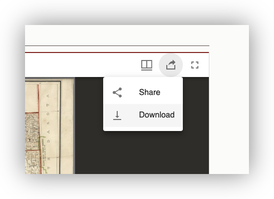

3. **Download** the [Original source file](https://stacks.stanford.edu/file/mm941rt1648/3532000.jp2).

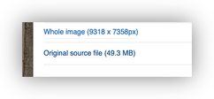

4. Save the `3532000.jp2` image to your project folder. [`*.jp2`, or **JPEG-2000**](https://www.loc.gov/preservation/digital/formats/fdd/fdd000143.shtml), is a compressed image format that is popular for storing very large imagery datasets, like aerial photography, and scanned maps.

### Download PLSS Data from Earthworks

1. Go to [https://earthworks.stanford.edu/catalog/stanford-td889mh1819](https://earthworks.stanford.edu/catalog/stanford-td889mh1819) and download the **Zipped Object** to your project folder, then unzip/extract it.

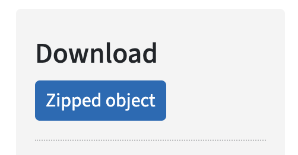

2. 

1. **Open** a **new QGIS** Project and Save it to your **Project folder**.
2. Use the **QGIS Browser** to **Browse** to the **Project Home** and add the `plss00p020.shp` file to your **Project**.

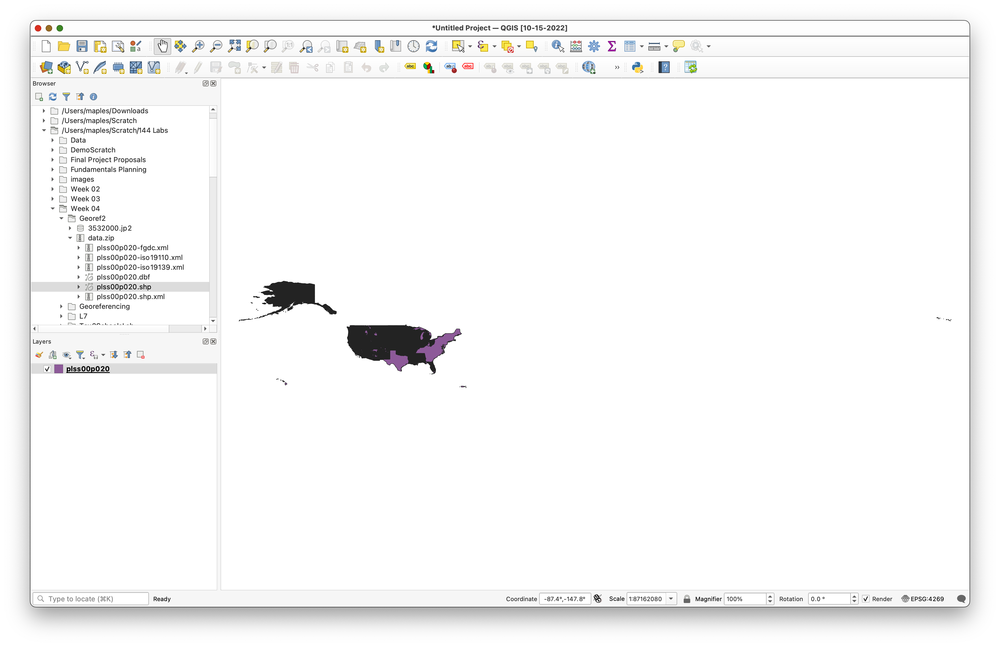

### Using Filters to subset a layer's view

Here we will use a filter on the `plss00p020.shp` layer, to only show the extent that we need, in this case, features in **Wyoming**.

1. Examine the **Attribute Table**, and note the `state` field, offers a convenient way to limit the features to those we need to georeferencing a map of Wyoming.
   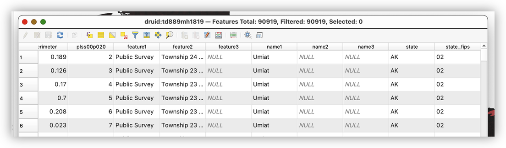
2. Open the **Properties** of the `plss00p020.shp` Layer, and click on the **Source Tab**, then the **Query Builder** button 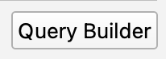
3. Create a Filter Query as follows:

`"state" = 'WY'`

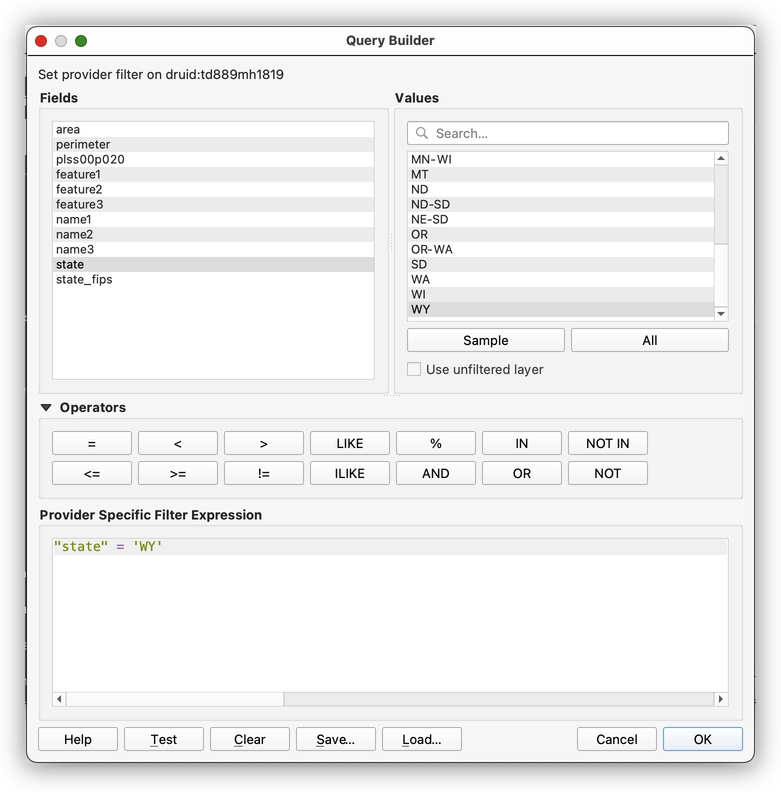

4. Click OK to **Apply** the **Filter**
5. Click OK to **Close** the **Layer Properties** and note the new extent of the `plss00p020.shp`

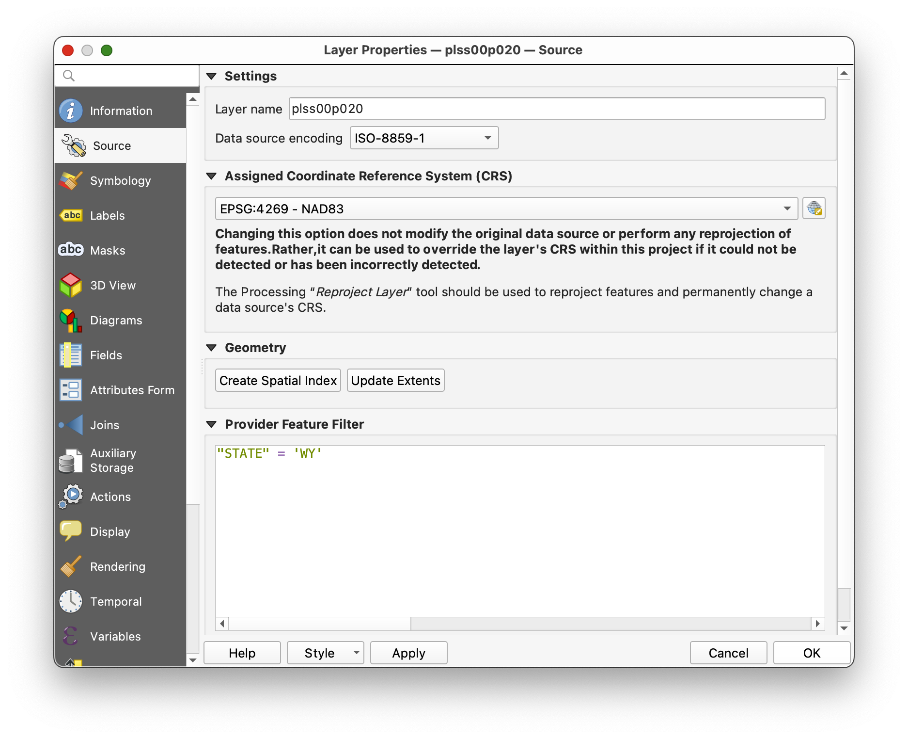

5. Right click on the `plss00p020.shp` Layer in the Layer Panel and **Zoom to Layer**

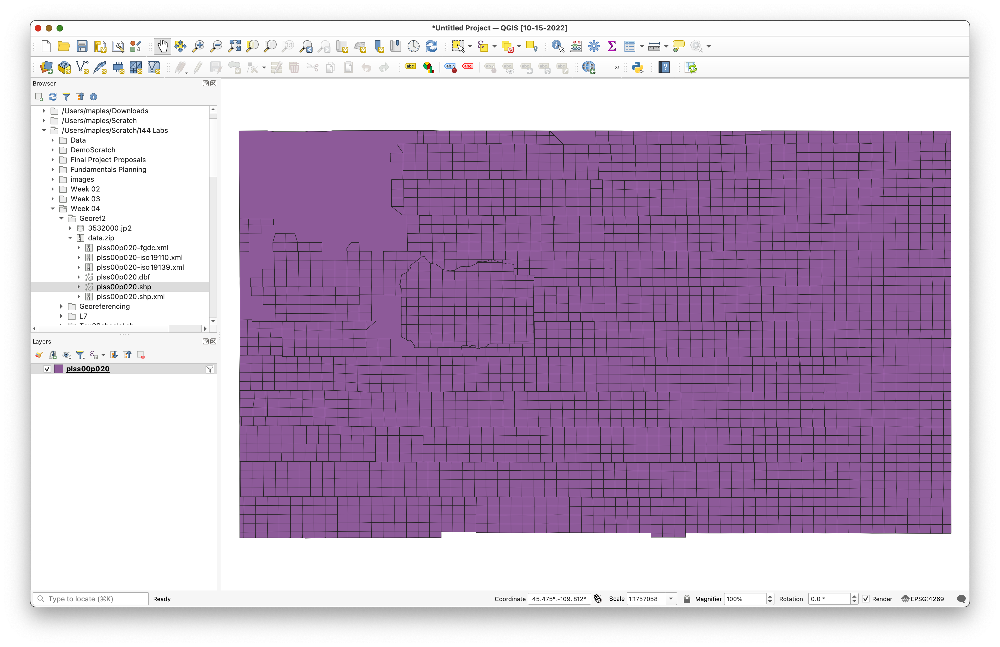

### Apply Symbology for Georeferencing Reference

Now we will apply a symbology that will allow us to use the layer as reference for our scanned map. Ideally, we will use a high contrast color for the stroke, and a transparent fill, so that we can see a basemap, beneath, for further reference.

### Add a basemap

1. Add a **Basemap**, preferably with Labels, using the **QuickMapServices** plugin.

### Adjust Symbology of the PLSS Layer

2. **Select** the `plss00p020` layer and **open** the **Layer Styling Panel** 
3. Set the **Fill Color:** `Transparent Fill`

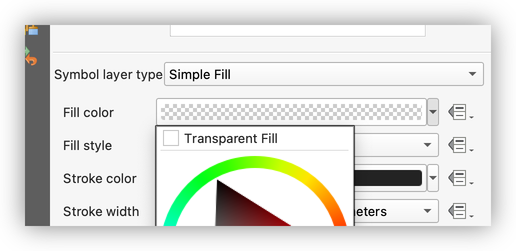
2. Set the **Stroke color**; `something brigh`t

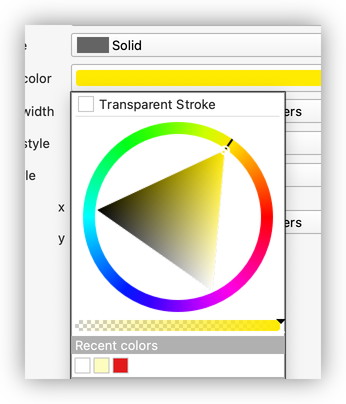

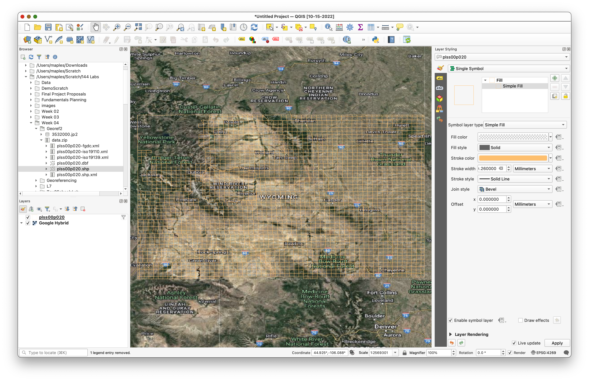

## Altering a CRS for a specific application

### Examine the scanned map image

You can do this using the PURL Page Viewer, here: https://searchworks.stanford.edu/view/10453474

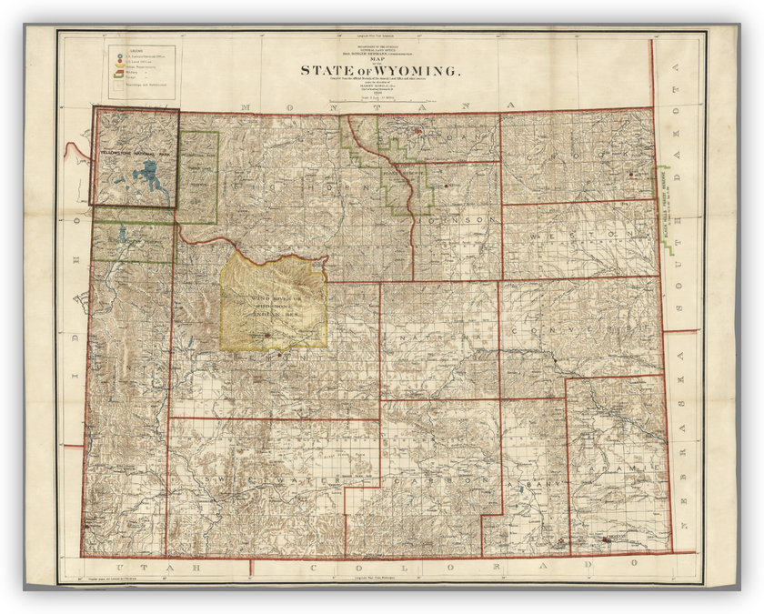

Compare the top and bottom graticule

1. What is the difference between the Longitude coordinates at the top, and the Longitude coordinates at the bottom of the map?
2. What do we call the line(s) of reference that the top and bottom of the map refer to?
3. Now take a look at the Wyoming/Montana State Line. What do you notice about it? Is it straight?
4. What is the approximate Center Longitude of Wyoming/Montana State Line?
5. What is the approximate Center Latitude?

Use your curser in QGIS to hover over the approximate center of Wyoming and see if the Coordinates match what you have answered, above.

### Altering the CRS of the Project

1. Click on the Project CRS at the bottom right corner of the QGIS Window

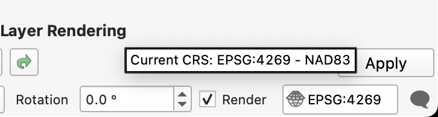

2. Change Project CRS to `USA_Contiguous_Equidistant_Conic` `ESRI:102005` and observe the results

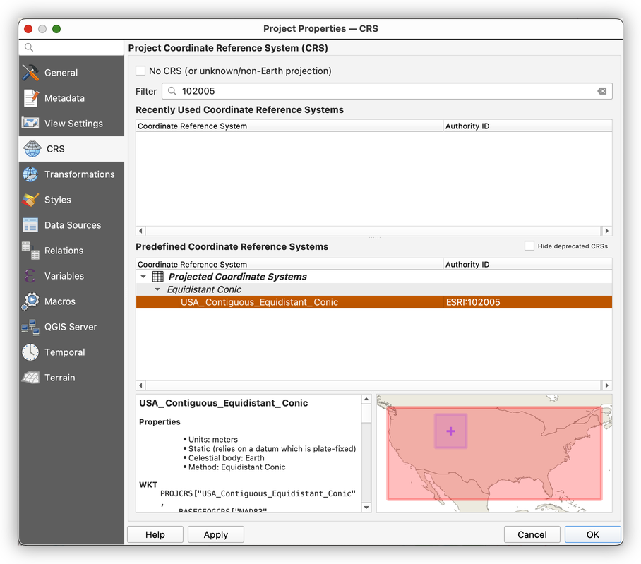

What has happened to the PLSS Grid Layer?

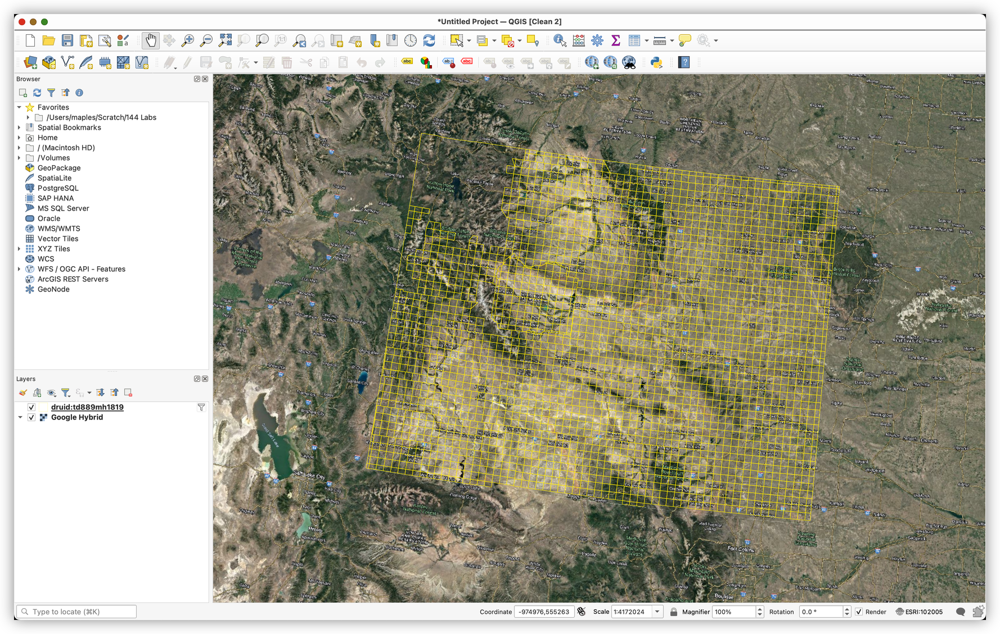

* Return to Project CRS Properties and Copy the Proj4 Text:

`+proj=eqdc +lat_0=39 +lon_0=-96 +lat_1=33 +lat_2=45 +x_0=0 +y_0=0 +ellps=GRS80 +towgs84=0,0,0,0,0,0,0 +units=m +no_defs`

1. Go to Settings>Custom Projections
2. Add a CRS 
3.

Note the following changes in bold:

+proj=eqdc +lat_0=**43** +lon_0=-**107.5** +lat_1=**37** +lat_2=**49** +x_0=0 +y_0=0 +ellps=GRS80 +towgs84=0,0,0,0,0,0,0 +units=m +no_defs

You can cut & Paste the following:

`+proj=eqdc +lat_0=43 +lon_0=-107.5 +lat_1=37 +lat_2=49 +x_0=0 +y_0=0 +ellps=GRS80 +towgs84=0,0,0,0,0,0,0 +units=m +no_defs`

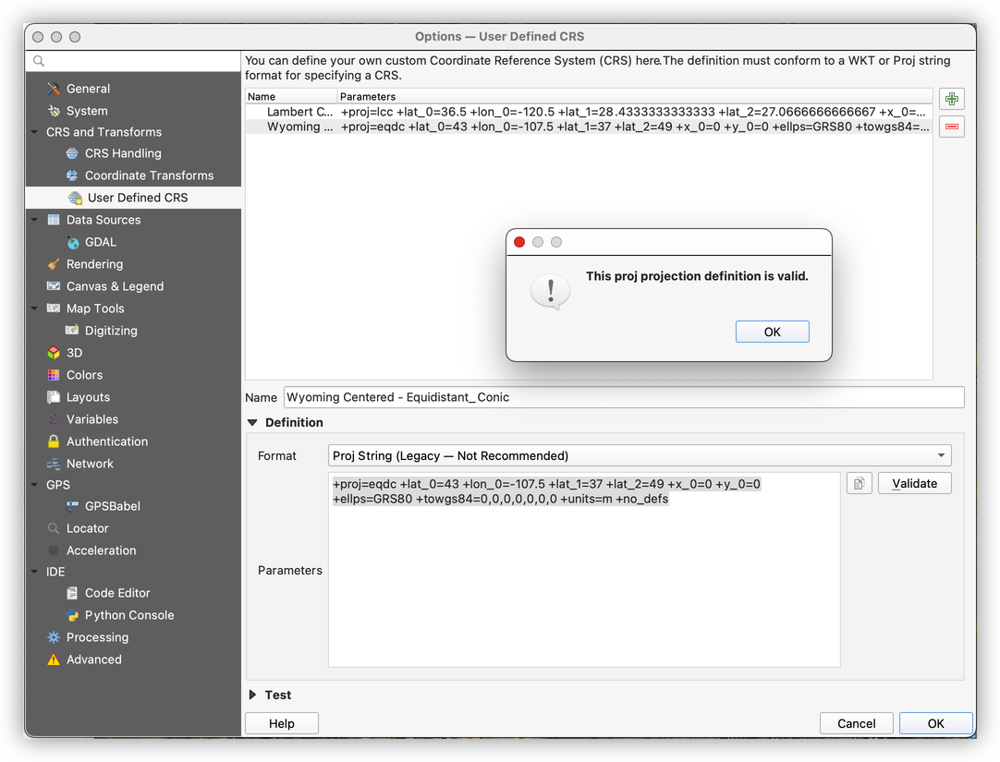

Once you've created the Custom Projection, apply it:

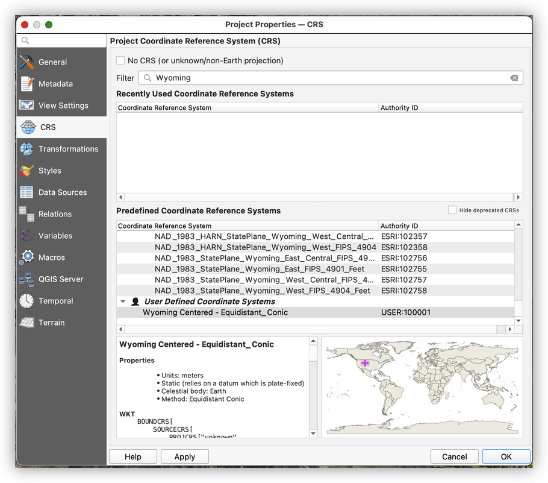

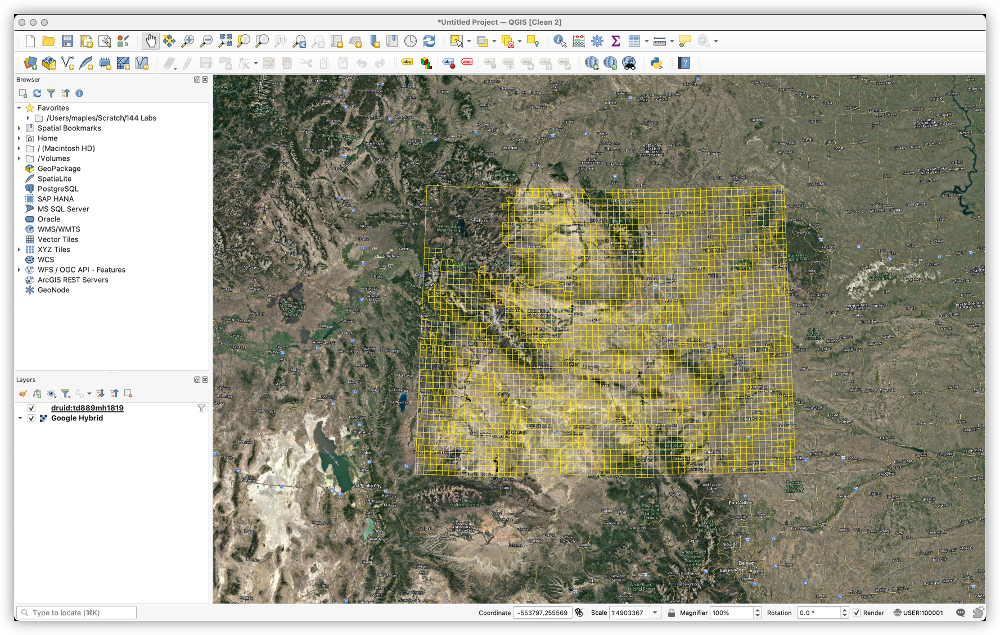

Save your Project File

## Georeferencer Plugin

* Download **Original Source File** of Wyoming Map
* Launch Layers>Georeferencer Plugin

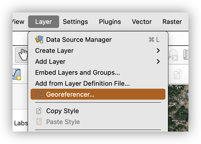

* Load jp2 image 

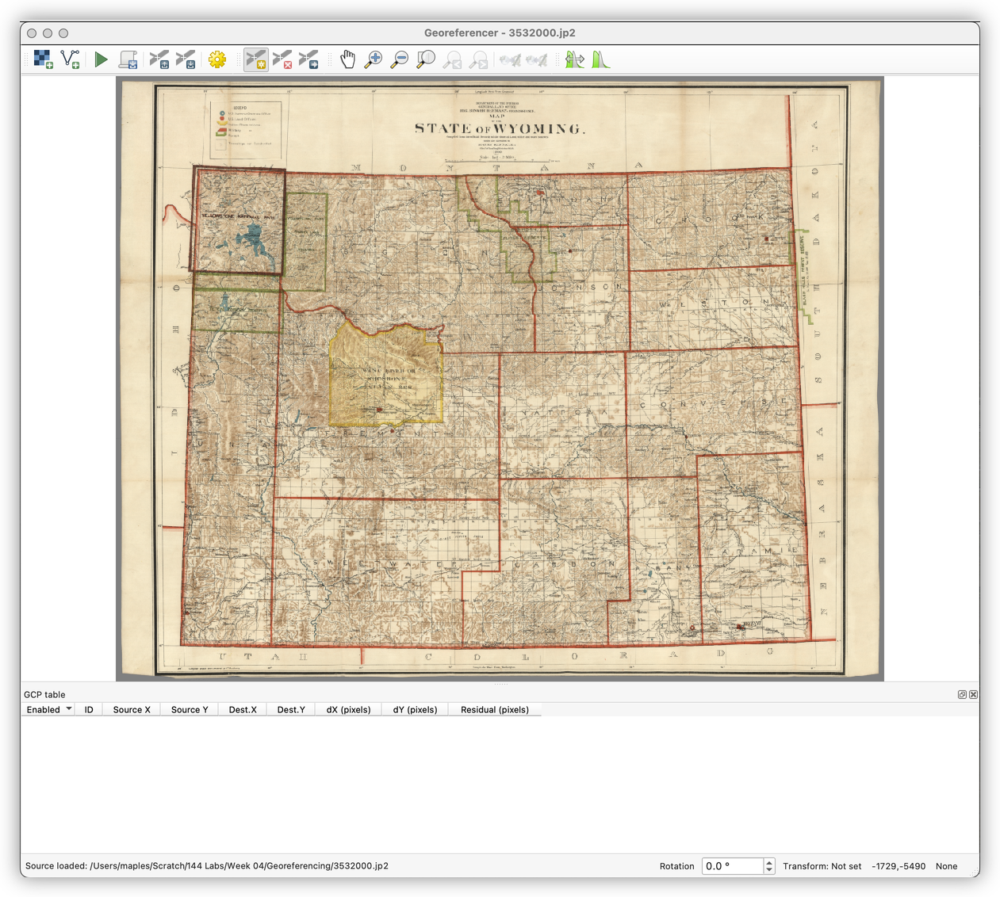

* Set Transformation Settings: 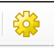
* Transformation Type: Poly2
* Resample: Cubic
* Target CRS: Your Custom Projection
* Save GCP Points
* Load in QGIS when done

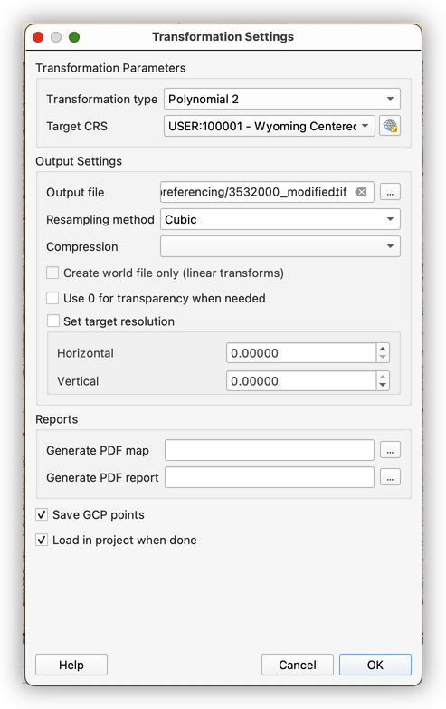

* Place points at corners and center, then work around for even coverage across the image 

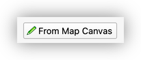

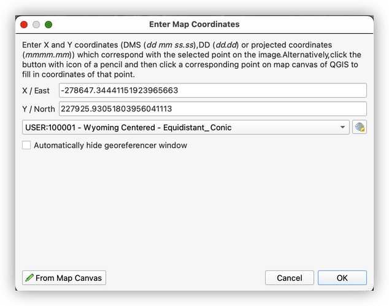

Link Georeferencer to QGIS or Vice Versa 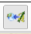

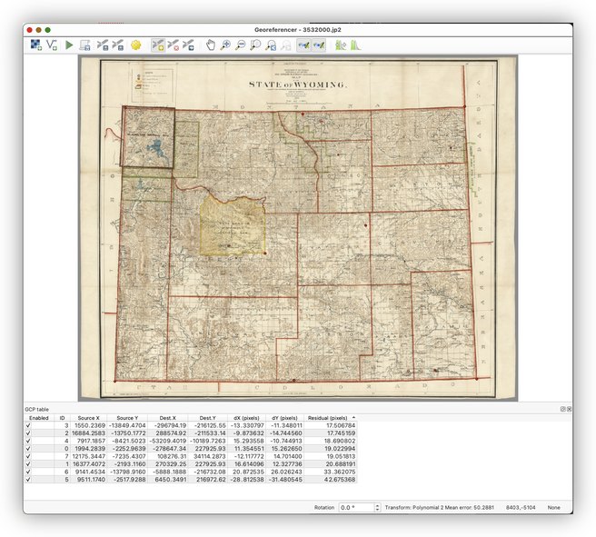

Press the Start Georeferencing Button when enough points are placed. 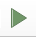

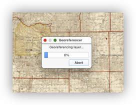

Drag the newly added image below the PLSS Layer

Check the accuracy of your georeferencing against the PLSS grid layer

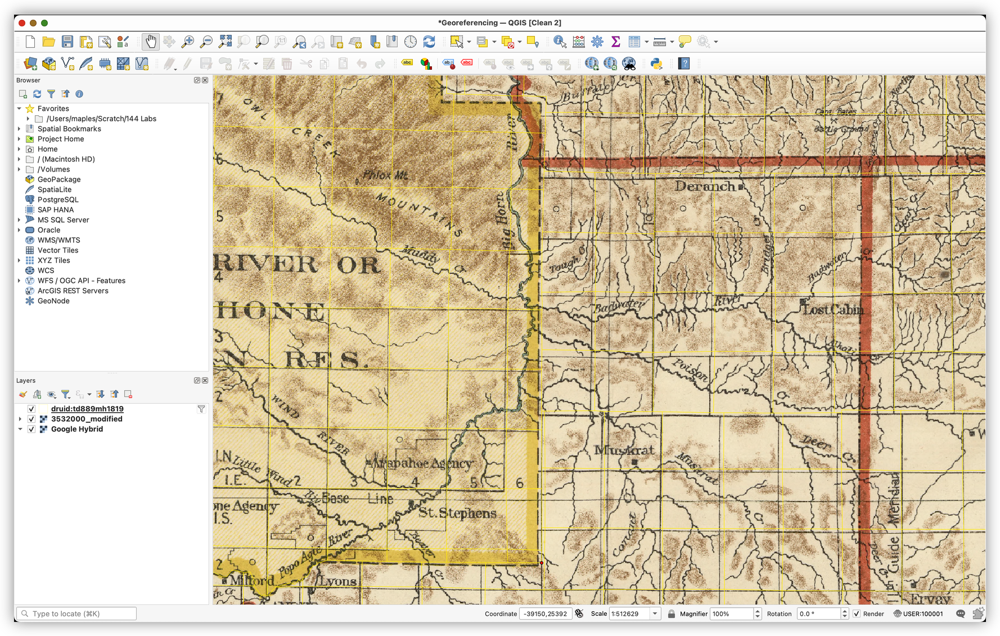
