# Areal Interpolation of Attributes with QGIS

> **Turn-in for grading:** This lab includes material that must be turned in for grading. Complete the required deliverables and submit them as instructed by the course.

## Overview

This lab uses **areal interpolation** to estimate population totals for a set of watershed polygons.

The problem is that the population data and the reporting geography do not use the same boundaries:

1. `CT_Block_Groups` contains the source population data
2. `CT_Major_Basins` contains the watershed boundaries you want to summarize to

Because those polygon systems do not align, you cannot use a simple attribute join. Instead, you will:

1. calculate the original area of each Census block group
2. split block groups where they intersect watershed boundaries
3. calculate the area of the resulting overlap polygons
4. convert those overlap areas into weights
5. use those weights to estimate population by watershed piece
6. summarize the weighted population by watershed

> **Concept note:** Areal interpolation is useful whenever attributes are reported for one set of polygons, but the question you want to answer belongs to another set of polygons. In this lab, the interpolation uses a simple area-weighting assumption.

## Getting Ready

You will need:

- [CT_Watershed_Data.gdb.zip](../data/CT_Watershed_Data.gdb.zip)
- the **Group Stats** plugin for QGIS

### Install the Group Stats plugin

You will use **Group Stats** at the end of the lab to summarize weighted population by watershed.

1. Open **Plugins > Manage and Install Plugins**.
2. Search for `Group Stats`.
3. Install the plugin.

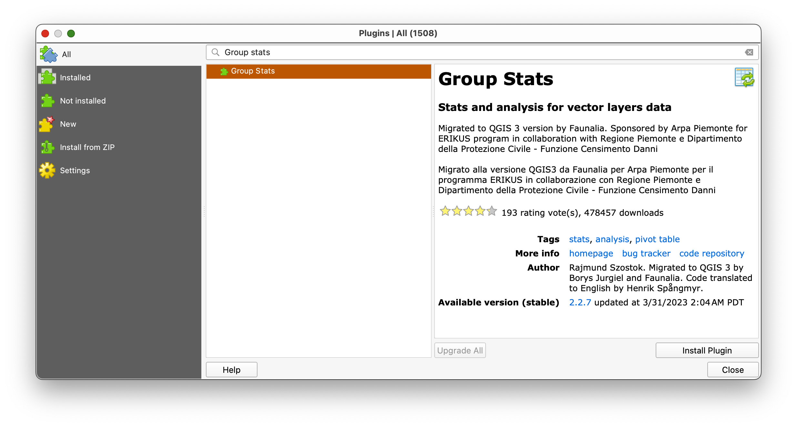

> **Concept note:** Group Stats works like a pivot table. It is helpful when you need to group rows by one field and summarize the values from another field.

### Download and unpack the data

1. Download [CT_Watershed_Data.gdb.zip](../data/CT_Watershed_Data.gdb.zip).
2. Unzip it somewhere stable on your computer.
3. Create a new project folder for this lab.
4. Save a new QGIS project in that folder as `areal_interpolation.qgz`.

## Part 1: Add the Layers and Get Oriented

1. In the **Browser** panel, browse to the unzipped `CT_Watershed_Data.gdb`.
2. Drag these layers into the map canvas in this order:
   1. `CT_State_Boundary`
   2. `CT_Block_Groups`
   3. `CT_Major_Basins`
3. Open the **Layer Styling** panel.
4. Make the polygon fills transparent and the outlines visible so you can compare the boundary systems.

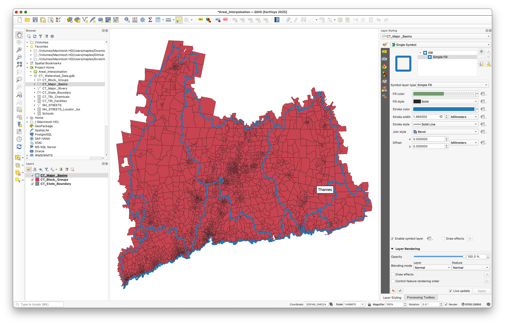

Take a moment to inspect the attribute tables.

You should notice that:

- `CT_Block_Groups` contains the demographic values you want to redistribute
- `CT_Major_Basins` contains the watershed geography you want to report to

> **Concept note:** Before doing any geoprocessing, it helps to look directly at the geometry problem. You should be able to see that many block groups do not line up with watershed boundaries.

## Part 2: Calculate the Parent Area of the Block Groups

First calculate the original area of each intact block group. This becomes the denominator in the weighting step later.

Because the source data is inside a geodatabase, use a **virtual field** for this calculation.

1. Open the attribute table for `CT_Block_Groups`.
2. Look through the fields, including the population field you will use later.
3. Open the **Field Calculator**.

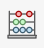

4. Create a new **virtual field** named `P_AREA`.
5. Use a numeric field type.
6. Use the expression:

```qgis
$area
```

7. Run the calculation.

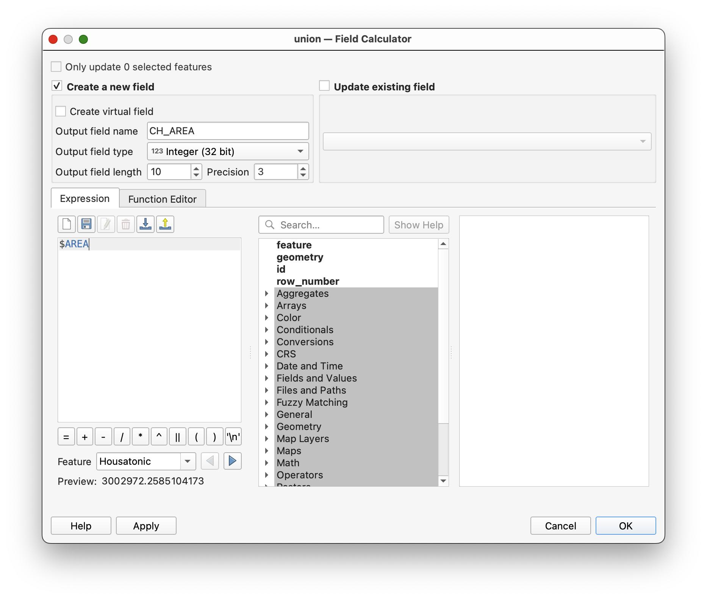

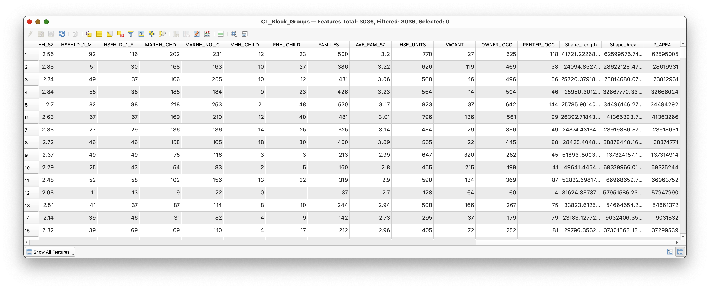

> **Concept note:** `P_AREA` stands for **parent area**, meaning the area of the original unsplit source polygon.

## Part 3: Use Union to Split Block Groups by Watershed

Now create the overlap geometry that makes the interpolation possible.

1. Open the **Processing Toolbox**.
2. Search for **Union**.
3. Set:

- **Input layer:** `CT_Major_Basins`
- **Overlay layer:** `CT_Block_Groups`

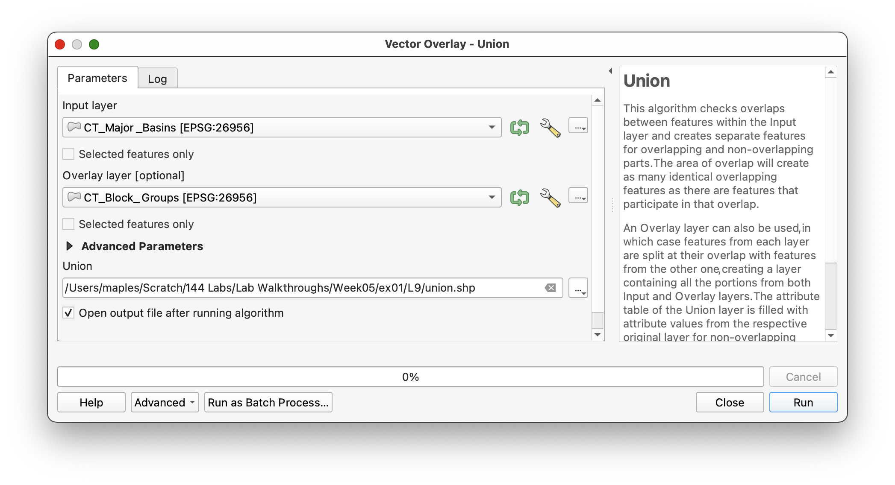

4. Save the output as `union.shp`.
5. Run the tool.

This may take a little time because the block group geometry is fairly detailed.

When the tool finishes, the `union` layer should contain:

- the attributes of both inputs
- new polygons wherever the source boundaries intersect

The `P_AREA` field should appear at the far right side of the `union` layer's attribute table.

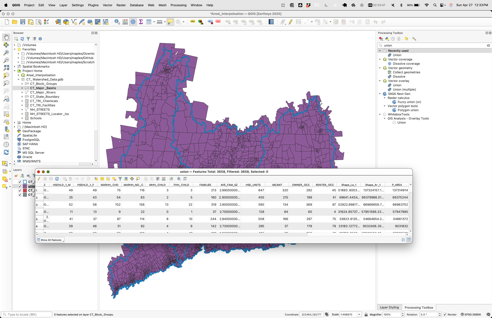

> **Concept note:** The union layer creates the new analytical units. These smaller polygons are the pieces to which the population shares will be assigned.

## Part 4: Calculate the Child Area

Now calculate the area of the new polygons created by the union process.

1. Open the attribute table for `union`.
2. Open the **Field Calculator**.


3. Create a new field named `CH_AREA`.
4. Use a numeric field type.
5. Use the expression:

```qgis
$area
```

6. Run the calculation.

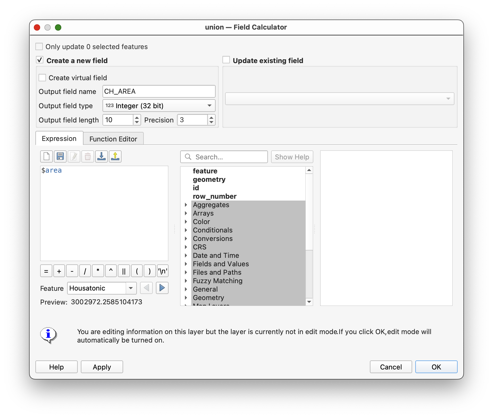

> **Concept note:** `CH_AREA` stands for **child area**, meaning the area of each smaller polygon created after the original block groups were split.

## Part 5: Exclude Records with Null Parent Area

Some polygons in the union result will not represent valid block-group pieces for the interpolation step.

1. In the `union` attribute table, click **Select features using an expression**.


2. Use the expression:

```qgis
"P_AREA" IS NULL
```

3. Click **Select Features**.

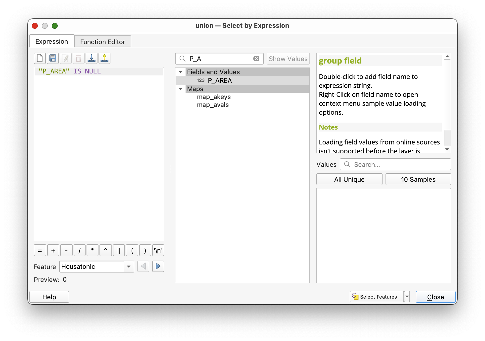


4. Close the selection dialog and inspect the selected features.

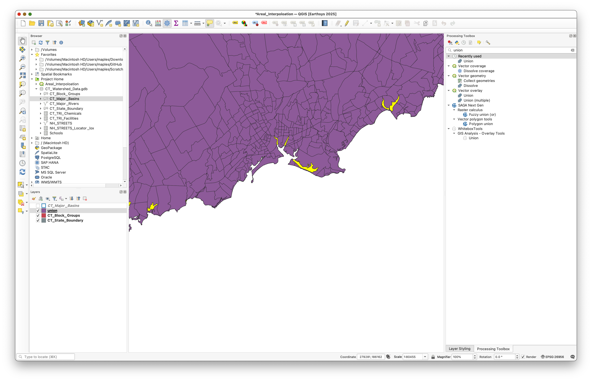

These are usually small sliver polygons that do not carry a valid parent-area value from the original block group layer.

5. In the attribute table, click **Invert Selection** so that the selected records are the ones where `P_AREA` is not null.


> **Concept note:** If you leave null parent-area records in the next step, you risk dividing by null and generating invalid weights.

## Part 6: Calculate the Area Weight

Now calculate the proportion of each child polygon relative to its original parent polygon.

1. With the non-null records still selected, open the **Field Calculator**.
2. Create a new field named `WEIGHT`.
3. Use **Decimal number (real)** as the field type.
4. If available, check **Only update selected features**.
5. Use the expression:

```qgis
"CH_AREA" / "P_AREA"
```

6. Use a precision of several decimal places.
7. Run the calculation.

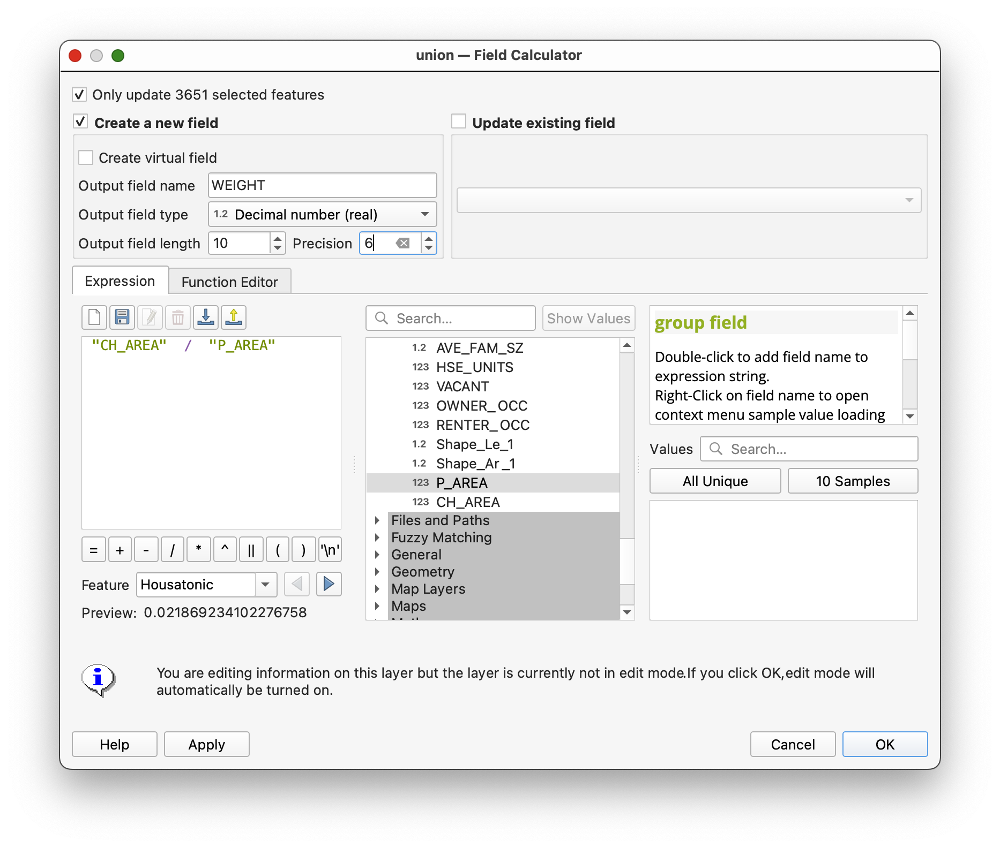

Many values will be `1`, while others will be smaller than `1`.

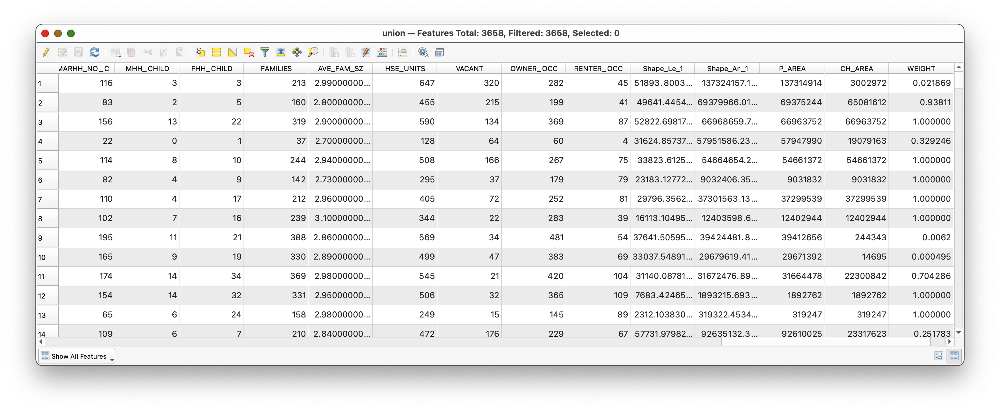

> **Concept note:** A value of `1` means the original block group was not split for that record. A value less than `1` means only part of the block group's area falls within that watershed polygon.

## Part 7: Calculate Weighted Population

Now apply the area weight to the block-group population field.

1. Open the **Field Calculator** again for the `union` layer.
2. Create a new field named `WT_POP`.
3. Use **Decimal number (real)** as the field type.
4. Use the expression:

```qgis
"WEIGHT" * "POP2004"
```

5. Run the calculation.

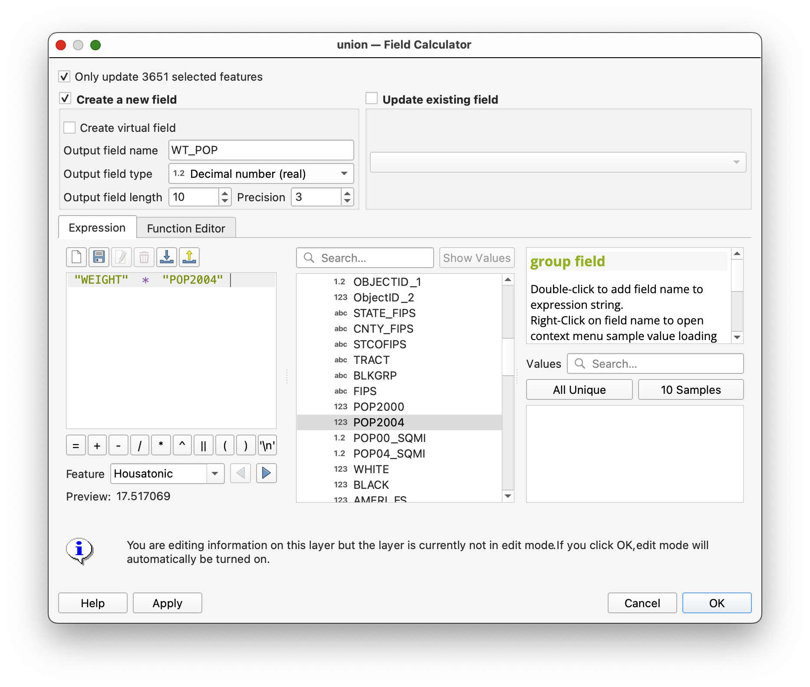

6. Save edits if QGIS prompts you.
7. Toggle off editing.
8. Clear the selection.


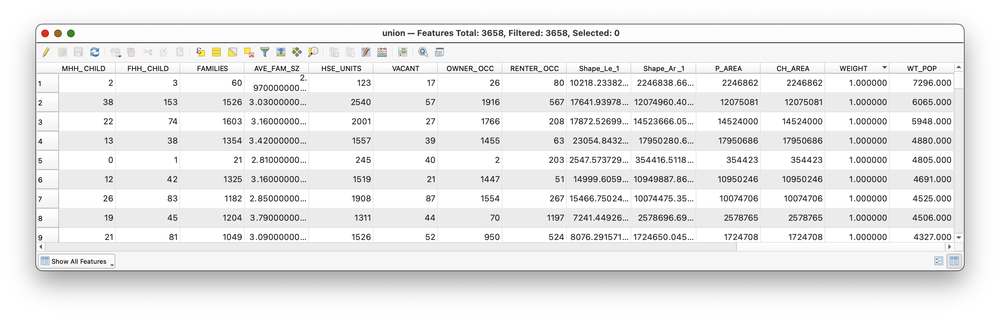

> **Concept note:** `WT_POP` is the estimated population assigned to each child polygon after the area-based redistribution. This is the value you will summarize by watershed.

## Part 8: Summarize Weighted Population by Watershed

Now aggregate the interpolated values to the watershed level.

1. Open **Vector > Group Stats**.
2. Use the `union` layer as the input table if prompted.
3. Set:

- **Columns:** `sum`
- **Rows:** `MAJOR`
- **Value:** `WT_POP`

4. Click **Calculate**.

The result should be a grouped summary table showing the estimated total population for each major basin.

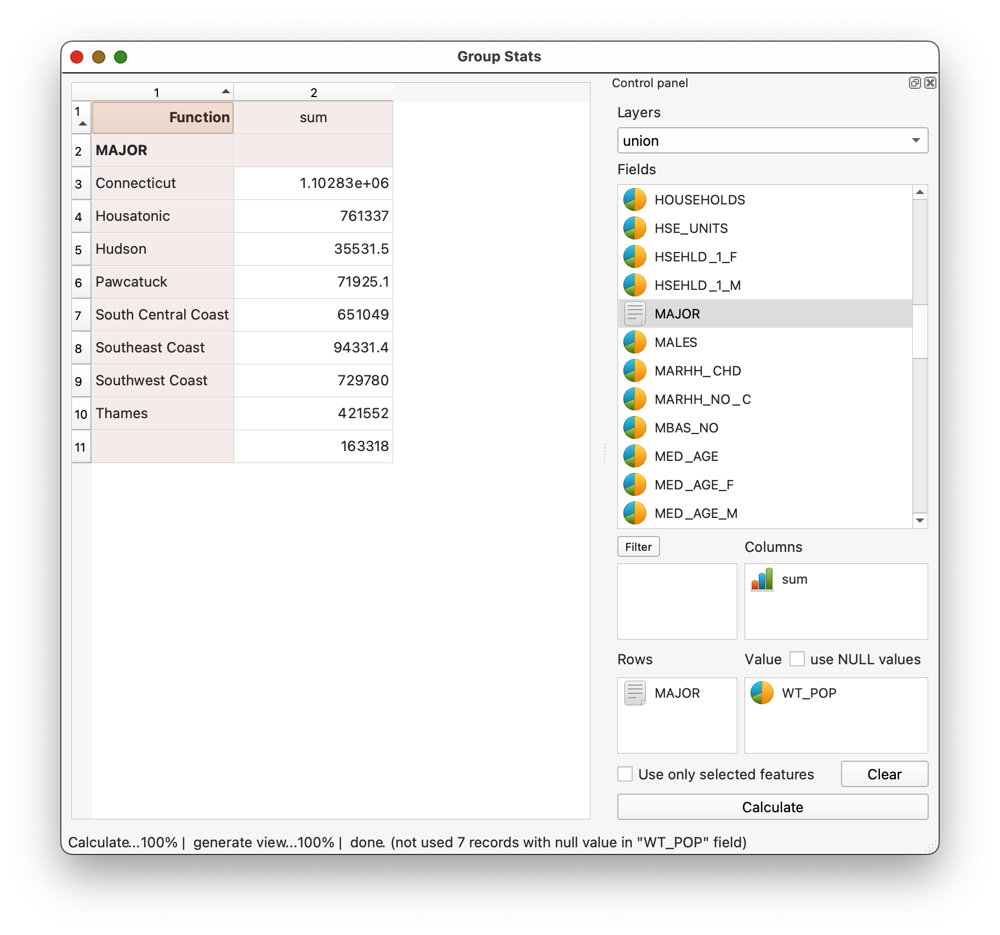

If you want to save the result:

1. select the output table
2. use the plugin export option to save the result as CSV

> **Concept note:** This final step is where the interpolation becomes useful. Up to this point, you have been preparing weighted pieces. Group Stats recombines those pieces by watershed so the result can be interpreted in the target geography.

## Deliverable

Submit:

- a screenshot of the **Group Stats** results showing weighted population by watershed

## What You Should Understand After This Lab

By the end of the exercise, you should be able to explain:

- why areal interpolation is needed when two polygon systems do not align
- why the union step creates the geometry needed for weighting
- why `CH_AREA / P_AREA` produces the area share used in the estimate
- why the final watershed population values are estimates rather than direct Census counts
