# **Week 4: Terrain Analysis**

_What You'll Learn_:

Spatial analysis and modeling with raster data. There is a mix of old and new functions used in this lab. We'll explain the new, but you are expected to reference old labs as needed. You should read chapter 10 in the GIS Fundamentals, textbook before performing this lab.

## Install WhiteBoxTools (if you haven't)

You will use QGIS to produce the final maps and will use **WhiteboxTools** for the analysis. This is because WhiteboxTools is currently much better than QGIS for terrain and watershed analysis functions. _There is a broader range of functions, clearer documentation, and the functions more often return the intended result_.

Whitebox is free and open source, and can be run, either from the command line, or through QGIS, as an added Processing Provider.

Please refer to [Week 01 Lab 01 for instructions on installing WhiteBox Tools in QGIS](https://github.com/mapninja/Earthsys144/blob/master/Labs/Week_01/CleanQGISInstallationforMac.md).

If you find that you are having trouble with any tools in Whiteboxtools, once you have set it up, my guess is that you are on a Mac. If WBT throws errors the first time you run it, go to your **MacOS System Preferences>Security & Privacy>General** and click on the **Open Anyway** button. You may have to do this, again, for the **ConditionalEvaluation tool**, which is a separate exe file in Whitebox.

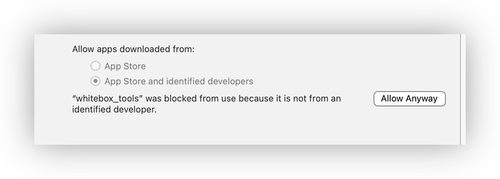

## Download the Data

Data for Exercises [Dataset 01](https://github.com/mapninja/Earthsys144/raw/master/data/TerrainLabData01.zip)   /   [Dataset 02](https://github.com/mapninja/Earthsys144/raw/master/data/TerrainLabData02.zip)  / [ViewStation.shp](https://github.com/mapninja/Earthsys144/raw/master/data/ViewStationSHP.zip) (the Viewpoint.shp file may be corrupt, use this one for the viewshed analysis.)

1. `Valley3` and `Valley9`, which are 3m and 9m Digital Elevation Models (DEM) of a portion of southeastern Minnesota;
2. `mar_rd83.shp`, a vector road layer, and
3. `mardem`, a 30 meter resolution raster elevation grid; and
4. `Shasta`, a 30m DEM in northern California.

All data are in `NAD83 UTM coordinates`, Z (vertical/elevation) units in `meters`, the Minnesota files in `zone 15`, and the California files in `zone 11`.

_What You'll Do_: You'll learn basic raster map algebra, while merging the multi-resolution Minnesota DEMs

## Exercise 1: Resampling & Merging Rasters

1. If you haven't, open the QGIS application and save your **Project Document** to the folder you have extracted the Lab Data to as something like `Terrain01`.
2. Using the **Browser Panel**, Add the two raster layers `valley3.tif` and `valley9.tif` into the new project. You may be prompted about coordinate transformations, you can accept the default.

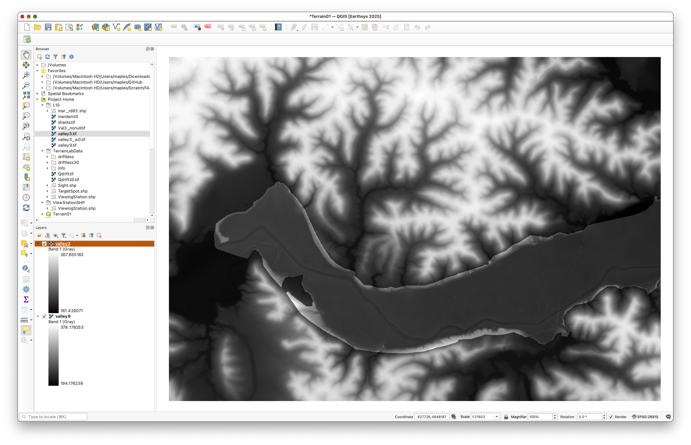

Your data should appear similar to the above, with the higher resolution **valley3** raster in the valley across the bottom center, and the coarser resolution **valley9** data set over the entire area. Rearrange the layers so the the `valley3` layer is on top, if not already.

1. Toggle the two data sets on and off to view their extent.
2. Toggle off the **valley9** data so that it does not display, you should see a form something like a snake's head facing towards the left.

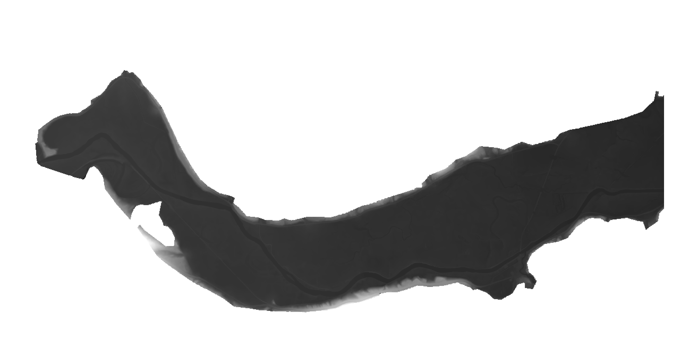

2. With Valley3 selected in the Layers Panel, use the Identify Features tool  to click and see the Raster Pixel values for the `Valley3` layer. Click outside the area of symbology (where the now toggled off `valley9` layer would appear) to see that the values in that area are ‘No Data’

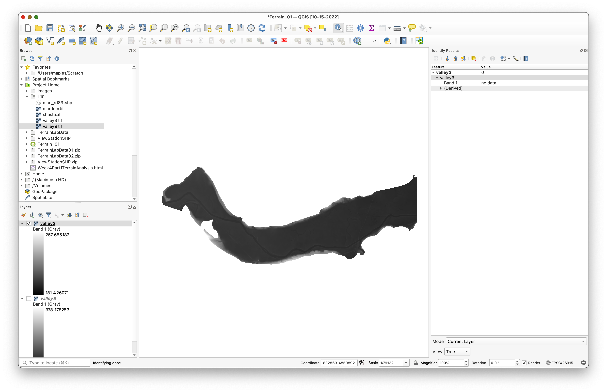

### Creating a Hillshade

Hillshades are derived from **Digital Elevation Models** (DEMs) and model the shadows and highlights created by sunlight coming from a particular direction in the sky. They are useful for cartographic design, but also useful for comparing and evaluating elevation data. Here we will use them to compare the difference in detail between our two DEM layers, `valley3` & `valley9`.

1. From the Main Menu, go to **Processing>Toolbox**, to open the tools we will use.
2. Use the Processing Tools **Search Box** to search for “`hillshade`”
3. Open the **Hillshade** tool from the first QGIS Tools section, and use the following settings:
   1. **Elevation layer**: `valley3`
   2. **Z factor**: `1` (This value is used to convert elevation units when they differ from the linear unit of the data CRS)
   3. **Azimuth** (horizontal angle/direction): `315.0` (This is the direction that sunlight is being modeled from)
   4. **Vertical angle:** `25` (This is the height of the modeled source of light)
   5. Save the hillshade file to your Lab Data folder, as `hillshade3.tif`

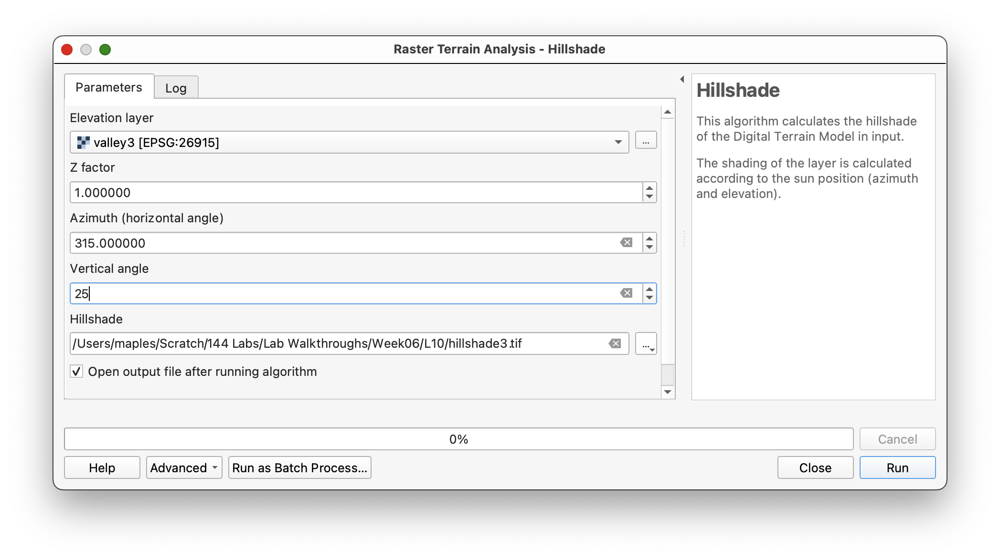

1. Click Run to create a `hillshade3.tif` layer.

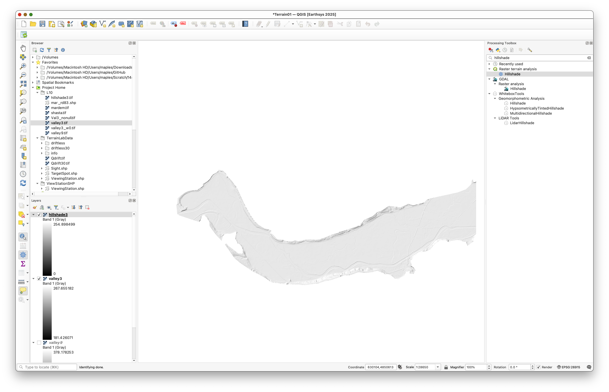

2. Repeat the above using your valley9.tif layer as the input, but using the same hillshade model settings. Save as `hillshade9.tif`, in your Lab Data folder.

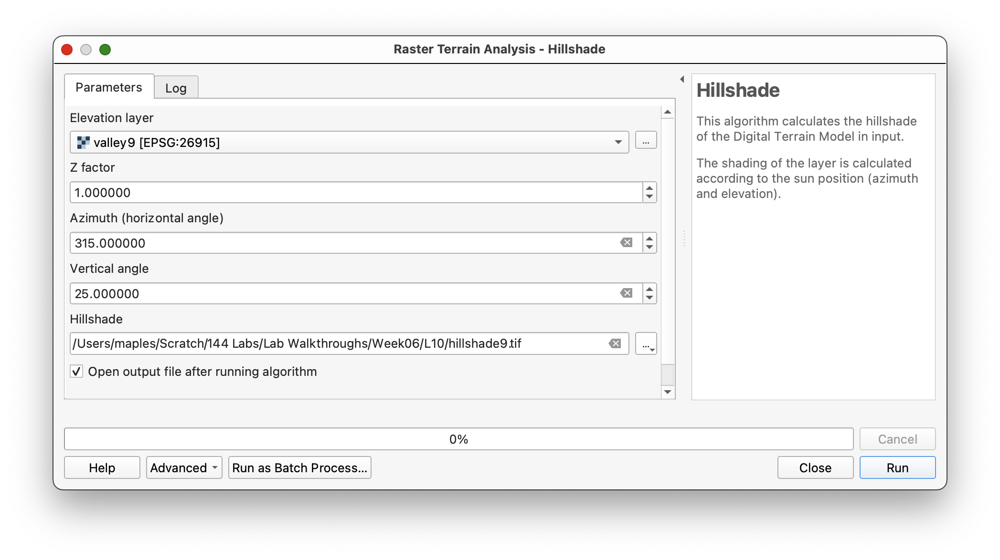

3. Drag the `hillshade3` layer so that it is displayed on top of the `hillshade9` layer.

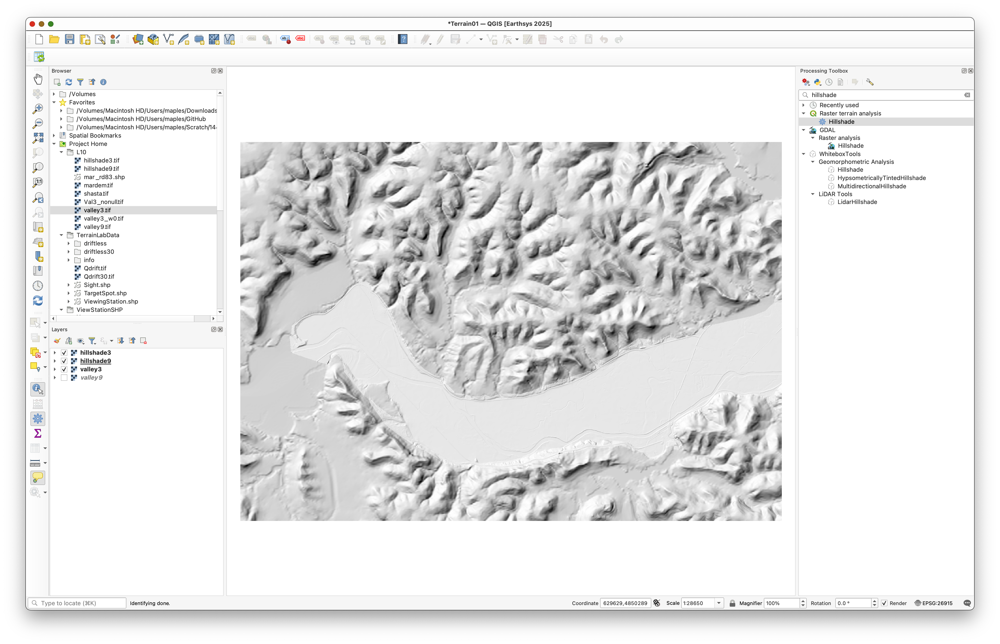

Zoom in and out of the map canvas, toggling the `hillshade3` layer on and off to observe the finer detail in the stream bank seen in the higher resolution layer.

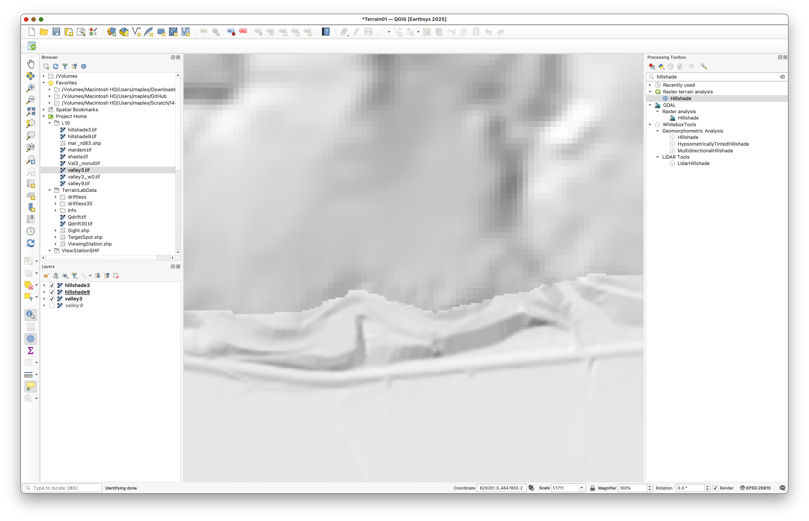

### Converting NoData/NULL values to zeros

Recall that most raster operations return `NoData/NULL` as cell output when any input cell is `NoData/NULL`. This means that first, we'll need to substitute `0` values for `NoData/NULL` values in the `Valley3` data set. `Valley3` has `NoData/NULL` values over most of its area, so combining it with `Valley9` requires we change `NoData/NULL` to something else.

1. Return to the **Processing panel** and search for '**nodata**'
2. Use the **Fill NoData cells** tool to create a new version of `valley3`, without NoData values.
3. Set **Fill value** to `0` and name the Output raster `valley3nonull.tif`

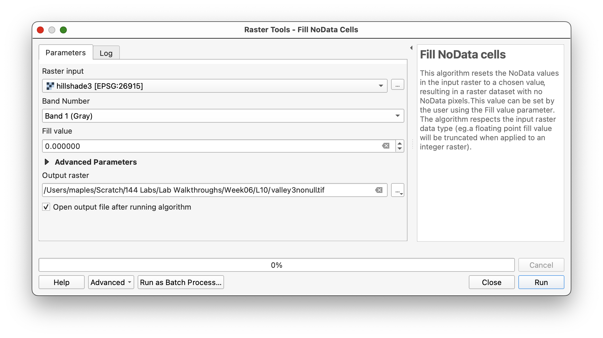

You should end up with something similar to the below image. The important thing to note is that the background (here, black) that used to be `NoData/NULL` values, is now `0`, and so is no longer transparent.

## Resampling

Now we will resample our `valley9` layer to have the same pixel dimensions as our higher resolution, `valley3nonull.tif` layer

1. Return to the **Processing panel** and search for '`resample`’
2. You will use the **WhiteboxTools>Resample** tool to resample the elevation values from your `valley9` DEM into a new `valley9_3m.tif`
3. Use the Select Input Files button! to select your `valley9` DEM layer, as shown, below, then click OK.

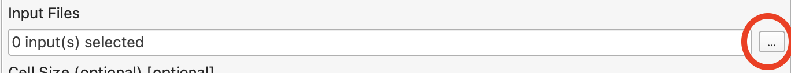

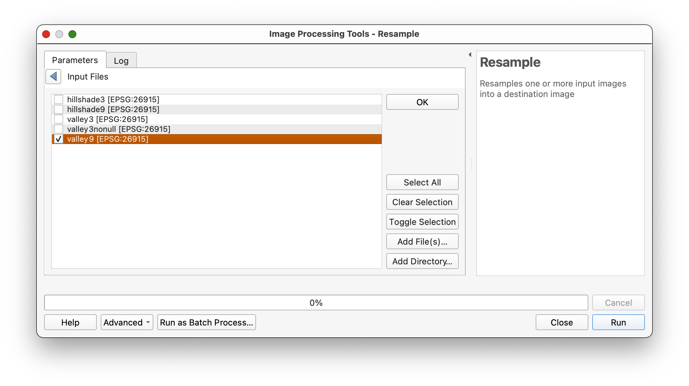

4. Use the **Base Raster File** dropdown to select the `valley3nonull` layer as your “template” layer.
5. Select `nn` (Nearest Neighbor) as your **Resample Method**. This will preserve the original values of your DEM, but split each 9m pixel, into a 3x3 block of pixels, all with the same elevation value.

   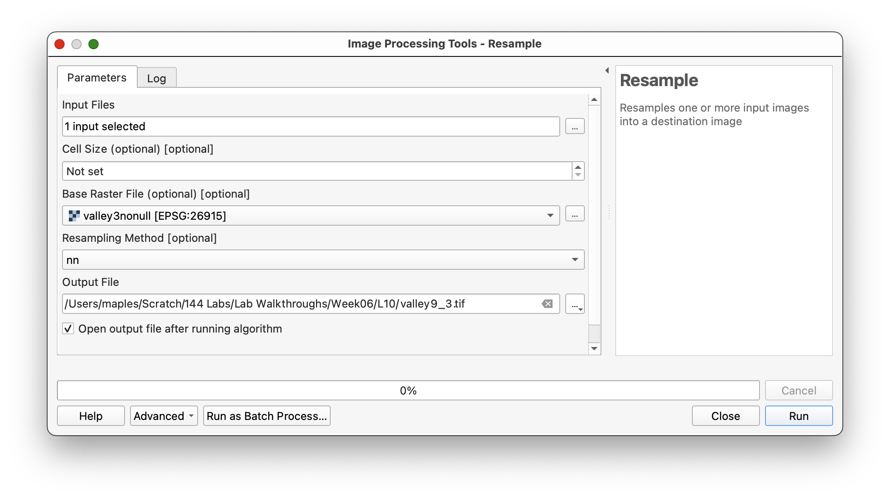
6. Browse and save the Output File as `valley9_3m.tif` and click **Run**.

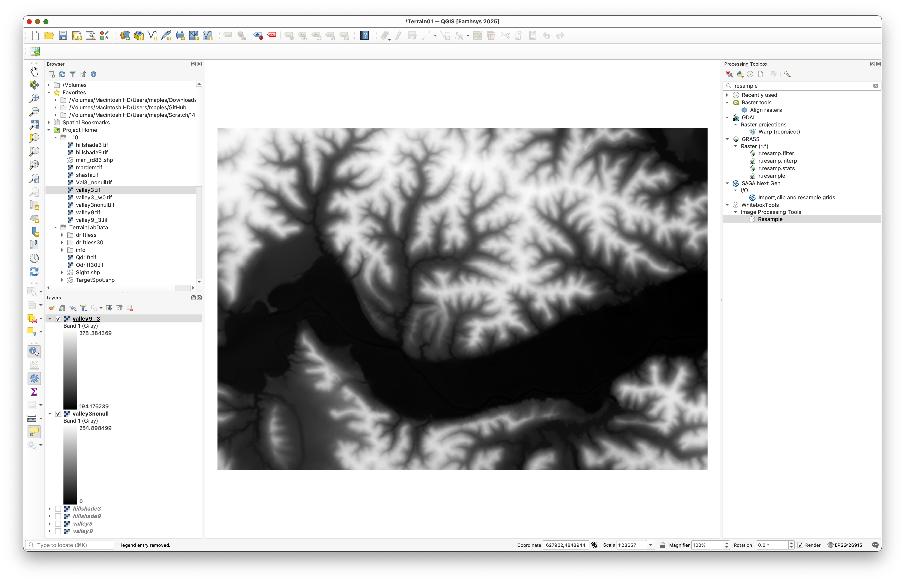

1. Right-click on the new `valley9_3m` layer in the Layers panel and select **Properties**
2. Use the **Information** Tab of the **Layer Properties** to confirm that this layer has a **Pixel Size** of `3,-3`

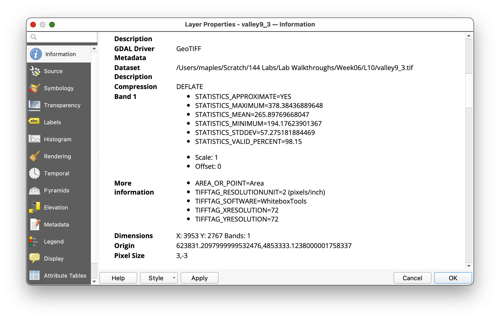

## Merging Rasters with Conditional Evaluation

1. Search for the **WhiteboxTools>ConditionalEvaluation tool** by searching for "`conditional`"
2. Set the Input Raster as `valley3nonull`
3. Use the following as your **Conditional Statement**:

`value != 0`

[note that the above would read “value does not equal 0”]
3. Value where **TRUE**: `valley3`
4. Value where **FALSE**: `valley9_3m`
5. **Save** to a File called: `valley_merged.tif`

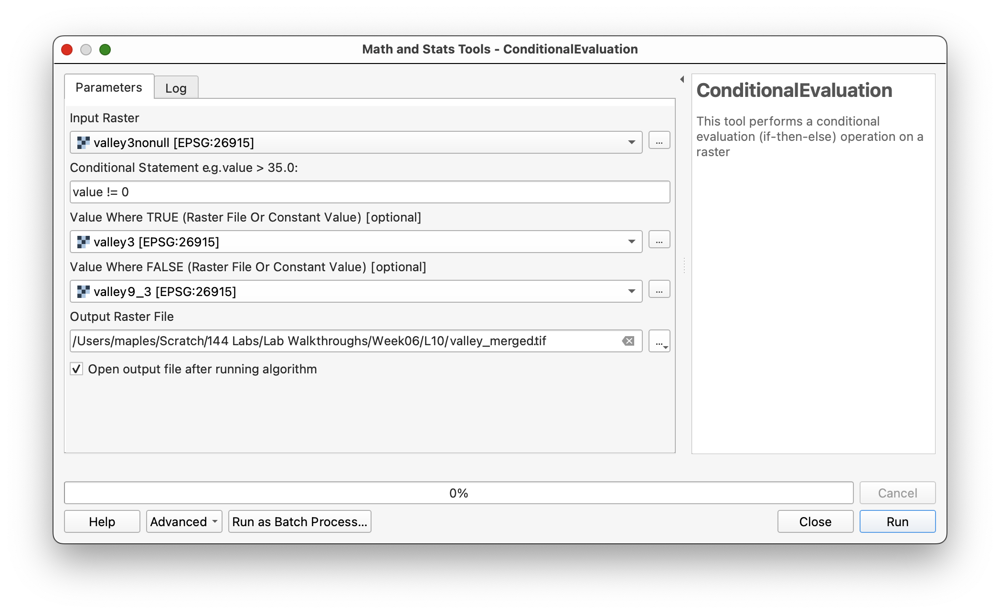

This tool will choose between the two datasets, for the output, using the following logic:

"**If** the value of `valley3nonull` **is not** equal to zero, **keep** the value of `valley3nonull`, but **if** it **_IS zero_**, **use** the value of `valley9_3m`"

1. **Calculate a hillshade** for the merged DEM, `valley_merged`, and verify the better detail in the valley bottom.

You should have something that looks like the image here, with the higher detail in the valley bottom, and the lower detail in the uplands. You may see a "seam" where the two data sets met, as well as some checkerboard patterning that may be apparent when you create the **hillshade** for the merged layer.

This "checkerboard" is a combination of artifacts from the processing we just did, and the interaction between the ***resolution of the data and the monitor you are viewing*** it on. It often changes, depending on the scale you are looking at the data, at. You can reduce the patterning using the Resampling options, in the Layer Styling Panel, with the final **hillshade** layer active.

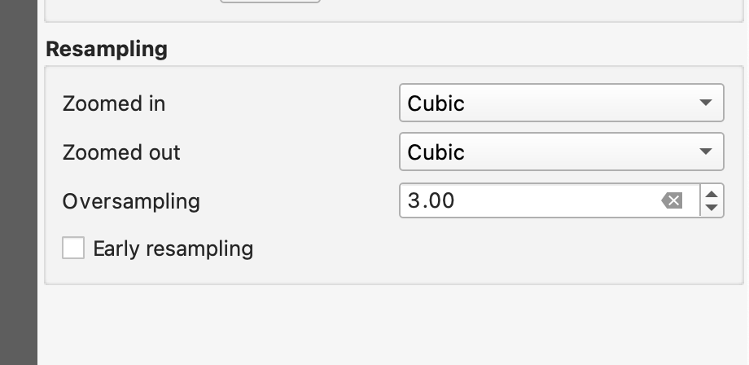

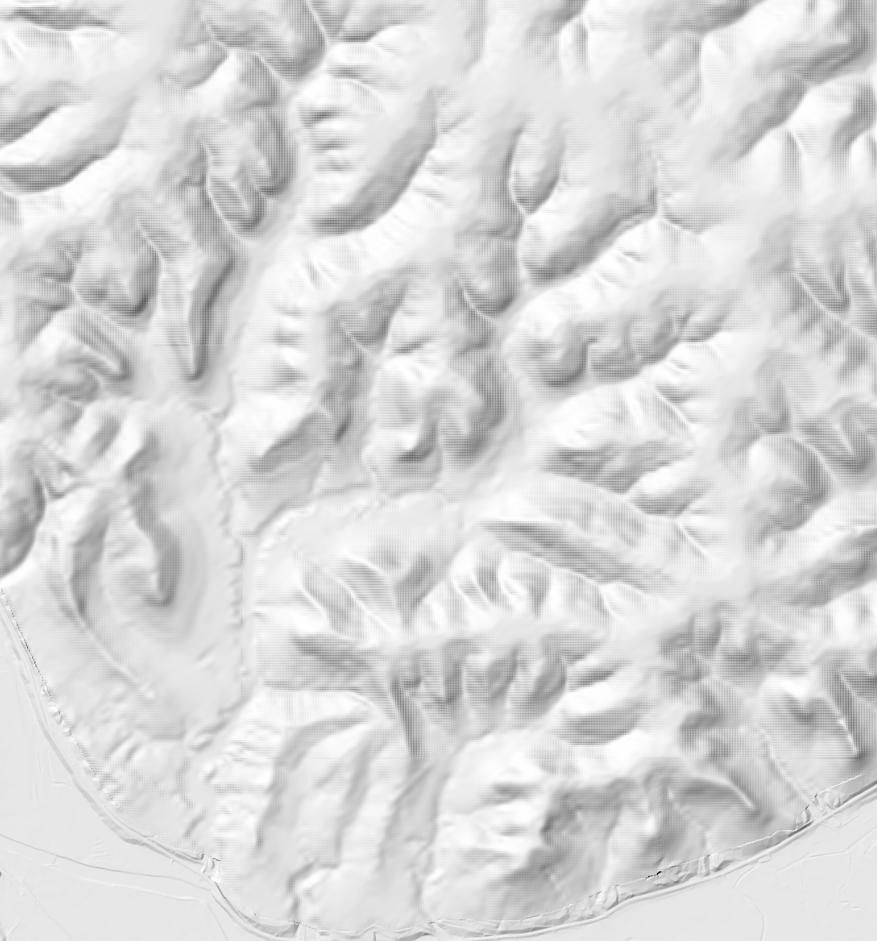

### Visualizing Terrain

1. Make sure that your `valley_merged` layer is above it’s hillshade layer, in the Layer panel, and therefore in the map canvas.
2. Open the **Layer Styling Panel**, with your `valley_merged` layer selected and use the settings you see, at the right, to symbolize your merged DEM layer. Feel free to use your creativity, select a different Color Ramp, etc…
3. Important settings to note are:
   1. Singleband pseudocolor as the styling type
   2. Linear Interpolation
   3. Choose a color ramp
   4. Mode: Continuous
   5. You may need to click on the Classify button once you have set the options
   6. Blending Mode: Multiply

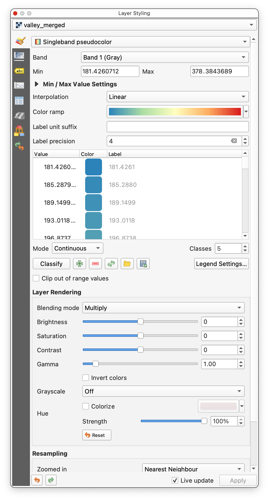

5. If you have your hillshade below your DEM layer, you should now see that the hillshade beneath is providing some sense of the topography, by providing shadows and highlights to your DEM.

## To Turn In:

Now switch to QGIS Layout Manager and create a map layout, using what you have learned, thus far. Feel free to use your creativity, but be sure to include:
6. Title
7. Date
8. Cartographer’s Name
9. Scale bar
10. Text indicating the CRS used (EPSG, as well as the name)
11. Legend

Note that, to duplicate my example, you will need to spend some time customizing the Legend Items, and creating text boxes, using the Add Label tools. Export to PDF and submit with your other assignments.

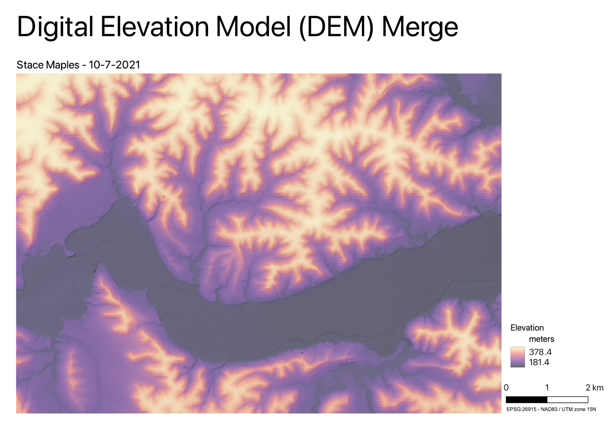

## Exercise 2: Terrain Analysis

_What You’ll Learn_: Basic terrain analysis functions, including watershed, viewshed, and profile processing.

You should read chapter 11 in the GIS Fundamentals textbook before performing this lab.

Data are located in the [https://github.com/mapninja/Earthsys144/raw/master/data/L11.zip](https://github.com/mapninja/Earthsys144/raw/master/data/L11.zip) file

all in `NAD83 UTM zone 15` coordinates, meters, including:

1. `Qdrift`, a GeoTiff elevation, 3m cell size, Z units in meters, and
2. `Qdrift30`, a GeoTiff elevation grid, 30m cell size, Z units in meters
3. `ViewingStation.shp`
4. `targetspot.shp`
5. `sight.sh`
6. There are also WhiteboxTools versions of both _Qdrif_t and _Qdrift30_ in the `L11.zip`

### Background

Elevation data, also known as terrain data, are important for many kinds of analysis, and are available in many forms and resolutions. In the U.S. there have long been available nearly nationwide data at 30 m resolution. Since the early 2000’s these have largely been replaced by 10 m resolution DEMs, and now many parts of the country are developing higher resolution DEMs, and 1 to 3 meters, based on LiDAR data collections.

Although the most common use of DEMs is as a shaded relief background for maps, we often are interested in working with terrain data for calculating slopes, aspects, steepness or slope along profiles, viewsheds, as well as watershed and other hydrologic functions.

## Viewshed and Profile View

## Creating a terrain profile plot

1. **Start a New Map Project**, and save it to the folder you unzipped your Lab Data to.
2. Add the `Qdrift.tif`, `ViewingStation.shp` and the `Sight.shp` shapefiles datasets. Rearrange the layers so that the two shapefiles are on top, if necessary.

This displays your view location, a single point in the bottom left portion of the Qdrift DEM. This also identifies a “line of sight”, defined from the sight.shp file.

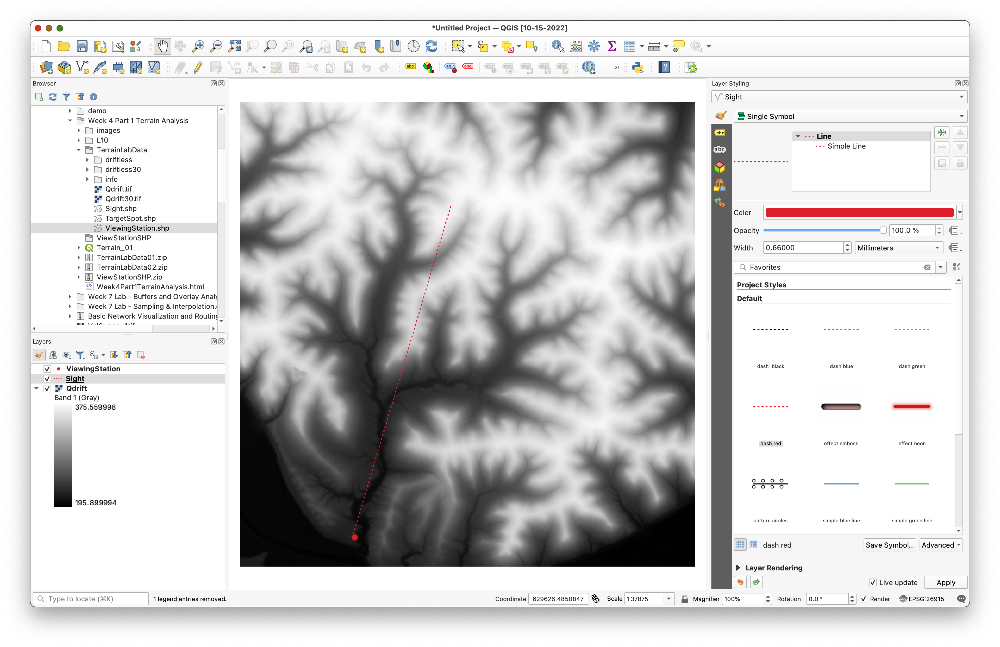

1. Use the `Layer Styling Panel` to make the `ViewingStation` and `sight` layers more visible.
2. In the **Processing Panel**, search for **‘Profile’** and launch the **Profile Tool** from the **WhiteBoxTools** toolset.
3. Use `Qdrift` as the **Input Surface File** and `sight.shp` as the **Input Vector Line File**.
4. Save the **html** output to your project folder, so you can access it later, if needed.

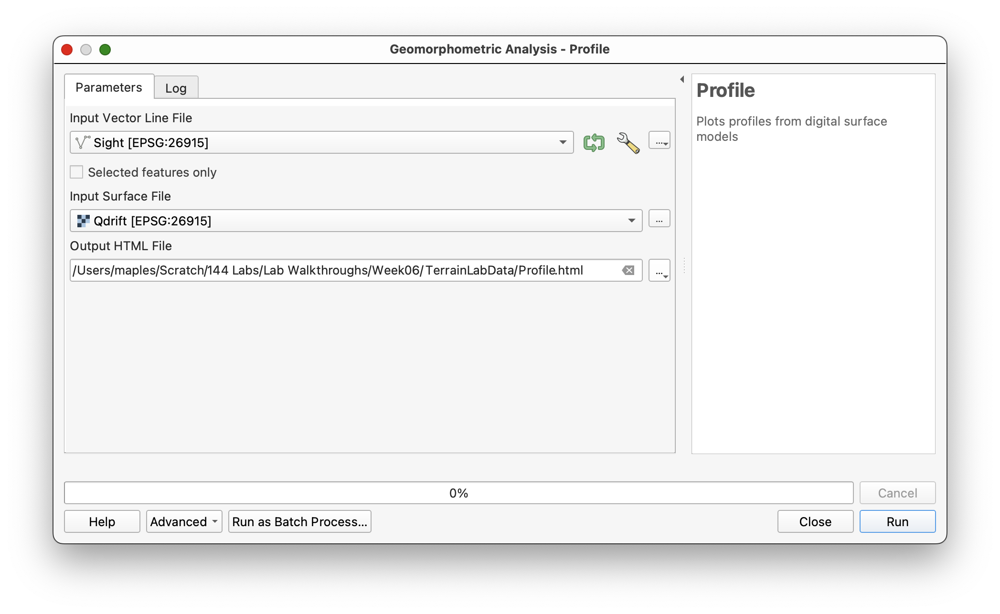

The tool should result in a new Browser Page opening, and displaying the results, as an HTML page.

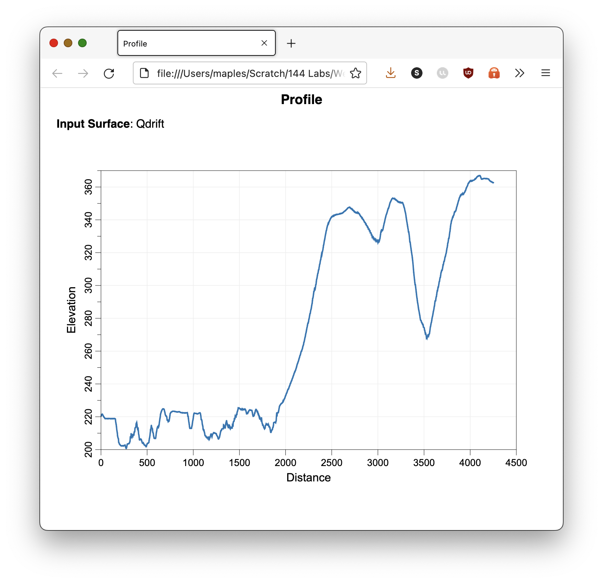

2. **Take a Screenshot of the Profile Result** in your browser to use it in your layout to turn in, later.
3. Close the **Profile Results** page.

## Create a Viewshed

1. In the **Processing Panel**, Search for the **Viewshed** tool, which is also under **WhiteboxTools> Geomorphometric Analysis> Viewshed**
2. Specify `Qdrift` as the Input DEM,
3. Specify `ViewingStation` as the **Input Viewing Station File** and name the output : `Visible`
4. Set the **Station Height** to `1.8` (this is the height of the viewer in meters, about 5’10”).
5. Save the Output file as `viewshed.tif` and Run the tool.

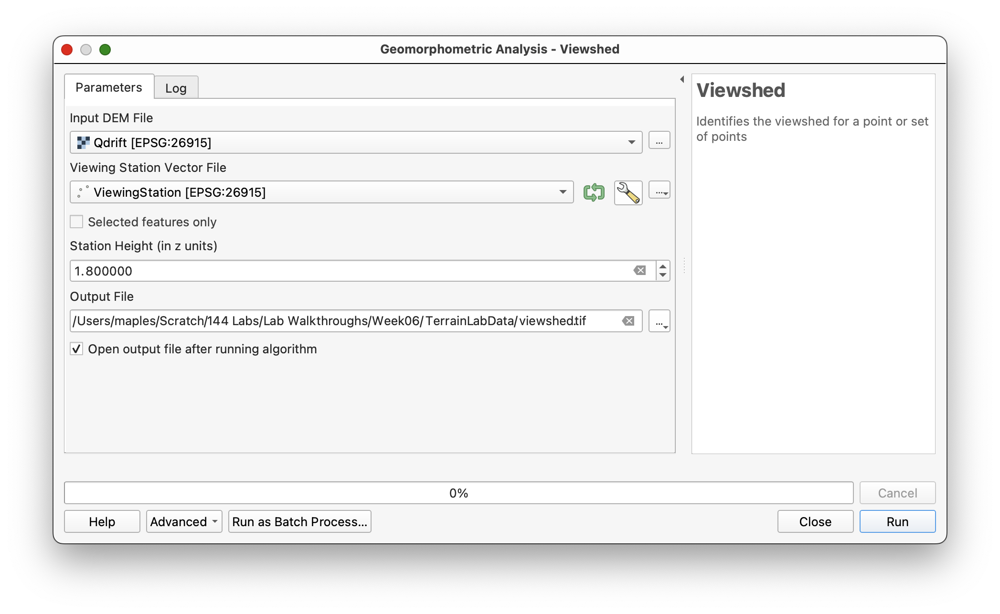

This will display something like the figure below. We want to alter this, so that the visible areas from the point (white in the image) display on top of the elevation layer, but the areas that aren’t visible from the viewing point are shown as transparent.

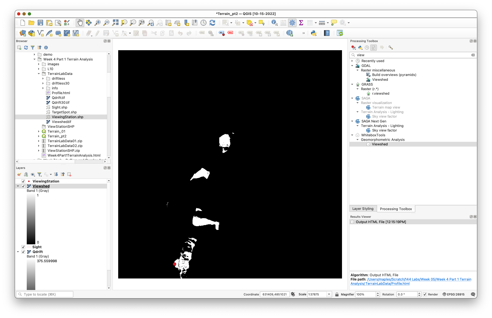

1. Select the `viewshed` layer in the Layer Panel, then activate the **Layer Styling Panel**.
2. Change the Layer Style from Singleband Grey to  **Paletted/Unique Colors**
3. **Click** on the **Classify** button to allow the **Styling Pellette** to identify the number of unique values in the dataset, to **apply a color palette**, which will likely be terrible.
4. **Right-click on the Color** for `Value:0`, select **Change Opacity** and set the **Opacity** to `0`

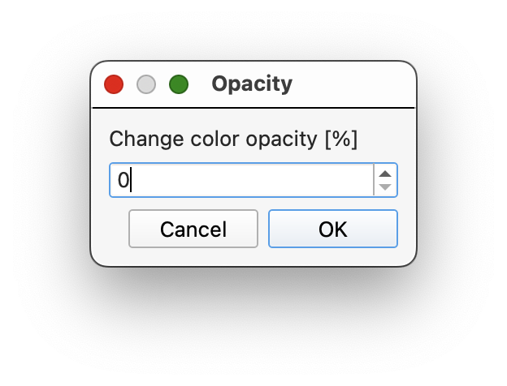

5. **Right-click on the Color** for `Value:1`, and **select Change Color**. Use the **Color selector** to select a _**color of your choice**_.

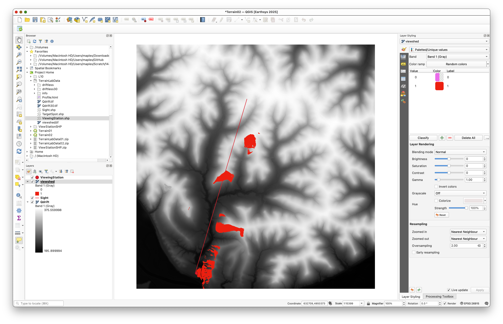

1. Make sure that your Project and all of your Layers are properly saved as files (that you haven’t been using the Temp Layer feature in QGIS Processing Tools), because you will use them later.
