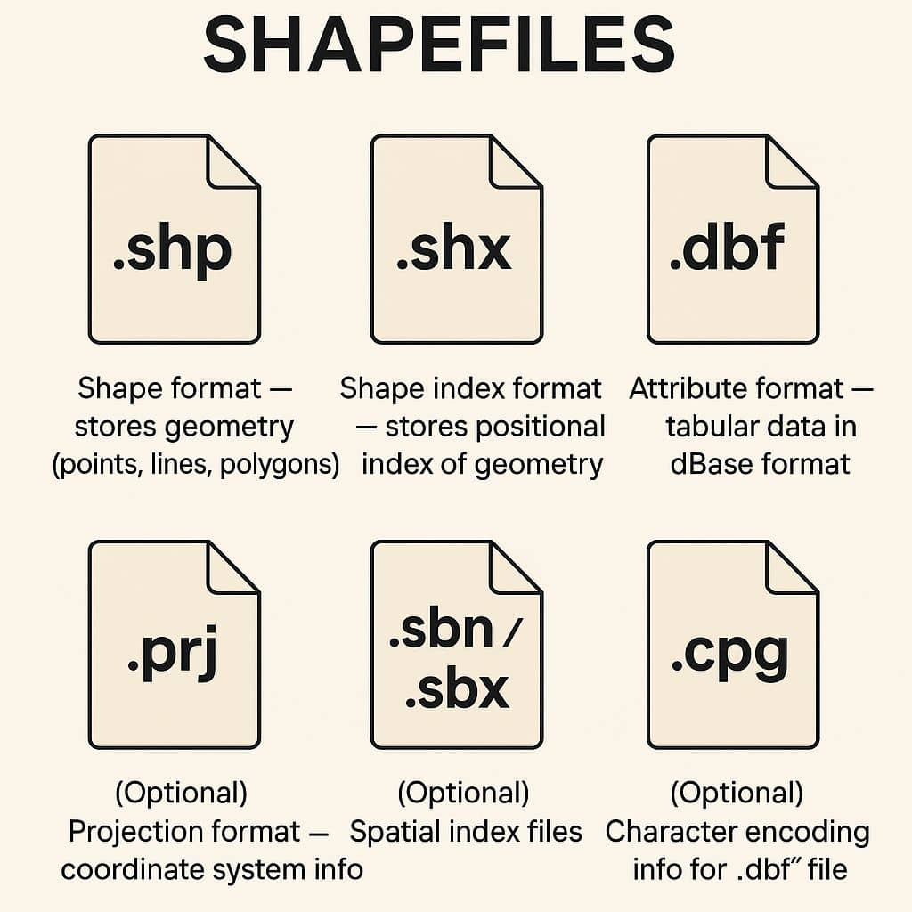
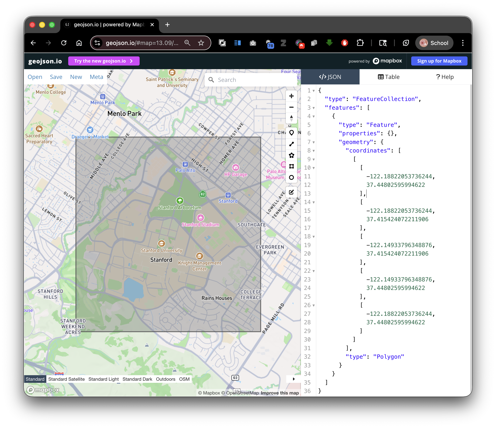
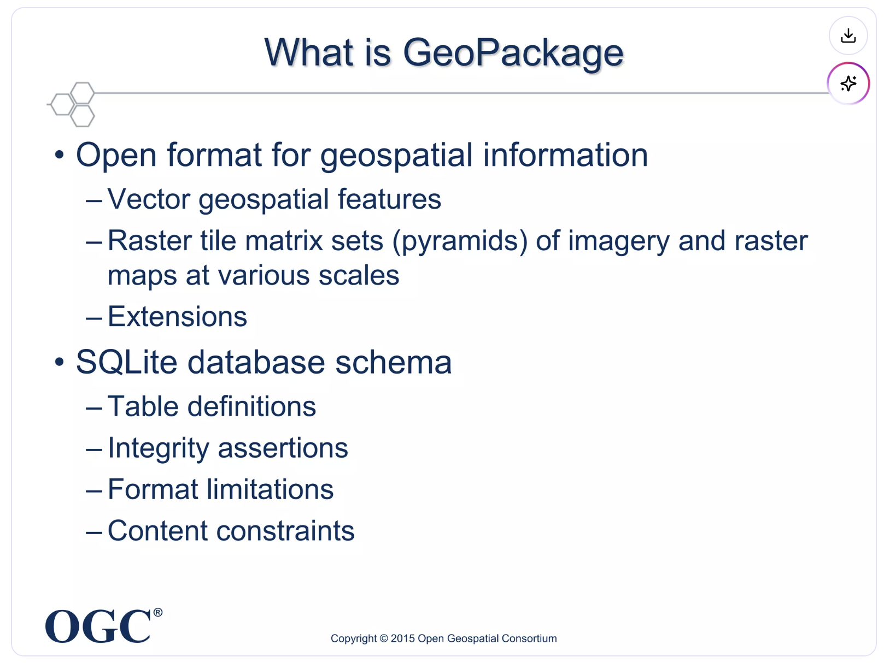
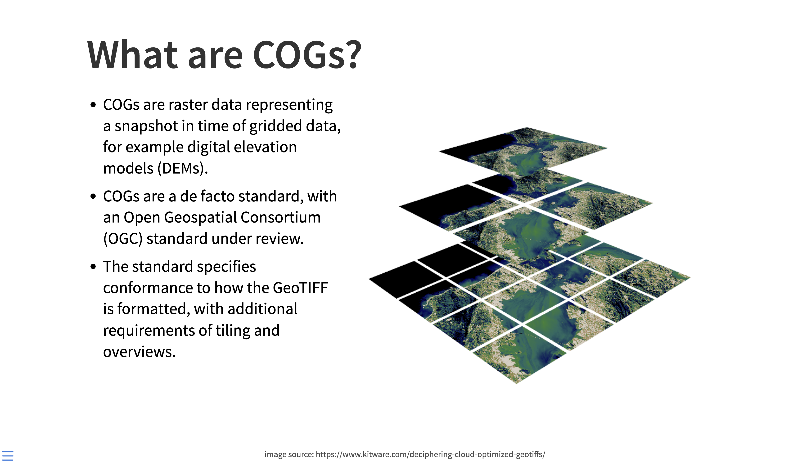

# Introduction to Spatial Data Formats

## Overview

Spatial analysis depends on choosing the right data format for the job. In this guide, you will learn the most common GIS formats you will encounter in EarthSys 144, what each format is good at, and where each one can create problems.

## Learning Objectives

By the end of this guide, you should be able to:

- Distinguish vector, raster, and tabular sources with spatial information.
- Explain the structure and constraints of shapefiles.
- Compare shapefile, GeoJSON, GeoPackage, and geodatabase workflows.
- Identify when to use GeoTIFF versus Cloud Optimized GeoTIFF.
- Recognize web service formats such as WMS and WFS.
- Detect "spatial data that does not know it is spatial yet" in CSV/Excel tables.

## Vector Data Formats

### Shapefiles (.shp): the multi-file classic

- **What it is**: The long-standing Esri vector format used across almost all GIS software.
- **How it is stored**: A set of files with the same name prefix.
- **Required files**: `.shp` (geometry), `.shx` (index), `.dbf` (attributes).
- **Common optional files**: `.prj` (CRS), `.cpg` (encoding), `.sbn/.sbx` (spatial index).
- **Core limitations**:
  - 2GB limit per component file.
  - Field names are limited to 10 characters.
  - 255 fields max in `.dbf`.
  - One geometry type per layer.
- **When to use**: Interoperability, legacy workflows, and simple exchange.

### GeoJSON (.geojson): the web-friendly standard

- **What it is**: JSON-based format for vector features and attributes.
- **How it is stored**: A single text file.
- **Strengths**:
  - Human-readable and easy to version control.
  - Strong compatibility with web mapping tools.
  - Simple data exchange through APIs.
- **Tradeoffs**:
  - Can become slow or heavy for large feature collections.
  - Not ideal for very large analytical workflows.
- **When to use**: Web maps, lightweight data exchange, classroom handoff.

### Geodatabase (.gdb): Esri workflow format

- **What it is**: Esri's native database model for spatial data.
- **Strengths**: Large datasets, richer schemas, topology-aware workflows.
- **When to use**: Complex ArcGIS-first projects and enterprise environments.

### GeoPackage (.gpkg): modern, portable container

- **What it is**: SQLite-based OGC standard for vector and raster layers.
- **How it is stored**: One file can hold many layers and tables.
- **Strengths**:
  - No shapefile naming limits.
  - Better support for complex workflows and multi-layer projects.
  - Portable and open standard.
- **When to use**: Modern desktop GIS projects and clean handoff between tools.

### Other vector formats you will see

- **KML/KMZ**: Strong for Google Earth visualization and sharing, weaker for analysis.
- **GPX**: Common for GPS tracks, routes, and waypoints from mobile devices.

## Raster Data Formats

### GeoTIFF (.tif/.tiff): analysis baseline

- **What it is**: Raster image format with embedded georeferencing.
- **Typical uses**: Satellite imagery, scanned maps, elevation models.
- **When to use**: General-purpose raster analysis and archival storage.

### Cloud Optimized GeoTIFF (COG): cloud-native GeoTIFF

- **What it is**: A GeoTIFF structured for efficient remote access.
- **Why it matters**:
  - Internal tiling and overviews support fast zoom and streaming.
  - Works well in cloud and web environments.
- **When to use**: Large rasters served over the internet or cloud pipelines.

### Other raster formats

- **.jpg/.png**: Useful for display, but often missing robust georeferencing metadata.
- **.nc (NetCDF)**: Strong for climate/ocean time-series data cubes.
- **.hdf**: Common in scientific remote sensing products.

## Web Services and Live Data

### WMS (Web Map Service)

- Returns rendered map images.
- Best for visualization and context layers.

### WFS (Web Feature Service)

- Returns actual vector features.
- Best for querying, downloading, and analysis-ready geometry access.

## Spatial Databases

- **GeoPackage (.gpkg)** and **SQLite (.sqlite)** support richer querying and multi-layer organization than standalone files.
- **Access (.mdb/.accdb)** appears in older projects, but should generally be treated as legacy.

## Tabular Data That Can Become Spatial

Many files are spatially useful even when they are not spatial formats yet.

### CSV/Excel with location fields

Look for:

- Latitude/longitude columns.
- Street addresses.
- ZIP codes.
- County, state, or country identifiers.
- FIPS or ISO administrative codes.

### JSON or text with embedded locations

Look for:

- Sensor records with coordinates.
- Survey responses with place names.
- Geotagged social or field observations.

### Converting tabular data into spatial layers

- **Geocoding**: Convert addresses to points.
- **Join by code/name**: Attach rows to polygons via administrative IDs.
- **Assign CRS**: Explicitly set the coordinate reference system after import.

## Format Selection Cheat Sheet

- Use **Shapefile** when compatibility is your top priority.
- Use **GeoJSON** for lightweight web exchange.
- Use **GeoPackage** for multi-layer modern desktop projects.
- Use **GeoTIFF/COG** for raster analysis.
- Use **WMS/WFS** when you need live remote services.

In the next lab, you will focus specifically on where to find quality spatial data and how to evaluate sources.
