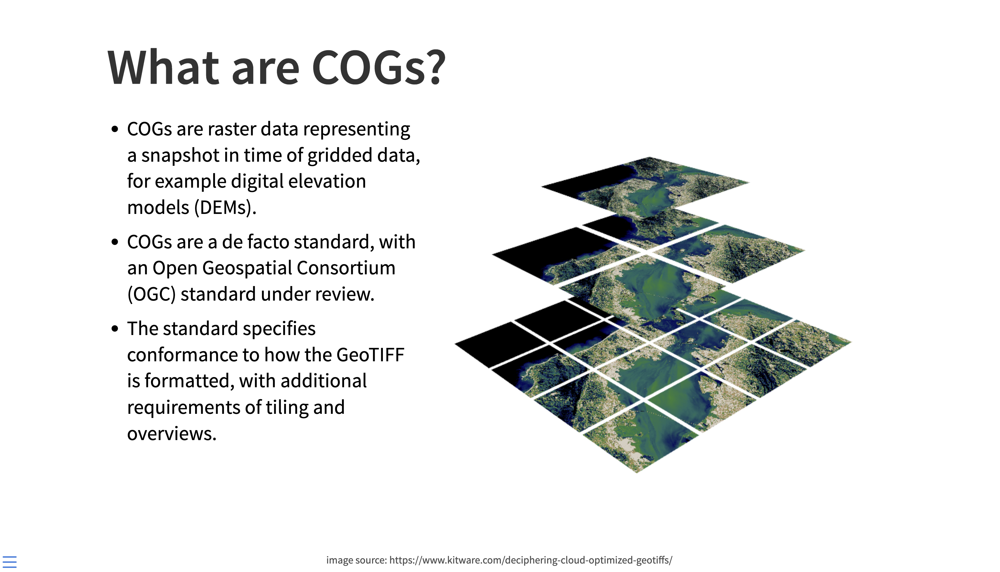

# Introduction to GIS Data Formats & Finding Spatial Data

## Overview

Understanding spatial data formats and knowing where to find quality data are fundamental skills in GIS. This guide covers the most common file formats you'll encounter and provides a comprehensive directory of data sources for your spatial analysis projects.

## Common GIS Data Formats

### Vector Data Formats

#### Shapefiles (.shp) - The Multi-File Format

- **What it is**: The most common vector data format, developed by Esri
- **Structure**: Actually consists of 3-15+ files working together as one dataset
- **Required files**: `.shp` (geometry), `.shx` (index), `.dbf` (attributes)
- **Common optional files**: `.prj` (projection), `.cpg` (encoding), `.sbn/.sbx` (spatial index)
- **Limitations**:
  - 2GB file size limit per component
  - Field names ≤ 10 characters
  - 255 field limit
  - No mixed geometry types
- **Advantages**:
  - **Spatially indexed** for fast queries
  - **Supports topology** and advanced geometry operations
  - **Universal compatibility** across all GIS software
  - **Proven reliability** for complex spatial analysis
- **When to use**: Data sharing, archival storage, working with legacy systems, complex spatial analysis

#### GeoJSON (.geojson) - The Web Standard

- **What it is**: Web-friendly format based on JSON (JavaScript Object Notation)
- **Structure**: Single file containing geometry and attributes, human-readable text format
- **Advantages**:
  - Web-friendly and lightweight
  - No file size component limits
  - Supports nested attributes and arrays
  - Direct JavaScript compatibility
- **Limitations**:
  - **No spatial indexing** - slow for large datasets
  - **Designed for web mapping** - not optimized for analysis
  - **Size constraints** - becomes unwieldy over ~50MB
  - **No projection file** - coordinate system embedded but harder to manage
- **When to use**: Web applications, API data exchange, modern mapping workflows

#### Geodatabase (.gdb) - Esri's Professional Format

- **What it is**: Esri's native spatial database format
- **Types**: File geodatabase (.gdb) and Personal geodatabase (.mdb)
- **Best for**: Complex spatial datasets with relationships, topology, and advanced functionality
- **Advantages**: No size limits, supports complex data types, maintains spatial relationships
- **When to use**: Professional GIS workflows, complex spatial analysis, data with topology requirements

#### Other Specialized Vector Formats

**KML/KMZ (.kml/.kmz) - Google Earth's Native Format:**

- **Software-specific**: Designed primarily for Google Earth visualization
- **KML**: XML-based, human-readable text format
- **KMZ**: Compressed KML with embedded images/resources
- **Strengths**: Excellent for 3D visualization, placemarks, and tours
- **Limitations**: Limited analysis capabilities, Google Earth ecosystem dependency
- **Common uses**: Public data sharing, field site visualization, storytelling

**GPX (.gpx) - The GPS Exchange Standard:**

- **Activity tracking format**: Standard export from fitness and navigation apps
- **Common sources**: Strava, Garmin Connect, AllTrails, iPhone Health, Android Fit
- **Data types**: GPS tracks, waypoints, routes with timestamps
- **Typical content**: Running/cycling routes, hiking trails, geocaching points
- **Analysis potential**: Speed, elevation profiles, activity patterns
- **Conversion needed**: Usually imported to GIS for spatial analysis

**GeoPackage (.gpkg) - The Modern Multi-Purpose Format:**

- **SQLite-based**: Industry standard database with spatial extensions
- **Multi-layer container**: Single file can hold multiple vector and raster datasets
- **No shapefile limitations**: Unlimited field names, file sizes, geometry types
- **Advanced features**: Complex queries, relationships, spatial indexes
- **Growing adoption**: Becoming preferred format for complex projects
- **OGC standard**: Open Geospatial Consortium approved specification

### Raster Data Formats

#### GeoTIFF (.tif/.tiff) - The Traditional Standard

- **What it is**: Tagged Image File Format with embedded spatial reference information
- **Structure**: Single file with embedded spatial reference
- **Best for**: Satellite imagery, aerial photography, digital elevation models
- **Advantages**:
  - Widely supported across all GIS software
  - Maintains spatial reference information
  - Supports lossless compression options
  - Supports multiple bands (RGB, multispectral, etc.)
- **When to use**: High-quality imagery, scientific analysis, archival storage

#### Cloud Optimized GeoTIFF (COG) - The Modern Evolution

- **What it is**: GeoTIFF format optimized for cloud storage and streaming
- **Built on GeoTIFF** but optimized for cloud/web access
- **Technical features**:
  - **Internal tiling** enables efficient partial reading
  - **Multiple resolution overviews** for fast zooming
  - **HTTP range request compatible** - stream data without full download
- **Best for**: Large raster datasets accessed over the internet
- **Advantages**: Efficient partial reading, web-optimized, maintains full GeoTIFF compatibility
- **Status**: **Becoming the new standard** for web-based raster analysis
- **When to use**: Cloud-based analysis, web applications, large-scale raster processing

#### Other Raster Formats

- **.jpg/.png**: Web-friendly formats but lose spatial reference information
- **.nc (NetCDF)**: Scientific format for climate and oceanographic data
- **.hdf (Hierarchical Data Format)**: Complex scientific format for satellite data

#### XYZ Tiles

- **What it is**: Pre-rendered map tiles organized in a pyramid structure (zoom level/x/y)
- **Best for**: Web map backgrounds, fast display of large datasets
- **Advantages**: Fast loading, widely supported by web mapping libraries
- **When to use**: Web mapping applications, basemap services

### Web Services

#### Web Map Service (WMS)

- **What it is**: Standard protocol for serving georeferenced map images over the internet
- **Best for**: Viewing and displaying spatial data
- **Advantages**: Real-time access, no local storage required, standardized protocol
- **When to use**: Dynamic map display, real-time data visualization

#### Web Feature Service (WFS)

- **What it is**: Standard protocol for serving vector spatial data over the internet
- **Best for**: Accessing and editing vector features remotely
- **Advantages**: Direct access to feature geometry and attributes, supports querying
- **When to use**: Real-time data access, collaborative editing, dynamic analysis

### Spatial Databases

#### GeoPackage (.gpkg) - The Swiss Army Knife

- **SQLite-based** single file containing multiple layers
- **Combines vector and raster** data in one container
- **No size limits** like shapefiles
- **Supports complex queries** and relationships
- **When to use**: Multi-layer projects, complex data relationships, modern GIS workflows

#### Other Database Formats

- **.sqlite**: Spatial extension of SQLite database
- **.mdb/.accdb**: Microsoft Access (legacy format, avoid if possible)

### Text Formats with Hidden Spatial Data

Many datasets contain geographic information but aren't explicitly spatial formats - this is "**Spatial Data That Doesn't Know It's Spatial Yet**":

#### CSV/Excel (.csv, .xlsx) with Geographic Encoding

**Common geographic identifiers to watch for:**

- **County names**: "Santa Clara County" (can be geocoded to boundary polygons)
- **Addresses**: "123 Main St, Palo Alto, CA" (can be geocoded to point coordinates)
- **Lat/Long columns**: Decimal degrees waiting to become geometry
- **ZIP codes**: Postal codes that can be mapped to area boundaries
- **State abbreviations**: "CA" can become California polygon
- **Administrative codes**: FIPS codes, ISO country codes

#### JSON/Text (.json, .txt) with Embedded Locations

- **Social media data**: Geotagged tweets with coordinate metadata
- **Sensor data**: Weather stations with lat/long information
- **Survey responses**: Addresses or place names in text fields

#### Making Text Data Spatial

- **Geocoding**: Convert addresses to coordinates
- **Joining**: Link administrative names to boundary polygons
- **Coordinate parsing**: Extract lat/long from text fields
- **Spatial reference**: Assign appropriate coordinate systems

## Finding Spatial Data: A Comprehensive Guide

### Academic and Research Sources

#### Stanford EarthWorks

- **URL**: [earthworks.stanford.edu](https://earthworks.stanford.edu/)
- **Strengths**: High-quality academic datasets, historical maps, global coverage
- **Best for**: Research projects, historical analysis, academic work
- **Highlights**: Curated collections, metadata standards, direct download access

#### Google Earth Engine Data Catalog

- **URL**: [developers.google.com/earth-engine/datasets](https://developers.google.com/earth-engine/datasets)
- **Strengths**: Massive archive of **analysis-ready** satellite imagery and environmental datasets
- **Best for**: Time-series analysis, environmental monitoring, global-scale research, cloud computing
- **Key Collections**:
  - **Landsat Collection 2** (1972-present) - Complete archive, surface reflectance
  - **Sentinel-2** (2015-present) - 10m resolution, 5-day revisit
  - **MODIS** (2000-present) - Daily global coverage, 16+ years time-series
  - **Climate data** - ERA5, CHIRPS precipitation, temperature records
  - **Land cover** - Dynamic World, NLCD, ESA WorldCover
- **Advantages**: **Pre-processed for analysis**, cloud masking, atmospheric correction
- **Access**: Free for research and education, requires Google account

### Government Data Sources

#### Data.gov

- **URL**: [data.gov](https://www.data.gov/)
- **Strengths**: Comprehensive U.S. government data portal
- **Best for**: Federal datasets, demographic data, policy analysis
- **Highlights**: Open data initiative, standardized metadata, API access

#### U.S. National Map

- **URL**: [viewer.nationalmap.gov/basic/](https://viewer.nationalmap.gov/basic/)
- **Strengths**: Authoritative U.S. topographic and geographic data
- **Best for**: Base mapping, elevation data, infrastructure analysis
- **Highlights**: USGS topographic maps, elevation data, hydrography

#### USGS EarthExplorer

- **URL**: [earthexplorer.usgs.gov](https://earthexplorer.usgs.gov/)
- **Strengths**: Satellite imagery, aerial photography, elevation data
- **Best for**: Remote sensing projects, change detection, terrain analysis
- **Highlights**: Landsat archive, NAIP imagery, digital elevation models
- **Google Earth Engine**: **Analysis-ready** - Landsat archive available in GEE
  - [Landsat Collection 2 in GEE](https://developers.google.com/earth-engine/datasets/catalog/landsat)
  - [USGS 3DEP in GEE](https://developers.google.com/earth-engine/datasets/catalog/USGS_3DEP_10m)

#### USGS TopoViewer

- **URL**: [ngmdb.usgs.gov/topoview/viewer](https://ngmdb.usgs.gov/topoview/viewer/#4/40.01/-100.06)
- **Strengths**: Historical topographic maps of the United States
- **Best for**: Historical analysis, change detection, reference mapping
- **Highlights**: Complete USGS topo map archive, georeferenced historical maps

### Specialized Environmental Datasets

#### National Aerial Imagery Program (NAIP)

- **Access**: Through EarthExplorer or state portals
- **Strengths**: High-resolution aerial imagery of the United States
- **Best for**: Land use analysis, agricultural monitoring, urban planning
- **Highlights**: 1-meter resolution, annual coverage, true color and infrared
- **Google Earth Engine**: **Analysis-ready** in GEE with cloud masking
  - [NAIP in GEE](https://developers.google.com/earth-engine/datasets/catalog/USDA_NAIP_DOQQ)

#### National Land Cover Database (NLCD)

- **Access**: Through EarthExplorer or USGS websites
- **Strengths**: Standardized land cover classification for the U.S.
- **Best for**: Land use change analysis, environmental assessment
- **Highlights**: Consistent methodology, regular updates, multiple time periods
- **Google Earth Engine**: **Analysis-ready** with time-series support
  - [NLCD in GEE](https://developers.google.com/earth-engine/datasets/catalog/USGS_NLCD_RELEASES)

#### NASS Crop Data Layer (CDL)

- **URL**: [nassgeodata.gmu.edu/CropScape/](https://nassgeodata.gmu.edu/CropScape/)
- **Strengths**: Detailed agricultural land use data
- **Best for**: Agricultural analysis, crop monitoring, rural land use studies
- **Highlights**: Annual updates, detailed crop classifications, county-level statistics
- **Google Earth Engine**: **Analysis-ready** with annual time-series
  - [NASS CDL in GEE](https://developers.google.com/earth-engine/datasets/catalog/USDA_NASS_CDL)

#### National Wetlands Inventory

- **URL**: [fws.gov/wetlands/data/Mapper.html](https://www.fws.gov/wetlands/data/Mapper.html)
- **Strengths**: Comprehensive wetlands mapping and classification
- **Best for**: Environmental assessment, habitat analysis, regulatory compliance
- **Highlights**: Standardized wetland classification, regular updates, regulatory applications

#### Digital Elevation Models

- **SRTM**: [srtm.csi.cgiar.org/srtmdata/](http://srtm.csi.cgiar.org/srtmdata/)
- **Strengths**: Global elevation data at 30-meter resolution
- **Best for**: Terrain analysis, watershed delineation, global studies
- **Highlights**: Global coverage, consistent resolution, free access
- **Google Earth Engine**: **Analysis-ready** with multiple DEM products
  - [SRTM 30m in GEE](https://developers.google.com/earth-engine/datasets/catalog/USGS_SRTMGL1_003)
  - [SRTM 90m in GEE](https://developers.google.com/earth-engine/datasets/catalog/CGIAR_SRTM90_V4)
  - [ASTER DEM in GEE](https://developers.google.com/earth-engine/datasets/catalog/ASTER_GED_AG100_003)
  - [NASA DEM in GEE](https://developers.google.com/earth-engine/datasets/catalog/NASA_NASADEM_HGT_001)

#### National Hydrography Dataset

- **Access**: Through USGS National Map or EarthExplorer
- **Strengths**: Comprehensive surface water features for the U.S.
- **Best for**: Watershed analysis, flood modeling, water resource studies
- **Highlights**: Standardized attribution, network topology, regular updates

#### WWF HydroSHEDS

- **URL**: [hydrosheds.org](https://www.hydrosheds.org/)
- **Strengths**: Global hydrographic data based on SRTM elevation
- **Best for**: Global watershed analysis, international water studies
- **Highlights**: Global coverage, multiple resolutions, consistent methodology
- **Google Earth Engine**: **Analysis-ready** with complete global coverage
  - [HydroSHEDS in GEE](https://developers.google.com/earth-engine/datasets/catalog/WWF_HydroSHEDS_03VFDEM)
  - [Flow Direction in GEE](https://developers.google.com/earth-engine/datasets/catalog/WWF_HydroSHEDS_15DIR)
  - [Flow Accumulation in GEE](https://developers.google.com/earth-engine/datasets/catalog/WWF_HydroSHEDS_15ACC)

#### USDA Soils Data

- **URL**: [websoilsurvey.sc.egov.usda.gov](https://websoilsurvey.sc.egov.usda.gov/App/WebSoilSurvey.aspx)
- **Strengths**: Comprehensive soil surveys and properties
- **Best for**: Agricultural planning, environmental assessment, engineering applications
- **Highlights**: Detailed soil properties, interpretive maps, query capabilities
- **Google Earth Engine**: **Analysis-ready** soil property grids available
  - [SoilGrids in GEE](https://developers.google.com/earth-engine/datasets/catalog/ISRIC_SoilGrids250m_v2_0) - Global soil properties
  - [STATSGO/SSURGO in GEE](https://developers.google.com/earth-engine/datasets/catalog/USDA_NRCS_STATSGO2) - US soil surveys

#### Digital Floodplain Data

- **URL**: [msc.fema.gov/portal/advanceSearch](https://msc.fema.gov/portal/advanceSearch)
- **Strengths**: Official flood hazard mapping for the United States
- **Best for**: Risk assessment, insurance applications, regulatory compliance
- **Highlights**: Regulatory authority, detailed flood studies, insurance rate maps

#### Geological Data

- **URL**: [mrdata.usgs.gov/general/map-us.html](https://mrdata.usgs.gov/general/map-us.html)
- **Strengths**: Comprehensive geological mapping and mineral resource data
- **Best for**: Geological studies, mineral exploration, hazard assessment
- **Highlights**: Authoritative geological maps, mineral resource databases, hazard information

### Satellite Imagery Collections (Primarily Google Earth Engine)

#### Sentinel Satellites (Copernicus Program)

- **Strengths**: Free, open European satellite constellation with frequent revisit
- **Best for**: Environmental monitoring, agriculture, land change detection
- **Google Earth Engine**: **Primary access method** - analysis-ready with cloud masking
  - [Sentinel-2 MSI in GEE](https://developers.google.com/earth-engine/datasets/catalog/COPERNICUS_S2_SR) - 10m optical imagery
  - [Sentinel-1 SAR in GEE](https://developers.google.com/earth-engine/datasets/catalog/COPERNICUS_S1_GRD) - Radar imagery, weather-independent
  - [Sentinel-3 in GEE](https://developers.google.com/earth-engine/datasets/catalog/COPERNICUS_S3_OLCI) - Ocean and land monitoring

#### MODIS (NASA Terra/Aqua Satellites)

- **Strengths**: Long time-series (2000-present), global daily coverage, multiple spectral bands
- **Best for**: Climate research, phenology, large-scale environmental monitoring
- **Google Earth Engine**: **Analysis-ready** with extensive processing options
  - [MODIS Surface Reflectance in GEE](https://developers.google.com/earth-engine/datasets/catalog/MODIS_006_MOD09A1)
  - [MODIS NDVI in GEE](https://developers.google.com/earth-engine/datasets/catalog/MODIS_006_MOD13A1)
  - [MODIS Land Surface Temperature in GEE](https://developers.google.com/earth-engine/datasets/catalog/MODIS_006_MOD11A1)

#### Planet Labs (Commercial High-Resolution)

- **Strengths**: Daily global coverage, very high resolution (3-5m), rapid revisit
- **Best for**: Change detection, precision agriculture, disaster response
- **Google Earth Engine**: **Available through Planet-GEE partnership**
  - [Planet in GEE](https://developers.google.com/earth-engine/datasets/catalog/planet) - Requires Planet account
  - Daily imagery for detailed monitoring applications

#### Climate and Weather Data

- **Google Earth Engine**: **Extensive climate datasets** analysis-ready
  - [ERA5 Climate Reanalysis in GEE](https://developers.google.com/earth-engine/datasets/catalog/ECMWF_ERA5_DAILY)
  - [CHIRPS Precipitation in GEE](https://developers.google.com/earth-engine/datasets/catalog/UCSB-CHG_CHIRPS_DAILY)
  - [GRIDMET Weather in GEE](https://developers.google.com/earth-engine/datasets/catalog/IDAHO_EPSCOR_GRIDMET)

### Demographic and Social Data

#### IPUMS NHGIS

- **URL**: [nhgis.org](https://www.nhgis.org/)
- **Strengths**: Historical and contemporary demographic data with geographic boundaries
- **Best for**: Demographic analysis, historical studies, social research
- **Highlights**: Time-series demographic data, consistent geographic boundaries, research-quality datasets

#### SimplyAnalytics

- **URL**: [simplyanalytics.com](https://simplyanalytics.com)
- **Strengths**: Business and demographic data with mapping capabilities
- **Best for**: Market analysis, business planning, demographic research
- **Highlights**: Current demographic estimates, business data, custom mapping tools

#### U.S. Census Bureau

- **URL**: [census.gov/geographies/mapping-files](https://www.census.gov/geographies/mapping-files/time-series/geo/kml-cartographic-boundary-files.html)
- **Strengths**: Official demographic data and administrative boundaries
- **Best for**: Official statistics, policy analysis, administrative research
- **Highlights**: Decennial census, American Community Survey, official boundaries

### Global and International Sources

#### Natural Earth

- **URL**: [naturalearthdata.com](https://www.naturalearthdata.com/)
- **Strengths**: High-quality global vector and raster map data
- **Best for**: Global mapping projects, reference cartography, educational materials
- **Highlights**: Multiple scales, cartographically designed, public domain

#### OpenStreetMap

- **URL**: [openstreetmap.org](https://www.openstreetmap.org/#map=3/10.17/20.40)
- **Strengths**: Crowd-sourced global mapping data
- **Best for**: Urban mapping, routing applications, community-driven projects
- **Highlights**: Global coverage, regular updates, open license, detailed urban data

#### Overpass Turbo

- **URL**: [overpass-turbo.eu](https://overpass-turbo.eu/)
- **Strengths**: Query interface for OpenStreetMap data
- **Best for**: Custom data extraction from OpenStreetMap
- **Highlights**: Powerful query language, real-time data access, export capabilities

#### Humanitarian OpenStreetMap

- **URL**: [tasks.hotosm.org/explore](https://tasks.hotosm.org/explore)
- **Strengths**: Crisis mapping and humanitarian data projects
- **Best for**: Disaster response, humanitarian projects, community mapping
- **Highlights**: Crisis-focused mapping, volunteer coordination, rapid response

#### Humanitarian Data Exchange

- **URL**: [data.humdata.org](https://data.humdata.org/)
- **Strengths**: Humanitarian and crisis-related datasets
- **Best for**: Emergency response, humanitarian analysis, crisis mapping
- **Highlights**: Crisis-specific data, standardized formats, rapid deployment

### Commercial and Specialized Sources

#### Planet.com

- **URL**: [planet.com](https://www.planet.com/)
- **Strengths**: High-resolution, frequently updated satellite imagery
- **Best for**: Change detection, precision agriculture, monitoring applications
- **Highlights**: Daily global imaging, very high resolution, analytics-ready data
- **Google Earth Engine**: **Available through partnership** (requires Planet account)
  - [Planet in GEE](https://developers.google.com/earth-engine/datasets/catalog/planet) - 3-5m daily imagery
  - Educational access available through Planet's education program

#### ArcGIS Hub

- **URL**: [hub.arcgis.com](https://hub.arcgis.com/)
- **Strengths**: Government and organization data sharing platform
- **Best for**: Local government data, organizational datasets, community resources
- **Highlights**: Local government focus, data sharing tools, community engagement

### Historical and Cultural Sources

#### Old Maps Online

- **URL**: [oldmapsonline.org](https://www.oldmapsonline.org/)
- **Strengths**: Georeferenced historical maps from multiple collections
- **Best for**: Historical analysis, change detection, cultural studies
- **Highlights**: Multiple map collections, georeferenced overlays, time-series analysis

#### David Rumsey Map Collection

- **URL**: [DavidRumsey.com](https://www.davidrumsey.com/)
- **Strengths**: Extensive collection of historical maps and cartographic materials
- **Best for**: Historical cartography, cultural analysis, educational resources
- **Highlights**: High-resolution scans, detailed metadata, cartographic history

## Search Strategies

### Google Earth Engine for Raster Data Analysis

**Why use Google Earth Engine for raster data?**

- **Analysis-ready data**: Pre-processed with atmospheric correction, cloud masking
- **Massive compute power**: Handle continental-scale analysis in the cloud
- **Time-series ready**: Decades of satellite data organized for temporal analysis
- **No download required**: Process petabytes of data without local storage
- **Reproducible research**: Code-based analysis with version control

**Key advantages marked throughout this guide:**

- Look for datasets available in Google Earth Engine
- These datasets are optimized for analysis and ready to use in GEE
- Direct links provided to specific Earth Engine data catalog pages

### General Search Tips

- Use specific file format terms in your searches: "shapefile", "geotiff", "geojson", "geodatabase"
- Include geographic terms: city names, administrative boundaries, geographic features
- Combine data type with location: "California counties shapefile", "elevation data Colorado geotiff"
- **For raster analysis**: Consider Google Earth Engine first for satellite imagery and environmental data

### Data Quality Considerations

- Check metadata for coordinate systems, accuracy, and currency
- Verify data sources and collection methods
- Consider scale appropriateness for your analysis
- Review attribute completeness and standardization

### Legal and Licensing Considerations

- Always check data licensing and usage rights
- Government data is typically public domain in the U.S.
- Academic sources may have research-only restrictions
- Commercial data often requires licensing agreements

## Next Steps

With this foundation in data formats and sources, you're ready to:

1. Identify appropriate data formats for your projects
2. Locate and evaluate potential data sources
3. Understand the strengths and limitations of different formats
4. Make informed decisions about data acquisition and storage

Remember that the choice of data format often depends on your intended use, software requirements, and project constraints. When in doubt, start with widely-supported formats like shapefiles for vector data and GeoTIFF for raster data.
