# Installing QGIS and Plugins

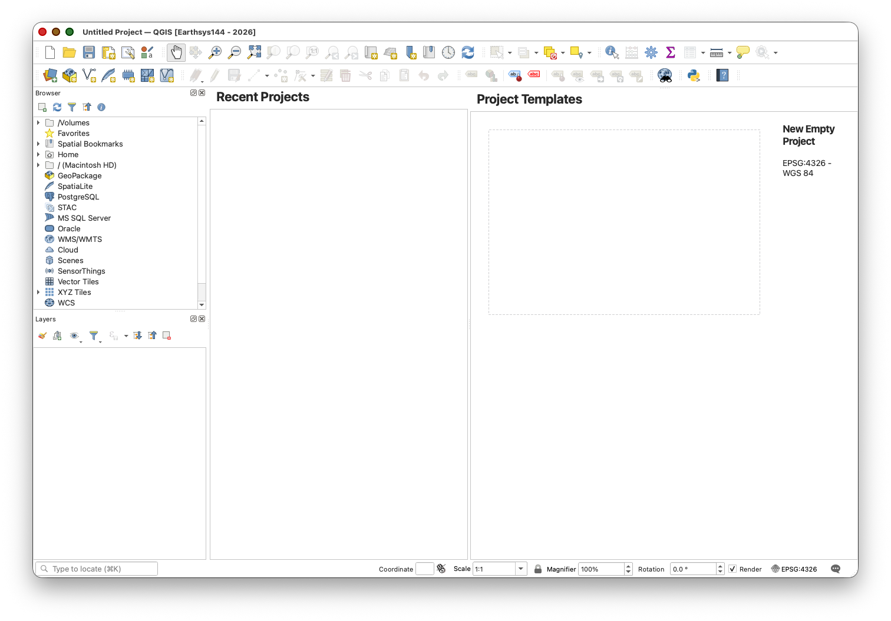

## Test Data

Download the test data for this lab: [stanford_art_data.zip](https://raw.githubusercontent.com/mapninja/Earthsys144/refs/heads/master/data/stanford_art_data.zip)

This zip file contains the following layers:

- `stanford_public_art.geojson` — Point locations of public art installations on Stanford campus
- `stanford_campus_irg.tif` — Infrared raster image of the Stanford campus
- `stanford_campus.geojson` — Stanford campus boundary polygon

## Introduction

QGIS (Quantum Geographic Information System) is a free, open-source desktop GIS application that will serve as our primary tool for spatial data analysis and cartography. This lab will guide you through the installation process and setup of essential plugins that extend QGIS's functionality for terrain analysis, geoprocessing, and basemap integration.

## Learning Objectives

By the end of this lab, you will be able to:

- Install QGIS on macOS, Windows, or Linux
- Create a new user profile for course work
- Install and configure essential QGIS plugins
- Set up WhiteboxTools for advanced terrain analysis
- Access basemap services through QuickMapServices

## Installing QGIS

### macOS Installation

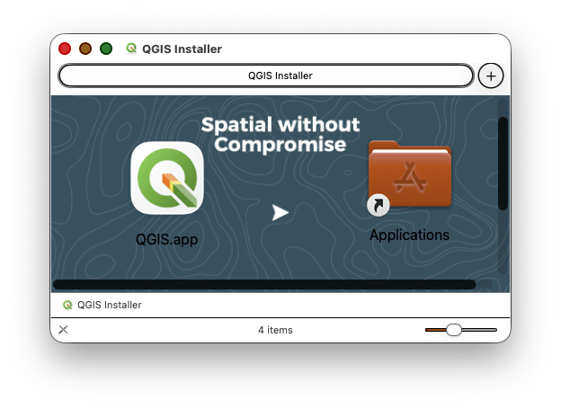

> ***NOTE: Avoid*** the use of the new "VERY EARLY RELEASE" version 4.0.0. Most of the plugins that we will need to use have not been updated for this version. At some point, soon, I expect that to change, but until then, **please use the Long-term Release (LTR) Version 3.44

1. **Download** the latest **Regular** release from: [qgis.org/en/site/forusers/download.html](https://qgis.org/en/site/forusers/download.html)**
2. **Download** the **DMG** file for macOS
3. **Double-click** the downloaded DMG file to open it
4. It will take a few minutes to decompress and validate the DMG file
5. Once the installation window opens, **drag and drop the QGIS app icon into the Applications folder icon**
6. **Launch QGIS** from your Applications folder

**Note:** As of 2024, QGIS is now properly registered with Apple, so you should not encounter security warnings during installation or first launch.

### Windows Installation

1. Visit [qgis.org/en/site/forusers/download.html](https://qgis.org/en/site/forusers/download.html)
2. Download the **QGIS Standalone Installer** (Regular release)
3. Run the installer with administrator privileges
4. Accept the default installation options
5. Launch QGIS from the Start menu

For a detailed walkthrough, see: [How to Install QGIS on Windows](https://www.geeksforgeeks.org/how-to-install-qgis-on-windows/)

### Linux Installation

1. Use your distribution's package manager
2. Add the official QGIS repository for the latest versions
3. Install using `apt`, `yum`, or equivalent package manager

For distribution-specific instructions, visit: [QGIS Installers](https://www.qgis.org/en/site/forusers/alldownloads.html)

## Setting Up Your QGIS Profile

Creating a new user profile provides a clean workspace for the course and makes troubleshooting easier if issues arise.

### Create a New User Profile

1. Launch QGIS
2. Go to **Settings > User Profiles > New Profile**

   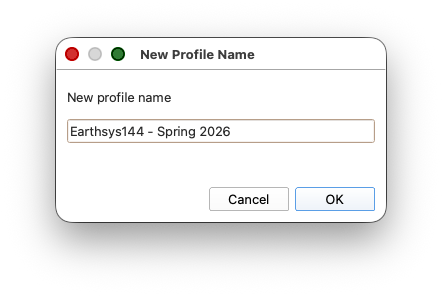
3. Name the profile something like `EarthSys144` or `EarthSys144-Labs` to identify it
4. Click **OK**

QGIS will restart with your new profile. This creates a fresh configuration with default settings. Your old profile (if you had one) remains available and you can switch between profiles from **Settings > User Profiles**.

## Installing Essential Plugins

### QuickMapServices Plugin

QuickMapServices provides convenient access to basemap layers from various providers (Google, Esri, OpenStreetMap, and more).

**Install the Plugin:**

1. Go to **Plugins > Manage and Install Plugins**
2. In the search box, type **QuickMapServices**
3. Select the plugin from the list and click **Install Plugin**
4. Close the Plugin Manager

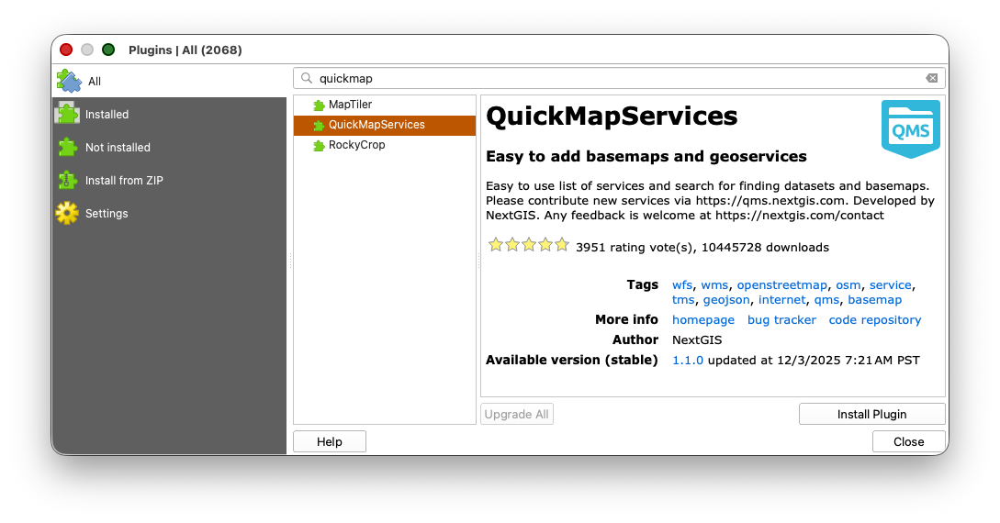

**Test the Installation:**

1. Go to **Web > QuickMapServices**
2. You should see many service providers listed (Google, Esri, NASA, etc.)
3. Select **Google > Google Hybrid** to load a basemap

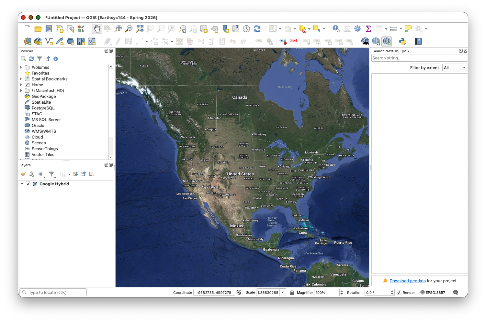

### SAGA NextGen Plugin

SAGA (System for Automated Geoscientific Analyses) provides powerful geoprocessing tools. Modern QGIS installations do not include SAGA automatically, so SAGA must be installed as a separate program and then connected to QGIS with a Processing provider plugin.

For the course setup, use the separate Week 00 guide:

[Installing SAGA 9.2 for QGIS Processing](08_installing_saga_for_qgis.md)

That guide covers:

- downloading SAGA 9.2.0 for macOS and Windows
- finding the correct SAGA binary folder
- installing the **Processing Saga NextGen Provider** plugin
- setting **Settings > Options > Processing > Providers > SAGANG > SAGA folder**
- confirming that SAGA tools appear in the QGIS Processing Toolbox

### WhiteboxTools Plugin

WhiteboxTools is an excellent, high-performance toolkit particularly useful for hydrological modeling, terrain analysis, and raster processing. Installing WhiteboxTools is a two-step process: downloading the executables and then installing the QGIS plugin.

#### Step 1: Download WhiteboxTools Executables

1. **Download** the appropriate version for your operating system from: [whiteboxgeo.com/download-redirect/](https://www.whiteboxgeo.com/download-redirect/)
2. **Unzip** the downloaded archive to a stable location on your hard drive:
   - **macOS**: Consider `/Users/[username]/WBT` or `~/Applications/WBT`
   - **Windows**: Consider `C:\WBT` or `C:\Program Files\WBT`
   - **Linux**: Consider `~/WBT` or `/opt/WBT`
3. **Remember this location** - you'll need to point the QGIS plugin to it

For a video demonstration, see: [WhiteboxTools Setup Video](https://www.youtube.com/watch?v=xJXDBsNbcTg&t=3s)

#### Step 2: Install the WhiteboxTools QGIS Plugin

1. Return to **Plugins > Manage and Install Plugins**
2. Search for **WhiteboxTools**
3. Find **WhiteboxTools for QGIS** and click **Install Plugin**
4. Close the Plugin Manager

#### Step 3: Configure WhiteboxTools in QGIS

1. Go to **Processing > Toolbox** to open the Processing Toolbox
2. Click the **wrench icon** at the top to open Processing Settings
3. In the left panel, expand **Providers > WhiteboxTools**
4. **Double-click** in the box next to **WhiteboxTools executable**
5. Click the **...** button to browse to the folder where you unzipped WhiteboxTools

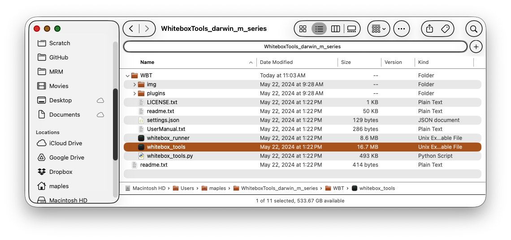

1. Navigate to the **WhiteboxTools executable** inside the WBT folder:

   - **macOS/Linux**: Select the `whitebox_tools` file (no extension)
   - **Windows**: Select `whitebox_tools.exe`

     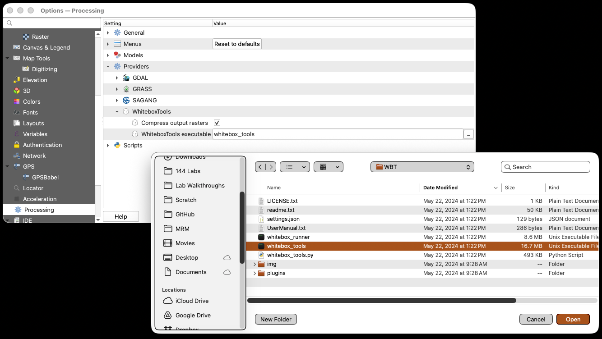

     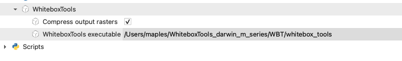
2. Click **Open**, then **OK** to save the settings

**Verify Installation:**

1. In the Processing Toolbox, expand the **WhiteboxTools** provider
2. You should see hundreds of tools organized by category
3. Test the installation by running the **RandomSample** tool:
   - Search for **RandomSample** in the Processing Toolbox
   - For the **Input Raster File**, select `stanford_campus_irg.tif` from the test data you downloaded earlier
   - Set **Num. Samples** to **100**
   - For the **Output File**, click the **...** button and **browse to an actual folder** on your computer, then type a filename (e.g., `random_sample_test.shp`). **Important:** WhiteboxTools does not work well with temporary layers. You must save the output to a real file path. If you only type a filename without browsing to a folder first, QGIS will error because it needs a full path (e.g., `/Users/yourname/Documents/random_sample_test.shp`), not just a filename.

     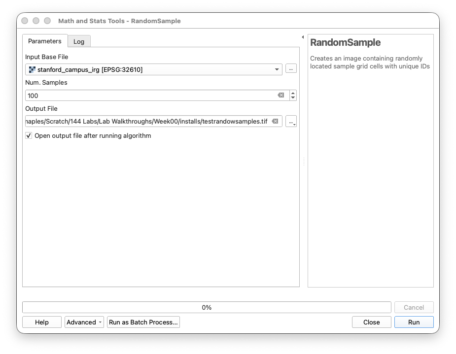
   - Click **Run**

> Note that the output file will likely appear to be solid black. This is becasue the RandomSamples are single pixels, likely too small to be seen on your screen resolution. Also note that the values of those pixels are sequential identifiers, from `1` to `100`, with `0` the background value.

1. Now use the output to create a distance map with the **EuclideanDistance** tool:
   - Search for **EuclideanDistance** in the Processing Toolbox
   - For the **Input Vector File**, select the `random_sample_test.shp` output you just created
   - For the **Output File**, click the **...** button, browse to the same folder, and save as `euclidean_distance_test.tif`
   - Click **Run**
2. If both tools complete successfully, WhiteboxTools is properly configured. You should see a raster layer showing the distance from each pixel to the nearest random sample point.

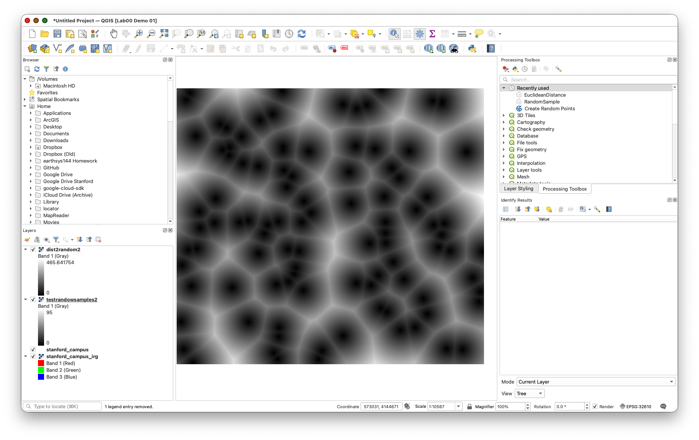

**Note on WhiteboxTools Plugins:** WhiteboxTools includes additional plugin executables in the `WBT/plugins/` directory. These specialized tools extend WhiteboxTools functionality and will be used later in the course.

## Troubleshooting WhiteBox Tools

### macOS Security Configuration for WhiteboxTools

**Important for macOS users:** WhiteboxTools executables are not registered with Apple, which triggers macOS security warnings. You'll need to explicitly allow the executable to run.

If you see an error like:

```
WhiteboxTools output:
Process "whitebox_tools" failed to start. Either "whitebox_tools" is missing, 
or you may have insufficient permissions to run the program.
Execution failed after 0.04 seconds
```

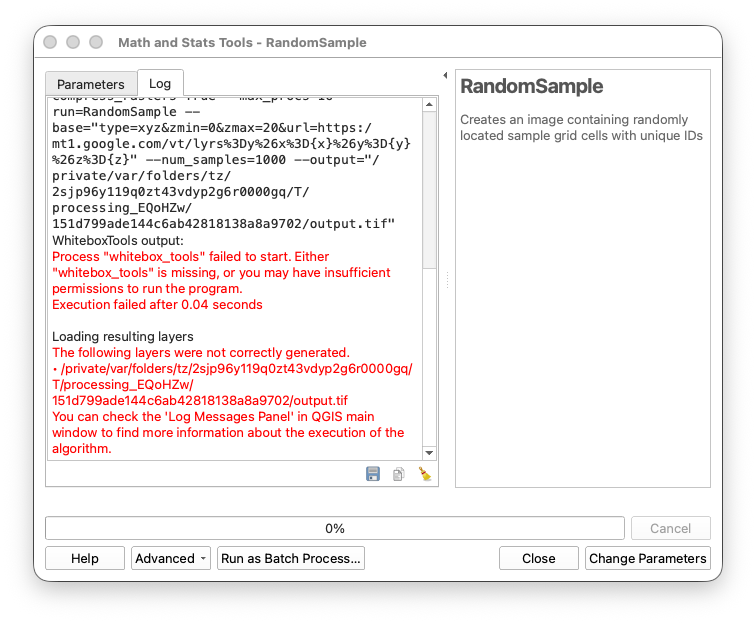

Follow these steps:

1. **Navigate to your WhiteboxTools installation folder** (e.g., `/Users/[username]/WBT`)
2. **Right-click** (or Control-click) on the `whitebox_tools` executable

   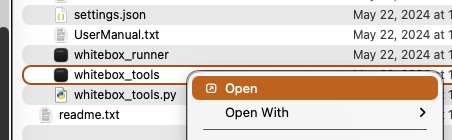
3. Select **Open** from the context menu
4. A security warning will appear - **DO NOT click "Move to Trash"**
5. **Dismiss the warning dialog**
6. Go to **System Settings > Privacy & Security**
7. Scroll down to the Security section
8. Click **Open Anyway** next to the message about `whitebox_tools`
   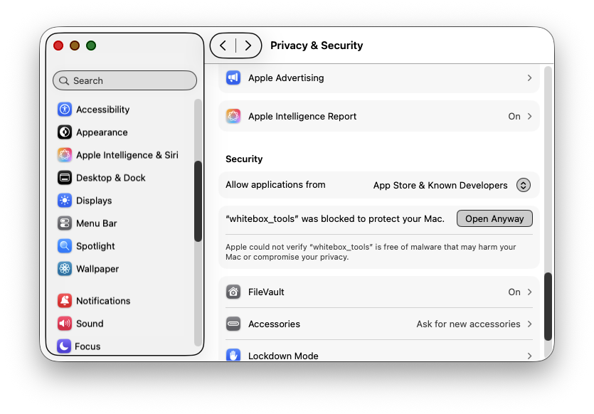
9. **Confirm** through any additional security prompts
   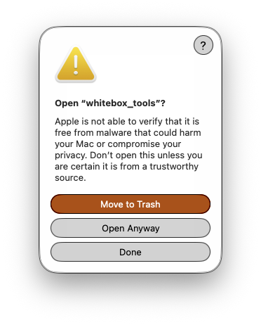
10. The executable will launch in Terminal - you can close the Terminal window once it opens
11. **Return to QGIS** and retest the **RandomSample** tool

This process only needs to be done once. After approval, WhiteboxTools will run normally from QGIS.

### Configure Processing Toolbox Display

1. Go to **Processing > Toolbox**
2. Right-click in the toolbox panel
3. Select **Reorganize by Type** to group similar tools together

## Troubleshooting Common Issues

### QGIS Won't Launch

- **Windows**: Try running as administrator
- **macOS**: Check that the app is in your Applications folder
- **All platforms**: Check system requirements at [qgis.org](https://qgis.org)
- Clear QGIS settings by renaming the QGIS profile folder and creating a new profile

### Plugins Not Working

- Verify QGIS version compatibility in the plugin description
- Check your internet connection (required for plugin installation)
- Try **Plugins > Manage and Install Plugins > Reinstall Plugin**
- Clear the plugin cache and restart QGIS

### WhiteboxTools Executable Not Found

- Verify you've downloaded and unzipped the WhiteboxTools executables
- Double-check the path in **Processing > Options > Providers > WhiteboxTools**
- Make sure you're pointing to the executable file, not just the folder
- **macOS/Linux**: Ensure the executable has execute permissions (`chmod +x whitebox_tools`)

### SAGA Tools Missing or Broken

- SAGA is no longer bundled with QGIS — you must install it separately as a standalone application (see the SAGA NextGen Plugin section above)
- Make sure you installed **Processing SAGA NextGen Provider**, not just the base SAGA
- Verify the **SAGA folder** path is set correctly in **Processing > Options > Providers > SAGA** (e.g., `/Applications/SAGA.app/Contents/MacOS/`)
- Try using tools from **SAGA Next Gen** instead of the original **SAGA** provider
- **Conflicting installations**: If you had older versions of SAGA installed, ensure they are removed to avoid conflicts
- **Permissions**: Rarely, you might need to adjust file permissions on the SAGA folder to allow QGIS to access it
- Some tools may require specific data types or CRS - check tool documentation

### QuickMapServices Shows No Basemaps

- Make sure you clicked **Get Contributed Pack** in the settings
- Check your internet connection
- Try **Web > QuickMapServices > Settings > More Services > Reload** to refresh the list

## Submission

To verify your installation:

1. Create a new QGIS project
2. Load the **Google Hybrid** basemap from **Web > QuickMapServices > Google > Google Hybrid**
3. Open the **Processing Toolbox** and expand it to show **SAGA Next Gen** and **WhiteboxTools** providers and the Scripts under their sections.
4. **Create a screenshot** showing:
   - QGIS interface with the Google Hybrid basemap loaded
   - Processing Toolbox panel visible with SAGA Next Gen and WhiteboxTools expanded
5. **Upload the screenshot** to Canvas

## Next Steps

With QGIS and essential plugins installed, you're ready to:

- Create your first maps with professional basemaps
- Perform terrain analysis using WhiteboxTools
- Apply geoprocessing algorithms from SAGA Next Gen
- Begin exploring spatial data visualization and analysis

These tools will form the foundation of all the desktop GIS work we'll do throughout the course.
