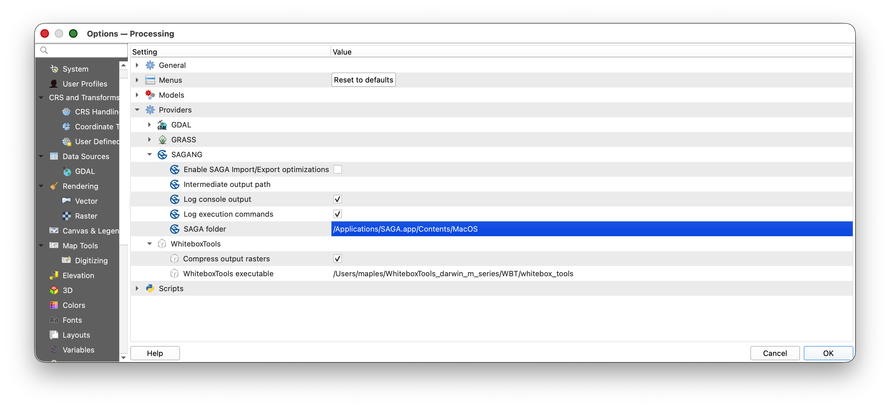

# Installing SAGA 9.2 for QGIS Processing

## Overview

SAGA GIS is a separate open-source geospatial analysis program. QGIS can call SAGA tools from the **Processing Toolbox**, but modern QGIS installations do not include SAGA automatically.

This guide walks you through installing **SAGA 9.2.0** on macOS or Windows, then connecting it to QGIS with the **Processing Saga NextGen Provider** plugin.

> **Why this matters:** QGIS Processing is a shared toolbox interface. Some tools are built directly into QGIS, while others come from outside programs such as SAGA. Installing the plugin adds the QGIS interface for SAGA tools. Installing SAGA itself adds the actual analysis program that does the work.

## What You Should Understand After This Guide

By the end of this setup, you should be able to explain:

- why the QGIS plugin and the SAGA program are two separate pieces
- where SAGA is installed on your computer
- how to point QGIS Processing to the SAGA folder that contains the SAGA binaries
- how to check that SAGA tools appear in the QGIS Processing Toolbox

## Before You Begin

You need:

- QGIS installed

If you have not installed QGIS yet, first complete [Installing QGIS and Plugins](07_installing_qgis_and_plugins.md).

> **Current plugin note:** As checked on May 13, 2026, the QGIS plugin page for **Processing Saga NextGen Provider** still lists stable version 1.1.0 for QGIS 3.22 through 3.99, but it also says the plugin is marked for deletion. If the plugin no longer appears in QGIS Plugin Manager, ask for help before spending a long time troubleshooting.

## The Two Pieces You Are Installing

### SAGA GIS 9.2.0

SAGA GIS is the analysis software. It includes command-line programs such as `saga_cmd`, which QGIS uses in the background when you run SAGA tools from the Processing Toolbox.

For this course, use the SAGA 9.2.0 files from:

[SAGA 9.2.0 downloads on SourceForge](https://sourceforge.net/projects/saga-gis/files/SAGA%20-%209/SAGA%20-%209.2.0/)

The files you need are:

- macOS: `saga-9.2.0_mac.zip`
- Windows, easiest option: `saga-9.2.0_x64.zip`
- Windows, installer option: `saga-9.2.0_x64_setup.exe`

### Processing Saga NextGen Provider

The QGIS plugin is the connection layer. It tells QGIS how to show SAGA tools inside **Processing Toolbox** and how to send your inputs to the SAGA program.

The plugin page is:

[Processing Saga NextGen Provider in the QGIS Python Plugins Repository](https://plugins.qgis.org/plugins/processing_saga_nextgen/)

## Part 1: Install SAGA 9.2.0 on macOS

1. Go to the [SAGA 9.2.0 downloads page](https://sourceforge.net/projects/saga-gis/files/SAGA%20-%209/SAGA%20-%209.2.0/).
2. Download `saga-9.2.0_mac.zip`.
3. Open your **Downloads** folder.
4. Double-click the zip file to unzip it.
5. Move the unzipped SAGA application to a stable location. The simplest choice is your **Applications** folder.
6. Confirm that you can find the application, usually named `SAGA.app`.

> **Why move it out of Downloads?** Downloads folders often become messy or get cleaned out later. QGIS needs to remember where SAGA lives. If you move SAGA after configuring QGIS, the connection will break and you will need to set the path again.

### Find the macOS SAGA Binary Folder

QGIS does not need the outer `SAGA.app` folder. It needs the folder inside the app bundle that contains the SAGA command-line binaries.

1. In **Finder**, open **Applications**.
2. Find `SAGA.app`.
3. Control-click or right-click `SAGA.app`.
4. Choose **Show Package Contents**.
5. Open `Contents`.
6. Open `MacOS`.
7. This is the folder QGIS needs.

The path will usually look like:

```text
/Applications/SAGA.app/Contents/MacOS
```

You should see files in that folder related to SAGA. The most important one for QGIS Processing is usually `saga_cmd`.

> **Screenshot placeholder:** Finder window showing `SAGA.app`, the **Show Package Contents** menu, and the `Contents/MacOS` folder containing the SAGA command-line files.

### If macOS Blocks SAGA

When you first open or run software downloaded outside the App Store, macOS may show a security warning.

If this happens:

1. Open **System Settings**.
2. Go to **Privacy & Security**.
3. Look for a message saying SAGA was blocked.
4. Choose **Open Anyway** if you trust the file you downloaded from the official SAGA SourceForge page.
5. Try opening SAGA again.

You may not need this step. It depends on your macOS security settings.

## Part 2: Install SAGA 9.2.0 on Windows

Windows has two practical options. Use the zip option if you do not have administrator permissions.

### Recommended Windows Option: Zip File

1. Go to the [SAGA 9.2.0 downloads page](https://sourceforge.net/projects/saga-gis/files/SAGA%20-%209/SAGA%20-%209.2.0/).
2. Download `saga-9.2.0_x64.zip`.
3. Open your **Downloads** folder.
4. Right-click the zip file.
5. Choose **Extract All**.
6. Extract it to a stable location, such as:

```text
C:\SAGA\saga-9.2.0_x64
```

or:

```text
C:\Users\your-user-name\Documents\SAGA\saga-9.2.0_x64
```

7. Open the extracted folder.
8. Confirm that the folder contains SAGA files such as `saga_cmd.exe`.

> **Why the zip option is useful:** The zip version does not require a formal installation. You unzip it, keep it somewhere stable, and point QGIS to that folder.

### Windows Installer Option

1. Go to the [SAGA 9.2.0 downloads page](https://sourceforge.net/projects/saga-gis/files/SAGA%20-%209/SAGA%20-%209.2.0/).
2. Download `saga-9.2.0_x64_setup.exe`.
3. Double-click the installer.
4. If Windows asks for administrator permission, approve it if this is your own computer. On a lab or managed computer, ask for help.
5. Accept the default installation location unless you have a reason to change it.
6. After installation, find the SAGA installation folder.

The path may look something like:

```text
C:\Program Files\SAGA
```

or:

```text
C:\Program Files\SAGA GIS
```

The exact folder name can vary. The folder QGIS needs is the one that contains `saga_cmd.exe`.

> **Screenshot placeholder:** Windows File Explorer showing an extracted SAGA 9.2.0 folder with `saga_cmd.exe` visible.

## Part 3: Install the QGIS Processing Saga NextGen Provider Plugin

1. Open QGIS.
2. Go to **Plugins > Manage and Install Plugins**.
3. In the search box, type `Processing Saga NextGen Provider`.
4. Select **Processing Saga NextGen Provider**.
5. Click **Install Plugin**.
6. Close the Plugin Manager.
7. Restart QGIS.

If the plugin does not appear:

1. In the Plugin Manager, check whether **Show also experimental plugins** is enabled under **Settings**.
2. Search again for `SAGA`.
3. If the plugin still does not appear, the plugin may no longer be available from the QGIS plugin repository. Ask for help and include your QGIS version number.

> **Screenshot placeholder:** QGIS Plugin Manager search results showing **Processing Saga NextGen Provider** selected and ready to install.

## Part 4: Point QGIS to the SAGA Folder

After the plugin is installed, QGIS needs to know where SAGA is located on your computer.

1. Open QGIS.
2. Go to **Settings > Options**.
3. In the left panel, choose **Processing**.
4. Expand **Providers**.
5. Find **SAGANG**.
6. Look for the setting named **SAGA folder**.
7. Click the browse button next to the folder path.
8. Choose the folder that contains the SAGA binaries.



Use the appropriate folder for your operating system:


| Operating system    | Folder to choose                                      |
| --------------------- | ------------------------------------------------------- |
| macOS               | `/Applications/SAGA.app/Contents/MacOS`               |
| Windows zip install | the extracted SAGA folder that contains `saga_cmd.exe` |
| Windows installer   | the installed SAGA folder that contains `saga_cmd.exe` |

9. Click **OK** to save the Processing settings.
10. Restart QGIS.

> **Why the exact folder matters:** QGIS is not just looking for a general SAGA folder. It needs the folder where the runnable SAGA programs live. On Windows, that usually means the folder with `saga_cmd.exe`. On macOS, that usually means the `Contents/MacOS` folder inside `SAGA.app`.

> **Screenshot placeholder:** QGIS **Settings > Options > Processing > Providers > SAGANG** panel with the **SAGA folder** setting pointing to the folder that contains the SAGA binaries.

## Part 5: Confirm That SAGA Works in QGIS

1. In QGIS, open **Processing > Toolbox**.
2. In the Processing Toolbox search box, type `SAGA`.
3. Look for a SAGA provider group, usually named **SAGA Next Gen** or **SAGANG**.
4. Expand the provider group.
5. Confirm that SAGA tools are listed.

For a simple test:

1. Search the Processing Toolbox for a basic SAGA tool.
2. Open the tool.
3. Confirm that the tool dialog opens without an error.

If the tool dialog opens and the SAGA provider appears in the Processing Toolbox, QGIS has found the SAGA installation.

## Troubleshooting

### The SAGA provider does not appear in Processing Toolbox

Try these checks:

1. Restart QGIS.
2. Go to **Plugins > Manage and Install Plugins > Installed** and confirm that **Processing Saga NextGen Provider** is enabled.
3. Go to **Settings > Options > Processing > Providers > SAGANG** and confirm that the provider is enabled.
4. Confirm that the **SAGA folder** path points to the folder containing `saga_cmd` or `saga_cmd.exe`.

### QGIS says it cannot find SAGA

This usually means the path is pointed at the wrong folder.

Check:

- On macOS, do not point QGIS only to `/Applications/SAGA.app`. Use `/Applications/SAGA.app/Contents/MacOS`.
- On Windows, do not point QGIS to the zip file. Unzip it first, then point QGIS to the extracted folder containing `saga_cmd.exe`.
- If you moved the SAGA folder after configuring QGIS, update the path in **Settings > Options > Processing > Providers > SAGANG**.

### Windows shows a security warning

Windows may warn you about downloaded software.

Check that you downloaded SAGA from the official SourceForge page linked above. If this is your own computer and you trust the source, allow the installer or executable to run. If you are on a lab, library, or managed computer, ask for help instead of bypassing security settings.

### macOS shows a security warning

Use **System Settings > Privacy & Security** to allow SAGA if macOS blocks it. This is common for open-source software that is not distributed through the Mac App Store.

### The plugin is missing from QGIS Plugin Manager

The plugin repository page currently says the plugin is marked for deletion. If it disappears from Plugin Manager, do not try random replacement plugins without checking with the course staff. The safest next step is to report:

- your operating system
- your QGIS version
- whether SAGA 9.2.0 is installed
- whether you can find `saga_cmd` or `saga_cmd.exe`
- what you see when searching for `SAGA` in the QGIS Plugin Manager

## Setup Checklist

Before moving on, make sure you can answer yes to each item:

- I downloaded SAGA 9.2.0 from the course-linked SourceForge page.
- I unzipped or installed SAGA somewhere stable.
- I know where the SAGA binary folder is on my computer.
- I installed the **Processing Saga NextGen Provider** plugin in QGIS.
- I set **Settings > Options > Processing > Providers > SAGANG > SAGA folder** to the correct folder.
- I restarted QGIS.
- I can see SAGA tools in the QGIS Processing Toolbox.

## Sources

- [SAGA GIS 9.2.0 files on SourceForge](https://sourceforge.net/projects/saga-gis/files/SAGA%20-%209/SAGA%20-%209.2.0/)
- [Processing Saga NextGen Provider in the QGIS Python Plugins Repository](https://plugins.qgis.org/plugins/processing_saga_nextgen/)
