# Lab 1: Introduction to QGIS — Being John Snow

> **Turn-in for grading:** This lab includes material that must be turned in for grading. Complete the required deliverables and submit them as instructed by the course.

## The Broad Street Outbreak: A Story of Spatial Thinking

In late August 1854, a devastating cholera outbreak erupted in the Soho neighborhood of London. Within three days, 127 people were dead. Within a week, three-quarters of the residents had fled the area, and the death toll would eventually climb to over 600.

At the time, the prevailing scientific theory — known as **miasma theory** — held that diseases like cholera were caused by "bad air" rising from rotting organic matter. Most physicians and public health officials believed that the foul smells of London's overcrowded neighborhoods were themselves the cause of illness. Under this theory, the solution was better ventilation and sanitation of the air, not the water.

**Dr. John Snow**, a physician and one of the founders of modern epidemiology, was skeptical. He had already published a paper in 1849 arguing that cholera was transmitted through contaminated water, but the medical establishment was unconvinced. The Broad Street outbreak gave him an opportunity to gather evidence.

Snow began by doing something deceptively simple: **he made a map**. He went door to door in the Soho neighborhood, recording the address and number of deaths at each household. He then plotted these locations on a map of the neighborhood alongside the locations of the public water pumps that served the area. The spatial pattern was striking — the deaths clustered tightly around a single pump at the intersection of Broad Street and Cambridge Street (now Broadwick and Lexington Streets).

But Snow didn't work alone. **Reverend Henry Whitehead**, the curate of St. Luke's Church in Soho, initially set out to *disprove* Snow's water theory. Whitehead knew the neighborhood intimately — he had visited hundreds of parishioners during the outbreak — and he was skeptical that a single pump could be responsible. However, as Whitehead conducted his own investigation, interviewing families and tracing the movements of victims, his evidence increasingly *supported* Snow's hypothesis.

Whitehead made a critical discovery: he identified what was likely the **index case** — a baby at 40 Broad Street whose soiled diapers had been emptied into a cesspool just three feet from the Broad Street pump well. The cesspool's brick lining had decayed, allowing sewage to seep into the well water. This was the spatial connection between the source of contamination and the deaths that Snow's map had revealed.

Together, Snow's spatial analysis and Whitehead's ground-level detective work convinced the local Board of Guardians to remove the handle of the Broad Street pump on September 8, 1854. The outbreak was already waning by then — most residents had fled — but their combined investigation became one of the founding examples of **epidemiology** and **spatial analysis**. It demonstrated that *where* something happens can be the key to understanding *why* it happens.

In this lab, you will retrace Snow's steps using modern GIS tools: plotting death addresses, mapping pump locations, and using spatial analysis to determine which pump was associated with the most deaths.

> **Background Viewing:** Steven Johnson's TED Talk — [How the "Ghost Map" Helped End a Killer Disease](https://www.ted.com/talks/steven_johnson_how_the_ghost_map_helped_end_a_killer_disease)

## Overview

Along the way, you will practice the fundamental skills of working with a desktop GIS:

* Opening and saving a QGIS project
* Adding and styling data layers (vector, raster, and CSV)
* Understanding coordinate reference systems (CRS)
* Performing basic spatial analysis (spatial mean)

## Setup

Before starting this lab, you should have already completed the **Week 00** setup materials:

* [Installing QGIS and Plugins](07_installing_qgis_and_plugins.md) — QGIS should be installed with the **QuickMapServices** plugin ready to go.
* [Things You Need to Know About Your Computer](../week00/00_things_you_need_to_know_about_your_computer.md) — You should have a local (non-cloud-synced) folder for your GIS work.
* [Introduction to Spatial Data Formats](03_introduction_to_spatial_data_formats.md) — Review if you need a refresher on file types like shapefiles, GeoJSON, and CSV.

### Data

Download the data package from: [https://github.com/mapninja/QGIS-101/archive/master.zip](https://github.com/mapninja/Earthsys144/blob/17dead3dcb6ce05858236394d412085fcf43ccd1/data/snow_data.zip)

Extract the zip file and place it in your local GIS working folder (remember — **not** in a cloud-synced folder like iCloud, OneDrive, or Dropbox! See the [Week 00 guide](../week00/00_things_you_need_to_know_about_your_computer.md) if you need a reminder about why).

The project data folder contains the following datasets:

* **deathAddresses.csv** — A table of latitude and longitude coordinates for addresses affected by the cholera outbreak. This table also contains the number of deaths at each address. This is an example of **tabular data with embedded spatial information** — it's not a spatial format by itself, but we can turn it into one using the coordinate columns.
* **Water_Pumps.geojson** — A **GeoJSON** file containing the locations of all 13 water pumps from Snow's original map. As you learned in [Week 00](03_introduction_to_spatial_data_formats.md), GeoJSON is a single-file spatial format (unlike shapefiles), which makes it convenient for sharing.
* **John_Snow_Map.tif** — A **georeferenced** image of the map from John Snow's original report on the cholera outbreak of 1854. Georeferencing means that real-world coordinates have already been assigned to this image, so QGIS knows exactly where on Earth it belongs.
* **Study_Area.shp** — A rectangular polygon that describes our area of interest. This is a **shapefile**, which as you learned in [Week 00](03_introduction_to_spatial_data_formats.md), is actually a collection of multiple files (`.shp`, `.shx`, `.dbf`, `.prj`, etc.) that must stay together in the same folder.

## Getting Started on a Project  

In this section you will create a new QGIS project, get oriented to the interface, add a basemap, and load your first data layer.

### Create a Map Document

1. Open **QGIS**. If you set up a custom User Profile during [Week 00](07_installing_qgis_and_plugins.md), make sure you are using it (**Settings > User Profiles**).
2. Save the empty project to the top level of your data folder (the one you extracted the zip into), using **Project > Save As**. Name it something meaningful like `SnowMap.qgz` or `Cholera_Map.qgz`.

> **What is a `.qgz` file?** As you learned in [Week 00](../week00/00_things_you_need_to_know_about_your_computer.md), a QGIS project file is very small (usually under 1 MB). It does **not** contain your actual data — it only stores references to where your data files are on disk, plus your styling and layout choices. This is why keeping your `.qgz` file and your data folder together is so important.

Notice that when you save your map document, a new item called **Project Home** appears in the **Browser panel**. This is a shortcut to the folder containing your project file — you'll use it frequently to find your data.

### The QGIS Interface

Here is a quick refresher on the three main parts of the QGIS interface:

**The Map Canvas** — This is the large central area where your data is visualized. As you add layers, change their styling (**symbology**), or reorder them, the map canvas updates to reflect those changes.

**Panels** (docked on the sides):

* **Browser Panel** — A file explorer for navigating your drives and finding data to add to your project.
* **Layers Panel** — Lists all the data layers currently loaded in your project. The order matters: layers at the top are drawn on top of layers below them.
* **Layer Styling Panel** — A quick way to change how a layer looks (colors, symbols, labels) without opening the full Properties dialog. Enable it from **View > Panels > Layer Styling**.

**Toolbars** (across the top):

* **Project** — New, Open, Save, Save As, and Print Layout tools.  
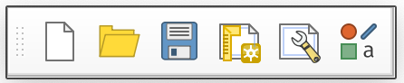
* **Map Navigation** — Pan, Zoom In/Out, Zoom to Full Extent, Zoom to Layer, and Refresh.  
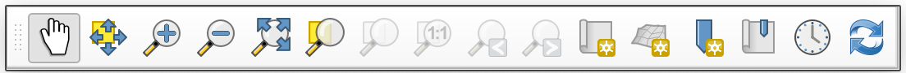
* **Attributes** — Identify features, open the attribute table, measure distances/areas, and manage spatial bookmarks.  
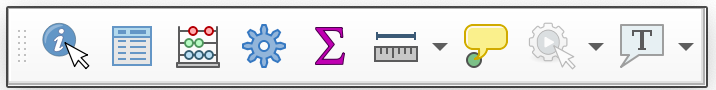
* **Data Source Manager** — Add vector, raster, or delimited text layers.  
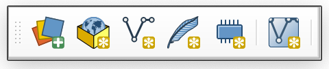
* **Editing** — Tools for creating and modifying features. These are grayed out until you start an edit session.  
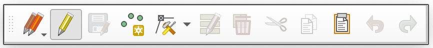  
* **Selection** — Select or deselect features by clicking, by attribute value, or by spatial location.  
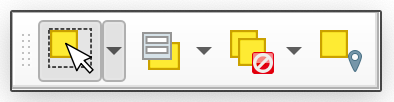

> **Tip:** You can show or hide any toolbar or panel by right-clicking in the toolbar area, or from the **View** menu.

### Customize the Interface

The default QGIS layout includes many toolbars that you may not need right away. You can rearrange the interface by dragging the dotted handles on toolbars or the title bars of panels. You can also toggle panels and toolbars on and off from **View > Panels** and **View > Toolbars**.

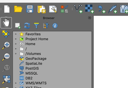

1. Rearrange your toolbars and panels until your QGIS interface is comfortable to work with. A clean layout might look something like this:

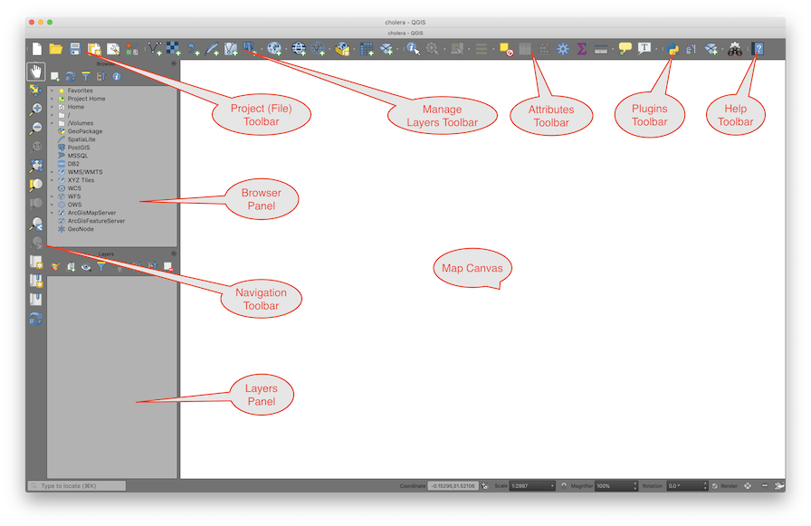

### Add a Basemap

A **basemap** is a background reference map (streets, satellite imagery, terrain, etc.) that gives geographic context to your data. We will use the **QuickMapServices** plugin to add one.

If you already installed QuickMapServices and downloaded the contributed pack during [Week 00](07_installing_qgis_and_plugins.md), skip to step 4. Otherwise:

1. Go to **Plugins > Manage and Install Plugins**, search for **QuickMapServices**, and click **Install Plugin**.
2. Go to **Web > QuickMapServices > Settings**, select the **More Services** tab, and click **Get contributed pack**.  
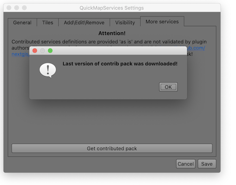  
3. Click **Save** to close the Settings dialog.
4. Go to **Web > QuickMapServices > Stamen > Stamen Toner Lite** to add a simple black-and-white basemap.
5. **Save** your project.

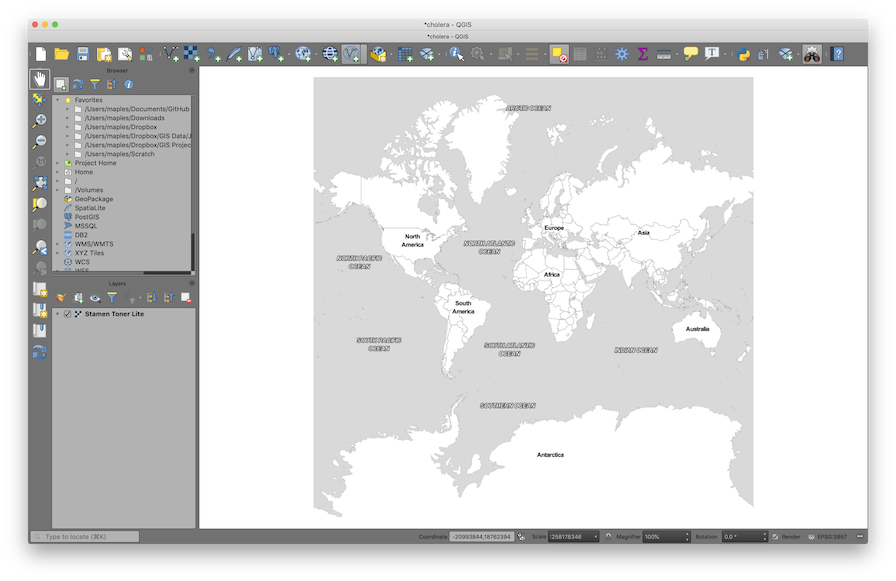

> **What is a basemap service?** Unlike the data files on your hard drive, a basemap is streamed from the internet as a set of pre-rendered image tiles. You can see it but you can't edit it or query its attributes. It's purely for visual reference.

### Add the Study Area Layer

Now we'll add our first real data layer — a **shapefile** that defines our study area in the Soho neighborhood of London.

> **Reminder:** A shapefile is actually a bundle of files (`.shp`, `.shx`, `.dbf`, `.prj`, etc.) that must stay together in the same folder. You only need to open the `.shp` file — QGIS will find the others automatically. See [Introduction to Spatial Data Formats](03_introduction_to_spatial_data_formats.md) for more detail.

1. In the **Browser panel**, find the data folder for this lab (look for **Project Home**) and double-click on **Study_Area.shp** to add it to your project.
2. In the **Layers panel**, right-click on **Study_Area** and select **Zoom to Layer**.
3. Open the **Layer Styling panel** (if not already visible, enable it from **View > Panels > Layer Styling**).
4. In the Layer Styling panel, click on **Simple Fill**, then change the **Fill style** to **No Brush** so the polygon is just an outline. Optionally adjust the **Stroke color** and **Stroke width** to make it stand out against the basemap.
5. **Save** your project.

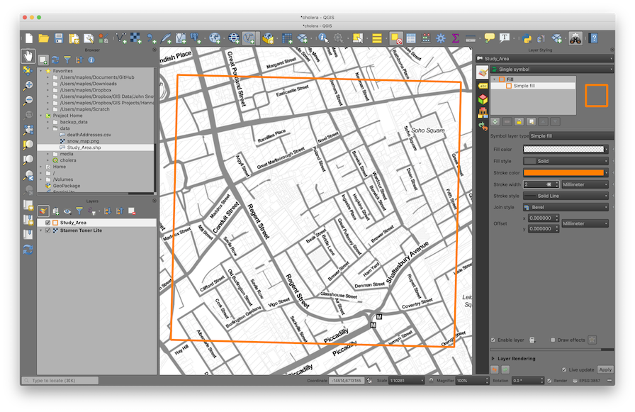

### Explore Navigation Tools

The **Map Navigation Toolbar** provides the main tools for moving around the Map Canvas. Take a moment to try each one:

| Tool | Name | What it does |
|------|------|--------------|
| 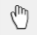 | **Pan Map** | Click and drag to move around the map without changing the zoom level. |
| 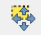 | **Pan to Selection** | Centers the map on the currently selected feature(s). |
| 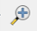 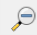 | **Zoom In / Zoom Out** | Click or drag a box to zoom. You can also use your scroll wheel. |
| 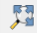 | **Zoom Full** | Zooms out to show all layers. (This sometimes zooms too far out if you have a global basemap loaded.) |
| 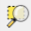 | **Zoom to Selection** | Zooms to fit the currently selected feature(s) in the canvas. |
| 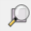 | **Zoom to Layer** | Zooms to fit a specific layer's extent. |
| 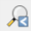  | **Zoom Last / Zoom Next** | Undo/redo your zoom and pan history — very useful if you accidentally zoom to the wrong place. |
|  | **Refresh** | Redraws the map canvas. |

> **Keyboard shortcut:** You can also pan by holding the **spacebar** and dragging, and zoom with your **scroll wheel**, regardless of which tool is active.

### Understanding Map Scale

As you zoom in and out, notice the **Scale** value displayed at the bottom of the QGIS window (e.g., `1:10,000`). This ratio tells you the relationship between a distance on screen and the real-world distance it represents.

* **1:1,000** means 1 cm on screen = 1,000 cm (10 m) in the real world — this is a **large scale** (zoomed in, showing a small area in great detail).
* **1:1,000,000** means 1 cm on screen = 10 km in the real world — this is a **small scale** (zoomed out, showing a large area with less detail).

The naming is counterintuitive: *large* scale = *small* area. Think of it this way: on a large-scale map, the features themselves appear large.

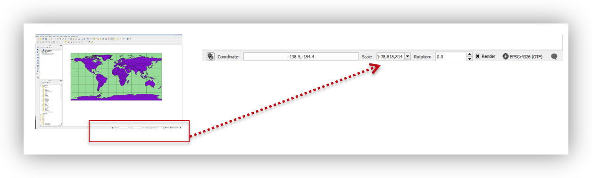

### Spatial Bookmarks

**Spatial bookmarks** save a specific map extent (location + zoom level) so you can return to it quickly. This is useful when you need to zoom around the map but want to snap back to your study area.

1. Right-click in any empty area of the toolbar and enable the **Spatial Bookmarks** panel.
2. Right-click on your **Study_Area** layer and select **Zoom to Layer**.
3. In the Spatial Bookmarks panel, click **Add Bookmark** and name it **SOHO**.  
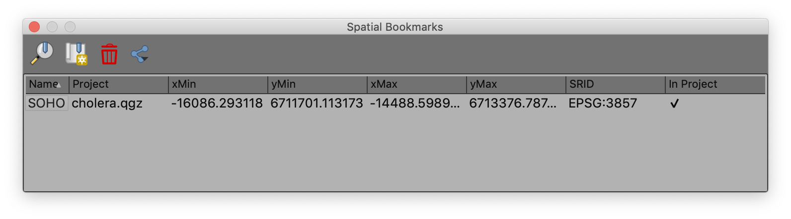
4. Now click **Zoom Full** to zoom out to the world. Then use the **Zoom to Bookmark** button to jump back to your study area — much faster than panning and zooming manually.

## Working with Coordinate Reference Systems (CRS)

Every spatial dataset has a **Coordinate Reference System (CRS)** that defines how its coordinates map to locations on Earth. Each CRS is identified by an **EPSG code** — a unique numeric identifier (e.g., `EPSG:4326` for standard latitude/longitude). If this concept is fuzzy, review the CRS section above in this lab.

In QGIS, the **Project CRS** controls how all layers are displayed on screen. QGIS can reproject layers on-the-fly so that data in different CRS can be shown together, but it's good practice to set your project CRS to match the CRS you want to work in.

### Examine the CRS of a Data Layer

1. Right-click on the **Study_Area** layer and select **Properties**.
2. Click on the **Source** tab and note the **Coordinate Reference System** listed:  

    `EPSG:32630 — WGS 84 / UTM zone 30N`  

    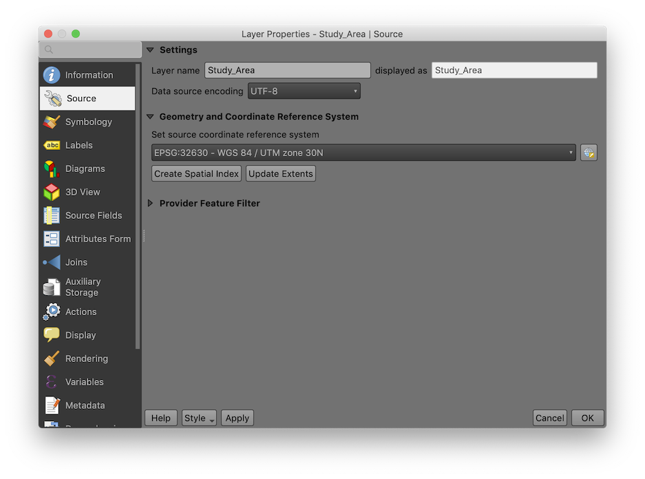

    > **What is UTM?** Universal Transverse Mercator (UTM) is a **projected coordinate system** that divides the world into 60 zones. Each zone uses meters as its unit, which makes it ideal for measuring distances and areas. London falls in UTM Zone 30N. The "WGS 84" part tells you which model of the Earth's shape (**datum**) is being used.

3. Click **OK** to close the Properties dialog.
4. Now check the **Project CRS**: go to **Project > Properties** and click the **CRS** tab. It should currently show:  

    `EPSG:3857 — WGS 84 / Pseudo-Mercator`  

    This is the CRS of the basemap (the first layer added to the project), and it has become the default Project CRS.  

    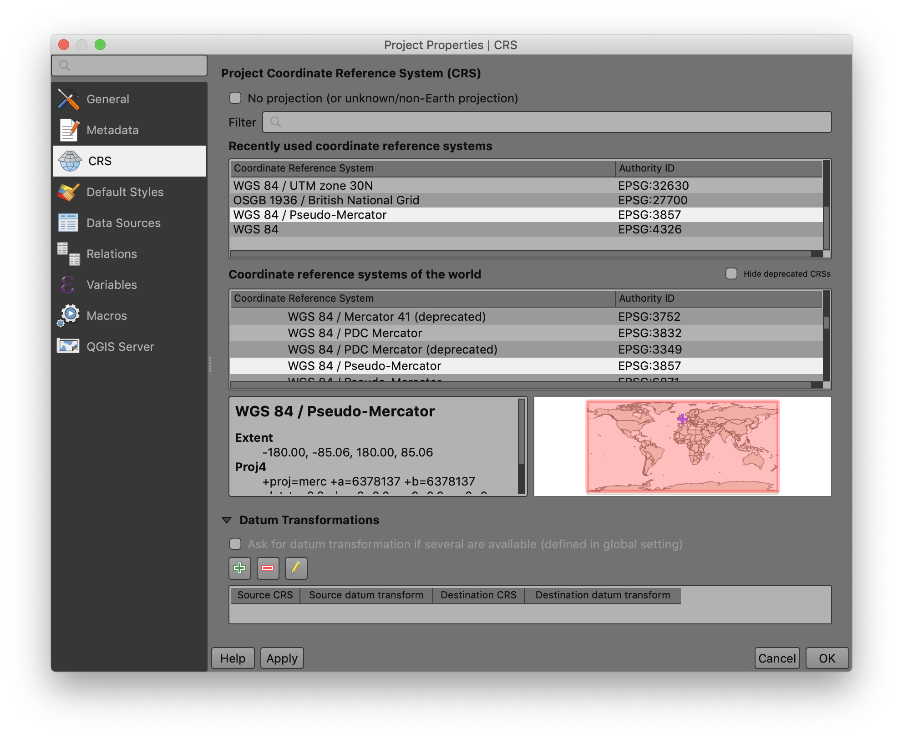

### Change the Project CRS

For spatial analysis, we want our project in the same **projected (meter-based)** CRS as our Study Area layer. Let's change it:

1. In the CRS tab of Project Properties, type `32630` into the **Filter** box, or find it under "Recently used coordinate reference systems."  
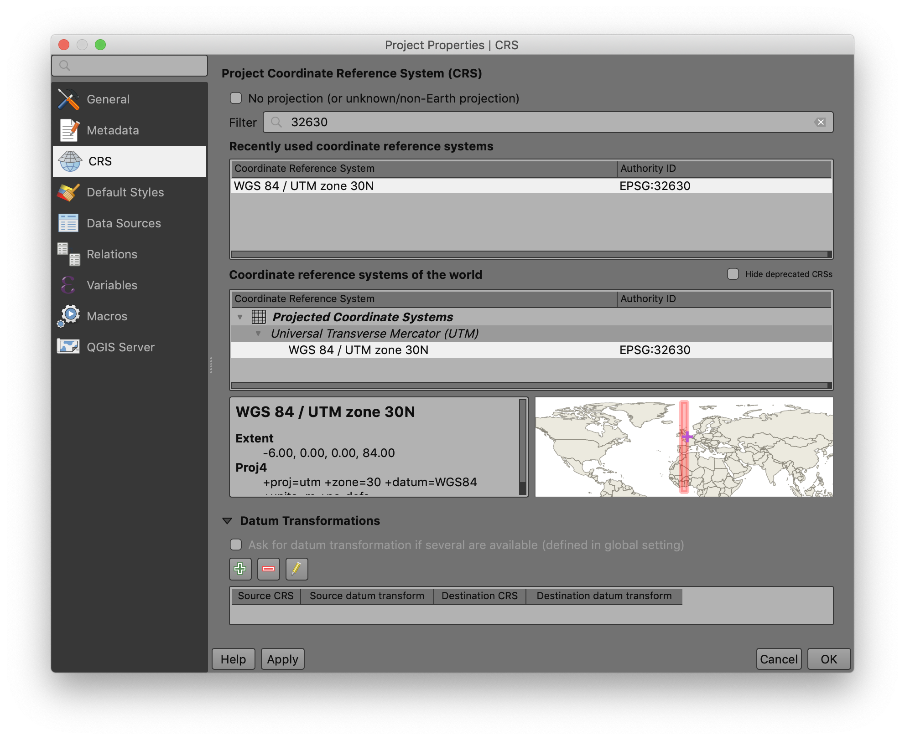
2. Select `EPSG:32630 — WGS 84 / UTM zone 30N` and click **OK**.
3. Save your project by clicking the **Save** button  on the toolbar.

You should see the study area rectangle rotate slightly — it is now oriented true north-south, because UTM Zone 30N aligns its grid to the north in this part of the world.

## Adding and Visualizing Data

### Create a Point Layer from a CSV Table

As you learned in [Week 00](03_introduction_to_spatial_data_formats.md), spatial data doesn't always come in a spatial format. A very common scenario is receiving a **CSV (comma-separated values)** file that has columns for latitude and longitude. QGIS can convert these coordinates into map points.

> **Key concept:** Creating points from a CSV produces a **temporary, dynamic layer** — it references the original CSV file on disk. If you move or delete the CSV, the layer breaks. To make it permanent, you would export it to a spatial format like GeoJSON or shapefile. (We'll practice exporting later in this lab.)

1. Click the **Data Source Manager** button 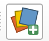 on the toolbar (or go to **Layer > Add Layer > Add Delimited Text Layer**).
2. For **File Name**, browse to the **data** folder and select **deathAddresses.csv**.
3. Click the **Delimited Text** tab 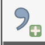 and configure the settings as follows:

| Setting | Value |
|---:|:---|
| File Format | CSV |
| Record and Field Options | "First record has field names" = checked; "Detect field types" = checked |
| Geometry Definition | Point coordinates: **X field** = `xcoord`, **Y field** = `ycoord` |
| Geometry CRS | `EPSG:4326 - WGS 84` |

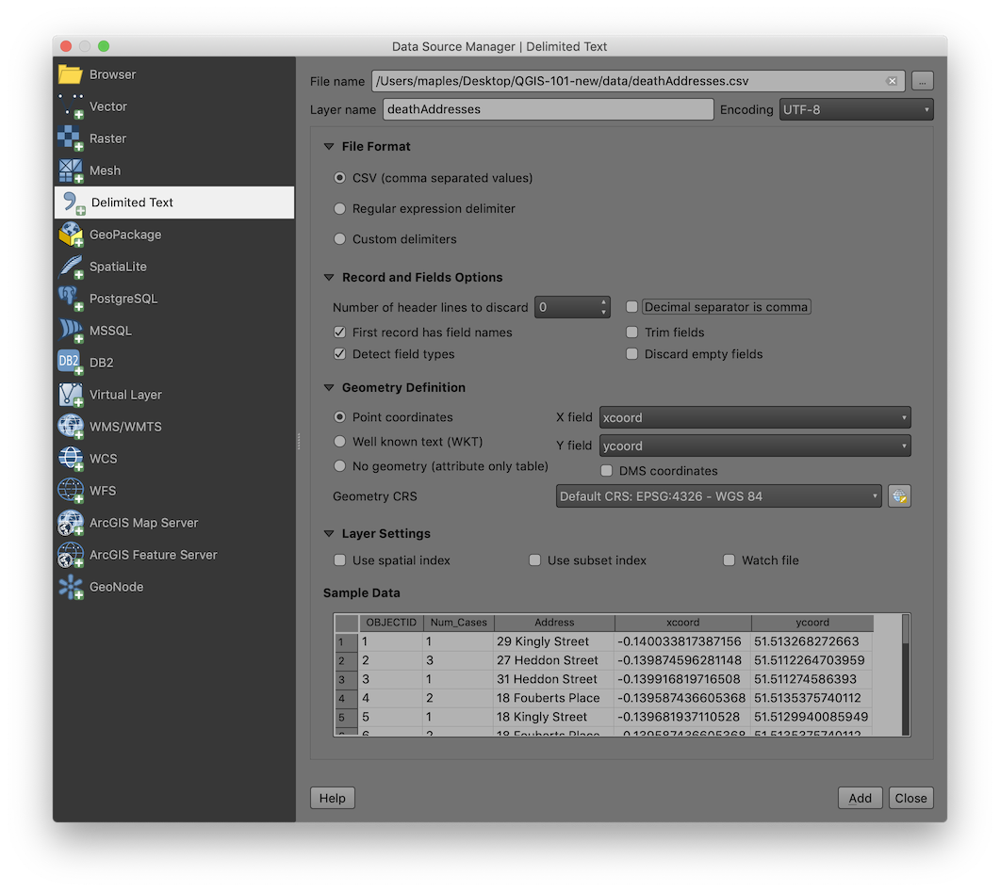  

4. Click **Add & Close** to import the layer.

You should now see a cluster of points in the Soho area — these are the addresses where cholera deaths occurred.

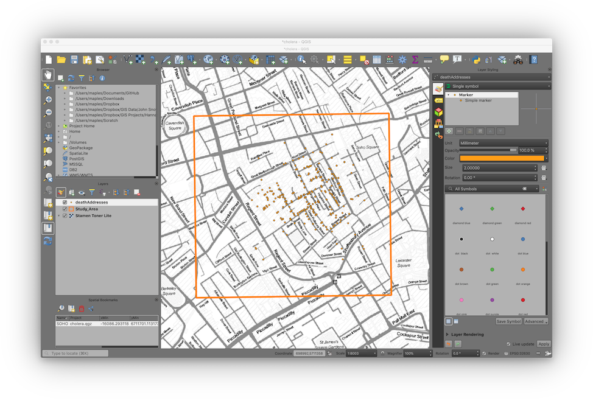

> **Why EPSG:4326?** The coordinates in this CSV are in **latitude and longitude** (decimal degrees), which is the WGS 84 geographic coordinate system (`EPSG:4326`). Even though our project is now in UTM (`EPSG:32630`), QGIS reprojects the points on-the-fly so everything lines up.

### Layer Symbology — Proportional Symbols

**Symbology** is how you control the visual appearance of your data on the map. Right now, all the death address points look the same, but the data includes a `Num_Cases` field — the number of deaths at each address. Let's make the symbol size reflect this value.

1. Click on the **deathAddresses** layer in the Layers panel to ensure it's selected in the **Layer Styling panel**.
2. Apply the following symbology settings:

| Setting | Value |
|---:|:---|
| Symbology Type | Graduated |
| Column | Num_Cases |
| Symbol | *click to change the color if you like* |
| Legend Precision | 1 |
| Method | Size |
| Size from | 10, 50, 'Map Units' |
| Classes > Mode | Equal Interval |
| Classes | 3 |

Because QGIS updates symbology live, you should see the changes apply as you adjust each setting.

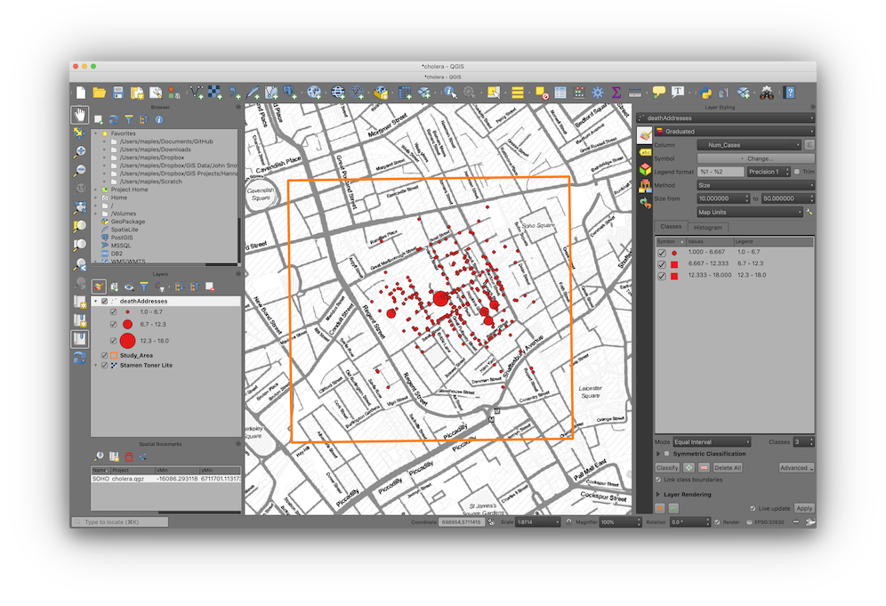

> **What is "Graduated" symbology?** Unlike **Single Symbol** (all features look the same) or **Categorized** (one symbol per unique value), **Graduated** symbology maps a continuous numeric field to a visual variable like size or color. This is also called a **proportional symbol** map — a core technique in cartography.

#### Bonus: Adding Drop Shadows

1. At the bottom of the Layer Styling panel, check the **Draw Effects** option, then click the star icon that becomes active.
2. Enable **Drop Shadow** and experiment with the settings.

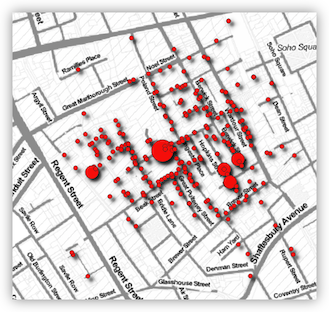

### Viewing the Attribute Table

Every vector layer has an **attribute table** — a spreadsheet-like table where each row is a geographic feature and each column is an attribute (a piece of information about that feature). This is the non-spatial side of your spatial data.

1. Right-click on the **deathAddresses** layer in the Layers panel and select **Open Attribute Table**.
2. Explore the table: you can sort columns by clicking on their headers, scroll through records, and select features by clicking on row numbers. Notice how selected rows highlight the corresponding points on the map.
3. Close the Attribute Table when you're done.

### Statistics on a Field

The `Num_Cases` field records the number of cholera deaths at each address. Let's get a quick statistical summary to understand the distribution.

1. Go to **Vector > Analysis Tools > Basic Statistics for Fields**.
2. Set **Input layer** to **deathAddresses** and **Field to calculate statistics on** to **Num_Cases**.
3. Click **Run**, then **Close**.
4. Look for the **Results Viewer** panel (it should appear automatically) and click the **hyperlink** to open the summary report.  
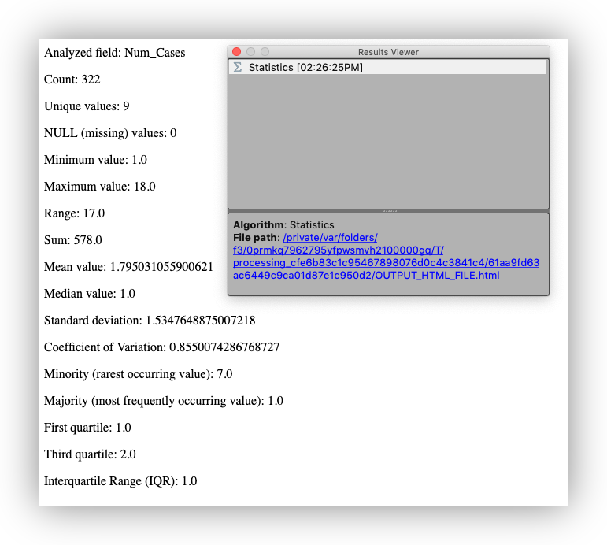

> **What do these statistics tell you?** The mean, max, and standard deviation give you a sense of whether deaths were evenly spread across addresses or concentrated at a few locations. This kind of exploratory summary is often the first step in any spatial analysis.

## Adding the Water Pump Locations

Now let's add the water pump data. Snow's original map marked 13 public water pumps in the Soho neighborhood. These locations have been captured for you in a **GeoJSON** file.

### Add the Water Pumps Layer

1. In the **Browser panel**, navigate to your project's **data** folder and double-click on **Water_Pumps.geojson** to add it to your project.
2. You should see 13 pump points appear on the map, scattered across the Soho neighborhood.

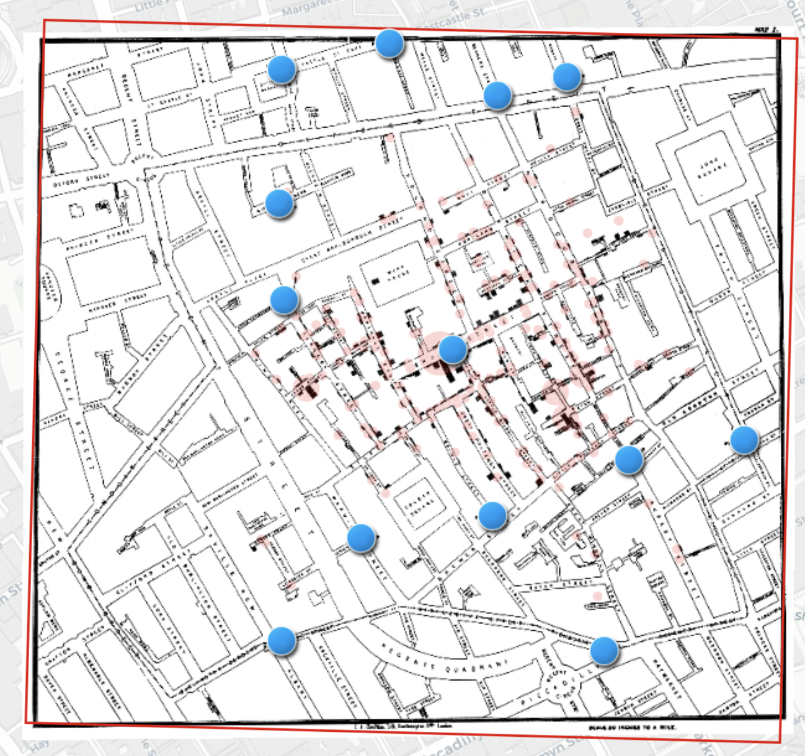

### Add Labels to the Water Pumps

1. Select the **Water_Pumps** layer in the Layers panel.
2. In the **Layer Styling panel**, click the **Labels** tab 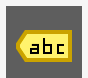.
3. Change the dropdown from **No Labels** to **Single Labels**.
4. Set **Label with** to the `Label` field.
5. Increase **Text Size** to **14**.
6. Click the **Buffer** tab and enable **Draw text buffer** to add a halo around the text for readability.

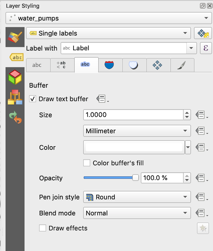

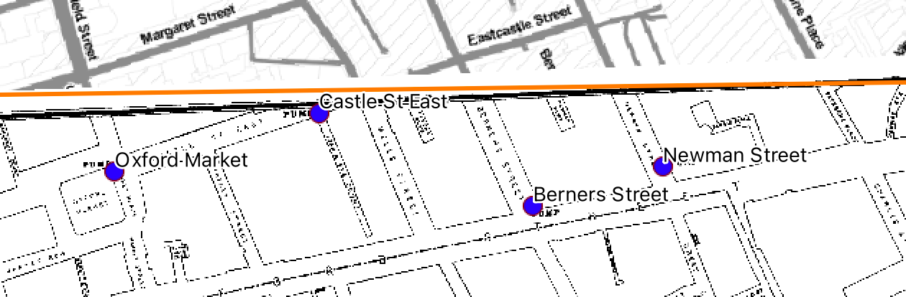

### Add the Georeferenced Snow Map

The data folder also includes a georeferenced version of John Snow's original cholera map. Let's add it as a visual reference layer.

> **What is a georeferenced image?** A georeferenced image is a picture (like a scanned map or satellite photo) that has been assigned real-world coordinates so QGIS knows where on Earth it belongs. Without georeferencing, a map image is just a picture with no spatial information. We'll cover the georeferencing process itself in a later lab — for now, we're using a map that has already been georeferenced for you.

1. In the **Browser panel**, double-click on **John_Snow_Map.tif** to add it to your project.
2. The georeferenced map should appear overlaid on your basemap, aligned with the study area. If it's covering your other layers, drag it below the **deathAddresses** and **Water_Pumps** layers in the **Layers panel**.
3. Use the navigation tools to zoom in and explore — you should be able to see street names, building outlines, and the pump locations marked on Snow's original map lining up with the GeoJSON points.

> **Tip:** You can adjust the transparency of the Snow map layer to see both the historic map and the modern basemap at the same time. In the **Layer Styling panel**, look for the **Opacity** slider.

## Exploring Spatial Patterns

Now that we have the death addresses and water pump locations on our map, let's use a simple spatial analysis tool to quantify *where* the center of the outbreak is. The **mean center** helps you see whether the deaths are clustered near a particular pump.

### Spatial Mean (Mean Center)

The **mean center** (or spatial mean) is simply the average x-coordinate and average y-coordinate of all features — the geographic "center of gravity" of the distribution.

1. Go to **Vector > Analysis > Mean Coordinate(s)**.  
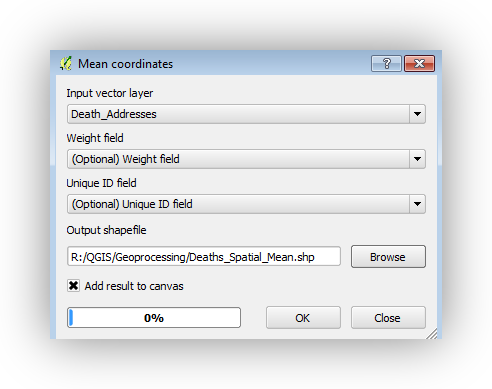
2. Set **Input layer** to **deathAddresses**.
3. Leave **Weight field** and **Unique ID field** blank (optional).
4. Save the output as `Deaths_Spatial_Mean.shp` in your data folder.
5. Click **Run**, then **Close**.
6. Style the resulting point with a distinctive symbol so it stands out.

### Weighted Spatial Mean

A simple mean center treats every address equally, but addresses with more deaths should "pull" the center more strongly. A **weighted spatial mean** accounts for this.

1. Run the **Mean Coordinate(s)** tool again.
2. This time, set **Weight field** to `Num_Cases`.
3. Save the output as `Deaths_Weighted_Spatial_Mean.shp`.
4. Style the result with a different symbol.

Notice how the weighted mean center shifts toward the Broad Street pump — addresses with more deaths pull the center in that direction.

> **Bonus:** Try running the tool with different weight values or subsets of the data to see how the mean center shifts.

## Conclusion

In this lab, you retraced the spatial investigation that helped establish germ theory and modern epidemiology. You:

* Created a QGIS project and learned to navigate the QGIS interface
* Added basemap, vector, raster, and CSV-based layers
* Learned about coordinate reference systems and why projections matter
* Turned a CSV table into map points using coordinates
* Used the spatial mean and weighted spatial mean to see where the outbreak was centered

The weighted spatial mean shifts toward the Broad Street pump — the same conclusion Snow and Whitehead reached in 1854, using pen, paper, and shoe leather.

In future labs, we'll build on these skills with georeferencing, digitizing, spatial joins, Voronoi analysis, hotspot mapping, and more.

---

**Further reading on QGIS cartography and map layouts:**
* [QGIS Cartography Workshop](https://sites.google.com/stanford.edu/qgis-101?usp=sharing)
* [Maps for Academic Journals](https://sites.google.com/stanford.edu/gis-cartography/workshops/maps-for-academic-journals?authuser=0)
