# Logging in to Google Earth Engine

> **Turn-in for grading:** This guide includes material that must be turned in for grading. Complete the required deliverables and submit them as instructed by the course.

## What is Google Earth Engine?

Google Earth Engine (GEE) is a cloud-based platform that lets you access and analyze massive amounts of satellite imagery and geospatial data without needing a powerful computer. Think of it like a library in the cloud where you can browse and analyze global imagery from the past few decades in real-time.

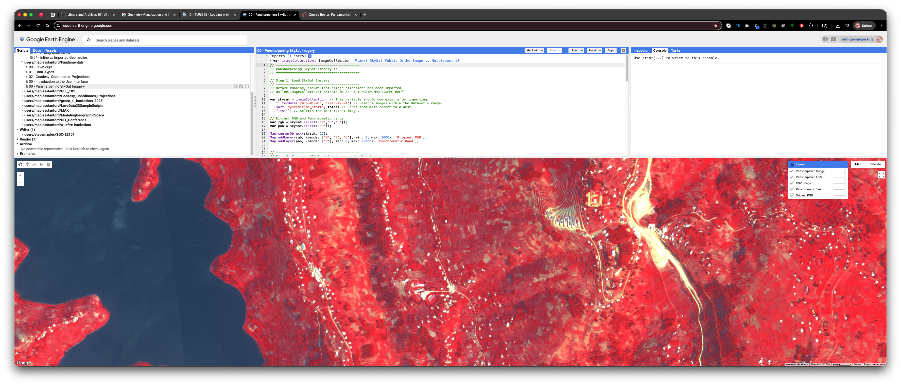

**Important concepts:**

- **Cloud-based** means the computing happens on Google's servers, not your laptop
- **Satellite imagery** is pictures of Earth taken from space
- **Geospatial analysis** is analyzing data about locations on Earth

## Why Do We Need a Google Cloud Project?

Google Earth Engine operates through something called a "Google Cloud Project" — this is essentially your account workspace within Google's cloud system. It's like opening a lab notebook where your GEE work gets organized and tracked. You need this project to:

1. Access satellite data
2. Run your analyses
3. Keep track of your work
4. Get compute resources (processing power) from Google

## Learning Objectives

By the end of this guide, you will be able to:

- Log into Google Earth Engine
- Create your first Google Cloud Project
- Register your project for non-commercial educational use
- Enable the Earth Engine API (the tool that lets you use GEE)
- Select your project so you can start analyzing data
- Share your work with instructors and classmates

## Required Turn-In for Week 00

For Week 00, you are not being asked to write a full Earth Engine analysis from scratch. Instead, the goal is to confirm that you can open, run, annotate, and share a script in the Earth Engine Code Editor.

You must submit:

- A working Google Earth Engine "Get Link" URL

That link must point to a script that:

- Was opened from a sample script in the Google Earth Engine Data Catalog
- Includes a comment with your name
- Includes at least one comment explaining what you did
- Includes inline comments describing any changes you made, if you chose to modify the sample script

> If you are feeling adventurous, you are welcome to change visualization settings, dates, map location, or other parts of the sample script. If you do, add inline comments so your instructor can easily see what you changed.

---

## Step-by-Step: Setting Up Your Google Earth Engine Account

### Step 1: Access Google Earth Engine

1. Go to [https://code.earthengine.google.com/](https://code.earthengine.google.com/)
2. Log in using your Stanford SUNetID credentials
3. Accept the terms of service

You should now see the **Code Editor** interface. This is where you'll write scripts and analyze satellite data. The interface has several key areas:

- **Code Editor** (center/top) - where you write your code
- **Map** (center/bottom) - where results are displayed
- **Inspector,Console,Tasks** (right/top) - where messages and results appear
- **Scripts,Docs,Assets** (left/top) - where you can store data

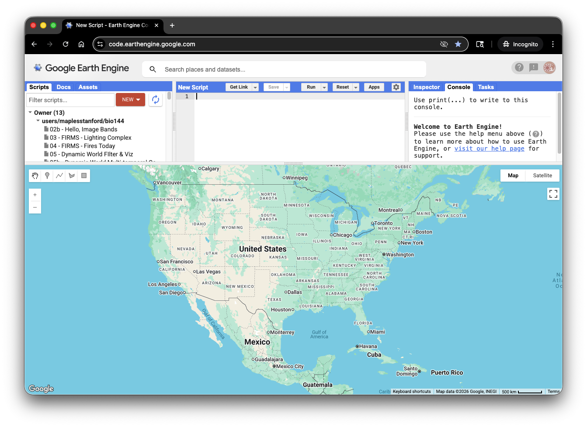

### Step 2: Create a New Google Cloud Project

Now you need to create a Google Cloud Project. This is like creating a new workspace where your GEE account lives.

1. Click on your **Profile Icon** in the top right corner of the Code Editor

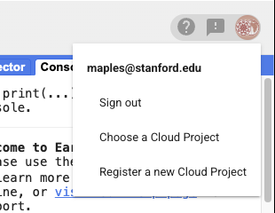

2. Select **Register a new Cloud Project**
3. Enter a **Project name** (be descriptive, like `SUNetID_EarthSys144` or `SUNetID_GIS-Analysis-Spring2026`, and use your **SUNetID**, so that it is easy to search for in the GCP Folder!)

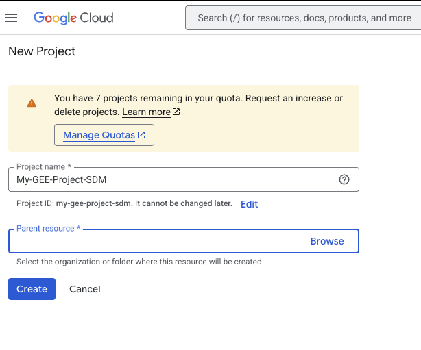

4. Click on the **Parent resource > Browse** link
5. Select **"GEE Student Projects"** from the list

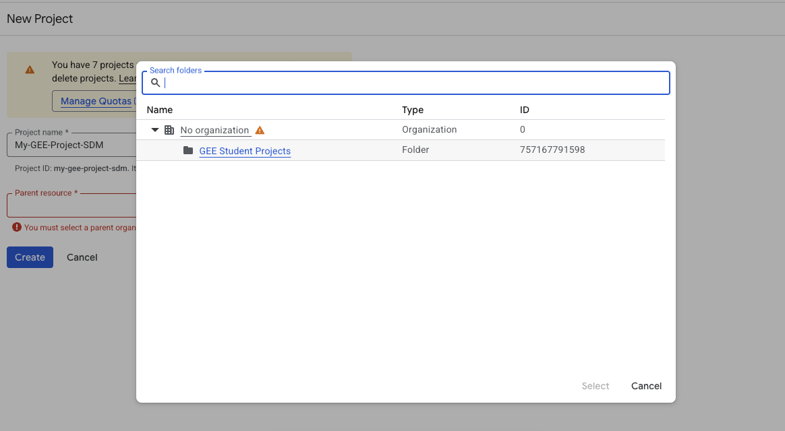

6. Click the **Create** button to mint your new project

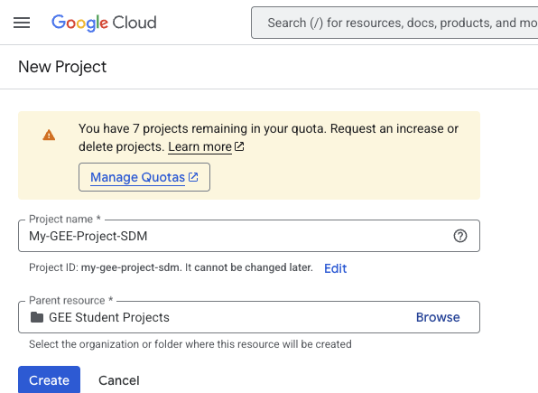

The system will now create your project. This may take a moment.

### Step 3: Access the Configuration Dashboard

Once your project is created, you should automatically go to the Configuration Dashboard. If not:

1. Click on your **Profile Icon** again
2. Select **Select Project**
3. Choose the project you just created
4. Click **Select**

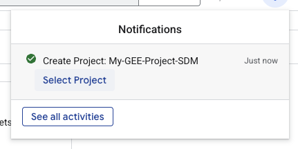

**Note:** The Configuration Dashboard is where you configure permissions and settings for your project. Make sure you're viewing the correct project name before proceeding.

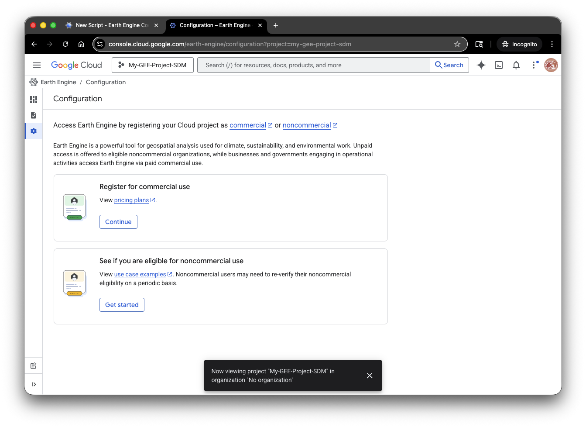

### Step 4: Register Your Project for Non-Commercial (Educational) Use

For this course, you'll register your project as a non-commercial educational project, which gives you access to GEE's data and computing power without needing a credit card.

1. In the Configuration Dashboard, click on **See if you are eligible for non-commercial use > Get Started**

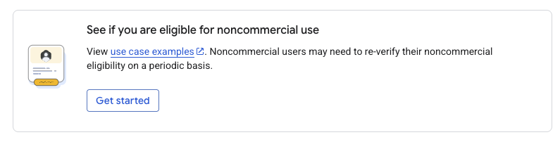

2. Fill out the registration form with information about your use case:
   - Select **"Research & Education"** as your primary use case
   - Confirm that your use is non-commercial

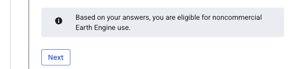

3. Click **Check Eligibility**
4. When asked to choose a compute tier, select **"Community"**
   - Community tier is designed for students and small research projects
   - It provides free access with reasonable computing limits

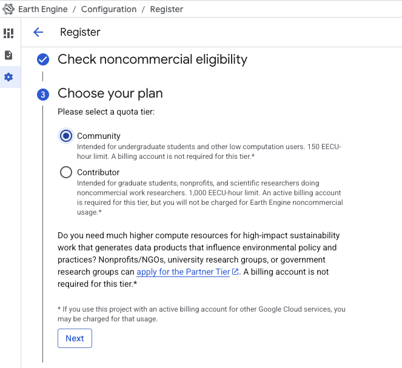

5. Complete the remaining registration steps by filling out any additional forms

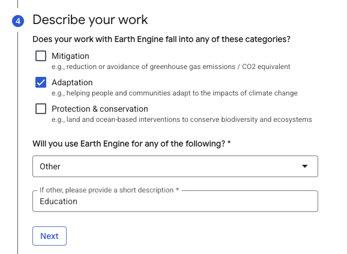


6. Click the **Register** button to complete the process

### Step 5: Enable the Earth Engine API

After registration completes, a pop-up window should appear asking you to enable the Earth Engine API. The API is what actually lets your project use Google Earth Engine.


1. Click the **Enable** link in the pop-up window

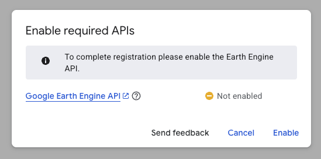

2. You may be taken to a Google Cloud Console page — this is normal
3. If prompted, confirm the API enablement

### Step 6: Select Your Project in Earth Engine

Now you need to tell the Code Editor which project to use.

1. Return to the Code Editor window
2. Click on your **Profile Icon** (top right)
3. Select **Select > Choose a Cloud Project**

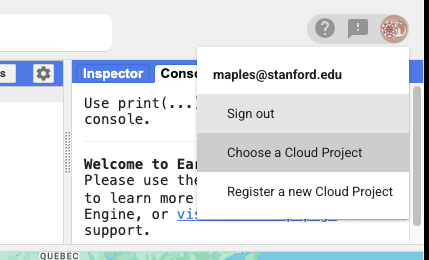

4. Find and select the project you just created

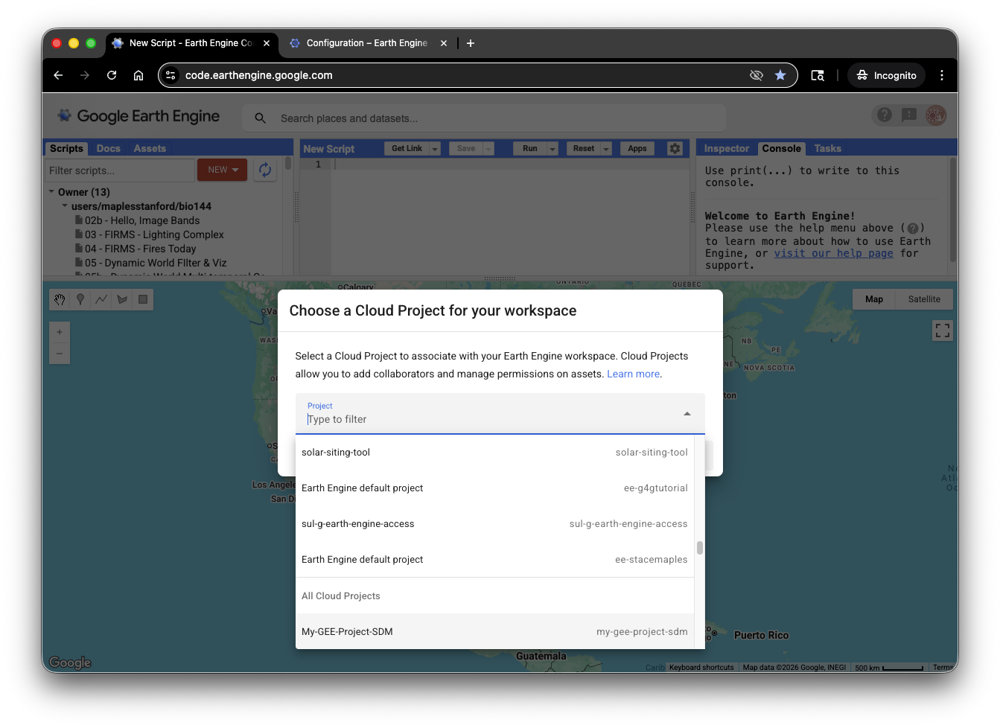

5. Click the **Select** button

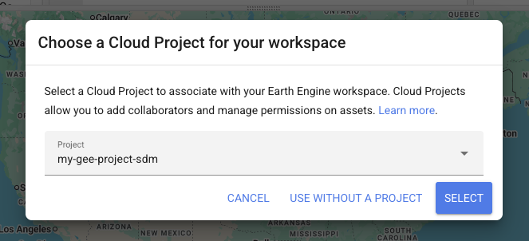

Congratulations! Your project is now active in the Code Editor.

### Step 7: Test Your Setup

To verify everything is working:

1. You should see your project name in the top-right corner of the Code Editor
2. Open the Google Earth Engine Data Catalog: [https://developers.google.com/earth-engine/datasets](https://developers.google.com/earth-engine/datasets)
3. Choose any dataset page that includes example code

   - Good beginner options include Landsat, Sentinel-2, MODIS, or NAIP datasets
4. Open the sample script in the Code Editor, using the **Open In Code Editor** button

   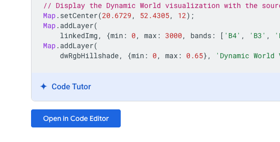
5. Add a short comment near the top of the script with your name, for example:

   ```javascript
   // Your Name
   // Week 00 Earth Engine check-in script
   // I opened this from the Earth Engine Data Catalog and ran it successfully.
   ```
6. If you make any changes to the sample script, add inline comments directly above the lines you changed so the changes are easy to identify, for example:

   ```javascript
   // I changed the map center to look at California instead of the default location.
   Map.setCenter(-120.0, 37.0, 6);
   ```
7. Click **Run** to execute the script

   - You should see results appear on the map within a few seconds
8. Save the script if prompted
9. This annotated sample script is what you will share for credit
10. If things stop working and you can't figure out why, just reload teh script from the Data Catalog and try again!

---

## Sharing Your Work

### How to Share Your GEE Scripts

When submitting assignments, you'll need to share your GEE scripts with your instructor. Here's how:

1. In the Code Editor, click the **Get Link** button (top menu)
2. Copy the link that appears

   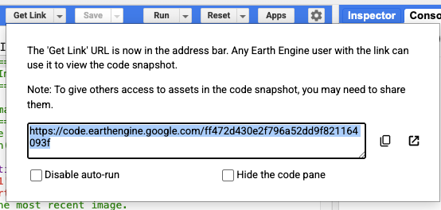
3. By default, this creates a "frozen" copy of your script that lets others see and troubleshoot your code.
4. Test the link by opening it in an **incognito window** to make sure it's accessible
5. **Use this link for your homework submission**

For this Week 00 submission, make sure the shared script includes:

- **Your name in a comment**
- **A brief note** that you opened and ran a sample from the Earth Engine Data Catalog
- **Inline comments marking any changes** you made to the original sample

### Best Practices for Sharing

- Always test your shared links before submitting
- Include a brief description in your script comments explaining what it does
- Keep your comments simple and direct so a grader can quickly see your name and any edits

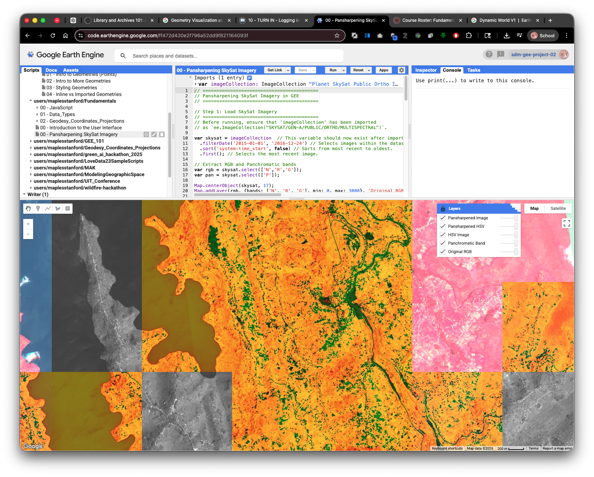

---

## Troubleshooting

### I don't see the pop-up to enable the Earth Engine API

- Check your browser's pop-up blocker settings
- Try the process again
- Manually navigate to Google Cloud Console if needed

### My project won't initialize

- Log out and log back in
- Try a different browser
- Clear your browser's cookies and cache
- Contact your instructor for help

### I can't find my project in the "Select Project" menu

- Make sure you completed the registration form
- Wait a few minutes and refresh the page
- Create a new project if the old one won't appear
