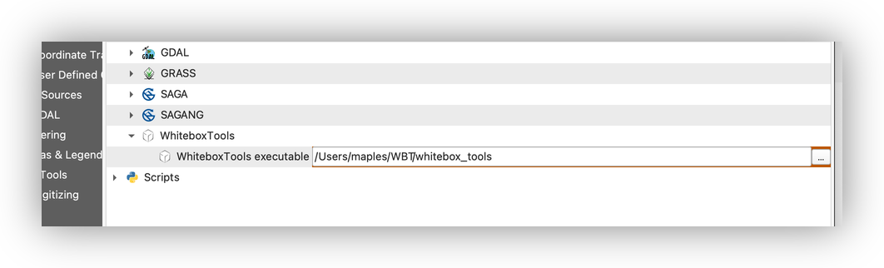
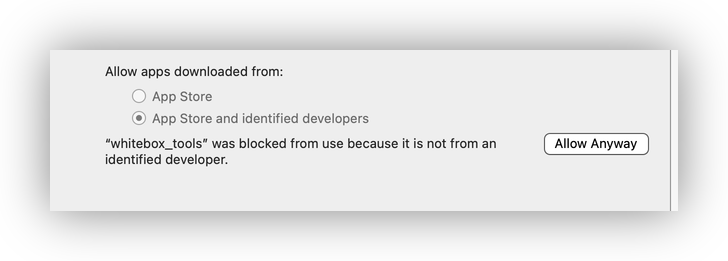
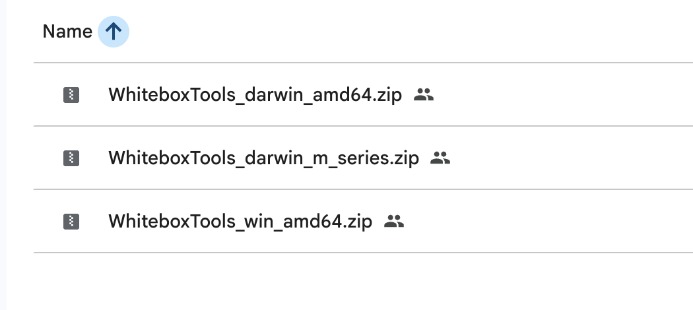
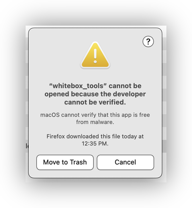
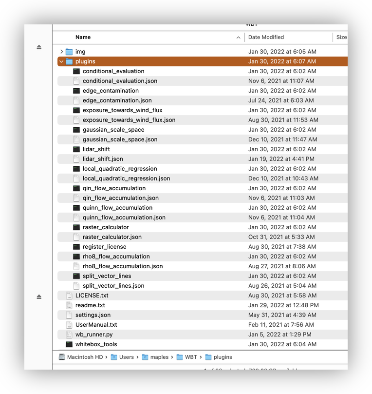

# Installing Whitebox Tools

## Why We Are Using The Older Version

For this course, we are **reverting to the original Whitebox Tools setup** instead of the newer **Whitebox Workflows** plugin. The Whitebox Workflows interface is currently too flawed and too unreliable for us to depend on at the end of the quarter, so we need the older Whitebox Tools version that still works well with the QGIS labs we use in class.

That means the setup in this guide is the one you should follow, even if you see newer Whitebox Workflows instructions online or inside other materials.

## Why We Use Whitebox Tools

Whitebox Tools is one of the course tools we use for raster and terrain analysis because it is fast, reliable, and especially good for hydrology workflows such as flow direction, flow accumulation, and watershed delineation.

The newer **Whitebox Workflows** interface is available in some places, but for this course we are using the original **Whitebox Tools** binary package and the **WhiteboxTools for QGIS** plugin. That is the setup that matches the course labs and the examples you will see later in the quarter.

## What Versions To Use

Use these versions or version families for this course:

1. **QGIS LTR 3.44**
2. **Whitebox Tools for QGIS** plugin from the QGIS Plugin Manager
3. **Original Whitebox Tools binary package** for your operating system
4. **macOS only:** download the binary that matches your Mac chip type:
   - **Apple silicon** for M-series Macs
   - **Intel** for older Intel-based Macs

> **Why this matters:** If you install the wrong binary, QGIS may not be able to run the executable. Matching the download to your chip type avoids a lot of confusing startup problems.

## Check Your Mac Chip Type First

If you are on a Mac, check your chip type before you download anything.

1. Click the **Apple menu** in the top-left corner of your screen.
2. Choose **About This Mac**.
3. Look for either **Chip** or **Processor**.
4. Use that label to choose the right Whitebox Tools download:
   - If you see **Apple M1 / M2 / M3 / M4**, use the **m_series** download.
   - If you see **Intel**, use the **Intel** download.

## Download The Whitebox Tools Package

Use the shared Google Drive folder here:

[https://drive.google.com/drive/folders/1T-o5oeoxZoDOWOTLZCt_EfF_Svt64sGX?usp=sharing](https://drive.google.com/drive/folders/1T-o5oeoxZoDOWOTLZCt_EfF_Svt64sGX?usp=sharing)

The screenshot you dropped shows the folder contents. Use that folder to download the original Whitebox Tools binary archive for your operating system.

1. Download the archive for your operating system.
2. If you are on macOS, make sure you chose the archive that matches your chip type.
3. Unzip the archive to a stable folder on your computer.

Good places to keep the folder are:

- `WBT` in your home folder on a Mac, such as `/Users/yourname/WBT`
- `C:\WBT` on Windows

> **Why we avoid cloud-synced folders:** QGIS and Whitebox Tools are much happier when the executable lives in a normal local folder, not inside iCloud, OneDrive, Dropbox, or another synced location that might pause or move files in the background.

After unzipping, you should see a `whitebox_tools` executable on Mac or a `whitebox_tools.exe` file on Windows, plus a `plugins` folder.

## Allow Whitebox Tools On macOS

macOS may warn you the first time you try to open the downloaded Whitebox Tools executable or one of its helper tools.

1. Try launching the executable once.
2. If macOS blocks it, open **System Settings**.
3. Go to **Privacy & Security**.
4. Scroll down to the security warning.
5. Click **Open Anyway**.

> **Why this happens:** macOS is checking that the downloaded app was not modified after it was signed. This is a normal security check for software downloaded from the internet.

## Install The QGIS Plugin

1. Open **QGIS**.
2. Go to **Plugins > Manage and Install Plugins**.
3. Search for **whitebox**.
4. Install **WhiteboxTools for QGIS** if it appears in the list.
5. If you also see **Whitebox Workflows**, do **not** install it for this course.
6. Close the Plugin Manager when the installation finishes.

> **Important:** The course labs later in the quarter use the legacy **WhiteboxTools** workflow, not Whitebox Workflows. If you install the wrong plugin, the tool names in the lab instructions will not match what you see in QGIS.

## Point QGIS To The Executable

1. Open **Processing > Toolbox**.
2. Click the **wrench** or **Processing Settings** button at the top of the Processing Toolbox.
3. Expand **Providers > WhiteboxTools**.
4. Find the box next to **WhiteboxTools executable**.
5. Click the **...** button and browse to the folder where you unzipped Whitebox Tools.
6. Select the `whitebox_tools` file on Mac or the `whitebox_tools.exe` file on Windows.
7. Save the setting and close the dialog.

## Verify The Setup

After the plugin is connected to the executable, test it with a simple tool.

1. Open the **Processing Toolbox**.
2. Search for a simple Whitebox tool such as **Slope** or **Fill Depressions**.
3. Run the tool on a small test raster.
4. Make sure the output layer appears in QGIS.

> **Why we test with a small tool first:** A quick test tells you whether the plugin, the executable, and the file path are all working before you get to a bigger lab workflow.

## Troubleshooting

If Whitebox Tools does not appear or does not run correctly:

1. Confirm that you downloaded the correct Mac or Windows version.
2. On a Mac, re-check **About This Mac** to make sure the chip type matches the download.
3. Confirm that the executable lives in a local folder such as `WBT`.
4. Restart QGIS and check the Processing Toolbox again.
5. If macOS still blocks the executable, return to **Privacy & Security** and choose **Open Anyway**.

## What Comes Next

Once this is installed, later raster labs will be able to call Whitebox Tools directly from QGIS.

That means you will be ready for:

1. terrain preprocessing
2. flow accumulation
3. watershed modeling
4. other raster analysis workflows that depend on Whitebox Tools
