# Lab 01: Create an Area of Interest with GeoJSON.io (Ready!)

> **Note:** To make sure you are viewing the most recent version of this lab guide, hold **Shift** and click the browser refresh button.

> **Turn-in for grading:** This lab includes material that must be turned in for grading. Export your AOI file using the naming convention below and submit it to Canvas.

## Introduction

Almost every spatial analysis project starts by defining a study area, or **Area of Interest (AOI)**.

In this lab you will use **[geojson.io](https://geojson.io)** to draw a rectangular AOI that is at least as large as the Stanford campus, then recreate it at a place that is personally meaningful to you.

The result is a GeoJSON file that you will use again in later labs as your personal study area.

### Why GeoJSON?

GeoJSON is a plain-text, open standard for encoding geographic features.

- A single self-contained file (no sidecar files, unlike shapefiles).
- Human-readable, so you can open it in a text editor and inspect the coordinates.
- Natively understood by QGIS, Google Earth Engine, Leaflet, Mapbox, GitHub, and most other modern GIS tools.
- Coordinates are always in **WGS 84 (EPSG:4326)**.

---

## Part 1: Get Oriented with geojson.io

1. Open **[https://geojson.io](https://geojson.io)** in your browser. No login or installation is required.
2. You will see two main areas:
   - **Right panel** — a list of your features and panels for editing properties and raw JSON.
   - **Left panel** — an interactive map you can pan and zoom.

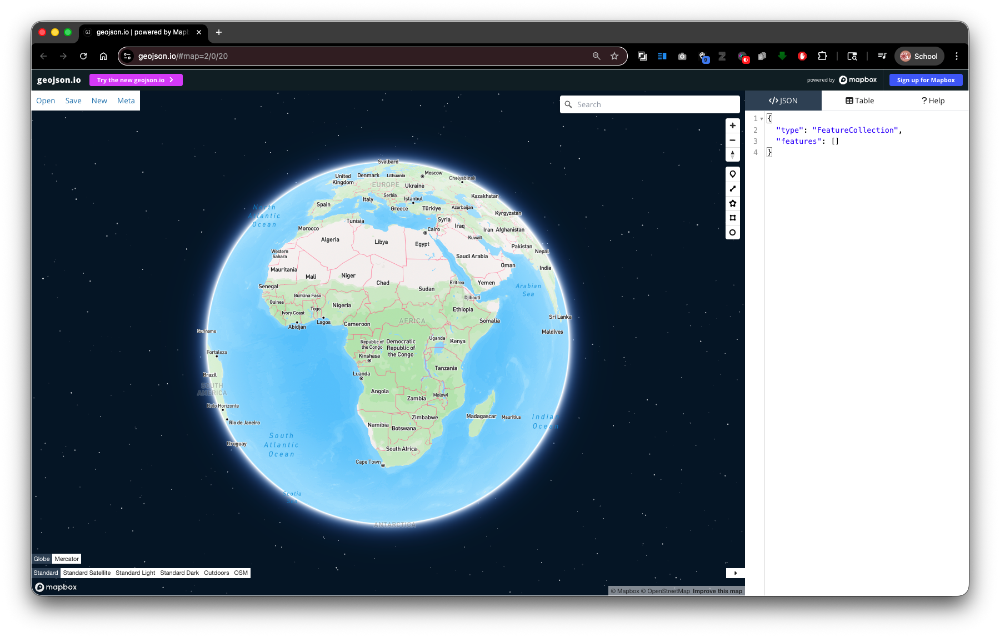

1. Take a moment to locate the **drawing toolbar** on the right side of the map. The tools, from top to bottom, are:
   - Draw point (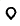)
   - Draw line (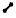)
   - Draw polygon (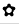)
   - **Draw rectangle (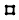)** ← this is the one you will use
2. At the top of the page, notice the **Save** button — you will use this at the end to save your work.

---

## Part 2: Draw a Rectangle Around the Stanford Campus

You will use the Stanford campus as a size reference. Your final AOI must be **at least this large**.

### Step 1: Navigate to the Stanford Campus

1. In the map search bar (top-left of the map, `⌘+K` to open), type **Stanford University, Palo Alto, CA** and press Enter, or simply pan and zoom to the campus manually

   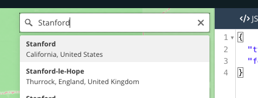
2. Zoom to a level where you can see the full campus footprint including the Dish, the main quad, and the athletic facilities. A zoom level of 13–14 works well.

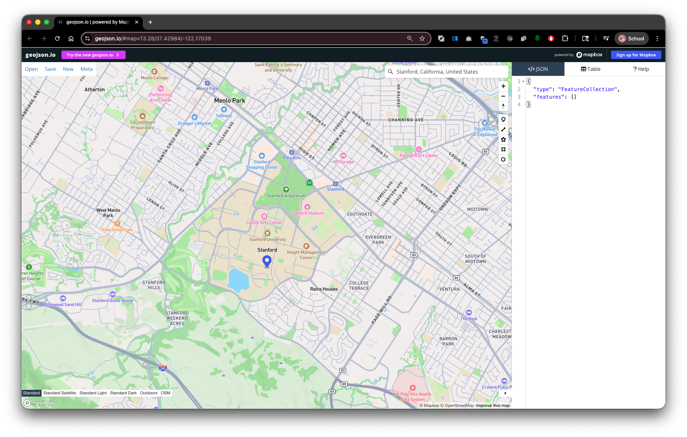

### Step 2: Draw a Rectangle

1. Click the **Draw Rectangle** tool in the toolbar.
2. Click and then move across the map to draw a rectangle that covers the entire Stanford campus — from the Dish area in the southwest to the east edge of campus near El Camino Real.
3. Click again to finish the rectangle.
4. The rectangle's will appear in the </>JSON Panel panel and as a polygon on the map.

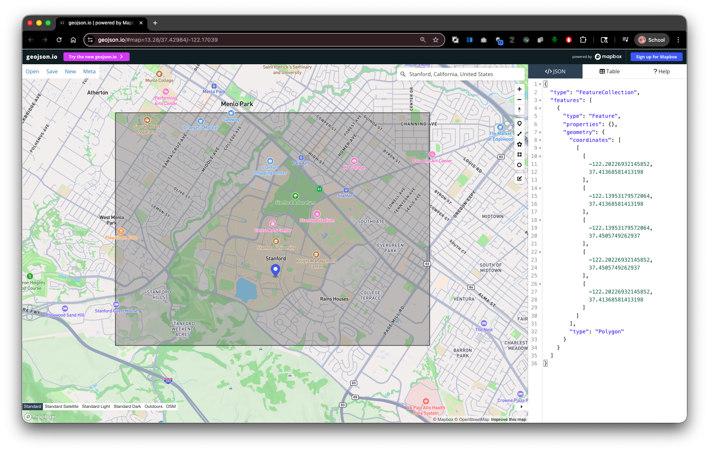

> **Tip:** If the rectangle is not quite right, click on the Edit Geometries tool 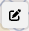, then drag individual vertices to reshape it. Click Save to save your changes

### Step 3: Check the Size

After drawing, look at the raw GeoJSON in the JSON panel on the right. You will see a `FeatureCollection` containing one `Feature` with a `Polygon` geometry. The four coordinate pairs define the corners of your rectangle in `[longitude, latitude]` order.

This is the minimum size your final AOI must be. A rectangle covering the full Stanford campus is roughly **3–4 km east-west by 5–6 km north-south**.

---

## Part 3: Now Create a Rectangle at Your Place of Significance

Now you will relocate the rectangle you just drew to a place that is meaningful to you. This might be:

- Your hometown, neighborhood, or campus back home.
- A research area or field site from another course or project.
- A place in the world you are studying or find interesting.

The requirement is that the relocated rectangle is **at least as large as the Stanford campus box** you just drew. You may make it larger.

### Delete and Redraw

1. Right-click the rectangle in the feature list or on the map and choose **Delete**.
2. Navigate to your chosen location using the search bar.
3. Activate the rectangle tool and draw a new rectangle of at least the same size.

---

## Part 4: Add a Property to Your Feature

Adding descriptive properties to your features is good practice — it makes the file self-documenting and easier to use in downstream analysis.

1. Select your rectangle (click it on the map or in the feature list).
2. The **Feature Editor** popup will appear.
3. Type the propery: `name` into the first cell, and the value: `your location label` into the second cell.
   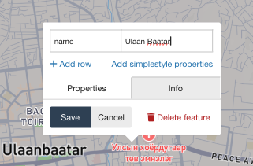
4. Click **Add row** and create property/vlue pairs for the following:


| Property      | Value (your entry)                                                 |
| --------------- | -------------------------------------------------------------------- |
| `name`        | A short descriptive name for the place (e.g.,`Bogotá Study Area`) |
| `sunetid`     | Your Stanford SUNet ID                                             |
| `description` | One sentence about why you chose this location                     |

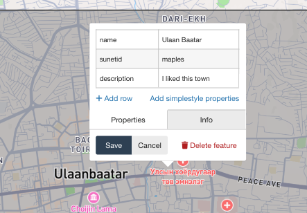

5. Click Save to Save the Properties of the feature.
6. Note how the `properties` look in the </>JSON Panel.

   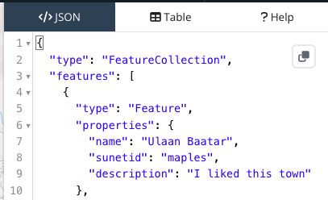
7. Click on the Table Tab for a more familiar spreadsheet view.

   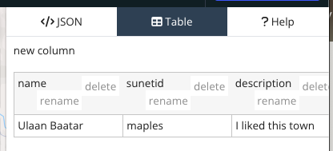

---

## Part 5: Export Your AOI as GeoJSON

1. Click **Save** at the top of the page.

> **Note:** The GeoJSON file may open in your browser instead of downloading. If this happens, go to **File > Save** (or ⌘+S on Mac) to save the file to your computer.

2. Choose **GeoJSON** as the format.
3. Save the file. Your browser will likely save it as `map.geojson` — **rename it immediately** using the naming convention below.

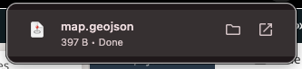

### File Naming Convention

```
sunetid_week01_lab01_aoi.geojson
```

Replace `sunetid` with your actual Stanford SUNet ID. For example:

```
jsmith_week01_lab01_aoi.geojson
```

---

## Deliverable

**Submit your exported GeoJSON file to the **Week 01 Lab 01** assignment on Canvas.**

**Checklist before submitting:**

- [ ] The file is in GeoJSON format.
- [ ] The rectangle covers an area at least as large as the Stanford campus.
- [ ] The feature has `name`, `sunetid`, and `description` properties filled in.
- [ ] The filename follows the convention `sunetid_week01_lab01_aoi.geojson`.

---

## Reference: geojson.io Interface Summary


| Area                    | What it does                                             |
| ------------------------- | ---------------------------------------------------------- |
| JSON panel (left panel) | Shows the raw GeoJSON; editable directly                 |
| Table panel             | Browse all features and properties in a spreadsheet view |
| Drawing toolbar (right) | Tools for point, line, polygon, rectangle drawing        |
| Export button (top)     | Save your data as GeoJSON, KML, CSV, or Shapefile        |
