# Lab 02: Projection Error Measurement with QGIS (DRAFT)

> **Note:** To make sure you are viewing the most recent version of this lab guide, hold **Shift** and click the browser refresh button.

> **Turn-in for grading:** This lab includes material that must be turned in for grading. Complete the required deliverables and submit them as instructed by the course.

## Introduction

Maps are never neutral transformations of the Earth. Every time we represent the curved Earth on a flat surface, we make choices about how location, distance, area, direction, and shape will be handled. This lab is designed to make those choices visible.

In Bolstad's treatment of geodesy and map projection, several foundational ideas matter here:

- An **ellipsoid** is a smooth mathematical model of the Earth used for horizontal positioning and geodetic measurement.
- A **geoid** is an irregular gravity-based surface that approximates mean sea level. It matters most for vertical reference. We will not calculate orthometric height in this lab, but it is important to distinguish the geoid from the ellipsoid because they solve different problems.
- A **coordinate reference system (CRS)** is the full set of rules that ties coordinates to real places on Earth.
- A **geographic CRS** stores positions with angular coordinates such as latitude and longitude.
- A **projected CRS** transforms those positions onto a flat surface so we can work in linear units such as meters or feet.
- Every projection introduces distortion. Some preserve area better, some preserve local shape better, and some balance several properties over a limited region.
- A **line of true scale** is a line along which the projection scale factor is exactly 1. Away from that line, distances and areas begin to drift. In a conic system such as State Plane California III, true scale occurs along standard parallels, and error changes as you move away from them.

This lab turns those concepts into something measurable. You will calculate county area in two ways:

1. As a geodetic measurement on the ellipsoid.
2. As a planar measurement after the data are projected into a State Plane coordinate system.

You will then calculate the percent difference between those two results and symbolize the error. The final map makes projection distortion visible, rather than treating it as an abstract idea.

**Suggested reading:** Bolstad, Chapters 3, 4, and 7.

## Learning Objectives

By the end of this lab, you should be able to:

- Distinguish among ellipsoids, geoids, geographic CRS, projected CRS, and projections.
- Explain the relationship between a QGIS project CRS and the CRS of the layers it contains.
- Identify when QGIS is reprojecting layers on the fly.
- Set measurement properties so ellipsoidal calculations use the intended earth model and units.
- Calculate ellipsoidal area and planar area in the QGIS Field Calculator.
- Export a reprojected copy of a layer into a new CRS.
- Compute and symbolize the percent error introduced by planar measurement.
- Interpret the resulting error pattern in relation to projection design and lines of true scale.

## Data

This exercise uses two datasets downloaded from Stanford EarthWorks:

- County boundaries for the United States as polygons.
- A 10-degree graticule as lines.

You will download one dataset as a shapefile and the other as GeoJSON so you can also review how QGIS handles different vector formats.

1. Create a project folder on your computer, something like `Week01Labs`, where you will keep both the data and the QGIS project file.
2. Download the following datasets into that folder:

- Download the **Zipped Object** for **1:1,000,000-Scale County Boundaries of the United States, 2014** from https://earthworks.stanford.edu/catalog/stanford-wg010mf7692.
- Download the **GeoJSON** for **10-Degree Graticule Grid, World, 1:10 million, 2012** from [https://raw.githubusercontent.com/mapninja/Earthsys144/master/data/stanford-fr122tq8910-geojson.json](https://raw.githubusercontent.com/mapninja/Earthsys144/master/data/stanford-fr122tq8910-geojson.json). *(EarthWorks is currently unable to generate GeoJSON derivatives, so use this course data copy instead.)*

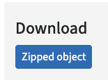

3. Unzip the county boundary download if needed. Inside the first unzip, you will find additional zip files. Use the `data.zip` package, which preserves the archival data in its original CRS.

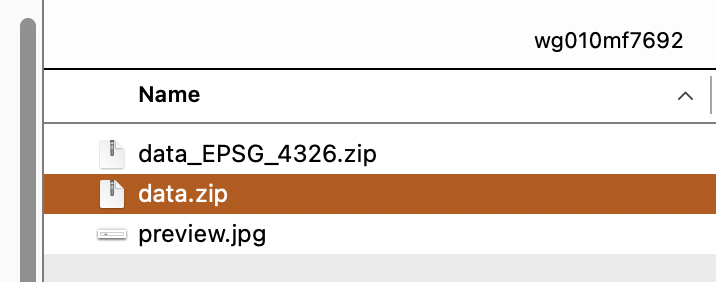

## Create a New Project

Before you add data, create and save a new QGIS project.

### A note on project organization

A QGIS project file does **not** contain the datasets you add to it. It stores paths to those datasets. That means portability depends on keeping the project file and its data together in a well-organized folder structure.

1. Open QGIS.
2. Click the **New Project** button 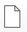.
3. Click the **Save** button 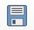.
4. Save the project in your project folder with a name such as `week_01_projections.qgz`.

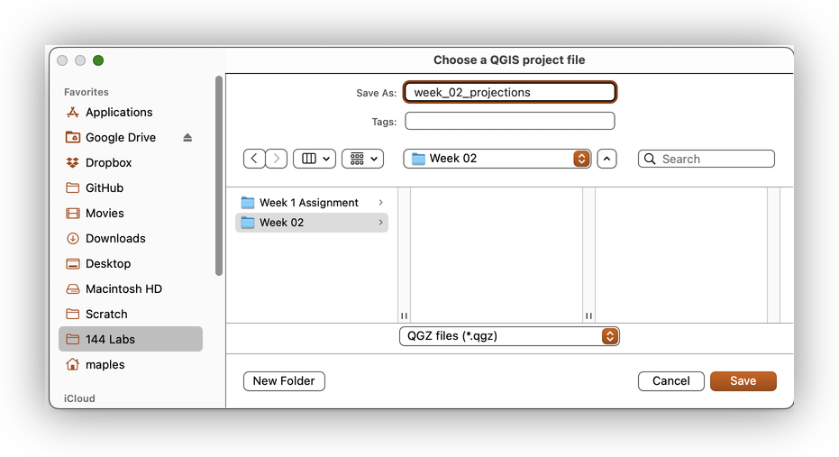

## Add the Data

You will add the data using two common QGIS workflows.

### Drag-and-Drop Method

1. In the **Browser** panel, browse to your project folder and expand the location that contains the county shapefile.

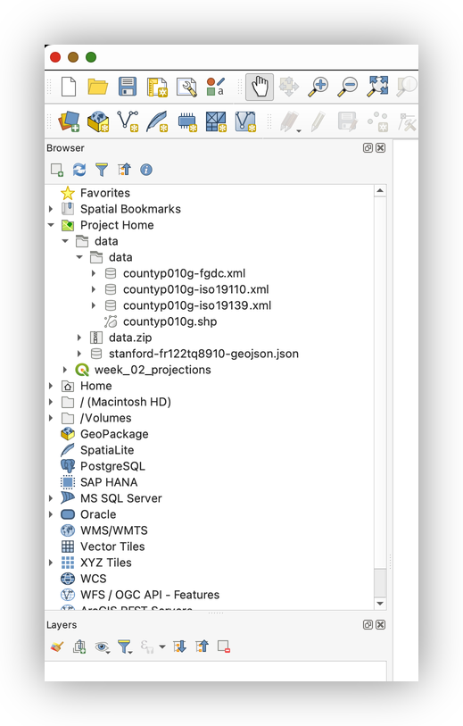

2. Drag `countyp010g.shp` into the map canvas.

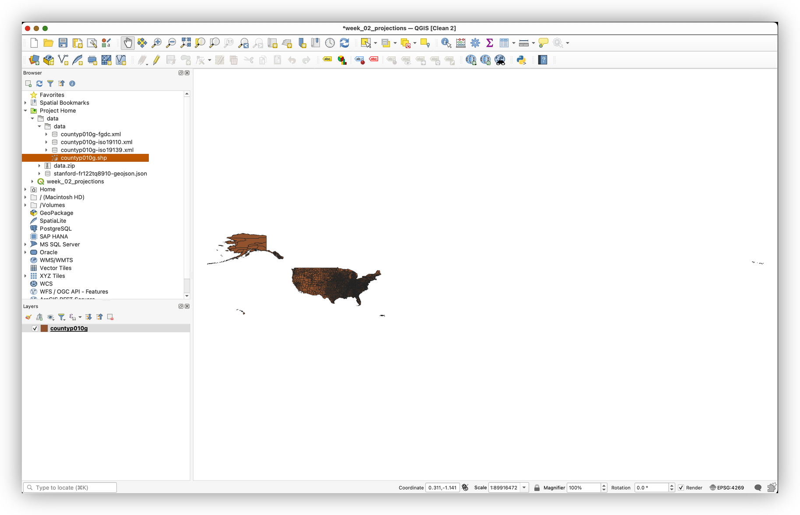

3. Save the project.

### Data Source Manager Method

1. From the menu, go to **Layer > Add Layer > Add Vector Layer**.

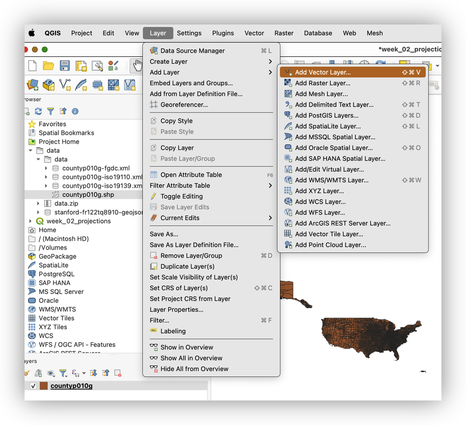

2. Click the browse button 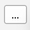 and navigate to the downloaded graticule GeoJSON.

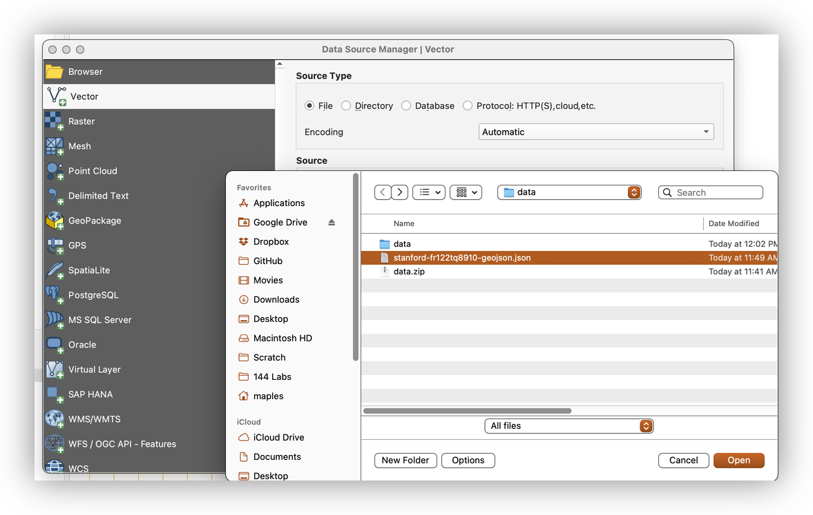

3. Select the GeoJSON file and click **Open**, then **Add**.

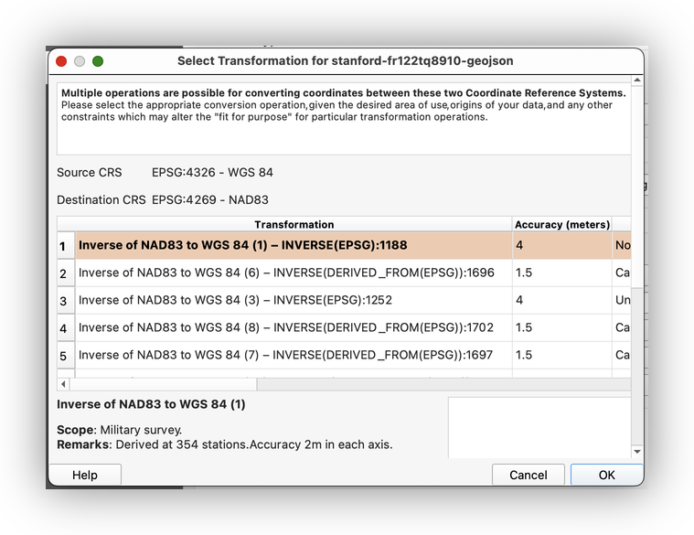

4. QGIS will prompt you to choose a transformation because the layers are in different geographic coordinate systems.

Accept the default transformation from `EPSG:4326 - WGS 84` to `EPSG:4269 - NAD83`. QGIS will reproject the layer on the fly so both layers display together in the current project CRS.

5. Click **OK**, then close the Data Source Manager.
6. Save the project.

## Explore the Data

1. Use the zoom tool 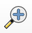 to draw a box around Alaska and the continental United States.

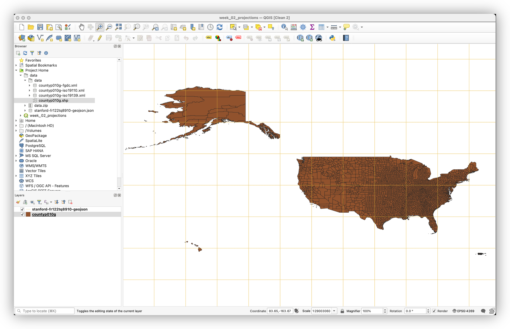

### Open the Attribute Table

1. Right-click the `countyp010g` layer and choose **Open Attribute Table**.

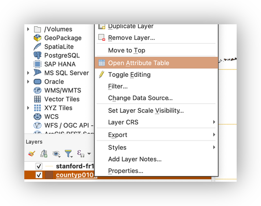

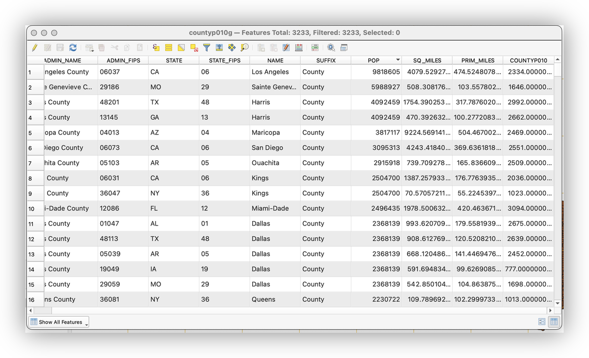

Notice that each county polygon has one row of attributes. The fields include properties such as county name, state, population, and area.

## Symbolize the Data

You will style the graticule with a single symbol and symbolize the counties with a calculated population-density value.

### Style the Graticule with a Single Symbol

1. Right-click the graticule GeoJSON layer and choose **Properties**.

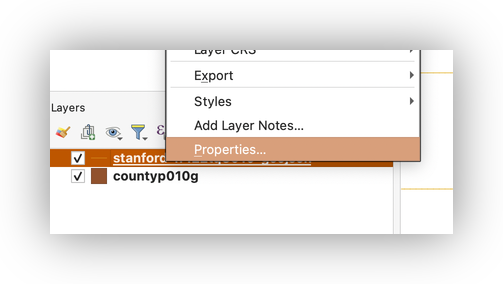

2. Open the **Symbology** tab.
3. Change the line color to something distinct.
4. Set the line width to `0.4` millimeters.
5. Click **OK**.

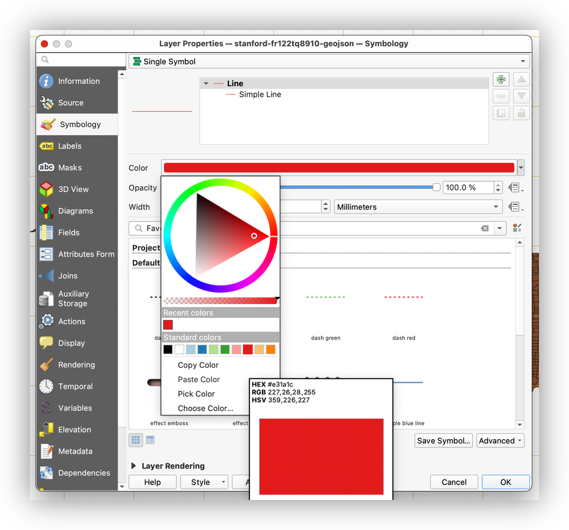

### Style the Counties with a Calculated Quantity

1. Turn on the **Layer Styling** panel from **View > Panels > Layer Styling**.
2. Select the `countyp010g` layer.
3. Change the symbology method from **Single Symbol** to **Graduated** using the dropdown 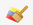.
4. Click the expression button  next to the **Value** field.
5. Build the expression:

`"POP" / "SQ_MILES"`

Use the division operator button 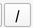 if helpful.

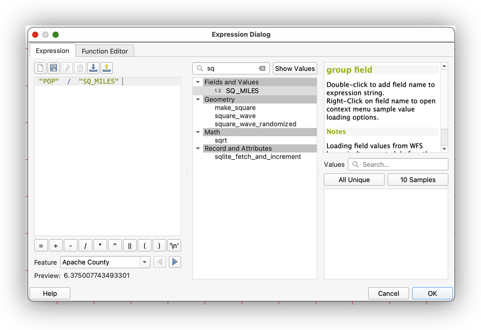

6. Click **OK**.
7. Set **Mode** to **Equal Count (Quantile)**.
8. Set **Classes** to `5`.
9. Click **Classify**.
10. Choose a color ramp if desired.
11. Save the project.

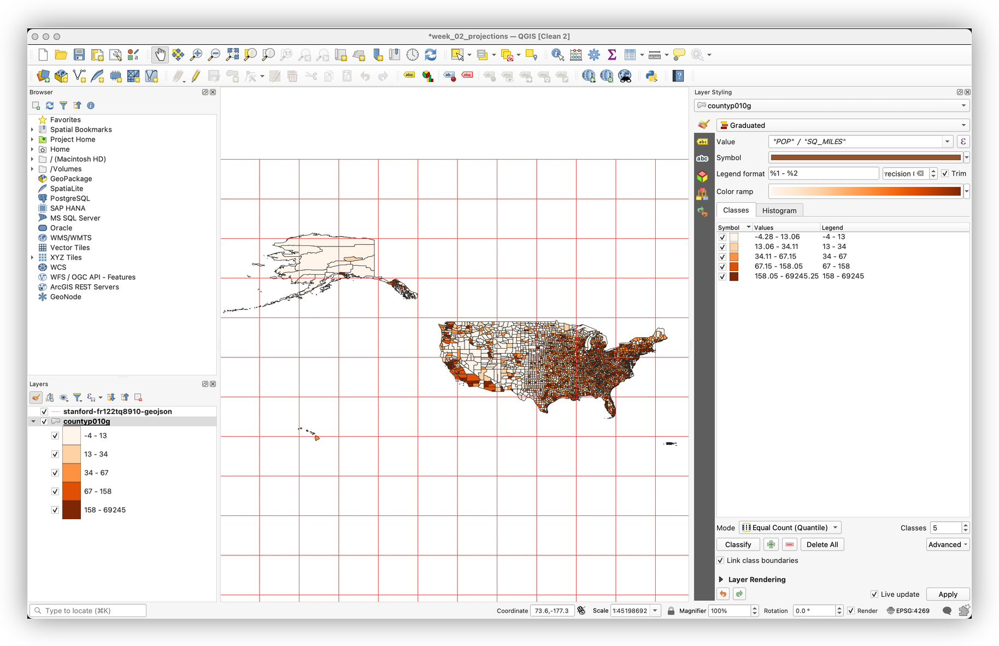

## CRS, Measurement, and Why This Matters

This is the core conceptual section of the lab.

The county boundaries are stored in a geographic CRS. That means their coordinates are angular, not planar. QGIS can still compute area, but the method matters:

- If you use ellipsoidal measurement, QGIS measures on the earth model you specify.
- If you use planar measurement, QGIS measures on the flat projected plane defined by the layer CRS.

The whole point of this lab is to compare those two outcomes and then map the difference.

### Set the Ellipsoid and Measurement Units

1. Go to **Project > Properties**.
2. Open the **General** tab.
3. In the **Measurements** section, set the ellipsoid to **WGS 84 (EPSG:7030)**.
4. Set distance units to **Meters**.
5. Set area units to **Square Meters**.
6. Click **OK**.

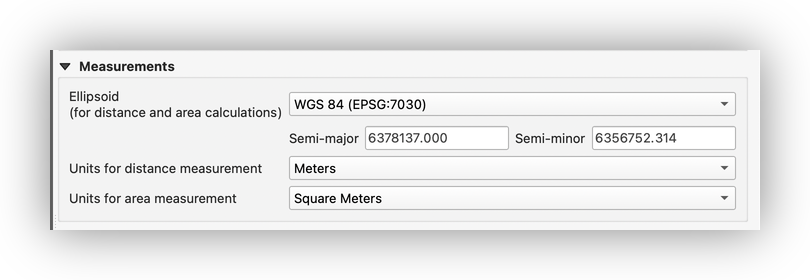

From this point forward, ellipsoidal measurements in the project will use WGS 84.

### Examine the Project CRS

1. Look at the CRS indicator in the lower-right corner of the QGIS window 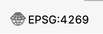.
2. Notice that the project CRS is `EPSG:4269` (NAD83).

Because the county shapefile was the first layer added, QGIS used that layer's CRS as the initial project CRS.

### Examine Layer CRS Values

Hover over a layer name in the Layers panel to see:

- The filename.
- The layer CRS.
- The source path.

For the graticule layer, you should see `EPSG:4326`.

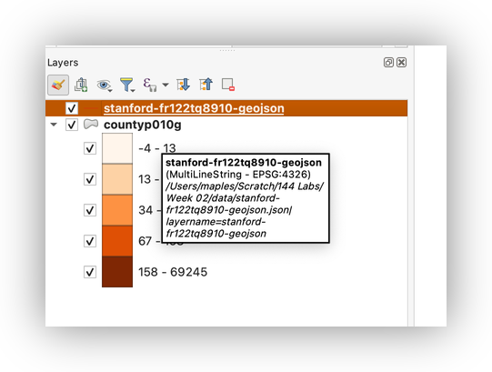

### Set the Project CRS from a Layer

1. Right-click the graticule layer.
2. Choose **Layer CRS > Set Project CRS from Layer**.

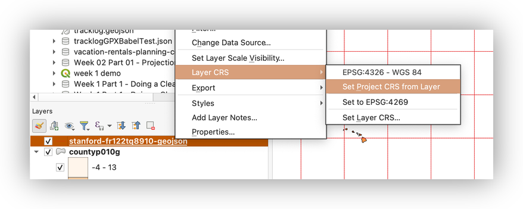

3. Confirm that the project CRS indicator now shows `EPSG:4326`.

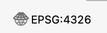

This should not dramatically change the map display because WGS 84 and NAD83 are very similar for this purpose.

### Change the Project CRS to a Projected System

Now switch to a projected CRS so you can compare planar measurement against ellipsoidal measurement.

1. Go to **Project > Properties**.
2. Open the **CRS** tab.
3. Search for `StatePlane_California`.
4. Review the results and note that some versions are in feet and some are in meters.
5. Select `NAD_1983_2011_StatePlane_California_III_FIPS_0403 ESRI:102999`.
6. Click **OK**.
7. Save the project.

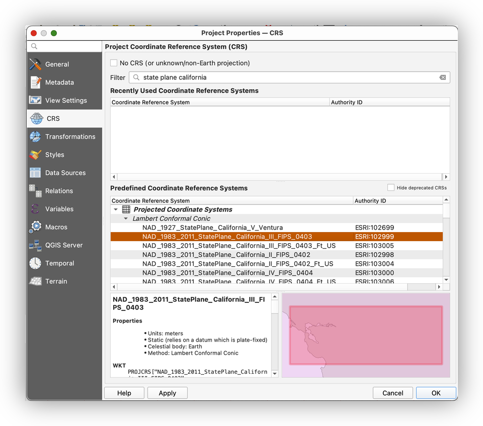

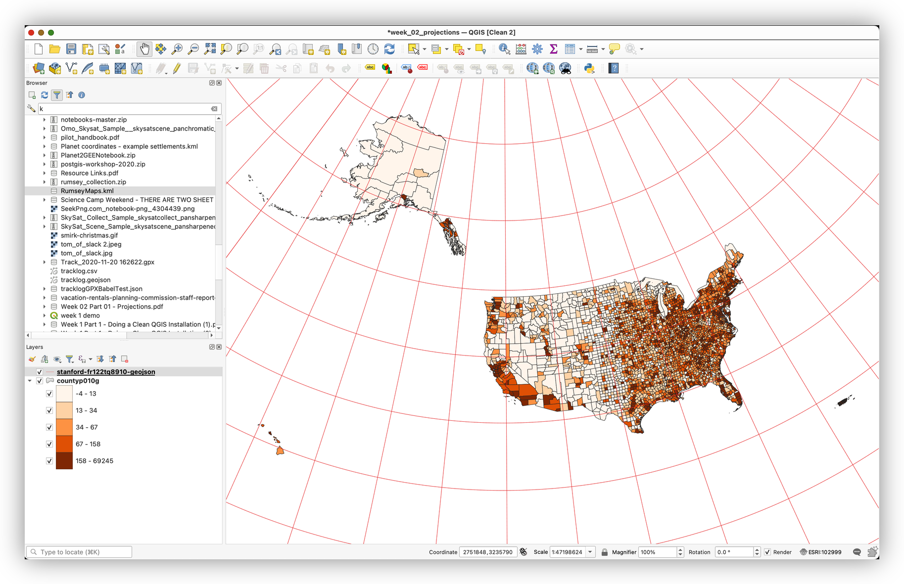

### For Reflection

You do not need to turn these in, but think about them as you proceed:

- What happened to the shape of the map canvas display?
- What projection family are you using now?
- Where do you think this CRS is optimized, and why?

## Calculate Area on the Ellipsoid

The first area calculation uses the project ellipsoid and geodetic measurement.

### Calculate `ORIG_SQKM`

1. Open the attribute table for `countyp010g`.
2. Click the **Field Calculator** button 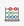.
3. Search for `area` and double-click `$area` under the geometry functions.
4. Build this expression:

`$area / 1000000`

5. Use these options:

- **Create New Field**: checked
- **Output Field Name**: `ORIG_SQKM`
- **Output Field Type**: `Decimal number (real)`
- **Precision**: `2`

6. Click **OK**.

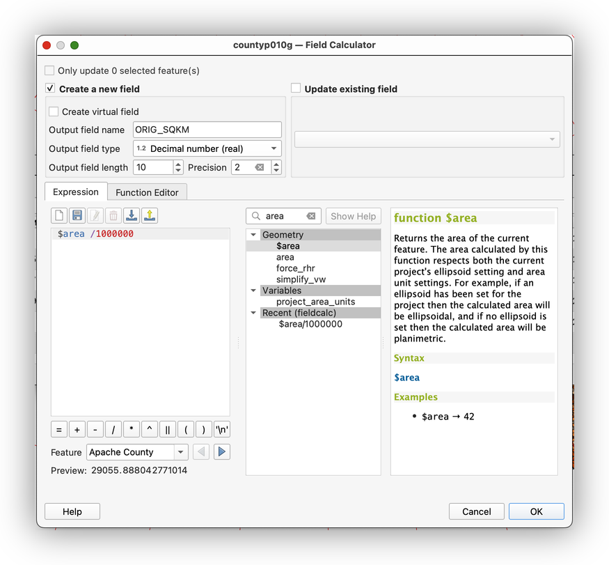

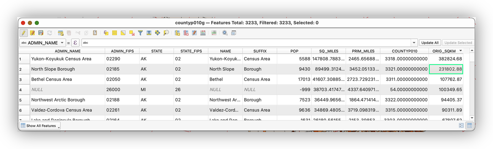

7. Click the **Toggle Editing** button 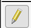 to end the edit session.
8. Sort the new `ORIG_SQKM` field and confirm the values look reasonable.

This field stores ellipsoidal area in square kilometers.

## Reproject the Layer and Calculate Planar Area

Next, you will export a reprojected copy of the counties layer into the current projected CRS and measure area on the plane.

### Export a Reprojected Copy

1. Right-click `countyp010g` and choose **Export > Save Features As...**

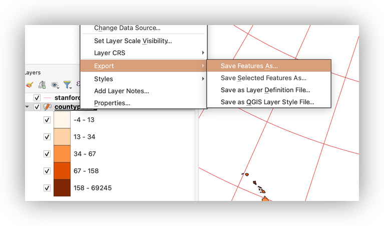

2. Click the browse button 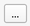 and save the file to your project folder.
3. Use these settings:

- **Format**: `ESRI Shapefile`
- **CRS**: `Project CRS: ESRI:102999 - NAD_1983_2011_StatePlane_California_III_FIPS_0403`

4. Click **OK**.

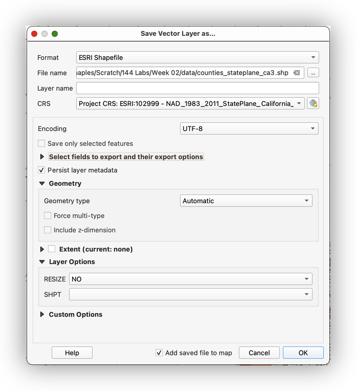

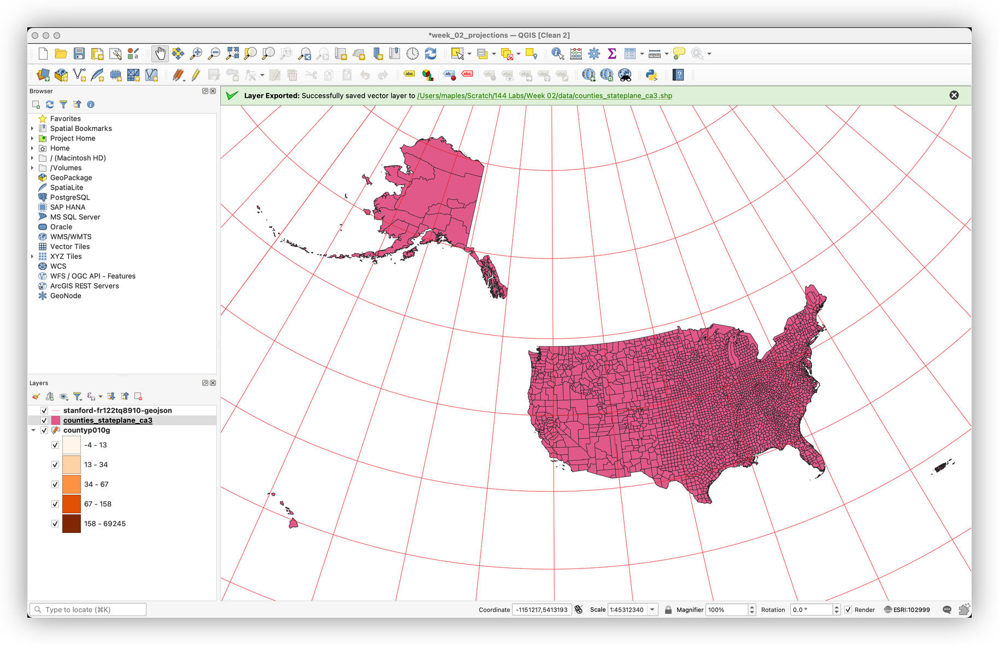

In some QGIS installations, the exported layer may report as `EPSG:6419` instead of `ESRI:102999`. For this lab, treat those as functionally equivalent representations of the same State Plane California III system in meters.

### Calculate `PROJ_SQKM`

Open the attribute table for the reprojected counties layer and repeat the area workflow, but use the planar `area()` function:

`area( $geometry ) / 1000000`

Use these options:

- **Create New Field**: checked
- **Output Field Name**: `PROJ_SQKM`
- **Output Field Type**: `Decimal number (real)`
- **Precision**: `2`

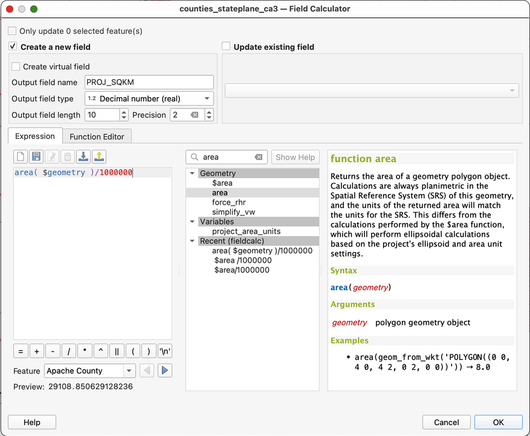

When you compare `ORIG_SQKM` and `PROJ_SQKM`, the values will be close, but not identical.

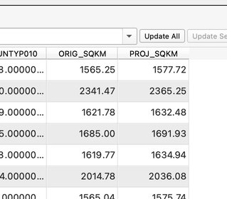

That difference is the lab's main point: even a well-designed projected CRS introduces measurable distortion once you move away from its ideal region and lines of true scale.

## Calculate the Percent Error Introduced by Projection

Now calculate the percent difference between the ellipsoidal and planar results.

### Calculate `ERROR_PCT`

1. Open the attribute table for the reprojected counties layer.
2. Open the Field Calculator.
3. Create a new field with these settings:

- **Output Field Name**: `ERROR_PCT`
- **Output Field Type**: `Decimal number (real)`
- **Precision**: `3`
- **Expression**:

`abs((("ORIG_SQKM" - "PROJ_SQKM") / "ORIG_SQKM") * 100)`

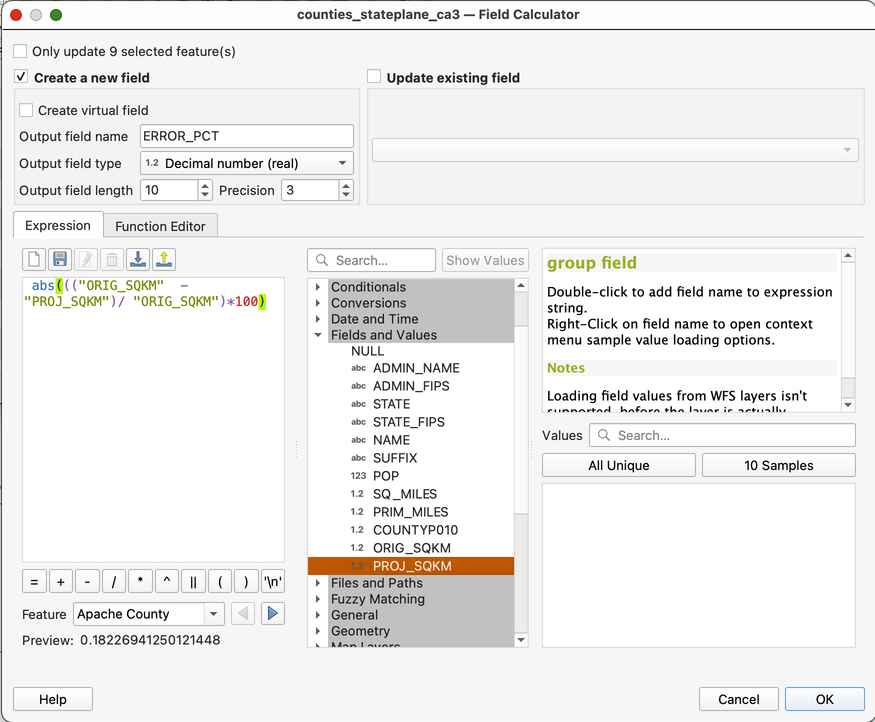

4. Click **OK**.
5. Turn off editing and save.
6. Sort `ERROR_PCT` in descending order and inspect the largest values.

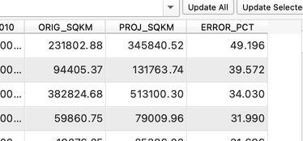

## Symbolize the Error Surface

Now map the distribution of measurement error.

1. Open the **Layer Styling** panel for the reprojected counties layer.
2. Use these settings:

- **Method**: `Graduated`
- **Value**: `ERROR_PCT`
- **Mode**: `Equal Count (Quantile)`
- **Classes**: `50`

3. Click **Classify**.

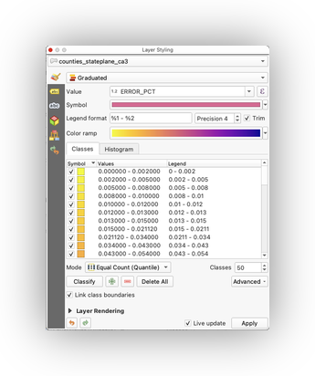

You should see a strong spatial pattern in the error values.

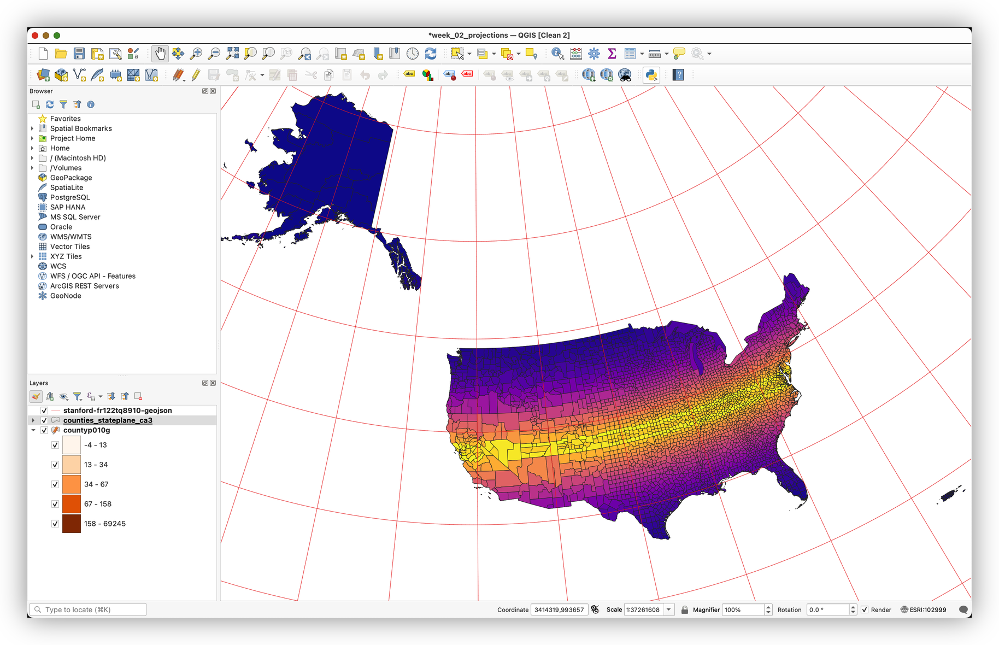

Zoom into the central United States and study where error is smallest and where it increases.

## For Reflection

1. Where do you think the lines of true scale for `NAD_1983_2011_StatePlane_California_III_FIPS_0403` are located?
2. How does the mapped error pattern help you infer those locations?
3. Why is a California State Plane CRS a poor choice for measuring the entire United States, even though it is a carefully designed projected system?

Use the **Identify Features** tool  on the graticule layer to inspect latitude values if that helps.

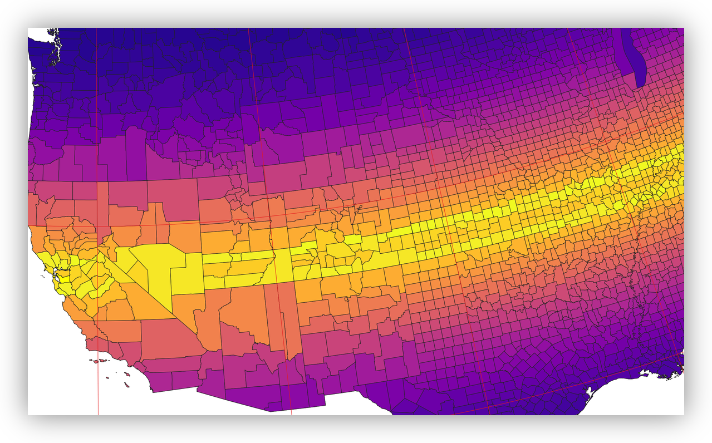

## What to Turn In

1. Create a QGIS layout with appropriate cartographic elements, including title, legend, scale bar, your name, date, and map CRS.
2. Make design choices that clearly communicate the pattern of projection error.
3. Export the layout as PDF or PNG and submit it to Canvas.

## What This Lab Demonstrates

By the end of the workflow, you should be able to connect the conceptual vocabulary to a concrete GIS result:

- The **ellipsoid** matters because geodetic area is calculated on it.
- The **project CRS** matters because planar area depends on the projected coordinate plane.
- **On-the-fly reprojection** affects display, but not the stored geometry of a layer.
- **Projection choice** affects measurement quality.
- **Lines of true scale** are not just theoretical. They leave a visible signature in your error surface.

That is the central lesson of the lab, and it is exactly why projection choice is never just a cartographic afterthought.
