# Lab 03: Coordinates & Geometries with Google Earth Engine (Ready!!)

> **Note:** To make sure you are viewing the most recent version of this lab guide, hold **Shift** and click the browser refresh button.

> **Turn-in for grading:** This lab includes material that must be turned in for grading. Complete the required deliverables and submit them as instructed by the course.

## Introduction

This lab introduces Google Earth Engine (GEE) through coordinates and geometries.

You will use the **Code Editor** to review a few JavaScript basics, then apply them to the spatial objects that connect Earth Engine back to what you are learning in QGIS: **coordinates and geometries**.

In this workflow, coordinates are stored in **WGS 84 (EPSG:4326)** as decimal-degree longitude and latitude pairs.

### The Code Editor Interface

As you work through these scripts, pay attention to these panels:

- **Console** — where `print()` output appears. Use this to inspect variables and objects.
- **Docs** — a searchable reference for every Earth Engine function and object type.
- **Inspector** — lets you click the map to inspect pixel values or feature properties at a location.
- **Layers** — where mapped layers appear. Use this to toggle visibility and adjust display.
- **Scripts** and **Assets** (left panel) — where your saved code and uploaded data files live.

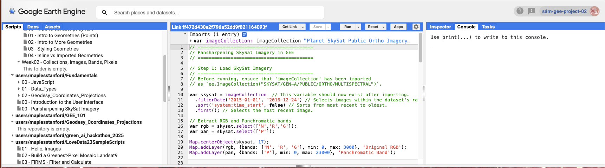

### Load the EarthSys144 Script Repository

Before you start coding, connect the shared course script repository to your Earth Engine account:

1. Open this URL while logged into your Earth Engine account:
   https://code.earthengine.google.com/?accept_repo=users/maplesstanford/earthsys144_2026
2. Click **Accept** (or equivalent prompt) to add the repository to your **Scripts** panel.
3. In the left **Scripts** panel, expand `users/maplesstanford/earthsys144_2026`.
4. Open the script for this week and run it from there, or copy sections into your own working script as instructed.

New scripts will be added weekly. Once you have accepted the repository, Earth Engine should show the most recent updates each time you refresh the repository view or log in again.

---

## Part 1: Basic JavaScript Objects

#### Script: 00 - Intro to Javascript Syntax

Earth Engine scripts are written in JavaScript. Before creating spatial objects you need to understand a handful of data types and structures that show up in every script. This section covers the essentials; keep them in mind as you move into the geometry sections that follow.

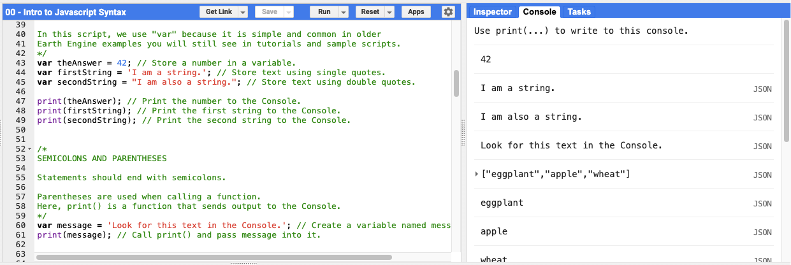

### Variables

A variable stores a value so you can use it later. Use `var` to declare one. This keyword is common in older Earth Engine examples and tutorials you will encounter throughout the course.

JavaScript supports several basic value types: numbers, text strings, lists (arrays), and objects (key-value pairs). `print()` sends any value to the Console so you can inspect it.

```javascript
var theAnswer = 42;
var firstString = 'I am a string.';
var secondString = "I am also a string.";

print(theAnswer);
print(firstString);
print(secondString);
```

Statements end with a semicolon. Parentheses follow function names — `print()` is a function that takes one input and sends it to the Console.

```javascript
var message = 'Look for this text in the Console.';
print(message);
```

### Lists

Square brackets create a list. Items are separated by commas and accessed by **index**. JavaScript uses **zero-based indexing**: the first item is at index `0`, the second at `1`, and so on.

```javascript
var foods = ['eggplant', 'apple', 'wheat'];

print(foods);       // Print the full list.
print(foods[0]);    // First item.
print(foods[1]);    // Second item.
print(foods[2]);    // Third item.
```

### Objects

Curly braces create an object that stores named properties as **key-value pairs**. This is useful when you want to label related values clearly — and it is exactly the pattern Earth Engine uses for visualization parameters (e.g., `{color: 'red'}`).

Access a property with dot notation (`myObject.color`) or bracket notation (`myObject['color']`). Dot notation is more readable and is preferred in this course.

```javascript
var myObject = {
  food: 'bread',
  color: 'red',
  number: theAnswer
};

print(myObject);
print(myObject.color);
print(myObject.food);
print(myObject.number);
```

### Functions

A function is a reusable block of code. You define it once and call it with different inputs. The word inside the parentheses of the definition is called a **parameter** — it acts as a placeholder for whatever value you pass in when you call the function.

```javascript
var sayHello = function(name) {
  return 'Hello, ' + name + '!'; // Concatenate strings with +.
};

print(sayHello('world'));
print(sayHello('Stanford'));
```

### Try This

Remove the comment delimiters around each block (delete the `/*` line and the `*/` line), then run the script to see the output in the Console.

```javascript
/* <-- Delete this line
var numbers = ['one', 'two', 'three'];
print(numbers);
print(numbers[1]); // Index 1 is the second item.
*/ // <-- Delete this line

/* <-- Delete this line
var place = {
  name: 'Branner Earth Sciences Library',
  city: 'Stanford',
  type: 'library'
};
print(place);
print(place.name);
*/ // <-- Delete this line
```

Before moving on, explore the interface:

- Confirm printed output in the **Console**.
- Click **Docs** and search for `print` to see how functions are documented there.
- Notice the **Inspector** and **Layers** panels — you will use them heavily in the next sections.

---

## Part 2: A Point Geometry

#### Script: 01 - Intro to Geometries (Points)

Every location on Earth can be described with two numbers: **longitude** (east-west position) and **latitude** (north-south position). These are the angular coordinates of a geographic coordinate system. Together with a CRS, they form a **point geometry** — the simplest spatial object in GIS.

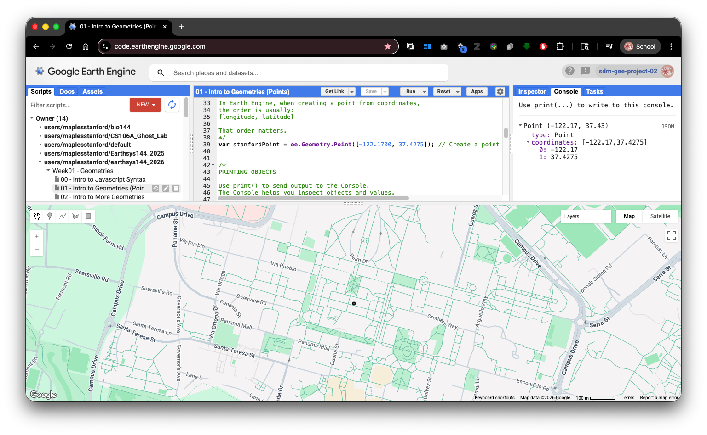

In Earth Engine, coordinate pairs are always ordered **`[longitude, latitude]`** — that is, **`[x, y]`**. This matches the GeoJSON convention and most spatial APIs. It is the **opposite** of the traditional written convention of "lat/lon." Swapping the two values will silently place your point in the wrong location — often somewhere in the ocean — so pay close attention to order.

`ee.Geometry.Point()` creates a point geometry from a coordinate pair. `Map.addLayer()` adds any Earth Engine object to the map display. `Map.centerObject()` centers and zooms the view on any object.

```javascript
var stanfordPoint = ee.Geometry.Point([-122.1700, 37.4275]); // [longitude, latitude]

print(stanfordPoint);

Map.addLayer(stanfordPoint, {}, 'Stanford point');
Map.centerObject(stanfordPoint, 16); // Second argument is zoom level (larger = more zoomed in).
```

### Exploring the Interface

After running the script:

- Open the **Layers** panel and confirm the layer named "Stanford point" appears.

  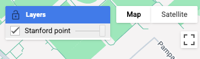
- Open the **Console** and inspect the printed geometry. It reports type `Point` and lists the coordinates.

  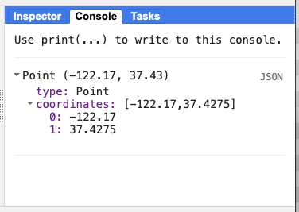
- Click the **Inspector** tab and then click anywhere on the map. The Inspector reports what is at that location.

  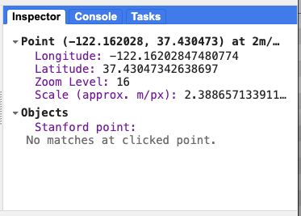
- Find the **geometry drawing tools** above the map canvas. Try drawing a point manually. This creates an **imported geometry** — more on that distinction in Part 5.

  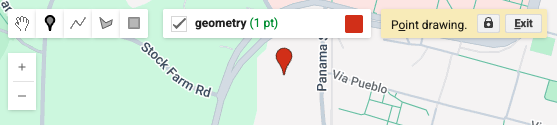

### Try This

Uncomment the block below to add a second point nearby, then run the script again. Watch the Layers panel.

```javascript
/* <-- Delete this line
var anotherPoint = ee.Geometry.Point([-122.1735, 37.4288]); // A second point near the first.
Map.addLayer(anotherPoint, {}, 'Another point');
*/ // <-- Delete this line
```

---

## Part 3: Lines and Polygons

#### Script: 02 - Intro to More Geometries

Points represent locations. Lines and polygons represent extent. Together, these three types — **point**, **line (LineString)**, and **polygon** — are the fundamental vector geometry types in GIS, and Earth Engine supports all of them.

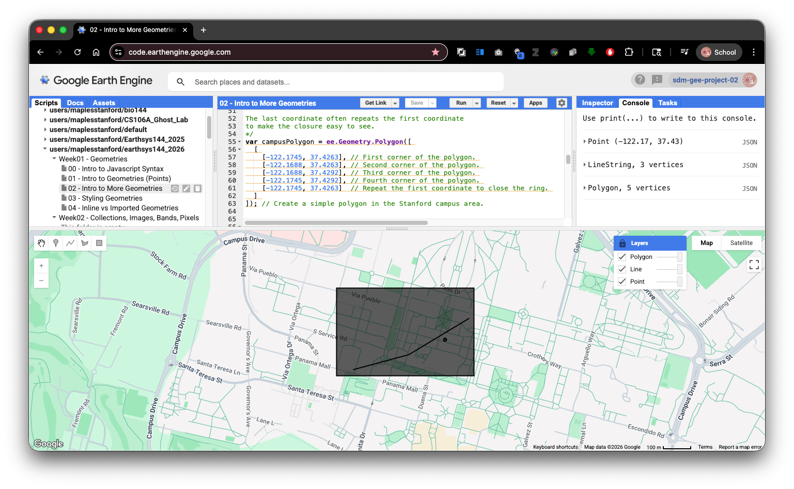

### LineString

A line is constructed from an ordered list of coordinate pairs called **vertices**. Earth Engine connects them in the order provided. Each vertex is a `[longitude, latitude]` pair.

### Polygon

A polygon encloses an area. Its boundary is defined by a **ring** — a closed sequence of coordinates where the last point repeats the first coordinate. Polygons in Earth Engine use **nested arrays**: an outer array wrapping one or more ring arrays.

- A **simple polygon** has one ring: the outer boundary.
- A polygon **with a hole** would add inner rings.

This nested structure is identical to the GeoJSON polygon specification, which is worth recognizing because GeoJSON is one of the formats you will encounter most often when downloading spatial data.

```javascript
var stanfordPoint = ee.Geometry.Point([-122.1700, 37.4275]);

var campusLine = ee.Geometry.LineString([
  [-122.1738, 37.4265],
  [-122.1715, 37.4270],
  [-122.1690, 37.4282]   // Three vertices define two line segments.
]);

var campusPolygon = ee.Geometry.Polygon([
  [
    [-122.1745, 37.4263],
    [-122.1688, 37.4263],
    [-122.1688, 37.4292],
    [-122.1745, 37.4292],
    [-122.1745, 37.4263]  // Repeat the first coordinate to close the ring.
  ]
]);

print(stanfordPoint);
print(campusLine);
print(campusPolygon);

Map.addLayer(stanfordPoint, {}, 'Point');
Map.addLayer(campusLine, {}, 'Line');
Map.addLayer(campusPolygon, {}, 'Polygon');

Map.centerObject(campusPolygon, 16);
```

Open the **Console** and compare the printed point, line, and polygon objects. Each reports a different geometry type. Try the geometry drawing tools on the map and draw your own versions, then compare your hand-drawn shapes with what the script created in code.

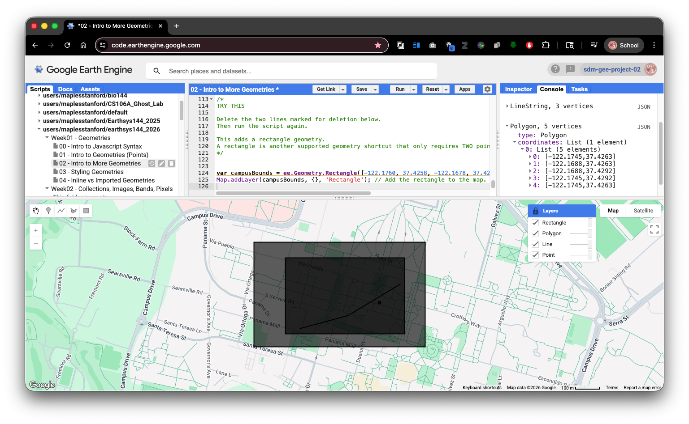

### Try This

`ee.Geometry.Rectangle()` is a shortcut that creates a polygon from just four numbers: west, south, east, north — the same bounding box format used in many spatial data standards.

```javascript
/* <-- Delete this line
var campusBounds = ee.Geometry.Rectangle([-122.1760, 37.4258, -122.1678, 37.4298]); // west, south, east, north
Map.addLayer(campusBounds, {}, 'Rectangle');
*/ // <-- Delete this line
```

---

## Part 4: Visualizing Geometries with Color

When you add a raw geometry to the map with `Map.addLayer()`, Earth Engine mainly respects the **`color`** parameter. You can display points, lines, and polygons in different colors, but raw geometries do not give full control over fill color, line width, or point size. Full style control requires converting geometries to **Features**, which we cover in a later lab.

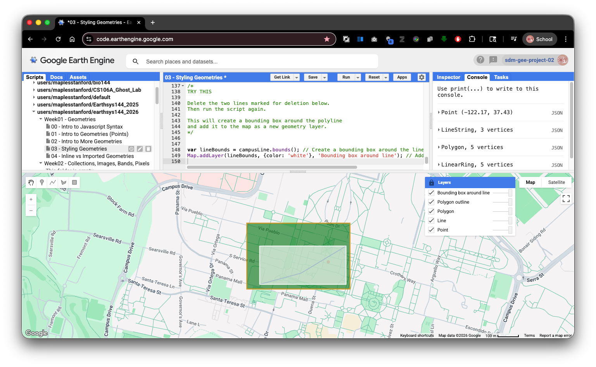

Within those limits there is a useful workaround: to display only the **outline** of a polygon, extract its outer ring and convert it to a `LineString`.

`Polygon.coordinates()` returns all coordinate rings. For a simple polygon:

- `index 0` is the outer boundary ring.
- Additional rings, if present, are holes.

Wrapping that ring in `ee.Geometry.LineString()` gives you the polygon edge as a separate geometry you can style independently.

```javascript
var stanfordPoint = ee.Geometry.Point([-122.1700, 37.4275]);

var campusLine = ee.Geometry.LineString([
  [-122.1738, 37.4265],
  [-122.1715, 37.4270],
  [-122.1690, 37.4282]
]);

var campusPolygon = ee.Geometry.Polygon([
  [
    [-122.1745, 37.4263],
    [-122.1688, 37.4263],
    [-122.1688, 37.4292],
    [-122.1745, 37.4292],
    [-122.1745, 37.4263]
  ]
]);

print(stanfordPoint);
print(campusLine);
print(campusPolygon);

Map.addLayer(stanfordPoint, {color: 'red'}, 'Point');
Map.addLayer(campusLine, {color: 'blue'}, 'Line');
Map.addLayer(campusPolygon, {color: 'green'}, 'Polygon');

// Extract the outer ring (index 0) and display it as a separate outline layer.
var polygonOutline = ee.Geometry.LineString(
  ee.List(campusPolygon.coordinates().get(0))
);

print(polygonOutline);
Map.addLayer(polygonOutline, {color: 'yellow'}, 'Polygon outline');

Map.centerObject(campusPolygon, 16);
```

After running the script, use the **Layers** panel to toggle the "Polygon" and "Polygon outline" layers on and off. Observe how the filled polygon and its extracted outline behave differently. This extract-the-ring pattern is a common Earth Engine technique when you need more polygon display control.

### Try This

A geometry's `.bounds()` method returns a rectangular bounding box. Uncomment the block below to wrap the line geometry in a bounding box.

```javascript
/* <-- Delete this line
var lineBounds = campusLine.bounds(); // Compute a bounding box around the line.
Map.addLayer(lineBounds, {color: 'white'}, 'Bounding box around line');
*/ // <-- Delete this line
```

---

## Part 5: Inline Geometries vs. Imported Geometries

####

There are two ways to get a geometry into an Earth Engine script: write it directly in the script code, or create it through the Code Editor interface.

**Inline geometries** live in the script text as `ee.Geometry` declarations. Editing them means changing coordinate values in the code. This makes scripts fully reproducible — anyone who runs the script gets exactly the same geometry.

**Imported geometries** appear in the **Imports** section at the top of the script editor. They are linked to a geometry layer in the map interface, and you can reshape them with the drawing tools by clicking and dragging vertices directly on the map. Any time you use the drawing tools in Earth Engine, you create an imported geometry automatically.

You can also convert an inline geometry to an import: hover over an `ee.Geometry` declaration in the editor and look for the conversion prompt. Once converted, an imported geometry can be configured as a raw geometry, a `Feature`, or a `FeatureCollection`.

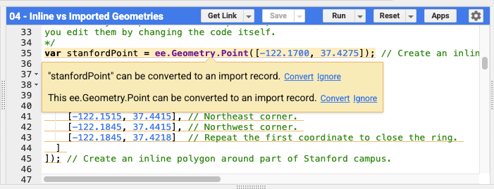

```javascript
var stanfordPoint = ee.Geometry.Point([-122.1700, 37.4275]); // Inline — edit by changing coordinates in code.

var stanfordPolygon = ee.Geometry.Polygon([
  [
    [-122.1845, 37.4218], // Southwest corner.
    [-122.1515, 37.4218], // Southeast corner.
    [-122.1515, 37.4415], // Northeast corner.
    [-122.1845, 37.4415], // Northwest corner.
    [-122.1845, 37.4218]  // Close the ring.
  ]
]);

print(stanfordPoint);
print(stanfordPolygon);

Map.addLayer(stanfordPoint, {color: 'red'}, 'Inline point');
Map.addLayer(stanfordPolygon, {color: 'blue'}, 'Inline polygon');

Map.centerObject(stanfordPolygon, 14);
```

### Converting an Inline Geometry to an Import

1. Run the script above.
2. In the editor, hover over the `ee.Geometry.Point(...)` line. Look for the option to convert it to an import record.
3. Convert the geometry — it moves to the **Imports** section at the top of the editor.
4. Open the geometry drawing tools on the map. Try clicking and moving the imported point.
5. Run the script again and observe whether the printed coordinates changed.

### Inline vs. Imported: Summary


|                | Inline geometry                 | Imported geometry             |
| ---------------- | --------------------------------- | ------------------------------- |
| Where it lives | Script text                     | Imports section               |
| How to edit    | Change coordinates in code      | Drag vertices in the map      |
| Best for       | Reproducible, shareable scripts | Quick interactive adjustments |

In this course you will mostly work with inline geometries in scripts and drawn geometries for exploration. Understanding the difference helps you recognize when a geometry is tied to your code versus controlled through the interface.

---

## Connecting Back to GIS Fundamentals

Every coordinate pair in this lab presupposes a CRS. The values `[-122.1700, 37.4275]` are decimal degrees of longitude and latitude in **WGS 84 (EPSG:4326)** — a geographic CRS built on the WGS 84 ellipsoid. When Earth Engine calculates distances or areas from those coordinates, it works against the ellipsoid, not a flat plane.

This is the same distinction you are making in the projection error lab in QGIS:

- **Ellipsoidal (geodetic) measurements** account for the curvature of the Earth model and are more accurate across large areas.
- **Planar measurements** treat the projected map surface as flat. The farther a feature is from the lines of true scale, the more that planar measurement drifts from the ellipsoidal one.

Earth Engine avoids that planar drift by default because its geometry calculations operate on the ellipsoid. But the projection you choose for *displaying* data still shapes what people see and how they interpret distances and areas visually — which is why understanding coordinate systems matters even in a cloud platform that abstracts much of the projection machinery away from you.

As we move into imagery in later sessions, keep asking the same question you ask in QGIS: *what CRS is this data in, and how does that affect my analysis and measurements?*

**Suggested reading:** Bolstad, Chapters 3, 4, and 7.

---

## Final Turn-In Exercise: Build a Rectangle Around a Place You Choose

Now that you have worked with points, lines, polygons, rectangles, and the Earth Engine interface, your turn-in task is to make a very simple script from scratch.

The goal is to show that you can:

- navigate the map
- use the **Inspector**
- read coordinates from the map
- enter those coordinates into code
- create a rectangle geometry
- share a working Earth Engine script

### Step 1: Reset to a Blank Script

1. In Earth Engine, **clear the current script window** so you are starting fresh.

   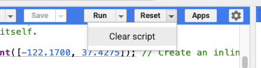
2. Create a new **Repository** to keep your homework scripts in.

   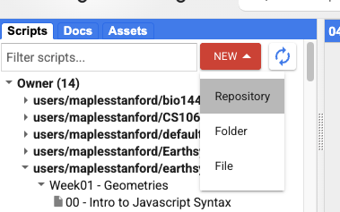
3. Give your repo a name.

   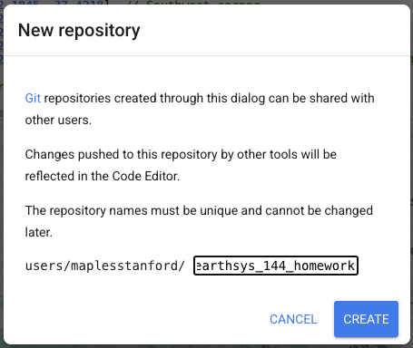

### Step 2: Navigate to a Place You Choose

4. Pan and zoom the map to a location of your choosing.
5. You may also use the **search bar** to jump to a place quickly.

   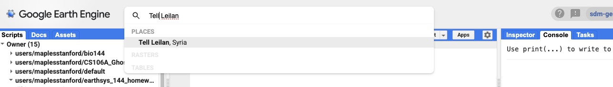
6. Choose a location that is meaningful to you, interesting to you, or possibly relevant to your final project.

   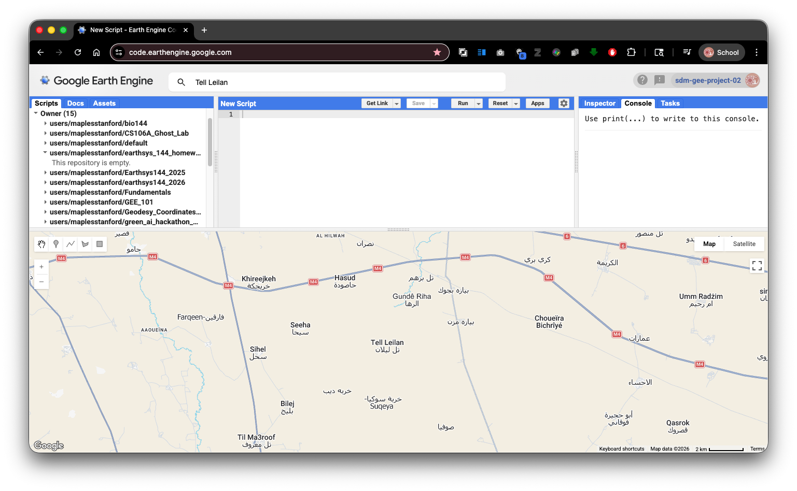

### Step 3: Use the Inspector to Get Two Corner Coordinates

To make a rectangle, you need two opposite corners:

- one **southwest** corner
- one **northeast** corner

1. Open the **Inspector** tab.
2. Click once on the map where you want the **southwest corner** of your rectangle.
3. **Copy & Paste** the longitude and latitude values to a text document.

   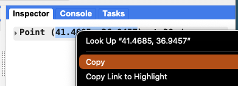
4. Click again where you want the **northeast corner** of your rectangle.
5. **Copy & Paste** that longitude and latitude as well.

Be careful with coordinate order. In Earth Engine, coordinates are always:

`[longitude, latitude]`

not:

`[latitude, longitude]`

### Step 4: Paste in the Boilerplate Script

Use the script below, (or load the script `TURN_IN Week01 - Make Your Own Geometry` from this week's folder in the repo ) replacing the placeholder numbers with the coordinates you got from the Inspector.

```javascript
// Your Name
// EarthSys144 / ESS 164
// Week 01 Turn-In: Rectangle from inspected coordinates
// I chose a place that matters to me and used the Inspector
// to get two opposite corner coordinates for a rectangle.

// Create a rectangle from two opposite corner coordinate pairs.
// Replace the first pair with the southwest corner you clicked.
// Replace the second pair with the northeast corner you clicked.
// Each pair must stay in [longitude, latitude] order.
var myRectangle = ee.Geometry.Rectangle([
  [-122.20, 37.40],  // Paste your southwest corner here.
  [-122.10, 37.48]   // Paste your northeast corner here.
]);

// Print the rectangle to the Console so you can inspect it.
print('My rectangle geometry:', myRectangle);

// Add the rectangle to the map.
// The color parameter controls the display color of the outline/fill.
Map.addLayer(myRectangle, {color: 'red'}, 'My rectangle');

// Center the map on the rectangle so it fills the view more clearly.
Map.centerObject(myRectangle, 12);
```

### Step 5: Add One More Comment of Your Own

Add at least one short inline comment of your own to the script explaining:

- why you chose that place, or
- what the two points represent, or
- what part of the code you changed

For example:

```javascript
// I chose this area because it is my hometown.
```

or:

```javascript
// These are the southwest and northeast corners I clicked with the Inspector.
```

> **Why add comments?** Comments help another person understand what your script is doing, and they help you remember your own thinking when you come back to the script later.

### Step 6: Run and Check the Script

1. Click **Run**.
2. Make sure the rectangle appears on the map.
3. Confirm that the rectangle is centered on the location you intended.
4. Check the **Console** to make sure the geometry prints correctly.

If the rectangle appears in the wrong place, double-check:

- that you did not switch latitude and longitude
- that your west value is smaller than your east value
- that your south value is smaller than your north value

### Save the Script

1. Save the script with a clear name, such as:
   `week01_rectangle_yourSUNetID`

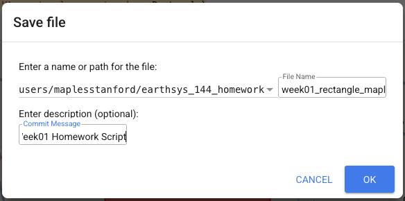

> **Why do this?** This makes it clear that the final turn-in is your own small script, not just the shared example script from the course repository.

## To Turn In

For grading, submit a **Get Link** URL to the frozen copy of your script.

### How to Get the Submission URL

1. In the Earth Engine Code Editor, click the **Get Link** button.
2. Copy the URL Earth Engine creates.
3. This link points to a frozen copy of your script that can be opened by your instructor.
4. It's never a bad idea to test the URL in an Incognito/Private Window.
5. Submit that URL in Canvas for the Week 01 assignment.

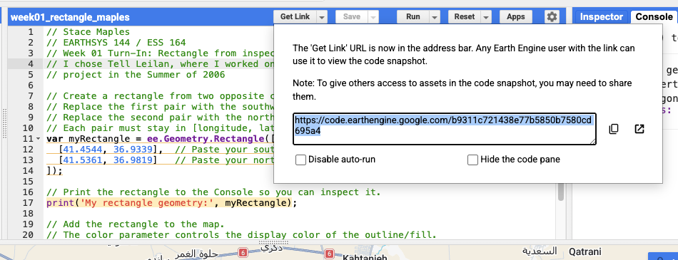

### Your final submitted script should show:

- your name in a comment near the top
- a location you chose yourself and why
- two coordinate pairs pasted from the Inspector
- an `ee.Geometry.Rectangle()` built from those coordinates
- at least one additional inline comment written by you
- a working map layer and centered view

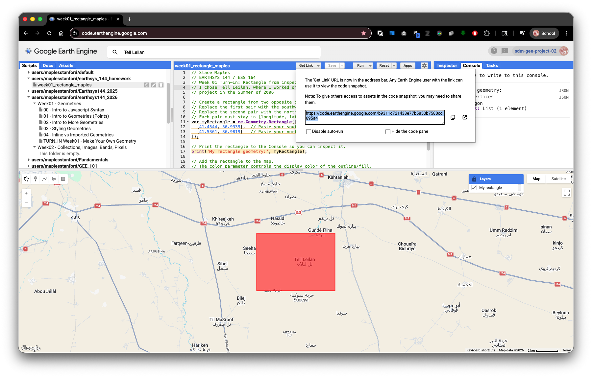
