# 01 - PICK ONE TO TURN IN - Introducing ArcGIS Field Maps and ArcGIS Online for Data Collection

> **Note:** To make sure you are viewing the most recent version of this lab guide, hold **Shift** and click the browser refresh button.

> **Pick one note:** For Week 02, complete **one** of the two `PICK_ONE_TO_TURN_IN` labs, based on your interests. Choose this lab if mobile field data collection, forms, and shared field workflows are more relevant to the kind of work you want to do.

## Collecting Field Data with ArcGIS Online and Field Maps

### Overview

This lab introduces **ArcGIS Online** and **ArcGIS Field Maps** as tools for mobile spatial data collection. You will explore a workflow for creating and managing a shared field data collection project using a web browser and a phone or tablet.

Together, ArcGIS Online and Field Maps provide a powerful way to design field forms, deploy maps to mobile devices, collect points and attachments, and sync edits back to a shared database in real time.

This is an important kind of spatial workflow to understand because not all GIS work begins with downloaded data. Sometimes the whole point of the project is to **create** the data yourself. Field collection projects are how people document trees, sidewalks, public art, damaged infrastructure, habitat features, informal trails, historic sites, survey responses, and countless other things that do not already exist in a neat downloadable dataset.

## Learning Objectives

By the end of this lab, you should be able to:

* Explain why field data collection requires both geometry and a well-designed attribute schema
* Explain why controlled vocabularies improve consistency and reduce messy data entry
* Explain why offline editing matters in real field conditions
* Create empty hosted feature layers to hold spatial data
* Customize the data schema to match a field data need
* Create lists to drive in-app dropdown menus for controlled vocabularies and standardization
* Customize field survey forms for usability
* Enable attachments such as photos, video, or audio
* Enable offline editing for remote or low-connectivity data collection
* Deploy a field data collection map from ArcGIS Online to iOS or Android devices with the Field Maps app installed
* Share the app and editing role to a controlled group of users
* Download the field data collection app and basemap for offline use
* Collect data and sync it to ArcGIS Online
* Create a simple read-only view of the live data for monitoring data collection

## Before You Start

- You will need access to **Stanford ArcGIS Online** with your SUNetID.
- You will need a phone or tablet with **ArcGIS Field Maps** installed for the mobile part of the exercise.
- Some screenshots in this lab may show an earlier version of the interface or an earlier quarter's course group name. The workflow is still the same, but button placement and wording may vary slightly.

> **A good mindset for this lab:** do not worry if ArcGIS Online feels a little "clicky" at first. Many web GIS tools work through settings panels, buttons, and forms instead of the more layered desktop workflow you see in QGIS. The key is to keep asking: What data object am I creating? What fields does it need? Who will use it? What will the person in the field actually see?

## Part 1: Create a Feature Layer

### Log in to ArcGIS Online

1. Go to [https://stanford.maps.arcgis.com/home/signin.html](https://stanford.maps.arcgis.com/home/signin.html) and Login using your SUNetID & Password using the Stanford University option.

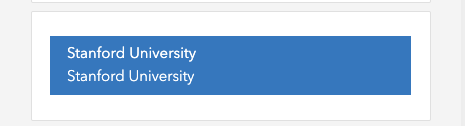

At this point, you should see Stanford's ArcGIS Online landing page. Take a moment to look around. This is where you will create hosted layers, web maps, and sharing groups throughout the exercise.

### Create an empty feature layer

1. Find the **Content** link at the top of the page and click it to go to **Content**.
2. In **My Content** click **Create (New Item)** and choose **Feature Layer** to open the **Create a feature layer** dialog.

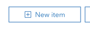

2. Select the **Feature Layer** item.

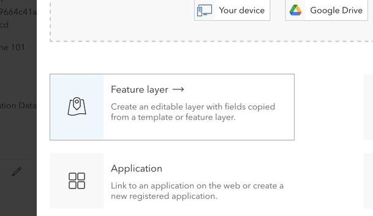

3. Select **Define your own layer**, and click **Next**.

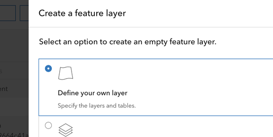

3. Use **+ Add** to create individual **point, line, and polygon layers** and name them as shown in the table below.

   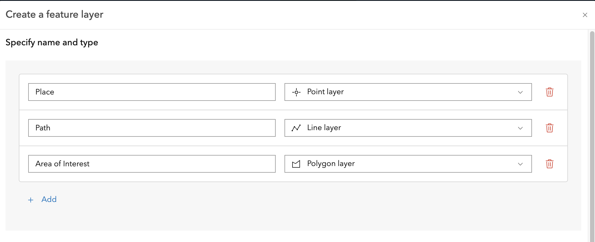

<table>
  <tr>
   <td>
<strong>shape</strong>
   </td>
   <td><strong>name</strong>
   </td>
  </tr>
  <tr>
   <td>point
   </td>
   <td>Place
   </td>
  </tr>
  <tr>
   <td>line
   </td>
   <td>Path
   </td>
  </tr>
  <tr>
   <td>polygon
   </td>
   <td>Area of Interest
   </td>
  </tr>
</table>

4. Provide a title, like `"Walking Tour (SDM)"`. _Since this must be a unique name in your organization, include your SUNetID in the name of this item, and any others in this exercise_. Click **Save**.

> **Why are we creating three geometry types?** Real field projects often need more than one kind of feature. A point might represent a single object like a sculpture or water fountain. A line might represent a path or curb. A polygon might represent a garden, building footprint, or other area. Even if you only use one layer heavily in this exercise, it is useful to see how a field project can be structured to collect multiple kinds of geometry.

Your **Walking Tour layer** is created and its item details page should open. In the following steps you’ll create the fields that define the form for the Places layer.

### Add fields to the feature class

1. Go to the **Data tab** of the item page and go to **Fields**. If you created layers for **points, lines, and polygons**, verify that _Place_ is chosen in the **Layer** list.

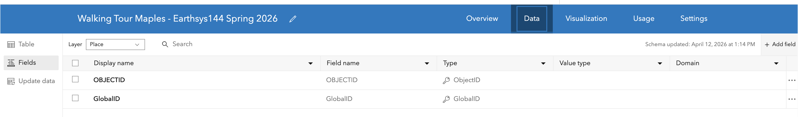

1. Click **Add Field** at the top right side of the page.
2. Select **Text > String**

   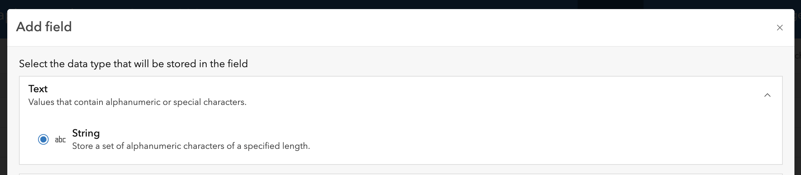
3. Give the field the name `PlaceType` and the alias `Point of Interest Type`.
4. Accept the other defaults and click **Add New Field**.

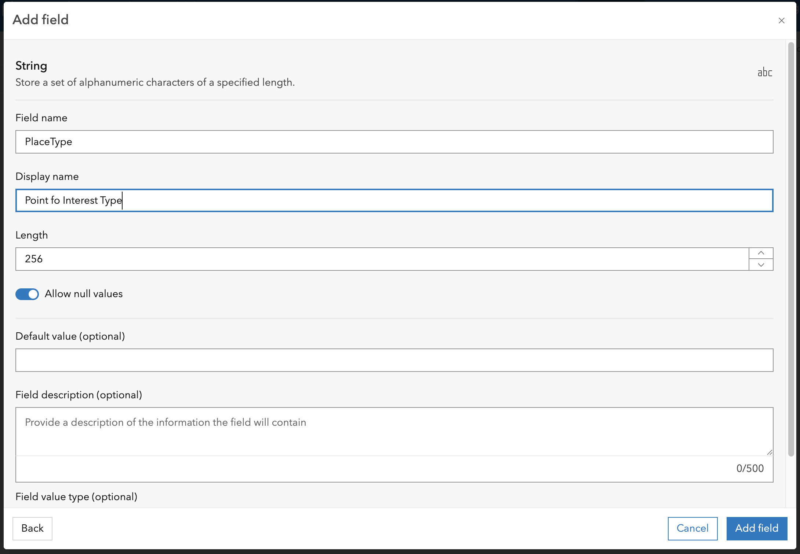

> **Why add fields now?** A hosted feature layer is not just geometry. It is also a table. The fields you create here become the structure of the form people fill out in the field. Thinking carefully about fields early helps prevent messy, inconsistent data later.

### Create a Domain (values list) for the places layer

> **Concept note: What is a domain?** In ArcGIS, a **domain** is a controlled list of acceptable values for a field. You can think of it as a built-in rule that helps standardize data entry. Instead of allowing every user to type whatever they want, a domain gives them a short list of approved choices. This improves consistency, reduces spelling variation, and makes the resulting dataset easier to summarize, filter, and analyze.

1. Click _`Point of Interest`_ in the **Display Name** list to open the details page for the field.
2. Click **Get Started** to create a list of choices, or **Domain**, for the **POI Types**.

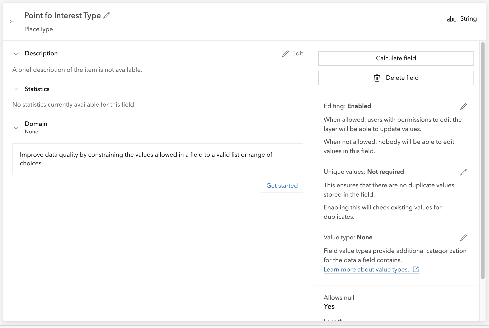

3. Select **Enter values** and **Next**...

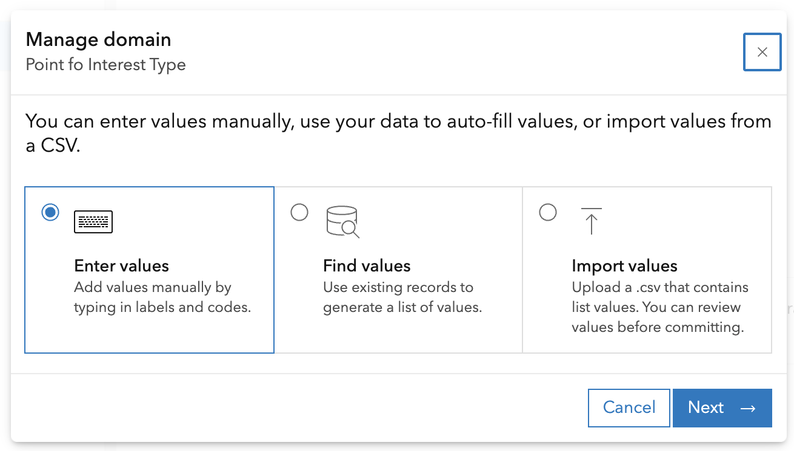

3. Type a label of `Art` with a code of `0`.

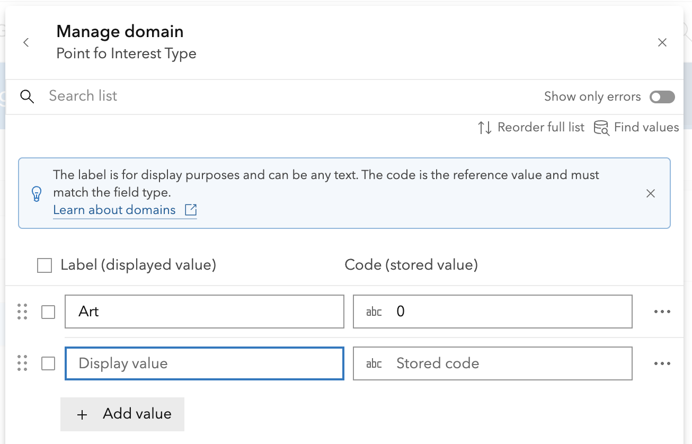

1. Add entries for the rest of the values, as follow:

<table>
  <tr>
   <td>
<strong>label</strong>
   </td>
   <td><strong>code</strong>
   </td>
  </tr>
  <tr>
   <td>Art
   </td>
   <td>0
   </td>
  </tr>
  <tr>
   <td>Architecture
   </td>
   <td>1
   </td>
  </tr>
  <tr>
   <td>Gadgetry
   </td>
   <td>2
   </td>
  </tr>
  <tr>
   <td>History
   </td>
   <td>3
   </td>
  </tr>
  <tr>
   <td>Other
   </td>
   <td>4
   </td>
  </tr>
</table>

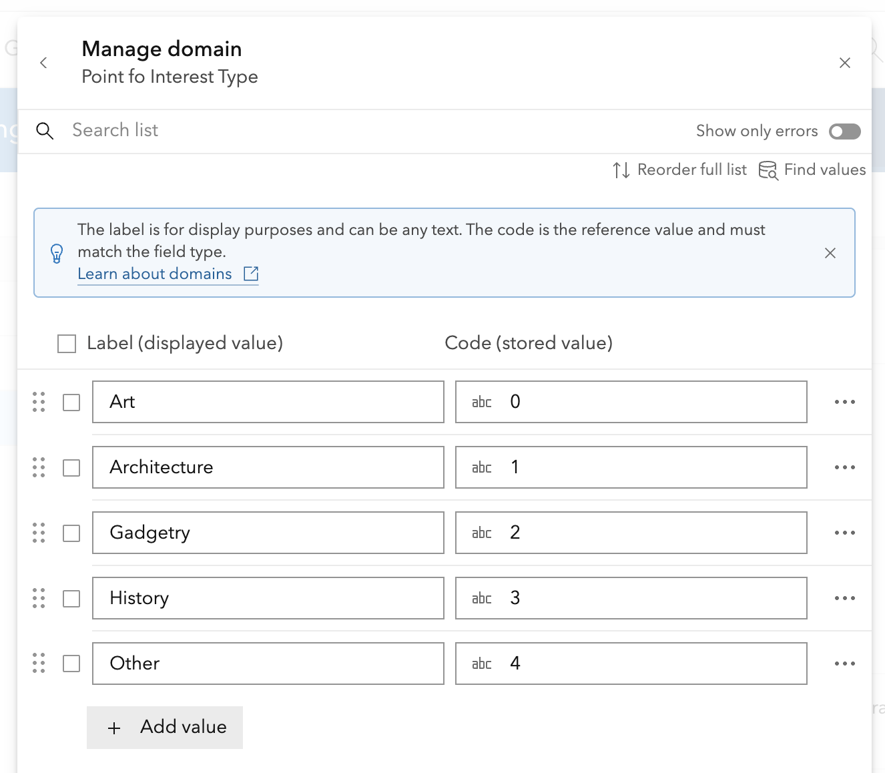

1. Click Save.

### A couple more fields

Now use what you just learned to add a few more fields for information about your features.

1. Create another field named _Label_ that is a String.
2. Create another field named _Notes_ that is a String.

> **Why use a list of values?** Controlled vocabularies make field data cleaner. If users must choose from a short list like `Art`, `Architecture`, or `History`, you avoid messy spelling differences and one-off labels that are hard to summarize later.

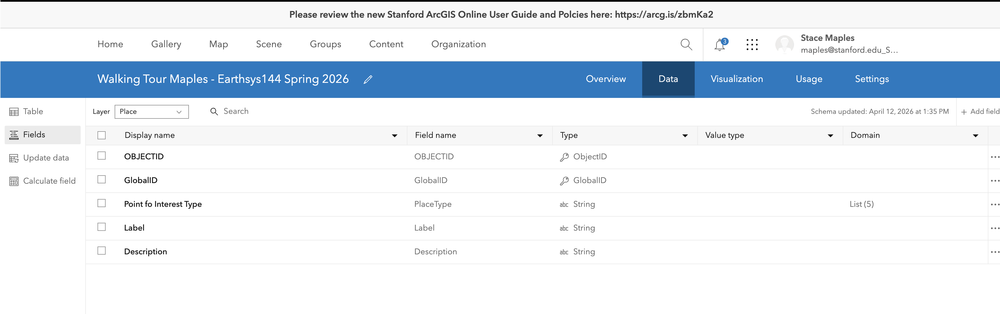

### Enable Offline Editing for Field Maps

**This is a step that MUST be done before adding your feature layers to an ArcGIS Online map** for creating your editing app.

> **Concept note: What does Sync do?** **Sync** is the mechanism that allows a device to take a local copy of data into the field, make edits while disconnected, and then send those edits back to ArcGIS Online later. Without Sync, offline editing would not work because the app would have no safe way to reconcile field edits with the hosted feature layer once the device reconnects.

1. Click on the **Settings tab** at the top of the **Feature Layer's Details page**.
2. Make sure that settings under the **Editing** section at the top are **all enabled**, in particular that "**Enable Sync**" is checked.

   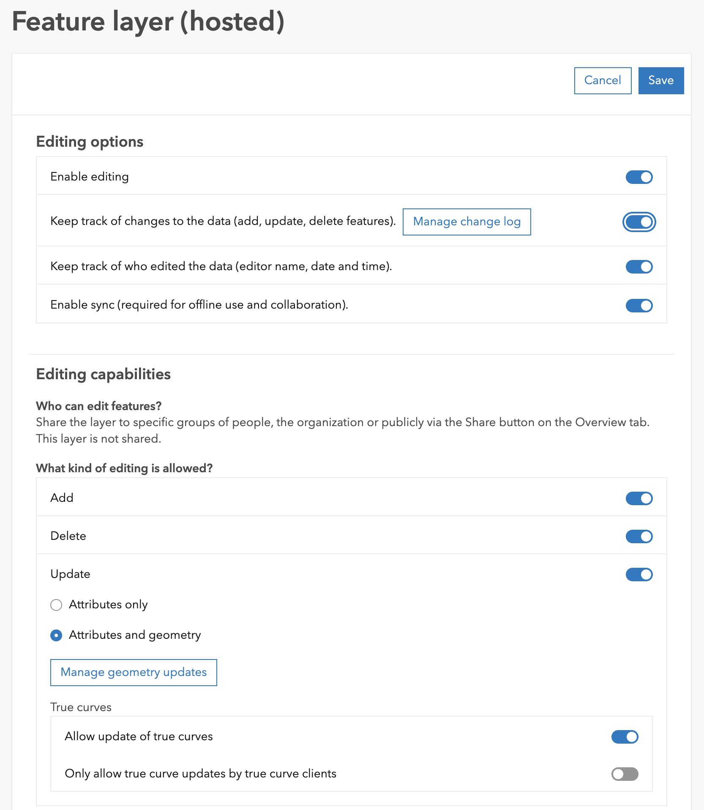
3. Note the other settings for controlling who and how data can be edited.

| **Setting Category**                 | **Option**                                  | **Selected / Notes**       |
| -------------------------------------- | --------------------------------------------- | ---------------------------- |
| **Editing**                          | Enable editing                              | ✅ Enabled                 |
|                                      | Track changes to data (add, update, delete) | ✅ Enabled                 |
|                                      | Track editor name and time                  | ✅ Enabled                 |
|                                      | Enable Sync                                 | ✅ Enabled                 |
| **Who can edit features?**           | Share layer to specific users/groups/org    | Not shared yet (info only) |
| **What kind of editing is allowed?** | Add                                         | ✅ Allowed                 |
|                                      | Delete                                      | ✅ Allowed                 |
|                                      | Update                                      | ✅ Allowed                 |
|                                      | Update type                                 | Attributes and geometry    |
| **True curves**                      | Allow update of true curves                 | ✅ Enabled                 |
|                                      | Only allow updates by true curve clients    | ⬜ Not selected            |
| **Feature visibility for editors**   | Editors can see all features                | ✅ Selected (default)      |
|                                      | Editors can only see their own features     | ⬜ Not selected            |
| **Feature editability for editors**  | Editors can edit all features               | ⬜ Not selected            |
|                                      | Editors can only edit their own features    | ✅ Selected                |
| **Anonymous editor access**          | Same as signed-in editors                   | ⬜ Not selected            |
|                                      | Only add new features (if allowed)          | ✅ Selected                |
|                                      |                                             |                            |

1. Click Save to save these settings.

> **Why offline editing matters:** Even on a well-connected campus, field conditions are unpredictable. If your map can work offline, the data collection workflow is much more resilient. This is even more important for environmental fieldwork, archaeology, disaster response, and any site where network access is weak or inconsistent.

## Part 2: Make a Map

Now you will add the feature layers you created to an ArcGIS Online web map. This map will drive the behavior of your Field Maps mobile app, so everything from this point forward is about making the field collection experience simpler and clearer for the person using it on a device.

> **Think like the field user:** A mobile field map should be simple. Good symbology, clear forms, and sensible defaults matter because the person using the app may be standing in the sun, walking, juggling a clipboard, or trying to capture data quickly before moving on.

1. Return to the **Overview tab** the **Item Details** of your layer and click on **Open in Map Viewer**.

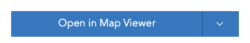

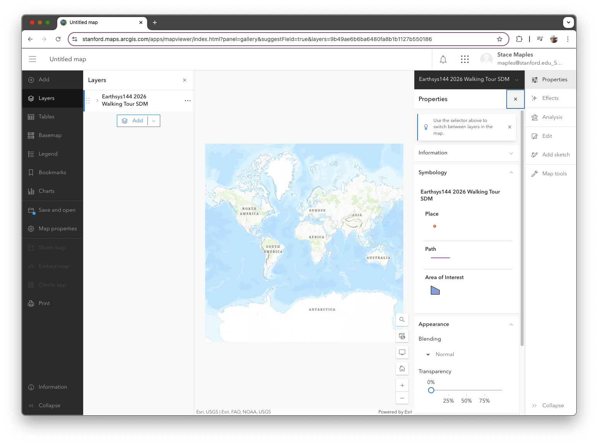

1. Use the `>>` and `<<` arrows at the bottom left and right of the **Map Viewer** to expand the toolbars so the controls show text labels as well as icons.

   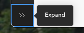
2. Click **Save and open** to save your map.

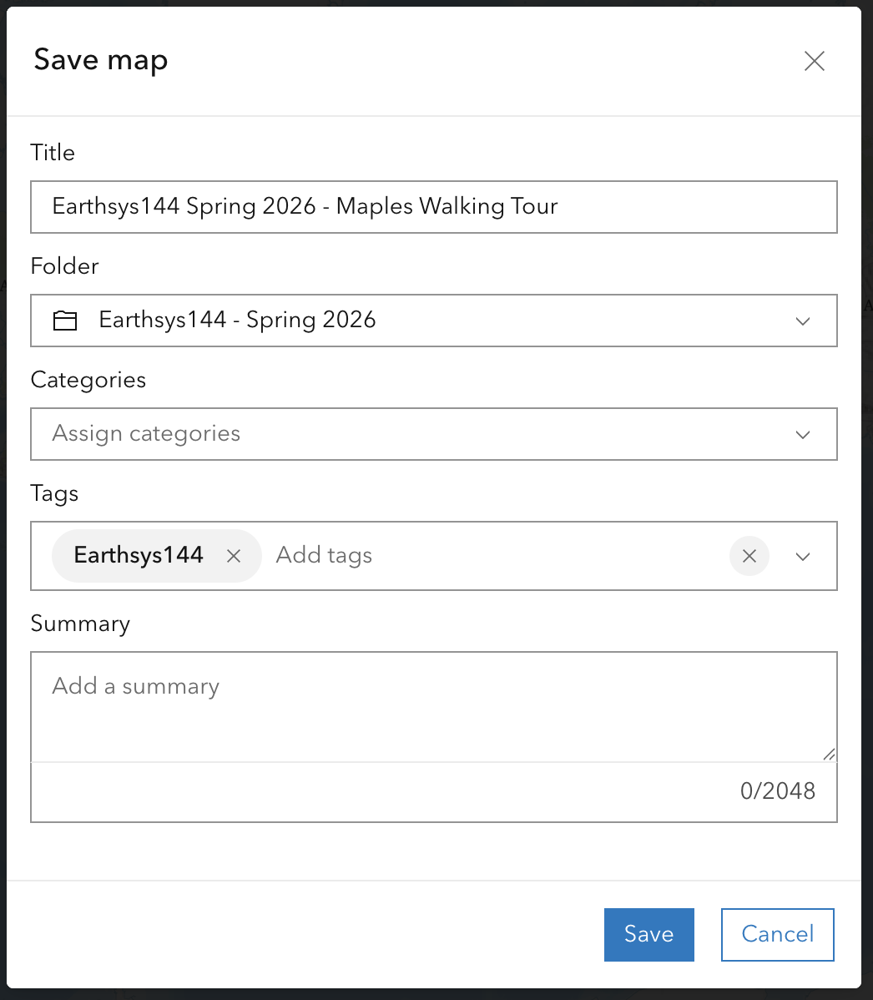

3. Use the arrow next to your Walking Tour layer to expand the layer group so you can see the individual feature layers.

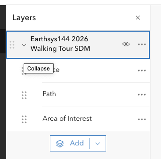

1. Click on the Places feature layer in the Layers panel to select it and update the Properties panel on the right.
2. Click on **Edit layer Style** link for the Places layer, in the Symbology box of the Properties panel.

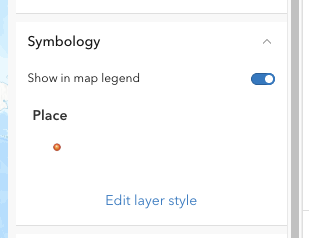

3. Click on the **+ Field** button to select the `Point of Interest Type` as the **field** to base symbology on.

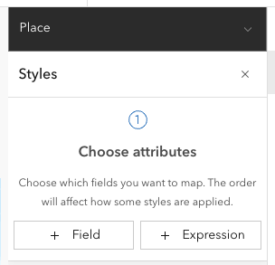

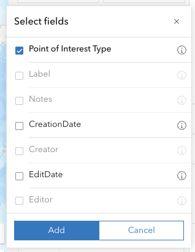

4. Click Add.
5. In the resulting `Pick a style` box, click on Style options to open the layer style editing options.

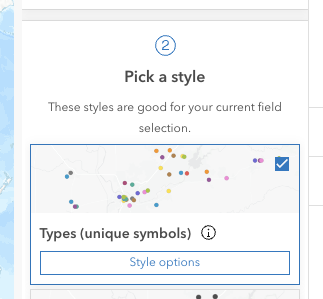

1. Configure symbols for each of your POI types. Explore the available symbol categories. The default simple symbols are fine, but you should feel free to experiment as long as the resulting map stays readable.

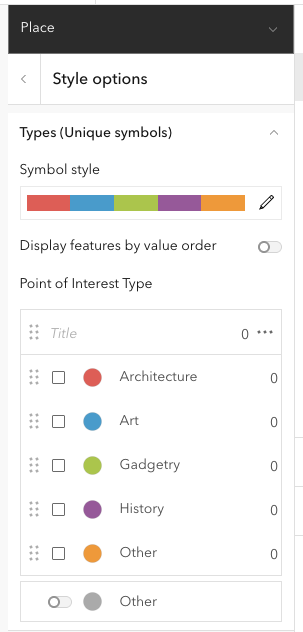

1. Click **Done**, then **Done** again, to apply the symbology to your feature layer.

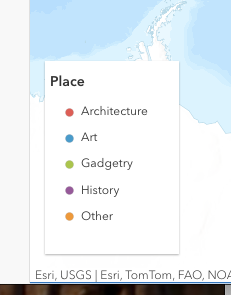

> **Why spend time on symbology?** In a field collection app, symbols are not just decoration. They help users understand what kinds of features already exist on the map and make it easier to distinguish categories quickly while collecting new observations.

## Customize Field Visibility

We do not need to change any settings in this section for the assignment, but it is useful to know where this interface lives. In real projects, this is where you control what a user sees in a pop-up and what fields are visible or hidden.

> **Concept note:** Good schema design is only half the job. Good interface design matters too. A form can have sensible fields and still be frustrating if users are shown too much, too little, or the wrong information at the wrong time.

1. With the Places layer still selected, click on the "Pop-ups" button on the right side of the page.

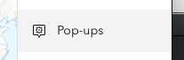

1. Click on the **Fields list** box to expand it and note that the fields you added to your Places feature layer are already included in the Fields list.

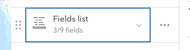

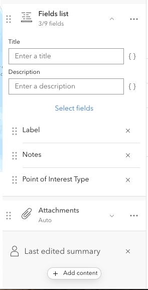

1. Click on **Select fields** in the **Fields list**.
2. Scroll down and note the fields that are unchecked. These are automated fields that will hold the editor tracking values you enabled earlier.

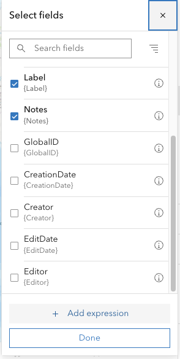

1. Click **Done** to close the **Select fields** panel, and click the **X** at the top of the Properties Panel, to close it.
2. In the map, Zoom and Pan until you can see the entire Stanford Campus

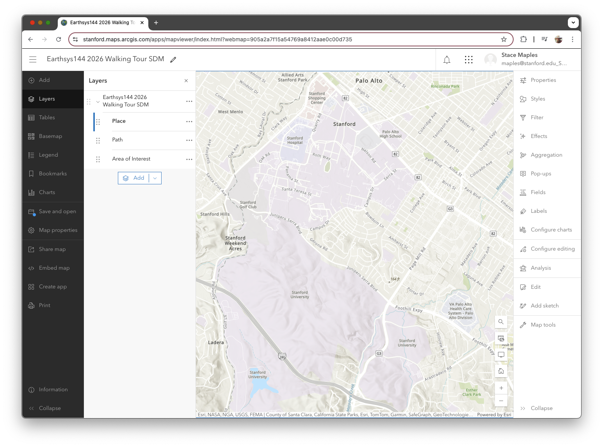

1. Click on the Basemap button on the left side of the page, and change the basemap to OpenStreetMap.

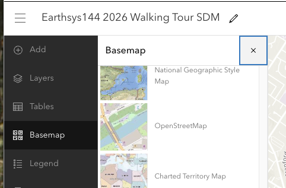

1. Save the map.

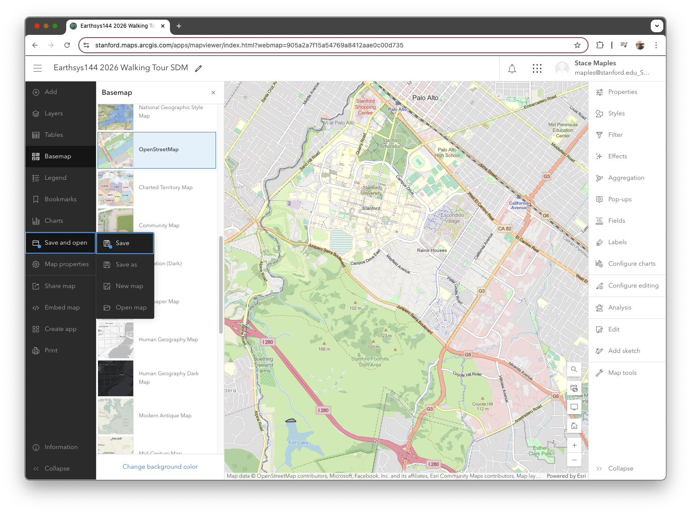

### Update the Editing Template

1. On the right side of the Map Viewer, click **Configure Editing > Templates**

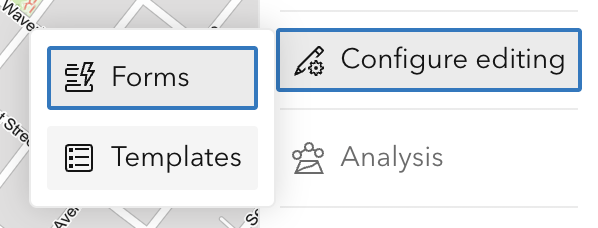

2. Click Update in the Banner at the top

   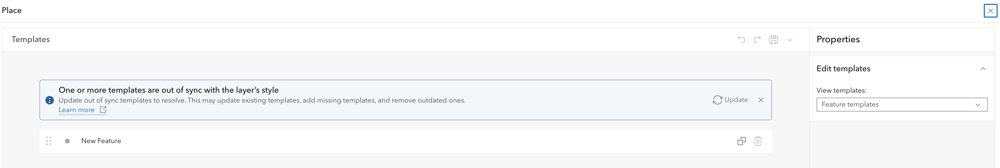
3. CLick OK to Save the Template Update, and close the Template Editor

   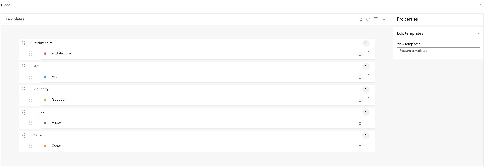

### Enable Offline Editing

> **Concept note: What is offline editing?** **Offline editing** means the app can keep working when the device temporarily loses internet access. The map, basemap, and editable layers are packaged onto the device ahead of time, so the field worker can still view the map and add or edit features. Later, when the device reconnects, those edits can be synchronized back to the hosted layer.

1. Click on the **Map Properties** button 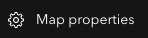 on the left side of the page, then click on the **item details**.

   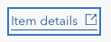

   button and then on the More Details... link to go to the Details page of your webmap.
2. Click on the **Settings tab** at the top of the page and scroll down to the section labeled "Offline."
3. Make sure that "**Offline enabled**" is at the top right corner of the panel.

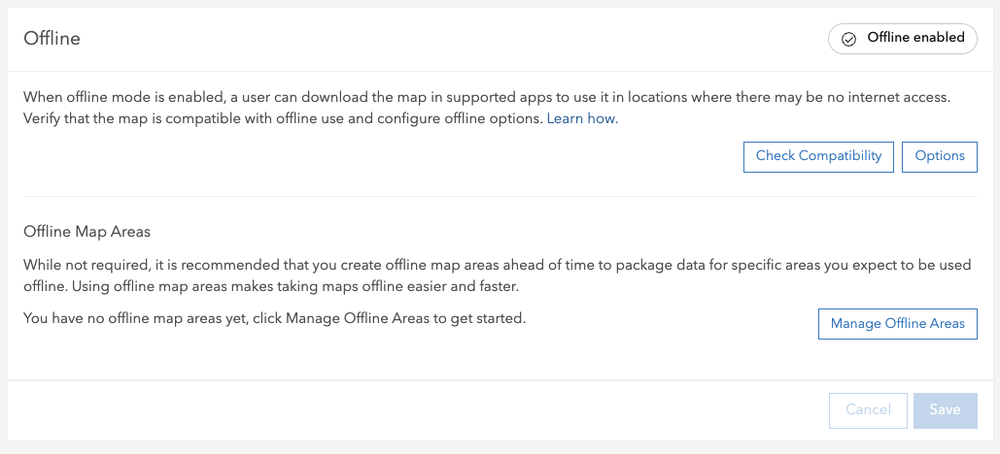

4. Click on **Manage Offline Areas**.

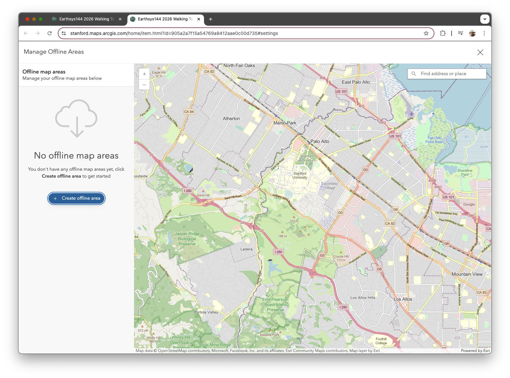

5. Click on the **+ Create offline area** button.
6. Use the **Sketch rectangular map area** tool in the map toolbar, and draw a box around the main Stanford Campus.

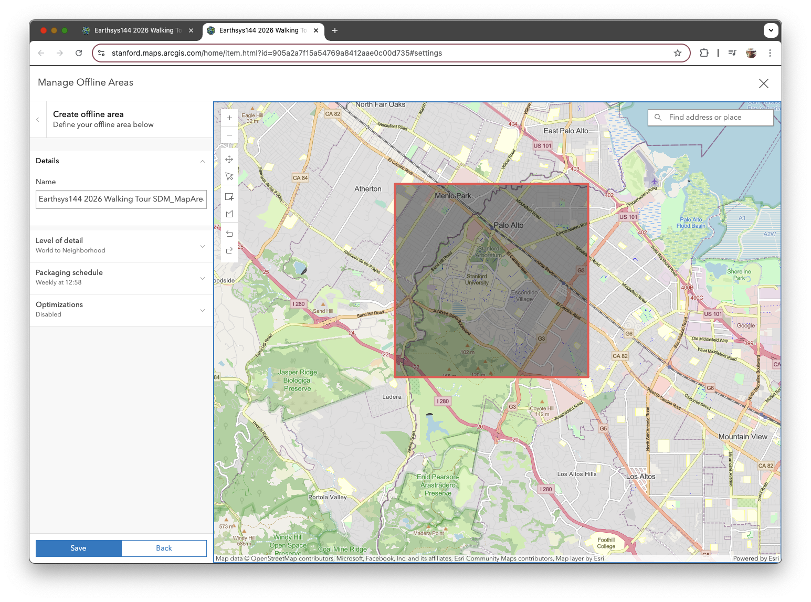

7. Leave the remaining setting as their default values and click Save.
8. Click the **X** at the top right corner to dismiss the **Manage Offline Areas** page.

This offline area is essentially a packaged copy of the map and its editable layers for use on a device when connectivity is unreliable.

> **Why package an offline area?** Offline areas make a field workflow more robust. They shift the project away from depending on constant connectivity and toward a more realistic model of field conditions, where the device may need to keep working even when the network does not.

### Use Field Maps Designer to Finish the Editing Form

1. Click the 3x3 app launcher icon at the top right of the page, next to your user name, and look for **Field Maps Designer**. Launch that tool.

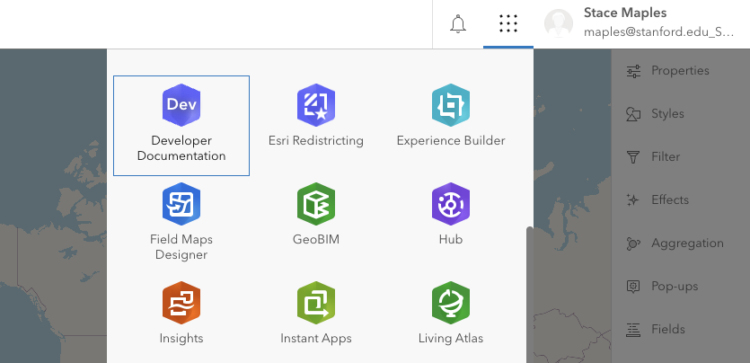

2. The resulting list should be sorted by "**Last Modified**" so your **Walking Tour map** should be the first item in the resulting gallery list. Click to open it in **FieldMaps Designer**.

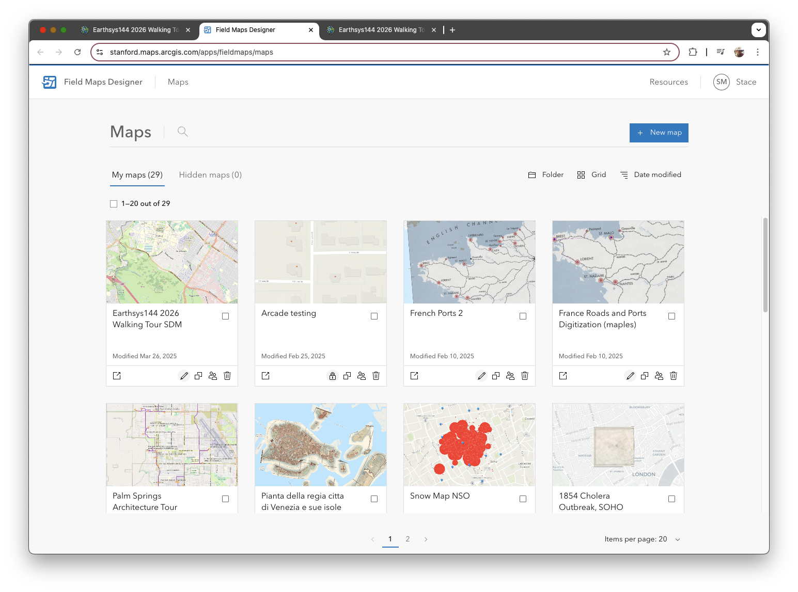

3. On the resulting page, make sure **Place** is selected, and click **Convert pop-up** to import the pop-up fields into your editing form.

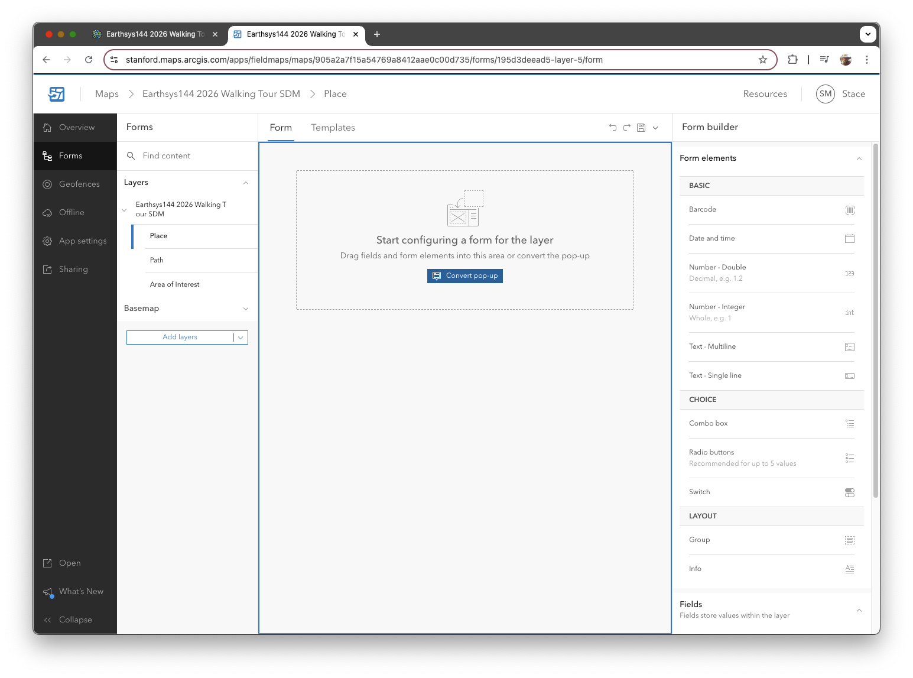

4. This should result in a basic form design, with your custom fields, like this:

   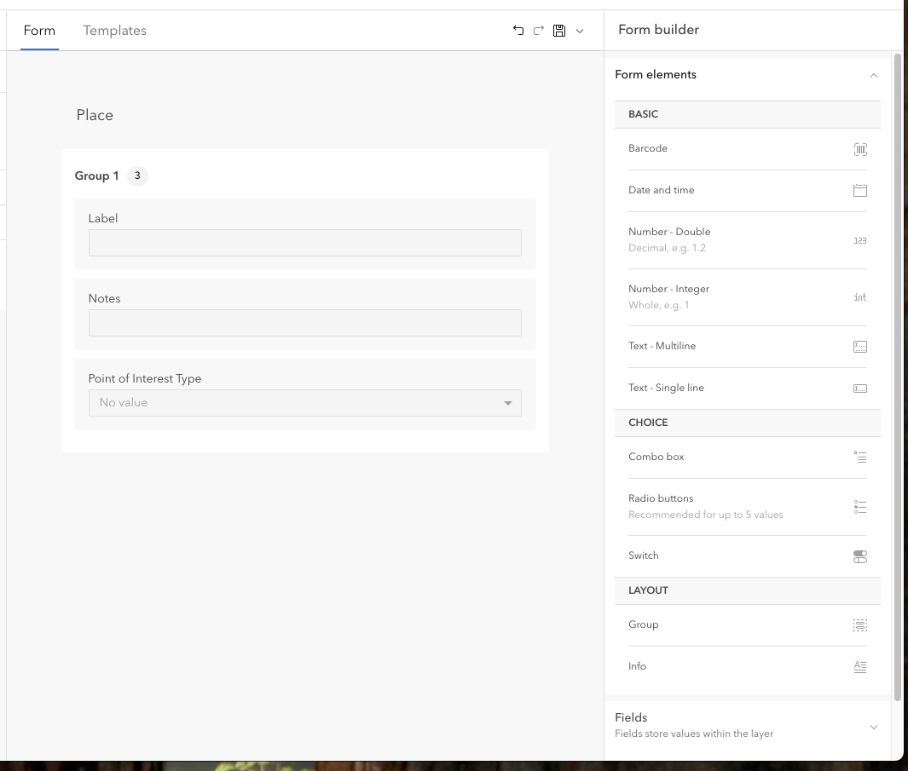
5. Drag and drop the **Date and time** form element into the form designer underneath all other fields.

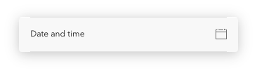

6. Add a Display name and Field name for the Date and time form element.

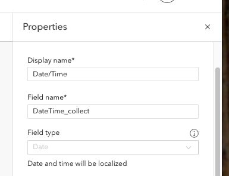

8. Note that certain field names are reserved, including the default one that is created when you drop the Date and time form element into the Form Designer. You will need to append `_collect` to the end of the field name in the formatting panel:

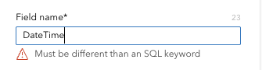

9. Once you have added the `Date/Time` field to the form designer, click on the **Save button** at the top right corner of the Form panel.

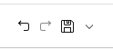

10. Click on the **App settings** button 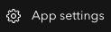 on the left side of the page, and expand each section to familiarize yourself with the options. We will not change any here, but pay particular attention to the options in the **Collection** section for controlling how the app interacts with the device GPS.

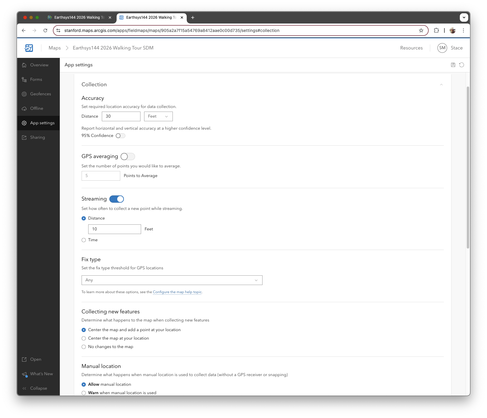

> **Concept note: GPS survey and averaging** In mobile GIS, the device can either record a location quickly from a single GPS reading or spend a little more time collecting multiple readings and averaging them. A **GPS survey** is a more deliberate location capture process that can improve positional accuracy by using repeated measurements. **Averaging** helps reduce random error by combining several readings rather than trusting only one instant. This matters when location quality is more important than speed.

12. If you do make changes, be sure to Save your form.
13. You can now close the form designer.

> **Why use the form designer at all?** A field data collection project succeeds or fails partly on whether the form is usable. The form is where your schema becomes an actual data-entry experience for a person in the field.

## Part 3: Record Points of Interest with Field Maps

For this part of the exercise, you will need to download **ArcGIS Field Maps** for iPhone or Android from the appropriate app store.

Open ArcGIS Field Maps, using `stanford` as your organization, and log in with your SUNetID and password.

1. Choose the map you just made.

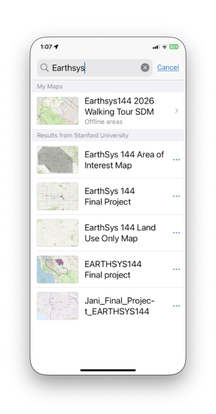

2. You should see the Online Map for use when connected to the network and the **Map Areas** you created for offline use when there is no reliable connectivity.

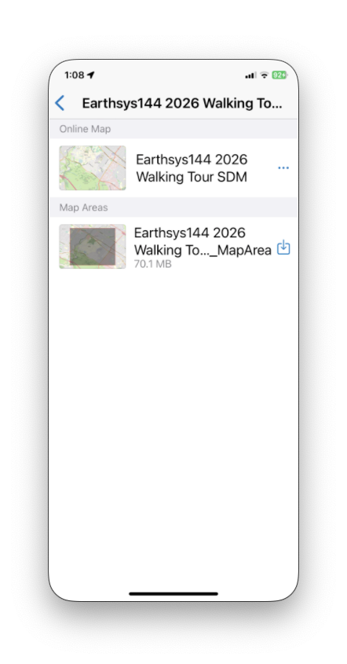

3. Click on the **Online Map to open it.

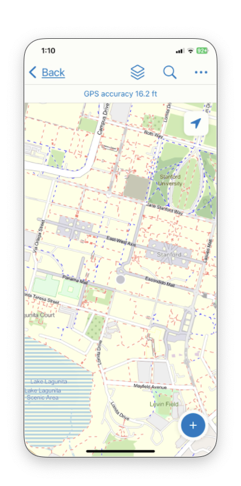

5. To add a feature, touch the **+** icon, select **New Feature**, and follow the prompts.

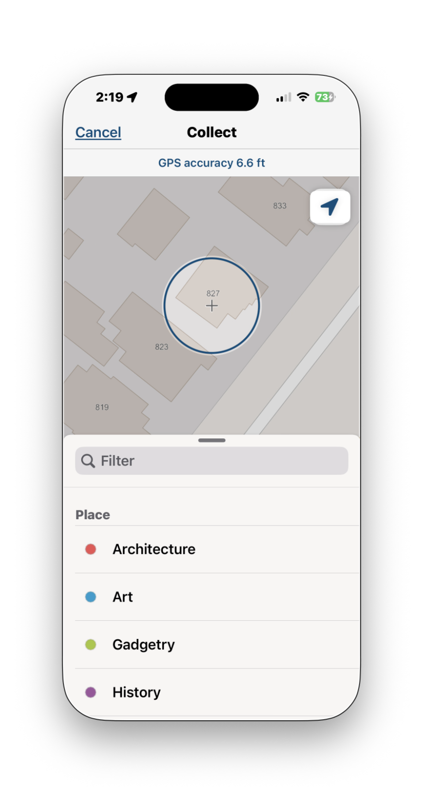

6. You can fill out the form before placing the point, or click **Add Point** first. Sometimes it is useful to wait and place the point after filling the form, to allow your GPS accuracy to improve.
7. Walk around campus, adding public art, historically significant locations, technology, or other useful features such as picnic tables, restrooms, or water fountains. **Collect at least 12 points, with photo or video attachments.**

> **Field methods note:** Good field data is not just about quantity. Try to be consistent about what counts as a feature, use the categories carefully, and write notes that would make sense to another person looking at the data later.

> **Concept note: Why wait for a better GPS fix?** When you first open a field app, the device may still be refining its estimate of where you are. Waiting a little longer can improve the accuracy reading. In some workflows, especially environmental or infrastructure surveys, even a few extra seconds can produce a more reliable location.

## Part 4: Multi-User Editing

Management of multiple field workers can be implemented through the use of **Groups** in ArcGIS Online. You can create a group with appropriate permissions so that people in that group can access and use the deployed map for data collection.

### Join the Current Course Group

First, join the current course group so that you can share and submit your map and feature layers.

> **Important note:** Some of the screenshots below show the course group name from an earlier quarter. Use the current quarter's ArcGIS Online group name and sharing instructions as announced on Canvas.

1. From the map, click the **Home** button and go to **Groups**.
2. Click on the **My Organization's Groups** tab.
3. Search for the current `EarthSys144 Fundamentals of GISci - Spring 2026` course group.
4. Click **Join This Group**.

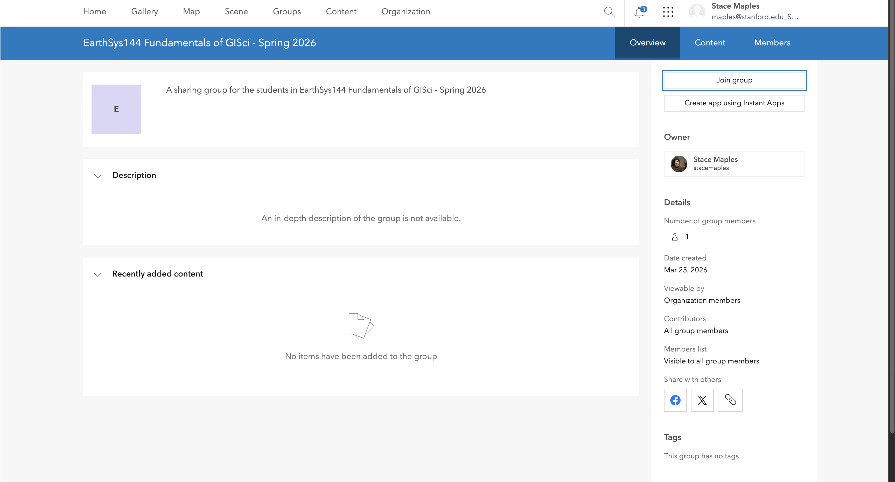

### Share the map and feature layer with the group

Now that you are a member of the course group, you can share content with it. Note that anyone in that group may be able to access and use your app for data collection. In your own research projects, you would normally limit group membership carefully to control access to the app.

1. Click on the **Content** tab at the top of the page to go to **My Content**.
2. Find your mapping app, whose item type will be **Web Map**, and your feature layer. Check their boxes, then click **Share**.

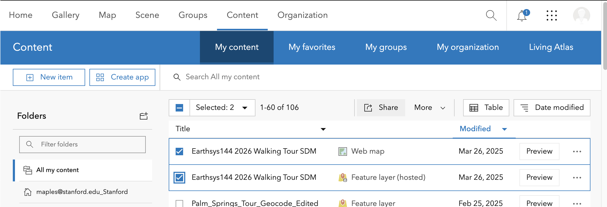

1. Click on the **Edit group sharing** button, select the current course group, and click **OK**.

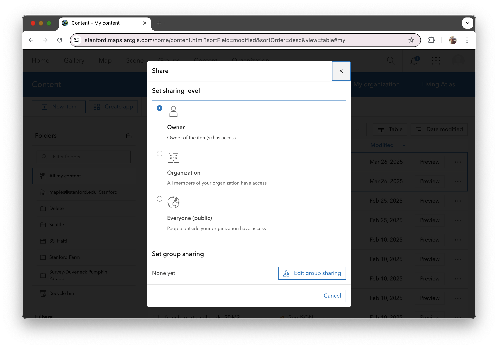

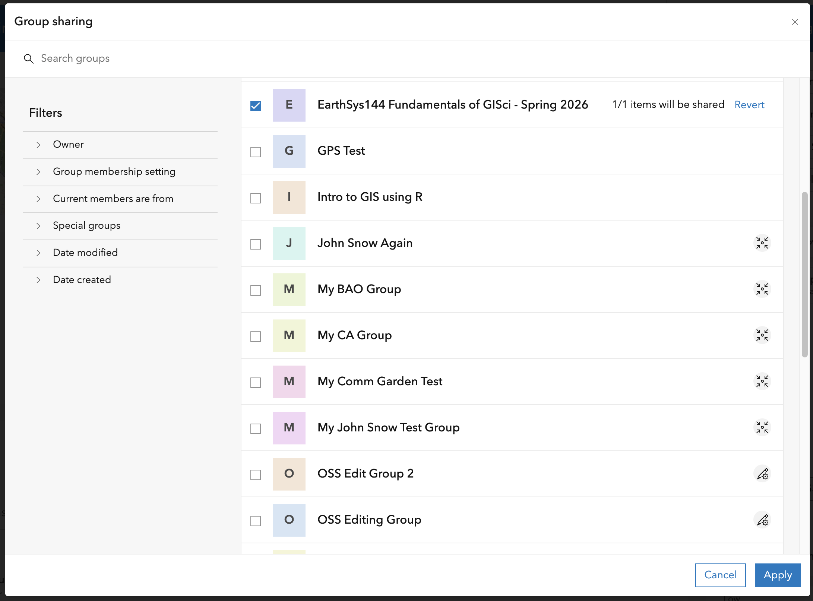

1. Click Apply, then click Save to apply the Share settings

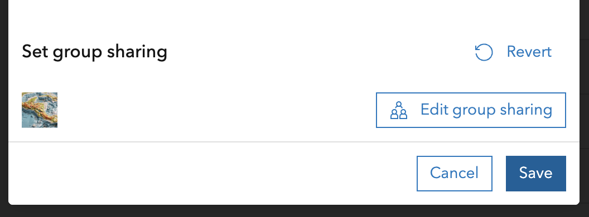

1. Your mapping app and feature layer should now be visible to members of the course group.

### Update Sharing on your Feature Layer

1. You will be prompted to **Review sharing**, since your Feature Layer is probably not shared int he same way as your Map Document.

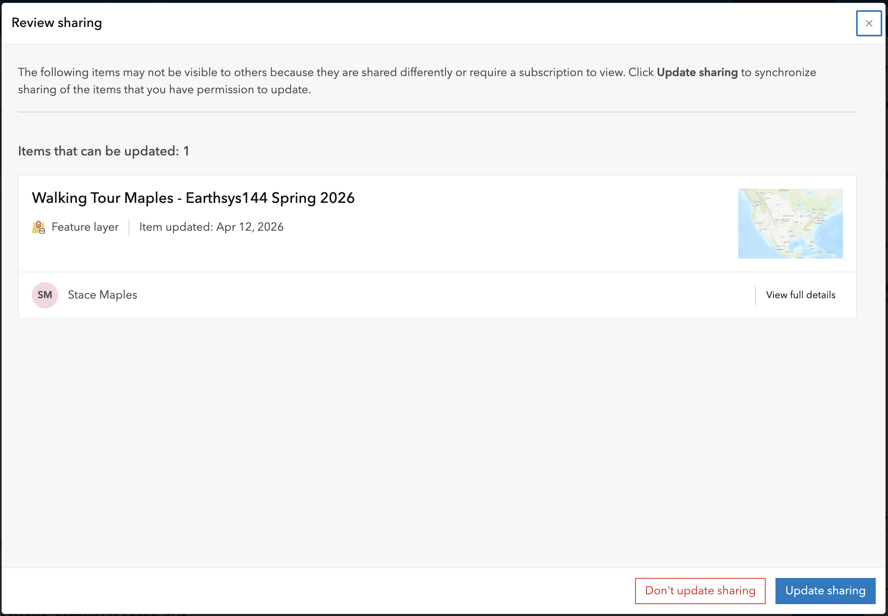

2. Click **Update sharing** button to apply the Share Settings to your **Feature layer**.

## Working with the data

### Create a View Layer

You may want to share the collected data through a visualization, but you usually do not want to share your full editing map with everyone. Creating a **View Layer** is a way to safely share the collected data without exposing the editing layer itself.

> **Important concept:** In GIS, sharing and editing are not the same thing. Separating editable data from read-only views is a core part of responsible data management.

> **Concept note: What is a view?** A **view layer** is a derivative version of your data that can be shared with different permissions or with only part of the original content exposed. A view can be read-only, filtered to only certain records, or configured to show only selected fields. This makes views useful when you want to show data in restricted or partial ways without giving people direct access to the main editable layer.

1. Return to your **Content page**, and find your **Walking Tour feature layer** item and click on it to go to the **Details page**.
2. Click on **Show More** button and then the **Create View Layer** button
3. Give it an appropriate name like `My Mapping App Data Public View (_SUNetID_)` and click OK
4. Click on the **Share** Button in the resulting **Details Page**, and change the Sharing to `Public`.

The resulting feature layer is a read-only view of the data being collected in your mapping app. It can be added to a new map, filtered, symbolized, used in a web application, and shared publicly, within the Stanford organization, or with a controlled group, but without editing permissions.

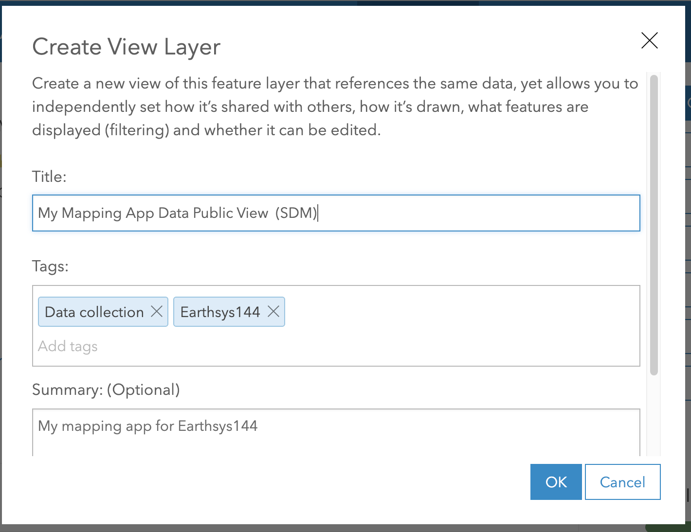

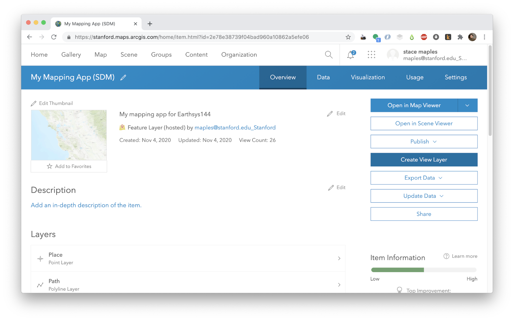

## To Turn In

1. Join the current **EarthSys144 ArcGIS Online course group** if you didn't as part of the above steps, and share your data collection map app with that group.
2. Return to the details page of your **web map** and copy the URL from the browser URL bar.
3. Go to the details page for the **View layer** you created and copy that URL as well.
4. Create a short Google Doc that includes:
   - your name
   - the course and lab title
   - the **web map** URL
   - the **view layer** URL
5. Export that Google Doc as a PDF.
6. Submit the PDF to Canvas.

> **Course turn-in rule:** All `TURN_IN` assignments in this course are submitted as PDF files. When an assignment's deliverable is a URL, place the URL or URLs in a Google Doc and export that document as a PDF before submitting.

These two links represent two different roles in the workflow:

- The **web map** shows the working collection environment.
- The **view layer** shows the shared, non-editable version of the collected data.

## Conclusion

In this lab, you built a simple field data collection workflow from the ground up. You:

* Created hosted feature layers in ArcGIS Online
* Added fields and controlled-value lists to structure incoming data
* Configured a web map for mobile data collection
* Enabled offline use
* Customized the editing form in Field Maps Designer
* Collected data on a mobile device
* Shared the results through a view layer and course group

This kind of workflow is common in research, planning, environmental monitoring, public history, archaeology, and community mapping. In later projects, you can adapt the same basic pattern to collect your own field observations, survey results, media, and spatial notes.
