# 02 - PICK ONE TO TURN IN - Georeferencing with QGIS

> **Note:** To make sure you are viewing the most recent version of this lab guide, hold **Shift** and click the browser refresh button.

> **Pick one note:** For Week 02, complete **one** of the two `PICK_ONE_TO_TURN_IN` labs, based on your interests. Choose this lab if historical maps, archival materials, and georeferencing are more relevant to the kind of work you want to do.

> **Turn-in for grading:** This lab includes material that must be turned in for grading. Complete the required deliverables and submit them as instructed by the course.

## Overview

In this lab, you will take a scanned historical map and give it spatial coordinates so it can be used in GIS. This process is called **georeferencing**. A scanned map image, by itself, is just a picture. Once it is georeferenced, it becomes spatial data that can be aligned with vector layers, modern basemaps, and other geographic information.

> **Concept note: What is georeferencing?** Georeferencing is the process of connecting an image to real-world coordinate space. You are telling the software which places on the scanned map correspond to known places on the Earth. Once that relationship is established, the image can be displayed, compared, and analyzed alongside other spatial data.

This is one of the most important workflows in historical GIS, public history, environmental reconstruction, and archival map use. It is how we connect paper maps and scanned images to contemporary spatial analysis.

You will work with:

- A scanned 1900 map of Wyoming from Stanford Library collections
- A Public Land Survey System (PLSS) reference layer from EarthWorks
- QGIS georeferencing tools

## Learning Objectives

By the end of this lab, you should be able to:

- Explain what georeferencing is and why it matters
- Download and organize scanned map imagery and reference data
- Explain why a reference layer is needed for georeferencing
- Subset a reference layer using an attribute filter
- Adjust layer symbology to support visual alignment
- Explain why projection choice matters during georeferencing
- Create and apply a custom CRS for a specific mapping problem
- Explain what ground control points are and why their distribution matters
- Use the QGIS Georeferencer to place control points and transform a scanned map
- Evaluate the visual accuracy of a georeferenced image

## Data

This lab uses two source datasets:

- **Map of the State of Wyoming (1900)**
  Department Of The Interior General Land Office Hon. Binger Hermann, Commissioner. *Map Of The State Of Wyoming*.
  Stanford record: [https://searchworks.stanford.edu/view/10453474](https://searchworks.stanford.edu/view/10453474)
- **Public Land Survey System of the United States, 2010**
  Stanford EarthWorks record: [https://earthworks.stanford.edu/catalog/stanford-td889mh1819](https://earthworks.stanford.edu/catalog/stanford-td889mh1819)

## Before You Start

- Create a project folder for this lab and keep all files for the exercise together there.
- Save your QGIS project in the same folder structure as your downloaded data.
- Expect to move back and forth between the main QGIS window and the Georeferencer window.

> **Important idea:** A QGIS project file does not contain your data. It stores paths to your data. Keeping the project file, image, and reference layers together makes the project easier to manage and much less likely to break.

## Part 1: Download the Map Image

### Download the scanned Wyoming map

1. In a browser, go to the Stanford SearchWorks record for the scanned map:
   [https://searchworks.stanford.edu/view/10453474](https://searchworks.stanford.edu/view/10453474)
2. Click the **Share** icon.


3. Choose **Download**.

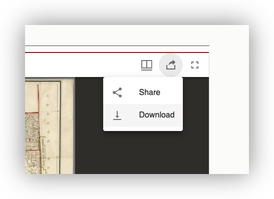

4. Download the **Original source file**:
   [https://stacks.stanford.edu/file/mm941rt1648/3532000.jp2](https://stacks.stanford.edu/file/mm941rt1648/3532000.jp2)

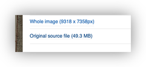

5. Save the `3532000.jp2` image in your project folder.

> **What is a `.jp2` file?** `JP2`, or **JPEG 2000**, is a compressed image format commonly used for very large imagery files, including scanned maps and aerial photography.

## Part 2: Download the Reference Data

### Download PLSS data from EarthWorks

> **Concept note: What is PLSS?** The **Public Land Survey System (PLSS)** is a land division framework used across much of the United States. It organizes land into a regular pattern of townships, ranges, and sections. In this lab, the PLSS layer works as a spatial reference grid because the historical map also uses that survey logic.

1. Go to the EarthWorks record:
   [https://earthworks.stanford.edu/catalog/stanford-td889mh1819](https://earthworks.stanford.edu/catalog/stanford-td889mh1819)
2. Download the **Zipped Object** to your project folder.
3. Unzip the download.

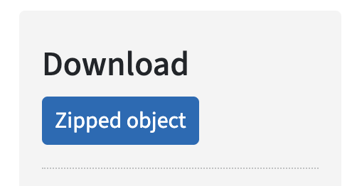

### Add the PLSS layer to QGIS

1. Open a **new QGIS project** and save it in your project folder.
2. In the **Browser** panel, browse to your project folder.
3. Add `plss00p020.shp` to the project.

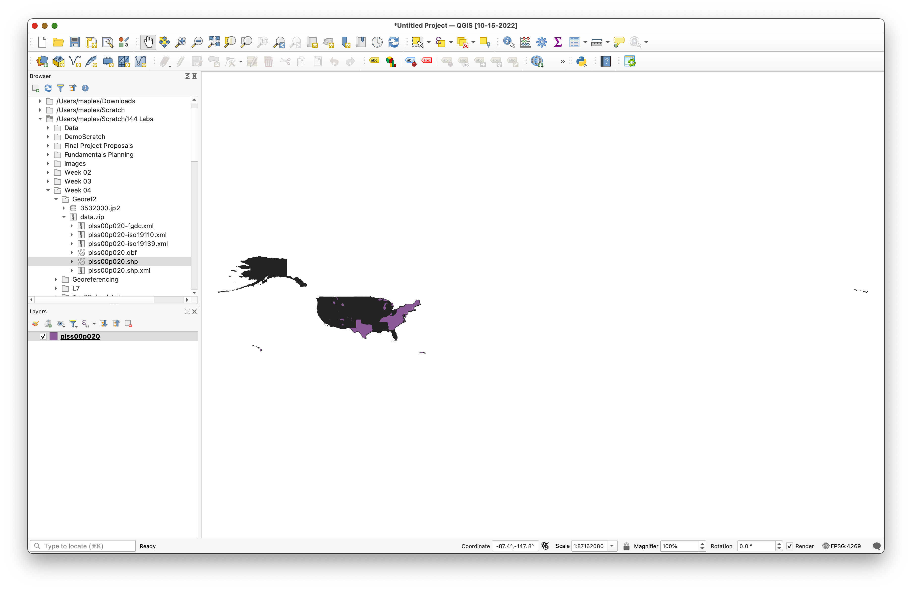

> **Why do we need a reference layer?** Georeferencing works by matching known locations on the scanned map to known locations in spatial data. The PLSS grid gives us a reference framework we can align the historical map against.

## Part 3: Subset the Reference Layer

The PLSS layer covers the entire United States, but we only need the part relevant to Wyoming. Rather than loading the entire reference layer visually, we will filter it.

### Use a layer filter

1. Open the **Attribute Table** for `plss00p020.shp` and examine the fields.
2. Notice that the `state` field gives us a convenient way to limit the layer to Wyoming features only.

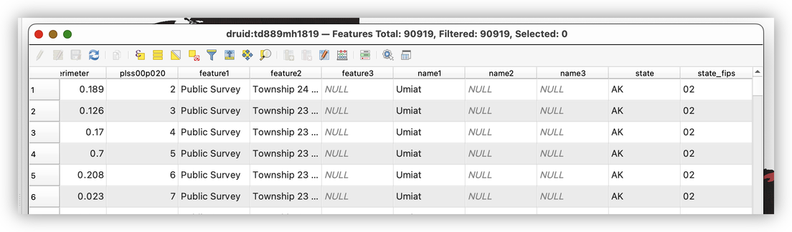

3. Open the **Layer Properties** for `plss00p020.shp`.
4. Go to the **Source** tab.
5. Click the **Query Builder** button.

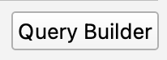

6. Build the following filter:

   ```text
   "state" = 'WY'
   ```

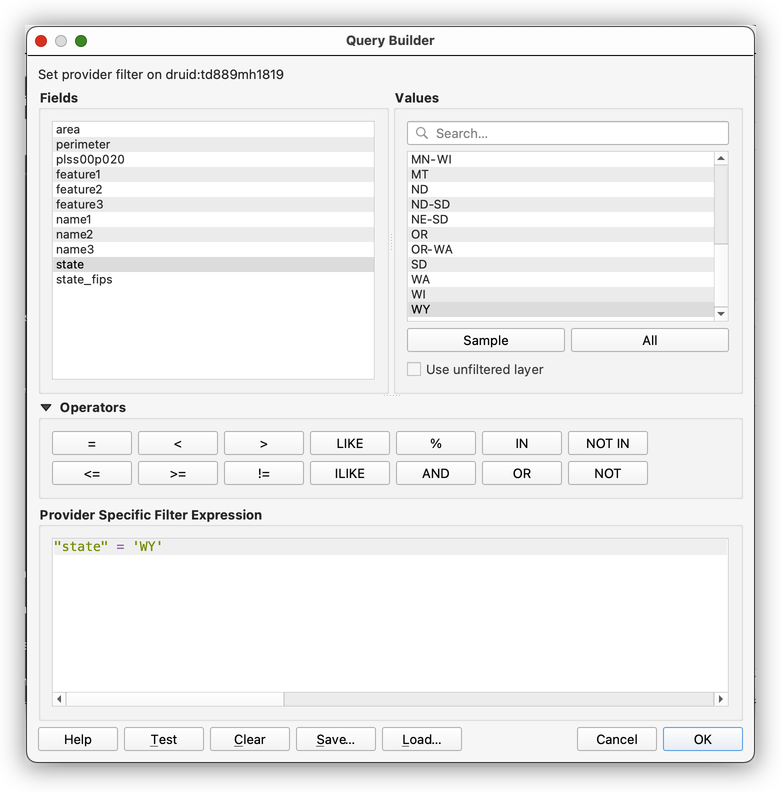

7. Click **OK** to apply the filter.
8. Click **OK** again to close the Layer Properties window.

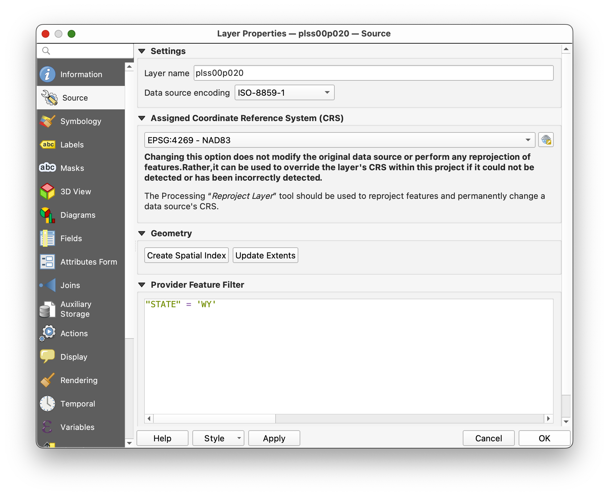

9. Right-click the `plss00p020.shp` layer and choose **Zoom to Layer**.

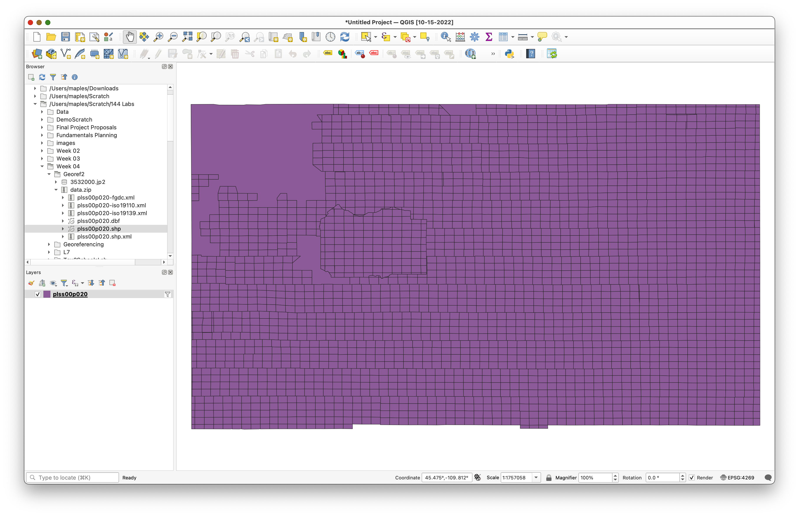

> **Why filter instead of deleting?** A filter changes what you see without changing the original dataset. That means you keep the full data file intact while focusing only on the features relevant to your analysis.

## Part 4: Prepare the Reference Layer for Georeferencing

### Add a basemap

1. Add a labeled basemap using the **QuickMapServices** plugin.
2. Choose a basemap that provides useful context and labels.

### Adjust PLSS symbology

To use the PLSS layer as a visual reference, we want it to be easy to see without covering everything else.

1. Select the `plss00p020` layer.
2. Open the **Layer Styling** panel.


3. Set the fill to **Transparent Fill**.

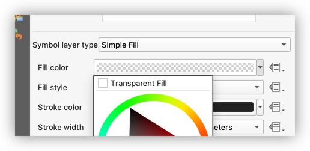

4. Change the stroke color to something bright and easy to see.

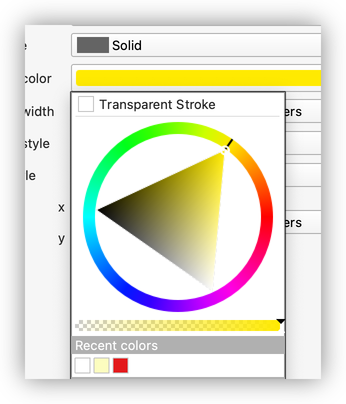

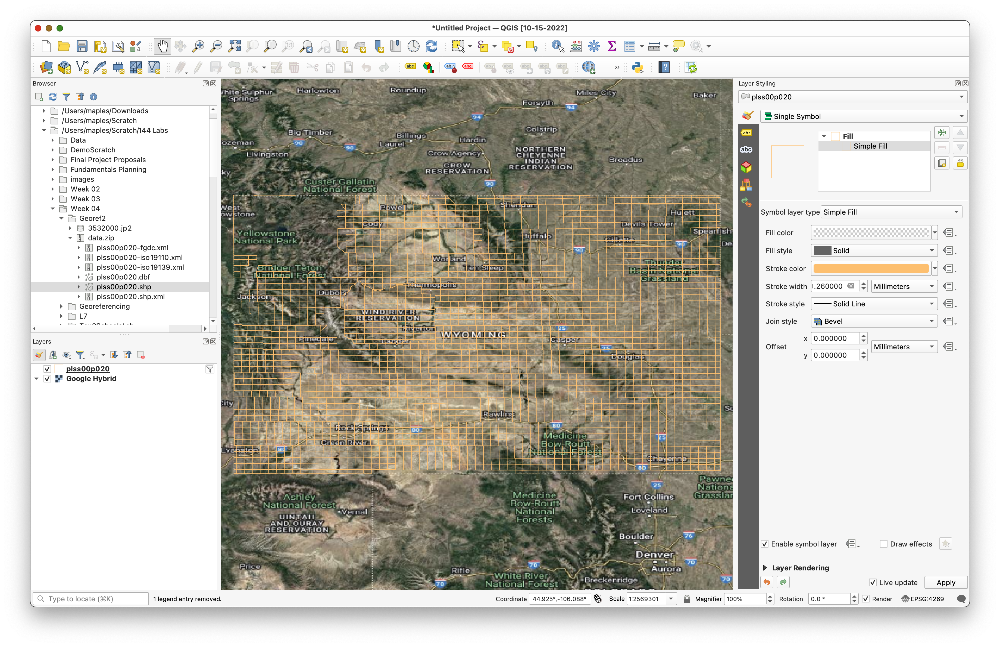

> **Why use transparent fill?** During georeferencing, you usually need to compare multiple visual references at once: the historical image, the reference grid, and often a basemap. A solid polygon fill would hide too much of the map beneath it.

## Part 5: Examine the Map and Projection Problem

Before georeferencing, it is worth studying the scanned map itself.

### Examine the scanned image

You can examine the image in the SearchWorks viewer here:
[https://searchworks.stanford.edu/view/10453474](https://searchworks.stanford.edu/view/10453474)

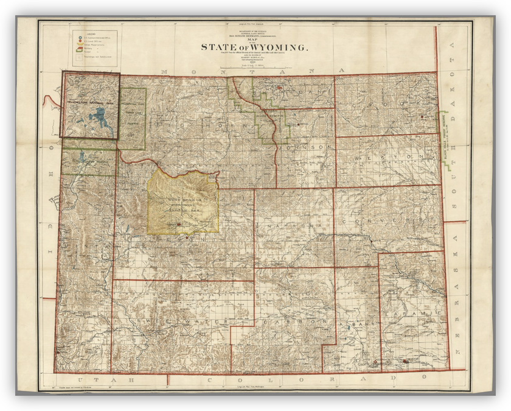

Compare the top and bottom graticule and think through the following:

1. What is the difference between the longitude coordinates at the top and the longitude coordinates at the bottom of the map?
2. What do we call the lines of reference that the top and bottom of the map refer to?
3. Look at the Wyoming/Montana state line. Does it appear perfectly straight?
4. What is the approximate center longitude of Wyoming?
5. What is the approximate center latitude?

Use your cursor in QGIS to hover near the center of Wyoming and compare what you see to your answers above.

> **Why do this first?** Good georeferencing is not just clicking points mechanically. It starts with reading the map carefully and noticing how the cartographer represented space.

> **Concept note: How do you infer a map's projection?** Older maps often do not clearly state their projection, or students may not yet know how to interpret the note if they do. You can still make useful inferences by looking at the graticule, the apparent curvature or straightness of parallels and meridians, and whether boundaries that should be straight appear bent or stretched. These visual clues help you reason about how the mapmaker projected the curved Earth onto a flat page.

## Part 6: Alter the CRS for the Georeferencing Task

### Examine the project CRS

1. Click the **Project CRS** indicator in the bottom-right corner of the QGIS window.

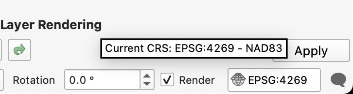

2. Change the Project CRS to:

   `USA_Contiguous_Equidistant_Conic`
   `ESRI:102005`
3. Observe what happens to the PLSS grid.

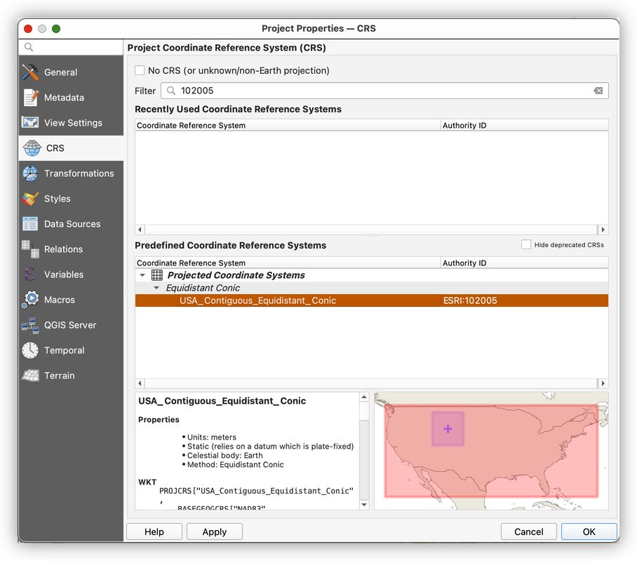

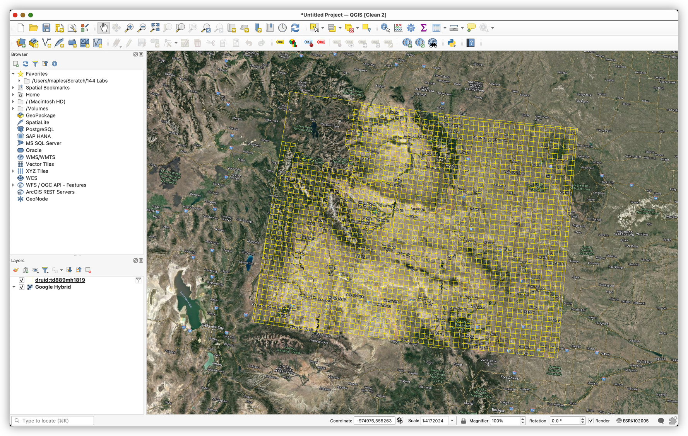

> **What happened?** The PLSS layer is being reprojected on the fly into a projection designed for the contiguous United States as a whole. That projection is not centered specifically on Wyoming, so it is not ideal for this map.

### Create a custom projection centered on Wyoming

We want a projection better suited to this specific map.

> **Concept note: What is a custom projection?** A **custom projection** is simply a projection definition that you build or modify for a specific mapping problem. In QGIS, this usually means starting from an existing projection and changing parameters such as the **central meridian** (`lon_0`) and the **standard parallels** (`lat_1` and `lat_2`). Those settings control where distortion is minimized and how the projection is centered on the region you care about.

1. In the Project CRS properties, copy the Proj4 text for `ESRI:102005`:

   ```text
   +proj=eqdc +lat_0=39 +lon_0=-96 +lat_1=33 +lat_2=45 +x_0=0 +y_0=0 +ellps=GRS80 +towgs84=0,0,0,0,0,0,0 +units=m +no_defs
   ```
2. Go to **Settings > Custom Projections**.
3. Click **Add CRS**.


4. Modify the projection parameters so they are centered on Wyoming. Note the changes:

   ```text
   +proj=eqdc +lat_0=43 +lon_0=-107.5 +lat_1=37 +lat_2=49 +x_0=0 +y_0=0 +ellps=GRS80 +towgs84=0,0,0,0,0,0,0 +units=m +no_defs
   ```
5. Paste the modified Proj4 text into the custom CRS definition.

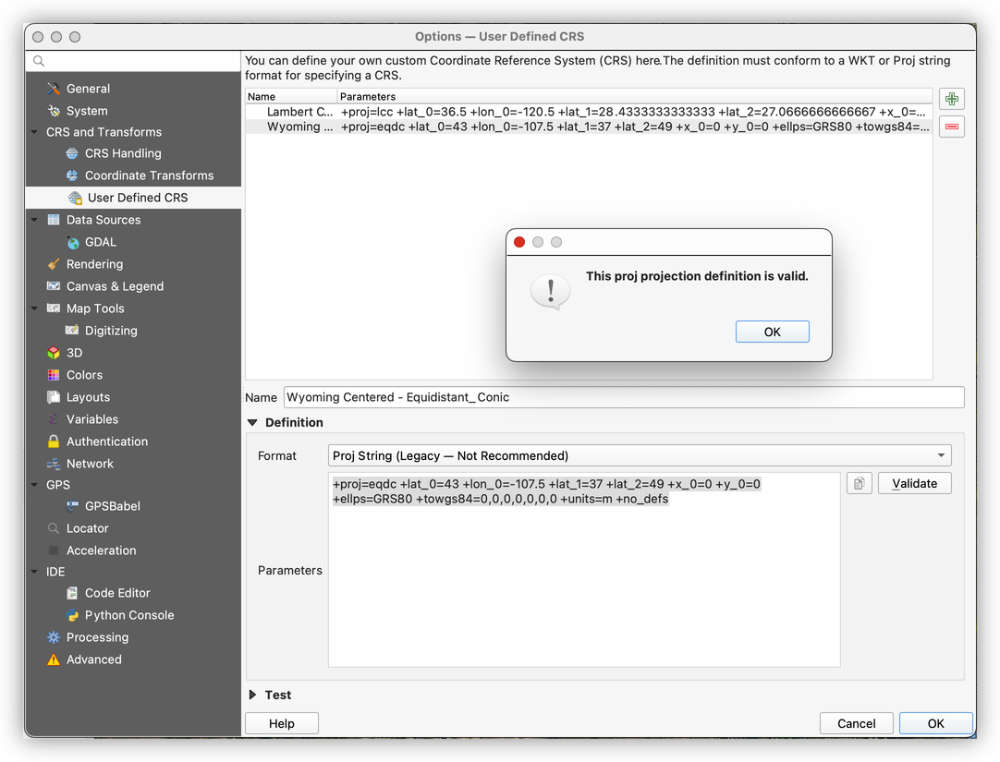

6. Save the custom CRS and apply it.

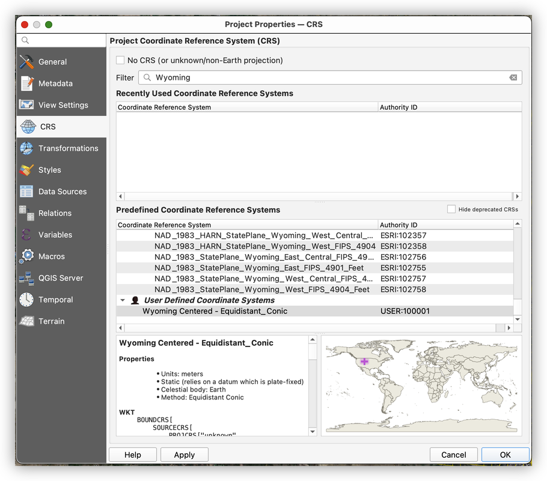

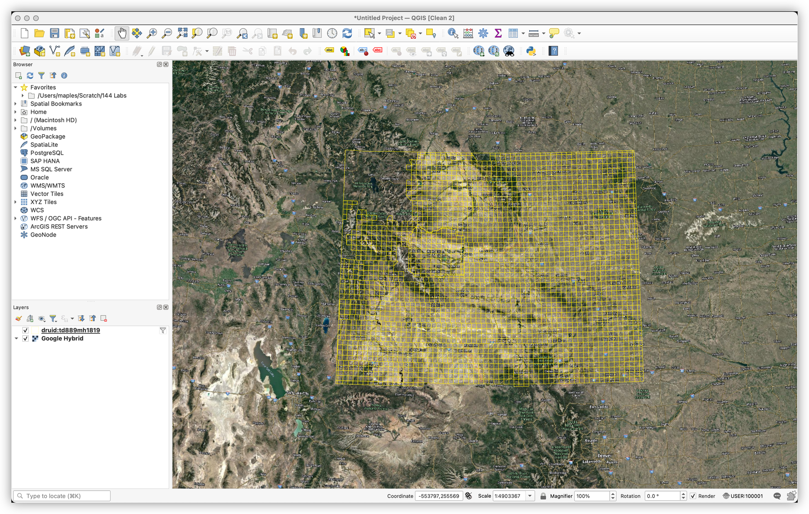

7. Save your project.

> **Why make a custom CRS?** Georeferencing works best when the target projection fits the map you are aligning. A projection centered on Wyoming reduces distortion for this specific use case and gives you a more sensible geometric target.

## Part 7: Use the Georeferencer Plugin

### Open the Georeferencer

1. In QGIS, go to **Layer > Georeferencer**.

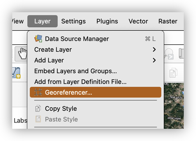

2. Load the `3532000.jp2` image.


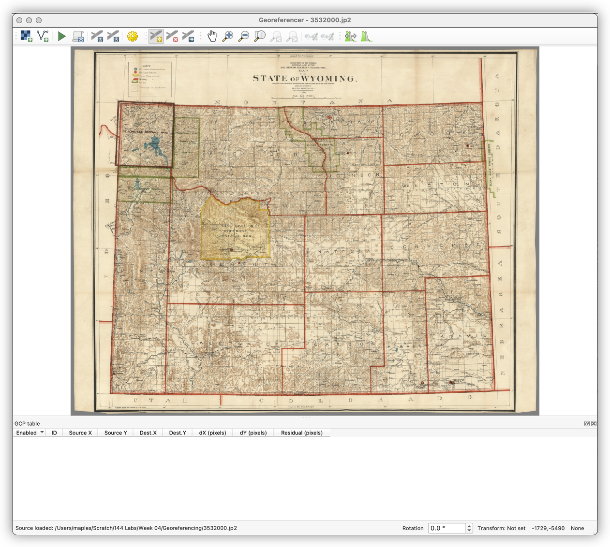

### Set transformation settings

1. Open the **Transformation Settings** dialog.


2. Use the following settings:

- **Transformation type:** `Polynomial 2`
- **Resampling method:** `Cubic`
- **Target CRS:** your custom Wyoming projection
- **Save GCP points**
- **Load in QGIS when done**

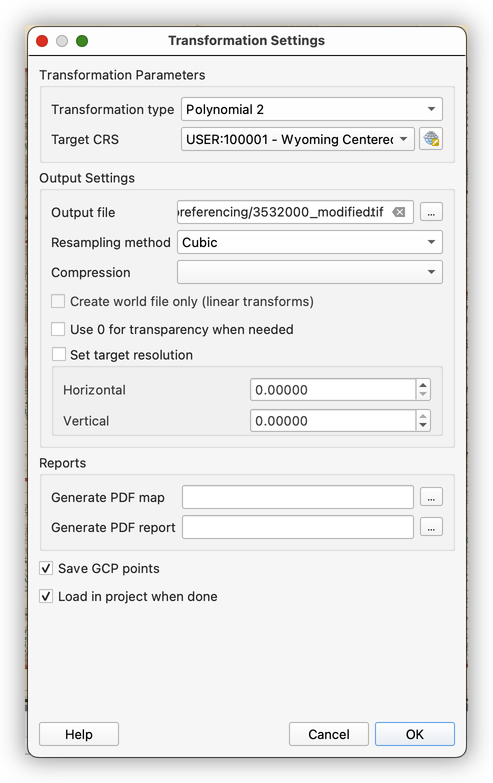

> **What are GCPs?** **Ground Control Points** are matching locations you identify on the scanned map and in real geographic space. The quality and distribution of your GCPs strongly affect the quality of the georeferencing result.

> **Concept note: What does the transformation type mean?** A transformation is the mathematical rule QGIS uses to bend, stretch, rotate, or shift the scanned image so it fits geographic space. Different transformation types allow different levels of flexibility:
>
> - **Linear / Helmert** transformations mostly preserve shape and are useful when the source image is already close to correct and only needs shifting, scaling, or rotating.
> - **Polynomial 1, 2, and 3** allow progressively more warping. First-order polynomial is often called an affine transform. Second- and third-order polynomials can handle more distortion, but they also risk overfitting if the control points are poor.
> - **Thin Plate Spline** is a rubber-sheet style transformation that can handle irregular distortion, but it should be used thoughtfully because it can bend parts of the image strongly.
> - **Projective** transformations are useful when the source behaves like a tilted photograph or perspective view.
>
> In general, higher-order transformations can fit more complicated distortion, but they also require more care and more well-distributed control points.

### Place control points

1. Start by placing points near the corners and center of the image.
2. Continue adding points so they are distributed as evenly as possible across the map.
3. Use recognizable line intersections, grid crossings, and map features that can be matched confidently.


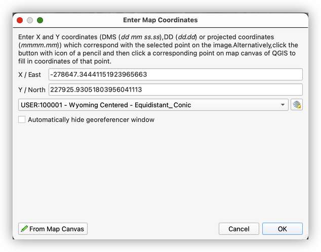

4. Link the Georeferencer and QGIS windows if helpful so you can move between them efficiently.

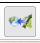

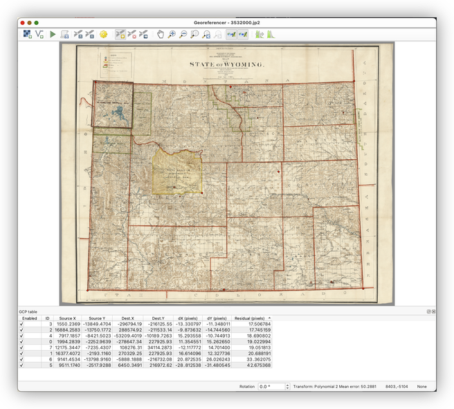

> **Control point strategy matters:** Do not cluster all your points in one part of the map. Spread them across the full extent so the transformation has support everywhere, not just in one corner.

> **Concept note: What makes a good GCP?** A good **Ground Control Point** is a location you can identify confidently in both the scanned map and the reference data. Intersections, corners, graticule crossings, and survey grid crossings are often better than vague or fuzzy features. Good GCPs are not only accurate individually, but also distributed well across the map.

### Run the georeferencing process

1. When you have enough well-distributed control points, click **Start Georeferencing**.


2. Let QGIS create the transformed output and load it back into the main project.

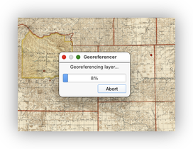

3. Drag the newly added image below the PLSS layer.
4. Check the alignment of the historical map against the PLSS grid and basemap.

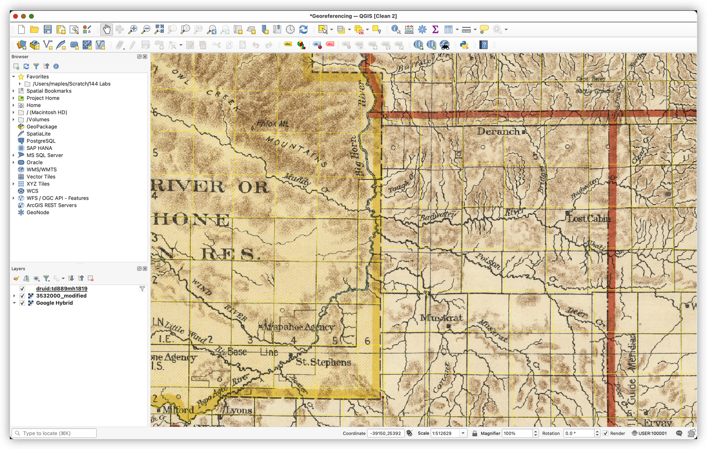

## Evaluating Your Result

A georeferenced image is rarely "perfect," especially for an old scanned map. What matters is whether the fit is reasonable for the purpose of the project.

> **Concept note: What is RMSE?** **RMSE**, or **Root Mean Square Error**, is a summary statistic that describes how far your control points are, on average, from their fitted locations after the transformation is calculated. Lower RMSE usually suggests a better fit, but RMSE should never be treated as the only measure of quality. A low RMSE with badly clustered GCPs can still produce a poor map in parts of the image. Always combine RMSE with visual evaluation.

Look for:

- Good alignment across the whole image, not just in one area
- Reasonable fit at grid intersections and major boundaries
- No obvious twisting or stretching in one part of the map
- A pattern of error that makes sense, rather than random wild misalignment

> **Important GIS habit:** Always evaluate your result visually and conceptually. Do not assume a tool output is correct just because the software completed successfully.

## Part 8: Create the Final Map Layout

Your final deliverable for this lab is not just the georeferenced image inside the QGIS project. You should create a clear map layout that communicates the result of your georeferencing work.

### Build the layout

1. In the main QGIS window, make sure the georeferenced historical map is visible.
2. Keep the PLSS layer turned on and symbolized so it can be seen clearly on top of the historical map.
3. Keep a basemap visible underneath for geographic context.
4. Go to **Project > New Print Layout** and create a new layout.
5. Add a map frame that shows the georeferenced Wyoming map clearly.
6. Add the usual cartographic elements:
   - title
   - legend
   - scale bar
   - your name
   - date
   - map CRS
7. Make sure the final composition clearly shows:
   - the georeferenced historical map
   - the PLSS grid superimposed on top of it
   - a basemap underneath or around it for reference

> **Why make a layout?** Georeferencing is not only a technical operation. It is also a way of communicating spatial alignment and historical context. A good layout makes it much easier to evaluate and explain the result.

### Export the layout

1. In the layout window, go to **Layout > Export as PDF**.
2. Save the PDF with a clear file name such as:

   ```
   sunetid_wyoming_georeferencing_layout.pdf
   ```
3. Open the PDF after export and confirm that all map elements are visible and legible.

## Turn-In Guidance

The deliverable for this lab is:

- A **map layout exported to PDF**

That PDF should show:

- The georeferenced historical Wyoming map
- The PLSS grid superimposed on the map
- A basemap for geographic context
- A title
- A legend
- A scale bar
- Your name
- The date
- The map CRS

Your working QGIS project should still include:

- The filtered PLSS reference layer
- The custom Wyoming-centered CRS
- The georeferenced historical image loaded back into QGIS

Submit the exported PDF to Canvas.

> **Course turn-in rule:** All `TURN_IN` assignments in this course are submitted as PDF files. For this lab, the PDF is your exported map layout.

## Conclusion

In this lab, you took a scanned historical map and turned it into usable spatial data. You:

- Downloaded a scanned map image and a reference dataset
- Filtered the reference data to the state of Wyoming
- Styled the PLSS layer to support visual comparison
- Created a custom CRS suited to the geography of the map
- Used the QGIS Georeferencer to place control points and transform the image
- Evaluated the resulting alignment against modern spatial reference data
- Created a map layout that communicates the georeferenced result clearly

This workflow is foundational for historical GIS and archival cartography. Once a scanned map is georeferenced, it can be compared to modern layers, digitized for further analysis, and used as part of larger spatial research workflows.

## Emerging Technology Note

An emerging browser-based georeferencing option is [Allmaps](https://allmaps.org/), a project connected to the wider IIIF ecosystem and work being advanced in part through Stanford Libraries and related digital library communities.

If a map has a **IIIF manifest URL**, Allmaps can be used to georeference it natively in a web browser without first bringing it into a desktop GIS workflow.

This lab focused on QGIS because desktop georeferencing remains an important foundational skill. But if you continue working with scanned maps from digital library platforms, it is worth knowing that browser-based IIIF georeferencing is becoming an increasingly important option.
